# GeWi-Vernetzung-Urteilskarte (文科大一统价值与论证图谱)

> **先行组织者核心 (Ausubel 1968)**：德语、英语、社会科学（SoWi）、哲学在高中高级阶段（Gymnasiale Oberstufe）的核心考评终点高度统一——**AFB III 独立批判与规范性价值判断 (Urteilskompetenz & Critical Thinking)**。
> - **社科 (SoWi)** 侧重制度实效与宪政合法性（Effizienz & Legitimität）；
> - **哲学 (Philosophie)** 追溯伦理终极判准（Deontologie vs. Utilitarismus, Rawlsche Gerechtigkeit）；
> - **德语 (Deutsch)** 剖析母语文本的修辞欺骗性与论证逻辑严密性（Sachtextanalyse, Leserlenkung）；
> - **英语 (Englisch)** 训练跨文化语境下的论据重构与多重视角中继（Mediation, P.E.E. Structure）。

---

## 1. 三大文科统一轴线 (Die 3 GeWi-Achsen)

```mermaid
graph TD
    subgraph A["轴线 A: AFB III 价值评判规范 (Urteilskompetenz)"]
        S_A["SoWi: Effizienz (Ziel-Mittel) vs. Legitimität (GG, Gerechtigkeit)"]
        P_A["Philo: Deontologie (Kant K.I.) vs. Utilitarismus (Nutzenkalkül)"]
        R_A["Rawls: Schleier des Nichtwissens & Differenzprinzip"]
        S_A <--> P_A
        P_A <--> R_A
    end

    subgraph B["轴线 B: 论证解构与语篇链条 (Argumentationsanalyse)"]
        D_B["Deutsch: Fakten-, Normatives, Autoritätsargument, rhetorische Mittel"]
        E_B["Englisch: Point, Evidence, Explanation (P.E.E.) & Mediation-Filter"]
        D_B <--> E_B
    end

    subgraph C["轴线 C: 个体自由与国家公权力 (Individuum & Staat)"]
        S_C["SoWi: Wehrhafte Demokratie, Art. 1 & 20 GG, FDGO"]
        P_C["Philo: Gesellschaftsvertrag (Hobbes Leviathan, Locke Eigentum, Rousseau Gemeinwille)"]
        E_C["Englisch: Dystopian Fiction, Surveillance, Individual Freedom"]
        S_C <--> P_C
        P_C <--> E_C
    end
```

---

## 2. 轴线 A：AFB III 评判框架对照矩阵 (Urteilskriterien)

| 学科 | 评判核心维度 (Kriterien) | 哲学底层支撑 (Philosophische Wurzel) | Klausur 必须使用的规范句式 |
|---|---|---|---|
| **SoWi** | **Effizienz (效率)**：Zielerreichung, Nebenwirkungen, Wirtschaftlichkeit **Legitimität (合法/正当性)**：Grundgesetz, Verhältnismäßigkeit, Gerechtigkeit | Utilitarismus (Kostennutzen / Wohlfahrt) vs. Kant / Rawls (Menschenwürde Art. 1 GG, Chancengleichheit) | *Unter dem Kriterium der Effizienz erweist sich die Maßnahme als zielführend, da... Unter Legitimitätsgesichtspunkten ist jedoch kritisch einzuwenden, dass...* |
| **Philosophie** | **Deontologie (Pflichtenethik)**：Kategorischer Imperativ, Zweck-Mittel-Formel **Utilitarismus**：Hedonistisches Kalkül, größtes Glück der größten Zahl **Vertragstheorie**：Rawls Urzustand | Immanuel Kant, Jeremy Bentham, John Stuart Mill, John Rawls | *Aus utilitaristischer Sicht ist Handlung X zu befürworten, da das Gesamtwohl maximiert wird; kantianisch betrachtet verstößt sie jedoch gegen das Instrumentalisierungsverbot.* |
| **Deutsch** | **Stichhaltigkeit & Kohärenz (论证效力)**：Prämissen-Gültigkeit, Logik, Überzeugungskraft | Aristotelische Rhetorik (Logos, Ethos, Pathos) | *Der Autor stützt seine These vorwiegend auf ein normatives Argument, dessen Allgemeingültigkeit jedoch durch... relativiert wird.* |
| **Englisch** | **Balance & Perspective**：Multi-perspectivity, cultural context, ethical implications | Liberal Political Philosophy, Human Rights Discourse | *While proponents emphasize the economic viability, opponents raise valid concerns regarding social equity and privacy rights.* |

---

## 3. 轴线 B：论辩与修辞双语对齐表 (Rhetorik & Mediation)

| 德语论证术语 (Deutsch) | 英语对应概念 (Englisch) | 逻辑功能 (Logische Funktion) | 高分衔接连接词 (Connectors / Satzbausteine) |
|---|---|---|---|
| **Faktenargument** | Empirical evidence / factual claim | 用经查证的数据、研究或统计事实支撑观点 | *Dies wird durch empirische Befunde belegt...* / *This is corroborated by empirical data...* |
| **Normatives Argument** | Normative / value-based argument | 诉诸普遍公认的伦理道德、宪法价值或人权标准 | *Normativ lässt sich begründen, dass...* / *From a normative ethical perspective, it is imperative that...* |
| **Autoritätsargument** | Appeal to expert authority | 援引权威专家、最高法院判决或国际公约背书 | *Unter Berufung auf das Bundesverfassungsgericht...* / *Citing leading constitutional scholars...* |
| **Konzession (Einräumung)** | Concession | 先承认对方合理局部，随后以更强论据反驳 (Counter-argumentation) | *Zwar trifft es zu, dass... allerdings überwiegt...* / *Admittedly,... nevertheless, it remains indisputable that...* |

---

## 4. 典型跨学科联合大题 (GeWi-Klausuranker)

### 经典案例：最低工资与累进税制改革 (Mindestlohn & Vermögensteuer)
1. **SoWi 分析角**：
   - 考查社会不平等（Gini-Koeffizient, Quintilverhältnis）与劳动市场供求影响；
   - 评价框架：效率（是否抑制企业投资或导致裁员？）vs 合法性（能否保障人的体面生存与社会国原则 Art. 20 Abs. 1 GG？）。
2. **哲学伦理角**：
   - 罗尔斯（John Rawls）差异原则（Differenzprinzip）：只有当不平等能够改善社会中最处于不利地位者（am schlechtesten Gestellten）的处境时，该不平等才是正义的；
   - 诺齐克（Robert Nozick）自由意志主义批判：强制征税侵犯个体的自我所有权与自由劳动成果。
3. **德/英文本分析角**：
   - 识别社论文章中的煽动性修辞（Hyperbel, Emotionalisierung, falsche Dichotomie）；
   - 在英语 Mediation 中客观转述德国福利国家辩论的核心争论点。

---

## 5. 跨学科双链导航 (Vernetzung)

- [[07_Philosophie/Gerechtigkeit-Wirtschaftsethik-Vernetzung|Gerechtigkeit-Wirtschaftsethik-Vernetzung]] — 罗尔斯分配正义与社科市场失灵深度结合
- [[01_Deutsch/Texte-Analyse/Rhetorik-Mediation-Vernetzung|Rhetorik-Mediation-Vernetzung]] — 德语修辞手段与英语中继写作跨语言论辩
- [[08_SoWi/Texte-Analyse/Soziale-Ungleichheit|Soziale Ungleichheit]] — 社科不平等核心指标与政策评判
- [[07_Philosophie/Texte-Analyse/Utilitarismus-vs-Kant|Utilitarismus vs. Kant]] — 伦理两大支柱对决
