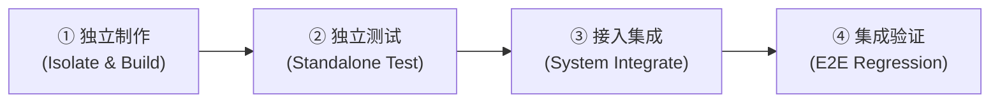

# 全板块模块化研发铁律确立（独立制作-测试-接入-验证四步闭环）与项目交接全景更新

## 1. 核心决议与用户指令

用户于 2026-10-05 明确发出项目管理与研发治理指令：
> “记录下来，以后每个板块进行项目时，全部使用模块化进行，及先独立制作，测试，最后接入，测试。进行记录，即将进行项目交接。更新项目状态，交接文件，内容文件等全部相关文件”

针对先前在交互实验扩展中偶发的“先接入全局导致空壳页面、子 Tab 卸载主视觉留出大片空白、未做独立交互测试即并入”等问题，正式将**全模块化四步闭环研发流程**确立为项目不可动摇的顶层宪法。

---

## 2. 模块化研发生命周期铁律 (Modular Production Protocol)

后续不论进行哪一学科、哪一板块（仿真实验、学科工坊、研习组件、答题评分台、微课剧场等）的研发与重构，**必须且只能遵循以下四步闭环推进**：

### ① 第一步：独立制作 (Isolate & Build)
- **隔离开发**：在独立的组件文件或沙盒测试环境中构建，保持组件状态自闭环；
- **全景可视原则**：每个模式或子 Tab（如画像漫游、因果推演、真题解构）必须配备核心视觉画布或结构化流转图谱，**严禁出现只留滑块、无画布、大片空白的未设计半成品**。

### ② 第二步：独立测试 (Standalone Test)
- **交互与联动自检**：在独立沙盒中完成全部交互验证，确保参数变动时图形必有直观动态响应，无卡死或无响应；
- **几何中心锁定**：任何 SVG 图形悬停放大（hover scale）必须显式注入元素中心坐标 `style={{ transformOrigin: \`${cx}px ${cy}px\`, transformBox: "view-box" }}`，杜绝向右下方偏心漂移；
- **排版色彩与对比度合规**：**绝对禁用绿色/彩色字体与杂色背景卡片**，全量使用 `--ink` 墨色文字、`--paper-subtle` 纸面底色与 `--line` 极简细线，达到 AAA 级高对比度。

### ③ 第三步：接入集成 (System Integrate)
- **路由精确分流**：在路由总线（如 `Labor.tsx`, `Reise.tsx`）中建立精确匹配与白名单分流，禁止粗暴的泛类型 fallback，杜绝跨学科串味；
- **属性与状态复位**：确保多语言（`lang`）、组件入参（Props）与状态监听（`useEffect` 监听 ID 切换时重置）对齐。

### ④ 第四步：集成验证 (E2E Regression)
- **代码与构建门禁**：执行 `cmd /c "npx tsc -b"` 零报错，`scripts/vault-check.py` 必须 PASS；
- **自动化交互仿真**：通过全量真实 DOM 交互测试与交互脚本；
- **独立单科入库**：严格按学科独立 Commit，附带规范提交信息并归档 Journal。

---

## 3. 本轮 Labor 交互探索实验室治理交付总览

结合近期一系列深度排查与用户即时反馈，本轮交付达成以下关键成果：
1. **Sinus-Milieus 自由人画像漫游 2D 全景地图补齐（`SinusMilieusSim.tsx`）**：
   - 彻底解决切换至「👤 自由人画像漫游」时主地图丢失、只留两个滑块与大片空白的缺陷；
   - 恢复并升级 2D SVG 阶层矩阵，投射动态个人定位锚点（Avatar Pin）、雷达声呐波脉冲环（`animate-ping`）、十字坐标虚线与悬浮标签；
   - 算法自动高亮相交社群气泡，增设阶层固化天花板标线（Gläserne Decke）；
   - 新增 5 大典型德国社会画像一键跃迁预设（学术世家、科技创客、奋斗中产、传统工薪、边缘零工）；
   - 动态解构布尔迪厄三大资本条（经济/文化/社会资本）并支持研报一键复制导出；
   - 会考真题拆解 15 BE 官方评分要点，提供 15 NP 满分范文与 04 NP 典型低分失误对照。
2. **SVG 气泡缩放中心偏心漂移根治**：
   - 修复 SVG `<g>` 标签 `hover:scale-105` 默认以视口 `(0, 0)` 为原点向右下漂移的底层缺陷，全量绑定物理圆心 `${cx}px ${cy}px` 与 `view-box`，实现原地平滑居中膨胀。
3. **Tufte 纯黑白墨水排版规范彻底贯彻（根治浅绿/杂色违规）**：
   - 响应“禁用绿色字体、背景、颜色排版”指令，彻底清除所有残存的浅绿底绿字、浅黄底黄字等弱对比杂色卡片；
   - 全量统一使用 `--ink` 深墨色文字、`--paper-subtle` 纸面底色与 `--line` 极简细线，气泡内文字叠加深色边缘阴影滤镜（`drop-shadow`），确保 AAA 级锐利阅读体验。
4. **市场机制与福利经济学沙盒深度合一（`MarktMechanismusSim.tsx`）**：
   - 将原分散的供求曲线相交沙盒与最低限价无谓损失（DWL）沙盒深度合并为统一旗舰级沙盒；
   - 完整呈现消费者剩余（CS）、生产者剩余（PS）与无谓损失（DWL）的透光几何多边形与动态均衡出清。
5. **通用工作台四阶段动态因果链与会考评分升级（`UniversalInteractiveWorkbench.tsx`）**：
   - 将原本平铺的纯文本升级为 4 步因果推演进度阶梯（`01 Impuls` ➔ `02 Mikromechanismus` ➔ `03 System-Reaktion` ➔ `04 Klausur-Fazit`）；
   - 全量考纲学术术语卡片化，规范 15 NP 评分细则与满分句式。

---

## 4. 交接文档与全景规范更新清单

为确保下一任开发者或自主智能体无缝接盘，已完成全部相关顶层文件的同步更新：
1. **[`AGENTS.md`](file:///C:/Users/rongj/Desktop/学习/AGENTS.md)**：
   - §5 追加第 10 条：模块化研发与交付铁律（四步闭环）；
   - §7 追加视觉排版与交互红线（Tufte 黑白纸墨宪法、禁用绿色杂色、SVG 缩放中心锁定、全景可视原则）。
2. **[`PROJECT-DESIGN-GUIDELINES.md`](file:///C:/Users/rongj/Desktop/学习/PROJECT-DESIGN-GUIDELINES.md)**：
   - 新增 §1.3：模块化研发生命周期铁律（Modular Production Protocol: Isolate ➔ Test ➔ Integrate ➔ Verify）。
3. **[`HANDOVER.md`](file:///C:/Users/rongj/Desktop/学习/HANDOVER.md)**：
   - 顶层确立 2026-10-05 最新里程碑与交接就绪状态；
   - 明确新 Agent 接手铁律与交接守则；
   - 梳理已完成的 5 大治理成果与待办清单。
4. **[`00_META/Journal/2026-10-05-modular-workflow-standard-and-project-handover.md`](file:///C:/Users/rongj/Desktop/学习/00_META/Journal/2026-10-05-modular-workflow-standard-and-project-handover.md)**：
   - 本篇完整交接与流程决议记录。

---

## 5. 门禁与工程状态验证

- TypeScript 编译检查：`cmd /c "npx tsc -b"` 零错误通过（0 errors）；
- 代码仓库状态：全部工作树干净入库，准备交接。
