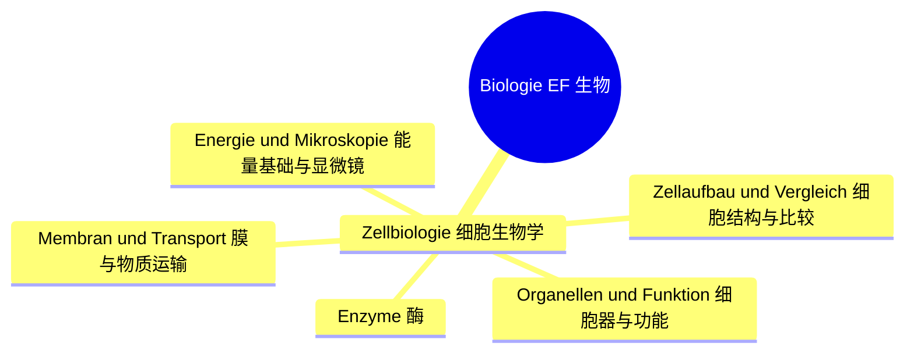
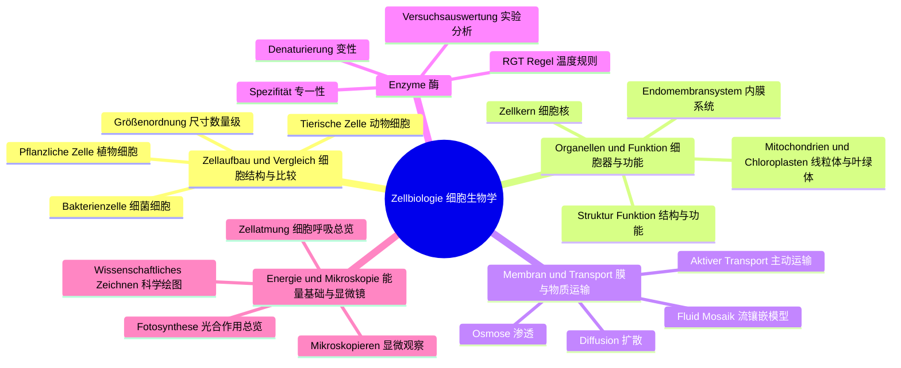

# Lernbaum Biologie EF（生物 EF 学习树）

> 中文导读：EF 生物 = 细胞生物学打地基；画图、术语、实验分析三件套，答题永远走"标注→描述→解释→评价"四步。
> KLP 依据：NRW KLP Biologie 2022。Klausur-Fokus：Material-/Mikroskopbild-Auswertung；Basiskonzepte Struktur-Funktion / Information / Steuerung。

## 1. 总览（L0→L1→L2）

## 2. 分 IF 展开（L1→L2→L3）

### IF 1：Zellbiologie

## 3. 节点明细（中文在上，德语在下）

### IF 1 Zellbiologie（细胞生物学）

#### L2 Zellaufbau und Vergleich（细胞结构与比较）

- **Tierische Zelle（动物细胞）**
  - 中文一句话：无细胞壁无叶绿体，有中心体，细胞膜外即是环境，结构紧凑。
  - `Operatoren: [nennen, beschriften, beschreiben]`
  - `Klausur-Anbindung: 标注图题；Tierzelle beschriften und beschreiben（AFB I）。`
  - `Leitfrage DE / ZH: Woran erkennt man eine Tierzelle? / 如何认出动物细胞？`

- **Pflanzliche Zelle（植物细胞）**
  - 中文一句话：细胞壁、叶绿体、大液泡三件套齐全，光合与支持功能写在结构里。
  - `Operatoren: [beschriften, beschreiben, vergleichen]`
  - `Klausur-Anbindung: 对比题；Pflanzen- vs. Tierzelle vergleichen。`
  - `Leitfrage DE / ZH: Welche Strukturen hat nur die Pflanzenzelle? / 植物细胞独有什么结构？`

- **Bakterienzelle（细菌细胞）**
  - 中文一句话：无成形细胞核、无膜包被细胞器，环状 DNA 游离在细胞质中，虽小但全能。
  - `Operatoren: [beschreiben, vergleichen, begründen]`
  - `Klausur-Anbindung: 比较解释题；Prokaryot vs. Eukaryot begründen。`
  - `Leitfrage DE / ZH: Was fehlt der Bakterienzelle? / 细菌细胞缺什么？`

- **Größenordnung（尺寸数量级）**
  - 中文一句话：纳米到微米的数量级感觉，细胞器大小排序，是读显微镜比例尺的前提。
  - `Operatoren: [angeben, zuordnen, berechnen]`
  - `Klausur-Anbindung: 材料题小问；Größen abschätzen, Maßstab umrechnen。`
  - `Leitfrage DE / ZH: Wie groß ist was in der Zelle? / 细胞里各结构有多大？`

#### L2 Organellen und Funktion（细胞器与功能）

- **Zellkern（细胞核）**
  - 中文一句话：遗传信息库，核膜核孔染色质一套结构，控制细胞活动。
  - `Operatoren: [beschreiben, erklären, beschriften]`
  - `Klausur-Anbindung: 结构→功能题；Kernstruktur mit Informationsfunktion verknüpfen。`
  - `Leitfrage DE / ZH: Wie steuert der Kern die Zelle? / 细胞核如何控制细胞？`

- **Mitochondrien und Chloroplasten（线粒体与叶绿体）**
  - 中文一句话：双层膜加自身 DNA 的半自主细胞器，一个呼吸供能、一个光合造物。
  - `Operatoren: [beschreiben, erklären, vergleichen]`
  - `Klausur-Anbindung: 对比解释题；beide als Energiestationen vergleichen（AFB II）。`
  - `Leitfrage DE / ZH: Was verbindet Mitochondrium und Chloroplast? / 线粒体和叶绿体有什么共同点？`

- **Endomembransystem: ER, Golgi, Vesikel（内膜系统：内质网、高尔基体、囊泡）**
  - 中文一句话：蛋白质合成、加工、运输的分工流水线，膜泡是它们之间的货车。
  - `Operatoren: [beschreiben, erklären, darstellen]`
  - `Klausur-Anbindung: 流程题；Proteinweg durch die Zelle als Fließschema darstellen。`
  - `Leitfrage DE / ZH: Wie reist ein Protein durch die Zelle? / 蛋白质如何在细胞里旅行？`

- **Struktur-Funktion（结构与功能的关系）**
  - 中文一句话：每个结构特征都能找到功能理由，这是生物答题的万能钥匙概念。
  - `Operatoren: [erklären, begründen, bewerten]`
  - `Klausur-Anbindung: 全卷红线；Struktur→Funktion erklären（Basiskonzept!）。`
  - `Leitfrage DE / ZH: Welche Funktion erklärt diese Struktur? / 这个结构对应什么功能？`

#### L2 Membran und Transport（膜与物质运输）

- **Fluid-Mosaik-Modell（流镶嵌模型）**
  - 中文一句话：磷脂双分子层是流动的海，蛋白质是镶嵌的冰山， Choice 透性由此而来。
  - `Operatoren: [beschreiben, darstellen, erklären]`
  - `Klausur-Anbindung: 模型题；Modell skizzieren undSelective Permeabilität erklären。`
  - `Leitfrage DE / ZH: Warum ist die Membran selektiv durchlässig? / 膜为什么选择透过？`

- **Diffusion（扩散）**
  - 中文一句话：粒子从高浓度向低浓度自由运动，不耗能，是被动运输的基础。
  - `Operatoren: [beschreiben, erklären, auswerten]`
  - `Klausur-Anbindung: 实验解读；Diffusionsversuch beschreiben und deuten。`
  - `Leitfrage DE / ZH: Wohin wandern Teilchen von allein? / 粒子自发往哪里走？`

- **Osmose（渗透）**
  - 中文一句话：水分子跨半透膜的扩散，动物细胞会涨破、植物细胞靠壁顶住，原生质体实验即源于此。
  - `Operatoren: [erklären, auswerten, begründen]`
  - `Klausur-Anbindung: 经典实验题；Plasmolyse-Versuch auswerten（AFB II）。`
  - `Leitfrage DE / ZH: Was passiert mit Zellen in Salz- vs. Süßwasser? / 细胞在盐水和清水中分别怎样？`

- **Aktiver Transport（主动运输）**
  - 中文一句话：逆浓度梯度搬运必须耗能，载体蛋白加 ATP，是细胞"花钱买秩序"。
  - `Operatoren: [erklären, vergleichen, begründen]`
  - `Klausur-Anbindung: 对比题；aktiv vs. passiv unterscheiden und begründen。`
  - `Leitfrage DE / ZH: Wann lohnt sich aktiver Transport? / 主动运输何时值得？`

#### L2 Enzyme（酶）

- **Substrat- und Wirkungsspezifität（底物专一性与作用专一性）**
  - 中文一句话：一种酶只认一种底物、只催一种反应，钥匙锁模型解释一切。
  - `Operatoren: [beschreiben, erklären, begründen]`
  - `Klausur-Anbindung: 模型解释题；Schlüssel-Schloss-Prinzip anwenden。`
  - `Leitfrage DE / ZH: Warum passt nur ein Substrat? / 为什么只有一种底物匹配？`

- **RGT-Regel（温度系数规则）**
  - 中文一句话：温度每升十度速率约翻倍，但过高温酶失活，最适温度是折中点。
  - `Operatoren: [auswerten, erklären, deuten]`
  - `Klausur-Anbindung: 曲线分析题；Temperaturoptimum aus Diagramm bestimmen。`
  - `Leitfrage DE / ZH: Warum hat jedes Enzym ein Optimum? / 为什么每种酶都有最适温度？`

- **Denaturierung（变性）**
  - 中文一句话：高温强酸强碱破坏空间结构，酶永久失活，结构决定功能再次应验。
  - `Operatoren: [erklären, begründen, bewerten]`
  - `Klausur-Anbindung: 解释评价题；Denaturierung als Struktur-Funktions-Beweis nutzen。`
  - `Leitfrage DE / ZH: Warum ist Denaturierung meist irreversibel? / 变性为什么多半不可逆？`

- **Versuchsauswertung（酶实验分析）**
  - 中文一句话：控制变量、看气泡看颜色变化，用数据证明酶的特性，图表一个不能少。
  - `Operatoren: [auswerten, deuten, bewerten]`
  - `Klausur-Anbindung: Experiment-Auswertung Pflicht；Enzymversuch mit Kontrolle auswerten。`
  - `Leitfrage DE / ZH: Was beweist der Kontrollansatz? / 对照组证明了什么？`

#### L2 Energie und Mikroskopie（能量基础与显微镜）

- **Zellatmung im Überblick（细胞呼吸总览）**
  - 中文一句话：葡萄糖加氧变二氧化碳加水并释放能量，EF 只要求总览、分步细节留到 Q 阶段。
  - `Operatoren: [nennen, beschreiben, darstellen]`
  - `Klausur-Anbindung: 总反应式题；Wort-/Summen-Gleichung angeben（Ausblick-Niveau）。`
  - `Leitfrage DE / ZH: Woher kommt die Energie der Zelle? / 细胞的能量从哪里来？`

- **Fotosynthese im Überblick（光合作用总览）**
  - 中文一句话：光能变化学能的逆过程，与呼吸构成物质能量循环，EF 点到为止。
  - `Operatoren: [nennen, beschreiben, vergleichen]`
  - `Klausur-Anbindung: 对比题；Fotosynthese vs. Zellatmung gegenüberstellen。`
  - `Leitfrage DE / ZH: Wie hängen Fotosynthese und Atmung zusammen? / 光合与呼吸有什么关系？`

- **Mikroskopieren（显微观察）**
  - 中文一句话：从低倍到高倍、从调焦到制片，规范操作才能看到清晰的细胞。
  - `Operatoren: [beschreiben, auswerten, durchführen]`
  - `Klausur-Anbindung: Mikroskopbild-Auswertung；Präparat beschreiben, Strukturen identifizieren。`
  - `Leitfrage DE / ZH: Wie findet man Zellen im Mikroskop? / 如何在显微镜下找到细胞？`

- **Wissenschaftliches Zeichnen（科学绘图）**
  - 中文一句话：铅笔细线、比例准确、标注线横平竖直，绘图本身就是观察力的考试。
  - `Operatoren: [darstellen, beschriften, bewerten]`
  - `Klausur-Anbindung: 绘图+标注题；Zellzeichnung mit Regeln anfertigen（Darstellungsleistung）。`
  - `Leitfrage DE / ZH: Was macht eine gute Zellzeichnung aus? / 好的细胞绘图标准是什么？`
