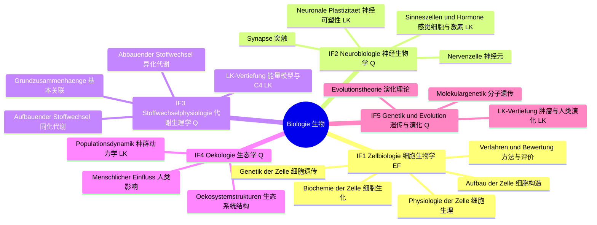
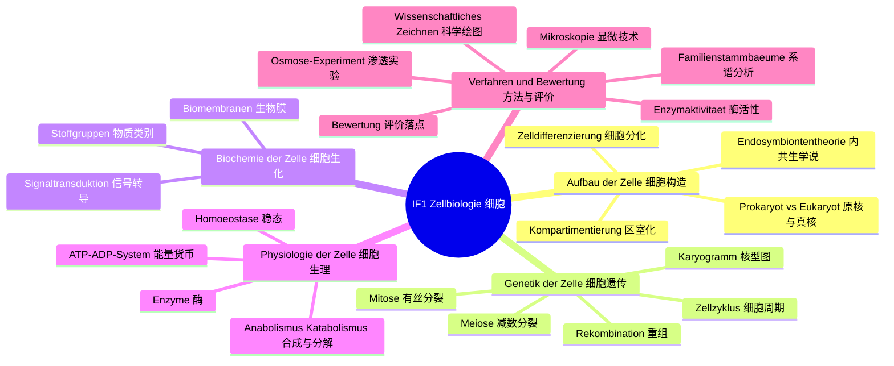
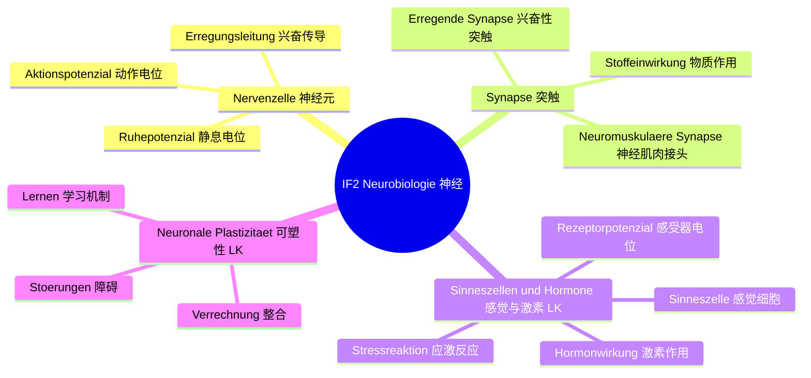
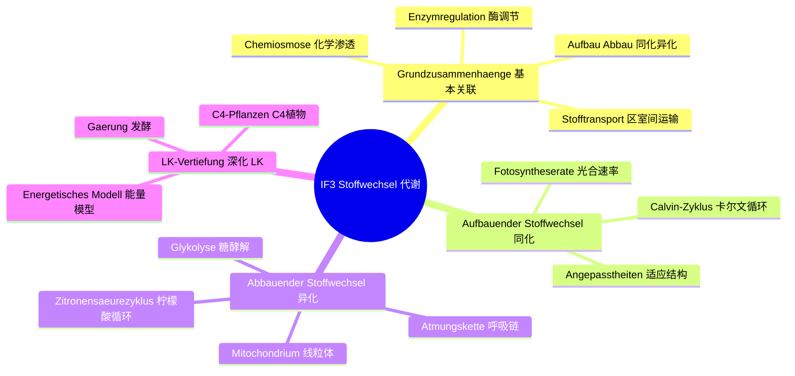
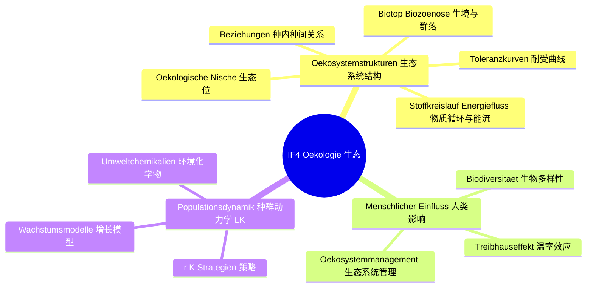
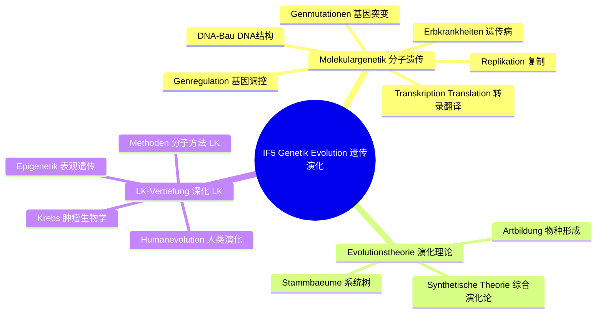

# Lernbaum Biologie（生物学习树 · EF→Abitur）

> 中文一句话：EF 只学「细胞」一个领域（但已暗藏 Meiose / Signaltransduktion / ATP-ADP 等超前接口）；Q 阶段同时打开**神经、代谢、生态、遗传演化**四个尺度差异极大的领域，答题永远走「标注 → 描述 → 解释 → 评价」四步。
> KLP-Basis: NRW KLP Biologie 2022/23（Heft 4722，`gost_klp_bi_2022_06_07_0.pdf`）· Klausur-Fokus: Material-/Mikroskopbild-/Experiment-Auswertung；Abitur 物化生 **4 题选 3**（GK 255 min / LK 300 min）。
> ⚠️ **学段说明**：KLP 原文**只有 EF 与 Qualifikationsphase 两级**，无 Q1/Q2 标记；GK 与 LK **IF 列表完全相同**，仅深度分叉。本树用 `[Q1]`/`[Q2]` 标记是为对接项目体系，实质为「QP 通用」。[已验证]

---

## 0. Methoden-Profil（方法论画像 —— 本设计第二核心）

### ① Abitur 能力权重（AFB 分布）

| AFB | 层级 | 本课权重 | 说明 |
|---|---|---|---|
| I | Reproduktion | ≈20% | 术语、结构标注、流程图复述（`angeben`, `beschreiben`, `skizzieren`） |
| II | Reorganisation und Transfer | ≈50% | **主战场**：材料/实验/图表分析（`analysieren`, `auswerten`, `erklaeren`, `begruenden`, `ermitteln`） |
| III | Reflexion und Problemlösung | ≈30% | 评价与表态（`beurteilen`, `bewerten`, `diskutieren`, `Stellung nehmen`, `entwickeln`） |

> ⚠️ 生物官方 Operatoren 表标注为「**不限**」（所有动词可涉三个 AFB），**不按动词分层级**——这与 Deutsch/Philosophie 逐条给 AFB 区间的编制哲学不同。上表权重为按题型统计的经验分布 [据推断]，不可当作官方规定引用。

### ② 黄金学习法（证据来自 `00_META/Lernmethoden-Evidenz.md`）

| 方法 | 证据来源 | 本课应用方式 |
|---|---|---|
| 检索练习（合书默写） | Dunlosky 2013「hoch」· Karpicke & Blunt 2011（d≈1.0） | 画完细胞图后合书复现结构名；电位曲线合书默画 |
| 分布练习 | Dunlosky 2013「hoch」· FSRS | 术语卡（尤其 QP 的 Neuro/Genetik 术语）按到期制背，拒绝考前突击 |
| 穿插练习 + 对比辨别 | Rohrer & Taylor 2007（d≈1.34）· Foster 2019 双通道 | 混刷「光合 vs 呼吸」「GK vs LK 同一 IF 不同深度」「proximate vs ultimate 解释」 |
| 例题精读 + 带扶手自解释 | Barbieri 2023（g≈0.48）· Wittwer & Renkl 2010 | 新题型（如遗传计算）先精读 1 道正确解法，再问「这一步用了哪条规则」 |
| 一图一概念 | Mayer CTML · Cromley 2025 | 笔记配图只放一张概念图，装饰图不进库 |
| 反馈分层（KR → 延迟展开 → 过程归因） | Brummer 2024（g≈0.41，KR 最强 g≈0.64）· Kandemir | 整套实验分析做完再统一对答案；错因归类「辨别错/知识错/表达错」入 Fehlerlog |

### ③ 三大典型失分点

1. **`Beobachtung` 与 `Deutung` 混为一谈** —— 德国生物答题要求严格分离「我观察到什么」（材料事实）与「我如何解释」（推论），且解释必须**回扣材料**。中国式答题常直接把结论写进描述。
2. **不区分 proximate / ultimate 与 funktional / kausal 解释** —— KLP 明文要求（K7/K8），德国独有能力点。答「为什么」时必须说清是近因（机制）还是终极原因（演化适应值）。
3. **`Bewertung` 写成学科内评判** —— `beurteilen` 是 Sachurteil（专业标准内的事实判断），`bewerten` 是 Werturteil（须考量社会价值与规范）。LK 还要求**多视角 + 利益相关方**分析。

### ④ 本课笔记结构模板（八段）

```
1. 现象/材料（Beobachtung，只写看到什么，不加解释）
2. 术语与结构（Fachbegriffe，标注德语原文）
3. 机制解释（Deutung，分 proximate / ultimate 或 kausal / funktional）
4. 结构→功能对应（Basiskonzept 1：Struktur und Funktion）
5. 定量部分（数据/计算/图表，标注单位与来源）
6. 方法论反思（该方法能证明什么、不能证明什么）
7. 评价层（Sachurteil 与 Werturteil 分开写）
8. Klausur-Satz（德语成句，可直接进答卷）
```

### ⑤ Basiskonzepte 五轴追踪表（跨 IF 横切索引）

> 生物独有第三维（源自 KMK Bildungsstandards），比 IF 更适合做 Anki 分组维度。

| # | Basiskonzept | 中文 | 本树中的主要落点 |
|---|---|---|---|
| 1 | `Struktur und Funktion` | 结构与功能 | 细胞器 / 膜 / 突触 / 叶绿体线粒体 / 器官适应 |
| 2 | `Stoff- und Energieumwandlung` | 物质与能量转化 | ATP-ADP / 光合 / 呼吸 / 化学渗透 / 生态能量流 |
| 3 | `Information und Kommunikation` | 信息与交流 | Signaltransduktion / 电位 / 突触 / DNA / 基因调控 |
| 4 | `Steuerung und Regelung` | 调控与调节 | Zellzyklus / 酶调节 / Homöostase / 激素 / 种群调节 |
| 5 | `individuelle und evolutive Entwicklung` | 个体与演化发育 | Zelldifferenzierung / Meiose / 演化论 / 人类演化 |

---

## 1. 总览 Gesamtübersicht（L0→L1→L2）


```mermaid
mindmap
  root((Biologie 生物))
    IF1 Zellbiologie 细胞生物学 EF
      Aufbau der Zelle 细胞构造
      Genetik der Zelle 细胞遗传
      Biochemie der Zelle 细胞生化
      Physiologie der Zelle 细胞生理
      Verfahren und Bewertung 方法与评价
    IF2 Neurobiologie 神经生物学 Q
      Nervenzelle 神经元
      Synapse 突触
      Sinneszellen und Hormone 感觉细胞与激素 LK
      Neuronale Plastizitaet 神经可塑性 LK
    IF3 Stoffwechselphysiologie 代谢生理学 Q
      Grundzusammenhaenge 基本关联
      Aufbauender Stoffwechsel 同化代谢
      Abbauender Stoffwechsel 异化代谢
      LK-Vertiefung 能量模型与C4 LK
    IF4 Oekologie 生态学 Q
      Oekosystemstrukturen 生态系统结构
      Menschlicher Einfluss 人类影响
      Populationsdynamik 种群动力学 LK
    IF5 Genetik und Evolution 遗传与演化 Q
      Molekulargenetik 分子遗传
      Evolutionstheorie 演化理论
      LK-Vertiefung 肿瘤与人类演化 LK
```

---

## 2. 分 IF 展开（L1→L2→L3 + 应试四行）

### L1: IF1 Zellbiologie（细胞生物学）· **EF 唯一 IF**


```mermaid
mindmap
  root((IF1 Zellbiologie 细胞))
    Aufbau der Zelle 细胞构造
      Prokaryot vs Eukaryot 原核与真核
      Kompartimentierung 区室化
      Endosymbiontentheorie 内共生学说
      Zelldifferenzierung 细胞分化
    Genetik der Zelle 细胞遗传
      Mitose 有丝分裂
      Zellzyklus 细胞周期
      Meiose 减数分裂
      Rekombination 重组
      Karyogramm 核型图
    Biochemie der Zelle 细胞生化
      Stoffgruppen 物质类别
      Biomembranen 生物膜
      Signaltransduktion 信号转导
    Physiologie der Zelle 细胞生理
      ATP-ADP-System 能量货币
      Anabolismus Katabolismus 合成与分解
      Enzyme 酶
      Homoeostase 稳态
    Verfahren und Bewertung 方法与评价
      Mikroskopie 显微技术
      Familienstammbaeume 系谱分析
      Osmose-Experiment 渗透实验
      Enzymaktivitaet 酶活性
      Wissenschaftliches Zeichnen 科学绘图
      Bewertung 评价落点
```

#### L2 Aufbau der Zelle（细胞构造）

- **Prokaryot vs Eukaryot（原核与真核）** `[EF]`
  - 中文一句话：有无成形细胞核与膜包被细胞器，是生命世界的第一次大分流。
  - Klausur-Anbindung：标注图题 + 比较题；`Prokaryot und Eukaryot vergleichen und begruenden`（AFB I→II）。
  - Operatoren：`beschreiben`, `vergleichen`, `begruenden`, `zeichnen`
  - Lernweg ZH：画一张并排对比图（一图一概念，Mayer CTML），标出 5 个差异点后合书复现（检索练习）。
  - Fehlerquelle：只说「细菌没有细胞核」而漏掉「无膜包被细胞器」；忘记核糖体两者都有。
  - 📓 笔记：✅ [`Zellbiologie-Grundlagen.md`](../../../06_Bio/Zellbiologie-Grundlagen.md)（部分覆盖）
- **Kompartimentierung（区室化）** `[EF]`
  - 中文一句话：用膜把细胞分成不同功能区，使互斥的化学反应可以同时进行。
  - Klausur-Anbindung：解释题；`Kompartimentierung als Struktur-Funktions-Prinzip erklaeren`（AFB II）。
  - Operatoren：`erklaeren`, `erläutern`, `begruenden`
  - Lernweg ZH：用「为什么不能把所有酶混在一起」这个自我解释问题切入（Self-Explanation）。
  - Fehlerquelle：把区室化只当作「分隔」而漏掉「功能专一化 + 反应条件隔离」两层含义。
  - 📓 笔记：⚠️ 缺口
- **Endosymbiontentheorie（内共生学说）** `[EF]`
  - 中文一句话：线粒体和叶绿体源自被吞入的独立细菌，双膜与自身 DNA 是证据。
  - Klausur-Anbindung：证据链论证题；`Endosymbiontentheorie mit Belegen darstellen`（AFB II）。
  - Operatoren：`darstellen`, `begruenden`, `beurteilen`
  - Lernweg ZH：把 5 条证据（双膜、环状 DNA、核糖体、分裂方式、抗生素敏感性）做成证据卡，用「哪条最有力」做对比辨别。
  - Fehlerquelle：罗列证据但不排序；不知道「双膜」是**最直接**的证据。
  - 📓 笔记：⚠️ 缺口
- **Zelldifferenzierung und Arbeitsteilung（细胞分化与分工）** `[EF]`
  - 中文一句话：同一套基因组，不同细胞只表达其中一部分，于是有了分工。
  - Klausur-Anbindung：多细胞生物解释题；`Differenzierung durch Genregulation erklaeren`（AFB II）。
  - Operatoren：`erklaeren`, `begruenden`, `beurteilen`
  - Lernweg ZH：用「为什么神经细胞和肌肉细胞 DNA 一样却长得不同」做先行组织者。
  - Fehlerquelle：误以为分化是「基因丢失」，实际是**选择性表达**。
  - 📓 笔记：⚠️ 缺口

#### L2 Genetik der Zelle（细胞遗传）

> ⚠️ **注意**：EF 已含 Meiose / Rekombination / Karyogramm —— 这些直觉上属「遗传」，但 KLP 明确放在 EF 的 Zellbiologie 里，因为它们是**细胞层面**的机制。这直接决定了 EF→Q 的台阶性质。

- **Mitose（有丝分裂）** `[EF]`
  - 中文一句话：染色体复制后均等分配，保证子细胞基因相同，是多细胞生物生长的基础。
  - Klausur-Anbindung：分相描述 + 图序题；`Mitosephasen beschreiben und ordnen`（AFB I）。
  - Operatoren：`beschreiben`, `ordnen`, `zeichnen`, `skizzieren`
  - Lernweg ZH：按「前期-中期-后期-末期」做四格图 + 合书默画（检索练习 + 一图一概念）。
  - Fehlerquelle：把中期与后期染色体数搞混；忽略细胞骨架（Cytoskelett）在纺锤体形成中的作用。
  - 📓 笔记：⚠️ 缺口（现有 Zellbiologie-Grundlagen 仅提 Mikroskop/Skala）
- **Zellzyklus und Regulation（细胞周期与调控）** `[EF]`
  - 中文一句话：分裂不是想分就分，检查点（Checkpoints）把住了周期各阶段的关卡。
  - Klausur-Anbindung：机制解释题；`Regulation des Zellzyklus und Folgen von Stoerungen`（AFB II→III）。
  - Operatoren：`erklaeren`, `begruenden`, `beurteilen`
  - Lernweg ZH：把周期画成环形图 + 标检查点，再连到「失控 = 肿瘤」这个结局（先行组织者）。
  - Fehlerquelle：漏掉检查点概念，导致无法解释后续的 Zytostatika 评价题。
  - 📓 笔记：⚠️ 缺口
- **Meiose（减数分裂）** `[EF]`
  - 中文一句话：一次复制两次分裂，染色体数减半并产生重组，是性繁殖的核心机制。
  - Klausur-Anbindung：与 Mitose 对比题；`Meiose und Mitose vergleichen`（AFB II）。
  - Operatoren：`beschreiben`, `vergleichen`, `zeichnen`, `begruenden`
  - Lernweg ZH：做「Mitose vs Meiose」三栏对比表（染色体数/分裂次数/产物），交错练习。
  - Fehlerquelle：混淆「同源染色体分离」（减数第一次）与「姐妹染色单体分离」（减数第二次）。
  - 📓 笔记：⚠️ 缺口
  - 🇨🇳 CN-Methode：**遗传图解三步程序（分离 → 组合 → 配子）** · DE-Anschluss: Meiose + Rekombination（EF 已教） · 合规性: ✅
  - 备注：中国必修2 对减数分裂的概率推演训练密度极高，德国 EF 只要求「描述机制」。这是**零新知识**的纯技法嫁接。
- **Rekombination（重组）** `[EF]`
  - 中文一句话：交叉互换把父母染色体片段重新拼装，是遗传多样性的第一来源。
  - Klausur-Anbindung：与变异来源结合的解释题；`Rekombination als Quelle genetischer Vielfalt`（AFB II）。
  - Operatoren：`erklaeren`, `begruenden`, `beurteilen`
  - Lernweg ZH：画交叉互换示意图，连到「为什么兄弟姐妹不相同」。
  - Fehlerquelle：只说「交换片段」而不说它发生在**同源染色体非姐妹染色单体**之间。
  - 📓 笔记：⚠️ 缺口
- **Karyogramm, Genom- und Chromosomenmutationen（核型图与突变类型）** `[EF]`
  - 中文一句话：把染色体按大小排好就能看出数目或结构异常，如三体综合征。
  - Klausur-Anbindung：读图诊断题；`Karyogramm auswerten und Mutationstyp benennen`（AFB II）。
  - Operatoren：`auswerten`, `angeben`, `erklaeren`, `beurteilen`
  - Lernweg ZH：做「正常 vs 异常核型」对比辨别训练；把 Genom-/Chromosomen-/Genmutation 三类做成三分表。
  - Fehlerquelle：把 Genommutation（数目）与 Chromosomenmutation（结构）搞混。
  - 📓 笔记：⚠️ 缺口
  - 🇨🇳 CN-Methode：**系谱分析两步判定 + 概率尾巴** · DE-Anschluss: EF 明文点名 `Analyse von Familienstammbäumen` · 合规性: ✅
  - 备注：中国把「显隐判定 → 概率计算」流程化，德国只要求「分析」不要求计算体系。可直接补 EF 空缺。

#### L2 Biochemie der Zelle（细胞生化）

- **Stoffgruppen（物质类别：糖/脂/蛋白质）** `[EF]`
  - 中文一句话：三大类有机物各有一套单体—聚合物逻辑，结构决定它们在细胞里干什么。
  - Klausur-Anbindung：结构-功能题；`Stoffgruppen und ihre Funktionen zuordnen`（AFB I→II）。
  - Operatoren：`angeben`, `ordnen`, `beschreiben`, `begruenden`
  - Lernweg ZH：做「单体—聚合物—功能」三列卡，用 Anki 分布练习。
  - Fehlerquelle：蛋白质只说「氨基酸组成」而漏掉「空间结构决定功能」这一层。
  - 📓 笔记：⚠️ 缺口
- **Biomembranen: Transport（生物膜与运输）** `[EF]`
  - 中文一句话：流动镶嵌模型解释了膜为什么是选择透过性的——磷脂海洋 + 蛋白冰山。
  - Klausur-Anbindung：模型图 + 机制题；`Fluid-Mosaik-Modell skizzieren und Transportmechanismen unterscheiden`（AFB II）。
  - Operatoren：`skizzieren`, `erklaeren`, `vergleichen`, `begruenden`
  - Lernweg ZH：先精读一道正确解法（Barbieri 例题），再画被动/主动运输对比图。
  - Fehlerquelle：把「主动运输」与「促进扩散」混为一谈（后者不耗能）。
  - 📓 笔记：✅ [`Biomembran-Transportmechanismen-und-Osmose.md`](../../../06_Bio/Biomembran-Transportmechanismen-und-Osmose.md)
- **Signaltransduktion und Zell-Zell-Erkennung（信号转导与细胞识别）** `[EF]`
  - 中文一句话：信号分子结合受体 → 级联放大 → 细胞响应，是细胞间「对话」的分子基础。
  - Klausur-Anbindung：流程解释题；`Signaltransduktion am Beispiel erklaeren`（AFB II）。
  - Operatoren：`erklaeren`, `erläutern`, `begruenden`
  - Lernweg ZH：画「信号—受体—级联—响应」四段流程图，标注放大效应。
  - Fehlerquelle：漏掉「级联放大」这一关键特征，只说「信号传进去」。
  - 📓 笔记：⚠️ 缺口
  - 🇨🇳 CN-Methode：**物质与能量收支表法（Bilanz）** · DE-Anschluss: ATP-ADP + 酶动力学（EF 已教） · 合规性: ⚠️ 定量边界
  - 备注：中国的定量收支训练很强，但德国 GK 只要求定性，**定量集中在 LK 能量模型**——GK 用此技法时须避免超纲。

#### L2 Physiologie der Zelle（细胞生理）

- **ATP-ADP-System und Redoxreaktionen（能量货币与氧化还原）** `[EF]`
  - 中文一句话：ATP 是可充电的「能量电池」，氧化还原反应是充放电的分子机制。
  - Klausur-Anbindung：机制题；`ATP-ADP-System und Redoxreaktionen erklaeren`（AFB II）。
  - Operatoren：`erklaeren`, `darstellen`, `begruenden`
  - Lernweg ZH：把 ATP 循环画成充放电示意图（一图一概念），连到后续光合/呼吸。
  - Fehlerquelle：不知道 NAD+/NADH 是电子载体，导致后续呼吸链学不通。
  - 📓 笔记：⚠️ 缺口
  - 🇨🇳 CN-Methode：**曲线三看法（走向 / 极值 / 因果）** · DE-Anschluss: `Enzymkinetik` 曲线（EF 已教） · 合规性: ✅
  - 备注：中国把「看曲线」流程化（先看趋势 → 找极值 → 归因），命中德国 EF 的 `RGT-Regel` 与 Q 的 `Abhängigkeit der Fotosyntheserate`。
- **Anabolismus und Katabolismus（合成与分解代谢）** `[EF]`
  - 中文一句话：一个耗能建大分子，一个放能拆大分子，两者在细胞里动态平衡。
  - Klausur-Anbindung：对比题；`Anabolismus und Katabolismus gegenüberstellen`（AFB II）。
  - Operatoren：`vergleichen`, `darstellen`, `erklaeren`
  - Lernweg ZH：做二栏对比表，连到「为什么运动时两者同时进行」。
  - Fehlerquelle：误以为合成与分解互斥（实际同时进行、动态平衡）。
  - 📓 笔记：⚠️ 缺口
- **Enzyme: Kinetik und Regulation（酶动力学与调控）** `[EF]`
  - 中文一句话：酶降低活化能，其活性受温度/pH/抑制剂调控，是细胞代谢的总开关。
  - Klausur-Anbindung：曲线分析 + 实验题；`Enzymaktivitaet in Abhaengigkeit von Faktoren auswerten`（AFB II）。
  - Operatoren：`auswerten`, `erklaeren`, `ermitteln`, `beurteilen`
  - Lernweg ZH：RGT-Regel 曲线 + 最适温度/最适 pH，用「先看趋势再找极值」的曲线三看法。
  - Fehlerquelle：把「变性」（结构破坏，不可逆）与「抑制」（可逆）混为一谈。
  - 📓 笔记：⚠️ 缺口（这是 EF 最重要的缺口之一）
- **Homöostase（稳态）** `[EF]`
  - 中文一句话：细胞通过渗透调节等机制维持内部环境稳定，是生命的基本特征。
  - Klausur-Anbindung：渗透实验分析题；`Osmotische Vorgaenge auswerten`（AFB II）。
  - Operatoren：`auswerten`, `erklaeren`, `begruenden`
  - Lernweg ZH：质壁分离与复原实验（Plasmolyse/Deplasmolyse），做变量控制四问。
  - Fehlerquelle：只描述现象（细胞皱缩）而不解释渗透压差。
  - 📓 笔记：✅ [`Biomembran-Transportmechanismen-und-Osmose.md`](../../../06_Bio/Biomembran-Transportmechanismen-und-Osmose.md)
  - 🇨🇳 CN-Methode：**实验设计四问法（变量 / 对照 / 预测 / 局限性）** · DE-Anschluss: `Untersuchung von osmotischen Vorgängen`（EF 明文） · 合规性: ✅
  - 备注：直击德国 `Aufgabenart II` 主战场，也补中国学生「不缺操作、缺论证设计」的短板。

#### L2 Verfahren und Bewertung（方法与评价）

- **Mikroskopie（显微技术）** `[EF]`
  - 中文一句话：从低倍到高倍、从调焦到制片，规范操作才能看到清晰结构。
  - Klausur-Anbindung：显微图分析题；`Mikroskopbild auswerten und Strukturen identifizieren`（AFB II）。
  - Operatoren：`beschreiben`, `auswerten`, `angeben`
  - Lernweg ZH：把「操作步骤」做成有序卡，用合书复述检验。
  - Fehlerquelle：忽略比例尺换算（尺寸数量级）。
  - 📓 笔记：✅ [`Zellbiologie-Grundlagen.md`](../../../06_Bio/Zellbiologie-Grundlagen.md)
- **Analyse von Familienstammbäumen（系谱分析）** `[EF]`
  - 中文一句话：用家系图反推遗传方式（显/隐、常/性染色体），是遗传学的侦探工作。
  - Klausur-Anbindung：系谱推演题；`Erbgang bestimmen und begruenden`（AFB II）。
  - Operatoren：`auswerten`, `begruenden`, `ermitteln`, `beurteilen`
  - Lernweg ZH：**两步判定法**——先判显隐（看「无中生有」）→ 再判染色体位置（看性别分布）。
  - Fehlerquelle：不写推理依据直接给结论（德国要求 `begruenden`）。
  - 📓 笔记：⚠️ 缺口
  - 🇨🇳 CN-Methode：**系谱分析两步判定 + 概率尾巴** · DE-Anschluss: EF 明文点名 `Analyse von Familienstammbäumen` · 合规性: ✅
  - 备注：中国把判定流程化到「一眼判显隐」，德国只要求「分析」，流程化可显著提速。
- **Untersuchung von Enzymaktivitäten（酶活性实验）** `[EF]`
  - 中文一句话：控制变量、看气泡或颜色变化，用数据证明酶的特性。
  - Klausur-Anbindung：实验分析必考；`Enzymversuch mit Kontrollansatz auswerten`（AFB II）。
  - Operatoren：`auswerten`, `planen`, `beurteilen`
  - Lernweg ZH：实验设计四问法 + 曲线三看法组合使用。
  - Fehlerquelle：不会指出「对照组证明了什么」。
  - 📓 笔记：⚠️ 缺口
- **Wissenschaftliches Zeichnen（科学绘图）** `[EF]`
  - 中文一句话：铅笔细线、比例准确、标注横平竖直，绘图本身就是观察力考试。
  - Klausur-Anbindung：绘图 + 标注题（计入 Darstellungsleistung）；`Zellzeichnung nach Regeln anfertigen`（AFB I）。
  - Operatoren：`zeichnen`, `skizzieren`, `angeben`
  - Lernweg ZH：按「轮廓 → 内部结构 → 标注线 → 标题」四步练，用尺规标准自评。
  - Fehlerquelle：标注线交叉、比例失真、忘写放大倍数。
  - 📓 笔记：✅ [`Zellbiologie-Grundlagen.md`](../../../06_Bio/Zellbiologie-Grundlagen.md)
- **Bewertung: Zytostatika / embryonale Stammzellen（评价落点）** `[EF]`
  - 中文一句话：细胞分裂抑制剂与胚胎干细胞的两大伦理争议，是 EF 的评价题落点。
  - Klausur-Anbindung：评价/表态题；`Chancen und Risiken multiperspektivisch beurteilen`（AFB III）。
  - Operatoren：`beurteilen`, `bewerten`, `Stellung nehmen`, `diskutieren`
  - Lernweg ZH：**Bewertung 多视角清单**（价值 / 规范 / 事实三分），先列视角再表态。
  - Fehlerquelle：只给立场不给标准；把 Sachurteil 与 Werturteil 混写。
  - 📓 笔记：⚠️ 缺口

---

### L1: IF2 Neurobiologie（神经生物学）· **Q 阶段**


```mermaid
mindmap
  root((IF2 Neurobiologie 神经))
    Nervenzelle 神经元
      Ruhepotenzial 静息电位
      Aktionspotenzial 动作电位
      Erregungsleitung 兴奋传导
    Synapse 突触
      Erregende Synapse 兴奋性突触
      Stoffeinwirkung 物质作用
      Neuromuskulaere Synapse 神经肌肉接头
    Sinneszellen und Hormone 感觉与激素 LK
      Sinneszelle 感觉细胞
      Rezeptorpotenzial 感受器电位
      Hormonwirkung 激素作用
      Stressreaktion 应激反应
    Neuronale Plastizitaet 可塑性 LK
      Verrechnung 整合
      Lernen 学习机制
      Stoerungen 障碍
```

#### L2 Nervenzelle（神经元）

- **Ruhepotenzial（静息电位）** `[Q1]`
  - 中文一句话：膜内外离子浓度差 + 选择性通透，造成约 −70 mV 的静息电位。
  - Klausur-Anbindung：机制解释题；`Entstehung des Ruhepotenzials erklaeren`（AFB II）。
  - Operatoren：`erklaeren`, `begruenden`, `darstellen`
  - Lernweg ZH：画膜剖面图标 Na+/K+ 泵与漏通道，连到「为什么内负外正」。
  - Fehlerquelle：漏掉 Na+/K+-ATPase 的主动泵角色，只说「离子浓度差」。
  - 📓 笔记：⚠️ 缺口
- **Aktionspotenzial（动作电位）** `[Q1]`
  - 中文一句话：阈值刺激触发 Na+ 内流→去极化→K+ 外流→复极化，全或无。
  - Klausur-Anbindung：曲线分析题；`Aktionspotenzial auswerten und Phasen erklaeren`（AFB II）。
  - Operatoren：`auswerten`, `erklaeren`, `ermitteln`
  - Lernweg ZH：电位曲线三看法（走向 → 极值 → 因果），合书默画曲线（检索练习）。
  - Fehlerquelle：把「去极化」与「超极化」方向搞反；不知道「全或无」原则。
  - 📓 笔记：⚠️ 缺口
- **Erregungsleitung（兴奋传导）** `[Q1]`
  - 中文一句话：无髓鞘连续传导慢，有髓鞘跳跃式传导快，髓鞘是速度的关键。
  - Klausur-Anbindung：比较题；`kontinuierliche und saltatorische Erregungsleitung vergleichen`（AFB II）。
  - Operatoren：`vergleichen`, `erklaeren`, `begruenden`
  - Lernweg ZH：做两栏对比表 + 连到「多发性硬化症为什么致病」。
  - Fehlerquelle：只说「髓鞘加快」而不解释跳跃式传导的机制。
  - 📓 笔记：⚠️ 缺口

#### L2 Synapse（突触）

- **Erregende chemische Synapse（兴奋性化学突触）** `[Q1]`
  - 中文一句话：电信号 → 递质释放 → 跨突触间隙 → 后膜电位，是神经元间的「换乘站」。
  - Klausur-Anbindung：流程 + 机制题；`Signaluebertragung an der Synapse erklaeren`（AFB II）。
  - Operatoren：`erklaeren`, `darstellen`, `begruenden`
  - Lernweg ZH：画突触六步流程（动作电位→Ca2+内流→胞吐→结合受体→后膜电位→降解/重摄取）。
  - Fehlerquelle：漏掉 Ca2+ 内流这一步；不知道递质清除的两种方式。
  - 📓 笔记：⚠️ 缺口
  - 🇨🇳 CN-Methode：**物质与能量收支表法（Bilanz）** · DE-Anschluss: Signaltransduktion（EF 已教） · 合规性: ✅
  - 备注：突触传递是 EF `Signaltransduktion` 的直接下游，**无需新知识作桥**。
- **Stoffeinwirkung an Synapsen（物质对突触的作用）** `[Q1]`
  - 中文一句话：药物/毒物通过影响递质释放、受体结合或降解来改变信号传递。
  - Klausur-Anbindung：材料分析题；`Wirkung von Substanzen an der Synapse beurteilen`（AFB II→III）。
  - Operatoren：`analysieren`, `beurteilen`, `begruenden`
  - Lernweg ZH：做「作用位点 → 效果」映射表，用对比辨别练不同药物机制。
  - Fehlerquelle：不区分「激动剂」与「拮抗剂」。
  - 📓 笔记：⚠️ 缺口
- **Neuromuskuläre Synapse（神经肌肉接头）** `[Q1]`
  - 中文一句话：运动神经末梢释放乙酰胆碱，使肌纤维去极化并收缩。
  - Klausur-Anbindung：应用解释题；`Erregungsübertragung auf die Muskelfaser erklaeren`（AFB II）。
  - Operatoren：`erklaeren`, `begruenden`, `beurteilen`
  - Lernweg ZH：连到「箭毒为什么致麻痹」（拮抗剂实例）。
  - Fehlerquelle：把它与普通突触混同（受体类型不同：烟碱型）。
  - 📓 笔记：⚠️ 缺口

#### L2 Sinneszellen und Hormone（感觉细胞与激素）· **LK 增量**

- **Primäre und sekundäre Sinneszelle（原发与继发感觉细胞）** `[LK]`
  - 中文一句话：原发感觉细胞本身是神经元，继发感觉细胞需先换能再传突触。
  - Klausur-Anbindung：比较题；`Sinneszelltypen vergleichen und Rezeptorpotenzial erklaeren`（AFB II）。
  - Operatoren：`vergleichen`, `erklaeren`, `begruenden`
  - Lernweg ZH：做两类细胞对比表 + 各配一个实例（如视杆细胞 vs 毛细胞）。
  - Fehlerquelle：搞混哪类直接产生动作电位、哪类先产生感受器电位。
  - 📓 笔记：⚠️ 缺口
- **Rezeptorpotenzial（感受器电位）** `[LK]`
  - 中文一句话：刺激强度决定感受器电位大小（分级电位），可叠加后触发动作电位。
  - Klausur-Anbindung：机制 + 曲线题；`Rezeptorpotenzial und Codierung der Reizstärke`（AFB II）。
  - Operatoren：`erklaeren`, `auswerten`, `begruenden`
  - Lernweg ZH：连到「刺激强度如何被编码为动作电位频率」这一核心问题。
  - Fehlerquelle：误以为感受器电位也遵循「全或无」。
  - 📓 笔记：⚠️ 缺口
- **Hormone und Verschränkung（激素与神经调控交织）** `[LK]`
  - 中文一句话：激素经血液慢而广地调节，与神经的快而准形成互补与交织。
  - Klausur-Anbindung：综合题；`Verschraenkung hormoneller und neuronaler Steuerung`（AFB II）。
  - Operatoren：`erklaeren`, `darstellen`, `beurteilen`
  - Lernweg ZH：画「神经-激素双通路」对照图，用 Stressreaktion 做整合案例。
  - Fehlerquelle：把两套系统完全割裂，看不到下丘脑-垂体的桥梁作用。
  - 📓 笔记：⚠️ 缺口
- **Stressreaktion（应激反应）** `[LK]`
  - 中文一句话：下丘脑-垂体-肾上腺轴与交感神经协同，构成应激的神经-激素范例。
  - Klausur-Anbindung：综合案例分析；`Stressreaktion als Beispiel der Verschränkung`（AFB II）。
  - Operatoren：`erklaeren`, `beurteilen`, `bewerten`
  - Lernweg ZH：做「刺激 → 两条通路 → 生理反应」流程图。
  - Fehlerquelle：只写肾上腺素通路，漏掉皮质醇（HPA 轴）。
  - 📓 笔记：⚠️ 缺口

#### L2 Neuronale Plastizität（神经可塑性）· **LK 增量**

- **Verrechnung: Summation und hemmende Synapse（整合：总和与抑制性突触）** `[LK]`
  - 中文一句话：兴奋与抑制信号在时空上叠加，决定神经元是否发放。
  - Klausur-Anbindung：机制题；`raeumliche und zeitliche Summation erklaeren`（AFB II）。
  - Operatoren：`erklaeren`, `darstellen`, `begruenden`
  - Lernweg ZH：画时间/空间总和示意图（一图一概念）。
  - Fehlerquelle：混淆空间总和（多处同时）与时间总和（同一处连续）。
  - 📓 笔记：⚠️ 缺口
- **Zelluläre Prozesse des Lernens（学习的细胞机制）** `[LK]`
  - 中文一句话：突触强度可被经验改变（LTP/LTD），这是记忆的物质基础。
  - Klausur-Anbindung：机制解释题；`synaptische Plastizitaet als Grundlage des Lernens`（AFB II）。
  - Operatoren：`erklaeren`, `begruenden`, `beurteilen`
  - Lernweg ZH：连到「为什么反复练习能记住」——把学习方法本身变成生物学案例。
  - Fehlerquelle：不知道 LTP 与谷氨酸受体的关系。
  - 📓 笔记：⚠️ 缺口
- **Störungen des neuronalen Systems（神经系统障碍）** `[LK]`
  - 中文一句话：从突触层面理解神经退行性疾病与药物依赖。
  - Klausur-Anbindung：评价题；`Stoerungen analysieren und individuelle/soziale Folgen beurteilen`（AFB III）。
  - Operatoren：`analysieren`, `beurteilen`, `bewerten`, `diskutieren`
  - Lernweg ZH：用 Bewertung 多视角清单（个体 / 社会 / 伦理）。
  - Fehlerquelle：只描述症状不给机制；评价时只站一个视角。
  - 📓 笔记：⚠️ 缺口

---

### L1: IF3 Stoffwechselphysiologie（代谢生理学）· **Q 阶段**


```mermaid
mindmap
  root((IF3 Stoffwechsel 代谢))
    Grundzusammenhaenge 基本关联
      Aufbau Abbau 同化异化
      Enzymregulation 酶调节
      Stofftransport 区室间运输
      Chemiosmose 化学渗透
    Aufbauender Stoffwechsel 同化
      Angepasstheiten 适应结构
      Fotosyntheserate 光合速率
      Calvin-Zyklus 卡尔文循环
    Abbauender Stoffwechsel 异化
      Mitochondrium 线粒体
      Glykolyse 糖酵解
      Zitronensaeurezyklus 柠檬酸循环
      Atmungskette 呼吸链
    LK-Vertiefung 深化 LK
      Energetisches Modell 能量模型
      C4-Pflanzen C4植物
      Gaerung 发酵
```

#### L2 Grundlegende Zusammenhänge（基本关联）

- **Zusammenhang aufbauender und abbauender Stoffwechsel（同化与异化的关联）** `[Q1]`
  - 中文一句话：合成与分解在能量与物质上互相耦合，构成细胞代谢的整体。
  - Klausur-Anbindung：综合题；`Zusammenhang von Anabolismus und Katabolismus darstellen`（AFB II）。
  - Operatoren：`darstellen`, `erklaeren`, `begruenden`
  - Lernweg ZH：画一张「能量流 + 物质流」双轨总图（一图一概念）。
  - Fehlerquelle：把两者看成独立过程。
  - 📓 笔记：⚠️ 缺口
- **Stoffwechselregulation auf Enzymebene（酶水平的代谢调控）** `[Q1]`
  - 中文一句话：通过酶的活性调节（如变构、抑制）控制代谢通路的速度。
  - Klausur-Anbindung：机制题；`Regulation auf Enzymebene erklaeren`（AFB II）。
  - Operatoren：`erklaeren`, `begruenden`, `beurteilen`
  - Lernweg ZH：连到 EF 的酶动力学，做「EF→Q」纵向延伸。
  - Fehlerquelle：不知道反馈抑制（Endprodukthemmung）。
  - 📓 笔记：⚠️ 缺口
- **Stofftransport zwischen Kompartimenten（区室间物质运输）** `[Q1]`
  - 中文一句话：代谢物在细胞器与细胞质之间的穿梭是代谢有序进行的前提。
  - Klausur-Anbindung：解释题；`Stofftransport zwischen Kompartimenten`（AFB II）。
  - Operatoren：`erklaeren`, `darstellen`, `begruenden`
  - Lernweg ZH：连到 EF 的区室化与膜运输。
  - Fehlerquelle：忽略转运蛋白的专一性。
  - 📓 笔记：⚠️ 缺口
- **Chemiosmotische ATP-Bildung（化学渗透 ATP 生成）** `[Q1]`
  - 中文一句话：跨膜质子梯度驱动 ATP 合酶合成 ATP，是光合与呼吸的共同机制。
  - Klausur-Anbindung：核心机制题；`chemiosmotische ATP-Bildung erklaeren`（AFB II）。
  - Operatoren：`erklaeren`, `darstellen`, `begruenden`
  - Lernweg ZH：把「质子梯度 = 势能」这个比喻作为先行组织者，再画膜剖面图。
  - Fehlerquelle：不理解「化学渗透」为什么是光合与呼吸的汇合点。
  - 📓 笔记：⚠️ 缺口
  - 🇨🇳 CN-Methode：**物质与能量收支表法（Bilanz）** · DE-Anschluss: ATP-ADP + Redox（EF 已教） · 合规性: ✅
  - 备注：中国对 ATP 产出的定量核算训练成体系，德国 GK 只要求流程描述。

#### L2 Aufbauender Stoffwechsel（同化代谢）

- **Funktionale Angepasstheiten（功能适应：叶/叶绿体/吸收光谱）** `[Q1]`
  - 中文一句话：叶的结构、叶绿体精细构造、叶绿素吸收光谱共同服务于光能捕获。
  - Klausur-Anbindung：结构-功能题；`Angepasstheiten am Beispiel des Blattes erklaeren`（AFB II）。
  - Operatoren：`erklaeren`, `begruenden`, `auswerten`
  - Lernweg ZH：把「吸收光谱 vs 作用光谱」做对比图，用曲线三看法。
  - Fehlerquelle：混淆 Absorptionsspektrum（吸收）与 Wirkungsspektrum（作用）。
  - 📓 笔记：⚠️ 缺口
- **Abhängigkeit der Fotosyntheserate von abiotischen Faktoren（光合速率与 abiotic 因子）** `[Q1]`
  - 中文一句话：光强、CO₂、温度通过限制因子交替控制光合速率。
  - Klausur-Anbindung：曲线分析必考；`Fotosyntheserate in Abhaengigkeit von Faktoren auswerten`（AFB II）。
  - Operatoren：`auswerten`, `erklaeren`, `ermitteln`
  - Lernweg ZH：**曲线三看法** + 限制因子切换（哪条曲线是瓶颈）。
  - Fehlerquelle：看不出「限制因子切换」这个考点（曲线平台期意味着换因子）。
  - 📓 笔记：⚠️ 缺口
  - 🇨🇳 CN-Methode：**曲线三看法（走向 / 极值 / 因果）—— 限制因子切换** · DE-Anschluss: EF 的酶动力学曲线（已教） · 合规性: ✅
  - 备注：**命中 GK 明文考点**，是性价比最高的一条技法嫁接。
- **Calvin-Zyklus（卡尔文循环）** `[Q1]`
  - 中文一句话：CO₂ 固定 → 还原 → RuBP 再生，把光反应的产物变成糖。
  - Klausur-Anbindung：流程题；`Calvin-Zyklus in seinen drei Phasen darstellen`（AFB I→II）。
  - Operatoren：`darstellen`, `beschreiben`, `erklaeren`
  - Lernweg ZH：画三阶段循环图，标出 ATP/NADPH 消耗点。
  - Fehlerquelle：漏掉「RuBP 再生」这一相（只记固碳与还原）。
  - 📓 笔记：⚠️ 缺口
- **Zusammenhang von Primär- und Sekundärreaktionen（光反应与暗反应的耦合）** `[Q1]`
  - 中文一句话：光反应提供 ATP/NADPH，暗反应消耗它们并归还 ADP/NADP+。
  - Klausur-Anbindung：耦合解释题；`Zusammenhang von Primaer- und Sekundaerreaktionen`（AFB II）。
  - Operatoren：`erklaeren`, `darstellen`, `begruenden`
  - Lernweg ZH：做「物质/能量往来」双向箭头图。
  - Fehlerquelle：把两个阶段割裂，看不到循环依赖。
  - 📓 笔记：⚠️ 缺口

#### L2 Abbauender Stoffwechsel（异化代谢）

- **Feinbau Mitochondrium（线粒体精细结构）** `[Q1]`
  - 中文一句话：外膜内膜 + 嵴 + 基质，分区为呼吸链与柠檬酸循环提供场所。
  - Klausur-Anbindung：结构-功能题；`Mitochondrium skizzieren und Funktionen zuordnen`（AFB I→II）。
  - Operatoren：`skizzieren`, `erklaeren`, `ordnen`
  - Lernweg ZH：画剖面图，标出各反应发生的位置。
  - Fehlerquelle：不知道嵴（Cristae）增大膜面积的意义。
  - 📓 笔记：⚠️ 缺口
- **Glykolyse（糖酵解）** `[Q1]`
  - 中文一句话：葡萄糖在细胞质中裂解为丙酮酸，净得 2 ATP + 2 NADH。
  - Klausur-Anbindung：流程 + 收支题；`Glykolyse in Bilanz darstellen`（AFB I→II）。
  - Operatoren：`darstellen`, `berechnen`, `angeben`
  - Lernweg ZH：做「投入/产出」收支表（物质与能量收支表法）。
  - Fehlerquelle：ATP 收支算错（投入 2、产出 4、净 2）。
  - 📓 笔记：⚠️ 缺口
- **Oxidative Decarboxylierung und Zitronensäurezyklus（氧化脱羧与柠檬酸循环）** `[Q1]`
  - 中文一句话：丙酮酸进入基质被氧化脱羧，乙酰 CoA 进入循环产生 CO₂ 与还原当量。
  - Klausur-Anbindung：流程题；`Zitronensaeurezyklus beschreiben`（AFB I→II）。
  - Operatoren：`beschreiben`, `darstellen`, `angeben`
  - Lernweg ZH：画循环图，标出 CO₂ 释放点与 NADH/FADH₂ 生成点。
  - Fehlerquelle：把氧化脱羧与循环混为一个步骤。
  - 📓 笔记：⚠️ 缺口
- **Atmungskette（呼吸链）** `[Q1]`
  - 中文一句话：电子沿链传递驱动质子泵，形成梯度并经 ATP 合酶产 ATP。
  - Klausur-Anbindung：核心机制题；`Atmungskette und chemiosmotische ATP-Bildung erklaeren`（AFB II）。
  - Operatoren：`erklaeren`, `darstellen`, `begruenden`
  - Lernweg ZH：连到化学渗透总机制，做「线粒体 vs 叶绿体」膜基能量转化对比。
  - Fehlerquelle：不知道氧是最终电子受体。
  - 📓 笔记：⚠️ 缺口
- **Stoff- und Energiebilanz der Zellatmung（细胞呼吸的物质能量收支）** `[Q1]`
  - 中文一句话：汇总四阶段，核算葡萄糖完全氧化的 ATP 总产出。
  - Klausur-Anbindung：计算 + 汇总题；`Gesamtbilanz der Zellatmung berechnen`（AFB II）。
  - Operatoren：`berechnen`, `darstellen`, `begruenden`
  - Lernweg ZH：做四阶段汇总收支表（这是 Bilanz 法的典型应用）。
  - Fehlerquelle：不同教材 ATP 计数口径不同，答题须说明依据。
  - 📓 笔记：⚠️ 缺口

#### L2 LK-Vertiefung（LK 深化）

- **Energetisches Modell der Lichtreaktionen und der Atmungskette（光反应与呼吸链的能量模型）** `[LK]`
  - 中文一句话：用能量模型统一描述两条膜基电子传递链的能量转换。
  - Klausur-Anbindung：比较题；`Energetische Modelle vergleichen`（AFB II）。
  - Operatoren：`vergleichen`, `erklaeren`, `begruenden`
  - Lernweg ZH：做两链并列的能量流图，标出共同机制（质子泵 + ATP 合酶）。
  - Fehlerquelle：看不到两者的同构性（这是 LK 的核心要求）。
  - 📓 笔记：⚠️ 缺口
- **Lichtsammelkomplex（捕光复合物）** `[LK]`
  - 中文一句话：色素-蛋白复合物把光能汇集到反应中心，提高捕光效率。
  - Klausur-Anbindung：机制题；`Lichtsammelkomplex erklaeren`（AFB II）。
  - Operatoren：`erklaeren`, `darstellen`
  - Lernweg ZH：连到吸收光谱，理解「为什么要聚光」。
  - Fehlerquelle：把它与反应中心混同。
  - 📓 笔记：⚠️ 缺口
- **C4-Pflanzen（C4 植物）** `[LK]`
  - 中文一句话：先在叶肉细胞固碳、再在维管束鞘细胞放碳，规避光呼吸。
  - Klausur-Anbindung：比较 + 评价题；`C3- und C4-Pflanzen vergleichen und beurteilen`（AFB II→III）。
  - Operatoren：`vergleichen`, `erklaeren`, `beurteilen`
  - Lernweg ZH：画「空间分离的两步固碳」图，连到高温干旱环境适应。
  - Fehlerquelle：只说「C4 更高效」而不说机制（两步空间分离）。
  - 📓 笔记：⚠️ 缺口
- **Gärung: alkoholische und Milchsäuregärung（酒精与乳酸发酵）** `[LK]`
  - 中文一句话：缺氧时靠发酵再生 NAD+，维持糖酵解继续运转。
  - Klausur-Anbindung：比较 + 收支题；`Gaerung und Zellatmung in Bilanz vergleichen`（AFB II）。
  - Operatoren：`vergleichen`, `berechnen`, `erklaeren`
  - Lernweg ZH：做「有氧 vs 无氧」ATP 收支对比表。
  - Fehlerquelle：不知道发酵的意义是「再生 NAD+」而非「产 ATP 多」。
  - 📓 笔记：⚠️ 缺口
- **Tracer-Methode（同位素示踪法）** `[LK]`
  - 中文一句话：用标记原子追踪代谢物路径，是阐明代谢通路的关键方法。
  - Klausur-Anbindung：方法分析题；`Tracer-Methode als Verfahren beurteilen`（AFB II→III）。
  - Operatoren：`auswerten`, `beurteilen`, `erklaeren`
  - Lernweg ZH：连到「Calvin 循环是怎么被搞清楚的」——方法论元认知。
  - Fehlerquelle：不知道标记物能追踪到哪一步、局限在哪。
  - 📓 笔记：⚠️ 缺口
- **Chromatografie（色谱法）** `[Q1]`
  - 中文一句话：按色素在固定相/流动相中的分配差异分离混合物。
  - Klausur-Anbindung：方法题；`Chromatografie auswerten`（AFB II）。
  - Operatoren：`auswerten`, `beschreiben`, `ermitteln`
  - Lernweg ZH：做「Rf 值计算 + 色素鉴定」练习。
  - Fehlerquelle：不会算 Rf 值或不知道它与物质极性的关系。
  - 📓 笔记：⚠️ 缺口

---

### L1: IF4 Ökologie（生态学）· **Q 阶段**


```mermaid
mindmap
  root((IF4 Oekologie 生态))
    Oekosystemstrukturen 生态系统结构
      Biotop Biozoenose 生境与群落
      Toleranzkurven 耐受曲线
      Stoffkreislauf Energiefluss 物质循环与能流
      Beziehungen 种内种间关系
      Oekologische Nische 生态位
    Menschlicher Einfluss 人类影响
      Treibhauseffekt 温室效应
      Oekosystemmanagement 生态系统管理
      Biodiversitaet 生物多样性
    Populationsdynamik 种群动力学 LK
      r K Strategien 策略
      Wachstumsmodelle 增长模型
      Umweltchemikalien 环境化学物
```

#### L2 Ökosystemstrukturen（生态系统结构）

- **Biotop und Biozönose（生境与生物群落）** `[Q1]`
  - 中文一句话：非生物环境与生物群落共同构成生态系统，二者相互塑造。
  - Klausur-Anbindung：基础概念题；`Biotische und abiotische Faktoren ordnen`（AFB I）。
  - Operatoren：`ordnen`, `beschreiben`, `angeben`
  - Lernweg ZH：做「生物/非生物因子」二分卡，用 Anki 分布练习。
  - Fehlerquelle：把「种群」「群落」「生态系统」三个层次搞混。
  - 📓 笔记：🟡 [`Bio-EF-Oekologie-Training.md`](../../../06_Bio/Bio-EF-Oekologie-Training.md)（仅展望层）
- **Toleranzkurven und ökologische Potenz（耐受曲线与生态幅）** `[Q1]`
  - 中文一句话：每种生物对某因子的耐受范围决定它能活在哪、竞争多强。
  - Klausur-Anbindung：曲线分析题；`Toleranzkurven auswerten`（AFB II）。
  - Operatoren：`auswerten`, `erklaeren`, `ermitteln`
  - Lernweg ZH：**曲线三看法**——读最适点、耐受下限/上限、生态幅宽窄。
  - Fehlerquelle：把「耐受曲线」与「最适曲线」混同。
  - 📓 笔记：⚠️ 缺口
- **Stoffkreislauf und Energiefluss（物质循环与能量流动）** `[Q1]`
  - 中文一句话：物质可循环，能量单向流动并逐级递减（约 10% 传递效率）。
  - Klausur-Anbindung：核心计算题；`Energiefluss quantifizieren und Stoffkreislauf beschreiben`（AFB II）。
  - Operatoren：`berechnen`, `darstellen`, `erklaeren`
  - Lernweg ZH：画能流金字塔 + 做能量传递效率计算（收支表法）。
  - Fehlerquelle：把「能量」与「物质」的循环性质搞混（能量不循环）。
  - 📓 笔记：⚠️ 缺口
  - 🇨🇳 CN-Methode：**物质与能量收支表法（Bilanz）** · DE-Anschluss: EF 的 ATP-ADP 收支（已教） · 合规性: ⚠️ 定量边界
  - 备注：中国对能量传递效率的定量训练成体系，德国 GK 要求定性、LK 才定量。
- **Intra- und interspezifische Beziehungen（种内与种间关系）** `[Q1]`
  - 中文一句话：竞争、寄生、共生、捕食—被捕食，构成群落内的关系网络。
  - Klausur-Anbindung：归类 + 分析题；`Beziehungen klassifizieren und Folgen beurteilen`（AFB II）。
  - Operatoren：`ordnen`, `analysieren`, `beurteilen`
  - Lernweg ZH：做「+/− 关系矩阵」表（谁得利谁受损）。
  - Fehlerquelle：把「共生」与「互利共生」混同（前者是上位概念）。
  - 📓 笔记：⚠️ 缺口
- **Ökologische Nische（生态位）** `[Q1]`
  - 中文一句话：一个物种在生态系统中的「职业」——它用什么资源、何时何地活动。
  - Klausur-Anbindung：概念应用 + 竞争解释题；`Ökologische Nische und Konkurrenzausschluss`（AFB II）。
  - Operatoren：`erklaeren`, `begruenden`, `beurteilen`
  - Lernweg ZH：用「两个物种能否共存」做驱动问题，连到竞争排斥原理。
  - Fehlerquelle：把生态位等同于「栖息地」（前者含功能维度）。
  - 📓 笔记：⚠️ 缺口

#### L2 Menschlicher Einfluss（人类影响）

- **Folgen des anthropogenen Treibhauseffekts（人为温室效应后果）** `[Q1]`
  - 中文一句话：温室气体增加导致全球变暖及其连锁生态后果。
  - Klausur-Anbindung：因果链 + 评价题；`Ursache-Wirkungszusammenhaenge analysieren`（AFB II→III）。
  - Operatoren：`analysieren`, `erklaeren`, `beurteilen`
  - Lernweg ZH：做「排放 → 升温 → 生态响应」因果链图。
  - Fehlerquelle：混淆自然温室效应与人为增强的温室效应。
  - 📓 笔记：⚠️ 缺口
- **Ökosystemmanagement und Nachhaltigkeit（生态系统管理与可持续）** `[Q1]`
  - 中文一句话：通过保护、修复与可持续利用维持生态系统服务功能。
  - Klausur-Anbindung：评价题；`Erhaltungs- und Renaturierungsmassnahmen beurteilen`（AFB III）。
  - Operatoren：`beurteilen`, `bewerten`, `entwickeln`, `diskutieren`
  - Lernweg ZH：**Bewertung 多视角清单**（生态 / 经济 / 社会）。
  - Fehlerquelle：只谈生态不谈经济与社会可行性。
  - 📓 笔记：⚠️ 缺口
- **Bedeutung und Erhalt der Biodiversität（生物多样性的意义与保护）** `[Q1]`
  - 中文一句话：物种/基因/生态系统三个层次的多样性及其保护理由（QP 新增 S8）。
  - Klausur-Anbindung：评价题；`Gruende fuer den Schutz der Biodiversitaet erlaeutern`（AFB II→III）。
  - Operatoren：`erläutern`, `begruenden`, `bewerten`
  - Lernweg ZH：做「三个层次 × 四类价值」矩阵表。
  - Fehlerquelle：只知道「保护很重要」而说不出具体理由层次。
  - 📓 笔记：⚠️ 缺口

#### L2 Populationsdynamik（种群动力学）· **LK 增量**

> ⚠️ **LK 的 Ökologie 增量是全科最大的单块内容扩张**——`Populationsdynamik`、`r/K-Strategien` 在 GK **完全不存在**。

- **Fortpflanzungsstrategien: r- und K-Strategien（r/K 繁殖策略）** `[LK]`
  - 中文一句话：r 策略多子少养、K 策略少子精养，对应不同的环境稳定性。
  - Klausur-Anbindung：比较 + 归类题；`r- und K-Strategien vergleichen und zuordnen`（AFB II）。
  - Operatoren：`vergleichen`, `ordnen`, `beurteilen`
  - Lernweg ZH：做「r vs K」对比表 + 各配生物实例。
  - Fehlerquelle：把 r/K 当成非黑即白的二分（实际是连续谱）。
  - 📓 笔记：⚠️ 缺口
- **Idealisierte Populationsentwicklung: exponentielles und logistisches Wachstum（指数与逻辑斯谛增长）** `[LK]`
  - 中文一句话：无限制时指数增长（J 型），有环境容量时逻辑斯谛增长（S 型）。
  - Klausur-Anbindung：数学模型 + 曲线题；`Wachstumsmodelle berechnen und interpretieren`（AFB II）。
  - Operatoren：`berechnen`, `auswerten`, `interpretieren`, `erklaeren`
  - Lernweg ZH：**曲线三看法** + 连到 `03_Mathe/` 的指数函数（跨科联动）。
  - Fehlerquelle：不区分「增长率」与「增长速率」；不会读 K 值。
  - 📓 笔记：⚠️ 缺口
  - 🇨🇳 CN-Methode：**概率与统计的跨学科闭环（含 ⚠️ 基因频率子项）** · DE-Anschluss: 数学 Q1 指数函数（**须跨科确认已学**） · 合规性: ⚠️ 需注意
  - 备注：中国把 J/S 型曲线 + K 值作为**必考模型**，德国只有 LK 才引入——**GK 严禁使用**（分层禁止）。
- **Hormonartig wirkende Substanzen in der Umwelt（环境内分泌干扰物）** `[LK]`
  - 中文一句话：环境化学物模拟激素干扰生物内分泌，造成繁殖异常。
  - Klausur-Anbindung：评价题；`Risikobewertung endokriner Disruptoren beurteilen`（AFB III）。
  - Operatoren：`beurteilen`, `bewerten`, `analysieren`
  - Lernweg ZH：用 Bewertung 多视角清单 + 讨论风险评估的不确定性。
  - Fehlerquelle：直接下结论而不谈证据强度与不确定性。
  - 📓 笔记：⚠️ 缺口
- **Ökologischer Fußabdruck（生态足迹）** `[LK]`
  - 中文一句话：用「所需生物生产性土地面积」量化人类对自然的压力。
  - Klausur-Anbindung：评价题；`Ökologischen Fussabdruck als Nachhaltigkeitsindikator bewerten`（AFB III）。
  - Operatoren：`bewerten`, `beurteilen`, `interpretieren`
  - Lernweg ZH：连到可持续性评价，做「指标优缺点」表。
  - Fehlerquelle：把生态足迹当精确测量值（实为估算模型）。
  - 📓 笔记：⚠️ 缺口
- **Erfassung ökologischer Faktoren（生态因子与物种记录）** `[Q1]` / `[LK]`
  - 中文一句话：野外调查方法——GK 只做定性物种记录，LK 加定量。
  - Klausur-Anbindung：方法题；`Methoden der Bestandsaufnahme beurteilen`（AFB II→III）。
  - Operatoren：`planen`, `auswerten`, `beurteilen`
  - Lernweg ZH：**实验设计四问法**（变量 / 对照 / 预测 / 局限性）。
  - Fehlerquelle：不说明取样方法对结果代表性的影响。
  - 📓 笔记：⚠️ 缺口
- **Stickstoffkreislauf（氮循环）** `[LK]`
  - 中文一句话：固氮、硝化、反硝化把大气氮转化为生物可用形式再归还。
  - Klausur-Anbindung：循环描述题；`Stickstoffkreislauf darstellen`（AFB I→II）。
  - Operatoren：`darstellen`, `beschreiben`, `erklaeren`
  - Lernweg ZH：画循环图，标出各转化步骤的微生物。
  - Fehlerquelle：漏掉「反硝化」这一归还步骤。
  - 📓 笔记：⚠️ 缺口

---

### L1: IF5 Genetik und Evolution（遗传与演化）· **Q 阶段**


```mermaid
mindmap
  root((IF5 Genetik Evolution 遗传演化))
    Molekulargenetik 分子遗传
      DNA-Bau DNA结构
      Replikation 复制
      Transkription Translation 转录翻译
      Genregulation 基因调控
      Genmutationen 基因突变
      Erbkrankheiten 遗传病
    Evolutionstheorie 演化理论
      Synthetische Theorie 综合演化论
      Stammbaeume 系统树
      Artbildung 物种形成
    LK-Vertiefung 深化 LK
      Epigenetik 表观遗传
      Krebs 肿瘤生物学
      Humanevolution 人类演化
      Methoden 分子方法 LK
```

#### L2 Molekulargenetik（分子遗传）

- **Bau der DNA（DNA 结构）** `[Q1]`
  - 中文一句话：双螺旋 + 碱基互补配对，结构本身就编码了复制与信息存储的可能。
  - Klausur-Anbindung：结构-功能题；`DNA-Struktur und ihre Funktion erklaeren`（AFB I→II）。
  - Operatoren：`beschreiben`, `erklaeren`, `skizzieren`
  - Lernweg ZH：画双螺旋简图，标出「结构 → 功能」对应（Basiskonzept 1）。
  - Fehlerquelle：不知道「碱基互补配对」如何保证复制的准确性。
  - 📓 笔记：⚠️ 缺口
- **Semikonservative Replikation（半保留复制）** `[Q1]`
  - 中文一句话：双链解开各作模板，子代 DNA 含一条旧链一条新链。
  - Klausur-Anbindung：机制 + 实验题；`Semikonservative Replikation erklaeren`（AFB II）。
  - Operatoren：`erklaeren`, `darstellen`, `beurteilen`
  - Lernweg ZH：连到 Meselson-Stahl 实验（经典证据链）。
  - Fehlerquelle：误以为复制是「全保留」。
  - 📓 笔记：⚠️ 缺口
- **Transkription und Translation（转录与翻译）** `[Q1]`
  - 中文一句话：DNA → mRNA → 蛋白质，中心法则的两大步骤。
  - Klausur-Anbindung：流程题；`Transkription und Translation darstellen`（AFB I→II）。
  - Operatoren：`darstellen`, `beschreiben`, `erklaeren`
  - Lernweg ZH：画「中心法则」总图 + 分别细画两步（一图一概念）。
  - Fehlerquelle：混淆模板链与编码链；不知道密码子与反密码子的配对。
  - 📓 笔记：⚠️ 缺口
- **Regulation der Genaktivität（基因活性调控）** `[Q1]`
  - 中文一句话：转录因子与表观修饰决定哪些基因在何时被表达。
  - Klausur-Anbindung：机制题；`Genregulation bei Eukaryoten erklaeren`（AFB II）。
  - Operatoren：`erklaeren`, `begruenden`, `beurteilen`
  - Lernweg ZH：连到 EF 的「细胞分化 = 选择性表达」，形成纵向闭环。
  - Fehlerquelle：不知道 DNA 甲基化抑制表达（GK 只考这一种修饰）。
  - 📓 笔记：⚠️ 缺口
- **Genmutationen（基因突变）** `[Q1]`
  - 中文一句话：碱基替换/插入/缺失改变蛋白质，后果从无影响到致病不等。
  - Klausur-Anbindung：后果推演题；`Auswirkungen von Genmutationen beurteilen`（AFB II）。
  - Operatoren：`beurteilen`, `erklaeren`, `begruenden`
  - Lernweg ZH：做「突变类型 × 后果」矩阵，用对比辨别练。
  - Fehlerquelle：不知道「移码突变」后果通常比「替换」严重。
  - 📓 笔记：⚠️ 缺口
- **Genetik menschlicher Erkrankungen（人类遗传病）** `[Q1]`
  - 中文一句话：系谱分析 + 基因检测 + 基因治疗，遗传学的医学应用。
  - Klausur-Anbindung：综合 + 评价题；`Erbgang analysieren und Gentest beurteilen`（AFB II→III）。
  - Operatoren：`analysieren`, `beurteilen`, `bewerten`, `Stellung nehmen`
  - Lernweg ZH：**系谱两步判定法** + Bewertung 多视角清单（医学 / 伦理 / 社会）。
  - Fehlerquelle：只做技术分析不谈伦理评价（德国必考评价层）。
  - 📓 笔记：⚠️ 缺口
  - 🇨🇳 CN-Methode：**遗传图解与概率计算三步程序（分离 → 组合 → 配子）** · DE-Anschluss: Meiose + Rekombination（**EF 已教**） · 合规性: ✅
  - 备注：**EF 就已具备全部前置知识**，是零新知识的高价值嫁接；中国训练密度远超德国。
  - 🇨🇳 CN-Methode：**系谱分析两步判定 + 概率尾巴** · DE-Anschluss: EF 明文点名 Familienstammbäume · 合规性: ✅
  - 备注：与上一卡配合使用，构成完整的遗传推断工具箱。

#### L2 Evolutionstheorie（演化理论）

- **Synthetische Evolutionstheorie（综合演化论）** `[Q1]`
  - 中文一句话：突变 + 重组 + 选择 + 漂变共同驱动演化，适应值可做成本收益分析。
  - Klausur-Anbindung：综合论证题；`Evolutionstheorie auf einen Fall anwenden`（AFB II）。
  - Operatoren：`erklaeren`, `begruenden`, `beurteilen`
  - Lernweg ZH：做「五个演化因子」卡 + 用具体案例（如抗生素耐药）整合。
  - Fehlerquelle：只谈自然选择，漏掉遗传漂变与基因流。
  - 📓 笔记：⚠️ 缺口
- **Kosten-Nutzen-Analyse und reproduktive Fitness（成本收益与繁殖适应度）** `[Q1]`
  - 中文一句话：行为的适应值 = 收益 − 成本，用经济学语言解释演化。
  - Klausur-Anbindung：定量 + 解释题；`Kosten-Nutzen-Analyse anwenden`（AFB II）。
  - Operatoren：`analysieren`, `berechnen`, `begruenden`
  - Lernweg ZH：做「行为 → 收益/成本 → 适应度」三步推演。
  - Fehlerquelle：把「适应度」误解为「个体强壮」（实为繁殖成功率）。
  - 📓 笔记：⚠️ 缺口
- **Stammbäume und Verwandtschaft（系统树与亲缘关系）** `[Q1]`
  - 中文一句话：用共有衍征构建系统树，重建物种间的亲缘关系。
  - Klausur-Anbindung：读图分析题；`Stammbaum interpretieren`（AFB II）。
  - Operatoren：`interpretieren`, `analysieren`, `begruenden`
  - Lernweg ZH：区分「原始特征 vs 衍生特征」，做对比辨别训练。
  - Fehlerquelle：把系统树读成「进化序列」（实际是亲缘关系图）。
  - 📓 笔记：⚠️ 缺口
- **Artbildung und populationsgenetischer Artbegriff（物种形成与群体遗传学物种概念）** `[Q1]`
  - 中文一句话：隔离 → 分化 → 生殖隔离，形成新物种；群体层面看等位基因频率变化。
  - Klausur-Anbindung：机制题；`Artbildung durch Isolation erklaeren`（AFB II）。
  - Operatoren：`erklaeren`, `begruenden`, `beurteilen`
  - Lernweg ZH：画「地理隔离 → 生殖隔离」流程图。
  - Fehlerquelle：混淆「地理隔离」与「生殖隔离」的先后关系。
  - 📓 笔记：⚠️ 缺口

#### L2 LK-Vertiefung（LK 深化）

- **Epigenetik: Histonmodifikation und RNA-Interferenz（表观遗传）** `[LK]`
  - 中文一句话：不改变 DNA 序列也能改变基因表达——组蛋白修饰与 RNA 干扰。
  - Klausur-Anbindung：机制 + 比较题；`Epigenetische Mechanismen erklaeren`（AFB II）。
  - Operatoren：`erklaeren`, `vergleichen`, `begruenden`
  - Lernweg ZH：做「三种表观机制」对比表（甲基化 / 组蛋白修饰 / RNAi）。
  - Fehlerquelle：把表观修饰当成突变（前者可逆、不改序列）。
  - 📓 笔记：⚠️ 缺口
- **Krebs: Onkogene und Anti-Onkogene（肿瘤生物学）** `[LK]`
  - 中文一句话：原癌基因与抑癌基因双重失守导致细胞周期失控。
  - Klausur-Anbindung：机制 + 评价题；`Krebsentstehung erklaeren und personalisierte Medizin beurteilen`（AFB II→III）。
  - Operatoren：`erklaeren`, `beurteilen`, `bewerten`
  - Lernweg ZH：连到 EF 的 Zellzyklus 检查点，形成完整因果链。
  - Fehlerquelle：只知道「基因突变致癌」而说不出两类基因的分工。
  - 📓 笔记：⚠️ 缺口
- **Sozialverhalten bei Primaten（灵长类社会行为）** `[LK]`
  - 中文一句话：外因与内因共同塑造社会行为，繁殖行为是适应值博弈。
  - Klausur-Anbindung：分析题；`Sozialverhalten auf Fitness beziehen`（AFB II）。
  - Operatoren：`analysieren`, `beurteilen`, `begruenden`
  - Lernweg ZH：连到 Kosten-Nutzen-Analyse，用「利他行为如何演化」驱动。
  - Fehlerquelle：用拟人化语言代替演化解释。
  - 📓 笔记：⚠️ 缺口
- **Evolution des Menschen und kulturelle Evolution（人类演化与文化演化）** `[LK]`
  - 中文一句话：化石证据 + 工具 + 语言，重建人类起源与基因-文化协同演化。
  - Klausur-Anbindung：综合题；`Humanevolution anhand von Fossilien darstellen`（AFB II）。
  - Operatoren：`darstellen`, `interpretieren`, `beurteilen`
  - Lernweg ZH：做「化石证据 → 推论」证据链表。
  - Fehlerquelle：把演化理解为「线性进步」（实际是树状分叉）。
  - 📓 笔记：⚠️ 缺口
- **PCR, Gelelektrophorese, Gentechnik（分子生物学方法）** `[LK]`
  - 中文一句话：扩增、分离、改造 DNA —— 现代分子生物学的三大工具。
  - Klausur-Anbindung：方法 + 评价题；`Methoden beschreiben und ethisch beurteilen`（AFB II→III）。
  - Operatoren：`beschreiben`, `beurteilen`, `bewerten`, `diskutieren`
  - Lernweg ZH：做「方法 → 原理 → 应用 → 伦理」四栏表。
  - Fehlerquelle：⚠️ **GK 不考这些方法**（GK 的 Genetik 段落无 Fachliche Verfahren）——须按 Kursart 分层。
  - 📓 笔记：⚠️ 缺口
  - 🇨🇳 CN-Methode：**行为动词分级 → AFB 映射标尺** · DE-Anschluss: 无需知识，是元工具 · 合规性: ✅
  - 备注：中国课标把「说出→举例说明→概述→阐明/分析」内嵌于内容要求，是现成的难度刻度，可直接用于自测分级。

---

## 3. Abitur-Übergang（EF→Q1→Q2 衔接台阶）

> ⚠️ KLP 只有 EF / QP 两级，下表用 Q1/Q2 是项目体系标记。

| # | 台阶 | 从 | 到 | 缺口 | 对策 |
|---|---|---|---|---|---|
| 1 | **单点 → 四元并列** 🎯 | EF（1 个 IF） | Q（4 个 IF） | 心理模型从「生物 = 细胞」突然变为「分子↔生物圈」四个尺度 | 优先用 EF 已有的两个接口平滑过渡（见下） |
| 2 | **定性 → 定量** 🎯 | EF（观察/描述） | Q（能量核算/建模） | 化学渗透定量、代谢平衡、LK 种群增长模型 | 借中国收支表法（Bilanz）；LK 种群增长与 `03_Mathe/` 指数函数联动 |
| 3 | **描述现象 → 方法论反思** 🎯 | EF（E1–E14） | Q（新增 E15–E17 + S8） | 方法边界、证据基础、知识生产条件 | 显式区分 proximate/ultimate 与 funktional/kausal 解释（德国独有） |
| 4 | **GK → LK 深度分叉** | GK（4 IF 基础） | LK（同 4 IF 加深） | IF 列表相同但每 IF 加 1–3 块（感觉细胞/激素/可塑性、C4/能量模型/发酵、种群动力学、肿瘤/人类演化/PCR） | 按「GK 必学 / LK 增量」两栏规划笔记，禁止 GK 超纲 |

### 🎯 接口可行性（决定补笔记顺序的关键判断）

| Q 领域 | EF 是否有接口 | 接口内容 | 衔接难度 |
|---|---|---|---|
| **Neurobiologie** | ✅ 有 | `Signaltransduktion` + `Membrantransport` → 突触与电位 | 🟢 低（无需新知识作桥） |
| **Stoffwechselphysiologie** | ✅ 有 | `ATP-ADP` + `Enzyme(Kinetik)` + `Anabolismus/Katabolismus` → 化学渗透 | 🟢 低 |
| **Ökologie** | ❌ 几乎无 | EF 的 Ökologie 内容为零（`Bio-EF-Oekologie-Training.md` 只是展望） | 🔴 高（须从零建） |
| **Genetik und Evolution** | ⚠️ 部分 | EF 的 Meiose/Rekombination/Karyogramm 只到细胞层，未上升到分子遗传与群体演化 | 🟡 中（EF 的 Meiose 可作起点） |

### GK / LK 差异总表

| 维度 | GK | LK |
|---|---|---|
| IF 覆盖 | 全部 4 个 IF | **同样 4 个 IF**（无增减） |
| Neurobiologie | 电位 + 突触 | + 感觉细胞/受体电位 + 激素与神经交织 + 神经元可塑性 |
| Stoffwechsel | 光合 + 呼吸全流程 | + 能量模型 + C4 植物 + 无氧发酵 + Tracer 法 |
| Ökologie | 结构 + 人类影响 | + 种群动力学（指数/逻辑斯谛）+ r/K 策略 + 内分泌干扰物 + 生态足迹 |
| Genetik/Evolution | 分子遗传 + 综合演化论 | + 表观遗传全套 + 肿瘤生物学 + 灵长类社会行为 + 人类演化 + **PCR/电泳/基因工程** |
| 方法要求 | 各 IF 1 项基础方法；**Genetik 无方法条目** | 每 IF 增加 1–3 项仪器/分子方法 |
| 评价要求 | 每 IF 2 条 Bewertung | 每 IF 3–4 条（均加「多视角权衡」） |

---

## 4. 笔记缺口清单（施工图）

> ✅ **本施工图已于 2026-09-25 完成**（S8 十科笔记生产）：全部目标笔记已产出，逐条链接见 [`../S8-Noten-Index.md`](../S8-Noten-Index.md)。下表「⚠️ 缺口」为立项时的状态，保留作历史记录。

> 依据 `00_META/INDEX.md` 的 Bio 小节与 `06_Bio/` 实际文件核对。**现有 6 篇笔记全部集中在 EF 的 Zellbiologie，Q 阶段四个 IF 实质全零。**

| # | L3 节点 | 目标笔记文件 | 状态 |
|---|---|---|---|
| **EF · Zellbiologie（部分覆盖）** | | | |
| 1 | Mitose / Zellzyklus | `06_Bio/Zellzyklus-und-Mitose.md` | ⚠️ 缺口 |
| 2 | Meiose / Rekombination | `06_Bio/Meiose-und-Rekombination.md` | ⚠️ 缺口（★★★，与遗传计算强相关） |
| 3 | Endosymbiontentheorie | `06_Bio/Endosymbiontentheorie.md` | ⚠️ 缺口 |
| 4 | Karyogramm / Mutationstypen | `06_Bio/Karyogramm-und-Mutationstypen.md` | ⚠️ 缺口 |
| 5 | Enzyme: Kinetik und Regulation | `06_Bio/Enzymkinetik-und-Regulation.md` | ⚠️ 缺口（★★★，Q 的化学渗透前置） |
| 6 | ATP-ADP / Redox | `06_Bio/ATP-ADP-und-Redoxreaktionen.md` | ⚠️ 缺口（★★★，Q 的能量前置） |
| 7 | Stoffgruppen | `06_Bio/Stoffgruppen-Kohlenhydrate-Lipide-Proteine.md` | ⚠️ 缺口 |
| 8 | Signaltransduktion | `06_Bio/Signaltransduktion.md` | ⚠️ 缺口（★★★，Neuro 的直接接口） |
| 9 | Zelldifferenzierung / Kompartimentierung | `06_Bio/Zelldifferenzierung-und-Kompartimentierung.md` | ⚠️ 缺口 |
| 10 | Bewertung: Zytostatika / Stammzellen | `06_Bio/Bewertung-Zytostatika-und-Stammzellen.md` | ⚠️ 缺口 |
| — | Zellbiologie-Grundlagen | [`Zellbiologie-Grundlagen.md`](../../../06_Bio/Zellbiologie-Grundlagen.md) | ✅ 已有 |
| — | Biomembran / Osmose | [`Biomembran-Transportmechanismen-und-Osmose.md`](../../../06_Bio/Biomembran-Transportmechanismen-und-Osmose.md) | ✅ 已有（**全库唯一已就位的 Q 接口**） |
| **Q · Neurobiologie（零覆盖）** | | | |
| 11 | Ruhe-/Aktionspotenzial | `06_Bio/Ruhe-und-Aktionspotenzial.md` | ⚠️ 缺口（★★★，优先） |
| 12 | Erregungsleitung | `06_Bio/Erregungsleitung.md` | ⚠️ 缺口 |
| 13 | Synapse / Neuromuskuläre Synapse | `06_Bio/Synapse-und-neuromuskulaere-Synapse.md` | ⚠️ 缺口（★★★） |
| 14 | [LK] Sinneszellen / Rezeptorpotenzial | `06_Bio/Sinneszellen-und-Rezeptorpotenzial.md` | ⚠️ 缺口 |
| 15 | [LK] Hormone / Stressreaktion | `06_Bio/Hormone-und-Stressreaktion.md` | ⚠️ 缺口 |
| 16 | [LK] Neuronale Plastizität | `06_Bio/Neuronale-Plastizitaet.md` | ⚠️ 缺口 |
| **Q · Stoffwechselphysiologie（零覆盖）** | | | |
| 17 | Fotosynthese (Primär/Sekundär + Calvin) | `06_Bio/Fotosynthese-und-Calvin-Zyklus.md` | ⚠️ 缺口 |
| 18 | Zellatmung (四阶段) | `06_Bio/Zellatmung-vier-Stufen.md` | ⚠️ 缺口 |
| 19 | Chemiosmotische ATP-Bildung | `06_Bio/Chemiosmotische-ATP-Bildung.md` | ⚠️ 缺口（★★★） |
| 20 | [LK] Energetisches Modell / C4 / Gärung | `06_Bio/LK-Energiemodell-C4-Gaerung.md` | ⚠️ 缺口 |
| **Q · Ökologie（实质零覆盖）** | | | |
| 21 | Toleranzkurven / ökologische Potenz | `06_Bio/Toleranzkurven-und-oekologische-Potenz.md` | ⚠️ 缺口 |
| 22 | Stoffkreislauf / Energiefluss | `06_Bio/Stoffkreislauf-und-Energiefluss.md` | ⚠️ 缺口 |
| 23 | Ökologische Nische / Beziehungen | `06_Bio/Oekologische-Nische-und-Beziehungen.md` | ⚠️ 缺口 |
| 24 | Treibhauseffekt / Ökosystemmanagement | `06_Bio/Treibhauseffekt-und-Oekosystemmanagement.md` | ⚠️ 缺口 |
| 25 | [LK] Populationsdynamik (指数/逻辑斯谛) | `06_Bio/Populationsdynamik-Wachstumsmodelle.md` | ⚠️ 缺口（★★★，与 Mathe 联动） |
| **Q · Genetik und Evolution（零覆盖）** | | | |
| 26 | DNA-Replikation / Transkription / Translation | `06_Bio/Molekulargenetik-Zentraldogma.md` | ⚠️ 缺口（★★★） |
| 27 | Genregulation / Epigenetik | `06_Bio/Genregulation-und-Epigenetik.md` | ⚠️ 缺口 |
| 28 | Genmutationen / Erbkrankheiten / Gentest | `06_Bio/Genmutationen-und-Erbkrankheiten.md` | ⚠️ 缺口 |
| 29 | Synthetische Evolutionstheorie | `06_Bio/Synthetische-Evolutionstheorie.md` | ⚠️ 缺口 |
| 30 | Stammbäume / Artbildung | `06_Bio/Stammbaeume-und-Artbildung.md` | ⚠️ 缺口 |
| 31 | [LK] Krebs / Humanevolution / PCR | `06_Bio/LK-Krebs-Humanevolution-Methoden.md` | ⚠️ 缺口 |
| **中国技法专项（★★★ 优先）** | | | |
| 32 | 遗传计算三步程序 | `06_Bio/CN-Bio-Genetik-Rechenschema.md` | ⚠️ 缺口（★★★，EF 即可用） |
| 33 | 曲线三看法 | `06_Bio/Bio-Kurvenauswertung-Dreischritt.md` | ⚠️ 缺口（★★★，命中 GK 明文考点） |
| 34 | 实验设计四问法 | `06_Bio/Bio-Experimentdesign-Vier-Fragen.md` | ⚠️ 缺口（★★★，直击 Aufgabenart II） |
| — | CN-Bio 三件套（需按 IF 重切片） | [`CN-Bio-Begriffshandbuch.md`](../../../06_Bio/CN-Bio-Begriffshandbuch.md) · [`CN-Bio-Tricks.md`](../../../06_Bio/CN-Bio-Tricks.md) · [`CN-Bio-Training.md`](../../../06_Bio/Klausur-Training/CN-Bio-Training.md) | 🟡 需重构 |

### 建议补笔记顺序（按接口可行性）

1. **EF 补全 Zellbiologie**（Meiose/Zellzyklus + Enzyme-Kinetik + ATP-ADP + Signaltransduktion）—— 这是 Q 两个 IF 的接口
2. **QP Neurobiologie**（电位与突触，承接 EF 的 Signaltransduktion 最紧）
3. **QP Genetik 分子中心法则**（承接 EF 的 Meiose）
4. **QP Stoffwechsel**（承接 EF 的 ATP-ADP/酶）
5. **QP Ökologie**（无接口，须从零建，放最后）

### ⛔ 分层禁止清单（避免超纲）

- **GK 不得引入**：种群动力学（指数/逻辑斯谛增长）、r/K 策略、内分泌干扰物、生态足迹、C4 植物、无氧发酵、能量模型、Tracer 法、PCR/电泳/基因工程、表观遗传全套、肿瘤生物学、人类演化
- **GK 的 Genetik 段落无任何 Fachliche Verfahren** —— PCR/电泳为 LK 独有 [已验证]

---

## 变更记录

- 2026-09-24：创建（S7 Abi-Baum 重构）。由 EF 版（194 行）升级为 EF→Abitur 版。基于 `Bio-Oberstufe.md`（Heft 4722 官方 KLP）、`Bio-DE-CN-Mapping.md`（9 条技法卡）、`Operatoren-NRW-Alle-Faecher.md`（Bio 29 动词）、`Klausur-Formate`、`Lernmethoden-Evidenz.md`。
- 核心转变：学段 EF→EF+Q1+Q2；新增 Methoden-Profil（AFB 权重 / 黄金学习法 / 三大失分点 / 八段笔记模板 / Basiskonzepte 五轴）；每个 L3 补应试四行；新增 8 处 CN-Methode（含 2 处 ⚠️ 合规提示）；新增 §3 台阶与 §4 缺口清单（34 项）。
- ⚠️ 保持诚实的未获取项：Bio 官方 Operatoren 表标注为「不限」（不分层）；AFB 权重为经验分布 [据推断]。

---

## Lernreise 索引（互动课程 · Lesson-v3）

> 本学科互动课程已全部入库（`Lernreise/`，9 步制：entdecken / ausprobieren / check / szenario + Fehlvorstellung）。下表供学习树挂载与复习排程使用。

| # | Thema (DE) | 课程文件 | Ziel | 状态 |
|---|---|---|---|---|
| 1 | Biomembran und Transportmechanismen | [Bio-Biomembran-Transport-L1.md](../../Lernreise/Bio-Biomembran-Transport-L1.md) | Klausur | ✅ 已建 |
| 2 | CN-Begriffe: dreisprachige Terminologie DE-CN-EN | [Bio-CN-Begriffe-L1.md](../../Lernreise/Bio-CN-Begriffe-L1.md) | Klausur | ✅ 已建 |
| 3 | CN-Methodentraining mit Zeitlimit und EHZ | [Bio-CN-Training-L1.md](../../Lernreise/Bio-CN-Training-L1.md) | Klausur | ✅ 已建 |
| 4 | CN-Methoden fuer die Bio-Klausur | [Bio-CN-Tricks-L1.md](../../Lernreise/Bio-CN-Tricks-L1.md) | Klausur | ✅ 已建 |
| 5 | Enzymaktivitaet und Einflussfaktoren | [Bio-Enzymaktivitaet-Faktoren-L1.md](../../Lernreise/Bio-Enzymaktivitaet-Faktoren-L1.md) | Klausur | ✅ 已建 |
| 6 | Oekologie: Nische, Population, Energiefluss | [Bio-Oekologie-L1.md](../../Lernreise/Bio-Oekologie-L1.md) | Klausur | ✅ 已建 |
| 7 | Zellorganellen und Endosymbiontentheorie | [Bio-Zellorganellen-Struktur-L1.md](../../Lernreise/Bio-Zellorganellen-Struktur-L1.md) | Klausur | ✅ 已建 |
