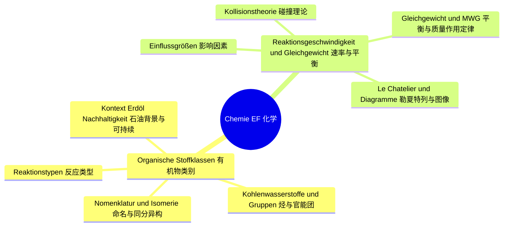
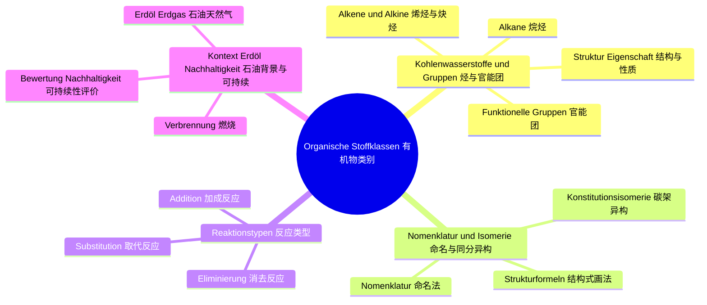
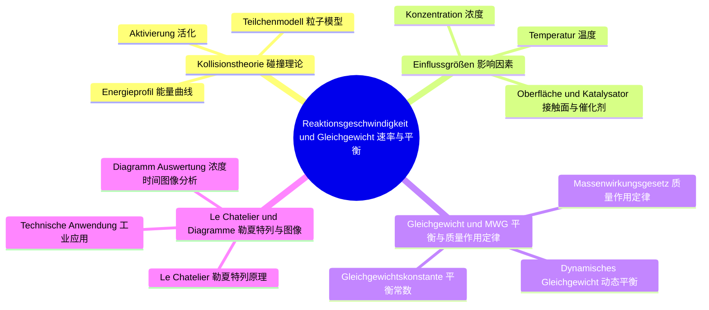

# Lernbaum Chemie EF（化学 EF 学习树）

> 中文导读：EF 化学 = 有机化学入门 + 反应速率/平衡；画结构式、写方程式是基本功，观察与解释必须分开写。
> KLP 依据：NRW KLP Chemie 2022。Klausur-Fokus：Strukturformel→Gleichung→Beobachtung/Deutung trennen；Basiskonzepte Donator-Akzeptor / Struktur-Eigenschaft / Energie。

## 1. 总览（L0→L1→L2）

## 2. 分 IF 展开（L1→L2→L3）

### IF 1：Organische Stoffklassen

### IF 2：Reaktionsgeschwindigkeit und chemisches Gleichgewicht

## 3. 节点明细（中文在上，德语在下）

### IF 1 Organische Stoffklassen（有机物类别）

#### L2 Kohlenwasserstoffe und Gruppen（烃与官能团）

- **Alkane（烷烃）**
  - 中文一句话：只含单键的饱和烃，通式与同系物是入口，性质随碳链变长规律变化。
  - `Operatoren: [nennen, darstellen, beschreiben]`
  - `Klausur-Anbindung: 画结构式基础题；Homologe Reihe darstellen, Eigenschaften beschreiben。`
  - `Leitfrage DE / ZH: Wie ändern sich Eigenschaften in der homologen Reihe? / 同系物中性质如何变化？`

- **Alkene und Alkine（烯烃与炔烃）**
  - 中文一句话：含双键三键的不饱和烃，官能团位置决定反应活性，是加成反应的主角。
  - `Operatoren: [darstellen, beschreiben, erklären]`
  - `Klausur-Anbindung: 结构→性质题；Doppel-/Dreifachbindung zeichnen, Reaktivität erklären。`
  - `Leitfrage DE / ZH: Warum sind Mehrfachbindungen reaktiver? / 为什么多重键更活泼？`

- **Funktionelle Gruppen: Hydroxy, Carbonyl, Carboxy（官能团：羟基、羰基、羧基）**
  - 中文一句话：官能团决定有机物的"性格"，认出官能团就能预判物质类别和典型反应。
  - `Operatoren: [nennen, zuordnen, beschreiben]`
  - `Klausur-Anbindung: 识别归类题；Gruppe erkennen, Stoffklasse zuordnen（AFB I）。`
  - `Leitfrage DE / ZH: Welche Gruppe bestimmt welche Stoffklasse? / 哪个官能团决定哪类物质？`

- **Struktur-Eigenschaft（结构与性质的关系）**
  - 中文一句话：链长、分支、极性官能团共同决定熔沸点和溶解性，这是贯穿全卷的红线概念。
  - `Operatoren: [erklären, begründen, bewerten]`
  - `Klausur-Anbindung: 解释评价题；Eigenschaft aus Struktur begründen（Basiskonzept!）。`
  - `Leitfrage DE / ZH: Wie erklärt die Struktur die Eigenschaft? / 结构如何解释性质？`

#### L2 Nomenklatur und Isomerie（命名与同分异构）

- **Nomenklatur（命名法）**
  - 中文一句话：找最长链、编号、写支链，名字是结构的"密码"，必须双向翻译。
  - `Operatoren: [benennen, darstellen, bestimmen]`
  - `Klausur-Anbindung: 必考基本功；Name↔Strukturformel übersetzen。`
  - `Leitfrage DE / ZH: Wie benennt man verzweigte Kohlenwasserstoffe? / 支链烃如何命名？`

- **Konstitutionsisomerie（碳架异构）**
  - 中文一句话：分子式相同、连接方式不同就是异构体，画全不重复需要系统方法。
  - `Operatoren: [darstellen, bestimmen, begründen]`
  - `Klausur-Anbindung: 作图题；Isomere zeichnen, Isomerie begründen。`
  - `Leitfrage DE / ZH: Wie findet man alle Isomere einer Formel? / 如何找全一个分子式的异构体？`

- **Strukturformeln zeichnen（结构式画法）**
  - 中文一句话：结构式、简化式、键线式三种写法切换自如，考试只认规范画法。
  - `Operatoren: [darstellen, angeben, zuordnen]`
  - `Klausur-Anbindung: 全卷基本功；korrekte Strukturformel zeichnen（Darstellungsleistung）。`
  - `Leitfrage DE / ZH: Welche Darstellungsform passt zur Aufgabe? / 哪种结构式写法适合这道题？`

#### L2 Reaktionstypen（反应类型）

- **Substitution（取代反应）**
  - 中文一句话：烷烃的氢被取代，最典型的是与卤素的自由基取代，要会写链反应。
  - `Operatoren: [beschreiben, darstellen, erklären]`
  - `Klausur-Anbindung: 方程式题；Substitution als Reaktionsgleichung formulieren。`
  - `Leitfrage DE / ZH: Wie läuft eine Substitution ab? / 取代反应如何进行？`

- **Addition（加成反应）**
  - 中文一句话：双键打开加两边，不对称加成服从马氏规则，是烯烃的标志反应。
  - `Operatoren: [darstellen, erklären, begründen]`
  - `Klausur-Anbindung: 预测产物题；Additionsprodukt vorhersagen und begründen。`
  - `Leitfrage DE / ZH: Wohin addiert sich was bei asymmetrischen Alkenen? / 不对称烯烃加成时谁加到哪边？`

- **Eliminierung（消去反应）**
  - 中文一句话：加成的逆过程，脱去小分子形成双键，条件不同产物可能不同。
  - `Operatoren: [darstellen, beschreiben, vergleichen]`
  - `Klausur-Anbindung: 对比题；Addition vs. Eliminierung gegenüberstellen。`
  - `Leitfrage DE / ZH: Wann läuft Addition, wann Eliminierung? / 何时加成、何时消去？`

#### L2 Kontext Erdöl und Nachhaltigkeit（石油背景与可持续）

- **Erdöl und Erdgas（石油与天然气）**
  - 中文一句话：有机物的工业来源，分馏与裂化把原油变成有用原料。
  - `Operatoren: [beschreiben, nennen, erklären]`
  - `Klausur-Anbindung: 背景材料题；Fraktionierung/Cracken beschreiben。`
  - `Leitfrage DE / ZH: Wie wird aus Erdöl ein Rohstoff? / 石油如何变成化工原料？`

- **Verbrennung（燃烧）**
  - 中文一句话：完全燃烧生成二氧化碳和水，配平方程式并联系能量与排放问题。
  - `Operatoren: [darstellen, berechnen, bewerten]`
  - `Klausur-Anbindung: 方程式+评价；Verbrennungsgleichung aufstellen, CO₂-Aspekt bewerten。`
  - `Leitfrage DE / ZH: Was entsteht bei vollständiger Verbrennung? / 完全燃烧生成什么？`

- **Bewertung und Nachhaltigkeit（可持续性评价）**
  - 中文一句话：从资源、环境、经济三角度评价有机原料的使用，这是考试的价值升华段。
  - `Operatoren: [bewerten, beurteilen, begründen]`
  - `Klausur-Anbindung: 评价题 AFB III；Nutzung fossiler Rohstoffe kriteriengeleitet bewerten。`
  - `Leitfrage DE / ZH: Wie bewertet man Rohstoffnutzung nachhaltig? / 如何可持续地评价原料使用？`

### IF 2 Reaktionsgeschwindigkeit und chemisches Gleichgewicht（反应速率与化学平衡）

#### L2 Kollisionstheorie（碰撞理论）

- **Teilchenmodell（粒子模型）**
  - 中文一句话：只有取向合适、能量足够的碰撞才有效，速率本质是有效碰撞的频率。
  - `Operatoren: [beschreiben, erklären, darstellen]`
  - `Klausur-Anbindung: 解释题；Geschwindigkeit mit Teilchenstößen erklären。`
  - `Leitfrage DE / ZH: Wann ist ein Stoß wirksam? / 碰撞何时有效？`

- **Aktivierung（活化）**
  - 中文一句话：反应物要先"爬坡"到活化态，活化能越低反应越快。
  - `Operatoren: [beschreiben, erklären, darstellen]`
  - `Klausur-Anbindung: 能量图题；Aktivierungsenergie im Diagramm zeigen。`
  - `Leitfrage DE / ZH: Was bedeutet Aktivierungsenergie? / 活化能是什么意思？`

- **Energieprofil（能量曲线）**
  - 中文一句话：会画会读能量—反应进程图，放热吸热、活化能、催化剂作用全在一张图里。
  - `Operatoren: [darstellen, deuten, erklären]`
  - `Klausur-Anbindung: 图像解读；Energiediagramm zeichnen und deuten。`
  - `Leitfrage DE / ZH: Was liest man aus dem Energieprofil ab? / 能量曲线能读出什么？`

#### L2 Einflussgrößen（影响因素）

- **Konzentration（浓度）**
  - 中文一句话：浓度越高粒子越密、碰撞越多，速率越快，实验上用浓度—时间曲线证明。
  - `Operatoren: [beschreiben, auswerten, begründen]`
  - `Klausur-Anbindung: 实验分析；Konzentrationseinfluss aus Messdaten belegen。`
  - `Leitfrage DE / ZH: Warum beschleunigt höhere Konzentration? / 为什么浓度越高反应越快？`

- **Temperatur（温度）**
  - 中文一句话：升温提高有效碰撞比例，速率显著加快，注意区分"更快"和"产率更高"。
  - `Operatoren: [erklären, auswerten, begründen]`
  - `Klausur-Anbindung: 对比实验题；Temperaturversuch auswerten, RGT-Regel anwenden。`
  - `Leitfrage DE / ZH: Warum wirkt Temperatur so stark? / 为什么温度影响这么大？`

- **Oberfläche und Katalysator（接触面与催化剂）**
  - 中文一句话：增大接触面增加碰撞机会，催化剂降低活化能且自身不被消耗。
  - `Operatoren: [beschreiben, erklären, bewerten]`
  - `Klausur-Anbindung: 实验+评价；Katalysatorwirkung erklären, Einsatz bewerten。`
  - `Leitfrage DE / ZH: Was ändert ein Katalysator — und was nicht? / 催化剂改变什么、不改变什么？`

#### L2 Gleichgewicht und MWG（平衡与质量作用定律）

- **Dynamisches Gleichgewicht（动态平衡）**
  - 中文一句话：正逆速率相等、浓度不变但反应没停，动态二字是理解关键。
  - `Operatoren: [beschreiben, erklären, darstellen]`
  - `Klausur-Anbindung: 概念题；dynamisch vs. statisch unterscheiden（AFB I–II）。`
  - `Leitfrage DE / ZH: Warum heißt es dynamisches Gleichgewicht? / 为什么叫动态平衡？`

- **Massenwirkungsgesetz（质量作用定律）**
  - 中文一句话：平衡常数等于生成物浓度幂之积除以反应物，是平衡定量化的核心公式。
  - `Operatoren: [angeben, berechnen, begründen]`
  - `Klausur-Anbindung: 计算题；MWG aufstellen, K berechnen。`
  - `Leitfrage DE / ZH: Wie stellt man das MWG auf? / 质量作用定律表达式怎么写？`

- **Gleichgewichtskonstante（平衡常数）**
  - 中文一句话：K 远大于 1 产物占优、远小于 1 反应物占优，K 只随温度变。
  - `Operatoren: [deuten, berechnen, begründen]`
  - `Klausur-Anbindung: 判断题；aus K die Lage des Gleichgewichts deuten。`
  - `Leitfrage DE / ZH: Was verrät K über die Lage? / K 说明平衡位置的什么？`

#### L2 Le Chatelier und Diagramme（勒夏特列与图像）

- **Le Chatelier（勒夏特列原理）**
  - 中文一句话：平衡被扰动就向减弱扰动的方向移动，浓温压三招都要会预判。
  - `Operatoren: [erklären, vorhersagen, begründen]`
  - `Klausur-Anbindung: 预判题；Störung→Verschiebung vorhersagen und begründen。`
  - `Leitfrage DE / ZH: Wohin weicht das Gleichgewicht aus? / 平衡往哪个方向移动？`

- **Diagramm-Auswertung（浓度—时间图像分析）**
  - 中文一句话：浓度曲线变平就是平衡到达，扰动后曲线跳变方向告诉你平衡去向。
  - `Operatoren: [auswerten, deuten, darstellen]`
  - `Klausur-Anbindung: Experiment-Auswertung Pflicht；c-t-Diagramm deuten。`
  - `Leitfrage DE / ZH: Was zeigt der Knick im Diagramm? / 图像中的折点说明什么？`

- **Technische Anwendung（工业应用）**
  - 中文一句话：速率与产率经常矛盾，工业条件是折中妥协，要分清速率和平衡各自的要求。
  - `Operatoren: [bewerten, begründen, erklären]`
  - `Klausur-Anbindung: 综合评价 AFB III；Reaktionsbedingungen technisch-ökologisch bewerten。`
  - `Leitfrage DE / ZH: Schnell oder vollständig — was zählt technisch? / 工业上要快还是要全？`
