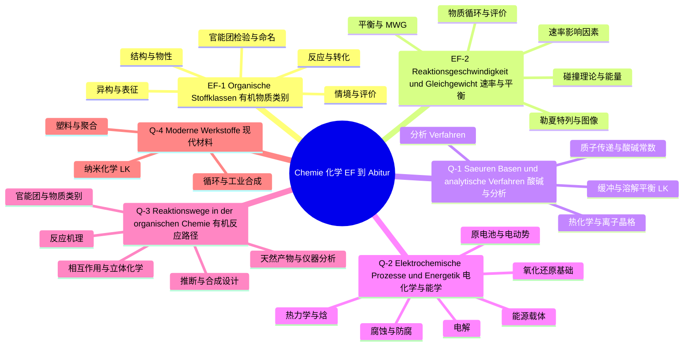
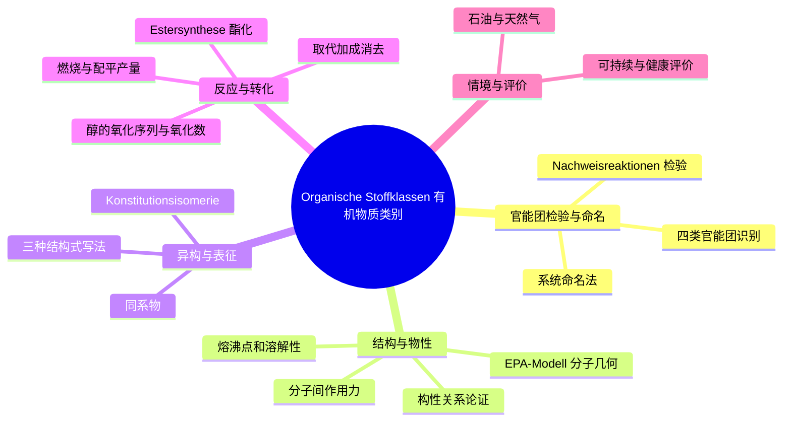
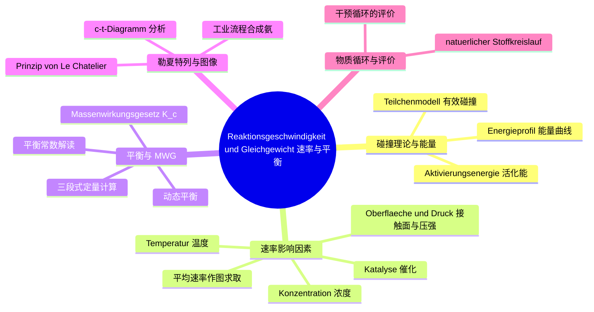
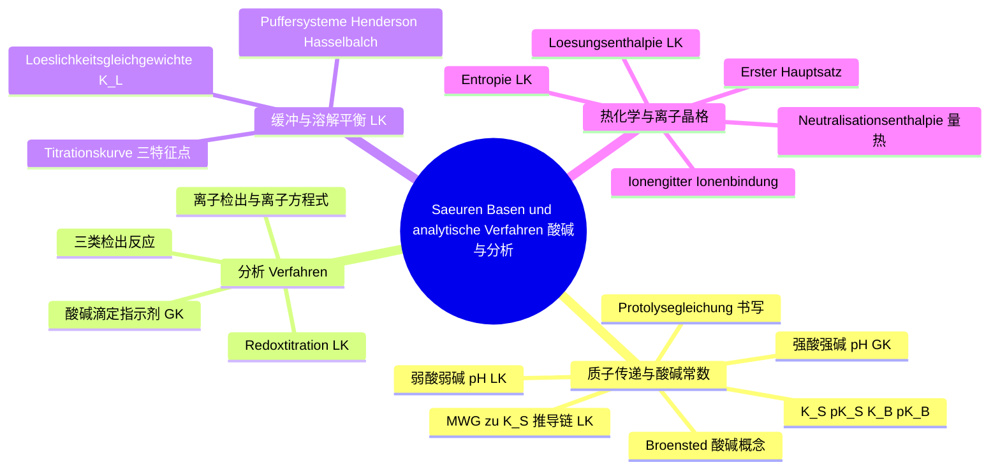
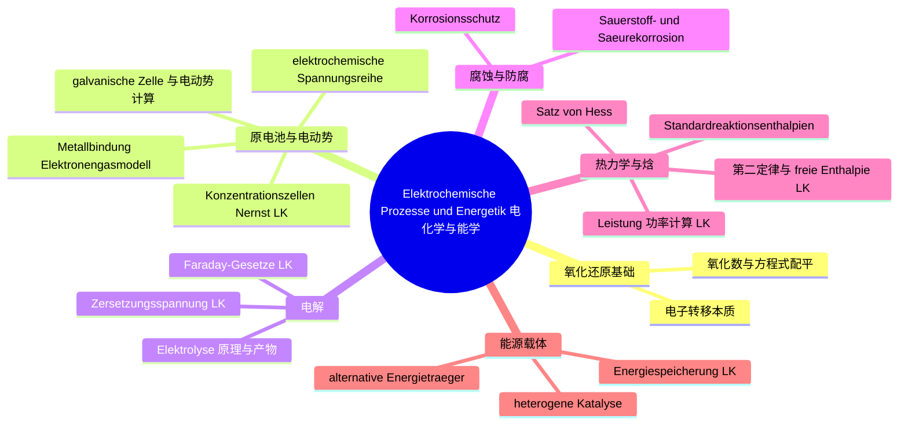
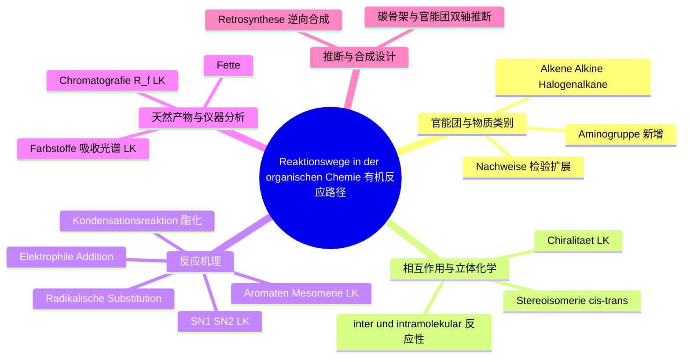
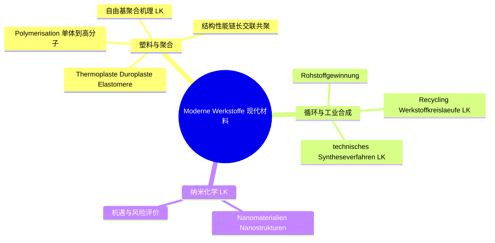

# Lernbaum Chemie（化学学习树 · EF→Abitur）

> 中文一句话：EF 只打「有机基础」与「速率/平衡」两根地基（**无酸碱**）；Q 阶段四 IF 全开并在 GK/LK 上分叉；终点是**每道题都绑定材料或实验**的 Abitur。
> KLP-Basis：[`Curriculum/Deutschland/Chemie-Oberstufe.md`](../Curriculum/Deutschland/Chemie-Oberstufe.md)（NRW KLP Chemie，Heft `4723`，版本 `2022/23`，PDF `gost_klp_ch_2022_06_07.pdf`，RdErl. v. 31.05.2022）[已验证]
> Klausur-Focus：**Aufgabenart I `Materialgebundene Aufgabe`**（ggf. mit Demonstrationsexperiment）/ **Aufgabenart II `Fachpraktische Aufgabe`**，Mischformen 允许；⚠️ **纯论文式题目被明确禁止**（「Eine ausschließlich aufsatzartig zu bearbeitende Aufgabenstellung … ist nicht zulässig」）[已验证]
> Abitur：一套 **4 题选 3 题**，教师不预选 [已验证]；**GK 255 min / LK 300 min**（含 Auswahlzeit，不得中断），含 fachpraktische Anteile 可延长且须在题目中载明 [已验证]；口试 **20–30 min** [已验证]。
> 学科结构：化学比数学**多一维** —— `4 Kompetenzbereich`（Sach-/Erkenntnisgewinnungs-/Kommunikations-/Bewertungskompetenz）× `6 Inhaltsfeld`（EF 2 + Q 4）× **`3 Basiskonzepte`**（Aufbau und Eigenschaften / Chemische Reaktion / Energie）三维交叉 [已验证]。
> ⚠️ **Basiskonzepte 是化学特有的第三维**：KLP 明写「werden übergreifend auf alle Kompetenzbereiche bezogen」，并在每个 IF 末尾以「Ausgewählte Beiträge zu den Basiskonzepten」显式列出该 IF 贡献什么 [已验证]。数学 KLP 无此维。

> ⚠️ **五条结构事实（读树前必读，搞错整篇作废）** [已验证]：
> 1. `Reaktionsgeschwindigkeit und chemisches Gleichgewicht` 属 **EF**，**不是 Q1/Q2**。
> 2. Q 阶段真实四 IF：`Säuren, Basen und analytische Verfahren` / `Elektrochemische Prozesse und Energetik` / `Reaktionswege in der organischen Chemie` / `Moderne Werkstoffe`；**GK 与 LK 共用同名四 IF**，差异只在 IF 内部的 Schwerpunkt 增量（与物理「GK/LK 两套不同 IF」不同）。
> 3. **EF 不含酸碱内容** —— pH / 缓冲 / 溶度积全部属 Q 阶段。
> 4. EF 的有机是 `Organische Stoffklassen`：官能团**只到 Estergruppe**（无氨基）、异构**只到 Konstitutionsisomerie**（无立体异构）、作用力**只写 intermolekular**、分子几何**只到 EPA-Modell**、**完全没有 Reaktionsmechanismen**。
> 5. **KLP 不标 Q1/Q2**，只有 `Einführungsphase` 与 `Qualifikationsphase` 两级 → 本树 Q1/Q2 的切分是本项目按教学顺序排布的推断 [据推断，仅拆分方式；Q 阶段内容本身全部 [已验证]]。

> ⚠️ **Operatoren 分层提示**：化学属 NRW 的 **B 组科** —— 官方明写「Grundsätzlich können sich alle Operatoren auf alle drei Anforderungsbereiche beziehen」，**不按动词分配 AFB**，层级由任务情境与材料决定 [已验证]。化学官方动词 **25 个**（gültig ab Abitur 2025，与物理同一套，仅 `analysieren` 一条释义更宽：增加「或以实验方式检验某事态」）[已验证]。

---

## 0. Methoden-Profil（方法论画像 —— 本设计第二核心）

**① Abitur 能力权重**（AFB 分布）

| AFB | 层级 | 本课权重（GK / LK） | 说明 |
|---|---|---|---|
| **I** | Reproduktion | ~20% / ~15% | 术语与概念复述、四类官能团指认、**结构式与反应方程式书写**（Darstellungsleistung）、公式直读、仪器与药品 nennen |
| **II** | Reorganisation und Transfer | ~55% / ~50% | **法定重心**：材料与 Messreihen 的 auswerten、由结构 erklären 性质与反应性、MWG 与 pH 定量、图⇄表⇄方程式互转、机理 auswählen |
| **III** | Reflexion und Problemlösung | ~25% / ~35% | 实验方案 planen、从分子结构推演反应行为、**推导**（K_S / Faraday / Nernst / Gibbs-Helmholtz）、多视角 bewerten 与**立场与叙述意图分析** |

> 权重数字为本项目按题型结构推算 → [据推断]；「所有 AFB 必须出现、**AFB II 为重心**」与「AFB 具体分界须按 Kursart 的 Kompetenzerwartungen 取向」为 KLP 明文 → [已验证]。
> ⚠️ **化学的 AFB III 载体与数学不同**：数学是「证明」，化学是「**实验设计 + 推导 + Bewertung**」（B1–B14），且即便是 AFB III 任务也**必须绑定材料或实验**，不存在纯论述型 AFB III。

**② 黄金学习法**（证据全部来自 `00_META/Lernmethoden-Evidenz.md`，不自创）

| 方法 | 证据来源 | 本课应用方式 |
|---|---|---|
| 检索练习（Practice Testing） | Dunlosky 2013「hoch」· Karpicke & Blunt 2011 d≈1.0 | 合书默写：四类官能团表、MWG→K_S 四步链、电化学四要素、Titrationskurve 三特征点；"看懂了"不算会 |
| 间隔重复（Distributed Practice） | Dunlosky「hoch」· FSRS retention 0.9 + 3 次重学 | 术语卡 DE-CN-EN（**Q-1/Q-2 术语缺卡最严重**）+ 25 个 Operatoren 动词卡 |
| 测试格式对齐（TAP） | Adesope 2017：一致 g≈0.63 > 不一致 g≈0.53 | 平时练习就长成 Abitur 的样子：**先给一段材料或实验数据**，再用官方 Operator 动词下发任务 |
| 交错练习（Interleaving） | Rohrer & Taylor 2007 d≈1.34；Rohrer et al. 2020 d≈0.83 | 四 IF 混排（Abitur 4 题选 3，复习不得单 IF 十连刷）；有机推断与机理题混排 |
| 对比辨别（Discriminative Contrast） | Foster 2019：混淆率 46% → 10% | Beobachtung vs Deutung；inter- vs intramolekular；Addition vs Eliminierung vs Substitution；K_S vs K_B vs K_L；Galvanische Zelle vs Elektrolyse |
| 正确例题 + 带扶手自解释 | Barbieri 2023 g≈0.48；空泛自解释 β≈−0.24（有害） | 新题型首学 = 1 道正确例题 + 两问（"这步用了哪条 KLP 规则？""上一步结论是什么？"） |
| 反馈三层（KR → 延迟 → 过程） | Brummer 2024 g≈0.41，其中 KR g≈0.64 | 先判对错 → 整套做完再展开 → 错因归类（**辨别错 / 知识错 / 表达错**）记 Fehlerlog |
| 先行组织者（Advance Organizer） | Ausubel（设计总纲 §2.2） | 每个 L2 开头先看"这一块在 Abitur 哪一题、用什么题型、值几分、属哪个 Basiskonzept" |
| 认知负荷管理（CLT） | Sweller（设计总纲 §2.2） | 长链题（材料 → 假设 → 实验设计 → 数据 → 结论 → 评价）先拆 Teilschritte 再落笔 |
| 一图一概念（CTML） | Mayer · Cromley 2025 g≈0.37 | 结构式/能量图/滴定曲线各归各页；装饰图不进库 |

**③ 三大典型失分点**

1. **Beobachtung 与 Deutung 不分 + 不回扣材料** —— 实验题把「看到什么」与「为什么」揉进同一段（化学的法定 Darstellungsaufgabe 要求二者**分开且各自成段**）；更致命的是**脱离材料自说自话**——化学明文禁止无材料/实验绑定的题目，答题不引材料即脱离任务 [已验证]。对策：实验题固定两段式（Beobachtung / Deutung），每个结论前先一句「aus dem Material / aus dem Versuch folgt …」。
2. **Darstellungsleistung 全面失分** —— 结构式漏氢、键线式键数错、反应方程式不配平或漏写条件与状态符号、有机命名编号错、单位与有效数字缺失。⚠️ 语言与卷面错误在 **Q 阶段最多扣 2 Notenpunkte**（APO-GOSt § 13 Abs. 2）[已验证]——对中文母语者是硬约束。
3. **MWG → K_S 台阶未走完 + 只给结果不呈示过程** —— EF 把 MWG 当**计算工具**，LK 要求**用 MWG 推导** K_S/pK_S/K_B [已验证]；而 `berechnen` 的官方释义是「从某个 **Ansatz** 出发呈示计算过程」，只写答案不给分 [已验证]。这一条同时废掉 pH、缓冲、滴定曲线、溶度积四块。

**④ 本课笔记结构模板**

> 每篇化学笔记固定八段：
> ① 一句话中文定义 · ② 术语三元组 `DE / CN / EN`（**Q-1/Q-2 术语卡优先**）· ③ **标准解题/书写程序**（编号步骤 + 每步标注"这一步用的 KLP 工具"）· ④ 一道**正确例题**（分步标规则，供首学）· ⑤ **表征互转训练**（图 ⇄ 表 ⇄ 反应方程式，对应法定 `Darstellungsaufgaben`）· ⑥ 3 道 Operator 题干练习（**含 `planen` 或 `bewerten` 至少 1 道**，因 AFB III 在化学只经这两条路）· ⑦ Fehlerquelle 三行（辨别错 / 知识错 / 表达错）· ⑧ **Basiskonzept 归属标注**（Aufbau / Reaktion / Energie 三者标其一或其三）+ 上下游节点链接（本树节点 id）。
> 实验类笔记另加：**Beobachtung / Deutung 分栏模板**；计算类笔记另加：**量级检验 + 极限检验**两行自检。

**⑤ Basiskonzepte 三轴追踪（化学特有的第三维，作答的「官方得分语言」）**

| Basiskonzept | 中文 | 在本树的主落点 | 各 IF 贡献（KLP 明示） |
|---|---|---|---|
| `Aufbau und Eigenschaften der Stoffe` | 物质的结构与性质 | EF-1 官能团与分子间作用力；Q-1 离子晶格；**Q-3 染料结构-显色**；Q-4 塑料结构-性能 | EF-1 ✅ / EF-2 ❌未列 / Q-1 ✅ / Q-2 ✅ / Q-3 ✅ / Q-4 ✅ |
| `Chemische Reaktion` | 化学反应 | EF-2 动态平衡；Q-1 质子传递与 MWG 量化；Q-2 氧化还原；**Q-3 五条机理** | EF-1 ✅ / EF-2 ✅ / Q-1 ✅ / Q-2 ✅ / Q-3 ✅ / Q-4 ✅ |
| `Energie` | 能量 | EF-2 催化剂作用机制；Q-1 第一定律与中和焓；**Q-2 Hess / 第二定律 / ΔG** | EF-1 ❌未列 / EF-2 ✅ / Q-1 ✅ / Q-2 ✅ / Q-3 ❌未列 / Q-4 ❌未列 |

> ⚠️ **各 IF 对 Basiskonzepte 的贡献分布不均**（EF-1 与 Q-3/Q-4 未列 Energie；EF-2 未列 Aufbau）[已验证]——答题时点明「这是 Aufbau-Eigenschaft 视角 / 这是 Energie 视角」直接命中 `Herstellen geeigneter Zusammenhänge`;中国课标**无等价横贯概念轴**，故这是中国学生的必补项 [据推断]。

---

## 1. 总览 Gesamtübersicht（L0→L1→L2）

```mermaid
mindmap
  root((Chemie 化学 EF 到 Abitur))
    EF-1 Organische Stoffklassen 有机物质类别
      官能团检验与命名
      结构与物性
      异构与表征
      反应与转化
      情境与评价
    EF-2 Reaktionsgeschwindigkeit und Gleichgewicht 速率与平衡
      碰撞理论与能量
      速率影响因素
      平衡与 MWG
      勒夏特列与图像
      物质循环与评价
    Q-1 Saeuren Basen und analytische Verfahren 酸碱与分析
      质子传递与酸碱常数
      分析 Verfahren
      缓冲与溶解平衡 LK
      热化学与离子晶格
    Q-2 Elektrochemische Prozesse und Energetik 电化学与能学
      氧化还原基础
      原电池与电动势
      电解
      腐蚀与防腐
      热力学与焓
      能源载体
    Q-3 Reaktionswege in der organischen Chemie 有机反应路径
      官能团与物质类别
      相互作用与立体化学
      反应机理
      天然产物与仪器分析
      推断与合成设计
    Q-4 Moderne Werkstoffe 现代材料
      塑料与聚合
      循环与工业合成
      纳米化学 LK
```

> **L1 与 `Chemie-Oberstufe.md` 的 Inhaltsfeld 逐一对齐**：EF 2 个（Organische Stoffklassen / Reaktionsgeschwindigkeit und chemisches Gleichgewicht）+ Q 阶段 4 个（Säuren, Basen und analytische Verfahren / Elektrochemische Prozesse und Energetik / Reaktionswege in der organischen Chemie / Moderne Werkstoffe）[已验证]。
> ⚠️ **EF 只有机与速率/平衡，酸碱、电化学、机理、材料全部缺席** [已验证]。

---

## 2. 分 IF 展开（L1→L2→L3 + 应试四行）

### L1-EF-1：Organische Stoffklassen（有机物质类别）`[EF]`

```mermaid
mindmap
  root((Organische Stoffklassen 有机物质类别))
    官能团检验与命名
      四类官能团识别
      Nachweisreaktionen 检验
      系统命名法
    结构与物性
      EPA-Modell 分子几何
      分子间作用力
      熔沸点和溶解性
      构性关系论证
    异构与表征
      Konstitutionsisomerie
      三种结构式写法
      同系物
    反应与转化
      醇的氧化序列与氧化数
      Estersynthese 酯化
      取代加成消去
      燃烧与配平产量
    情境与评价
      石油与天然气
      可持续与健康评价
```

#### L2 EF1-A — 官能团、检验与命名 `[EF]`

- **Vier funktionelle Gruppen（四类官能团识别）** `[EF]` · `CH-EF1-A-01`
  - 中文一句话：羟基 / 羰基 / 羧基 / 酯基——EF 的官能团清单**到此为止**，认出官能团就能预判物质类别与典型反应。
  - Klausur-Anbindung：EF-1 的**第一考点**，几乎每题第一小问；给结构式 `ordnen` 物质类别并 `benennen`（AFB I），常与物性解释连成 AFB II。
  - Operatoren：angeben, nennen, ordnen, beschreiben
  - Lernweg ZH：检索练习（合书默画四类官能团 + 各配一个代表分子）+ 间隔重复（DE-CN-EN 三语卡）。
  - Fehlerquelle：把 **Carboxygruppe（–COOH）** 与 **Carbonylgruppe（C=O）** 混为一谈；⚠️ **氨基属 Q-3 增量，EF 不得提前引入** [已验证]。
  - 📓 笔记：⚠️ 缺口（EF-1 只被 `Zwischenmolekulare-Kraefte-und-Stoffeigenschaften.md` 部分覆盖）

- **Nachweisreaktionen der funktionellen Gruppen（官能团检验）** `[EF]` · `CH-EF1-A-02`
  - 中文一句话：用特征反应（显色、沉淀、放气）反推官能团——EF 要求**会设计并能预期现象**。
  - Klausur-Anbindung：`Erkenntnisgewinnung` 主战场；常以「Material + 实验现象表」出 `auswerten` 或 `planen` 题（AFB II → III）。
  - Operatoren：planen, untersuchen, auswerten, begründen
  - Lernweg ZH：正确例题精读 + **Beobachtung / Deutung 分栏**两栏默写（这是化学失分点 ① 的正面训练）。
  - Fehlerquelle：把"现象"写成"结论"（如直接写"有羧基"而不写"有气泡产生"）；不写对照实验。
  - 📓 笔记：⚠️ 缺口（KLP Schwerpunkt 1，**现有笔记零覆盖**）

- **Systematische Nomenklatur（系统命名法）** `[EF]` · `CH-EF1-A-03`
  - 中文一句话：找最长链 → 编号 → 写支链；名字与结构必须双向翻译。
  - Klausur-Anbindung：必考基本功；`Name ↔ Strukturformel` 双向互译（AFB I），也是后续所有有机题的入场券。
  - Operatoren：benennen, darstellen, angeben
  - Lernweg ZH：检索练习（双向默：给名画式、给式写名）+ 交错（与异构体书写混排）。
  - Fehlerquelle：主链选错（取了非最长链）；编号未使取代基位次和最小。
  - 📓 笔记：⚠️ 缺口（可并入 EF-1 补齐笔记）

#### L2 EF1-B — 结构与物性 `[EF]`

- **Elektronenpaarbindung und EPA-Modell（共价键与分子几何）** `[EF]` · `CH-EF1-B-01`
  - 中文一句话：单键/双键/三键决定键长键角，EPA 模型（Elektronenpaar-Abstoßung）由电子对互斥推断分子形状。
  - Klausur-Anbindung：结构题小问；用 EPA 模型 `erklären` 几何构型（AFB I–II），常要求借助数字工具 `darstellen`。
  - Operatoren：beschreiben, erklären, darstellen
  - Lernweg ZH：先行组织者（"电子对数 → 基本构型 → 孤对修正"一页表）+ 图形化自我解释。
  - Fehlerquelle：⚠️ 用**杂化轨道 sp/sp²/sp³ 或完整 VSEPR** 作答——属 `CN-only`，德国只到 EPA 模型，**禁止引入** [据推断]；把双键当成两个独立电子对计。
  - 📓 笔记：⚠️ 缺口（KLP Schwerpunkt 3，**现有笔记零覆盖**）

- **Intermolekulare Wechselwirkungen（分子间作用力）** `[EF→Q2]` · `CH-EF1-B-02`
  - 中文一句话：范德华力 / 偶极-偶极 / 氢键——EF 只用它**解释物性**，Q 阶段要升级为**解释反应性**（台阶②）。
  - Klausur-Anbindung：EF 的物性解释主力（AFB II）；⚠️ **在 Q-3 被复用**——S 要求「在 inter- und intramolekulare 作用力下解释官能团影响」（台阶②）[已验证]。
  - Operatoren：erklären, begründen, vergleichen
  - Lernweg ZH：对比辨别（三种作用力按强度与产生条件三列对照表）+ 检索练习（给分子判断有哪几种力）。
  - Fehlerquelle：把**氢键**当成共价键；分不清"分子间氢键拉高沸点"与"分子内氢键降低沸点"（后者属 Q 阶段）。
  - 📓 笔记：[`Zwischenmolekulare-Kraefte-und-Stoffeigenschaften.md`](../../05_Chemie/Zwischenmolekulare-Kraefte-und-Stoffeigenschaften.md) ✅（**但卡在 EF 侧**，台阶②未走完）

- **Löslichkeit, Schmelz- und Siedetemperatur（溶解性与熔沸点）** `[EF]` · `CH-EF1-B-03`
  - 中文一句话：链长、分支、极性官能团三方拉锯决定熔沸点与溶解性；"相似相溶"是定性判据。
  - Klausur-Anbindung：给同系物数据表 `auswerten` 并 `erklären` 趋势（AFB II），常与同系物同题。
  - Operatoren：auswerten, beschreiben, erklären
  - Lernweg ZH：对比辨别（同碳数不同官能团 / 同官能团不同链长两组对照）+ 图形化读表训练。
  - Fehlerquelle：忽略**分支降低沸点**（同碳数支链越多沸点越低）；把溶解性只归因于极性不给"相似相溶"判据。
  - 📓 笔记：[`Zwischenmolekulare-Kraefte-und-Stoffeigenschaften.md`](../../05_Chemie/Zwischenmolekulare-Kraefte-und-Stoffeigenschaften.md) ✅

- **Struktur-Eigenschafts-Begründung（构性关系论证）** `[EF→Q2]` · `CH-EF1-B-04`
  - 中文一句话：把"性质"回推到"结构"的完整论证链——这是 `Basiskonzept Aufbau und Eigenschaften` 的作答模板。
  - Klausur-Anbindung：贯穿全卷的红线；`Eigenschaft aus Struktur begründen`（AFB II），Q-3/Q-4 升级为"由结构推演反应行为"（AFB III）。
  - Operatoren：begründen, erklären, bewerten
  - Lernweg ZH：先行组织者（"结构特征 → 作用力 → 宏观性质"三段式模板先背）+ 带扶手自解释（"这一步用的是哪种作用力？"）。
  - Fehlerquelle：只描述性质不复原结构依据；**不点 Basiskonzept**（德国作答的官方得分语言，中国学生普遍漏）。
  - 📓 笔记：⚠️ 缺口（需独立成卡《Basiskonzept Aufbau und Eigenschaften 作答模板》）

#### L2 EF1-C — 异构与表征 `[EF]`

- **Konstitutionsisomerie（构造异构）** `[EF]` · `CH-EF1-C-01`
  - 中文一句话：分子式相同、连接方式不同即为异构体；EF **只到构造异构**。
  - Klausur-Anbindung：作图题；给定分子式 `darstellen` 全部异构体并 `begründen`（AFB II）。
  - Operatoren：darstellen, bestimmen, begründen
  - Lernweg ZH：检索练习（按"碳骨架 → 官能团位置 → 官能团种类"三层顺序系统枚举，默到不用想）+ 交错。
  - Fehlerquelle：枚举无顺序导致重复或遗漏；⚠️ **cis-trans 立体异构属 Q-3 GK 增量，EF 不得引入** [已验证]。
  - 📓 笔记：[`Chemie-EF-Grundlagen-Training.md`](../../05_Chemie/Chemie-EF-Grundlagen-Training.md) 🟡（SI 巩固层，部分覆盖）

- **Strukturformeln zeichnen（三种结构式写法）** `[EF]` · `CH-EF1-C-02`
  - 中文一句话：全结构式 / 简化式 / 键线式三种切换自如；考试只认规范画法。
  - Klausur-Anbindung：**全卷基本功**，属 Darstellungsleistung；`Strukturformel zeichnen`（AFB I），不规范即扣分。
  - Operatoren：darstellen, zeichnen, skizzieren
  - Lernweg ZH：检索练习（同一分子三种写法互写 30 秒限时）+ 反馈三层（先判对错再看范画）。
  - Fehlerquelle：键线式端点漏写碳上的氢；官能团写成缩写却漏画 C=O 的双键。
  - 📓 笔记：⚠️ 缺口（《Darstellungsaufgaben: 图⇄表⇄方程式》首单元）

- **Homologe Reihe（同系物）** `[EF]` · `CH-EF1-C-03`
  - 中文一句话：相差一个 CH₂ 的系列；性质随碳数单调变化，是最简单的"结构 → 性质"预测器。
  - Klausur-Anbindung：趋势题；`Eigenschaften in der homologen Reihe beschreiben und begründen`（AFB I–II）。
  - Operatoren：beschreiben, begründen, vergleichen
  - Lernweg ZH：对比辨别（相邻两项性质差成对练）+ 检索练习。
  - Fehlerquelle：把"物理性质渐变"误说成"化学性质渐变"（同系物化学性质相似）。
  - 📓 笔记：⚠️ 缺口

#### L2 EF1-D — 反应与转化 `[EF]`

- **Oxidationsreihe der Alkanole mit Oxidationszahlen（醇的氧化序列与氧化数）** `[EF]` · `CH-EF1-D-01`
  - 中文一句话：醇 → 醛/酮 → 羧酸的氧化序列，用**氧化数**把 Donator-Akzeptor 原理落到有机上；是 Q-2 氧化还原的前置。
  - Klausur-Anbindung：**EF-1 唯一贯穿「结构→性质→氧化数」的链条**；给反应序列 `Oxidationszahlen ermitteln` 并 `erklären`（AFB II）[据推断，KLP Schwerpunkt 6]。
  - Operatoren：ermitteln, erklären, aufstellen, formulieren
  - Lernweg ZH：正确例题精读（逐级氧化 + 每步标氧化数变化）+ 检索练习默"碳的氧化数计算规则"。
  - Fehlerquelle：有机碳的氧化数算错（C–O 记 +1、C–H 记 −1、C–C 记 0，常漏 C–H）；把"氧化"说成"加氧"而不给氧化数依据。
  - 📓 笔记：⚠️ 缺口（KLP Schwerpunkt 6，**现有笔记零覆盖**，且是 Q-2 Redox 的前置）

- **Estersynthese（酯化合成）** `[EF→Q2]` · `CH-EF1-D-02`
  - 中文一句话：酸 + 醇 ⇌ 酯 + 水；EF 要求**实施实验并从产物物性反推酯基结构**（归纳式探究）。
  - Klausur-Anbindung：🔁 **官方正反馈环**——Q-3 的 Estersynthese（GK 与 LK 均列 Schwerpunkt）把 Le Chatelier 与均相催化**重新调用**回来优化产率 [已验证, ch.txt L1277, L1666-1668]；EF 侧考 `planen`/`auswerten`（AFB II）。
  - Operatoren：planen, untersuchen, beschreiben, begründen
  - Lernweg ZH：正确例题精读（实验步骤 + 产物分离 + 由气味/溶解性反推结构）+ Beobachtung/Deutung 分栏。
  - Fehlerquelle：漏写浓硫酸的**双重角色**（催化剂 + 脱水）；把"产率低"只归因于速率而不谈平衡。
  - 📓 笔记：⚠️ 缺口（KLP Schwerpunkt 7，零覆盖）

- **Reaktionstypen: Substitution, Addition, Eliminierung（三类反应类型）** `[EF]` · `CH-EF1-D-03`
  - 中文一句话：饱和烃易取代、不饱和烃易加成、加成逆过程即消去；EF **只讲反应类型，不讲机理**。
  - Klausur-Anbindung：产物预测与对比题；`Additionsprodukt vorhersagen und begründen`（AFB II）；不对称烯烃加成需判方向。
  - Operatoren：darstellen, vergleichen, begründen
  - Lernweg ZH：对比辨别（同一底物在三种条件下分别走哪条路，先选再做，错记"辨别错"）+ 检索练习。
  - Fehlerquelle：把"反应类型"当"机理"答（EF 无机理，答机理属超范围）；消去反应漏写条件（醇/加热）。
  - 📓 笔记：[`Chemie-EF-Grundlagen-Training.md`](../../05_Chemie/Chemie-EF-Grundlagen-Training.md) 🟡（部分覆盖）

- **Verbrennung und Stöchiometrie（燃烧、配平与产量计算）** `[EF]` · `CH-EF1-D-04`
  - 中文一句话：完全燃烧生成 CO₂ 与 H₂O；配平 → 物质的量换算 → 产量/产率，是 EF 唯一的成体系定量入口。
  - Klausur-Anbindung：方程式 + 计算 + 评价三连；`Verbrennungsgleichung aufstellen`、`Masse berechnen`、末段 `CO₂-Aspekt bewerten`（AFB I → III）。
  - Operatoren：aufstellen, formulieren, berechnen, bewerten
  - Lernweg ZH：正确例题精读（配平 → n → m 三步 + 每步标工具）+ 检索练习（限时手算）。
  - Fehlerquelle：配平不查氧；⚠️ **跳过 `n` 直接在 m 与 V 之间换算**（中国技法侧的最大优势正在于纠正这一点，见下）。
  - 🇨🇳 CN-Methode：物质的量「枢纽换算网络」（`n = m/M = V/V_m = c·V = N/N_A`，四支路 + "先到 n 再到目标"两步走法）· DE-Anschluss: `Stoffmenge` / `Mol`（Sek I 已教，EF 明确定位为「konsolidieren 与 vertiefen SI 能力」）、`molare Masse M`、`Stoffmengenkonzentration c`、`molares Volumen V_m`、系数比 = 物质的量之比（德国 `Stöchiometrie` 的地基）· 合规性: ✅
  - 备注：**本表合规性最干净的一条**——中国侧贡献的纯粹是**组织结构**（枢纽图 + 两步走法），不是任何新概念；德国 `Stöchiometrie` 偏比例直觉，KLP 未规定方法。
  - 📓 笔记：⚠️ 缺口 → **建议升级** [`CN-Chemie-Formelhandbuch.md`](../../05_Chemie/CN-Chemie-Formelhandbuch.md) 为枢纽网络版（**第三优先产出**）

#### L2 EF1-E — 情境与评价 `[EF]`

- **Erdöl und Erdgas als Rohstoffquelle（石油与天然气）** `[EF]` · `CH-EF1-E-01`
  - 中文一句话：分馏与裂化把原油变成化工原料，是有机物的工业来源语境。
  - Klausur-Anbindung：背景材料题；`Fraktionierung und Cracken beschreiben`（AFB I–II），常作为 Bewertung 的材料前置。
  - Operatoren：beschreiben, erläutern, ordnen
  - Lernweg ZH：先行组织者（先给"原油 → 馏分 → 单体 → 高分子"一张流程图）+ 图形化自我解释。
  - Fehlerquelle：把"分馏"说成化学变化（是物理分离）；裂化与重整混淆。
  - 📓 笔记：⚠️ 缺口

- **Bewertung: Nachhaltigkeit, Lösungsmittel, Ethanol（可持续性、溶剂与乙醇评价）** `[EF]` · `CH-EF1-E-02`
  - 中文一句话：从资源、环境、健康、经济多视角评判——EF 的 `Bewertungskompetenz` 主战场（B1–B14）。
  - Klausur-Anbindung：评价题 AFB III；`kriteriengeleitet bewerten`，且须区分 **Sachurteil（`beurteilen`）与 Werturteil（`bewerten`）** [已验证]。
  - Operatoren：bewerten, beurteilen, begründen, diskutieren
  - Lernweg ZH：先行组织者（先列评价标准清单再落笔）+ TAP 对齐（按 Abitur 材料题格式练）。
  - Fehlerquelle：**只给一个视角**（违反 multiperspektivisch）；把事实判断写成价值判断；不回扣材料。
  - 📓 笔记：⚠️ 缺口（需《Bewertung: Sachurteil vs Werturteil》模板卡）

---

### L1-EF-2：Reaktionsgeschwindigkeit und chemisches Gleichgewicht（反应速率与化学平衡）`[EF]`

> ⚠️ 本 IF 属 **EF**，不是 Q1/Q2 [已验证]。它是本树**最高价值台阶的上游**（MWG）。

```mermaid
mindmap
  root((Reaktionsgeschwindigkeit und Gleichgewicht 速率与平衡))
    碰撞理论与能量
      Teilchenmodell 有效碰撞
      Aktivierungsenergie 活化能
      Energieprofil 能量曲线
    速率影响因素
      Konzentration 浓度
      Temperatur 温度
      Oberflaeche und Druck 接触面与压强
      Katalyse 催化
      平均速率作图求取
    平衡与 MWG
      动态平衡
      Massenwirkungsgesetz K_c
      平衡常数解读
      三段式定量计算
    勒夏特列与图像
      Prinzip von Le Chatelier
      c-t-Diagramm 分析
      工业流程合成氨
    物质循环与评价
      natuerlicher Stoffkreislauf
      干预循环的评价
```

#### L2 EF2-A — Kollisionstheorie（碰撞理论与能量）`[EF]`

- **Teilchenmodell und wirksame Stöße（粒子模型与有效碰撞）** `[EF]` · `CH-EF2-A-01`
  - 中文一句话：只有取向合适、能量足够的碰撞才有效；速率的本质是有效碰撞的频率。
  - Klausur-Anbindung：解释题；⚠️ KLP 要求**用碰撞理论在分子层面表现反应进程（含数字工具）**——这是 `both-de-deeper` 项，中国学生缺的是**模型表现层** [据推断]。
  - Operatoren：beschreiben, erklären, darstellen
  - Lernweg ZH：图形化自我解释（画碰撞示意图并口述）+ 检索练习（合书默"有效碰撞两条件"）。
  - Fehlerquelle：只说"碰撞越多越快"，不区分**碰撞总数**与**有效碰撞比例**（温度改变的是后者）。
  - 📓 笔记：[`Kinetik-Gleichgewicht-Bio-Vernetzung.md`](../../05_Chemie/Kinetik-Gleichgewicht-Bio-Vernetzung.md) 🟡（**缺碰撞理论的分子层面表现**，KLP 明示缺口）

- **Aktivierungsenergie（活化能）** `[EF]` · `CH-EF2-A-02`
  - 中文一句话：反应物要先"爬坡"到活化态；活化能越低，反应越快。
  - Klausur-Anbindung：能量图题；`Aktivierungsenergie im Energieprofil zeigen und deuten`（AFB I–II）。
  - Operatoren：beschreiben, erklären, ermitteln
  - Lernweg ZH：对比辨别（高/低活化能两条曲线对照）+ 检索练习。
  - Fehlerquelle：⚠️ 把活化能与**反应热 ΔH** 搞混（一个是峰高差、一个是始终态差）；⚠️ 用"反应历程/基元反应"解释——德国 EF 未教，**不得引入** [据推断]。
  - 📓 笔记：[`Kinetik-Gleichgewicht-Bio-Vernetzung.md`](../../05_Chemie/Kinetik-Gleichgewicht-Bio-Vernetzung.md) ✅

- **Energieprofil（能量—反应进程图）** `[EF]` · `CH-EF2-A-03`
  - 中文一句话：放热/吸热、活化能、催化剂作用、反应热全在一张图里——会画更会读。
  - Klausur-Anbindung：图像解读（`Darstellungsaufgaben`）；`Energiediagramm skizzieren und deuten`（AFB II）。
  - Operatoren：skizzieren, zeichnen, deuten, interpretieren
  - Lernweg ZH：一图一概念（放热/吸热各一张，不混画）+ 检索练习（遮住标注默读图）。
  - Fehlerquelle：坐标轴不标"Energie / Reaktionsverlauf"；催化剂曲线画成改变 ΔH（**只降 Eₐ，不改 ΔH**）。
  - 📓 笔记：⚠️ 缺口（需并入《Darstellungsaufgaben: 图⇄表⇄方程式》）

#### L2 EF2-B — Einflussgrößen（速率影响因素）`[EF]`

- **Konzentration（浓度）** `[EF]` · `CH-EF2-B-01`
  - 中文一句话：浓度越高粒子越密、碰撞越多，速率越快；实验上用浓度—时间曲线证明。
  - Klausur-Anbindung：实验分析题；`Konzentrationseinfluss aus Messdaten belegen`（AFB II）。
  - Operatoren：auswerten, beschreiben, begründen
  - Lernweg ZH：正确例题精读（读 c-t 曲线斜率）+ 检索练习。
  - Fehlerquelle：把"初速率"读成曲线任一点斜率（应取 t→0 处切线）。
  - 📓 笔记：[`Kinetik-Gleichgewicht-Bio-Vernetzung.md`](../../05_Chemie/Kinetik-Gleichgewicht-Bio-Vernetzung.md) ✅

- **Temperatur（温度）** `[EF]` · `CH-EF2-B-02`
  - 中文一句话：升温提高有效碰撞比例，速率显著加快——⚠️ **必须分清"更快"与"产率更高"**。
  - Klausur-Anbindung：对比实验题；`Temperaturversuch auswerten`（AFB II），末段常追问"为什么工业不采用更高温度"（AFB III）。
  - Operatoren：auswerten, erklären, begründen
  - Lernweg ZH：对比辨别（速率视角 vs 平衡视角两栏对照，这是最经典的辨别错）+ 检索练习。
  - Fehlerquelle：**用温度同时解释"快"和"多"**——升温使平衡向吸热方向移动，产率未必提高。
  - 📓 笔记：[`Kinetik-Gleichgewicht-Bio-Vernetzung.md`](../../05_Chemie/Kinetik-Gleichgewicht-Bio-Vernetzung.md) ✅

- **Oberfläche und Druck（接触面与压强）** `[EF]` · `CH-EF2-B-03`
  - 中文一句话：增大接触面增加碰撞机会；加压只对**有气体参与**的反应有效。
  - Klausur-Anbindung：实验与判据题；`Steuerung chemischer Reaktionen beschreiben`（KLP 四类条件调控之一，AFB I–II）[已验证]。
  - Operatoren：beschreiben, begründen, vergleichen
  - Lernweg ZH：对比辨别（固态/液态/气态三态下各条件是否适用，三行对照表）。
  - Fehlerquelle：对无气体参与的反应也谈"加压"；把压强影响归因于"分子变小"。
  - 📓 笔记：[`Kinetik-Gleichgewicht-Bio-Vernetzung.md`](../../05_Chemie/Kinetik-Gleichgewicht-Bio-Vernetzung.md) 🟡

- **Katalyse（催化）** `[EF]` · `CH-EF2-B-04`
  - 中文一句话：催化剂降低活化能、自身不被消耗；⚠️ **不改变 ΔH、不改变平衡位置**。
  - Klausur-Anbindung：解释 + 评价题；`Katalysatorwirkung erklären, Einsatz bewerten`（AFB II → III）；`Basiskonzept Energie` 在此精确化催化剂作用机制 [已验证]。
  - Operatoren：erklären, bewerten, beschreiben
  - Lernweg ZH：对比辨别（有/无催化剂两条能量曲线对照）+ 检索练习默"三不改"清单。
  - Fehlerquelle：说"催化剂提高产率"（只缩短到达平衡的时间）；⚠️ 用"反应历程"作答（EF 未教）。
  - 📓 笔记：[`Kinetik-Gleichgewicht-Bio-Vernetzung.md`](../../05_Chemie/Kinetik-Gleichgewicht-Bio-Vernetzung.md) ✅

- **Mittlere Reaktionsgeschwindigkeit experimentell ermitteln（平均速率的作图求取）** `[EF]` · `CH-EF2-B-05`
  - 中文一句话：定义平均速率并从实验数据**作图求取**——德国明文要求的图表能力，对应法定 `Darstellungsaufgaben`。
  - Klausur-Anbindung：Messreihen 处理题；⚠️ 法定 Überprüfungsformen 明文要求「大数据量 Messreihen 处理与模型工作」[已验证]（AFB II）。
  - Operatoren：ermitteln, auswerten, darstellen, berechnen
  - Lernweg ZH：正确例题精读（建表 → 作图 → 取斜率三步）+ 交错（与影响因素题混排）。
  - Fehlerquelle：单位写成 mol/L（应为 mol/(L·s)）；坐标刻度不等距导致斜率读错。
  - 🇨🇳 CN-Methode：变量控制方法（探究单一因素时其余量恒定）· DE-Anschluss: EF-2 的 `Beeinflussung der Reaktionsgeschwindigkeit` 与实验探究（德国 EF 已在实验探究中隐含此法）· 合规性: ✅
  - 备注：中国的「变量控制方法」是**课标明示条目**，德国只在实验探究中隐含；作为实验设计题（`planen`）的作答抓手，属**方法层**，零新增知识。
  - 📓 笔记：⚠️ 缺口（KLP E 侧明示要求，**现有笔记零覆盖**）

#### L2 EF2-C — Gleichgewicht und MWG（平衡与质量作用定律）`[EF]`

- **Dynamisches Gleichgewicht（动态平衡）** `[EF]` · `CH-EF2-C-01`
  - 中文一句话：正逆速率相等、浓度不变但反应没停；"动态"二字是理解关键。
  - Klausur-Anbindung：概念题；⚠️ KLP 要求把化学平衡**模拟为动态平衡**（含模型表现，AFB I–II）[已验证]。
  - Operatoren：beschreiben, erklären, darstellen
  - Lernweg ZH：对比辨别（静态 vs 动态两栏对照）+ 图形化自我解释（画双向箭头长度随时间的演变）。
  - Fehlerquelle：说"反应停止了"；把"浓度相等"当成平衡条件（应为浓度**不再改变**）。
  - 📓 笔记：[`Kinetik-Gleichgewicht-Bio-Vernetzung.md`](../../05_Chemie/Kinetik-Gleichgewicht-Bio-Vernetzung.md) ✅

- **Massenwirkungsgesetz K_c（质量作用定律）** `[EF→Q1]` · `CH-EF2-C-02`
  - 中文一句话：K_c = 生成物浓度幂之积 / 反应物浓度幂之积；🔴 **本树最高价值台阶的上游**。
  - Klausur-Anbindung：EF 要求「bestimmen rechnerisch Gleichgewichtslagen … mithilfe des MWG」——**把 MWG 当计算工具** [已验证, ch.txt L877-879]；Q-GK 升级为用 MWG **解释**酸碱平衡；**Q-LK 要求用 MWG 推导 K_S/pK_S/K_B 并计算** [已验证, ch.txt L1422-1427]。
  - Operatoren：angeben, aufstellen, berechnen, **herleiten**（LK 台阶）
  - Lernweg ZH：先行组织者（先立"EF 是计算工具、LK 是推导工具"这一句）+ 检索练习（默写 K 表达式书写规则三步）。
  - Fehlerquelle：把**纯液体/固体**写进 K 表达式；浓度幂次与方程式系数不对应；⚠️ **停留在"会算"，未走完推导这一跳**（后果见 §3 台阶 1）。
  - 📓 笔记：🟡 [`Kinetik-Gleichgewicht-Bio-Vernetzung.md`](../../05_Chemie/Kinetik-Gleichgewicht-Bio-Vernetzung.md) 有定性覆盖，**MWG 定量计算训练缺口** → ★ 建议《MWG 定量计算 EF-2 训练》

- **Gleichgewichtskonstante deuten（平衡常数的解读）** `[EF]` · `CH-EF2-C-03`
  - 中文一句话：K ≫ 1 产物占优、K ≪ 1 反应物占优；**K 只随温度变**。
  - Klausur-Anbindung：判断题；`aus K die Lage des Gleichgewichts deuten`（AFB II），常与 Le Chatelier 同题。
  - Operatoren：deuten, interpretieren, begründen
  - Lernweg ZH：对比辨别（K 三个数量级区间 × 三种"改变条件"四格对照）+ 检索练习。
  - Fehlerquelle：认为加催化剂或改变浓度会改变 K（**只有温度**）；把 K 的大小与反应速率挂钩（K 是热力学量）。
  - 📓 笔记：🟡 同上（定性有覆盖）

- **Gleichgewichtslage berechnen — 三段式定量（平衡定量计算）** `[EF]` · `CH-EF2-C-04`
  - 中文一句话：起始 → 变化 → 平衡三行表，把平衡行代入 K 表达式解方程；变化量按**系数比**设 x。
  - Klausur-Anbindung：⚠️ **德国 KLP 只写「用 MWG 计算」，未规定任何方法** [已验证] → 方法空白；EF 计算题（AFB II），下游直供 LK-01 弱酸碱 pH 与 LK-03 溶度积。
  - Operatoren：berechnen, bestimmen, ermitteln
  - Lernweg ZH：正确例题精读（三类平衡各 1 道）+ 带扶手自解释（"这一行为什么按系数比写？"）。
  - Fehlerquelle：变化量行不按系数比设（凭直觉凑数）；忘记"起始 = 平衡 ∓ 变化"的回代方向。
  - 🇨🇳 CN-Methode：三段式 ICE 表（起始 / 变化 / 平衡）· DE-Anschluss: EF-2 `Massenwirkungsgesetz`（已教且要求定量计算）、`Gleichgewichtsreaktionen` 与动态平衡、Q-1 `K_S`/`K_B`、LK-03 `Löslichkeitsgleichgewichte` · 合规性: ✅
  - 备注：**本表可嫁接性最高的一条**——填补的是**方法空白**而非知识空白；全部输入（起始浓度、系数、K 表达式）德国都已教，中国侧提供的是表格化的记账方式。
  - 📓 笔记：⚠️ 缺口 ★★★ 建议《CN-Gleichgewichts-Dreisatz-Tabelle》（现有 CN 三篇**全无三段式**）

#### L2 EF2-D — Le Chatelier und technische Anwendung `[EF]`

- **Prinzip von Le Chatelier（勒夏特列原理）** `[EF→Q2]` · `CH-EF2-D-01`
  - 中文一句话：平衡被扰动就向减弱扰动的方向移动；浓度、温度、压强三招都要会预判。
  - Klausur-Anbindung：预判题；`Störung → Verschiebung vorhersagen und begründen`（AFB II）；🔁 **在 Q-3 的 Estersynthese 被重新调用**（GK/LK 均列）[已验证]。
  - Operatoren：erklären, begründen, vorhersagen → 官方动词取 `begründen`, `erläutern`
  - Lernweg ZH：对比辨别（三类扰动 × 三类反应四格表，先选方向再说明理由）+ 检索练习。
  - Fehlerquelle：压强判据忘了"只看气体物质的量总和"；把催化剂算作扰动因素。
  - 📓 笔记：[`Kinetik-Gleichgewicht-Bio-Vernetzung.md`](../../05_Chemie/Kinetik-Gleichgewicht-Bio-Vernetzung.md) ✅

- **c-t-Diagramm-Auswertung（浓度—时间图像分析）** `[EF]` · `CH-EF2-D-02`
  - 中文一句话：曲线变平即平衡到达；扰动后曲线的**跳变方向**告诉你平衡去向。
  - Klausur-Anbindung：实验数据解读必考；`c-t-Diagramm deuten`（AFB II），并须说明"如何由曲线认定平衡已到达"。
  - Operatoren：auswerten, deuten, interpretieren
  - Lernweg ZH：对比辨别（改变浓度 / 温度 / 压强三类跳变图对照）+ 图形化自我解释。
  - Fehlerquelle：把"浓度突变"读成"平衡立即移动"（突变是**人为加入**，移动是随后的渐变）；不说明判据。
  - 📓 笔记：🟡 部分覆盖

- **Technisches Verfahren am Beispiel Ammoniaksynthese（工业流程）** `[EF]` · `CH-EF2-D-03`
  - 中文一句话：速率与产率常相矛盾，工业条件是折中妥协；须分清速率要求与平衡要求各自指向哪里。
  - Klausur-Anbindung：综合评价 AFB III；`Reaktionsbedingungen technisch-ökologisch bewerten` [已验证, KLP Schwerpunkt 4]。
  - Operatoren：bewerten, begründen, erläutern
  - Lernweg ZH：先行组织者（先画"速率要高温高压 / 平衡要低温高压 / 成本要低压"三方冲突表）+ TAP 对齐。
  - Fehlerquelle：只列条件不说冲突与妥协；忽视催化剂在"低温也能有足够速率"中的关键作用。
  - 📓 笔记：🟡 部分覆盖

#### L2 EF2-E — Stoffkreislauf und Bewertung `[EF]`

- **Natürlicher Stoffkreislauf（自然物质循环）** `[EF]` · `CH-EF2-E-01`
  - 中文一句话：把碳、氮等循环视为**反应序列**，是 `Basiskonzept Chemische Reaktion` 的宏观落点。
  - Klausur-Anbindung：材料情境题；`Stoffkreislauf als Reaktionsfolge darstellen`（AFB II）[已验证, KLP Schwerpunkt 3]。
  - Operatoren：darstellen, beschreiben, erklären
  - Lernweg ZH：先行组织者（循环图先默画）+ 跨科联结（与 Bio 的物质循环对照）。
  - Fehlerquelle：把循环写成孤立反应堆砌，不标"哪些步骤是人为干预"。
  - 📓 笔记：⚠️ 缺口（KLP 明示，**现有笔记零覆盖**）

- **Bewertung von Eingriffen in Stoffkreisläufe（干预循环的评价与意图分析）** `[EF]` · `CH-EF2-E-02`
  - 中文一句话：⚠️ KLP 要求**分析不同来源对"人类干预自然物质循环后果"的立场与叙述意图**——跨学科写作型任务，中国无对等训练 [据推断]。
  - Klausur-Anbindung：AFB III 主战场；`multiperspektivisch beurteilen` + `作者意图 analysieren`，属 B1–B14 的高阶组合。
  - Operatoren：analysieren, beurteilen, bewerten, diskutieren
  - Lernweg ZH：先行组织者（"事实 / 价值 / 立场"三层分离表）+ TAP 对齐（按材料题格式练，非纯论述）。
  - Fehlerquelle：⚠️ **写成无材料依托的议论文**（化学明文禁止）；把立场当事实；不点明叙述意图。
  - 📓 笔记：⚠️ 缺口（需《Bewertung + 意图分析》模板卡）

---

### L1-Q-1：Säuren, Basen und analytische Verfahren（酸碱与分析 Verfahren）`[Q1]`

> ⚠️ **EF 完全不含酸碱内容** [已验证]——本 IF 是 Q1 的**领域断层**，不是难度递进。
> 🔴 **台阶①**：`Massenwirkungsgesetz` 从 EF「算 K_c」升级为 LK「用 MWG 推导 K_S」；Q 阶段**全部酸碱定量**（pH / 缓冲 / 滴定曲线 / 溶度积）都建在这条推导上。

```mermaid
mindmap
  root((Saeuren Basen und analytische Verfahren 酸碱与分析))
    质子传递与酸碱常数
      Broensted 酸碱概念
      Protolysegleichung 书写
      K_S pK_S K_B pK_B
      MWG zu K_S 推导链 LK
      强酸强碱 pH GK
      弱酸弱碱 pH LK
    分析 Verfahren
      三类检出反应
      离子检出与离子方程式
      酸碱滴定指示剂 GK
      Redoxtitration LK
    缓冲与溶解平衡 LK
      Puffersysteme Henderson Hasselbalch
      Titrationskurve 三特征点
      Loeslichkeitsgleichgewichte K_L
    热化学与离子晶格
      Erster Hauptsatz
      Neutralisationsenthalpie 量热
      Loesungsenthalpie LK
      Entropie LK
      Ionengitter Ionenbindung
```

#### L2 Q1-A — Protolysereaktionen und Konstanten `[Q1]`

- **Brønsted-Säure-Base-Konzept（质子理论）** `[Q1]` · `CH-Q1-A-01`
  - 中文一句话：酸是质子给体、碱是质子受体；酸碱反应本质是**质子传递**，必成共轭对。
  - Klausur-Anbindung：Q-1 第一考点；`Säure-/Base-Paare angeben`、`Protolyse erklären`（AFB I–II）；是后续全部定量的语言基础。
  - Operatoren：angeben, nennen, erklären, beschreiben
  - Lernweg ZH：检索练习（合书默"HA / A⁻ 共轭对"配对表）+ 间隔重复（术语卡：`Protolyse` / `Ampholyt` / `konjugierte Base`）。
  - Fehlerquelle：把"能电离出 H⁺ 的物质"当定义（那是 Arrhenius 表述，德国只认 Brønsted）；漏写共轭碱。
  - 📓 笔记：[`Saeure-Base-Gleichgewichte-pH-Wert.md`](../../05_Chemie/Saeure-Base-Gleichgewichte-pH-Wert.md) ✅（GK 侧主体已覆盖）

- **Protolysegleichungen aufstellen（质子传递方程式书写）** `[Q1]` · `CH-Q1-A-02`
  - 中文一句话：写质子传递平衡式并标出给体/受体；水是 amphoter，既可得也可失质子。
  - Klausur-Anbindung：书写题；`Protolysereaktionen formulieren`（AFB I–II），是推导链的第一步。
  - Operatoren：aufstellen, formulieren, beschreiben
  - Lernweg ZH：正确例题精读（酸、碱、两性物质各一例）+ 检索练习（限时书写并检查质子数守恒）。
  - Fehlerquelle：箭头写成单箭头（应为**平衡箭头** ⇌）；电荷不守恒；把 H₃O⁺ 简写成 H⁺ 却不同步调整水分子数。
  - 📓 笔记：[`Saeure-Base-Gleichgewichte-pH-Wert.md`](../../05_Chemie/Saeure-Base-Gleichgewichte-pH-Wert.md) ✅

- **Säure- und Basekonstanten K_S / pK_S / K_B / pK_B（酸碱常数）** `[Q1]` · `CH-Q1-A-03`
  - 中文一句话：常数衡量酸碱强度，**pK_S 越小酸越强**；⚠️ 德国符号为 `K_S`/`pK_S`，中国为 `K_a`/`pK_a`，须校准。
  - Klausur-Anbindung：**GK 只要求"解释"常数**，**LK 要求「用 MWG 推导并计算」** [已验证]（AFB II → III）。
  - Operatoren：angeben, deuten, **herleiten**（LK）, berechnen
  - Lernweg ZH：对比辨别（K_S / K_B / K_W 三者定义与数量级对照表）+ 检索练习（默"pK ⇄ 强度 ⇄ 半等当点"三联表）。
  - Fehlerquelle：符号体系串台（德 `K_S` vs 中 `K_a`）；把 pK_S 大说成酸强。**现有笔记正卡在此处**（只到 EF 侧）。
  - 📓 笔记：🟡 [`Saeure-Base-Gleichgewichte-pH-Wert.md`](../../05_Chemie/Saeure-Base-Gleichgewichte-pH-Wert.md) —— **未走完推导这一跳**

- **MWG → K_S-Ableitungskette（用 MWG 推导 K_S，台阶①）** `[Q1][LK]` · `CH-Q1-A-04`
  - 中文一句话：四步链——① 写质子传递平衡式 → ② 按 MWG 写 K 表达式（**纯液体 H₂O 不写入**）→ ③ 把 [H₂O] 并入常数定义 `K_S` → ④ 取负对数得 `pK_S` 并读出"pH = pK_S 时 [HA] = [A⁻]"。
  - Klausur-Anbindung：🔴🔴 **本树最高价值节点**。**LK-06 直接命中**；下游解锁 LK-01 弱酸碱 pH、**LK-02 缓冲 + Henderson-Hasselbalch**、**LK-04 滴定曲线三特征点（半等当点即 pH = pK_S）**、LK-03 溶度积（AFB II/III）。
  - Operatoren：herleiten, ableiten, begründen, berechnen
  - Lernweg ZH：正确例题精读（四步全流程）+ 带扶手自解释（"为什么 H₂O 不进表达式？""pK_S 在滴定曲线上对应哪一点？"）。
  - Fehlerquelle：**卡在"为什么 H₂O 不写入"**；推导完不会用（不知道半等当点即 pH = pK_S）；⚠️ 用中国的**盐类水解**路径替代——**德国不认**（见下 Q1-C-01 反例）。
  - 🇨🇳 CN-Methode：`MWG → K_S` 推导链（含「并入 [H₂O]」与 pK_S ⇄ 半等当点）· DE-Anschluss: EF-2 `Massenwirkungsgesetz`（已教且要求定量计算）、Q-1 GK-01 `Protolysereaktionen`、GK-02 `K_S`/`pK_S`/`K_B`、**LK-06 明文要求「用 MWG 推导 K_S/pK_S/K_B 并计算」** · 合规性: ✅
  - 备注：⚠️ **本条方向与其他技法相反**——推导要求**来自德国 LK**（不是中国带来的），中国侧贡献的是"先写平衡式 → 再写 K → 再并入常量 → 再取负对数"这一**思维顺序**（中国只要求应用常数，不要求推导）。
  - 📓 笔记：⚠️ 缺口 ★★★ **第一优先产出**：《MWG-zu-KS-Ableitungskette》（把现有 `Saeure-Base-Gleichgewichte-pH-Wert.md` 从 EF 侧推到 LK 侧的**唯一通道**）

- **pH-Wert starker Säuren und Basen（强酸强碱 pH）** `[Q1][GK]` · `CH-Q1-A-05`
  - 中文一句话：`pH = −lg[H₃O⁺]`；强酸强碱视为完全质子化，由 c 直接算。
  - Klausur-Anbindung：**GK 必考**（KLP 明文 GK 只「starker Säuren und starker Basen」）[已验证]；计算题 AFB I–II，常与滴定同题。
  - Operatoren：berechnen, angeben, begründen
  - Lernweg ZH：检索练习（限时手算 + 单位检查）+ 量级检验（强酸 0,1 mol/L → pH ≈ 1，偏离一个数量级必错）。
  - Fehlerquelle：稀释时忘记 `[H₃O⁺]` 随体积变；把二元强酸的浓度当成 `[H₃O⁺]`（须乘 2）。
  - 📓 笔记：[`Saeure-Base-Gleichgewichte-pH-Wert.md`](../../05_Chemie/Saeure-Base-Gleichgewichte-pH-Wert.md) ✅

- **pH-Wert schwacher Säuren und Basen（弱酸弱碱 pH）** `[Q1][LK]` · `CH-Q1-A-06`
  - 中文一句话：非完全质子化，须用 `K_S` 与三段式解二次方程——**GK 完全无此内容**（LK 原文「von Säuren und Basen」）[已验证]。
  - Klausur-Anbindung：🔴 **LK 必考**；计算 + 近似合理性讨论（AFB II → III）。
  - Operatoren：berechnen, herleiten, beurteilen, abschätzen
  - Lernweg ZH：正确例题精读（三段式 + 近似条件判断）+ **量级/极限检验**（稀释极限下 pH → 7）。
  - Fehlerquelle：对强酸也套电离度近似；忘记检验近似条件（电离度 < 5%）；指数运算数量级错。
  - 🇨🇳 CN-Methode：量级检验 + 极限检验（`Größenordnungsprüfung` / `Grenzfallprobe`）· DE-Anschluss: `Kalorimetrie` 与数据合理性评估、`Berechnung der Zellspannung`、`fachpraktische Aufgabe` 的 Messreihen 处理（法定明文要求）、`Basiskonzept Chemische Reaktion` 的定量侧（S16–S17）· 合规性: ✅
  - 备注：**检查习惯，与课程内容无关，任何学段都合法**；不占分但防丢分，且直接命中德国"对数据合理性作判断"的明文要求。
  - 📓 笔记：⚠️ 缺口（LK 侧零覆盖）

#### L2 Q1-B — Analytische Verfahren `[Q1]`

- **Drei Nachweisreaktionen: Fällung, Farbreaktion, Gasentwicklung（三类检出反应）** `[Q1]` · `CH-Q1-B-01`
  - 中文一句话：沉淀、显色、放气——KLP 明文的三类检出反应；是离子检出的工具箱。
  - Klausur-Anbindung：实验材料题；`Nachweisreaktionen angeben und erklären`（AFB I–II），常与离子方程式同题。
  - Operatoren：angeben, nennen, erklären, untersuchen
  - Lernweg ZH：检索练习（三类各默 2 个代表反应）+ Beobachtung/Deutung 分栏训练。
  - Fehlerquelle：只写"有沉淀"不写**沉淀颜色与化学式**；把"放气"当结论而不给气体检验方法。
  - 📓 笔记：🟡 部分覆盖（现有酸碱笔记覆盖滴定侧，三类检出零覆盖）

- **Ionennachweise und Ionengleichungen（离子检出与离子方程式）** `[Q1]` · `CH-Q1-B-02`
  - 中文一句话：用特征离子反应检出离子；书写遵循"写—拆—删—查—判"，**电荷守恒是最强自检**。
  - Klausur-Anbindung：`GK-04` 直接命中；离子检出与三类检出反应（AFB I–II），且为 redox 配平提供自检手段。
  - Operatoren：aufstellen, formulieren, untersuchen, begründen
  - Lernweg ZH：正确例题精读（五步各一例）+ 检索练习（限时写并做"原子 + 电荷"双查）。
  - Fehlerquelle：**只查原子不查电荷**（离子方程式两边净电荷必须相等）；把弱电解质/沉淀/气体也拆开。
  - 🇨🇳 CN-Methode：离子方程式「写—拆—删—查—判」五步法 · DE-Anschluss: Q-1 GK-04 三类检出反应与离子检出、`Protolysereaktionen`、`Ionengitter / Ionenbindung`（"拆"的物理依据）、`Redoxreaktionen`、KLP 明文三类 `Nachweisreaktionen`（对应第 ⑤ 步发生条件）· 合规性: ✅
  - 备注：德国涉及离子反应但**不系统训练书写与自检流程**；⚠️ **德国不常用"离子方程式"这一体裁**——主要用于**分析反应本质与自检配平**，正式作答仍须写德国习惯的完整反应式。
  - 📓 笔记：⚠️ 缺口（建议《CN-Ionengleichung-5-Schritte》，作为现有 `CN-Chemie-Tricks.md` 守恒法的深化子卡）

- **Säure-Base-Titration mit Umschlagspunkt（酸碱滴定，指示剂终点）** `[Q1][GK]` · `CH-Q1-B-03`
  - 中文一句话：用已知浓度滴定未知浓度，指示剂变色定终点；**GK 只到指示剂法** [已验证]。
  - Klausur-Anbindung：🔴 **GK 必考 + `fachpraktische Aufgabe` 高频**；`Titration berechnen` + 实验操作论证（AFB II）；LK 追加曲线与电位法。
  - Operatoren：berechnen, beschreiben, planen, auswerten
  - Lernweg ZH：正确例题精读（设未知 → 写方程式 → 求 n → 求 c 四步）+ TAP 对齐（按 fachpraktisch 格式练操作描述）。
  - Fehlerquelle：物质的量比代反（未按方程式系数）；**直接在 m 与 V 之间跳**（不经 n）；不写指示剂选择与终点判断依据。
  - 🇨🇳 CN-Methode：物质的量枢纽换算网络在滴定中的应用（`c₁V₁ = c₂V₂` 只是等价式，**本质仍是 n 守恒**）· DE-Anschluss: `Stoffmenge`、`Stoffmengenkonzentration c`、反应方程式系数比 · 合规性: ✅
  - 备注：把"用换算公式"升级为"走枢纽图的两步走法"，避免在**非 1:1 系数比**的滴定（如 H₂SO₄ 与 NaOH）上翻车——这正是背公式最容易错的地方。
  - 📓 笔记：🟡 [`Saeure-Base-Gleichgewichte-pH-Wert.md`](../../05_Chemie/Saeure-Base-Gleichgewichte-pH-Wert.md)（滴定中和已覆盖，定量训练不足）

- **Redoxtitration（氧化还原滴定）** `[Q1][LK]` · `CH-Q1-B-04`
  - 中文一句话：以氧化还原反应为基础的滴定；终点由指示剂或电位判定，定量走电子守恒。
  - Klausur-Anbindung：LK 独立条目；计算 + 误差分析（AFB II–III）；⚠️ 中国高考此题型训练密度远高于德国 → 可迁移 [据推断]。
  - Operatoren：berechnen, planen, beurteilen, auswerten
  - Lernweg ZH：正确例题精读（半反应 → 电子守恒 → 物质的量）+ 检索练习。
  - Fehlerquelle：半反应电子数配错；把"氧化性/还原性强弱"与"反应速率"混为一谈。
  - 📓 笔记：⚠️ 缺口（LK 增量，零覆盖）

#### L2 Q1-C — Puffer und Löslichkeitsgleichgewichte `[Q1][LK]`

> ⚠️ 本 L2 **整块为 LK 专属**——`Puffersysteme`、`Löslichkeitsgleichgewichte`、`Titrationskurve` 三项在 GK 章节中**完全不存在** [已验证]。

- **Puffersysteme und Henderson-Hasselbalch-Gleichung（缓冲体系）** `[Q1][LK]` · `CH-Q1-C-01`
  - 中文一句话：弱酸 + 其共轭碱构成缓冲对；`pH = pK_S + lg([A⁻]/[HA])`——台阶①推导链的第一个下游推论。
  - Klausur-Anbindung：🔴🔴 **GK/LK 最硬的分界线之一**（GK 完全未出现）[已验证]；计算 + 缓冲容量讨论 + 生理/工业情境评价（AFB II–III）。
  - Operatoren：berechnen, herleiten, erklären, bewerten
  - Lernweg ZH：先行组织者（先立"缓冲 = 弱酸 + 共轭碱**直接配对**"这一句）+ 正确例题精读（HH 方程三种用法）。
  - Fehlerquelle：⚠️ **最大越界诱惑**：看到醋酸钠就搬出中国的"盐类水解"整套 —— **德国解法是「Ac⁻/HAc 构成缓冲对，直接用 Henderson-Hasselbalch」，不需要水解概念**；另：稀释时误以为 pH 显著变化（比值不变则 pH 不变）。
  - 🇨🇳 CN-Methode：⚠️ **反例示范 —— 盐类水解（Salzhydrolyse）体系不建议引入** · DE-Anschluss: ⚠️ **无合法接口** —— `Salzhydrolyse`/`Hydrolysegleichgewicht` **KLP 全文未出现**；**质子守恒（Protonenbilanz）** KLP 未出现且依赖水解概念；`Puffersysteme` 看似最近，但德国缓冲**不经过盐类水解这条路径**；唯一沾边的 `K_w` 在德国只服务于 pH 定义 · 合规性: ⚠️
  - 备注：**这是本树最重要的一条"不做"判断**。盐类水解在中国是成熟知识块（含三大守恒联立、离子浓度比较），且**紧邻 LK 缓冲**（最危险的越界诱惑），但引入它需要同时引入德国 KLP 完全没有的「水解平衡」概念，**违反铁律 1（只引方法，不引知识块）**，代价远大于收益 → **不引入、不复习、不做笔记**，仅在 CN 桥接笔记中登记禁入判据以防后续误引入。
  - 📓 笔记：⚠️ 缺口 ★★★（LK 侧零覆盖，建议《Q-1-LK-Inkrement: Puffer / K_L / Titrationskurve / Entropie》）

- **Titrationskurve mit drei Kennpunkten（滴定曲线三特征点）** `[Q1][LK]` · `CH-Q1-C-02`
  - 中文一句话：须**预测**强/弱酸碱滴定曲线并算出 **Anfangs-pH / Halbäquivalenzpunkt / Äquivalenzpunkt**；半等当点即 `pH = pK_S`。
  - Klausur-Anbindung：🔴 **LK 高频**；KLP 明文要求"预测曲线 + 算三特征点" [已验证]（AFB II–III），常与指示剂选择评价同题。
  - Operatoren：skizzieren, zeichnen, berechnen, beurteilen
  - Lernweg ZH：正确例题精读（强-强 / 强-弱 / 弱-强三类曲线各一）+ 先行组织者（三特征点算法表先背）。
  - Fehlerquelle：等当点 pH 一律写 7（弱酸强碱滴定等当点 > 7）；半等当点漏用 `pH = pK_S`；曲线不标突跃范围。
  - 📓 笔记：⚠️ 缺口（并入上述 LK 增量笔记）

- **Löslichkeitsgleichgewichte und K_L（溶度积）** `[Q1][LK]` · `CH-Q1-C-03`
  - 中文一句话：难溶盐的沉淀—溶解平衡；`K_L` 判断沉淀生成/溶解/转化，计算走三段式。
  - Klausur-Anbindung：🔴🔴 **LK 必考**（GK 完全未出现）[已验证]；沉淀判断 + 定量计算（AFB II–III）。⚠️ `K_L` 与 `K_sp` 的符号约定待核实 [据推断]。
  - Operatoren：berechnen, beurteilen, erklären, herleiten
  - Lernweg ZH：正确例题精读（离子积 Q 与 K_L 比较判方向）+ 检索练习（三段式表直接迁移）。
  - Fehlerquelle：把"离子积 > K_L"说成"不沉淀"（实为**生成沉淀**）；忽略同离子效应；指数极小的 K_sp 运算出错（须量级检验）。
  - 🇨🇳 CN-Methode：三段式 ICE 表迁移到沉淀溶解平衡 + 量级检验 · DE-Anschluss: EF-2 `Massenwirkungsgesetz`、LK-03 `Löslichkeitsgleichgewichte` · 合规性: ✅
  - 备注：中国把 `K_sp` 做成成套题型（沉淀生成/溶解/转化），德国 LK 只有独立条目 → 方法卡直用；⚠️ **分步沉淀是否要求待核实** [据推断]。
  - 📓 笔记：⚠️ 缺口（同上，并入 LK 增量笔记）

#### L2 Q1-D — Energetik und Ionengitter `[Q1]`

- **Erster Hauptsatz der Thermodynamik（热力学第一定律）** `[Q1]` · `CH-Q1-D-01`
  - 中文一句话：能量守恒在化学中的表述；内能变化 = 热 + 功，Q-1/Q-2 共用。
  - Klausur-Anbindung：概念 + 计算；`Energieumsatz bei chemischen Reaktionen erklären`（AFB II）；是中和焓与 Hess 的共同依据。
  - Operatoren：erklären, beschreiben, begründen
  - Lernweg ZH：先行组织者（"系统 / 环境"二分图先立）+ 检索练习（默定律表述与符号约定）。
  - Fehlerquelle：符号约定搞反（放热 ΔH < 0）；把"能量守恒"说成"能量不损失"而漏掉功项。
  - 📓 笔记：⚠️ 缺口（KLP Schwerpunkt 3，零覆盖）

- **Neutralisationsenthalpie und Kalorimetrie（中和焓与量热）** `[Q1]` · `CH-Q1-D-02`
  - 中文一句话：用量热计测中和热；`Q = c·m·ΔT` → 换算到每摩尔。
  - Klausur-Anbindung：🔴 **GK 必考 + `fachpraktische Aufgabe` 天然载体**；须**评估实验数据合理性**（法定涉及 Messreihen 处理，AFB II–III）。
  - Operatoren：berechnen, auswerten, planen, beurteilen
  - Lernweg ZH：正确例题精读（含热量损失修正讨论）+ 量级检验（强酸强碱中和热约 −57 kJ/mol 是常识锚点）。
  - Fehlerquelle：忘记除以物质的量（只给 Q 不给 ΔH）；忽略量热计热容；不讨论热损失这一系统误差。
  - 📓 笔记：⚠️ 缺口（KLP Schwerpunkt 3，零覆盖）

- **Lösungsenthalpie（溶解焓）** `[Q1][LK]` · `CH-Q1-D-03`
  - 中文一句话：溶解过程的热效应；LK 在中和焓之外追加此项。
  - Klausur-Anbindung：LK 增量；常与 Entropie 同题解释"为什么有的溶解吸热却自发"（AFB II–III）。
  - Operatoren：berechnen, erklären, deuten, interpretieren
  - Lernweg ZH：对比辨别（放热溶解 vs 吸热溶解两例对照）+ 检索练习。
  - Fehlerquelle：把"吸热"直接等同于"不自发"（须引入熵，见下条）。
  - 📓 笔记：⚠️ 缺口（LK 增量，零覆盖）

- **Entropie und spontan endotherme Lösungsvorgänge（熵与自发吸热溶解）** `[Q1][LK]` · `CH-Q1-D-04`
  - 中文一句话：⚠️ **德国更深**——LK 要求把**自发吸热溶解归因于熵变**；`Entropie` 是 GK **完全无**的独立条目 [已验证]。
  - Klausur-Anbindung：LK 高频解释题；`Entropiezunahme als Triebkraft erklären`（AFB II–III）。中国课标只说"与焓变和熵变有关"，**须补解释层** [据推断]。
  - Operatoren：erklären, begründen, deuten
  - Lernweg ZH：对比辨别（焓驱动 vs 熵驱动两组实例对照）+ 带扶手自解释（"这个过程粒子排列变有序还是无序？"）。
  - Fehlerquelle：把熵说成"混乱度"而不落到**粒子排列方式与可及微观状态数**；把 ΔS > 0 当成自发的唯一判据（须 ΔG，属 Q-2）。
  - 📓 笔记：⚠️ 缺口（LK 增量，零覆盖）

- **Ionengitter und Ionenbindung（离子晶格与离子键）** `[Q1]` · `CH-Q1-D-05`
  - 中文一句话：离子键与晶格结构决定离子化合物的高熔点、脆性与水溶液导电性。
  - Klausur-Anbindung：结构解释题；`Eigenschaften aus dem Ionengitter erklären`（AFB II），是"拆成离子"书写步骤的物理依据。
  - Operatoren：beschreiben, erklären, begründen
  - Lernweg ZH：对比辨别（离子晶格 vs 金属晶格 vs 分子晶体三列对照，仅用 KLP 已教的三类）+ 图形化自我解释。
  - Fehlerquelle：⚠️ 引入中国的**晶体四分类与晶胞**——属 `CN-only`（德国无对应 IF），**禁止引入** [据推断]；把"水溶液导电"说成"熔融导电"的反例。
  - 📓 笔记：⚠️ 缺口（KLP Schwerpunkt 4，零覆盖）

---

### L1-Q-2：Elektrochemische Prozesse und Energetik（电化学过程与能学）`[Q1]`

> 🔴 **本 IF 现有笔记完全零覆盖**（GK 与 LK 全部）[已验证，见 §4]——是本树**缺口最大**的一块。

```mermaid
mindmap
  root((Elektrochemische Prozesse und Energetik 电化学与能学))
    氧化还原基础
      电子转移本质
      氧化数与方程式配平
    原电池与电动势
      Metallbindung Elektronengasmodell
      elektrochemische Spannungsreihe
      galvanische Zelle 与电动势计算
      Konzentrationszellen Nernst LK
    电解
      Elektrolyse 原理与产物
      Faraday-Gesetze LK
      Zersetzungsspannung LK
    腐蚀与防腐
      Sauerstoff- und Saeurekorrosion
      Korrosionsschutz
    热力学与焓
      Standardreaktionsenthalpien
      Satz von Hess
      第二定律与 freie Enthalpie LK
      Leistung 功率计算 LK
    能源载体
      alternative Energietraeger
      Energiespeicherung LK
      heterogene Katalyse
```

#### L2 Q2-A — Redoxreaktionen als Elektronenübertragung `[Q1]`

- **Redoxreaktionen als Elektronenübertragung（氧化还原 = 电子转移）** `[Q1]` · `CH-Q2-A-01`
  - 中文一句话：氧化是失电子、还原是得电子；二者**必然同时发生**——Q-2 的地基。
  - Klausur-Anbindung：🔴🔴 **Q-2 第一考点**；`Oxidationszahlen ermitteln` 与给体/受体判定（AFB I–II），是电化学全部内容的语言。
  - Operatoren：ermitteln, erklären, begründen, angeben
  - Lernweg ZH：检索练习（合书默"氧化数规则五条"）+ 对比辨别（氧化剂/还原剂/被氧化/被还原四格表）。
  - Fehlerquelle：把"氧化剂"说成"被氧化的物质"（实为**被还原**）；有机碳的氧化数算错。
  - 📓 笔记：⚠️ 缺口 🔴（Q-2 全块零覆盖）

- **Redoxgleichungen aufstellen und ausgleichen（氧化还原方程式配平与电子守恒自检）** `[Q1]` · `CH-Q2-A-02`
  - 中文一句话：拆半反应 → 配电子 → 合并；**电子守恒是最强自检**（得电子数 = 失电子数）。
  - Klausur-Anbindung：常规 + 承上启下；`Redoxgleichung aufstellen`（AFB II）；⚠️ 德国**不系统训练氧化数配平的显式检验** [据推断]。
  - Operatoren：aufstellen, formulieren, begründen, berechnen
  - Lernweg ZH：正确例题精读（酸性/碱性条件各一例）+ 检索练习（配完必做原子 + 电荷双查）。
  - Fehlerquelle：半反应电子数不等就直接合并；酸性条件写成碱性条件（H⁺ / OH⁻ 混用）。
  - 🇨🇳 CN-Methode：守恒法家族 + 差量法（电子守恒 / 电荷守恒 / 原子守恒 / 元素守恒；差量法用反应前后固体质量差或气体体积差对应固定物质的量关系）· DE-Anschluss: EF-2 `Massenwirkungsgesetz` 与配平、GK-08 `Redoxreaktionen als Elektronenübertragungsreaktionen`、`elektrochemische Spannungsreihe` 与 `Berechnung der Zellspannung`、**LK-08 `Faraday-Gesetze`**（电子守恒正是 Faraday 计算的数学内容）、GK-04 `Nachweisreaktionen` 的 Gasentwicklung/Fällung（正对差量法的气体/固体差）· 合规性: ✅
  - 备注：守恒律是**普遍原理**而非中国特有知识块；差量法/极值法属计算技巧，工具（配平、系数比、摩尔质量）全在 EF 范围内。⚠️ 唯一限制：**不得用"反应历程/活化能"等中国知识块去解释**。
  - 📓 笔记：🟡 现有 [`CN-Chemie-Tricks.md`](../../05_Chemie/CN-Chemie-Tricks.md) 已有守恒/差量/极值三法 → **建议升级并补「电子守恒 → Faraday」显式桥接**（现无）

#### L2 Q2-B — Galvanische Zellen `[Q1]`

- **Metallbindung und Elektronengasmodell（金属键与电子气模型）** `[Q1]` · `CH-Q2-B-01`
  - 中文一句话：金属阳离子浸泡在离域电子"气"中——导电性、延展性的结构根源。
  - Klausur-Anbindung：结构解释题；`Eigenschaften der Metalle mit dem Elektronengasmodell erklären`（AFB II），是"电子导体"这一要素的模型依据。
  - Operatoren：beschreiben, erklären, begründen
  - Lernweg ZH：先行组织者（"金属键 → 三大性质"一张箭头图）+ 图形化自我解释。
  - Fehlerquelle：把电子气说成"自由离子"（是**离域电子**）；把导电归因于离子迁移（金属中是电子）。
  - 📓 笔记：⚠️ 缺口 🔴

- **Elektrochemische Spannungsreihe（电动势序列）** `[Q1]` · `CH-Q2-B-02`
  - 中文一句话：标准电极电势排序表；判两极、判反应方向、算电动势——**德国现成的判定工具**。
  - Klausur-Anbindung：判定 + 计算；`Zellspannung aus der Spannungsreihe berechnen`（AFB II），是所有原电池题的第一步。
  - Operatoren：angeben, berechnen, begründen, ordnen
  - Lernweg ZH：检索练习（默"电势高者为阴极/正极 + ΔE = E₁ − E₂"口诀与符号约定）+ 间隔重复。
  - Fehlerquelle：两极减序搞反导致 ΔE 为负；把"活泼金属"与"电极电势高低"的对应关系记反。
  - 📓 笔记：⚠️ 缺口 🔴

- **Galvanische Zelle: Aufbau und Zellspannung（原电池构造与电动势计算）** `[Q1]` · `CH-Q2-B-03`
  - 中文一句话：把氧化还原拆成两个半电池，电子走外电路、离子走内电路——四要素装进一张表。
  - Klausur-Anbindung：🔴🔴 **Q-2 第一大题**；`galvanische Zelle darstellen und Zellspannung berechnen`（AFB II）；"为给定装置补全四要素并论证"可上 AFB III。
  - Operatoren：darstellen, skizzieren, berechnen, begründen
  - Lernweg ZH：正确例题精读（装置图 + 四要素表 + 电动势计算）+ 检索练习（默四要素表头）。
  - Fehlerquelle：把电子流动方向写成"从正极到负极"（**电子从阳极经外电路到阴极**）；盐桥/离子迁移方向漏写；半反应与总反应不自洽。
  - 🇨🇳 CN-Methode：电化学「四要素」分析框架（`Analyseraster`：电极反应 / 电极材料 / 离子导体 / 电子导体）+ 五步流程（判类型 → 定两极 → 写半反应 → 查电子与离子流向 → 算电量-物质量关系）· DE-Anschluss: `galvanische Zellen`、`elektrochemische Spannungsreihe`（判定两极的现成工具）、`Redoxreaktionen als Elektronenübertragungsreaktionen`、`Metallbindung / Elektronengasmodell`（正对"电子导体"）、`Ionenbindung` 与离子迁移（正对"离子导体"）、`Elektrolyse`、`Korrosion` · 合规性: ✅
  - 备注：**课标明文**的框架（不是教学归纳），且四项要素在德国 Q-2 GK 中**逐项都有对应内容**——缺的只是"把它们装进同一张表"这一统一抓手。⚠️ **Q-2 现有笔记完全零覆盖** → 这是填空白的第一块。
  - 📓 笔记：⚠️ 缺口 ★★★ **第二优先产出**：《Elektrochemie-Vier-Elemente-Raster》

- **Konzentrationszellen und Nernst-Gleichung（浓度电池与能斯特方程）** `[Q1][LK]` · `CH-Q2-B-04`
  - 中文一句话：同一电极、浓度不同即产生电势；`E = E° − (RT/zF)·ln Q` —— 🔴 **LK 标志性内容，中国高中完全没有** [据推断]。
  - Klausur-Anbindung：🔴🔴 **LK 必考 + 中国学生的硬缺口**；计算 + 解释（AFB II–III）。
  - Operatoren：berechnen, herleiten, erklären, deuten
  - Lernweg ZH：先行组织者（先复习 Q-1 的 pK_S 对数运算，跨 IF 迁移）+ 正确例题精读；对数运算不是障碍，**概念（浓度如何产生电势）才是障碍**。
  - Fehlerquelle：⚠️ 与 Q-1 的 Henderson-Hasselbalch 混用（形似而对象不同）；Q 表达式写错（固体不写入）；忘记温度项。
  - 📓 笔记：⚠️ 缺口（LK 增量，零覆盖）

#### L2 Q2-C — Elektrolyse `[Q1]`

- **Elektrolyse: Prinzip und Produktabschätzung（电解原理与产物判断）** `[Q1]` · `CH-Q2-C-01`
  - 中文一句话：被迫的非自发反应；阴极还原、阳极氧化，产物由放电顺序决定。
  - Klausur-Anbindung：🔴 **GK 必考**；`Elektrolyse beschreiben und Produkte begründen`（AFB II）；⚠️ GK **不要求 Faraday 定量**（LK 才要求）[已验证]。
  - Operatoren：beschreiben, begründen, skizzieren, untersuchen
  - Lernweg ZH：对比辨别（原电池 vs 电解池四要素对照表，先选类型再填表）+ 检索练习。
  - Fehlerquelle：**把电解池的阴阳极极性搞反**（电解池阳极接电源正极）；水溶液电解忘记考虑水的放电竞争。
  - 📓 笔记：⚠️ 缺口 🔴

- **Faraday-Gesetze（法拉第定律定量）** `[Q1][LK]` · `CH-Q2-C-02`
  - 中文一句话：电量 ↔ 物质的量经电子数换算：`n = Q/(z·F)`；⚠️ **LK 要求从实验数据推导** Faraday 定律 [已验证]。
  - Klausur-Anbindung：🔴🔴 **LK 高价值接口**；计算物质转化量（AFB II–III）。
  - Operatoren：berechnen, herleiten, auswerten, ermitteln
  - Lernweg ZH：正确例题精读（从 Messreihen 归纳 Q ∝ n·z）+ 检索练习（默"电子守恒 → Faraday"桥接式）。
  - Fehlerquelle：**电子数 z 取错**（未按半反应电子数）；单位混用（A·s vs C）；不从实验数据出发而直接套公式（错过 `herleiten` 分）。
  - 🇨🇳 CN-Methode：电子守恒 → Faraday 的显式桥接（中国的电子守恒计算与 Faraday 是**同一数学关系**）· DE-Anschluss: GK-08 `Redoxreaktionen`、`Zellspannung`、**LK-08 `Faraday-Gesetze`** · 合规性: ✅
  - 备注：德国要求"从实验数据**推导**"（推导等级提升），中国的电子守恒计算恰好提供同一数学关系的熟练操作 → **本项目建议补的唯一桥接段**（现有 CN 三篇全无）。
  - 📓 笔记：⚠️ 缺口 → 并入升级版 `CN-Chemie-Tricks.md`

- **Zersetzungsspannung und Überspannung（分解电压与过电位）** `[Q1][LK]` · `CH-Q2-C-03`
  - 中文一句话：实际电解所需电压高于理论值，差额即过电位；须能解释其成因。
  - Klausur-Anbindung：LK 增量；解释与讨论（AFB II–III），常与 Faraday 计算同题。
  - Operatoren：erklären, abschätzen, diskutieren
  - Lernweg ZH：对比辨别（理论分解电压 vs 实测值两栏对照）+ 带扶手自解释（"差额来自哪里？"）。
  - Fehlerquelle：把过电位当成常数；忽略电极材料与电流密度的影响。
  - 📓 笔记：⚠️ 缺口（LK 增量，零覆盖）

#### L2 Q2-D — Korrosion `[Q1]`

- **Sauerstoff- und Säurekorrosion（氧腐蚀与酸腐蚀）** `[Q1]` · `CH-Q2-D-01`
  - 中文一句话：腐蚀本质是**局部原电池**；KLP 分"氧腐蚀 / 酸腐蚀"两型（⚠️ 与中国"析氢/吸氧"分类轴**不同，须重贴标签**）[据推断]。
  - Klausur-Anbindung：中高频；`Korrosion als Lokalelement erklären`（AFB II），常与防腐措施同题。
  - Operatoren：erklären, beschreiben, untersuchen, begründen
  - Lernweg ZH：对比辨别（德国两型 vs 中国两型**对照重贴标签**，避免术语串台）+ 正确例题精读。
  - Fehlerquelle：⚠️ 用中国的"析氢腐蚀/吸氧腐蚀"分类作答（德国轴不同）；把腐蚀说成单纯的化学氧化而非电化学过程。
  - 📓 笔记：⚠️ 缺口 🔴（德国把腐蚀做成完整定量电化学板块，中国多在必修或常识层 [据推断]）

- **Korrosionsschutz（防腐）** `[Q1]` · `CH-Q2-D-02`
  - 中文一句话：牺牲阳极、涂层隔离、合金化——每条措施都要能**对应回腐蚀的四要素**。
  - Klausur-Anbindung：解释 + 评价；`Korrosionsschutzmaßnahmen bewerten`（AFB II–III）。
  - Operatoren：erklären, bewerten, beurteilen, begründen
  - Lernweg ZH：先行组织者（"措施 → 切断了哪一要素"对照表）+ TAP 对齐。
  - Fehlerquelle：只列措施不说机理；把"镀层破损后"的情形说反（镀锌 vs 镀锡的后果不同）。
  - 📓 笔记：⚠️ 缺口

#### L2 Q2-E — Energetik `[Q1]`

- **Standardreaktionsenthalpien（标准反应焓）** `[Q1]` · `CH-Q2-E-01`
  - 中文一句话：标准态下的反应焓变；由生成焓或 Hess 路径求得。
  - Klausur-Anbindung：计算题；`Standardreaktionsenthalpie berechnen`（AFB II），常与 Hess 同题。
  - Operatoren：berechnen, angeben, begründen
  - Lernweg ZH：检索练习（默"标准态条件 + 符号约定"）+ 量级检验。
  - Fehlerquelle：忽略"标准态"前提；把生成焓与反应焓的加减方向搞反。
  - 📓 笔记：⚠️ 缺口 🔴

- **Satz von Hess（盖斯定律）** `[Q1]` · `CH-Q2-E-02`
  - 中文一句话：焓是状态函数，只与始终态有关；已知反应可当路段拼接。
  - Klausur-Anbindung：🔴🔴 **Q-2 的第二考点**；`ΔH über Reaktionswege berechnen`（AFB II），训练密度低于中国 [据推断]。
  - Operatoren：berechnen, begründen, erklären
  - Lernweg ZH：正确例题精读（定位 → 调系数/方向 → 相加消去中间物三步）+ 检索练习。
  - Fehlerquelle：中间物未"系数相同且在异侧"就强行消去；⚠️ **键能法**在中国常用但德国 KLP 未把键能表列为内容重点 → **只作验算手段，不作主方法**。
  - 🇨🇳 CN-Methode：盖斯定律的「路径法」（定位目标物质 → 调整系数与方向 → 相加并消去中间物）· DE-Anschluss: **`Satz von Hess`（Q-2 GK 明文列出）**、`Standardreaktionsenthalpien`、**Q-1 `Erster Hauptsatz`**、`Neutralisationsenthalpie` 与 `Kalorimetrie`、LK `Lösungsenthalpie` · 合规性: ✅
  - 备注：零新增知识——盖斯定律**本身就是德国 GK 的内容重点**，中国侧提供的是三步操作化流程与更高训练密度。
  - 📓 笔记：⚠️ 缺口（建议《CN-Hess-Pfadmethode》，现有 CN 三篇**无盖斯定律**）

- **Zweiter Hauptsatz, freie Enthalpie und Gibbs-Helmholtz（第二定律与自由能）** `[Q1][LK]` · `CH-Q2-E-03`
  - 中文一句话：第二定律限制能量转换方向；`ΔG = ΔH − T·ΔS` 判自发性，LK 要求**计算 ΔG** —— 🔴 **中国课标无 ΔG、无 Gibbs-Helmholtz** [据推断]。
  - Klausur-Anbindung：🔴🔴 **LK 硬缺口**；计算 + 判据讨论（AFB II–III），与 Q-1 的 Entropie 合成完整解释链。
  - Operatoren：berechnen, herleiten, erklären, beurteilen
  - Lernweg ZH：先行组织者（先立"焓判据 alone 不够"这一句）+ 正确例题精读（ΔG 符号 → 自发性三段讨论）。
  - Fehlerquelle：把 ΔG < 0 说成"反应快"（是**自发**，与速率无关——这是跨学科的经典混淆）；温度单位未转 K。
  - 📓 笔记：⚠️ 缺口 ★★★（LK 增量，中国材料完全无法替代，须从零建）

- **Leistung elektrochemischer Quellen（电化学电源功率计算）** `[Q1][LK]` · `CH-Q2-E-04`
  - 中文一句话：`P = U·I`，把电化学与物理量纲接起来——LK 增量条目。
  - Klausur-Anbindung：LK 计算小问（AFB II），常与 Faraday 电流同题。
  - Operatoren：berechnen, ermitteln, abschätzen
  - Lernweg ZH：跨科联结（与 Physik 的电功率对照）+ 检索练习。
  - Fehlerquelle：单位换算（mA·h ↔ C）出错；把电动势当成端电压。
  - 📓 笔记：⚠️ 缺口（LK 增量）

#### L2 Q2-F — Energieträger und Katalyse `[Q1]`

- **Alternative Energieträger（替代能源载体）** `[Q1]` · `CH-Q2-F-01`
  - 中文一句话：氢能、燃料电池等替代载体；评价须覆盖制取—储存—利用全链。
  - Klausur-Anbindung：材料 + 评价题 AFB III；`Energieträger bewerten`（B1–B14 典型载体）。
  - Operatoren：bewerten, beurteilen, diskutieren, begründen
  - Lernweg ZH：先行组织者（全链评价标准清单）+ TAP 对齐（按材料题练）。
  - Fehlerquelle：只谈使用端清洁，忽略制氢本身的能耗与碳排放（**全链视角**缺失）。
  - 📓 笔记：⚠️ 缺口

- **Energiespeicherung（能量储存）** `[Q1][LK]` · `CH-Q2-F-02`
  - 中文一句话：LK 在"替代能源载体"之外追加储能独立条目（含电化学储存）。
  - Klausur-Anbindung：LK 增量；评价与方案讨论（AFB II–III）。
  - Operatoren：beschreiben, bewerten, vergleichen
  - Lernweg ZH：对比辨别（不同储能方式按能量密度/效率/成本三列对照）+ 检索练习。
  - Fehlerquelle：把"能量密度"与"功率密度"混用。
  - 📓 笔记：⚠️ 缺口（LK 增量）

- **Heterogene Katalyse（多相催化）** `[Q1]` · `CH-Q2-F-03`
  - 中文一句话：催化剂与反应物异相；表面吸附—活化—脱附，是 EF 催化知识在 Q 阶段的深化。
  - Klausur-Anbindung：解释 + 评价；`heterogene Katalyse erklären und technisch bewerten`（AFB II–III）。
  - Operatoren：erklären, beschreiben, bewerten
  - Lernweg ZH：对比辨别（均相 vs 多相两栏对照）+ 图形化自我解释（表面过程示意图）。
  - Fehlerquelle：把催化剂说成"参与反应后被消耗"；⚠️ LK 的"配位键解释催化"（`koordinative Bindung`）可借**一句**，但**配合物系统板块属 `CN-only`，禁止引入** [据推断]。
  - 📓 笔记：⚠️ 缺口

---

### L1-Q-3：Reaktionswege in der organischen Chemie（有机化学的反应路径）`[Q2]`

> 🔴 **本 IF 现有笔记完全零覆盖** [已验证]。⚠️ **台阶③**：EF 完全没有反应机理，GK 直接要两条、LK 要五条 → 须先补"电子式 / 形式电荷 / 极化 / 电负性"过渡层。
> 🔁 **正反馈环**：EF 的 `Prinzip von Le Chatelier` 在 Q-3 的 `Estersynthese`（GK 与 LK 均列）中被**重新调用** [已验证]。

```mermaid
mindmap
  root((Reaktionswege in der organischen Chemie 有机反应路径))
    官能团与物质类别
      Aminogruppe 新增
      Alkene Alkine Halogenalkane
      Nachweise 检验扩展
    相互作用与立体化学
      Stereoisomerie cis-trans
      Chiralitaet LK
      inter und intramolekular 反应性
    反应机理
      Radikalische Substitution
      Elektrophile Addition
      SN1 SN2 LK
      Aromaten Mesomerie LK
      Kondensationsreaktion 酯化
    天然产物与仪器分析
      Fette
      Farbstoffe 吸收光谱 LK
      Chromatografie R_f LK
    推断与合成设计
      碳骨架与官能团双轴推断
      Retrosynthese 逆向合成
```

#### L2 Q3-A — Funktionelle Gruppen und Stoffklassen `[Q2]`

- **Aminogruppe（氨基——EF→Q 的官能团增量边界）** `[Q2]` · `CH-Q3-A-01`
  - 中文一句话：EF 的官能团清单**只到酯基**，氨基在 Q-3 才加入；它同时带来碱性这一新性质维度。
  - Klausur-Anbindung：识别 + 性质题；`Aminogruppe zuordnen und Eigenschaften erklären`（AFB I–II）；⚠️ 中国官能团清单有 **10 类**，德国只认 **5 类**——**不得把中国全表搬入** [据推断]。
  - Operatoren：ordnen, beschreiben, erklären, angeben
  - Lernweg ZH：对比辨别（羟基 vs 氨基的酸碱性与氢键两列对照）+ 间隔重复（五类官能团终版卡）。
  - Fehlerquelle：⚠️ 用中国的酰胺基/碳卤键等**第 6 类以后**的官能团作答（超 KLP 范围）；把氨基的碱性说成"含 OH⁻"（是**接受质子**）。
  - 📓 笔记：⚠️ 缺口 🔴（Q-3 全块零覆盖）

- **Alkene, Alkine, Halogenalkane（烯烃、炔烃、卤代烷）** `[Q2]` · `CH-Q3-A-02`
  - 中文一句话：⚠️ **EF 无这些类别**，属 Q-3 纯增量；卤代烷是 S_N1/S_N2 的底物。
  - Klausur-Anbindung：性质与反应题；`Reaktivität der Mehrfachbindung erklären`（AFB II）。
  - Operatoren：beschreiben, erklären, vergleichen
  - Lernweg ZH：正确例题精读（三类各一代表反应）+ 对比辨别（官能团 → 典型反应三行表）。
  - Fehlerquelle：把卤代烷的**水解**与**消去**条件记混（水溶液 → 取代；醇溶液/加热 → 消去）。
  - 📓 笔记：⚠️ 缺口 🔴

- **Nachweise der funktionellen Gruppen（官能团检验扩展）** `[Q2]` · `CH-Q3-A-03`
  - 中文一句话：Q-3 把 EF 的检验体系扩展到氨基与新物质类别；中国的鉴别方法体系**可直接补德国的检验训练**。
  - Klausur-Anbindung：实验设计题；`Nachweis planen und begründen`（AFB II–III）。
  - Operatoren：planen, untersuchen, auswerten, begründen
  - Lernweg ZH：正确例题精读 + Beobachtung/Deutung 分栏（化学失分点①的正面训练）。
  - Fehlerquelle：检验现象与官能团对应错；不设对照实验（无对照即无结论）。
  - 📓 笔记：⚠️ 缺口

#### L2 Q3-B — Wechselwirkungen und Stereochemie `[Q2]`

- **Stereoisomerie: cis-trans-Isomerie（顺反异构）** `[Q2]` · `CH-Q3-B-01`
  - 中文一句话：双键不可旋转导致顺反两种空间排布；⚠️ **EF 只到构造异构，无立体异构** [已验证]。
  - Klausur-Anbindung：作图 + 判定题；`cis/trans-Isomere darstellen und begründen`（AFB II），常与物性差异同题。
  - Operatoren：darstellen, zeichnen, begründen, vergleichen
  - Lernweg ZH：对比辨别（顺/反的熔点与偶极矩对照）+ 检索练习（默"双键不可旋转 + 两端各不同基团"两条件）。
  - Fehlerquelle：对一端有相同基团的双键也判顺反（**不成立**）；用"上下"描述而不给 cis/trans 专名。
  - 📓 笔记：⚠️ 缺口 🔴

- **Chiralität（手性）** `[Q2][LK]` · `CH-Q3-B-02`
  - 中文一句话：不对称碳原子导致镜像不可重合；⚠️ **LK 独有**，德国放在 Q-3 有机（中国放在选必2 物质结构，位置不同但内容相当）[据推断]。
  - Klausur-Anbindung：LK 识别与解释题；`Chiralitätszentrum erkennen und erklären`（AFB II）。
  - Operatoren：erkennen → 官方动词取 `untersuchen`, `angeben`, `erklären`
  - Lernweg ZH：对比辨别（手性 vs 非手性碳四格对照）+ 图形化自我解释（镜像重合操作）。
  - Fehlerquelle：把"含手性碳"直接等同于"分子有旋光性"（外消旋体不旋光）；立体式画法不规范（楔形/虚线键）。
  - 📓 笔记：⚠️ 缺口（LK 增量）

- **Inter- und intramolekulare Wechselwirkungen → Reaktivität（台阶②的落点）** `[Q2]` · `CH-Q3-B-03`
  - 中文一句话：EF 只用分子间作用力解释**物性**，Q-3 要用它解释**反应性**；中国课标明文"基团相互影响导致键极性改变"可直接填德国的展开空缺。
  - Klausur-Anbindung：🔴🔴 **台阶②的落点**；S 要求"在 inter- und intramolekularen Wechselwirkungen 下说明各官能团影响"（AFB II–III）[已验证]。
  - Operatoren：erklären, begründen, vergleichen
  - Lernweg ZH：对比辨别（同一官能团在不同分子环境中的活性差异对照）+ 带扶手自解释（"哪个基团的吸/推电子改变了键极性？"）。
  - Fehlerquelle：只描述作用力不复原到"键极性 → 反应位点活性"这一因果链；**不点 Basiskonzept**（Aufbau / Reaktion）。
  - 🇨🇳 CN-Methode：基团相互影响解释反应性（课标明文两条：同一分子中官能团相互影响 / 基团相互影响导致键极性改变）· DE-Anschluss: Q-3 `funktionelle Gruppen` 与 Nachweise、`inter- und intramolekulare Wechselwirkungen`（KLP Schwerpunkt 5）、EF-1 的分子间作用力基础 · 合规性: ✅
  - 备注：**合规**——德国只有 Schwerpunkt 条目、无展开，中国侧补的是"**为什么**"（属解释层），不引入任何新概念或新物质类别。
  - 📓 笔记：🟡 [`Zwischenmolekulare-Kraefte-und-Stoffeigenschaften.md`](../../05_Chemie/Zwischenmolekulare-Kraefte-und-Stoffeigenschaften.md) **正好卡在 EF 侧** → 需升一级到"解释反应性"

#### L2 Q3-C — Reaktionsmechanismen `[Q2]`

- **Radikalische Substitution（自由基取代机理）** `[Q2]` · `CH-Q3-C-01`
  - 中文一句话：链引发—链增长—链终止三步；⚠️ **中国只讲"取代反应类型"，不讲机理** [据推断] → 中国学生的明确缺口。
  - Klausur-Anbindung：🔴 **GK 就要机理**（AFB II）；须写出各步并用弯箭头表示电子走向。
  - Operatoren：darstellen, beschreiben, erklären, aufstellen
  - Lernweg ZH：⚠️ **须先补过渡层**（见下条 C-05 旁的过渡语言）→ 正确例题精读（三步 + 每步标"断的是哪根键"）+ 带扶手自解释。
  - Fehlerquelle：把机理写成反应类型（"这是取代反应"）；不标自由基的单电子（点）；终止步漏写。
  - 📓 笔记：⚠️ 缺口 ★★★（须**先补**《电子式 / 形式电荷 / 极化 / 电负性》过渡层，否则机理只能靠背）

- **Elektrophile Addition（亲电加成机理）** `[Q2]` · `CH-Q3-C-02`
  - 中文一句话：双键富电子被亲电试剂进攻 → 碳正离子中间体 → 亲核试剂加成；区域选择性由此解释。
  - Klausur-Anbindung：🔴 **GK 两条机理之一**；`Mechanismus darstellen und Produkt begründen`（AFB II–III）。
  - Operatoren：darstellen, begründen, erklären, aufstellen
  - Lernweg ZH：正确例题精读（对称 + 不对称底物各一例）+ 对比辨别（马氏规则的**机理解释** vs 口诀记忆）。
  - Fehlerquelle：只背"马氏规则"口诀不给碳正离子稳定性依据（德国考的是**机理**）；中间体电荷不标。
  - 📓 笔记：⚠️ 缺口 ★★★

- **Nucleophile Substitution SN1 und SN2（亲核取代一级/二级）** `[Q2][LK]` · `CH-Q3-C-03`
  - 中文一句话：SN2 一步协同（背面进攻、构型翻转），SN1 两步经碳正离子（可能重排、外消旋）—— 🔴 **LK 独有** [已验证]。
  - Klausur-Anbindung：LK 高区分度题；`Mechanismus zuordnen und begründen`（AFB II–III），须从底物结构判定走哪条。
  - Operatoren：untersuchen, begründen, vergleichen, darstellen
  - Lernweg ZH：对比辨别（SN1 vs SN2 按底物/亲核试剂/溶剂/立体化学**四行对照表**，先选再做）+ 正确例题精读。
  - Fehlerquelle：⚠️ 中国学生须**从零建立**"离去基团 / 亲核试剂 / 一级二级动力学"语言（中国只讲水解与消去的**产物**）[据推断]；把"一级/二级"误当成"伯仲碳"（是**动力学级数**）。
  - 📓 笔记：⚠️ 缺口（LK 增量）

- **Aromatisches System, Mesomerie und elektrophile Erstsubstitution（芳香体系与中介效应）** `[Q2][LK]` · `CH-Q3-C-04`
  - 中文一句话：苯环的离域 π 体系使其**倾向取代而非加成**；Mesomerie（共振/中介）是解释工具，也是染料显色的前置。
  - Klausur-Anbindung：🔴 LK 高价值；`Struktur und Reaktivität des aromatischen Systems erklären`（AFB II–III）；⚠️ **Mesomerie 是中国完全没有的概念工具** [据推断]。
  - Operatoren：erklären, darstellen, begründen, vergleichen
  - Lernweg ZH：先行组织者（先立"离域 → 稳定 → 取代保芳香性"这一句）+ 正确例题精读（共振极限式书写）。
  - Fehlerquelle：把共振极限式当成"快速互变的两种结构"（是**同一分子的两种书写**）；用凯库勒式单双键交替解释反应性。
  - 📓 笔记：⚠️ 缺口（LK 增量，须与 Farbstoffe 合并补）

- **Kondensationsreaktion am Beispiel Estersynthese（酯化：均相催化 + Le Chatelier 回接）** `[Q2]` · `CH-Q3-C-05`
  - 中文一句话：🔁 **官方正反馈环**——EF 的 Le Chatelier 在此被重新调用以优化产率（GK 与 LK 均列 Schwerpunkt）[已验证]。
  - Klausur-Anbindung：跨学段综合题的**最佳载体**；`Ausbeuteoptimierung begründen`（AFB II–III），同时考机理（Kondensation）与平衡（EF 知识）。
  - Operatoren：begründen, erklären, bewerten, darstellen
  - Lernweg ZH：先行组织者（先立"EF 平衡知识 → Q2 复用"的跨学段链接）+ 检索练习（默"移除水 / 过量醇 → 平衡右移"两条措施）。
  - Fehlerquelle：只说"加催化剂提高产率"（催化剂**不改平衡**）；忘记这是**可逆**反应而写单箭头。
  - 📓 笔记：⚠️ 缺口

#### L2 Q3-D — Naturstoffe und instrumentelle Analytik `[Q2]`

- **Fette（脂肪）** `[Q2]` · `CH-Q3-D-01`
  - 中文一句话：甘油三酯；结构（饱和/不饱和）决定熔点与性质，是"结构 → 性质"在天然产物上的落点。
  - Klausur-Anbindung：结构与性质题；`Fette ordnen und Eigenschaften erklären`（AFB I–II）。
  - Operatoren：ordnen, beschreiben, erklären
  - Lernweg ZH：对比辨别（饱和 vs 不饱和脂肪的熔点与来源对照）+ 检索练习（酯键识别）。
  - Fehlerquelle：把"不饱和"与"固态"绑定（反了：不饱和 → 熔点低 → 液态）；皂化与酯化混淆。
  - 📓 笔记：⚠️ 缺口

- **Farbstoffe: Lichtabsorption und Absorptionsspektren（染料与吸收光谱）** `[Q2][LK]` · `CH-Q3-D-02`
  - 中文一句话：🔴 **LK 独立大板块，中国课标完全空白**；由 `mesomere Grenzstrukturen` / `Delokalisation` / Donator-Akzeptor-Gruppen 解释显色，并解读吸收光谱。
  - Klausur-Anbindung：LK 独立考点；`Farbstoffe einteilen, Struktur und Lichtabsorption erklären, Spektrum deuten`（AFB II–III）；依赖 `Mesomerie` 前置。
  - Operatoren：ordnen, erklären, deuten, interpretieren
  - Lernweg ZH：先行组织者（"共轭体系越长 → 吸收波长越长 → 颜色越深"一张箭头图）+ 图形化读谱训练。
  - Fehlerquelle：把"吸收某色光"说成"呈现该色"（呈现的是**互补色**）；⚠️ λ_max 与结构的**定量**关联是否要求 [未获取到]，先按定性准备。
  - 📓 笔记：⚠️ 缺口（LK 增量，`Basiskonzept Aufbau und Eigenschaften` 最漂亮的落点）

- **Chromatografie und R_f-Wert（色谱与比移值）** `[Q2][LK]` · `CH-Q3-D-03`
  - 中文一句话：⚠️ 属**工具层**考点（读 R_f），不是知识层；德国列为 LK 独立 analytisches Verfahren。
  - Klausur-Anbindung：LK 工具题；`Chromatogramm auswerten, R_f berechnen und deuten`（AFB I–II）。
  - Operatoren：auswerten, berechnen, deuten, beschreiben
  - Lernweg ZH：正确例题精读（R_f 计算 + 由 R_f 判极性/纯度）+ 检索练习。
  - Fehlerquelle：R_f 的分子分母取反（应为**物质移动距离 / 溶剂前沿距离**）；把 R_f > 1 当成正常值。
  - 📓 笔记：⚠️ 缺口（LK 增量，单独记即可）

#### L2 Q3-E — Strukturaufklärung und Syntheseplanung `[Q2]`

- **Zwei-Achsen-Strukturaufklärung: Kohlenstoffgerüst + funktionelle Gruppe（双轴有机推断）** `[Q2][LK]` · `CH-Q3-E-01`
  - 中文一句话：把推断降维成两轴——**轴一碳骨架**（由分子式算不饱和度，锁定碳数/环数/不饱和键数）+ **轴二官能团**（由特征反应与条件反推），两轴交叉即定位分子。
  - Klausur-Anbindung：🔴🔴 正对 **LK-19「从分子结构推演反应行为」**（LK 泛化要求）；GK-13 官能团检验、机理选择（由结构推反该走哪条机理）、合成路线设计题（AFB II–III）。
  - Operatoren：ermitteln, analysieren, begründen, untersuchen
  - Lernweg ZH：正确例题精读（两轴各一步走完）+ 对比辨别（"这题先定骨架还是先定官能团？"先选再做）。
  - Fehlerquelle：只凭官能团特征反应猜结构，不先算不饱和度（导致碳骨架错）；⚠️ 引入中国 **10 类官能团全表**或**具体中国试剂体系**（超 KLP 范围）。
  - 🇨🇳 CN-Methode：「碳骨架 + 官能团」双轴有机推断 · DE-Anschluss: `funktionelle Gruppen` 与 Nachweise（EF-1 四类 + Q-3 氨基）、`Konstitutionsisomerie`、**Q-3 的 `Reaktionsmechanismen`**（GK 两条 / LK 五条，**机理正好给"切哪里"提供依据**）、`Reaktionswege`（IF 名即为此意）· 合规性: ✅
  - 备注：**本表最精妙的合法嫁接入口**——德国有机理深度但**无推断题型**，中国有推断题型但**无机理深度**；两者互补且**不引入任何 KLP 外的新知识**，中国侧提供的是"两步降维的解题顺序"。题目必须**限定在德国 5 类官能团内**。
  - 📓 笔记：⚠️ 缺口 ★★★ 建议《Organische-Struktur-und-Retrosynthese》（Q-3 零覆盖）

- **Retrosynthese und Reaktionswegplanung（逆向合成路线设计）** `[Q2][LK]` · `CH-Q3-E-02`
  - 中文一句话：从目标分子倒推——先切碳骨架（成键反应：加成/取代/缩合），再调官能团（转化），**每步只做一件事**。
  - Klausur-Anbindung：AFB III 的天然载体（"为何这样切"的自带论证正对 AFB III）；LK-19 的能力落点。
  - Operatoren：planen, begründen, darstellen, entwickeln → 官方动词取 `planen`, `begründen`, `darstellen`
  - Lernweg ZH：正确例题精读（三步逆推 + 每步标"用了哪条机理"）+ 带扶手自解释（"这一步改变了骨架还是官能团？"）。
  - Fehlerquelle：一步同时改骨架与官能团（难以说清）；路线不标试剂与条件；忽略副反应与选择性。
  - 📓 笔记：⚠️ 缺口（并入上述笔记）

---

### L1-Q-4：Moderne Werkstoffe（现代材料）`[Q2]`

> 🔴 **本 IF 现有笔记完全零覆盖** [已验证]。⚠️ 中国**无直接对应 IF** [据推断]；但"加聚/缩聚 + 单体-链节"语言可作为方法层补充。

```mermaid
mindmap
  root((Moderne Werkstoffe 现代材料))
    塑料与聚合
      Thermoplaste Duroplaste Elastomere
      Polymerisation 单体到高分子
      自由基聚合机理 LK
      结构性能链长交联共聚
    循环与工业合成
      Rohstoffgewinnung
      Recycling Werkstoffkreislaeufe LK
      technisches Syntheseverfahren LK
    纳米化学 LK
      Nanomaterialien Nanostrukturen
      机遇与风险评价
```

#### L2 Q4-A — Kunststoffe `[Q2]`

- **Thermoplaste, Duroplaste, Elastomere（塑料三大类）** `[Q2]` · `CH-Q4-A-01`
  - 中文一句话：热塑性 / 热固性 / 弹性体——分类依据是**链间交联程度**，由此推出加工与回收行为。
  - Klausur-Anbindung：分类 + 解释题；`Kunststoffklassen ordnen und Eigenschaften erklären`（AFB I–II）。
  - Operatoren：ordnen, beschreiben, erklären, vergleichen
  - Lernweg ZH：对比辨别（三类按"交联度 / 受热行为 / 可回收性"三行对照表）+ 检索练习。
  - Fehlerquelle：把"热塑性"说成"耐热"（实为**受热可重塑**）；三类名称记串。
  - 📓 笔记：⚠️ 缺口 🔴

- **Polymerisation: Monomere zu Makromolekülen（聚合反应）** `[Q2]` · `CH-Q4-A-02`
  - 中文一句话：单体 → 链节 → 高分子；由单体写链节、由链节反推单体是双向基本功。
  - Klausur-Anbindung：书写 + 解释题；`Polymerisation darstellen, Monomer bestimmen`（AFB II）。
  - Operatoren：darstellen, bestimmen, beschreiben, aufstellen
  - Lernweg ZH：检索练习（双向互写限时练）+ 正确例题精读（含端基与聚合度 n）。
  - Fehlerquelle：链节写错方向（头尾连接顺序）；忘记写 n 与端基；把加聚写成缩聚（漏小分子）。
  - 🇨🇳 CN-Methode：加聚 / 缩聚分类 + 单体-链节语言 · DE-Anschluss: Q-4 `Kunststoffsynthese: Verknüpfung von Monomeren zu Makromolekülen`、`Polymerisation`（GK 明文）· 合规性: ✅
  - 备注：中国的"加聚/缩聚 + 单体-链节"比德国 GK 笼统的 `Polymerisation` 更细 → 属**方法/语言层**补充，非新知识。
  - 📓 笔记：⚠️ 缺口

- **Mechanismus der radikalischen Polymerisation（自由基聚合机理）** `[Q2][LK]` · `CH-Q4-A-03`
  - 中文一句话：⚠️ **德国 LK 要机理反应步骤**（起始/增长/终止），中国只到加聚/缩聚分类 [据推断]。
  - Klausur-Anbindung：LK 增量；`Mechanismus darstellen und begründen`（AFB II–III）。
  - Operatoren：darstellen, beschreiben, begründen
  - Lernweg ZH：与 Q-3-C-01 的自由基取代机理**联动复习**（同为自由基链反应，三步结构同构）+ 正确例题精读。
  - Fehlerquelle：把"引发剂"说成催化剂（被消耗并进入链端）；终止步只写一种（偶合/歧化两种）。
  - 📓 笔记：⚠️ 缺口（LK 增量）

- **Struktur-Eigenschaft: Kettenlänge, Vernetzungsgrad, Copolymerisation（结构-性能）** `[Q2][LK]` · `CH-Q4-A-04`
  - 中文一句话：链长、交联度、以及 **不同种单体的数量与相互作用**（共聚视角）三者共同决定材料性能——LK 在 GK 两条之外追加第三条。
  - Klausur-Anbindung：LK 解释 + 设计题；`Eigenschaften aus der Struktur ableiten`（AFB II–III）。
  - Operatoren：erklären, ableiten, begründen, vergleichen
  - Lernweg ZH：对比辨别（三因素各改一个、其余恒定）+ 先行组织者（"结构参数 → 性能"矩阵）。
  - Fehlerquelle：只谈链长忽略交联度；把共聚说成共混（**共聚是化学键连接**）。
  - 📓 笔记：⚠️ 缺口（LK 增量）

#### L2 Q4-B — Kreisläufe und technische Synthese `[Q2]`

- **Rohstoffgewinnung und -verarbeitung（原料获取与加工）** `[Q2]` · `CH-Q4-B-01`
  - 中文一句话：从化石/可再生原料到单体的路径；评价须含资源与能效维度。
  - Klausur-Anbindung：背景 + 评价题；`Rohstoffgewinnung beschreiben und bewerten`（AFB II–III）。
  - Operatoren：beschreiben, bewerten, beurteilen
  - Lernweg ZH：先行组织者（全链流程图）+ TAP 对齐。
  - Fehlerquelle：只谈"可再生"不谈能耗与土地竞争（Bewertung 视角单一）。
  - 📓 笔记：⚠️ 缺口

- **Recycling und Werkstoffkreisläufe（回收与材料循环）** `[Q2][LK]` · `CH-Q4-B-02`
  - 中文一句话：GK 只写"回收"，LK 追加**材料循环**（Werkstoffkreisläufe）的系统视角。
  - Klausur-Anbindung：评价题 AFB III；`Kreislaufwirtschaft bewerten`（LK 增量）[已验证]。
  - Operatoren：bewerten, beurteilen, diskutieren, begründen
  - Lernweg ZH：先行组织者（先分"机械回收 / 化学回收 / 能量回收"三类）+ TAP 对齐（按材料题练）。
  - Fehlerquelle：把"可降解"当成回收的同义词；忽略分选成本与降级回收（Downcycling）。
  - 📓 笔记：⚠️ 缺口

- **Technisches Syntheseverfahren und Atomökonomie（工业合成与原子经济性）** `[Q2][LK]` · `CH-Q4-B-03`
  - 中文一句话：LK 要求按**原子经济性与能效、废物与风险规避、可再生资源**三项标准评价合成条件，且须考虑**所用催化剂**。
  - Klausur-Anbindung：LK 增量 + AFB III 主力；`Synthesebedingungen kriteriengeleitet bewerten`（LK 明文评价增量）[已验证]。
  - Operatoren：bewerten, beurteilen, begründen, vergleichen
  - Lernweg ZH：先行组织者（三项标准清单先背）+ TAP 对齐（按 Abitur 材料题练）。
  - Fehlerquelle：只算原子经济性不谈能耗与风险（**三项标准缺一即未达 AFB III**）；忽略催化剂的毒性与回收。
  - 📓 笔记：⚠️ 缺口

#### L2 Q4-C — Nanochemie `[Q2][LK]`

- **Nanomaterialien, Nanostrukturen und Oberflächeneigenschaften（纳米材料与表面性质）** `[Q2][LK]` · `CH-Q4-C-01`
  - 中文一句话：🔴 **LK 独立板块，中国高中基本不涉及**（仅选修3 系列3 提及且不在高考范围）[据推断]；核心是**比表面积暴涨 → 表面性质主导**。
  - Klausur-Anbindung：LK 独立考点；`Nanomaterialien beschreiben und Eigenschaften erklären`（AFB II–III）。
  - Operatoren：beschreiben, erklären, vergleichen, begründen
  - Lernweg ZH：先行组织者（"尺寸 ↓ → 表面原子占比 ↑ → 性质变"一张箭头图）+ 对比辨别（宏观 vs 纳米同一物质对照）。
  - Fehlerquelle：把纳米效应说成"新的化学键"；把比表面积与粒径的关系说反（粒径越小比表面积越大）。
  - 📓 笔记：⚠️ 缺口（LK 增量，须从零补）

- **Bewertung: Chancen und Risiken der Nanotechnologie + Autorenintention（纳米机遇与风险评价）** `[Q2][LK]` · `CH-Q4-C-02`
  - 中文一句话：LK 明文要求评价纳米材料的机遇与风险，**含作者意图分析**（与 EF-2 的循环干预评价同一题型家族）。
  - Klausur-Anbindung：AFB III 主力；`Chancen und Risiken bewerten`、`Intention des Autors analysieren`（AFB III）。
  - Operatoren：bewerten, beurteilen, analysieren, diskutieren
  - Lernweg ZH：先行组织者（"事实 / 价值 / 立场"三层分离表，与 EF-2-E-02 共用模板）+ TAP 对齐。
  - Fehlerquelle：⚠️ 写成无材料依托的议论文（化学明文禁止）；把风险与机遇各写一句就收尾（未达 `kriteriengeleitet`）。
  - 📓 笔记：⚠️ 缺口（可与 EF-2-E-02 共用《Bewertung + 意图分析》模板卡）

---

## 3. Abitur-Übergang（EF→Q1→Q2 衔接台阶）

> 显式标出学段之间的**隐形台阶**：EF 学完但 Q 阶段默认你会的、或 Q 阶段突然加深的。全部内容条目 [已验证]；⚠️ **KLP 不标 Q1/Q2**（只有 EF / Qualifikationsphase 两级），本表 Q1/Q2 的归属切分是本项目按教学顺序排布的推断 [据推断]。

| # | 台阶 | 从 | 到 | 缺口 | 对策 |
|---|---|---|---|---|---|
| **1** | 🔴 **最高价值台阶：`Massenwirkungsgesetz` 从「算 K_c」升级为「构建 K_S」** | EF：把 MWG **当作公式**用于算平衡位置（「bestimmen rechnerisch Gleichgewichtslagen … mithilfe des MWG」） | Q-GK：用 MWG **解释**酸碱平衡位置；**Q-LK：用 MWG 推导 K_S/pK_S/K_B 并计算** | **同一个 MWG，EF 是「计算工具」，LK 是「推导工具」**；而酸碱全部定量内容（pH、缓冲、滴定曲线、溶度积）都建在这条推导上。**现有 `Saeure-Base-Gleichgewichte-pH-Wert.md` 正卡在 EF 侧**，未走完这一跳，故无法支撑 LK 的 Puffer / K_L / Titrationskurve | ★★★ 产出《MWG-zu-KS-Ableitungskette》四步卡（写平衡式 → 写 K → 并入 [H₂O] → 取负对数）+「pK_S ⇄ 强度 ⇄ 半等当点」三联表。**这是唯一通道，无替代路径** |
| **2** | **分子间作用力：解释物性 → 解释反应性** | EF：只用 `intermolekulare Wechselwirkungen` 解释**物性**（熔沸点/溶解性） | Q-3：须在 **inter- und intramolekular** 两种作用力下解释**官能团对反应性的影响** | **功能升级，不是内容新增**；现有 `Zwischenmolekulare-Kraefte-und-Stoffeigenschaften.md` **正好卡在 EF 侧** | 把该笔记升一级：补「分子内氢键」「键极性改变 → 反应位点活性」两节；直接借用中国课标明文的两条（基团相互影响 / 键极性改变）填德国的展开空缺（合规：只补"为什么"） |
| **3** | 🔴 **静态结构 → 电子推演（机理）** | EF：**完全没有** `Reaktionsmechanismen`（只讲反应类型） | Q-3 GK 直接要**两条**机理（自由基取代、亲电加成）；LK 要**五条** + Mesomerie + Chiralität | 中国学生缺的是**机理语言本身**（中国只讲反应类型）；从"分类记忆"跳到"电子层面推演"是最大认知跃迁 | EF 末或 Q2 初先补一层**过渡语言**：电子式 / 形式电荷 / 极化 / 电负性；再进两条 GK 机理；LK 增量（SN1/SN2、芳香亲电取代、Mesomerie）单列 |
| **4** | **酸碱：领域断层（非难度断层）** | EF：**完全不含酸碱内容** | Q-1：Brønsted → K_S/pK_S → MWG 求 pH（GK 只强酸强碱）→ 滴定 → 量热 | EF 与 Q-1 之间**无任何酸碱知识衔接**；Q1 开学即进入常数与定量 | Q1 开学前补 4 张入门卡（Brønsted 概念 / Protolyse 方程书写 / pH 定义 / 指示剂）；术语卡 DE-CN-EN 优先 |
| **5** | **电化学与热力学：全新领域** | EF：无 redox 体系化、无电化学、无焓 | Q-1：氧化还原 = 电子转移 → 金属键/电子气模型 → 电动势序列 → 原电池与电动势计算 → 电解 → 防腐 → Hess 定律 | 🔴 **Q-2 现有笔记完全零覆盖**（GK 与 LK 全部）；且这是**全新领域**，不是加深 | ★★★ 产出《Elektrochemie-Vier-Elemente-Raster》（把德国已教的四项装进一张表）+《Elektrochemie Q1 入门》（原电池 + 电动势序列 + 电动势计算） |
| **6** | **动词限定词消失** | EF 条目多含「angeleitet / unter Anleitung / unterstützt」 | Q 阶段**删除**这些限定词（S/E/B 编号与内容几乎相同，差异在 IF 与难度级） | **非知识点型台阶，最易被忽略**：学生仍等待教师给出步骤提示 | 做"动词对照卡"；从 EF 末起练习**自主选择方法**（对应 AFB II 的"自主选择、编排、加工"定义） |
| **7** | **GK → LK 分叉（四条硬分界线）** | Q 阶段 GK 主干 | LK 增量（**GK 多为零覆盖**） | ① Q-1：`Puffersysteme` + `Entropie` + `Löslichkeitsgleichgewichte`；② Q-2：`Nernst` + `Faraday` + `freie Enthalpie`/Gibbs-Helmholtz；③ Q-3：`SN1/SN2` + 芳香/Mesomerie + `Chiralität` + `Farbstoffe` + `Chromatografie`；④ Q-4：聚合机理 + `Nanochemie` | Q2 开学先做一张「LK 增量清单」，逐项标"GK 无此条目"；其中 **Nernst / ΔG / Farbstoffe / Nanochemie 为中国完全没有**，须从零建（中国材料无法替代） |
| **8** | 🔁 **Le Chatelier 在 Q2 被重新调用（正反馈环，非断层）** | EF-2：`Prinzip von Le Chatelier` | Q-3：`Estersynthese`（GK 与 LK **均列** Schwerpunkt）用它优化产率 | 不是断层而是设计亮点——学生常以为 EF 知识"考完就作废" | 在 EF 的 Le Chatelier 节点**提前标注**回接点；作为跨学段综合题的首选载体（同时考机理 + 平衡 + 评价） |
| **9** | **题型轴：材料/实验绑定 + 4 选 3 + 时长翻倍** | EF 平时 Klausur（NW 类 1–2 次 × 90 min，实验可 +45） | Abitur：一套 **4 题选 3 题**（教师不预选），**GK 255 / LK 300 min** 含 Auswahlzeit 且**不得中断**；⚠️ **禁止纯论文式题目** | 中国学生惯于"有标准答案的计算题"，缺"在材料/实验情境下自主选择方法"的训练；4 选 3 还要额外消耗选题判断力 | TAP 对齐：平时练习全部按"先给材料 → 再用 Operator 动词下发任务"的格式；限时训练按 255/300 min 的整卷节奏做，并练"30 秒内决定选哪 3 题" |
| **10** | **表征双轨：qualitativ-modellhaft vs quantitativ-mathematisch** | EF：两条线并列出现（S11–S15 模型解释 / S16–S17 定量描述） | Q 阶段：两条线在**同一道题内**切换（先模型解释、后定量计算） | 学生只做其中一条（中国学生偏定量，德国要求**两种表征都要**且须互转） | 每道题强制两步：先用粒子/模型语言 `erklären`，再用数学语言 `berechnen`；补《Darstellungsaufgaben: 图⇄表⇄方程式互转训练》 |
| **11** | **口试的结构性要求** | 笔试（4 选 3，覆盖多 IF） | 口试 **20–30 min** = 连贯报告 + 问答；⚠️ 禁用"互不相关的孤立小问题"，**任务须足够宽，不得只覆盖某一个 Kurshalbjahr**；含 fachpraktisch 可延长准备时间 | 无跨 IF 口语素材；中国学生缺"连贯报告 + 即兴问答"的训练 | 以「MWG → K_S → 缓冲 → 滴定曲线」（Q-1 内跨 Kurshalbjahr）与「Le Chatelier → 酯化 → 聚合」（EF→Q2 跨学段）作为两个固定口语素材卡 |

---

## 4. 笔记缺口清单（施工图）

> 依据 `00_META/INDEX.md` 的 Chemie 小节与 `05_Chemie/` 实际文件清单核对。**现有 Chemie 笔记共 12 篇**（含任务列出的 8 篇 + `Formel-Spickzettel.md` / `Klausur-Training/Chemie-Abitur-Aufgabentraining.md` + 元信息 3 篇 + Vokabeln-Anki）。
> **结论**：EF-1 有机仅部分覆盖、EF-2 覆盖度最高；**Q 阶段四个 IF 中有三个完全零覆盖**（Q-2 电化学 / Q-3 有机路径 / Q-4 材料），Q-1 的 **LK 侧全零**。

### 4.1 已有笔记按 IF 归类

| # | 笔记文件 | 学段 · IF | 覆盖状态 |
|---|---|---|---|
| 1 | [`Kinetik-Gleichgewicht-Bio-Vernetzung.md`](../../05_Chemie/Kinetik-Gleichgewicht-Bio-Vernetzung.md) | EF-2 · 速率与平衡 | 🟢 **覆盖度最高的 EF 笔记**；缺碰撞理论的分子层面表现、平均速率作图、**MWG 定量计算**、物质循环与工业情境 |
| 2 | [`Saeure-Base-Gleichgewichte-pH-Wert.md`](../../05_Chemie/Saeure-Base-Gleichgewichte-pH-Wert.md) | Q-1 · 酸碱（**卡在 EF 侧**） | 🟡 覆盖 GK 侧主体（质子理论/水自耦电离/pH/滴定中和）；缺中和焓与量热、离子晶格、三类检出反应；🔴 **LK 侧全零**（Puffer / K_L / Entropie / Titrationskurve） |
| 3 | [`Zwischenmolekulare-Kraefte-und-Stoffeigenschaften.md`](../../05_Chemie/Zwischenmolekulare-Kraefte-und-Stoffeigenschaften.md) | EF-1 · 有机（物性侧） | 🟡 **只覆盖 Schwerpunkt 2 与 5**；缺官能团检验、EPA 分子几何、构造异构、醇氧化序列、酯化；且**正好卡在 EF 侧**（台阶②未走完） |
| 4 | [`Chemie-EF-Grundlagen-Training.md`](../../05_Chemie/Chemie-EF-Grundlagen-Training.md) | EF · 通识底座（SI 巩固层） | ✅ 正对应 KLP「EF 须 konsolidieren 与 vertiefen SI 能力」[已验证] |
| 5 | [`Klausur-Training/Chemie-Operatoren-Check.md`](../../05_Chemie/Klausur-Training/Chemie-Operatoren-Check.md) | 全学段 · Operatoren（K1–K13 通用层） | ✅ **已对接**（StanSi ab 2025 + Formeldokument） |
| 6 | [`CN-Chemie-Formelhandbuch.md`](../../05_Chemie/CN-Chemie-Formelhandbuch.md) | 跨 IF · CN 技法资产 | 🟢 **高可复用**；⚠️ 三项必改：`K_S`/`pK_S` 与 `K_a`/`pK_a` **双标校准**、pH 组扩到弱电解质电离、平衡组补三段式 → **升级为枢纽换算网络** |
| 7 | [`CN-Chemie-Tricks.md`](../../05_Chemie/CN-Chemie-Tricks.md) | 跨 IF · CN 技法资产 | 🟢 **高可复用**；⚠️ 三项必补：**电子守恒 → Faraday 显式桥接**（现无）、**电化学四要素框架**（现只有"阳氧阴还"口诀）、**盐类水解禁入标注** |
| 8 | [`Klausur-Training/CN-Chemie-Training.md`](../../05_Chemie/Klausur-Training/CN-Chemie-Training.md) | 跨 IF · CN 训练 | 🟡 中等可复用；⚠️ Aufgabe 4（成键与周期表）属 `CN-only` **应移除**；4 题全落 EF/SI 层，**Q 阶段零覆盖** |
| 9 | [`Klausur-Training/Chemie-Abitur-Aufgabentraining.md`](../../05_Chemie/Klausur-Training/Chemie-Abitur-Aufgabentraining.md) | Q1/Q2 · 跨 | ✅ 已有（整卷训练载体） |
| 10 | [`Formel-Spickzettel.md`](../../05_Chemie/Formel-Spickzettel.md) | 跨 · 公式与术语 | ✅ 已有 |
| 11 | [`Lehrplan.md`](../../05_Chemie/Lehrplan.md) · [`Ressourcen.md`](../../05_Chemie/Ressourcen.md) · [`README.md`](../../05_Chemie/README.md) | 元信息 | ✅ 已有（非 L3 落地） |
| 12 | `Vokabeln-Anki/` | 术语卡 | ✅ 已有；⚠️ **须补 Q1/Q2 的 DE-CN-EN**（Q-1/Q-2 术语缺卡最严重） |

### 4.2 缺口清单（按优先级排序）

| # | 目标笔记文件 | 对应节点 | 学段 · IF | 优先级 |
|---|---|---|---|---|
| 13 | 《**MWG-zu-KS-Ableitungskette**》——四步推导卡 + pK_S 三联表 + 下游四块各 2 题 | Q1-A-03 / **Q1-A-04** | Q1 · Q-1 | ⚠️ 缺口 ★★★ **第一优先**（台阶唯一通道，解锁 LK-01/02/03/04 四块） |
| 14 | 《**Elektrochemie-Vier-Elemente-Raster**》——一页四格 Raster + 与 Spannungsreihe 的拼接说明 | **Q2-B-03** | Q1 · Q-2 | ⚠️ 缺口 ★★★ **第二优先**（Q-2 笔记零覆盖，填空白第一块） |
| 15 | **升级** `CN-Chemie-Formelhandbuch.md` → 物质的量枢纽换算网络（一页枢纽图 + 四支路桥墩表 + 两步走法） | **EF1-D-04** / Q1-B-03 / 全定量题 | 跨 · 全 IF | ⚠️ 缺口 ★★★ **第三优先**（全题型通用入口） |
| 16 | 《CN-Gleichgewichts-Dreisatz-Tabelle》三段式 ICE 表（三类平衡各 3 题） | EF2-C-04 / Q1-A-06 / Q1-C-03 | EF→Q1 · EF-2/Q-1 | ⚠️ 缺口 ★★★（可嫁接性最高，现有 CN 三篇全无） |
| 17 | 《Q-1-LK-Inkrement: Puffer + Henderson-Hasselbalch / Titrationskurve 三特征点 / K_L / Entropie》 | Q1-C-01~03 / Q1-D-03~04 | Q1 · Q-1 | ⚠️ 缺口 ★★★（LK 侧零覆盖，中国材料可部分替代） |
| 18 | 《Elektrochemie Q1 入门: 原电池 + 电动势序列 + Zellspannung》 | Q2-B-01~03 | Q1 · Q-2 | ⚠️ 缺口 ★★★ |
| 19 | 《Basiskonzepte 三轴追踪卡：Aufbau / Reaktion / Energie》 | EF1-B-04 / 全树 | 全学段 · 跨 | ⚠️ 缺口 ★★★（德国作答的官方得分语言，中国无对等） |
| 20 | 《Reaktionsmechanismen 过渡层：电子式 / 形式电荷 / 极化 / 电负性》 | **Q3-C-01~04** | Q2 · Q-3 | ⚠️ 缺口 ★★★（台阶③的前置，机理否则只能靠背） |
| 21 | 《Organische-Struktur-und-Retrosynthese》双轴推断 + 不饱和度 + 逆向合成（**限德国 5 类官能团**） | Q3-E-01 / Q3-E-02 | Q2 · Q-3 | ⚠️ 缺口 ★★★ |
| 22 | 《Reaktionsmechanismen GK 两条: radikalische Substitution + elektrophile Addition》 | Q3-C-01 / Q3-C-02 | Q2 · Q-3 | ⚠️ 缺口 ★★ |
| 23 | 《CN-Ionengleichung-5-Schritte》写—拆—删—查—判 + 电荷守恒自检 | **Q1-B-02** | Q1 · Q-1 | ⚠️ 缺口 ★★（作为 `CN-Chemie-Tricks.md` 的深化子卡） |
| 24 | 《CN-Hess-Pfadmethode》三步操作化 + 5 题 | **Q2-E-02** | Q1 · Q-2 | ⚠️ 缺口 ★★ |
| 25 | **升级** `CN-Chemie-Tricks.md` → 补「电子守恒 → Faraday」桥接段 + 四要素框架 + 水解禁入标注 | **Q2-A-02** / Q2-C-02 | Q1 · Q-2 | ⚠️ 缺口 ★★ |
| 26 | 《Thermodynamik LK: 第二定律 + freie Enthalpie + Gibbs-Helmholtz》 | **Q2-E-03** | Q1 · Q-2 | ⚠️ 缺口 ★★（中国课标无 ΔG，须从零建） |
| 27 | 《EF-1 补齐: 官能团检验 + 醇氧化序列与氧化数 + 酯化合成》 | EF1-A-02 / EF1-D-01 / EF1-D-02 | EF · EF-1 | ⚠️ 缺口 ★★（同时为 Q-3 铺路） |
| 28 | 《Stereoisomerie und Chiralität》 | Q3-B-01 / Q3-B-02 | Q2 · Q-3 | ⚠️ 缺口 ★★ |
| 29 | 《Farbstoffe + 光吸收 + 吸收光谱 + Chromatografie R_f（LK）》 | Q3-D-02 / Q3-D-03 | Q2 · Q-3 | ⚠️ 缺口 ★★（LK 独立板块，中国完全空白；须与 Mesomerie 合并补） |
| 30 | 《Moderne Werkstoffe: 塑料三类 + 聚合 + 回收 + 纳米化学（LK）》 | Q4-A / Q4-B / Q4-C | Q2 · Q-4 | ⚠️ 缺口 ★★（Q-4 零覆盖） |
| 31 | 《Stoßtheorie + mittlere Reaktionsgeschwindigkeit 作图求取》 | EF2-A-01 / EF2-B-05 | EF · EF-2 | ⚠️ 缺口 ★ |
| 32 | 《MWG 定量计算 EF-2 训练》（台阶①的上游准备） | EF2-C-02 / EF2-C-04 | EF · EF-2 | ⚠️ 缺口 ★ |
| 33 | 《Darstellungsaufgaben: 图⇄表⇄方程式 互转训练》 | EF1-C-02 / EF2-A-03 / 表征双轨 | 全学段 · 跨 | ⚠️ 缺口 ★ |
| 34 | 《Bewertung: Sachurteil vs Werturteil + 立场与意图分析》模板卡 | EF1-E-02 / EF2-E-02 / Q4-C-02 | 全学段 · 跨 | ⚠️ 缺口 ★ |
| 35 | 《Chemie-Selbstcheck-Checkliste》量级检验 + 极限检验（一页纸） | Q1-A-06 / 全定量题 | 跨 | ⚠️ 缺口 ★ |
| 36 | 《Sicherheit und Bewertung: 实验室安全写成 Bewertung（B11）》 | X-10 跨域 | 全学段 · 跨 | ⚠️ 缺口 ★（中国有规范但不进评价维度） |
| 37 | 《Chemie-Q1-Q2-Terminologie》术语词表 DE-CN-EN | 全树 | Q1/Q2 · 跨 | ⚠️ 缺口 ★ |
| 38 | **精简** `Klausur-Training/CN-Chemie-Training.md`：移除 Aufgabe 4（`CN-only`，X-08）+ 按 IF 补 Q-1/Q-2 两套 | 跨 | 全学段 | ⚠️ 待改造 |

**缺口合计：26 项**（第 13–38 行，其中 ★★★ 优先 **7 项**、★★ 8 项、★ 8 项、待改造 1 项 + 第 15/25/38 为升级/精简项）。

**建议产出顺序**：
① 《MWG-zu-KS-Ableitungskette》（台阶唯一通道，解锁 LK 四块）→
② 《Elektrochemie-Vier-Elemente-Raster》（Q-2 零覆盖的第一块）→
③ **升级** `CN-Chemie-Formelhandbuch.md` 为物质的量枢纽换算网络（全题型入口）→
④ 《CN-Gleichgewichts-Dreisatz-Tabelle》（可嫁接性最高）→
⑤ 《Basiskonzepte 三轴追踪卡》（德国作答的官方得分语言）→
⑥ 《Reaktionsmechanismen 过渡层 + GK 两条机理》（台阶③）。

**⛔ 明确不做**：《盐类水解体系》—— 紧邻 LK 缓冲却**无合法德国接口**（KLP 全文无 Hydrolyse），引入须同时引入新概念，违反铁律 1 → 仅在 CN 桥接笔记中登记**禁入判据**（见 Q1-C-01 反例行）。同理不做的还有《物质结构与性质》整册（杂化轨道 / 晶体四分类 / 电子排布式）与《配合物系统板块》。

---

## 变更记录

- 2026-09-24：创建（EF 版）。基于 NRW KLP Chemie（Heft `4723`，`2022/23`）提取 EF 两 IF，共 24 个 L3 节点。
- 2026-09-24：**升级为 Abi-Baum（EF→Abitur 版，本版）**。变更如下：
  - ➕ frontmatter 新增 `stufe` / `abi_fokus` / `klp_quelle` 三字段；`operatoren` 填入化学 **25 个官方动词**（gültig ab Abitur 2025，与物理同一套，仅 `analysieren` 释义更宽）。
  - ➕ **新增 §0 Methoden-Profil**：AFB I/II/III 权重表（GK/LK 分列；权重为 [据推断]，「AFB II 为重心 + 按 Kursart 取向」为 [已验证]）、10 条黄金学习法（全部引自 `Lernmethoden-Evidenz.md` 并标证据源）、三大典型失分点（Beobachtung/Deutung 不分 + 不回扣材料 / Darstellungsleistung 书写 / MWG→K_S 台阶 + 不呈示过程）、化学笔记八段结构模板、⑤ **Basiskonzepte 三轴追踪表**（化学特有的第三维）。
  - ➕ **L1 由 2 个扩为 6 个**：保留 EF 两 IF，补入 Q 阶段四 IF（Säuren, Basen und analytische Verfahren / Elektrochemische Prozesse und Energetik / Reaktionswege in der organischen Chemie / Moderne Werkstoffe）；与 `Chemie-Oberstufe.md` 的 IF **逐一对齐**，并显式写入五条结构事实（速率/平衡属 EF、Q 阶段真实四 IF、EF 无酸碱、EF 工具天花板、KLP 不标 Q1/Q2）。
  - ➕ **L3 由 24 个扩为 94 个**，每个节点补齐「应试四行」：`中文一句话` / `Klausur-Anbindung`（题型·任务·AFB 层级）/ `Operatoren`（化学官方 25 动词）/ `Lernweg ZH`（绑定已论证的学习方法）/ `Fehlerquelle` / `📓 笔记`（已有链接或 ⚠️ 缺口），带学段标记 `[EF]`/`[Q1]`/`[Q2]`/`[GK]`/`[LK]` 与稳定节点 id（`CH-<L2>-<序号>`）。
  - ➕ **新增 🇨🇳 CN-Methode 层 13 处**（技法全部取自 `Mapping/Chemie-DE-CN-Mapping.md` §3，每条标 DE-Anschluss 与合规性）：物质的量枢纽换算网络（EF1-D-04 ✅）/ 三段式 ICE（EF2-C-04 ✅、Q1-C-03 ✅）/ **MWG→K_S 推导链**（Q1-A-04 ✅，方向与其他技法相反：推导要求来自德国 LK）/ 离子方程式五步法（Q1-B-02 ✅）/ 守恒法+差量法（Q2-A-02 ✅）/ **电化学四要素 Raster**（Q2-B-03 ✅）/ 碳骨架+官能团双轴推断（Q3-E-01 ✅）/ 盖斯定律路径法（Q2-E-02 ✅）/ 量级检验+极限检验（Q1-A-06 ✅）/ 变量控制方法（EF2-B-05 ✅）/ 基团相互影响解释反应性（Q3-B-03 ✅）/ 加聚-缩聚与单体-链节语言（Q4-A-02 ✅）/ 物质的量在滴定中的应用（Q1-B-03 ✅）；⚠️ **另增 1 条反例：盐类水解体系不引入**（Q1-C-01 ⚠️，紧邻 LK 缓冲但 KLP 全文无 Hydrolyse，演示「不是所有中国技法都该引入」的判断力）。
  - ➕ **新增 §3 Abitur-Übergang**：11 级台阶表，含最高价值台阶（MWG 从算 K_c → 构建 K_S）、分子间作用力功能升级、静态结构 → 电子推演、酸碱领域断层、电化学全新领域、动词限定词消失、GK/LK 四条硬分界线、Le Chatelier 回接正反馈环、题型轴（材料/实验绑定 + 4 选 3 + 255/300 min）、表征双轨、口试 ≥ 宽任务要求。
  - ➕ **新增 §4 笔记缺口清单**：现有 12 篇按 IF 归类 + **26 项缺口**（★★★ 优先 7 项），含三项指定产出（MWG→K_S 推导链 / 电化学四要素 Raster / 升级 Formelhandbuch 为物质的量枢纽网络）与 ⛔ 三项明确不做（盐类水解 / 物质结构与性质整册 / 配合物系统板块）。
  - 🔧 保留原有 EF 内容（24 个节点的中文导读与 Klausur-Anbindung）并按新格式升级；标注 CN-Methode 10 的禁入判据以防后续 agent 误引入。
