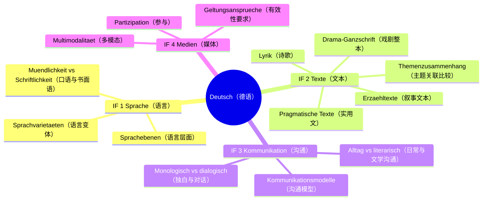
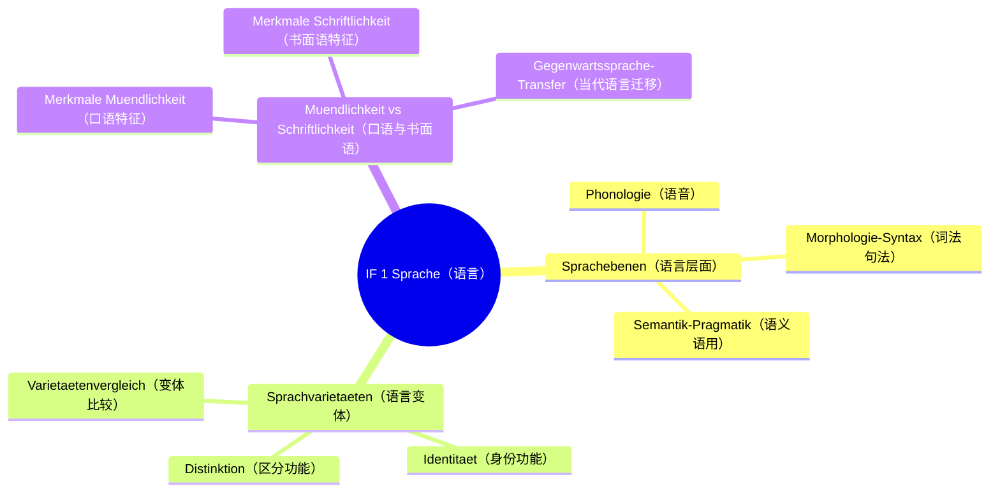
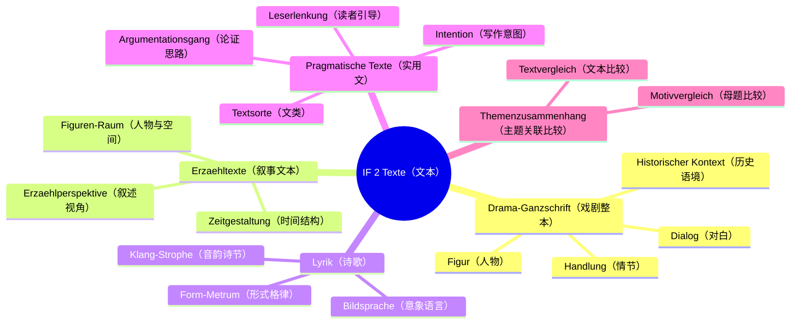
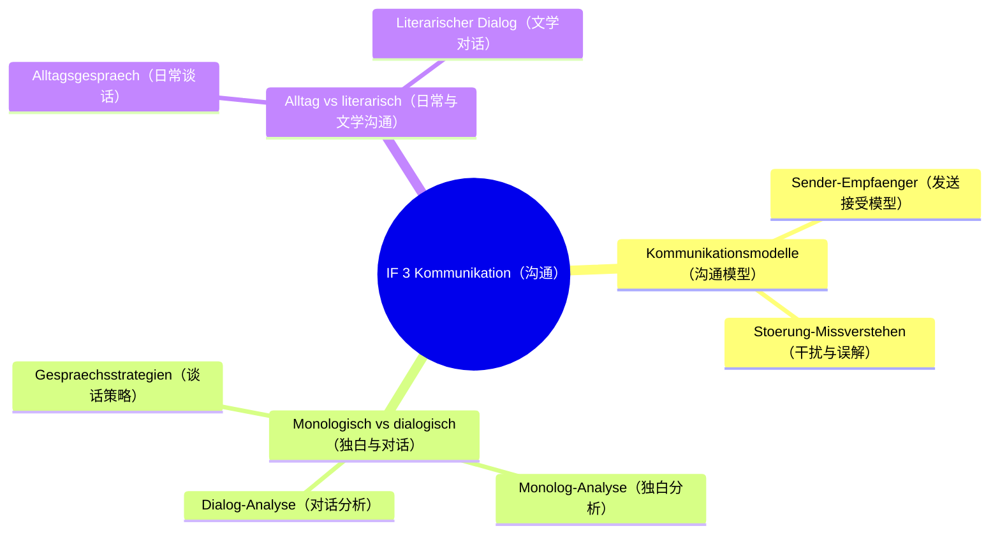
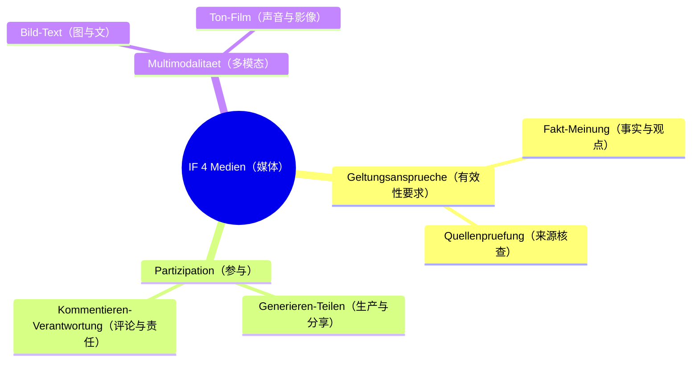

# Lernbaum Deutsch（德语学习树 · EF）

> 中文一句话：本树自顶向下覆盖 NRW KLP Deutsch 2023 的四个内容领域，EF 重点是戏剧整本 + 实用文分析，考试锚定 Aufgabenarten I–IV 与 AFB II。
> DE in einem Satz: Der Baum bildet die vier KLP-Inhaltsfelder EF ab, mit Drama-Ganzschrift und pragmatischen Texten als Schwerpunkt und Aufgabenarten I–IV mit AFB-II-Fokus.

⏳ 待确认：Drama-Ganzschrift 书名 + 作者（老师未答复，见 Lehrplan §3 TODO）。
⏳ 待确认：本学期 Sachtext 话题（老师未答复，见 Lehrplan §3 TODO）。

## 0. 总览 L0→L1→L2

## 1. 分 IF 展开 L1→L2→L3

### IF 1 Sprache

### IF 2 Texte

### IF 3 Kommunikation

### IF 4 Medien

## 2. 节点明细（中文在上，德语在下）

## IF 1 Sprache（语言）

中文说明：语言领域考“分层描述 + 变体功能 + 口语书面语对比”，为文本分析提供语言工具。
DE: Das Feld Sprache liefert das Sprachwerkzeug fuer die Textanalyse: Ebenen beschreiben, Varietaeten einordnen, Muendlichkeit und Schriftlichkeit vergleichen.

### Sprachebenen（语言层面）

- **Phonologie（语音）**
  - 中文一句话：识别语音手段如重音停顿，说明其口语表达效果。
  - Operatoren: [untersuchen, analysieren]
  - Klausur-Anbindung: Aufgabenart I–II, AFB I–II, Analyse-Baustein Sprache.
  - Leitfrage DE / ZH: Welche Lautmittel praegen den Ton? / 哪些语音手段塑造了语气？
- **Morphologie-Syntax（词法句法）**
  - 中文一句话：看词形句式如省略重复长短句，判断其风格功能。
  - Operatoren: [untersuchen, analysieren]
  - Klausur-Anbindung: Aufgabenart I–II, AFB II Schwerpunkt, Analyse-Baustein Form.
  - Leitfrage DE / ZH: Was leistet der Satzbau fuer die Wirkung? / 句式为表达效果起什么作用？
- **Semantik-Pragmatik（语义语用）**
  - 中文一句话：看词义选择与言外之意，解释其在语境中的功能。
  - Operatoren: [analysieren, deuten]
  - Klausur-Anbindung: Aufgabenart II, AFB II–III, Uebergang Analyse zu Deutung.
  - Leitfrage DE / ZH: Was bedeutet die Wortwahl im Kontext? / 词语选择在语境中意味着什么？

### Sprachvarietaeten（语言变体）

- **Distinktion（区分功能）**
  - 中文一句话：说明变体如何标记群体边界与社会距离。
  - Operatoren: [darstellen, untersuchen]
  - Klausur-Anbindung: Aufgabenart III, AFB I–II, Erklaerungs-Baustein.
  - Leitfrage DE / ZH: Wovon grenzt sich die Varietaet ab? / 该变体与什么划清界限？
- **Identitaet（身份功能）**
  - 中文一句话：说明变体如何表达归属与自我认同。
  - Operatoren: [untersuchen, erörtern]
  - Klausur-Anbindung: Aufgabenart III–IV, AFB II–III, Erörterungs-Anschluss.
  - Leitfrage DE / ZH: Welche Zugehoerigkeit zeigt die Sprache? / 语言显示了何种归属？
- **Varietaetenvergleich（变体比较）**
  - 中文一句话：对比两个变体的用词句式与场合，指出异同。
  - Operatoren: [untersuchen, vergleichen]
  - Klausur-Anbindung: Aufgabenart I–II, AFB II, Vergleichs-Baustein.注：vergleichen 此处为通用比较动作，判分动词仍以 Operatoren ab 2023 为准。
  - Leitfrage DE / ZH: Wo unterscheiden sich die Varietaeten? / 变体之间区别在哪里？

### Muendlichkeit vs Schriftlichkeit（口语与书面语）

- **Merkmale Muendlichkeit（口语特征）**
  - 中文一句话：指出即兴互动特征如省略重复修正，联系交际情境。
  - Operatoren: [darstellen, analysieren]
  - Klausur-Anbindung: Aufgabenart I–II, AFB I–II, Drama-Dialog-Brücke.
  - Leitfrage DE / ZH: Was macht den Text muendlich? / 什么使文本具有口语性？
- **Merkmale Schriftlichkeit（书面语特征）**
  - 中文一句话：指出规范复杂特征如长句衔接，联系写作规范。
  - Operatoren: [darstellen, analysieren]
  - Klausur-Anbindung: Aufgabenart I–II, AFB I–II, Sachtext-Brücke.
  - Leitfrage DE / ZH: Was macht den Text schriftlich? / 什么使文本具有书面语性？
- **Gegenwartssprache-Transfer（当代语言迁移）**
  - 中文一句话：把口语书面语框架迁移到聊天评论等当代用例。
  - Operatoren: [untersuchen, Stellung nehmen]
  - Klausur-Anbindung: Aufgabenart IV, AFB III, Stellungnahme-Schluss.
  - Leitfrage DE / ZH: Wie zeigt sich der Wandel heute? / 这种变化今天如何体现？

## IF 2 Texte（文本）

中文说明：文本领域是 EF 核心，戏剧整本必考，叙事诗歌实用文各有分析套路，最后做主题关联比较。
DE: Das Feld Texte ist der EF-Kern: Drama-Ganzschrift als Pflicht, Erzaehltexte, Lyrik und pragmatische Texte mit je eigenem Zugriff, dazu der Themenzusammenhang.

### Drama-Ganzschrift（戏剧整本）

⏳ 待确认：具体剧目书名 + 作者（确认后替换本节例文，不改结构）。

- **Figur（人物）**
  - 中文一句话：从对白行为他人评价梳理人物形象与人物关系。
  - Operatoren: [analysieren, interpretieren]
  - Klausur-Anbindung: Aufgabenart I, AFB II Schwerpunkt, Ganzschrift-Aufgabe.
  - Leitfrage DE / ZH: Was treibt die Figur an? / 什么驱动着这个人物？
- **Handlung（情节）**
  - 中文一句话：划分场次与冲突转折，说明戏剧结构功能。
  - Operatoren: [untersuchen, analysieren]
  - Klausur-Anbindung: Aufgabenart I, AFB I–II, Aufbau-Baustein.
  - Leitfrage DE / ZH: Wo kippt der Konflikt? / 冲突在哪里反转？
- **Dialog（对白）**
  - 中文一句话：分析对白中的语言变体与谈话策略，揭示权力与关系。
  - Operatoren: [analysieren, deuten]
  - Klausur-Anbindung: Aufgabenart I–II, AFB II, Dialog-Analyse mit Beleg und Zeile.
  - Leitfrage DE / ZH: Wer steuert das Gespraech? / 谁主导了这场谈话？
- **Historischer Kontext（历史语境）**
  - 中文一句话：把剧本放回创作时代，解释其主题的时代含义。
  - Operatoren: [einordnen, interpretieren]
  - Klausur-Anbindung: Aufgabenart I, AFB II–III, Kontext-Deutung.注：einordnen 为语境定位步骤，判分以 Operatoren ab 2023 为准。
  - Leitfrage DE / ZH: Was sagt das Stueck seiner Zeit? / 这部剧对它所处的时代说了什么？

### Erzaehltexte（叙事文本）

- **Erzaehlperspektive（叙述视角）**
  - 中文一句话：判断叙述人称与视角，说明其对信息与同情的影响。
  - Operatoren: [untersuchen, analysieren]
  - Klausur-Anbindung: Aufgabenart I–II, AFB II, Erzaehlanalyse-Baustein.
  - Leitfrage DE / ZH: Wer sieht und wer spricht? / 谁在看、谁在说？
- **Zeitgestaltung（时间结构）**
  - 中文一句话：看时序倒叙预叙与节奏，解释其悬念与意义功能。
  - Operatoren: [untersuchen, deuten]
  - Klausur-Anbindung: Aufgabenart I–II, AFB II, Aufbau-Baustein.
  - Leitfrage DE / ZH: Warum wird hier gerafft oder gedehnt? / 这里为何加速或延宕？
- **Figuren-Raum（人物与空间）**
  - 中文一句话：看人物配置与空间描写如何承载主题。
  - Operatoren: [analysieren, interpretieren]
  - Klausur-Anbindung: Aufgabenart I, AFB II–III, Deutungs-Baustein.
  - Leitfrage DE / ZH: Was spiegelt der Raum? / 空间映照了什么？

### Lyrik（诗歌）

- **Form-Metrum（形式格律）**
  - 中文一句话：描述诗节格律韵式，说明其形式与情感的关系。
  - Operatoren: [untersuchen, analysieren]
  - Klausur-Anbindung: Aufgabenart I, AFB I–II, Lyrik-Analyse Einstieg.
  - Leitfrage DE / ZH: Was traegt die Form zum Gefuehl bei? / 形式为情感贡献了什么？
- **Bildsprache（意象语言）**
  - 中文一句话：解读比喻象征等意象，联系诗歌主题。
  - Operatoren: [analysieren, deuten]
  - Klausur-Anbindung: Aufgabenart I, AFB II Schwerpunkt, Bild-Deutung mit Beleg.
  - Leitfrage DE / ZH: Wofuer steht das Bild? / 这个意象代表什么？
- **Klang-Strophe（音韵诗节）**
  - 中文一句话：分析音韵重复与诗节推进，说明其音乐性与结构功能。
  - Operatoren: [untersuchen, interpretieren]
  - Klausur-Anbindung: Aufgabenart I, AFB II, Klang- und Aufbau-Baustein.
  - Leitfrage DE / ZH: Wie fuehrt der Klang durchs Gedicht? / 音韵如何引导全诗？

### Pragmatische Texte（实用文）

⏳ 待确认：本学期 Sachtext 话题（确认后替换例文，不改 Textsorte/Argumentation/Leserlenkung/Intention 四步）。

- **Textsorte（文类）**
  - 中文一句话：判定文类如评论报道演说，指出其典型特征与期待。
  - Operatoren: [untersuchen, analysieren]
  - Klausur-Anbindung: Aufgabenart II–III, AFB I, Einleitungs-Baustein Textsorte.
  - Leitfrage DE / ZH: Welche Textsorte liegt vor? / 这是什么文类？
- **Argumentationsgang（论证思路）**
  - 中文一句话：梳理论点论据论证方式，画出论证链条。
  - Operatoren: [analysieren, untersuchen]
  - Klausur-Anbindung: Aufgabenart II, AFB II Schwerpunkt, Analyse-Kern mit Beleg und Zeile.
  - Leitfrage DE / ZH: Wie wird die These gestuetzt? / 论点如何被支撑？
- **Leserlenkung（读者引导）**
  - 中文一句话：找出称呼设问评价等引导手段，说明其说服策略。
  - Operatoren: [analysieren, deuten]
  - Klausur-Anbindung: Aufgabenart II, AFB II, Sprache-Wirkung-Baustein.
  - Leitfrage DE / ZH: Wie lenkt der Text die Lesenden? / 文本如何引导读者？
- **Intention（写作意图）**
  - 中文一句话：从内容形式语言推断作者意图与目标读者。
  - Operatoren: [deuten, erörtern]
  - Klausur-Anbindung: Aufgabenart II–III, AFB II–III, Uebergang zu Erörterung.
  - Leitfrage DE / ZH: Was will der Text bewirken? / 文本想达到什么效果？

### Themenzusammenhang（主题关联比较）

- **Motivvergleich（母题比较）**
  - 中文一句话：比较两文本同一母题的不同处理，指出时代或文类差异。
  - Operatoren: [untersuchen, interpretieren]
  - Klausur-Anbindung: Aufgabenart I–II, AFB II–III, Vergleichs-Baustein.
  - Leitfrage DE / ZH: Was bleibt gleich, was wandelt sich? / 什么不变、什么变了？
- **Textvergleich（文本比较）**
  - 中文一句话：比较文学与实用文对同一主题的呈现，得出有依据的判断。
  - Operatoren: [analysieren, erörtern]
  - Klausur-Anbindung: Aufgabenart II–III, AFB III, Erörterungs-Baustein.
  - Leitfrage DE / ZH: Welcher Text ueberzeugt und warum? / 哪篇文本更有说服力，为什么？

## IF 3 Kommunikation（沟通）

中文说明：沟通领域考模型套用与独白对话区分，日常谈话与文学对话对照是常考点。
DE: Das Feld Kommunikation prueft Modelle und die Unterscheidung monologisch und dialogisch, oft im Vergleich von Alltag und literarischer Gestaltung.

### Kommunikationsmodelle（沟通模型）

- **Sender-Empfaenger（发送接受模型）**
  - 中文一句话：用模型拆解谁对谁在什么情境说什么，定位交际要素。
  - Operatoren: [darstellen, untersuchen]
  - Klausur-Anbindung: Aufgabenart III, AFB I–II, Modell-Baustein.
  - Leitfrage DE / ZH: Wer kommuniziert was unter welchen Bedingungen? / 谁在什么条件下沟通了什么？
- **Stoerung-Missverstehen（干扰与误解）**
  - 中文一句话：找出干扰来源与误解节点，解释沟通失败原因。
  - Operatoren: [untersuchen, erörtern]
  - Klausur-Anbindung: Aufgabenart III, AFB II–III, Stoerungs-Analyse.
  - Leitfrage DE / ZH: Wo scheitert die Verstaendigung? / 理解在哪里失败？

### Monologisch vs dialogisch（独白与对话）

- **Monolog-Analyse（独白分析）**
  - 中文一句话：分析独白的自我对话与抉择功能，联系人物处境。
  - Operatoren: [analysieren, deuten]
  - Klausur-Anbindung: Aufgabenart I, AFB II, Drama-Brücke Monolog.
  - Leitfrage DE / ZH: Was klaert der Monolog? / 独白澄清了什么？
- **Dialog-Analyse（对话分析）**
  - 中文一句话：分析轮流发言与回应方式，揭示关系与冲突。
  - Operatoren: [analysieren, untersuchen]
  - Klausur-Anbindung: Aufgabenart I–III, AFB II Schwerpunkt, Dialog-Kern mit Beleg.
  - Leitfrage DE / ZH: Wie veraendert der Dialog die Lage? / 对话如何改变局势？
- **Gespraechsstrategien（谈话策略）**
  - 中文一句话：识别提问打断缓和等策略，评价其交际效果。
  - Operatoren: [untersuchen, Stellung nehmen]
  - Klausur-Anbindung: Aufgabenart III–IV, AFB III, Bewertungs-Schluss.
  - Leitfrage DE / ZH: Welche Strategie wirkt und warum? / 哪种策略有效，为什么？

### Alltag vs literarisch（日常与文学沟通）

- **Alltagsgespraech（日常谈话）**
  - 中文一句话：描述日常谈话的即兴合作特征，指出其交际目的。
  - Operatoren: [darstellen, untersuchen]
  - Klausur-Anbindung: Aufgabenart III, AFB I–II, Alltags-Baustein.
  - Leitfrage DE / ZH: Was kennzeichnet das Alltagsgespraech? / 日常谈话的特征是什么？
- **Literarischer Dialog（文学对话）**
  - 中文一句话：说明文学对话的人工 Gestaltung 如何服务主题与人物。
  - Operatoren: [analysieren, interpretieren]
  - Klausur-Anbindung: Aufgabenart I, AFB II–III, Literatur-Brücke.
  - Leitfrage DE / ZH: Was gestaltet der Dialog kuenstlerisch? / 对话在艺术上塑造了什么？

## IF 4 Medien（媒体）

中文说明：媒体领域考信息核查、参与责任与多模态分析，落点是批判性使用媒体。
DE: Das Feld Medien prueft Informationspruefung, verantwortliche Partizipation und multimodale Analyse mit dem Ziel kritischer Nutzung.

### Geltungsansprueche（有效性要求）

- **Fakt-Meinung（事实与观点）**
  - 中文一句话：区分事实陈述与观点评价，指出混合表达的引导意图。
  - Operatoren: [untersuchen, analysieren]
  - Klausur-Anbindung: Aufgabenart II, AFB I–II, Sachtext-Brücke.
  - Leitfrage DE / ZH: Was ist belegbar, was ist Meinung? / 什么是可证实的，什么是观点？
- **Quellenpruefung（来源核查）**
  - 中文一句话：检查来源可信度与证据质量，判断信息有效性。
  - Operatoren: [untersuchen, Stellung nehmen]
  - Klausur-Anbindung: Aufgabenart II–IV, AFB III, Pruef- und Stellungnahme-Baustein.
  - Leitfrage DE / ZH: Hält die Quelle der Pruefung stand? / 来源经得起核查吗？

### Partizipation（参与）

- **Generieren-Teilen（生产与分享）**
  - 中文一句话：描述用户如何生产转发内容，分析其传播逻辑。
  - Operatoren: [darstellen, untersuchen]
  - Klausur-Anbindung: Aufgabenart III–IV, AFB I–II, Mediennutzungs-Baustein.
  - Leitfrage DE / ZH: Wie verbreitet sich der Inhalt? / 内容如何传播？
- **Kommentieren-Verantwortung（评论与责任）**
  - 中文一句话：分析评论互动的规范与越界，论述使用者责任。
  - Operatoren: [erörtern, verfassen]
  - Klausur-Anbindung: Aufgabenart III–IV, AFB III, Erörterung oder Kommentar verfassen.
  - Leitfrage DE / ZH: Wo endet freie Meinungsaeusserung? / 言论自由止于何处？

### Multimodalitaet（多模态）

- **Bild-Text（图与文）**
  - 中文一句话：分析图片与文字如何互补或矛盾，共同制造意义。
  - Operatoren: [analysieren, deuten]
  - Klausur-Anbindung: Aufgabenart II, AFB II, Bild-Text-Analyse.
  - Leitfrage DE / ZH: Was zeigt das Bild, was der Text verschweigt? / 图显示了什么文没有说？
- **Ton-Film（声音与影像）**
  - 中文一句话：分析声音剪辑与镜头如何引导注意与情感。
  - Operatoren: [untersuchen, interpretieren]
  - Klausur-Anbindung: Aufgabenart II, AFB II–III, Film-Ton-Baustein.
  - Leitfrage DE / ZH: Wie steuert der Ton den Blick? / 声音如何引导视线？
