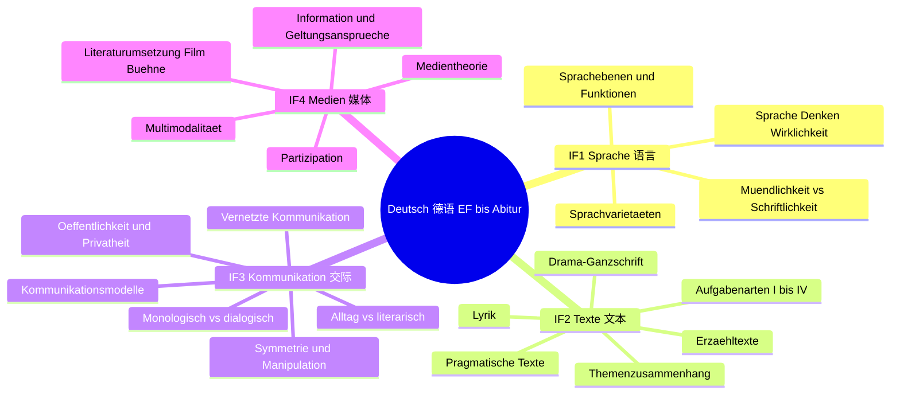
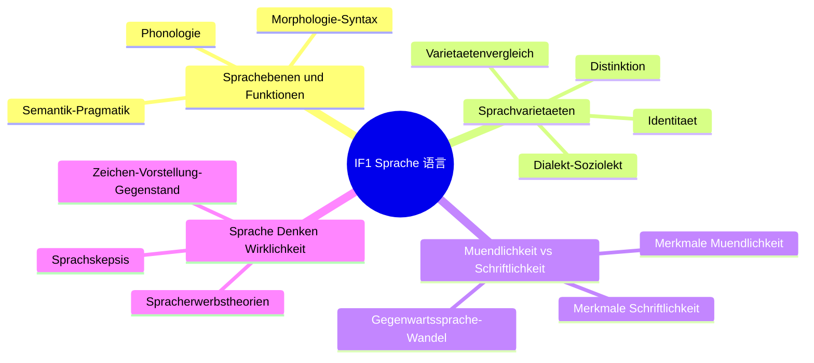
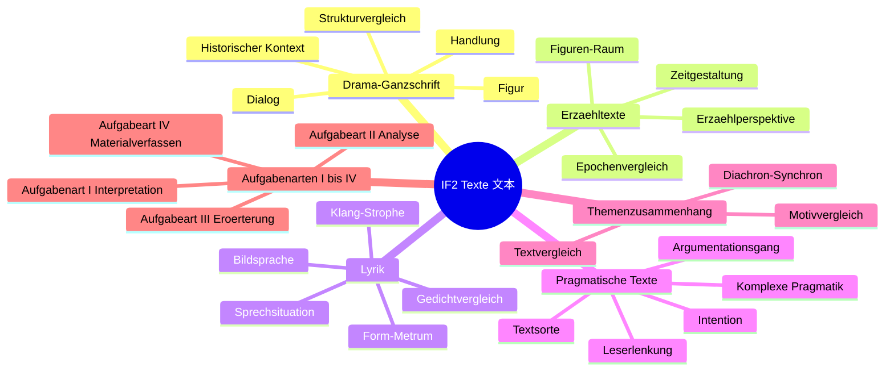
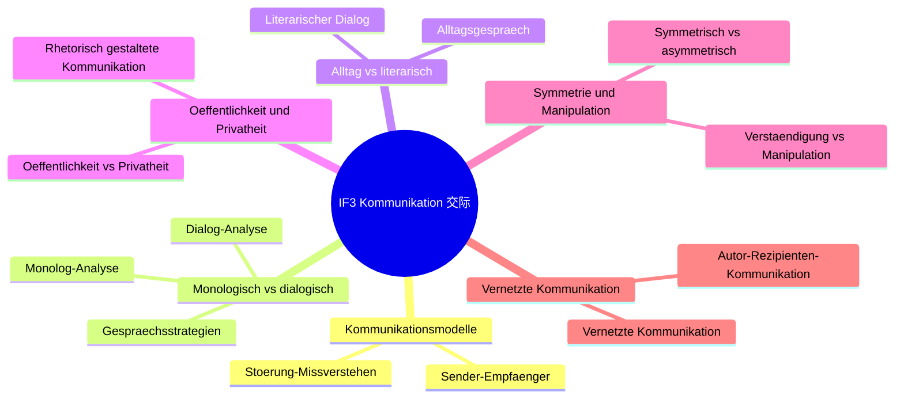
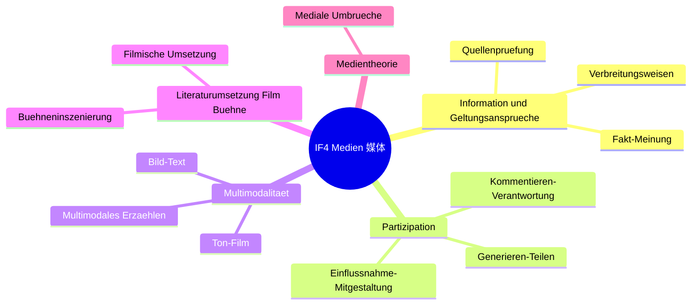

# Lernbaum Deutsch（德语学习树 · EF→Abitur）

> 中文一句话：德语 Oberstufe 的主线是**同一个文本对象反复加深**——4 个 Inhaltsfelder 在 EF/GK/LK 全周期复用，EF 打「描写—分析」的地基（ZKE = Aufgabenart IIa），Q 阶段跃迁到 Abitur 四类 Aufgabenart（文学阐释 / 实用文分析 / 论辩 / 材料写作），终点是 GK 255 min、LK 315 min 的 4 选 1。
> DE in einem Satz: Dieselben vier Inhaltsfelder begleiten die gesamte Oberstufe — die EF legt das Fundament aus Beschreiben und Analysieren (ZKE = Aufgabenart IIa), die Q-Phase führt zu den vier Abitur-Aufgabenarten; das Ziel ist die Abiturpruefung mit vier Aufgaben zur Auswahl (GK 255 min, LK 315 min).

⏳ 待确认：Drama-Ganzschrift 书名 + 作者（老师未答复）。**本树按考纲常规展开**（Figurengestaltung / Handlungsaufbau / Dialoggestaltung / sprachliche Gestaltung 四件套），书名确认后只补「本书专属人物表 + 场次梗概」，不改结构。
⏳ 待确认：本学期 Sachtext 话题（老师未答复）。同上，只换例文，不改 Textsorte / Argumentationsgang / Leserlenkung / Intention 四步。

---

## 0. Methoden-Profil（方法论画像 —— 本设计第二核心）

### 0.0 学段口径说明（**先读，否则会读错表格**）

⚠️ **Deutsch KLP 只有 EF 与 Qualifikationsphase（GK/LK）两级**，正文**不存在单独的 Q1 / Q2 标记** [已验证]（源：`Deutsch-Oberstufe.md` §0）。因此：

- 本树的学段列用 **`[EF]` / `[Q1-Q2]` / `[GK]` / `[LK]`** 四档，**`[Q1-Q2]` = KLP 的整个 Qualifikationsphase**，不是把 Q1 与 Q2 强行拆分 —— 这是源结构事实，非缺失。
- ⚠️ **4 个 IF 在 EF / GK / LK 全周期复用** [已验证]（对比 SoWi 的 EF/QP 完全不重叠）。差异只在**同一 IF 下的内容重点逐年加深**。
- → 实操含义：**补任何一个 IF 的笔记，都同时服务 EF 的 ZKE 与 Q 阶段的 Abitur**。这是 Deutsch 与 SoWi「EF 满 / QP 空」分布最大的不同 [据推断]。

### ① Abitur 能力权重（AFB 分布）

| AFB | 层级 | 本课权重 | 说明 |
|---|---|---|---|
| I | Reproduktion 复述 | **低（约 20%）** | 入口砖块：`(be)nennen` / `wiedergeben` / `beschreiben` / `zusammenfassen`。只做术语与事实的准确定位，从不单独成段拿高分 |
| II | Reorganisation und Transfer 重组与迁移 | **高（约 50%）** ⭐ 主战场 | `untersuchen`（II）/ `analysieren`（I–III）/ `vergleichen`（II–III）/ `erläutern`（II–III）/ `charakterisieren`。KLP 定义含「**selbstständiges Übertragen auf vergleichbare neue Zusammenhänge**」[已验证] |
| III | Reflexion und Problemlösung 反思与问题解决 | **中高（约 30%）** | `deuten` / `begründen` / `prüfen` / `(kritisch) Stellung nehmen` / `erörtern` / `gestalten` / `entwerfen`。Erörterung（III）与 materialgestütztes Verfassen（IV）两类的主体即在此 [据推断] |

> 官方通则 [已验证]：① Abitur 任务**必须覆盖全部三个 AFB**；② **AFB II 为重点**。
> ⚠️ 权重百分比为 **[据推断]**（KLP 未给分值配比）；「AFB II 为重点」与「三 AFB 全覆盖」为 **[已验证]**。

### ② 黄金学习法（证据来自 `00_META/Lernmethoden-Evidenz.md`）

| 方法 | 证据来源 | 本课应用方式 |
|---|---|---|
| **检索练习（Practice Testing / Retrieval）** | Karpicke & Blunt 2011（d≈1.0）；Adesope et al. 2017（g≈0.61–0.70） | **Deutsch 第一主力**。合书默写：Fachbegriff 清单、`Leserlenkung` 手段表、Erörterung 三段结构。凡「觉得会了」一律换成默写验证 |
| **间隔重复（Spaced / Distributed）** | Rohrer 2007 / 2015 / 2020；FSRS retention 0.9 + successive relearning 3 次 | 术语卡与 Zitat-Beleg 库走 FSRS 到期制；Planner 按 ZKE / Abitur 倒排三轮，不平均用力 |
| **交错练习 + 对比辨别（Interleaving / Discriminative Contrast）** | Rohrer & Taylor 2007（d≈1.34）；Taylor & Rohrer 2010（d≈1.21）；Foster et al. 2019 | **Deutsch 第二主力**。一次练习混排 2–3 类 Aufgabenart（如「Gedichtanalyse + Sachtextanalyse + Erörterung」）；每题先做 discrimination 二选「这题是 Ia 还是 IIa？」再动笔 |
| **TAP 一致性（练习题型 = 考试题型）** | Adesope 2017 §6（一致 g≈0.63 > 不一致 g≈0.53） | 平时 check 题必须与 Klausur 同形：同样 Operator 措辞、同样 100/255/315 min 计时、同样材料形态 |
| **正确例题精读 + 带扶手自解释** | Barbieri et al. 2023（g≈0.48）；Wittwer & Renkl 2010 | 新题型（如 IV 材料写作）首学 = 1 篇满分范文精读，逐步标「这步用了哪条规则」；**不问空的「你为什么这么想」**（开放自解释 β≈−0.24） |
| **先行组织者（Advance Organizer）** | Ausubel | 每个新文本单元开头先给「文学史坐标 + Gattung + 本篇在 Abitur 里会出现成哪类题」一页纸 |
| **反馈三层：KR → 延迟展开 → 过程反馈** | Brummer et al. 2024（g≈0.41，KR g≈0.64）；Kandemir（时机差异 g≈0.03） | 作文/分析练完一整套再统一对答案；先判对错，再归类错因（**辨别错 / 知识错 / 表达错**） |
| **CTML 一图一概念** | Mayer；Cromley et al. 2025（g≈0.37） | 笔记配图只承载一个概念（如一张 Kommunikationsmodell 图只讲一个模型），装饰图不进库 |

### ③ 三大典型失分点

1. **AFB 层级误判（Deutsch 的头号陷阱）** —— ⚠️ `analysieren` / `interpretieren` / `erörtern` / `verfassen` 这 **4 个核心动词跨全部三个 AFB** [已验证，官方 Operatoren 表]。**不能凭动词判层级，必须读任务的具体设问**。典型事故：把「**分析**作者的读者引导手段」写成「**评价**这种引导是否正当」，或反过来在 III 层只给描述。对策：动笔前用 10 秒把题干动词 + 限定语（„inwiefern“ / „unter Berücksichtigung von“ / „nehmen Sie Stellung“）译成中文动作，再分配段落。
2. **材料引用不足（复述代替分析）** —— 只 paraphrasieren 不 belegen：缺 Zitat + Zeilenangabe + 「引用 → 手段 → 作用」三步链。IV 类（materialgestütztes Verfassen）尤其致命：材料未标注出处、论点无材料支撑 → 直接跌到 AFB I。对策：每个分析段强制「1 Beleg + 1 Fachbegriff + 1 Wirkungssatz」。
3. **Fachsprache 不足 + 语言正确性** —— 用日常口语（„der Text ist überzeugend“）替代 Fachbegriff（`Appellfunktion` / `Metaphorik` / `These-Begründung`），命中九项评价标准第 8 项 [已验证]。叠加 §13 Abs. 2：**Q 阶段大量语言错误最多扣 2 Notenpunkte，EF 降一个 Notenstufe** [已验证]。对策：建个人 `Formulierungsbausteine` 句式库并默写。

### ④ 本课笔记结构模板

> Deutsch 笔记不是「知识点罗列」，而是**一块可直接搬进考场的砖**。每个 L3 节点按下述六段写（中文理解在上、德语术语在下）：

```markdown
# <L3 主题>（DE 原名）
1. Begriff DE / ZH —— 一句定义（用官方措辞，不自创）
2. Erkennungssignal —— **怎么在文本里认出它**（视觉/句法/词汇信号清单）
3. Beleg-Baustein —— **Zitat + Zeile + 分析** 的句式模板（可整段照抄的骨架句）
4. AFB-Stufen —— 同一 Operator 在 **AFB I / II / III** 下的三种答法对照（防失分点 ①）
5. Fehlerlog —— 错题三分类：**辨别错 / 知识错 / 表达错**
6. Zeit-Budget —— 该节点在 ZKE 100 min / GK 255 min / LK 315 min 下的建议用时
```

---

## 1. 总览 Gesamtübersicht（L0→L1→L2）


```mermaid
mindmap
  root((Deutsch 德语 EF bis Abitur))
    IF1 Sprache 语言
      Sprachebenen und Funktionen
      Sprachvarietaeten
      Muendlichkeit vs Schriftlichkeit
      Sprache Denken Wirklichkeit
    IF2 Texte 文本
      Drama-Ganzschrift
      Erzaehltexte
      Lyrik
      Pragmatische Texte
      Themenzusammenhang
      Aufgabenarten I bis IV
    IF3 Kommunikation 交际
      Kommunikationsmodelle
      Monologisch vs dialogisch
      Alltag vs literarisch
      Oeffentlichkeit und Privatheit
      Symmetrie und Manipulation
      Vernetzte Kommunikation
    IF4 Medien 媒体
      Information und Geltungsansprueche
      Partizipation
      Multimodalitaet
      Literaturumsetzung Film Buehne
      Medientheorie
```

> L1 与 `Curriculum/Deutschland/Deutsch-Oberstufe.md` §1 的 4 个 IF **逐一对齐** [已验证]：Sprache / Texte / Kommunikation / Medien，EF + GK + LK 全复用。
> **结构性结论** [据推断，依据 `Deutsch-Oberstufe.md` §5.3]：四类 Aufgabenart **全部主落在 IF2 Texte**；IF3 是「论辩 / 读者引导 / 操纵」的分析视角来源；IF1 提供语言分析工具；IF4 在 Ia（媒体作品）与 IV（材料写作）中显形。

---

## 2. 分 IF 展开（L1→L2→L3 + 应试四行）

### L1: IF1 — Sprache（语言）[已验证，KLP §2.2 / §2.3.1 / §2.3.2]


```mermaid
mindmap
  root((IF1 Sprache 语言))
    Sprachebenen und Funktionen
      Phonologie
      Morphologie-Syntax
      Semantik-Pragmatik
    Sprachvarietaeten
      Distinktion
      Identitaet
      Varietaetenvergleich
      Dialekt-Soziolekt
    Muendlichkeit vs Schriftlichkeit
      Merkmale Muendlichkeit
      Merkmale Schriftlichkeit
      Gegenwartssprache-Wandel
    Sprache Denken Wirklichkeit
      Zeichen-Vorstellung-Gegenstand
      Sprachskepsis
      Spracherwerbstheorien
```

中文说明：IF1 是**工具层 IF**——它不直接充当 Abitur 的考试对象，但 **IIa 的 sprachliche Gestaltung 分析、Ia 的语言设计分析全靠它** [据推断，依 `Deutsch-Oberstufe.md` §5.3 结论 3]。德语：Das Feld Sprache liefert das Werkzeug fuer die Textanalyse.

#### L2.1 Sprachebenen und Funktionen（语言层面与功能）[EF]

- **Phonologie 语音手段** `[EF]`
  - 中文一句话：识别重音、停顿、头韵、拟声等语音手段，说明其对语气与节奏的作用。
  - Klausur-Anbindung：Ia 文学阐释 / IIa 实用文分析的 `sprachliche Gestaltung` 子项，AFB I–II，权重低（通常与 Morphologie/Syntax 合并在同一分析段内）。
  - Operatoren：`(be)nennen`（I）、`untersuchen`（II）、`analysieren`（I–III）
  - Lernweg ZH：术语卡（Begriff / Erkennungssignal / Wirkung 三栏）+ **检索练习合书默写**（Karpicke & Blunt 2011）；再用**正确例题精读**一段独白，逐处标语音手段（Barbieri 2023）。
  - Fehlerquelle：只 `nennen` 术语不给作用 → 卡在 AFB I；或用 „klingt stark“ 等日常语替代 `Rhythmisierung` / `Lautmalerei`。
  - 📓 笔记：⚠️ 缺口（见 §4 · `Sprache-Ebenen-und-Varietaeten.md`）

- **Morphologie-Syntax 词法与句法** `[EF]`
  - 中文一句话：看词形与句式（省略、重复、长短句、被动、疑问句序），判断其风格与功能。
  - Klausur-Anbindung：**IIa 分析的核心砖块**（KLP §3 Analyseaufgaben 明列 „sprachliche Gestaltung“），AFB II 为主；在 Ia 中同样计入。
  - Operatoren：`untersuchen`（II）、`analysieren`（I–III）、`beschreiben`（I–II）
  - Lernweg ZH：**交错练习**——把 Satzbau 分析与 Bildsprache 分析混排做（Rohrer & Taylor 2007）；每题先辨「这题要我 analysieren 还是 nur beschreiben？」（Discriminative Contrast, Foster 2019）。
  - Fehlerquelle：把 `beschreiben`（描述句式）当成 `analysieren`（分析功能）交卷 → 大面积停留在 AFB I；术语写成 „lange Sätze“ 而非 `Hypotaxe` / `Parataxe`。
  - 📓 笔记：⚠️ 缺口（见 §4 · `Sprache-Ebenen-und-Varietaeten.md`）

- **Semantik-Pragmatik 语义与语用** `[EF]`
  - 中文一句话：看词义选择、内涵与言外之意，解释其在语境中的功能。
  - Klausur-Anbindung：IIa 与 IIIa 的交接点——从「语言手段描写」过渡到「意图推导」，AFB II–III。
  - Operatoren：`analysieren`（I–III）、`deuten`（III）、`erläutern`（II–III）
  - Lernweg ZH：**对比辨别**训练（Konnotation vs Denotation、wörtlich vs übertragen 对照卡，Rohrer 交错 + Foster 辨别机制）；用 TAP 对齐的真题句做 3 题微测（Adesope 2017）。
  - Fehlerquelle：把语用含义当成作者事实主张写进 Erörterung → 事实正确性（sachliche Richtigkeit）失分。
  - 📓 笔记：⚠️ 缺口（见 §4 · `Sprache-Ebenen-und-Varietaeten.md`）

#### L2.2 Sprachvarietaeten（语言变体）[EF→Q1-Q2]

- **Distinktion 区分功能** `[EF]`
  - 中文一句话：说明变体如何标记群体边界与社会距离。
  - Klausur-Anbindung：Ia 戏剧人物分析（谁用什么话 = 谁有什么地位）与 IIIa 论辩的解释砖块，AFB I–II。
  - Operatoren：`darstellen`（I–II）、`untersuchen`（II）
  - Lernweg ZH：**先行组织者**（Ausubel）——先一页纸给「Varietät → Sprachsignal → gesellschaftliche Funktion」对照表，再做术语默写。
  - Fehlerquelle：只说 „er spricht anders“，不标 `Soziolekt` / `Dialekt` / `Regiolekt` 术语 → Fachsprache 项扣分。
  - 📓 笔记：⚠️ 缺口（见 §4 · `Sprache-Ebenen-und-Varietaeten.md`）

- **Identitaet 身份功能** `[EF]`
  - 中文一句话：说明变体如何表达归属与自我认同（sprachliche Zuschreibungen）。
  - Klausur-Anbindung：IIIa/IIIb 论辩与 IVb 论证性材料写作中的社会维度，AFB II–III。
  - Operatoren：`untersuchen`（II）、`erörtern`（I–III）、`erläutern`（II–III）
  - Lernweg ZH：**检索练习**（默写 3 个可迁移的 Beleg-Baustein 句）+ **延迟反馈**（整套做完再对照，Kandemir 时机无差异）。
  - Fehlerquelle：AFB 误判——`erörtern` 跨三 AFB，若题干要求「论述身份建构的合理性」却只给描写，直接掉层。
  - 📓 笔记：⚠️ 缺口（见 §4 · `Sprache-Ebenen-und-Varietaeten.md`）

- **Varietaetenvergleich 变体比较** `[EF]`
  - 中文一句话：对比两个变体的用词、句式与适用场合，指出异同与效果差异。
  - Klausur-Anbindung：Ia 戏剧对话分析（跨人物语言对照）与 IIb 比较分析的语言侧，AFB II。
  - Operatoren：`vergleichen`（II–III）、`untersuchen`（II）
  - Lernweg ZH：**交错 + 辨别**——与「文本比较（IIb）」混排练，先判「比的是语言变体还是整篇文本」再动笔（Rohrer 2015）。
  - Fehlerquelle：只列两张对照表不给 `Vergleichsmaßstab`（比较维度）→ 官方定义要求「Gemeinsamkeiten / Ähnlichkeiten / Unterschiede **并相互权衡**」，缺权衡即缺 AFB III。
  - 📓 笔记：⚠️ 缺口（见 §4 · `Sprache-Ebenen-und-Varietaeten.md`）

- **Dialekt-Soziolekt 方言与社会方言** `[Q1-Q2]` `[GK]` `[LK]`
  - 中文一句话：把变体分析精确到 Dialekt / Soziolekt 的实体层面，并联系其社会意义。
  - Klausur-Anbindung：Q 阶段 Ia / Ib（跨历史语境戏剧的语言设计）与 IIIa 论辩，AFB II–III。
  - Operatoren：`charakterisieren`（II–III）、`einordnen`（I–II）、`in Beziehung setzen`（II–III）
  - Lernweg ZH：**正确例题精读**一篇含变体对照的 GK 范文 + 带扶手自解释两问（这步用了哪个 Begriff？上一步结论是什么？）（Barbieri 2023 / Wittwer & Renkl 2010）。
  - Fehlerquelle：Dialekt 与 Soziolekt 混用；把地域变体说成阶层变体 → sachliche Richtigkeit 失分。
  - 📓 笔记：⚠️ 缺口（见 §4 · `Sprache-Ebenen-und-Varietaeten.md`，含 QP 加深段）

#### L2.3 Muendlichkeit vs Schriftlichkeit（口语性与书面性）[EF→Q1-Q2]

- **Merkmale Muendlichkeit 口语性特征** `[EF]`
  - 中文一句话：指出即兴与互动特征（省略、重复、修正、插入语），联系交际情境。
  - Klausur-Anbindung：**戏剧对白分析的接口**（IIa 转 Ia），AFB I–II。
  - Operatoren：`darstellen`（I–II）、`analysieren`（I–III）
  - Lernweg ZH：**对比辨别卡**（口语 8 特征 vs 书面 8 特征正反对照，Rohrer/Foster）；合书默写后再开书对照（Adesope §6 recall > recognition）。
  - Fehlerquelle：把口语特征写成「作者写作水平差」→ 无视 Gattung 与 Funktionszusammenhang。
  - 📓 笔记：⚠️ 缺口（见 §4 · `Sprache-Ebenen-und-Varietaeten.md`）

- **Merkmale Schriftlichkeit 书面性特征** `[EF]`
  - 中文一句话：指出规范与复杂特征（长句、衔接、名词化），联系写作规范与受众。
  - Klausur-Anbindung：IIa 实用文分析的语言侧 + IVa 说明性材料写作的自身文风要求，AFB I–II。
  - Operatoren：`darstellen`（I–II）、`analysieren`（I–III）、`beschreiben`（I–II）
  - Lernweg ZH：**TAP 对齐**——练习材料直接用 Kommentar / Leitartikel 原文；写完对照范文的 Satzbau（Adesope 2017）。
  - Fehlerquelle：只描述不分析，或反过来在 IIa 里对书面特征做价值评判（跑出 Aufgabenart II 的边界）。
  - 📓 笔记：⚠️ 缺口（见 §4 · `Sprache-Ebenen-und-Varietaeten.md`）

- **Gegenwartssprache-Wandel 当代语言变迁** `[Q1-Q2]` `[GK]` `[LK]`
  - 中文一句话：分析当代语言的变化趋势，区分**有控（gesteuert）与无控（ungesteuert）**两种形式。
  - Klausur-Anbindung：Q 阶段 IIa / IVa（语言变迁类材料）与 IIIa 论辩题的常见素材，AFB II–III。
  - Operatoren：`erläutern`（II–III）、`untersuchen`（II）、`(kritisch) Stellung nehmen`（III）
  - Lernweg ZH：**先行组织者**（先给「变迁现象 → gesteuert/ungesteuert → 评价尺度」一页纸）+ **间隔重复**三轮（Rohrer successive relearning）。
  - Fehlerquelle：`gesteuert` / `ungesteuert` 判定错误；或把语言变迁题写成纯表态（应 Stellung nehmen 却无材料依据）。
  - 📓 笔记：⚠️ 缺口（见 §4 · `Sprache-Ebenen-und-Varietaeten.md`，QP 段）

#### L2.4 Sprache-Denken-Wirklichkeit（语言·思维·现实）[Q1-Q2]

> KLP 递进：EF 只有「结构层面描写」→ GK 加「符号—表象—对象关系 + 语言史变迁」→ LK 再加 `Sprachskepsis` 与 `Spracherwerbstheorien` [已验证]。

- **Zeichen-Vorstellung-Gegenstand 符号·表象·对象** `[Q1-Q2]` `[GK]` `[LK]`
  - 中文一句话：说明语言符号、心理表象与所指对象之间的关系（语言如何「切分」世界）。
  - Klausur-Anbindung：Q 阶段 **IIIb 文学文本论辩**（以实用文本为基础的语言/认识论议题）与 IVa 材料写作，AFB II–III。
  - Operatoren：`erläutern`（II–III）、`in Beziehung setzen`（II–III）、`erörtern`（I–III）
  - Lernweg ZH：**正确例题精读**一道 GK 真题 + 带扶手自解释；随后**交错混排**与 SoWi 的认识论题（Rohrer 2015 课堂 d≈0.42/0.79）。
  - Fehlerquelle：把「语言相对性」说成决定论式的绝对命题 → 精细度（Differenziertheit）失分。
  - 📓 笔记：⚠️ 缺口（见 §4 · `Sprache-Denken-Wirklichkeit-und-Spracherwerb.md`）

- **Sprachskepsis 语言怀疑论** `[LK]`
  - 中文一句话：考察「语言能否如实表达世界」的怀疑立场（ Hofmannsthal / Kafka 传统）。
  - Klausur-Anbindung：**LK 专属** Ia / Ib 文学阐释的深层 Deutung 段，AFB III。
  - Operatoren：`deuten`（III）、`interpretieren`（I–III）、`sich auseinandersetzen mit`（II–III）
  - Lernweg ZH：**对比辨别**——把 Sprachskepsis 与「寻常的主题悲观」做成判别卡（防混，Foster 2019）；Feynman 式讲解**只用于对照修正环节**（开放自解释 β≈−0.24，Wittwer & Renkl 2010）。
  - Fehlerquelle：把 Sprachskepsis 写成作者个人情绪 → 概念层级错误（知识错而非表达错）。
  - 📓 笔记：⚠️ 缺口（见 §4 · `Sprache-Denken-Wirklichkeit-und-Spracherwerb.md`，LK 段）

- **Spracherwerbstheorien 语言习得理论** `[LK]`
  - 中文一句话：掌握第一语言习得与多语现象的基本理论立场（KLP LK 明确列出）。
  - Klausur-Anbindung：**LK 专属** IVa 说明性材料写作 / III 论辩的理论素材，AFB II–III。
  - Operatoren：`darstellen`（I–II）、`erläutern`（II–III）、`überprüfen`（II–III）
  - Lernweg ZH：**间隔重复**术语卡（retention 0.9, FSRS）+ 一图一概念（每条理论一张图，Mayer CTML）。
  - Fehlerquelle：理论名称张冠李戴；把 Erstspracherwerb 与 Mehrsprachigkeit 的结论混用。
  - 📓 笔记：⚠️ 缺口（见 §4 · `Sprache-Denken-Wirklichkeit-und-Spracherwerb.md`，LK 段）

---

### L1: IF2 — Texte（文本）[已验证] ⭐ Abitur 枢纽 IF


```mermaid
mindmap
  root((IF2 Texte 文本))
    Drama-Ganzschrift
      Figur
      Handlung
      Dialog
      Historischer Kontext
      Strukturvergleich
    Erzaehltexte
      Erzaehlperspektive
      Zeitgestaltung
      Figuren-Raum
      Epochenvergleich
    Lyrik
      Form-Metrum
      Bildsprache
      Klang-Strophe
      Sprechsituation
      Gedichtvergleich
    Pragmatische Texte
      Textsorte
      Argumentationsgang
      Leserlenkung
      Intention
      Komplexe Pragmatik
    Themenzusammenhang
      Motivvergleich
      Textvergleich
      Diachron-Synchron
    Aufgabenarten I bis IV
      Aufgabenart I Interpretation
      Aufgabeart II Analyse
      Aufgabeart III Eroerterung
      Aufgabeart IV Materialverfassen
```

中文说明：**4 类 Abitur-Aufgabenart 全部主落在本 IF** [据推断，依 `Deutsch-Oberstufe.md` §5.3]——文本是考试对象，其余三 IF 提供分析视角。EF 打地基（Drama 整本 + 四大文本类型），Q 阶段叠加「跨历史语境 + 文学史贯通 + 比较 + 材料写作」。
DE: Texte ist das Drehkreuz des Abiturs.

#### L2.1 Drama-Ganzschrift（戏剧整本）[EF→Q1-Q2]

⏳ 待确认：具体剧目书名 + 作者。以下四件套为 KLP 原文要素，书名不影响结构。

- **Figur 人物塑造** `[EF]`
  - 中文一句话：从对白、行为、他人评价三路梳理人物形象与人物关系。
  - Klausur-Anbindung：**Aufgabenart Ia**（ggf. mit weiterführendem Schreibauftrag）的核心，AFB II 为主；EF 阶段即 ZKE 之外的重点 Klausur 对象。
  - Operatoren：`charakterisieren`（II–III）、`analysieren`（I–III）、`interpretieren`（I–III）
  - Lernweg ZH：**检索练习**默写人物关系图（合书）+ **间隔重复**三轮；书名定后改用 TAP 对齐的真题人物题（Adesope 2017）。
  - Fehlerquelle：只复述情节（wiedergeben，AFB I）不作 `charakterisieren`；或用 „böse“ 等日常词替代 `Ambivalenz` / `Figurenkonstellation`。
  - 📓 笔记：✅ `01_Deutsch/Texte-Analyse/Drama-Ganzschrift-Kandidaten.md`（⏳ 书名待确认）

- **Handlung 情节结构** `[EF]`
  - 中文一句话：划分场次与冲突转折，说明戏剧结构功能。
  - Klausur-Anbindung：Ia 的 Aufbau-Baustein，AFB I–II（分析段内权重低但不可省）。
  - Operatoren：`darstellen`（I–II）、`untersuchen`（II）、`zusammenfassen`（I–II）
  - Lernweg ZH：**一图一概念**（场次曲线图只讲一处转折点，Mayer）+ 合书默写场次表。
  - Fehlerquelle：把内容梗概当结构分析；漏掉 Wendepunkt 的功能说明。
  - 📓 笔记：✅ `Drama-Ganzschrift-Kandidaten.md`（通用工具箱部分）

- **Dialog 对话设计** `[EF]`
  - 中文一句话：分析对白中的语言变体与谈话策略，揭示权力关系与冲突走向。
  - Klausur-Anbindung：Ia 的核心分析砖块（Dialoggestaltung 是 KLP 明文四要素之一），AFB II；也是 IF3 的接入点。
  - Operatoren：`analysieren`（I–III）、`deuten`（III）、`untersuchen`（II）
  - Lernweg ZH：**对比辨别**训练（Dialoganalyse vs Monologanalyse 混排，先判题再做）；每处引用走「Zitat+Zeile → Mittel → Wirkung」三步链。
  - Fehlerquelle：引用不带 Zeilenangabe；描述对话「说了什么」而不分析「怎么说、为何有效」。
  - 📓 笔记：✅ `Drama-Ganzschrift-Kandidaten.md`（⏳ 补本书专属对白表）

- **Historischer Kontext 历史语境** `[EF]`
  - 中文一句话：把剧本放回创作时代，解释其主题的时代含义。
  - Klausur-Anbindung：Ia 的 Deutung 段（AFB II–III）；Q 阶段升级为**跨历史语境对照**的必答题。
  - Operatoren：`einordnen`（I–II）、`interpretieren`（I–III）、`in Beziehung setzen`（II–III）
  - Lernweg ZH：**先行组织者**（先给时代坐标一页纸）+ **延迟反馈**（整套题做完再统一校正史实）。
  - Fehlerquelle：把语境知识当成答案主体（变成 Geschichtsreferat）；或 `einordnen` 写成了纯复述（AFB I）。
  - 📓 笔记：✅ `Drama-Ganzschrift-Kandidaten.md`（通用部分）· ⚠️ QP 加深见 §4

- **Strukturvergleich 结构相异戏剧对照** `[Q1-Q2]` `[GK]` `[LK]`
  - 中文一句话：比较**结构上互不相同**、来自**不同历史语境**的两部戏剧，并（LK）对照其诗学构想。
  - Klausur-Anbindung：**Aufgabenart Ib**（vergleichende Interpretation），AFB II–III；LK 另加 `poetologische Konzepte` 维度。
  - Operatoren：`vergleichen`（II–III）、`interpretieren`（I–III）、`sich auseinandersetzen mit`（II–III）
  - Lernweg ZH：**交错练习**——把戏剧比较与 Gedichtvergleich 混排（Rohrer 2015 真实课堂 d≈0.42/0.79）；每题先自定 `Vergleichsmaßstab` 再写。
  - Fehlerquelle：**无比较维度**的通篇并列（A 剧一段、B 剧一段）；或只比内容不比结构（违反 KLP„strukturell unterschiedliche“要求）。
  - 📓 笔记：⚠️ 缺口（见 §4 · `Drama-Strukturvergleich-QP.md`）

#### L2.2 Erzaehltexte（叙事文本）[EF→Q1-Q2]

- **Erzaehlperspektive 叙述视角** `[EF]`
  - 中文一句话：判断叙述人称与视角（auktorial / personal / Ich），说明其对信息与同情的影响。
  - Klausur-Anbindung：**Aufgabenart Ia** 亦可考叙事文本（`Deutsch-Oberstufe.md` §6.3 缺口 3），AFB II。
  - Operatoren：`untersuchen`（II）、`analysieren`（I–III）、`charakterisieren`（II–III）
  - Lernweg ZH：**对比辨别卡**（三种 Erzählsituation 判别信号）+ 合书默写；用**正确例题精读**一篇 Kurzgeschichte 范文。
  - Fehlerquelle：人称与视角混为一谈（Ich-Erzähler ≠ personal）；术语写作 „aus der Sicht von“ 而非 `Personale Erzählsituation`。
  - 📓 笔记：⚠️ 缺口（**高优先级** · 见 §4 · `Erzaehltexte-Analyse.md`）

- **Zeitgestaltung 时间结构** `[EF]`
  - 中文一句话：看时序、倒叙、预叙与节奏（Raffung / Dehnung），解释其悬念与意义功能。
  - Klausur-Anbindung：Ia 的 Aufbau-Baustein，AFB II。
  - Operatoren：`untersuchen`（II）、`erläutern`（II–III）、`deuten`（III）
  - Lernweg ZH：**一图一概念**（时间轴图只讲一处 Raffung）+ TAP 对齐真题 3 题微测。
  - Fehlerquelle：只标「有倒叙」不解释功能；把 `Raffung` 与 `Dehnung` 的作用写反。
  - 📓 笔记：⚠️ 缺口（见 §4 · `Erzaehltexte-Analyse.md`）

- **Figuren-Raum 人物与空间** `[EF]`
  - 中文一句话：看人物配置与空间描写如何承载主题。
  - Klausur-Anbindung：Ia 的 Deutungs-Baustein，AFB II–III。
  - Operatoren：`analysieren`（I–III）、`interpretieren`（I–III）、`in Beziehung setzen`（II–III）
  - Lernweg ZH：**检索练习**（默写法：空间描写 → 象征义）+ **过程反馈**归类错因（辨别错 / 知识错 / 表达错，Brummer 2024）。
  - Fehlerquelle：把空间当背景交代；象征解读无 Beleg 支撑（跌回 AFB I）。
  - 📓 笔记：⚠️ 缺口（见 §4 · `Erzaehltexte-Analyse.md`）

- **Epochenvergleich 跨历史语境叙事对照** `[Q1-Q2]` `[GK]` `[LK]`
  - 中文一句话：比较来自不同历史语境、结构上互不相同的叙事文本（LK 含诗学构想对照）。
  - Klausur-Anbindung：**Aufgabenart Ib**，AFB II–III；须叠加文学史定位（GK：Aufklärung→Gegenwart，LK：Barock→Gegenwart）[已验证]。
  - Operatoren：`vergleichen`（II–III）、`einordnen`（I–II）、`interpretieren`（I–III）
  - Lernweg ZH：**先行组织者**（文学史年表一页纸）+ **交错练习**（与戏剧比较、诗歌比较混排，Rohrer）。
  - Fehlerquelle：把两篇文本的时代顺序写错；或只做 synchrone 比较而漏掉 KLP 要求的 diachrone 维度。
  - 📓 笔记：⚠️ 缺口（见 §4 · `Literaturgeschichte-Aufklaerung-Gegenwart.md`）

#### L2.3 Lyrik（抒情文本）[EF→Q1-Q2]

- **Form-Metrum 形式与格律** `[EF]`
  - 中文一句话：描述诗节、格律、韵式，说明形式与情感的关系。
  - Klausur-Anbindung：**Ia 抒情阐释的标准入口**，AFB I–II（权重低但为后续 Deutung 提供材料）。
  - Operatoren：`beschreiben`（I–II）、`untersuchen`（II）、`(be)nennen`（I）
  - Lernweg ZH：**检索练习**默写格律术语卡（Jambus / Trochäus / Reimschema）+ **CTML 一图一概念**（韵式图只讲一种）。
  - Fehlerquelle：格律判断错误（Hebung/Senkung 数错）→ sachliche Richtigkeit 直接扣分；或只 `beschreiben` 不接 Deutung。
  - 📓 笔记：✅ `01_Deutsch/Texte-Analyse/Lyrik-Sturm-Drang-Goethe.md`

- **Bildsprache 意象语言** `[EF]`
  - 中文一句话：解读比喻、象征、拟人等意象，联系诗歌主题。
  - Klausur-Anbindung：**Ia 的核心权重段**（Bild-Deutung mit Beleg），AFB II 为主、延伸到 III。
  - Operatoren：`analysieren`（I–III）、`deuten`（III）、`erschließen`（II）
  - Lernweg ZH：**正确例题精读**一首 Goethe 诗的完整范文（Barbieri 2023 g≈0.48）+ 带扶手自解释；随后**交错混排**不同诗人的 Bildsprache 题。
  - Fehlerquelle：意象识别了但「翻译」成中文就停（„意思是…“），缺 Wirkungssatz；AFB 误判为 I 层。
  - 📓 笔记：✅ `Lyrik-Sturm-Drang-Goethe.md`

- **Klang-Strophe 音韵与诗节** `[EF]`
  - 中文一句话：分析音韵重复与诗节推进，说明其音乐性与结构功能。
  - Klausur-Anbindung：Ia 的 Klang- und Aufbau-Baustein，AFB II。
  - Operatoren：`untersuchen`（II）、`interpretieren`（I–III）、`darstellen`（I–II）
  - Lernweg ZH：**对比辨别**（Alliteration vs Anapher vs Assonanz 判别卡）+ 合书默写（Adesope recall > recognition）。
  - Fehlerquelle：三个 Klangmittel 互相叫错；把音韵效果写成「好听」而非 `musikalische Strukturierung`。
  - 📓 笔记：✅ `Lyrik-Sturm-Drang-Goethe.md`

- **Sprechsituation 说话情境** `[Q1-Q2]` `[GK]` `[LK]`
  - 中文一句话：判定诗中「谁在对谁说、在什么情境下说」（KLP QP 对抒情文本的新增重点）。
  - Klausur-Anbindung：**Q 阶段 Ia / Ib 抒情题的必答维度**，AFB II–III；也是 IF3 与 IF2 的接口。
  - Operatoren：`erschließen`（II）、`interpretieren`（I–III）、`in Beziehung setzen`（II–III）
  - Lernweg ZH：**先行组织者**（Sprechsituation 判定流程图一页纸）+ **对比辨别**（lyrisches Ich vs Autor 混排判别，防最常见的知识错）。
  - Fehlerquelle：**把 lyrisches Ich 等同于作者本人**——这是抒情题最典型的失分点。
  - 📓 笔记：⚠️ 缺口（见 §4 · `Gedichtvergleich-Ib.md`，含 Sprechsituation 专段）

- **Gedichtvergleich 诗歌比较** `[Q1-Q2]` `[GK]` `[LK]`
  - 中文一句话：比较两首（跨历史语境）诗在内容、形式、语言与说话情境上的异同并权衡。
  - Klausur-Anbindung：**Aufgabenart Ib**（Vergleichende Interpretation）—— **EF→Q1-Q2 能力跃迁的关键题型之一**，AFB II–III；LK 可叠加诗学构想。
  - Operatoren：`vergleichen`（II–III）、`interpretieren`（I–III）、`in Beziehung setzen`（II–III）
  - Lernweg ZH：**交错练习 + 辨别**——与 IIb 实用文比较混排，先判「比的是文学还是实用文」；每题先写 `Vergleichsmaßstab` 一句话再展开（Rohrer & Taylor 2007 d≈1.34）。
  - Fehlerquelle：**逐首分段、无对照维度**（最典型）；只比主题不比形式；忘记 diachrone Einordnung。
  - 📓 笔记：⚠️ 缺口（**高优先级** · 见 §4 · `Gedichtvergleich-Ib.md`）

#### L2.4 Pragmatische Texte（实用文本）[EF→Q1-Q2]

⏳ 待确认：本学期 Sachtext 话题（只换例文，不改四步结构）。

- **Textsorte 文本类型** `[EF]`
  - 中文一句话：判定文类（Kommentar / Bericht / Rede / Essay…），指出其典型特征与读者期待。
  - Klausur-Anbindung：**ZKE 2027 = Aufgabenart IIa**（Analyse eines pragmatischen Textes）[据推断]；也是 Abitur IIa/IIb 的 Einleitungs-Baustein，AFB I。
  - Operatoren：`einordnen`（I–II）、`beschreiben`（I–II）、`(be)nennen`（I）
  - Lernweg ZH：**检索练习**默写文类特征表；**TAP 对齐**——用 ZKE 100 min 真卷做整卷计时练习。
  - Fehlerquelle：文类判错导致全篇分析方向偏（如把 Kommentar 当 Bericht，误找「客观性」而漏掉 Meinungsstärke）。
  - 📓 笔记：✅ `01_Deutsch/Texte-Analyse/Sachtextanalyse-Argumentation.md`

- **Argumentationsgang 论证思路** `[EF]`
  - 中文一句话：梳理论点、论据与论证方式，画出论证链条。
  - Klausur-Anbindung：**IIa 的分析核心**（KLP §3：Inhalt und gedanklicher Aufbau / Argumentationsgang），AFB II 主战场。
  - Operatoren：`analysieren`（I–III）、`untersuchen`（II）、`darstellen`（I–II）
  - Lernweg ZH：**正确例题精读** + **带扶手自解释**（这一步用了哪条论证方式？上一步结论是什么？）；配合**间隔重复**三轮（Rohrer successive relearning）。
  - Fehlerquelle：只列论据不复原论证结构；把 `These` 与 `Argument` 层级搞混（辨别错）。
  - 📓 笔记：✅ `Sachtextanalyse-Argumentation.md`

- **Leserlenkung 读者引导** `[EF]`
  - 中文一句话：找出称呼、设问、评价、修辞等引导手段，说明其说服策略。
  - Klausur-Anbindung：IIa 的 Sprache-Wirkung-Baustein，AFB II；**同时是 IF3 的接入点**（Rhetorik / Manipulation）。
  - Operatoren：`analysieren`（I–III）、`untersuchen`（II）、`deuten`（III）
  - Lernweg ZH：**对比辨别**（修辞手段判别卡混排，Rohrer/Foster）；每个手段配一个可迁移的 Beleg-Baustein 句式并默写。
  - Fehlerquelle：只 `nennen` 修辞格不给 Wirkung（卡 AFB I）；或把「修辞手段」写成作者人品评价。
  - 📓 笔记：✅ `01_Deutsch/Sachtextanalyse-Leserlenkung-und-Rhetorik.md`

- **Intention 写作意图** `[EF]`
  - 中文一句话：从内容、形式、语言三路推断作者意图与目标读者。
  - Klausur-Anbindung：IIa 的收束段，也是**向 IIIa 论辩过渡的接口**，AFB II–III。
  - Operatoren：`erschließen`（II）、`deuten`（III）、`erörtern`（I–III）
  - Lernweg ZH：**检索练习**默写「意图推导三步链」（文本信号 → 受众 → 意图）；**延迟反馈**整套统一校正（Kandemir 时机无差异 g≈0.03）。
  - Fehlerquelle：意图写成空泛的 „überzeugen“（正确但无区分度）；未区分 `Intention`（作者）与 `Wirkung`（读者）。
  - 📓 笔记：✅ `Sachtextanalyse-Leserlenkung-und-Rhetorik.md`

- **Komplexe pragmatische Texte 复杂实用文本** `[LK]`
  - 中文一句话：处理 KLP LK 明文要求的**复杂**实用文本（多层论证、反论、隐含立场）。
  - Klausur-Anbindung：**LK 专属** IIa / IIb / IIIa，AFB II–III（Q 阶段 LK 与 GK 的显性分野点之一）。
  - Operatoren：`analysieren`（I–III）、`überprüfen`（II–III）、`erörtern`（I–III）
  - Lernweg ZH：**正确例题精读**一篇 LK 层级范文（层次拆解图）+ 带扶手自解释；**交错**与 GK 层级材料混排以强化辨别。
  - Fehlerquelle：漏掉文本中的 Konzession / Gegenargument，导致 Argumentationsgang 复原不全。
  - 📓 笔记：⚠️ 缺口（见 §4 · `Sachtextanalyse-Vergleich-IIb.md` 的 LK 加深段）

#### L2.5 Themenzusammenhang（文本关联）[EF→Q1-Q2]

- **Motivvergleich 母题比较** `[EF]`
  - 中文一句话：比较两文本对同一母题的不同处理，指出时代或文类差异。
  - Klausur-Anbindung：EF 的 Texte im thematischen Zusammenhang；Q 阶段升级为 Ib / IIb 的比较主体，AFB II–III。
  - Operatoren：`vergleichen`（II–III）、`interpretieren`（I–III）、`untersuchen`（II）
  - Lernweg ZH：**对比辨别**训练（母题相同 vs 处理不同要分别举证）；**一图一概念**做母题对照表。
  - Fehlerquelle：把「主题相同」当成答案（应给出「同中见异」的判断）；比较无 `Vergleichsmaßstab`。
  - 📓 笔记：⚠️ 缺口（见 §4 · `Literaturgeschichte-Aufklaerung-Gegenwart.md`）

- **Textvergleich 文学与实用文本比较** `[EF]`
  - 中文一句话：比较文学文本与实用文本对同一主题的呈现，形成有依据的判断。
  - Klausur-Anbindung：**跨类型比较**（IIb / Ib 的混合形态），AFB III 收束。
  - Operatoren：`vergleichen`（II–III）、`erörtern`（I–III）、`in Beziehung setzen`（II–III）
  - Lernweg ZH：**交错练习**——与 Gedichtvergleich、Sachtextvergleich 三题混排（Rohrer 2020，15/15 教师正向）；先判题再写。
  - Fehlerquelle：忽视文类差异（用同一把尺子量文学与实用文）→ 精细度（Differenziertheit）失分。
  - 📓 笔记：⚠️ 缺口（见 §4 · `Sachtextanalyse-Vergleich-IIb.md`）

- **Diachron-Synchron 历时与共时关联** `[Q1-Q2]` `[GK]` `[LK]`
  - 中文一句话：把文本放入**历时（跨时代）与共时（同时代）**双重关联中考察（KLP QP 明确新增）。
  - Klausur-Anbindung：**Ib / IIb 的高分层**，也是 Abitur 中区分 GK 与 LK 的维度；AFB III。
  - Operatoren：`einordnen`（I–II）、`in Beziehung setzen`（II–III）、`interpretieren`（I–III）
  - Lernweg ZH：**先行组织者**（文学史年表：GK Aufklärung→Gegenwart、LK Barock→Gegenwart）+ **间隔重复**三轮默写年表。
  - Fehlerquelle：**只有 synchrone 比较，缺 diachrone Einordnung**（KLP 明文要求两者）→ 直接少一个 AFB III 得分点。
  - 📓 笔记：⚠️ 缺口（**高优先级** · 见 §4 · `Literaturgeschichte-Aufklaerung-Gegenwart.md`）

#### L2.6 Aufgabenarten I–IV（Abitur 题型元层）[Q1-Q2]

> KLP 只分 EF / QP 两级，Abitur 题型在 **KLP §4** 明确为四类 [已验证]。考场规则：**4 道题供选 1 道**，学校不预选（`Klausur-und-Abitur-Formate.md` §3.1）[已验证]。

- **Aufgabenart I 文学文本阐释** `[Q1-Q2]`
  - 中文一句话：**Ia** 单篇文学文本阐释（ggf. mit weiterführendem Schreibauftrag）· **Ib** 文学文本比较阐释。
  - Klausur-Anbindung：Abitur 四选一之一；主 IF2（Drama / Erzähltext / Lyrik），次 IF3（对话分析）与 IF4（媒体作品亦可为对象）。AFB 全流程 I→II→III。
  - Operatoren：`interpretieren`（I–III）、`analysieren`（I–III）、`vergleichen`（II–III）、`deuten`（III）
  - Lernweg ZH：**TAP 对齐**——每次练习都用真题措辞 + 整卷计时（GK 255 / LK 315 min，含 Auswahlzeit）；**正确例题精读** 1 篇满分卷后再自拟同形题。
  - Fehlerquelle：**AFB 层级误判高发区**——`interpretieren` 跨三 AFB，若只做 Inhaltsangabe 就交卷，等于全程停在 AFB I。
  - 📓 笔记：✅ `01_Deutsch/Texte-Analyse/Deutsch-Abitur-Aufgabenarten.md` · ⚠️ Ib 训练缺口见 §4

- **Aufgabenart II 实用文本分析** `[EF→Q2]`
  - 中文一句话：**IIa** 单篇实用文本分析（ggf. mit weiterführendem Schreibauftrag）· **IIb** 实用文本比较分析。
  - Klausur-Anbindung：⚠️ **ZKE 2027 = IIa**（`Klausur-und-Abitur-Formate.md` §4，[据推断]）；Abitur 四选一之一。主 IF2，次 IF3（Leserlenkung / Manipulation）与 IF1（语言手段）。
  - Operatoren：`analysieren`（I–III）、`untersuchen`（II）、`darstellen`（I–II）、`vergleichen`（II–III）
  - Lernweg ZH：**ZKE 专项计时训练（100 min，只给整数分）** + **交错练习**把 IIa 与 IIb 混排；反馈走三层（KR → 延迟展开 → 过程反馈）。
  - Fehlerquelle：**复述代替分析**（三大失分点 ②）；IIb 题写成两篇独立分析而无比较维度。
  - 📓 笔记：✅ `Sachtextanalyse-Argumentation.md` / `Sachtextanalyse-Leserlenkung-und-Rhetorik.md` · ⚠️ IIb 缺口见 §4

- **Aufgabenart III 论辩** `[Q1-Q2]`
  - 中文一句话：**IIIa** 实用文本论辩 · **IIIb** 文学文本论辩（**auf der Grundlage eines pragmatischen Textes**）。
  - Klausur-Anbindung：⚠️ **KLP 中结构最特殊的题型**——IIIb 名为「文学论辩」，基础仍是**一篇实用文本**，考生须在两类文本间架桥 [已验证]；主 IF2 + 强依赖 IF3。AFB II–III。
  - Operatoren：`erörtern`（I–III）、`(kritisch) Stellung nehmen`（III）、`begründen`（III）、`prüfen`（III）
  - Lernweg ZH：**正确例题精读**一篇 IIIb 混合题型范文（它在本项目现有笔记中**零覆盖**）+ 带扶手自解释；随后**交错混排** IIIa 与 IIIb 防混。
  - Fehlerquelle：Erörterung 只给正反两面不给**自己的有据判断**（官方定义要求「最终形成判断」）；IIIb 漏掉那篇实用文本 → 半个题没答。
  - 📓 笔记：⚠️ 缺口（**高优先级** · 见 §4 · `Aufgabenart-III-Eroerterung.md`）

- **Aufgabenart IV 材料支撑写作** `[Q1-Q2]`
  - 中文一句话：**IVa** 材料支撑的**说明性**文本撰写 · **IVb** 材料支撑的**论证性**文本撰写。
  - Klausur-Anbindung：Abitur 四选一之一；主 IF2（Materialdossier），次 IF4（材料的信息检验与呈现形式）与 IF3。AFB II–III。
  - Operatoren：`verfassen`（I–III）、`entwerfen`（III）、`darstellen`（I–II）、`erörtern`（I–III）
  - Lernweg ZH：**一图一概念**做材料矩阵（材料 → 论点 → 出处）图；**TAP 对齐**整卷计时写；**过程反馈**重点查「每个论点有没有材料出处」。
  - Fehlerquelle：**材料未标出处 / 论点无材料支撑**（三大失分点 ② 在 IV 类最致命）；把 IVa 写成 IVb（说明性 vs 论证性跑偏）。
  - 📓 笔记：⚠️ 缺口（**高优先级** · 见 §4 · `Materialgestuetztes-Verfassen-IV.md`）

---

### L1: IF3 — Kommunikation（交际）[已验证]


```mermaid
mindmap
  root((IF3 Kommunikation 交际))
    Kommunikationsmodelle
      Sender-Empfaenger
      Stoerung-Missverstehen
    Monologisch vs dialogisch
      Monolog-Analyse
      Dialog-Analyse
      Gespraechsstrategien
    Alltag vs literarisch
      Alltagsgespraech
      Literarischer Dialog
    Oeffentlichkeit und Privatheit
      Oeffentlichkeit vs Privatheit
      Rhetorisch gestaltete Kommunikation
    Symmetrie und Manipulation
      Symmetrisch vs asymmetrisch
      Verstaendigung vs Manipulation
    Vernetzte Kommunikation
      Vernetzte Kommunikation
      Autor-Rezipienten-Kommunikation
```

中文说明：IF3 **不直接充当 Abitur 的考试对象**，但 **IIa / IIIa / IIIb 的「论辩 / 读者引导 / 操纵」分析全部依赖它**，是第二大重要 IF [据推断，依 `Deutsch-Oberstufe.md` §5.3 结论 2]。
DE: Kommunikation liefert die Analyseperspektive fuer Eroerterung, Leserlenkung und Manipulation.

#### L2.1 Kommunikationsmodelle（交际模型）[EF]

- **Sender-Empfaenger 发送—接受模型** `[EF]`
  - 中文一句话：用模型拆解「谁对谁、在什么情境下、说什么」，定位交际要素。
  - Klausur-Anbindung：IIa / IIIa 的 Modell-Baustein（分析实用文本的交际情境），AFB I–II。
  - Operatoren：`darstellen`（I–II）、`untersuchen`（II）、`einordnen`（I–II）
  - Lernweg ZH：**CTML 一图一概念**（一个模型一张图，Mayer）+ **检索练习**合书默画模型。
  - Fehlerquelle：只用模型贴标签不产出分析结论（模型成了装饰）；Sender/Empfänger 与 Autor/Leser 混用。
  - 📓 笔记：⚠️ 缺口（见 §4 · `Kommunikationsmodelle.md`）

- **Stoerung-Missverstehen 干扰与误解** `[EF]`
  - 中文一句话：找出干扰来源与误解节点，解释交际失败的原因。
  - Klausur-Anbindung：IIIa 论辩的 Störungs-Analyse；戏剧对话冲突的分析视角，AFB II–III。
  - Operatoren：`untersuchen`（II）、`erläutern`（II–III）、`erörtern`（I–III）
  - Lernweg ZH：**对比辨别**（Misverstehen vs Manipulation 判别卡，二者最易混）；合书默写判别清单。
  - Fehlerquelle：把「误解」一律归因于「表达不清」，忽略 `asymmetrische Kommunikation` 与意图性操纵。
  - 📓 笔记：⚠️ 缺口（见 §4 · `Kommunikationsmodelle.md`）

#### L2.2 Monologisch vs dialogisch（独白式与对话式）[EF→Q1-Q2]

- **Monolog-Analyse 独白分析** `[EF]`
  - 中文一句话：分析独白的自我对话与抉择功能，联系人物处境。
  - Klausur-Anbindung：Ia 戏剧阐释的 Monolog-Baustein（与 IF2 Drama 直连），AFB II。
  - Operatoren：`analysieren`（I–III）、`deuten`（III）、`charakterisieren`（II–III）
  - Lernweg ZH：**对比辨别**（Monolog vs Dialog 混排判别，Rohrer/Foster）+ 正确例题精读一段独白范文。
  - Fehlerquelle：把内心独白当作「客观事实陈述」引用；漏掉其 `Entscheidungsfunktion`。
  - 📓 笔记：✅ `Drama-Ganzschrift-Kandidaten.md`（通用工具箱部分）

- **Dialog-Analyse 对话分析** `[EF]`
  - 中文一句话：分析轮流发言与回应方式，揭示关系、权力与冲突走向。
  - Klausur-Anbindung：**Ia / IIIa 双通道**（既是戏剧阐释核心，也是论辩的交际分析），AFB II 为主。
  - Operatoren：`analysieren`（I–III）、`untersuchen`（II）、`in Beziehung setzen`（II–III）
  - Lernweg ZH：**交错练习**——Dialoganalyse 与 Gesprächsstrategien 混排；每题先判「考戏剧对白还是日常对话」。
  - Fehlerquelle：描述「说了什么」而非分析「谁在主导、如何主导」（失分点 ① 的 AFB 版本）。
  - 📓 笔记：✅ `Rhetorik-Mediation-Vernetzung.md`（部分）· ⚠️ 独立成篇见 §4

- **Gespraechsstrategien 谈话策略** `[EF]`
  - 中文一句话：识别提问、打断、缓和、转移等策略，评价其交际效果。
  - Klausur-Anbindung：IIIa / IVb 的 Bewertungs-Schluss，AFB III。
  - Operatoren：`untersuchen`（II）、`(kritisch) Stellung nehmen`（III）、`beurteilen`（II–III）
  - Lernweg ZH：**检索练习**默写策略—效果对照表；**延迟反馈**整套统一校正（Brummer 2024 KR 优先）。
  - Fehlerquelle：策略识别了但不评价效果（`beurteilen` 需要明示标准）。
  - 📓 笔记：✅ `Rhetorik-Mediation-Vernetzung.md`

#### L2.3 Alltag vs literarisch（日常与文学交际）[EF]

- **Alltagsgespraech 日常谈话** `[EF]`
  - 中文一句话：描述日常谈话的即兴与合作特征，指出其交际目的。
  - Klausur-Anbindung：IIIa 的 Alltags-Baustein（与文学交际对照出题），AFB I–II。
  - Operatoren：`darstellen`（I–II）、`untersuchen`（II）、`beschreiben`（I–II）
  - Lernweg ZH：**对比辨别卡**（日常谈话 6 特征 vs 文学对话 6 特征正反对照）+ 合书默写。
  - Fehlerquelle：用日常交际的规则去评价文学对话（文类错位）。
  - 📓 笔记：⚠️ 缺口（见 §4 · `Kommunikation-Oeffentlichkeit-und-Manipulation.md`）

- **Literarischer Dialog 文学对话** `[EF]`
  - 中文一句话：说明文学对话的人工设计（Gestaltung）如何服务主题与人物。
  - Klausur-Anbindung：Ia 的 Literatur-Brücke，AFB II–III。
  - Operatoren：`analysieren`（I–III）、`interpretieren`（I–III）、`in Beziehung setzen`（II–III）
  - Lernweg ZH：**正确例题精读**一段文学对话分析范文 + 带扶手自解释（这步用了哪个 Modell/Begriff？）。
  - Fehlerquelle：把文学对话当真实对话分析（忽略其 `Künstlichkeit` 与功能设计）。
  - 📓 笔记：✅ `Drama-Ganzschrift-Kandidaten.md`（部分）

#### L2.4 Oeffentlichkeit und Privatheit（公共性与私人性）[Q1-Q2]

- **Oeffentlichkeit vs Privatheit 公共与私人** `[Q1-Q2]` `[GK]` `[LK]`
  - 中文一句话：分析交际情境中公共领域与私人领域的界限及其移动（KLP QP 新增重点）。
  - Klausur-Anbindung：**Q 阶段 IIIa / IVb 的常见议题维度**（如社交媒体中的私人表达公共化），AFB II–III。
  - Operatoren：`erörtern`（I–III）、`in Beziehung setzen`（II–III）、`(kritisch) Stellung nehmen`（III）
  - Lernweg ZH：**先行组织者**（公共/私人判据一页纸）+ **交错练习**与 IF4 的 Partizipation 题混排。
  - Fehlerquelle：把「公共性」当单值判断（实际是渐变光谱）→ 精细度（Differenziertheit）失分。
  - 📓 笔记：⚠️ 缺口（见 §4 · `Kommunikation-Oeffentlichkeit-und-Manipulation.md`）

- **Rhetorisch gestaltete Kommunikation 修辞化交际** `[Q1-Q2]` `[GK]` `[LK]`
  - 中文一句话：分析被修辞加工的交际（演讲、辩论、宣传文本）及其说服机制。
  - Klausur-Anbindung：**IIIa / IIa 的核心视角**（KLP QP 将 EF 的「文学化」扩展为「文学化与修辞化」）[已验证]；AFB II–III。
  - Operatoren：`analysieren`（I–III）、`untersuchen`（II）、`überprüfen`（II–III）
  - Lernweg ZH：**检索练习**默写修辞手段—效果表（与 `Rhetorik-Mediation-Vernetzung.md` 对接）+ **TAP 对齐**真题。
  - Fehlerquelle：把修辞手段清单当成分析（应给 `Wirkungsabsicht` 与受众效果）；`überprüfen` 写成单纯质疑而无标准。
  - 📓 笔记：✅ `Rhetorik-Mediation-Vernetzung.md` · ⚠️ QP 加深段见 §4

#### L2.5 Symmetrie und Manipulation（对称性与操纵）[Q1-Q2]

- **Symmetrisch vs asymmetrisch 对称与非对称交际** `[Q1-Q2]` `[GK]` `[LK]`
  - 中文一句话：判定交际双方的权力/地位是否对等，说明其对沟通结果的影响。
  - Klausur-Anbindung：**IIIa 论辩的分析骨架**（戏剧对白、媒体访谈、机构沟通），AFB II–III。
  - Operatoren：`untersuchen`（II）、`charakterisieren`（II–III）、`erläutern`（II–III）
  - Lernweg ZH：**对比辨别**（symmetrisch / asymmetrisch 判别卡混排，Foster 2019 把混淆率从 46% 压到 10% 的机制）+ 合书默写。
  - Fehlerquelle：只说「地位不平等」不举证（缺 Beleg）；把非对称一律等同于操纵。
  - 📓 笔记：⚠️ 缺口（见 §4 · `Kommunikation-Oeffentlichkeit-und-Manipulation.md`）

- **Verstaendigung vs Manipulation 理解与操纵** `[Q1-Q2]` `[GK]` `[LK]`
  - 中文一句话：区分以相互理解为目的的交际与以操纵为目的的交际，并给出判据。
  - Klausur-Anbindung：**IIIa / IIIb 的判据核心**（KLP QP 明文列为交际角色与功能重点）[已验证]；AFB III。
  - Operatoren：`prüfen`（III）、`überprüfen`（II–III）、`(kritisch) Stellung nehmen`（III）
  - Lernweg ZH：**对比辨别**（Verständigung vs Manipulation 判据清单）+ **过程反馈**归类错因；注意官方表中 `prüfen`=III 而 `überprüfen`=II–III，**两词不同级**。
  - Fehlerquelle：`prüfen` 与 `überprüfen` 混用（官方两词层级不同，属 Deutsch 特有陷阱）；操纵判定无文本证据。
  - 📓 笔记：⚠️ 缺口（见 §4 · `Kommunikation-Oeffentlichkeit-und-Manipulation.md`）

#### L2.6 Vernetzte Kommunikation（网络化交际）[LK]

- **Vernetzte Kommunikation 网络化交际** `[LK]`
  - 中文一句话：考察数字网络环境下的交际形态（多向、异步、可转发、去语境化）。
  - Klausur-Anbindung：**LK 专属**（KLP §2.3.2 在交际形式下新增）[已验证]；IIIa / IVb 与 IF4 交叉，AFB II–III。
  - Operatoren：`untersuchen`（II）、`erörtern`（I–III）、`in Beziehung setzen`（II–III）
  - Lernweg ZH：**一图一概念**（网络化交际示意图只讲一个特征）+ **交错练习**与 IF4 的 Partizipation 混排。
  - Fehlerquelle：把网络化交际写成纯技术描述（应回到交际结构与责任）。
  - 📓 笔记：⚠️ 缺口（见 §4 · `Kommunikation-Oeffentlichkeit-und-Manipulation.md`，LK 段）

- **Autor-Rezipienten-Kommunikation 作者—接受者交际** `[LK]`
  - 中文一句话：把文本视为作者与接受者之间的交际行为，考察其意图设计与接受条件。
  - Klausur-Anbindung：**LK 专属**（KLP §2.3.2 单列条目）[已验证]；Ia / IIa 的高层 Deutung 与 IIIa，AFB III。
  - Operatoren：`interpretieren`（I–III）、`deuten`（III）、`sich auseinandersetzen mit`（II–III）
  - Lernweg ZH：**正确例题精读**（LK 层级范文）+ **带扶手自解释**；Feynman 式讲解只用于对照修正环节。
  - Fehlerquelle：把「作者意图」与「文本效果」直接画等号（忽略接受者的生产性）。
  - 📓 笔记：⚠️ 缺口（见 §4 · `Kommunikation-Oeffentlichkeit-und-Manipulation.md`，LK 段）

---

### L1: IF4 — Medien（媒体）[已验证]


```mermaid
mindmap
  root((IF4 Medien 媒体))
    Information und Geltungsansprueche
      Fakt-Meinung
      Quellenpruefung
      Verbreitungsweisen
    Partizipation
      Generieren-Teilen
      Kommentieren-Verantwortung
      Einflussnahme-Mitgestaltung
    Multimodalitaet
      Bild-Text
      Ton-Film
      Multimodales Erzaehlen
    Literaturumsetzung Film Buehne
      Filmische Umsetzung
      Buehneninszenierung
    Medientheorie
      Mediale Umbrueche
```

中文说明：IF4 是**支撑性 IF**，在 **Ia（媒体作品亦可为阐释对象）与 IV（材料写作的来源素养）** 中显形，LK 再加 Medientheorie [据推断]。
DE: Medien stuetzt vor allem Aufgabenart IV und die mediale Variante von Ia; im LK kommt Medientheorie hinzu.

#### L2.1 Information und Geltungsansprueche（信息与有效性主张）[EF→Q1-Q2]

- **Fakt-Meinung 事实与观点** `[EF]`
  - 中文一句话：区分事实陈述与观点评价，指出混合表达的引导意图。
  - Klausur-Anbindung：IIa 的 Sachtext-Brücke（与 IF2 直连）；**IV 类材料写作的前置能力**，AFB I–II。
  - Operatoren：`untersuchen`（II）、`analysieren`（I–III）、`(be)nennen`（I）
  - Lernweg ZH：**检索练习**默写判别信号表（belegbar / wertend / unbestimmt）+ **对比辨别**混合句训练（Rohrer/Foster）。
  - Fehlerquelle：把带评价副词的事实句判为纯事实；判别无信号依据。
  - 📓 笔记：⚠️ 缺口（**高优先级** · 见 §4 · `Medien-Information-und-Partizipation.md`）

- **Quellenpruefung 来源核查** `[EF]`
  - 中文一句话：检查来源可信度与证据质量，判断信息的有效性主张（Geltungsansprüche）。
  - Klausur-Anbindung：IIa / IVa 的 Prüf-Baustein；**IV 类必用**（材料可信度直接影响论证质量），AFB II–III。
  - Operatoren：`prüfen`（III）、`überprüfen`（II–III）、`(kritisch) Stellung nehmen`（III）
  - Lernweg ZH：**先行组织者**（核查清单：Herausgeber / Datum / Beleg / Absicht）+ **TAP 对齐**用真实材料 dossier 练。
  - Fehlerquelle：核查清单背了但不套用（写成 „die Quelle ist seriös“ 而无判据）；`prüfen` 与 `überprüfen` 混用。
  - 📓 笔记：⚠️ 缺口（见 §4 · `Medien-Information-und-Partizipation.md`）

- **Verbreitungsweisen 传播方式** `[Q1-Q2]` `[GK]` `[LK]`
  - 中文一句话：分析信息的传播渠道与机制（算法、转发、议程设置），KLP QP 新增重点。
  - Klausur-Anbindung：**IVa / IVb** 与 IIIa 的常见议题维度，AFB II–III。
  - Operatoren：`erläutern`（II–III）、`untersuchen`（II）、`in Beziehung setzen`（II–III）
  - Lernweg ZH：**一图一概念**（传播路径图只讲一条链路）+ **间隔重复**三轮（Rohrer successive relearning）。
  - Fehlerquelle：把传播方式写成传播内容复述；混淆 Darbietungsform（呈现形式）与 Verbreitungsweise（传播方式）。
  - 📓 笔记：⚠️ 缺口（见 §4 · `Medien-Information-und-Partizipation.md`，QP 段）

#### L2.2 Partizipation（参与维度）[EF→Q1-Q2]

- **Generieren-Teilen 生产与分享** `[EF]`
  - 中文一句话：描述用户如何生产与转发内容，分析其传播逻辑。
  - Klausur-Anbindung：IIIa / IVa 的 Mediennutzungs-Baustein，AFB I–II。
  - Operatoren：`darstellen`（I–II）、`untersuchen`（II）、`beschreiben`（I–II）
  - Lernweg ZH：**CTML 一图一概念**（UGC 流程一图）+ **检索练习**默写概念卡。
  - Fehlerquelle：只描述现象不给结构（Produzent/Rezipient 角色合一这一点常漏）。
  - 📓 笔记：⚠️ 缺口（见 §4 · `Medien-Information-und-Partizipation.md`）

- **Kommentieren-Verantwortung 评论与责任** `[EF]`
  - 中文一句话：分析评论互动的规范与越界，论述使用者的个体与社会责任。
  - Klausur-Anbindung：IIIa 论辩 / IVb 论证性写作（Kommentar verfassen），AFB III。
  - Operatoren：`erörtern`（I–III）、`verfassen`（I–III）、`(kritisch) Stellung nehmen`（III）
  - Lernweg ZH：**正确例题精读**一篇 Kommentar 范文 + 带扶手自解释；**延迟反馈**整套校正（Kandemir 时机无差异）。
  - Fehlerquelle：责任论述停留在道德口号（缺 Fachbegriff 与判据）；`verfassen` 写成无读者的独白。
  - 📓 笔记：⚠️ 缺口（见 §4 · `Medien-Information-und-Partizipation.md`）

- **Einflussnahme-Mitgestaltung 影响与共同塑造** `[Q1-Q2]` `[GK]` `[LK]`
  - 中文一句话：分析施加影响与共同塑造的可能（LK 延伸至政治意志形成）。
  - Klausur-Anbindung：**IVb 与 IIIa 的 QP 加深维度**（KLP QP 新增）[已验证]；AFB II–III。
  - Operatoren：`erörtern`（I–III）、`darstellen`（I–II）、`(kritisch) Stellung nehmen`（III）
  - Lernweg ZH：**先行组织者**（影响路径一页纸）+ **交错练习**与 IF3 的 Öffentlichkeit/Privatheit 混排。
  - Fehlerquelle：把「有影响的可能性」写成「已实现的影响」（过度断言）。
  - 📓 笔记：⚠️ 缺口（见 §4 · `Medien-Information-und-Partizipation.md`，QP/LK 段）

#### L2.3 Multimodalitaet（多模态性）[EF→Q1-Q2]

- **Bild-Text 图文关系** `[EF]`
  - 中文一句话：分析图片与文字如何互补、矛盾或各自制造意义。
  - Klausur-Anbindung：IIa 的 Bild-Text-Analyse（Karikatur / Werbung 常考）；亦属 Ia 的媒体作品阐释，AFB II。
  - Operatoren：`analysieren`（I–III）、`deuten`（III）、`beschreiben`（I–II）
  - Lernweg ZH：**对比辨别**（Komplementär vs Kontrast vs Dominanz 三种图文关系判别卡）+ 合书默写。
  - Fehlerquelle：只描述画面内容（`beschreiben`）不进入 `deuten`；图文关系判定无 Bilddetail 举证。
  - 📓 笔记：⚠️ 缺口（见 §4 · `Medien-Information-und-Partizipation.md`）

- **Ton-Film 声音与影像** `[EF]`
  - 中文一句话：分析声音、剪辑与镜头如何引导注意与情感。
  - Klausur-Anbindung：IIa 的 Film/Ton-Baustein；Q 阶段升级为完整的多模态叙事分析，AFB II–III。
  - Operatoren：`untersuchen`（II）、`interpretieren`（I–III）、`erläutern`（II–III）
  - Lernweg ZH：**正确例题精读**（一段影片分析的范文）+ **一图一概念**（镜头—效果对应图只讲一处）。
  - Fehlerquelle：把镜头术语写错（Perspektive / Einstellungsgröße 混用）；分析写成观后感。
  - 📓 笔记：⚠️ 缺口（见 §4 · `Medien-Information-und-Partizipation.md`）

- **Multimodales Erzaehlen 多模态叙事** `[Q1-Q2]` `[GK]` `[LK]`
  - 中文一句话：分析多模态叙事中的人物塑造、情节结构与叙事/审美设计（LK 延伸至各种叙事格式）。
  - Klausur-Anbindung：**Q 阶段新增 IF4 重点**（KLP §2.3.1/§2.3.2）[已验证]；Ib 跨媒介比较与 Ia 媒体作品阐释，AFB II–III。
  - Operatoren：`analysieren`（I–III）、`vergleichen`（II–III）、`interpretieren`（I–III）
  - Lernweg ZH：**交错练习**——与文学文本阐释混排（先判「文学文本还是媒体作品」）；**正确例题精读**一篇跨媒介比较范文。
  - Fehlerquelle：把叙事学的文学工具直接搬到影像上（应补 `ästhetische Gestaltung` 的媒介专属维度）。
  - 📓 笔记：⚠️ 缺口（见 §4 · `Medien-Literaturumsetzung-Film-Buehne.md`）

#### L2.4 Literaturumsetzung（文学的媒介转化）[Q1-Q2]

- **Filmische Umsetzung 电影化改编** `[Q1-Q2]` `[GK]` `[LK]`
  - 中文一句话：比较文学底本与其电影改编，分析转化中的取舍与媒介特性。
  - Klausur-Anbindung：**Ib 跨媒介比较阐释**（KLP QP 明确列出）[已验证]；AFB II–III。
  - Operatoren：`vergleichen`（II–III）、`interpretieren`（I–III）、`in Beziehung setzen`（II–III）
  - Lernweg ZH：**先行组织者**（改编分析的维度表：Auslassung / Hinzufügung / Perspektivwechsel）+ **交错练习**与文本比较混排。
  - Fehlerquelle：把改编差异写成「好坏评价」（应为功能性分析）；漏掉媒介特性（Zeige vs Erzähle）。
  - 📓 笔记：⚠️ 缺口（见 §4 · `Medien-Literaturumsetzung-Film-Buehne.md`）

- **Buehneninszenierung 舞台排演** `[Q1-Q2]` `[GK]` `[LK]`
  - 中文一句话：分析戏剧文本的舞台实现（空间、身体、节奏）如何重构文本意义。
  - Klausur-Anbindung：Ib 跨媒介比较 / Ia 的媒体形态变体；AFB II–III。
  - Operatoren：`analysieren`（I–III）、`vergleichen`（II–III）、`gestalten`（III）
  - Lernweg ZH：**一图一概念**（舞台调度图只讲一处）+ **正确例题精读**一篇 Inszenierungsanalyse 范文。
  - Fehlerquelle：把 Inszenierung 当剧本内容复述；`gestalten` 类任务写成方案却无决策说明（官方定义要求说明 Entscheidungen 与 Arbeitsschritte）。
  - 📓 笔记：⚠️ 缺口（见 §4 · `Medien-Literaturumsetzung-Film-Buehne.md`）

#### L2.5 Medientheorie（媒体理论）[LK]

- **Mediale Umbrueche 媒介断裂及其效应** `[LK]`
  - 中文一句话：考察媒介断裂（印刷术 / 电视 / 互联网）及其社会文化效应（KLP LK 单列）。
  - Klausur-Anbindung：**LK 专属**；⚠️ 亦为 **LK mündliche Abiturprüfung 最常见的出题域之一** [据推断，依 `Deutsch-Oberstufe.md` §2 IF4 备注]；AFB III。
  - Operatoren：`erläutern`（II–III）、`sich auseinandersetzen mit`（II–III）、`(kritisch) Stellung nehmen`（III）
  - Lernweg ZH：**先行组织者**（三次 Umbruch 对照表）+ **间隔重复**三轮；口头考试方向另加 20–30 min 陈述演练（KLP §4 口头考结构与准备时间 30 min）[已验证]。
  - Fehlerquelle：把媒介断裂写成技术史（应回到 Wirkung 与文化效应）；口头考试中把它讲成无关联的散点问答（KLP 明令禁止）。
  - 📓 笔记：⚠️ 缺口（见 §4 · `Medientheorie-LK.md`）

---

## 3. Abitur-Übergang（EF→Q1-Q2 衔接台阶）

> **核心跃迁一句话**：EF 的 **Sachtextanalyse（单一实用文、描写→分析）** → Q 阶段的 **四类 Aufgabenart**（含 **Gedichtvergleich / 比较分析 / 论辩 / 材料写作**）。
> 台阶的本质是**三个同步升级**：① 文本对象从「一篇」到「多篇 + 跨历史语境」；② 认知动作从「分析」到「论辩 + 自主成文」；③ 时间容器从 ZKE 100 min 到 GK 255 / LK 315 min 的 4 选 1。

| # | 台阶 | 从 | 到 | 缺口 | 对策 |
|---|---|---|---|---|---|
| 1 | **题型：单篇 → 比较** | EF 单篇 Sachtextanalyse（IIa） | **IIb 实用文本比较分析** | 无「比较维度（Vergleichsmaßstab）」的成文训练；EF 阶段几乎不练比较 | 每道比较题**先写一句 Vergleichsmaßstab 再动笔**；IIa 与 IIb 交错混排（Rohrer 交错练习） |
| 2 | **题型：单篇 → Gedichtvergleich** | EF 单篇 Gedichtanalyse（Form/Bild/Klang） | **Ib 比较阐释（Gedichtvergleich）**，QP 另加 **Sprechsituation** | 现有 Lyrik 笔记只到 Sturm und Drang / Goethe 单篇 | 建 `Gedichtvergleich-Ib.md`：判据表 + 跨时代对照 + 三篇范文精读 |
| 3 | **能力：分析 → 论辩** | EF 以 `analysieren` / `untersuchen` 为主 | **IIIa / IIIb Erörterung**（正反权衡 + 自己的有据判断） | ⚠️ **IIIb 混合题型零覆盖**（以实用文本为基础的文学论辩） | 正确例题精读 1 篇 IIIb 范文 + 带扶手自解释；IIIa/IIIb 混排防混 |
| 4 | **产出：无材料写作 → 材料写作** | EF 基本不写 materialgestütztes Verfassen | **IVa 说明性 / IVb 论证性材料写作** | 材料矩阵、出处标注、论点—材料对应三项全缺 | 一图一概念做「材料 → 论点 → 出处」矩阵；过程反馈专查「每个论点有无材料出处」 |
| 5 | **对象：一篇 → 跨历史语境** | EF：单一文本解读，**无文学史跨度规定** | GK **Aufklärung→Gegenwart**；LK **Barock→Gegenwart** [已验证] | 文学史年表与作品坐标完全空白 | 年表一页纸（先行组织者）+ 三轮间隔重复默写 |
| 6 | **关联：主题 → 历时/共时双轴** | EF：`thematische Bezüge`（主题关联） | QP：`motivische und thematische, **diachrone und synchrone** Bezüge` [已验证] | 只有 synchrone 比较能力，diachrone 无训练 | 每个比较题强制两问：同时代怎么比？跨时代怎么比？ |
| 7 | **戏剧：一部 → 结构相异多部** | EF：一部 Ganzschrift im historischen Kontext ⏳ | QP：**strukturell unterschiedliche Dramen aus unterschiedlichen historischen Kontexten** | 书名未定 + 无跨剧比较训练 | 结构维度表（Aufbau / Dialog / Figurenkonstellation）先建；书名确认后只补内容 |
| 8 | **抒情：加 Sprechsituation** | EF：Inhalt / Aufbau / formale + sprachliche Gestaltung | QP：新增 **Sprechsituation**（谁对谁说） | 该维度在 EF 笔记中不存在 | 判别流程图（lyrisches Ich ≠ Autor）+ 10 题微测 |
| 9 | **语言：描写 → 理论化** | EF：Strukturmerkmale 描写 | GK：Sprache-Denken-Wirklichkeit + **Sprachgeschichte（gesteuert/ungesteuert）**；LK 再 + **Spracherwerbstheorie / Sprachskepsis** [已验证] | 三个 QP/LK 语言理论点全缺 | 先行组织者一页纸 + 术语卡三轮间隔重复 + LK 增判别卡 |
| 10 | **交际：日常/文学 → 公共/操纵** | EF：Alltag vs literarisch + Kommunikationsmodelle | GK：**Öffentlichkeit/Privatheit + symmetrisch/asymmetrisch + Verständigung/Manipulation**；LK 再 + **vernetzte Kommunikation + Autor-Rezipient** [已验证] | 后四项全缺；Manipulation 判据未建 | 判据清单 + 与 IF4 Partizipation 交错混排 |
| 11 | **媒体：基础 → 转化与理论** | EF：信息检验 / 参与 / 多模态 | GK：**Verbreitungsweisen + multimodales Erzählen + Literaturumsetzung（Film/Bühne）**；LK 再 + **Medientheorie** [已验证] | IF4 整体零笔记，上述五项全缺 | 先建 `Medien-Information-und-Partizipation.md`（EF 三项），再建转化与理论两篇 |
| 12 | **考试：ZKE → Abitur** | **ZKE：100 min，单一 Prüfungsteil，Aufgabenart IIa，只给整数分** [据推断/已验证] | **Abitur：GK 255 / LK 315 min（含 Auswahlzeit，不得中断），4 题选 1** [已验证] | 无 4 选 1 的**选题决策训练**与长时程体力分配 | 每次模拟先花 10–15 min 做选题决策；按 255/315 min 完整计时跑三套 |
| 13 | **时长：90 min → 135–225 min** | EF 平时 Klausur **2 × 90 min** | Q 阶段 GK **90–135 / 135–180**，LK **135–180 / 225 min** [已验证] | 90 min 以上的持续写作耐力与结构规划 | 分段计时模板（Einleitung/Analyse/Deutung/Schluss）+ 长卷微休息策略 |

### 3.1 LK 专属台阶（GK 之上再加一层）

| 项 | GK | LK | 对策 |
|---|---|---|---|
| 文学史起点 | Aufklärung | **Barock**（多一个世纪） | LK 年表从 Barock 起 |
| 诗学维度 | — | **poetologische Konzepte**（戏剧/叙事/抒情三类均加） | 每类文本加一问「作者/流派的诗学构想是什么」 |
| 语言理论 | Sprache-Denken-Wirklichkeit + Sprachgeschichte | 再 + **Sprachskepsis + Spracherwerbstheorien** | 判别卡：Sprachskepsis ≠ 主题悲观 |
| 交际 | Öffentlichkeit/Manipulation | 再 + **vernetzte Kommunikation + Autor-Rezipienten-Kommunikation** | 与 IF4 数字媒体题混排 |
| 媒体 | 转化 + 多模态叙事 | 再 + **Medientheorie（mediale Umbrüche）** | 口头考试（20–30 min）演练材料 |

> ⚠️ **口头 Abitur**（如考 Deutsch）：20–30 min，第 1 部分自主连续陈述 + 第 2 部分考查谈话触及更大关联；准备 30 min；**考生无选题权**；须**限制为单一文本**以保证深度 [已验证]。

---

## 4. 笔记缺口清单（施工图）

> ✅ **本施工图已于 2026-09-25 完成**（S8 十科笔记生产）：全部目标笔记已产出，逐条链接见 [`../S8-Noten-Index.md`](../S8-Noten-Index.md)。下表「⚠️ 缺口」为立项时的状态，保留作历史记录。

> 现有 Deutsch 笔记 **7 篇**，全部位于 `01_Deutsch/` 下，**全部属 EF 层，QP 层为零** [已验证，源：`Deutsch-Oberstufe.md` §6]。
> ⚠️ 与 SoWi 不同：Deutsch 的缺口是**结构性的 IF 缺口 + 学段加深缺口**（4 IF 全周期复用，补任一 IF 同时服务 EF 与 Abitur）。

### 4.1 已有笔记 → IF 归档

| 已有笔记 | 主 IF | 次 IF | 对应 Aufgabenart | 状态 |
|---|---|---|---|---|
| `01_Deutsch/Texte-Analyse/Rhetorik-Mediation-Vernetzung.md` | **IF3**（修辞论辩结构） | IF2、跨科 Englisch Mediation | IIa / IIIa | ✅ 已有 |
| `01_Deutsch/Texte-Analyse/Lyrik-Sturm-Drang-Goethe.md` | **IF2**（lyrische Texte） | IF1（Sprachebenen）、IF3（Sprechsituation 雏形） | **Ia** | ✅ 已有（EF 层） |
| `01_Deutsch/Texte-Analyse/Drama-Ganzschrift-Kandidaten.md` | **IF2**（Drama Ganzschrift） | IF3（Dialoganalyse） | **Ia** | ✅ 已有 · ⏳ 书名待确认 |
| `01_Deutsch/Texte-Analyse/Deutsch-Abitur-Aufgabenarten.md` | **跨 IF（元层）** | — | I–IV 全景 + AFB 规划 | ✅ 已有 |
| `01_Deutsch/Klausur-Training/Deutsch-IQB-Training.md` | **跨 IF（元层）** | IF2 | IIa + IIIa/IVb（轻量版） | ✅ 已有 |
| `01_Deutsch/Texte-Analyse/Sachtextanalyse-Argumentation.md` | **IF2**（pragmatische Texte） | IF3（Leserlenkung） | **IIa + IIIa** | ✅ 已有 |
| `01_Deutsch/Sachtextanalyse-Leserlenkung-und-Rhetorik.md` | **IF3**（Leserlenkung/Rhetorik） | IF2（Argumentationsgang） | **IIa + IIIa** | ✅ 已有 |

### 4.2 缺口清单（**共 16 项**，按优先级排序）

| # | 目标笔记文件（无变音符号） | 覆盖 L3 节点 | 主 IF | 优先级 | 状态 |
|---|---|---|---|---|---|
| 1 | `Sprache-Ebenen-und-Varietaeten.md` | Phonologie / Morphologie-Syntax / Semantik-Pragmatik / Distinktion / Identität / Varietätenvergleich / Dialekt-Soziolekt / Mündlichkeit / Schriftlichkeit / Gegenwartssprache-Wandel | **IF1** | 🎯 高 | ⚠️ 缺口 |
| 2 | `Medien-Information-und-Partizipation.md` | Fakt-Meinung / Quellenprüfung / Verbreitungsweisen / Generieren-Teilen / Kommentieren-Verantwortung / Einflussnahme / Bild-Text / Ton-Film | **IF4** | 🎯 高 | ⚠️ 缺口 |
| 3 | `Erzaehltexte-Analyse.md` | Erzählperspektive / Zeitgestaltung / Figuren-Raum | **IF2** | 🎯 高 | ⚠️ 缺口（**四大文本类型中唯一空白**） |
| 4 | `Gedichtvergleich-Ib.md` | Gedichtvergleich / Sprechsituation | **IF2** | 🎯 高 | ⚠️ 缺口 |
| 5 | `Materialgestuetztes-Verfassen-IV.md` | Aufgabenart IV（IVa/IVb）+ 材料矩阵与出处标注 | **IF2**+IF4 | 🎯 高 | ⚠️ 缺口 |
| 6 | `Aufgabenart-III-Eroerterung.md`（含 **IIIb** 混合题型） | Aufgabenart III（IIIa/IIIb） | **IF2**+IF3 | 🎯 高 | ⚠️ 缺口 |
| 7 | `Literaturgeschichte-Aufklaerung-Gegenwart.md`（LK 版延至 Barock） | Diachron-Synchron / Epochenvergleich / Motivvergleich / Historischer Kontext（QP 加深） | **IF2** | 🎯 高 | ⚠️ 缺口 |
| 8 | `Fachsprache-Formulierungsbausteine.md` | 全局：Beleg-Baustein 句式库 + Zitat/Zeile 三步链 | 跨 IF（元层） | 🎯 高 | ⚠️ 缺口（**对应失分点 ②③**） |
| 9 | `Sachtextanalyse-Vergleich-IIb.md`（含 LK 复杂文本段） | Textvergleich / Komplexe pragmatische Texte | **IF2** | 中高 | ⚠️ 缺口 |
| 10 | `ZKE-Deutsch-Timing-100min.md` | Aufgabenart IIa + ZKE 计时与整数分策略 | **IF2**（元层训练） | 中高 | ⚠️ 缺口 |
| 11 | `Kommunikationsmodelle.md` | Sender-Empfänger / Störung-Missverstehen / Alltagsgespräch | **IF3** | 中 | ⚠️ 缺口 |
| 12 | `Kommunikation-Oeffentlichkeit-und-Manipulation.md`（含 LK 两段） | Öffentlichkeit/Privatheit / Rhetorisch / Symmetrisch-asymmetrisch / Verständigung-Manipulation / Vernetzte Kommunikation / Autor-Rezipient | **IF3** | 中 | ⚠️ 缺口 |
| 13 | `Medien-Literaturumsetzung-Film-Buehne.md` | Multimodales Erzählen / Filmische Umsetzung / Bühneninszenierung | **IF4** | 中 | ⚠️ 缺口 |
| 14 | `Drama-Strukturvergleich-QP.md` | Strukturvergleich（Ib 戏剧对照） | **IF2** | 中 | ⚠️ 缺口 |
| 15 | `Sprache-Denken-Wirklichkeit-und-Spracherwerb.md`（LK 为主） | Zeichen-Vorstellung-Gegenstand / Sprachskepsis / Spracherwerbstheorien | **IF1** | 中（LK 专用） | ⚠️ 缺口 |
| 16 | `Medientheorie-LK.md` | Mediale Umbrüche（含口头考试素材） | **IF4** | 中（LK 专用） | ⚠️ 缺口 |

### 4.3 缺口分布统计

| Inhaltsfeld | 已有笔记 | 缺口数 | 判定 |
|---|---|---|---|
| **IF1 Sprache** | 0（仅作次 IF 出现） | **2**（#1、#15） | ⚠️ EF 层三重点无一有独立笔记 |
| **IF2 Texte** | 5（最充实） | **7**（#3、#4、#5、#6、#7、#9、#14；其中 #5 与 IF4、#6 与 IF3 共有） | ✅ EF 层良好 / ⚠️ **QP 层全空 + Erzähltexte 空白 + IIIb/IV 零训练** |
| **IF3 Kommunikation** | 2 | **2**（#11、#12） | ⚠️ 修辞方向已备，**Kommunikationsmodelle 本体与 QP 四点全缺** |
| **IF4 Medien** | 0 | **3**（#2、#13、#16） | ⚠️ **完全空白** |
| 元层（跨 IF） | 2 | **2**（#8 句式库、#10 ZKE 计时训练） | ⚠️ Fachsprache 句式库与 ZKE 计时训练缺 |
| **合计** | **7** | **16** | — |

> ⏳ **最大单点风险**：Drama-Ganzschrift 书名未定（#14 与 Drama 节点的内容填充被阻塞）。现有 `Drama-Ganzschrift-Kandidaten.md` 已采用「候选短名单 + 通用工具箱」策略，书名公布后只需补「本书专属人物表 + 场次梗概」。**需定期确认。**
> [未获取到]：**ZKE 2027 Deutsch 题型 PDF 正文**（`vorgaben_zke_deutsch_2027.pdf` 本地已有但未提取核对）——本树标注的「ZKE = Aufgabenart IIa」为 [据推断]；另 **EF 平时 Klausur 的具体题型**、**EF 的文学史跨度**亦为 [未获取到]（KLP 未规定，由校方 schulinterner Lehrplan 决定）。

---

## 变更记录

- 2026-09-24：创建（EF 版 · 旧设计）。覆盖 NRW KLP Deutsch 2023 四 IF，节点含 Operatoren / Klausur-Anbindung / Leitfrage DE-ZH。
- 2026-09-24：**升级为 Abi-Baum（S7 重构）**。新增 frontmatter `stufe` / `abi_fokus` / `klp_quelle`；新增 §0 Methoden-Profil（AFB 权重表 + 黄金学习法 + 三大失分点 + 笔记结构模板 + 学段口径说明）；全部 L3 节点补齐「应试四行」（中文一句话 / Klausur-Anbindung / Operatoren / Lernweg ZH / Fehlerquelle / 📓 笔记）；新增 Q1-Q2 与 LK 专属节点（Strukturvergleich / Gedichtvergleich / Sprechsituation / Diachron-Synchron / Aufgabenarten I–IV 元层 / Öffentlichkeit-Manipulation / Vernetzte Kommunikation / Literaturumsetzung / Medientheorie 等）；新增 §3 Abitur-Übergang（13 条台阶 + LK 专属台阶 + 口头 Abitur）；新增 §4 笔记缺口清单（7 篇已有 / **16 项缺口** / 按 IF 统计）。依据：`Curriculum/Deutschland/Deutsch-Oberstufe.md`、`Operatoren-NRW-Alle-Faecher.md`（27 动词）、`Klausur-Formate/Klausur-und-Abitur-Formate.md`、`00_META/Lernmethoden-Evidenz.md`。
