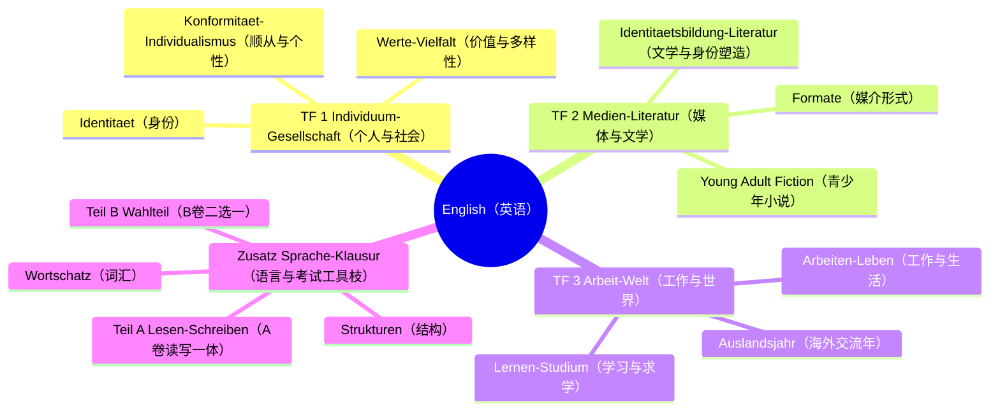
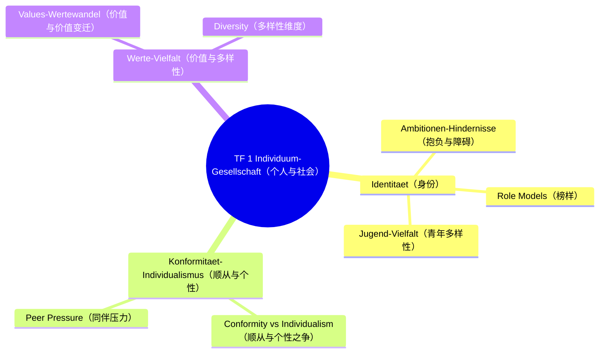
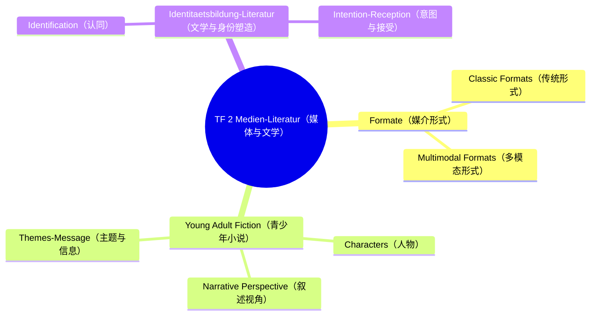
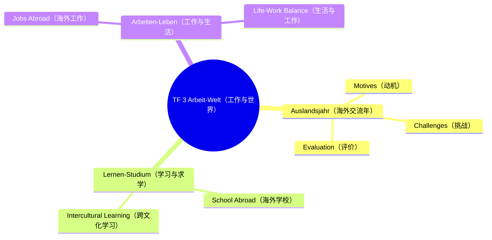
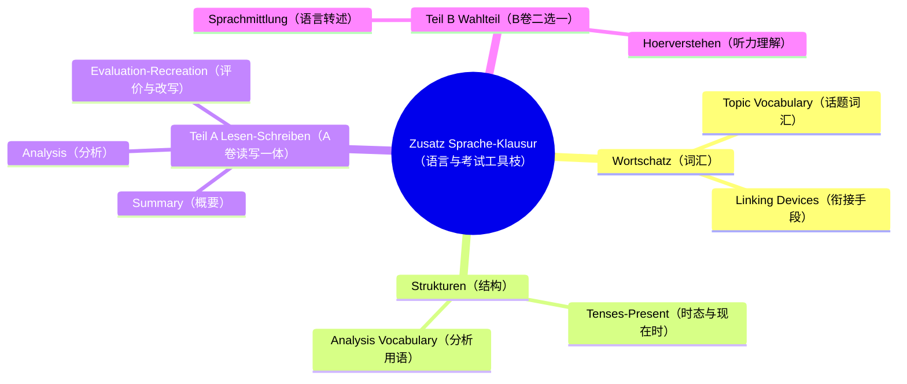

# Lernbaum Englisch（英语学习树 · EF）

> 中文一句话：本树覆盖 NRW KLP Englisch 2023 的三个话题领域，另设一个非考纲工具枝“语言手段与考试格式”，目标 B1 冲 B2，考试锚定 Teil A 三段 + Teil B 二选一，AFB II 为重点。
> DE in einem Satz: Der Baum bildet die drei KLP-Themenfelder EF ab, plus einen werkzeugartigen Zusatz-Ast zu Sprache und Klausurformat, mit Zielniveau B1 mit B2-Anteilen und Teil A plus Teil B mit AFB-II-Fokus.

⏳ 待确认：Lektüre（young adult novel 书名，见 Lehrplan §3 TODO）。
⏳ 待确认：Teil B 是 Sprachmittlung 还是 Hörverstehen（问老师，见 Lehrplan §3 TODO）。
⏳ 背景已知：Topic Role Models（Stand 2026-09-23），直接挂入 TF 1 Identität。

## 0. 总览 L0→L1→L2

注：前三个为 KLP 官方 Themenfelder；第四枝为 L1-ähnlicher Zusatz-Ast（kein KLP-Inhaltsfeld），只收语言工具与考试格式，不新增话题。

## 1. 分领域展开 L1→L2→L3

### TF 1 Individuum-Gesellschaft

### TF 2 Medien-Literatur

### TF 3 Arbeit-Welt

### Zusatz Sprache-Klausur

## 2. 节点明细（中文在上，英语/德语在下）

## TF 1 Das Individuum und die Gesellschaft im Wandel（个人与社会之变）

中文说明：话题一考身份、顺从与个性、价值多样性，Role Models 直接挂在身份下，Lektüre 与听力转述都可取材于此。
DE: TF 1 prueft Identitaet, Konformitaet und Wertevielfalt; Role Models haengt unter Identitaet, Lektuere und Teil B koennen daraus schöpfen.

### Identitaet（身份）

- **Ambitionen-Hindernisse（抱负与障碍）**
  - 中文一句话：梳理人物抱负与阻碍，说明身份如何在冲突中形成。
  - Operatoren: [outline, explain]
  - Klausur-Anbindung: Teil A Summary→Analysis, AFB I–II, B1 mit B2-Anteilen.
  - Leitfrage DE / ZH: What shapes identity under pressure? / 压力下什么塑造了身份？
- **Role Models（榜样）**
  - 中文一句话：分析榜样文本的论证与榜样形象，评价其说服力。
  - Operatoren: [analyse, evaluate]
  - Klausur-Anbindung: Teil A Analysis→Evaluation, AFB II–III, Topic Role Models.
  - Leitfrage DE / ZH: Are role models convincing? / 榜样有说服力吗？
- **Jugend-Vielfalt（青年多样性）**
  - 中文一句话：描述青年在族裔文化社会性别等维度的多样性，解释其意义。
  - Operatoren: [outline, discuss]
  - Klausur-Anbindung: Teil A Summary→Comment, AFB II–III, Diversity-Baustein.
  - Leitfrage DE / ZH: How diverse is youth identity? / 青年身份有多多样？

### Konformitaet-Individualismus（顺从与个性）

- **Conformity vs Individualism（顺从与个性之争）**
  - 中文一句话：对比顺从与个性的文本立场，阐明作者态度。
  - Operatoren: [compare, interpret]
  - Klausur-Anbindung: Teil A Analysis, AFB II Schwerpunkt, Vergleichs-Baustein.
  - Leitfrage DE / ZH: Conformity or individuality? / 顺从还是个性？
- **Peer Pressure（同伴压力）**
  - 中文一句话：分析同伴压力的机制与人物抉择，讨论其评价。
  - Operatoren: [examine, discuss]
  - Klausur-Anbindung: Teil A Analysis→Evaluation, AFB II–III.
  - Leitfrage DE / ZH: How does peer pressure work? / 同伴压力如何起作用？

### Werte-Vielfalt（价值与多样性）

- **Values-Wertewandel（价值与价值变迁）**
  - 中文一句话：概括文本中的价值观并解释其变迁，给出有依据的评价。
  - Operatoren: [outline, assess]
  - Klausur-Anbindung: Teil A Summary→Evaluation, AFB I–III, Werte-Baustein.
  - Leitfrage DE / ZH: Which values change? / 哪些价值在变？
- **Diversity（多样性维度）**
  - 中文一句话：从族裔文化社会性别维度说明多样性，讨论其社会含义。
  - Operatoren: [explain, comment]
  - Klausur-Anbindung: Teil A Analysis→Comment, AFB II–III.
  - Leitfrage DE / ZH: What does diversity mean here? / 这里的多样性意味着什么？

## TF 2 Medien und Literatur im Wandel（媒体与文学之变）

中文说明：话题二考传统与多模态形式，核心是青少年小说的人物视角主题，最后落到文学对身份的塑造。
DE: TF 2 prueft klassische und multimodale Formate, im Kern young adult fiction mit Figuren, Perspektive und Themen, dazu Identitaetsbildung durch Literatur.

### Formate（媒介形式）

- **Classic Formats（传统形式）**
  - 中文一句话：识别报纸书籍等传统形式特征，说明其受众与意图。
  - Operatoren: [outline, explain]
  - Klausur-Anbindung: Teil A Summary→Analysis, AFB I–II.
  - Leitfrage DE / ZH: How does the classic format work? / 传统形式如何运作？
- **Multimodal Formats（多模态形式）**
  - 中文一句话：分析图文声像如何共同制造意义，指出其引导策略。
  - Operatoren: [analyse, examine]
  - Klausur-Anbindung: Teil A Analysis, AFB II Schwerpunkt.
  - Leitfrage DE / ZH: How do image, sound and text interact? / 图声文如何互动？

### Young Adult Fiction（青少年小说）

⏳ 待确认：具体小说书名（确认后替换例文，不改 characters/perspective/themes 三步）。

- **Characters（人物）**
  - 中文一句话：从行为对白他人评价梳理人物，解释人物关系功能。
  - Operatoren: [analyse, interpret]
  - Klausur-Anbindung: Teil A Summary→Analysis, AFB II Schwerpunkt, Lektuere-Kern.
  - Leitfrage DE / ZH: What drives the character? / 什么驱动着人物？
- **Narrative Perspective（叙述视角）**
  - 中文一句话：判断叙述视角与可靠性，说明其对读者同情的影响。
  - Operatoren: [examine, interpret]
  - Klausur-Anbindung: Teil A Analysis, AFB II, Erzaehl-Baustein.
  - Leitfrage DE / ZH: Who sees and who speaks? / 谁在看、谁在说？
- **Themes-Message（主题与信息）**
  - 中文一句话：概括成长身份等主题，阐明文本信息与时代含义。
  - Operatoren: [interpret, evaluate]
  - Klausur-Anbindung: Teil A Analysis→Evaluation, AFB II–III.
  - Leitfrage DE / ZH: What is the novel about at its core? / 这部小说核心讲什么？

### Identitaetsbildung-Literatur（文学与身份塑造）

- **Identification（认同）**
  - 中文一句话：分析读者与人物的认同机制，讨论其条件与限度。
  - Operatoren: [explain, discuss]
  - Klausur-Anbindung: Teil A Evaluation/Comment, AFB III.
  - Leitfrage DE / ZH: Why do readers identify? / 读者为何认同？
- **Intention-Reception（意图与接受）**
  - 中文一句话：推断作者意图并比较不同读者接受，得出有依据的判断。
  - Operatoren: [interpret, assess]
  - Klausur-Anbindung: Teil A Evaluation, AFB II–III, Rezeptions-Baustein.
  - Leitfrage DE / ZH: What is intended and what is received? / 意图是什么、接受到的是什么？

## TF 3 Arbeit und Welt im Wandel（工作与世界之变）

中文说明：话题三考海外学习生活工作，Auslandsjahr 是高频情境，重点是动机挑战评价三段。
DE: TF 3 prueft Lernen, Leben und Arbeiten im englischsprachigen Ausland, mit Auslandsjahr als Standardsituation in Motiven, Herausforderungen und Bewertung.

### Auslandsjahr（海外交流年）

- **Motives（动机）**
  - 中文一句话：概括出国动机如语言独立求学，指出文本论证逻辑。
  - Operatoren: [outline, explain]
  - Klausur-Anbindung: Teil A Summary, AFB I–II.
  - Leitfrage DE / ZH: Why go abroad? / 为何出国？
- **Challenges（挑战）**
  - 中文一句话：梳理文化语言学业挑战，分析人物应对策略。
  - Operatoren: [examine, analyse]
  - Klausur-Anbindung: Teil A Analysis, AFB II Schwerpunkt.
  - Leitfrage DE / ZH: What makes it difficult? / 难在哪里？
- **Evaluation（评价）**
  - 中文一句话：权衡海外年得失，给出有文本依据的评价。
  - Operatoren: [evaluate, discuss]
  - Klausur-Anbindung: Teil A Evaluation/Comment, AFB III.
  - Leitfrage DE / ZH: Was it worth it? / 值得吗？

### Lernen-Studium（学习与求学）

- **School Abroad（海外学校）**
  - 中文一句话：描述海外学校制度差异，解释其对学习者的要求。
  - Operatoren: [outline, compare]
  - Klausur-Anbindung: Teil A Summary→Analysis, AFB I–II.
  - Leitfrage DE / ZH: How different is school abroad? / 海外学校有何不同？
- **Intercultural Learning（跨文化学习）**
  - 中文一句话：分析跨文化误解与学习过程，讨论其成长意义。
  - Operatoren: [explain, comment]
  - Klausur-Anbindung: Teil A Analysis→Comment, AFB II–III.
  - Leitfrage DE / ZH: What is learned between cultures? / 文化之间学到了什么？

### Arbeiten-Leben（工作与生活）

- **Jobs Abroad（海外工作）**
  - 中文一句话：概括海外兼职实习等工作情境，分析其机会与风险。
  - Operatoren: [outline, assess]
  - Klausur-Anbindung: Teil A Summary→Evaluation, AFB I–III.
  - Leitfrage DE / ZH: What does working abroad offer? / 海外工作带来什么？
- **Life-Work Balance（生活与工作）**
  - 中文一句话：讨论工作与生活的平衡观点，表明有依据的立场。
  - Operatoren: [discuss, evaluate]
  - Klausur-Anbindung: Teil A Comment, AFB III.
  - Leitfrage DE / ZH: How to balance life and work? / 如何平衡生活与工作？

## Zusatz-Ast Sprachliche Mittel und Klausurformate（语言手段与考试格式工具枝，非 KLP-Inhaltsfeld）

中文说明：本枝不是考纲话题，只收语言工具与考试流程，服务前三个话题的所有任务。
DE: Dieser Ast ist kein KLP-Inhaltsfeld, sondern Werkzeug: Wortschatz und Strukturen plus Teil A und Teil B als Verfahren fuer alle Themenfelder.

### Wortschatz（词汇）

- **Topic Vocabulary（话题词汇）**
  - 中文一句话：按三话题积累精准话题词，保证概要与评价用词准确。
  - Operatoren: [outline, explain]
  - Klausur-Anbindung: Teil A Summary/Evaluation, AFB I–III, Sprach-Basis B1 mit B2-Anteilen.
  - Leitfrage DE / ZH: Which words fit the topic? / 哪些词贴合话题？
- **Linking Devices（衔接手段）**
  - 中文一句话：用衔接词组织三段结构，使论证链条清晰。
  - Operatoren: [outline, comment]
  - Klausur-Anbindung: Teil A alle drei Schritte, AFB I–III, Kohärenz-Baustein.
  - Leitfrage DE / ZH: How is the text linked? / 文本如何衔接？

### Strukturen（结构）

- **Tenses-Present（时态与现在时）**
  - 中文一句话：概要坚持自己话与现在时，避免复述与时态错。
  - Operatoren: [outline, examine]
  - Klausur-Anbindung: Teil A Summary, AFB I, Regel own words plus present tense.
  - Leitfrage DE / ZH: Is it in your own present-tense words? / 是否用自己的话与现在时改写？
- **Analysis Vocabulary（分析用语）**
  - 中文一句话：用规范分析用语指认手法人物论证，保证术语准确。
  - Operatoren: [analyse, explain]
  - Klausur-Anbindung: Teil A Analysis, AFB II Schwerpunkt.
  - Leitfrage DE / ZH: How to name devices precisely? / 如何精准命名手法？

### Teil A Lesen-Schreiben（A卷读写一体）

- **Summary（概要）**
  - 中文一句话：用自己话与现在时压缩主旨，不加评论。
  - Operatoren: [outline, explain]
  - Klausur-Anbindung: Teil A Schritt 1, AFB I, no comment.
  - Leitfrage DE / ZH: What is the text about? / 文本讲了什么？
- **Analysis（分析）**
  - 中文一句话：分析手法人物或论证，文本证据支撑，AFB II 核心。
  - Operatoren: [analyse, examine]
  - Klausur-Anbindung: Teil A Schritt 2, AFB II Schwerpunkt.
  - Leitfrage DE / ZH: How does the text work? / 文本如何运作？
- **Evaluation-Recreation（评价与改写）**
  - 中文一句话：评价立场或按 letter/speech/article/blog 改写，保持目标文类规范。
  - Operatoren: [evaluate, assess]
  - Klausur-Anbindung: Teil A Schritt 3, AFB III, Evaluation oder re-creation of text.
  - Leitfrage DE / ZH: What is your justified view or new text? / 你的有依据观点或新文本是什么？

### Teil B Wahlteil（B卷二选一）

⏳ 待确认：本考期考 Sprachmittlung 还是 Hörverstehen（问老师后二选一，不改 Teil A）。

- **Sprachmittlung（语言转述）**
  - 中文一句话：跨语言转述要点，照顾目标读者与情境。
  - Operatoren: [explain, interpret]
  - Klausur-Anbindung: Teil B isoliert, AFB I–II, Mediation-Baustein.
  - Leitfrage DE / ZH: What does the reader need to know? / 读者需要知道什么？
- **Hoerverstehen（听力理解）**
  - 中文一句话：两遍听约 6 分钟两文本，抓要点细节，约 20 分钟 12–18 BE。
  - Operatoren: [outline, examine]
  - Klausur-Anbindung: Teil B isoliert, AFB I–II, 2 Texte ca. 6 Min, 2 Durchgaenge.
  - Leitfrage DE / ZH: What are the key points? / 要点是什么？
