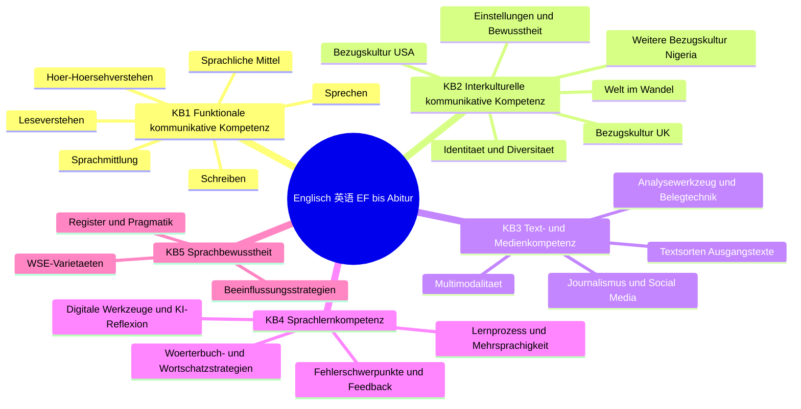
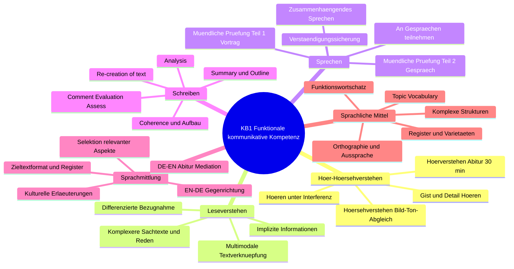
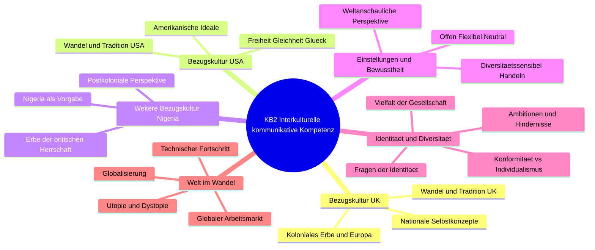
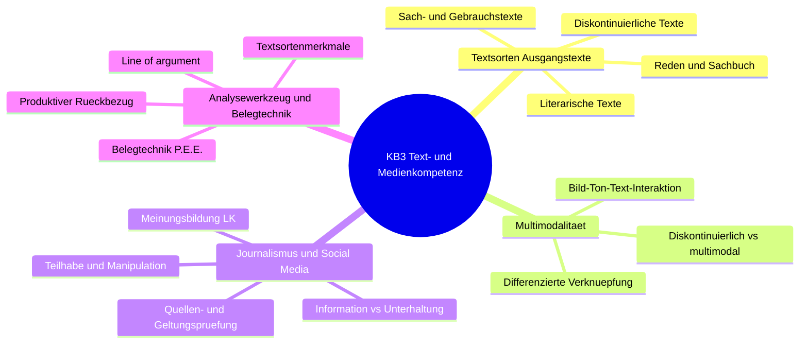
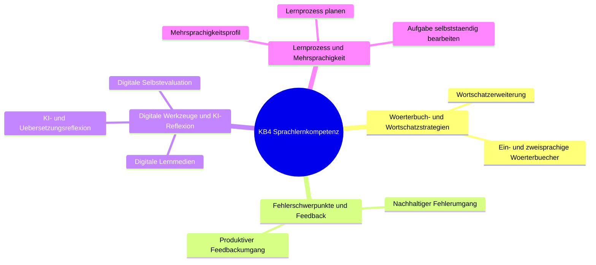
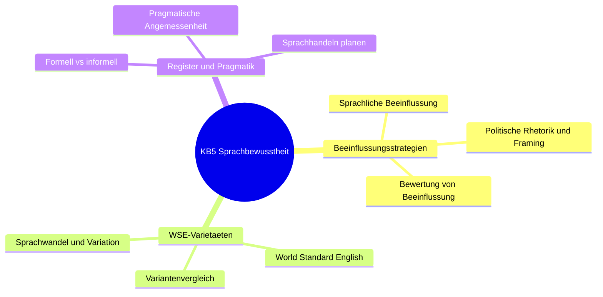

# Lernbaum Englisch（英语学习树 · EF→Abitur）

> 中文一句话：英语 Oberstufe 走的是**纯能力路线**——5 个 Kompetenzbereiche 贯穿 EF 到 Q2 全周期，内容（Themenfelder / Textsorten / Strategien）寄生在能力期望之下；EF 打「B1 写得出、听得懂」的地基，Q 阶段跃迁到「B2 + 接受性 C1、三文化域 Orientierungswissen、Abitur 三段式」，终点是 **GK 285 min / LK 315 min** 的固定顺序笔试（或 20–30 min 口试）。
> DE in einem Satz: Fuenf Kompetenzbereiche tragen die gesamte Oberstufe; die EF legt das B1-Fundament, die Q-Phase fuehrt zu B2 mit rezeptiven C1-Anteilen und zum dreiteiligen Abitur; Ziel sind GK 285 min bzw. LK 315 min.

⏳ 待确认：EF 的 young adult novel 书名（老师未答复）。**本树按 KLP 原文的 characters / narrative perspective / themes 三件套展开**，书名确认后只补「本书专属人物表 + 视角清单」，不改结构。
⏳ 待确认：EF 阶段 Teil B 考听力轨还是 Sprachmittlung 轨（两轨均已备，见 KB1 L2.1 / L2.5）。**Abitur 层的 Teil B 方向已确认**（见 §0.0）。
⏳ 背景已知：Topic Role Models（Stand 2026-09-23），已挂入 KB2 L2.5 与 KB1 L2.4。

---

## 0. Methoden-Profil（方法论画像 —— 本设计第二核心）

### 0.0 结构前提：英语 KLP **没有 Inhaltsfelder**（**必读，否则会读错整棵树**）

> ⚠️ **这不是本文件的缺失，而是 KLP 的结构事实。**

- 全文检索德语词 `Inhaltsfeld` 命中 **0 次**（`Themenfeld` 3 次）[已验证，源 `Englisch-Oberstufe.md` §0]。
- 英语 KLP 采用 **KMK Bildungsstandards für die fortgeführte Fremdsprache (Englisch/Französisch) für die Allgemeine Hochschulreife (2012)** 的**纯能力导向模型**，以 **5 个 Kompetenzbereiche** 组织全部要求，而非以内容领域组织 [已验证]。
- **因此本树 L1 = 5 个 Kompetenzbereiche**（`00-Abi-Baum-Design.md` §1.1 的「L1 对齐 KLP」在此变现为「L1 对齐 KLP 的 5 个能力领域」），**L2/L3 下挂实际 Themenfelder、Textsorten 与任务形态**。
- 内容并非不存在，而是**寄生在 `fachliche Konkretisierungen` 里**：`Themenfelder` 挂 KB2 与 KB3，`Textsorten` 挂 KB3，`Strategien` 挂 KB4 [已验证]。
- **学段口径** [已验证]：KLP 章节结构为 §2.2 **EF** · §2.3 **Q Grundkurs** · §2.4 **Q Leistungskurs**，**正文无 Q1/Q2 标记**。本树学段列用 `[EF]` / `[Q1]` / `[Q2]` / `[Q1-Q2]` / `[GK]` / `[LK]`；其中 **`[Q1-Q2]` = KLP 的整个 Qualifikationsphase**，`[Q1]`/`[Q2]` 的单点标注为 [据推断]（依 Abiturvorgaben 与校方 schulinterner Lehrplan 的惯例分配）。
- ✅ **已核对关闭**：Abitur **Teil B 的 Sprachmittlung 方向 = 德语源文本 → 英语目标文本（DE→EN）** [已验证，`Klausur-und-Abitur-Formate.md` §3.2]。旧 EF 版的「Teil B 是 Sprachmittlung 还是 Hörverstehen / 方向待核对」两条由此关闭：**Abitur 三个 Teil 按固定顺序全考**（听力 30 min + 转述 ≤60 min + 读写整合），二选一只发生在 **Teil 3 内部**（Aufgabe I 文学向 / Aufgabe II 实用文向）。

### ① Abitur 能力权重（AFB 分布 —— **英语按任务形态说，不按动词说**）

| AFB | 层级 | 本课权重 | 说明（按 Abitur 三个 Teil 定位） |
|---|---|---|---|
| I | Reproduktion 复述 | **约 25%** | **Teil 1 Hörverstehen**（30 min，`complete/fill in`、`list/name`、`match`、`tick`、`state`，只评内容不评语言）+ **Teil 3 第 1 小题 Summary/Outline**（`summarize` / `outline` / `state`）。属入口砖块，单独成段从不拿高分 |
| II | Reorganisation und Transfer 重组与迁移 | **约 45%** ⭐ 主战场 | **Teil 2 Sprachmittlung**（`present` / `outline` / `summarize` / `write` + 文化释义）+ **Teil 3 第 2 小题 Analysis**（`analyse` / `examine` / `point out` / `compare`）。KLP §4 定义含「迁移到可比新情境」[已验证] |
| III | Reflexion und Problemlösung 反思与问题解决 | **约 30%** | **Teil 3 第 3 小题**（`comment` / `discuss` / `evaluate` / `assess` / `write + text type` 的 re-creation）。「二选一：紧贴文本 vs 贴合主题」即设在此段 [已验证] |

> ⚠️ **英语官方 Operatoren 表（ab Abitur 2025，22 动词）明写：所有 Operatoren 原则上可涉全部三个 AFB，不按动词分配层级** [已验证，`Operatoren-NRW-Alle-Faecher.md` §3.4 B 组]。因此**层级由任务情境与材料决定**，不能靠动词判 AFB —— 这是英语与 Deutsch 最大的操作差异。
> 官方通则 [已验证]：① 全 Abitur 必覆盖全部三个 AFB；② **AFB II 为重心**。权重百分比为 [据推断]（KLP 未给分值配比）。

### ② 黄金学习法（证据来自 `00_META/Lernmethoden-Evidenz.md`）

| 方法 | 证据来源 | 本课应用方式 |
|---|---|---|
| **检索练习（Practice Testing / Retrieval）** | Karpicke & Blunt 2011（d≈1.0）；Adesope et al. 2017（g≈0.61–0.70） | **英语第一主力**。合书默写：topic vocabulary 清单、linking devices 表、Summary 自查表、Comment 四段骨架。凡「觉得会了」一律换成默写验证 |
| **间隔重复（Spaced / Distributed）** | Rohrer 2007/2015/2020；FSRS retention 0.9 + successive relearning 3 次 | 词汇卡（含 `02_Englisch/Vokabeln-Anki/Englisch-EF-Phrasen.csv`）与 Fachwortschatz 走 FSRS 到期制；Planner 按 Klausur/Abitur 倒排三轮，不平均用力 |
| **交错练习 + 对比辨别（Interleaving / Discriminative Contrast）** | Rohrer & Taylor 2007（d≈1.34）；Taylor & Rohrer 2010（d≈1.21）；Foster et al. 2019（混淆率 46%→10%） | **英语第二主力（语言科最适配）**。一次练习混排 2–3 种任务形态（如「Summary + Analysis + Mediation」）；每题先做 discrimination 二选「这题要我 summarize 还是 comment？是 summary 还是 outline？」再动笔 |
| **TAP 一致性（练习题型 = 考试题型）** | Adesope 2017 §6（一致 g≈0.63 > 不一致 g≈0.53） | 平时 check 必须用**同样的 Operator 措辞、同样的计时**（听力 30 min 硬时段 / 转述 60 min 收卷 / GK 285 / LK 315 min）、同样的材料形态（含多模态） |
| **正确例题精读 + 带扶手自解释** | Barbieri et al. 2023（g≈0.48）；Wittwer & Renkl 2010（开放自解释 β≈−0.24） | 新题型（re-creation of text、口试 Vortrag）首学 = 1 篇满分范文精读 + 两问扶手（这步用了哪个 device？目标读者是谁？）；**不问空的「你为什么这么写」** |
| **先行组织者（Advance Organizer）** | Ausubel | 每个新 Themenfeld 开头先给一页纸：「核心问题 + 5 个关键词 + 1 句 comment 立场 + 本块在 Abitur 里会变成哪类题」 |
| **反馈三层：KR → 延迟展开 → 过程反馈** | Brummer et al. 2024（g≈0.41，KR g≈0.64）；Kandemir（时机差异 g≈0.03） | 一整套做完再统一对答案；先判对错，再归类错因（**辨别错 / 知识错 / 表达错 / 语域错**），回写 `02_Englisch/Klausur-Training/Fehlerlog.md` |
| **CTML 一图一概念** | Mayer；Cromley et al. 2025（g≈0.37） | 听力/多模态笔记配图只承载一个概念（一张图只讲一种 Bild-Text-Relation），装饰图不进库 |

### ③ 三大典型失分点

1. **任务边界误判（英语头号陷阱）** —— 官方明写所有 Operatoren 可涉全部 AFB，**层级只能读任务情境** [已验证]。典型事故：① **Summary 里加评论**（`summarize` 要求「不加评论」，一加就污染整段）；② **Analysis 只点名 device 不给 effect**（掉回 AFB I）；③ **Comment 只表态不权衡正反**（`discuss` 官方定义要求「给出正反论点或理由」）。对策：动笔前用 10 秒把题干 Operator + 限定语（„in the light of“ / „to what extent“ / „assess whether“）译成中文动作再分段。
2. **语言规范与语域失控** —— KLP §4.3 的 11 项跨域评分标准明文含 **`Sicherheit im Umgang mit der Fremdsprache`** 与 **`Erfüllung fremdsprachlicher Normen`** [已验证]。典型事故：Summary 用了 past tense 而非 simple present [已验证，见 `Fehlerlog.md`]；Analysis 用日常词 „the text is convincing“ 而非 `device + effect` 术语；Mediation 把正式信写成半正式帖（**Zieltextformat 单独计分**）。对策：`Formulierungsbausteine` 句式库 + register 判别卡，默写后再用。
3. **Mediation 当逐字翻译 + 时间容器失控** —— Mediation 的官方要求是「**sinngemäß** 概括传达 + 必要时补充理解所需说明」[已验证]，**不是逐句翻译**；且 **Selektion（选题）本身就是考点**。时间侧：Abitur **Teil 1 听力 30 min 结束后材料收走**、**Teil 2 最迟 60 min 收卷**，中间不得休息 [已验证]。对策：动笔先写「谁写给谁、干什么」一行；听力第一遍抓 gist、第二遍抓 detail、只记关键词不写整句。

### ④ 本课笔记结构模板

> 英语笔记不是「单词表」，而是**一块可直接搬进考场的砖**。每个 L3 节点按下述六段写（中文理解在上、英语原文在下）：

```markdown
# <L3 主题>（EN original）
1. Begriff EN / ZH —— 一句定义（用官方 Operatoren 措辞，不自创）
2. Task-Signal —— 题干里怎么认出它（Operator + 限定词 + 常见题型形态）
3. Baustein-Satz —— 可直接照抄的骨架句（P.E.E. 三步 / linking device / register 模板）
4. AFB-Stufen —— 同一 Operator 在 AFB I / II / III 下的三种答法对照（**按任务情境判，不按动词判**）
5. Fehlerlog —— 错题四分类：辨别错 / 知识错 / 表达错 / 语域错
6. Zeit-Budget —— 该节点在 EF 90 min / GK 285 min / LK 315 min 下的建议用时（听力 30 / 转述 60 为硬截止）
```

---

## 1. 总览 Gesamtübersicht（L0→L1→L2）


```mermaid
mindmap
  root((Englisch 英语 EF bis Abitur))
    KB1 Funktionale kommunikative Kompetenz
      Hoer-Hoersehverstehen
      Leseverstehen
      Sprechen
      Schreiben
      Sprachmittlung
      Sprachliche Mittel
    KB2 Interkulturelle kommunikative Kompetenz
      Bezugskultur UK
      Bezugskultur USA
      Weitere Bezugskultur Nigeria
      Einstellungen und Bewusstheit
      Identitaet und Diversitaet
      Welt im Wandel
    KB3 Text- und Medienkompetenz
      Textsorten Ausgangstexte
      Multimodalitaet
      Journalismus und Social Media
      Analysewerkzeug und Belegtechnik
    KB4 Sprachlernkompetenz
      Woerterbuch- und Wortschatzstrategien
      Fehlerschwerpunkte und Feedback
      Digitale Werkzeuge und KI-Reflexion
      Lernprozess und Mehrsprachigkeit
    KB5 Sprachbewusstheit
      Beeinflussungsstrategien
      WSE-Varietaeten
      Register und Pragmatik
```

> L1 与 `Curriculum/Deutschland/Englisch-Oberstufe.md` §1 的 **5 个 Kompetenzbereiche 逐一对齐** [已验证]（英语无 Inhaltsfeld，此为唯一合法 L1 口径，见 §0.0）。
> **结构性结论** [据推断，依 `Englisch-Oberstufe.md` §3 / §4]：Abitur 三个 Teil 中，**Teil 3（Schreiben/Leseverstehen integriert）是主战场**，对应 KB1-Schreiben + KB3；**Teil 2 单独对应 KB1-Sprachmittlung** 并与 KB2 强耦合；**Teil 1 单独对应 KB1-Hören**。KB4 / KB5 是 KLP 明文称有「特殊教育价值」的**元层**，在笔试中间接计分、在**口试与学习过程**中直接显形。

---

## 2. 分能力领域展开（L1→L2→L3 + 应试四行）

### L1: KB1 — Funktionale kommunikative Kompetenz（功能性交际能力）[已验证，KLP §2.1] ⭐ 考试主战场


```mermaid
mindmap
  root((KB1 Funktionale kommunikative Kompetenz))
    Hoer-Hoersehverstehen
      Gist und Detail Hoeren
      Hoerverstehen Abitur 30 min
      Hoersehverstehen Bild-Ton-Abgleich
      Hoeren unter Interferenz
    Leseverstehen
      Implizite Informationen
      Multimodale Textverknuepfung
      Komplexere Sachtexte und Reden
      Differenzierte Bezugnahme
    Sprechen
      An Gespraechen teilnehmen
      Zusammenhaengendes Sprechen
      Muendliche Pruefung Teil 1 Vortrag
      Muendliche Pruefung Teil 2 Gespraech
      Verstaendigungssicherung
    Schreiben
      Summary und Outline
      Analysis
      Comment Evaluation Assess
      Re-creation of text
      Coherence und Aufbau
    Sprachmittlung
      Selektion relevanter Aspekte
      Kulturelle Erlaeuterungen
      Zieltextformat und Register
      DE-EN Abitur Mediation
      EN-DE Gegenrichtung
    Sprachliche Mittel
      Topic Vocabulary
      Funktionswortschatz
      Komplexe Strukturen
      Register und Varietaeten
      Orthographie und Aussprache
```

中文说明：KB1 是**唯一直接被 Abitur 三个 Teil 逐段考查**的能力领域 [已验证，KLP §4 明文：材料依托地整合考查 `Schreiben` + `Leseverstehen`，并结合**孤立考查**其他 Teilkompetenzen]。它下分 6 个 Teilkompetenzen + 「verfügen über sprachliche Mittel」，本树把后者立为第 6 个 L2。
DE: KB1 ist der einzige Bereich, der in allen drei Abitur-Teilen direkt geprueft wird.

#### L2.1 Hör-/Hörsehverstehen（听力与视听理解）[EF→Q2]

- **Gist und Detail Hoeren 抓大意与捞细节** `[EF]`
  - 中文一句话：第一遍抓全局大意，第二遍捞指定细节，只记关键词不写整句。
  - Klausur-Anbindung：**Abitur Teil 1**（30 min 硬时段，约 3 篇、总长约 10 min、放两遍、结束后材料收走）[已验证]；EF 阶段为 2 篇约 6 min、约 20 min / 12–18 BE [据推断，来自 `Klausur-Teil-B-Doppelpack.md`]。以 **AFB I** 为主。
  - Operatoren：`list, name`（列举）· `state`（陈述说话者支持的观点）· `complete, fill in`（按字数限制补全）
  - Lernweg ZH：**TAP 对齐**——用真实音频按「先易后难四阶」（mp3 短音频 → mp4 画面辅助 → 长 mp4 模拟考卷，`Klett-Themenfelder-Mapping.md` 已排）走三遍法 gist → detail → transcript；**检索练习**合书默写题型判别清单。
  - Fehlerquelle：只听一遍就动笔；抄原文措辞当答案（官方铁律：不抄原文措辞）；用常识蒙对而非听懂。
  - 📓 笔记：✅ `02_Englisch/Texte-Analyse/Klausur-Teil-B-Doppelpack.md`（Track 1 四题型 + 流程句）· ⚠️ Q 阶段加深缺口见 §4 #3

- **Hoerverstehen Abitur 30 Minuten（Abitur 听力独立段）** `[Q2]` `[GK]` `[LK]`
  - 中文一句话：Abbitur 固定第一段的 30 分钟听力，四题型只在「抓大意 / 捞细节 / 理关系」三种听法里出，只评内容不评语言。
  - Klausur-Anbindung：**Abitur Teil 1，isoliert**，30 min，题目按听力顺序排、题与题独立、题干短、少用否定 [已验证]；**GK 与 LK 同段同时长**，差异只在文本复杂度（`komplexere` / `komplexe`）与语速。
  - Operatoren：`complete, fill in` · `match` · `tick` · `list, name` · `state`
  - Lernweg ZH：**TAP 对齐**——每次练习都跑满 30 min 硬时段且**交卷后不许回看**（模拟材料收走）；**反馈三层**先判 KR 对错再归类（错因多为「听错」而非「写错」）。
  - Fehlerquelle：把听力段当「热身」而慢热丢分；写错拼写不扣分却因反复纠结拼写错过下一题 [已验证，听力部分只评内容]。
  - 📓 笔记：⚠️ 缺口（见 §4 · `Hoer-und-Hoersehverstehen-QPhase.md`，Abitur 30 min 专段）

- **Hoersehverstehen 视听互参** `[EF→Q1]`
  - 中文一句话：把画面信息（表情、场景、字幕、镜头）与声音信息互参，识别说话者情绪与态度。
  - Klausur-Anbindung：KLP 把 `Hör-/Hörsehverstehen` 作为**同一个 Teilkompetenz** 单列 [已验证]；EF 要求「视听材料中声画信息互参」+「识别 Stimmungen und Einstellungen」，GK 升级为「提取**大量**听视听文本信息」。
  - Operatoren：`outline` · `state` · `describe`
  - Lernweg ZH：**CTML 一图一概念**（一张截图只标注一处声画错位）+ **对比辨别**（「听得见的情绪」vs「看得见的情绪」判别卡，Rohrer/Foster 混排）。
  - Fehlerquelle：只答听到的内容，忽略画面反证（官方要求互参）；把镜头/剪辑信息当「背景」不写。
  - 📓 笔记：✅ `Klett-Themenfelder-Mapping.md`（14 个 mp4 素材与四阶练法）· ⚠️ 技法专篇缺口见 §4 #3

- **Hoeren unter Interferenz 干扰下听解** `[LK]`
  - 中文一句话：在语速快、背景噪音等干扰下仍能提取信息，并**阐释隐含信息的作用**。
  - Klausur-Anbindung：**LK 专属**要求 [已验证，`Englisch-Oberstufe.md` §2.3]：`auch wenn schnell gesprochen wird` · `Hintergrundgeräusche` · `Wirkung impliziter Informationen` 阐释 · 仅隐含的情绪/态度/关系识别。
  - Operatoren：`state` · `interpret` · `explain`
  - Lernweg ZH：**交错练习**——把「干净音源」与「带噪音源」混排，先判「这题考提取还是考阐释隐含作用」再做（Foster 辨别机制）；**正确例题精读**一段 LK 难度听写范文。
  - Fehlerquelle：把「隐含信息」只提取不阐释（LK 要求阐释 `Wirkung`，停在 AFB I）。
  - 📓 笔记：⚠️ 缺口（见 §4 · `Hoer-und-Hoersehverstehen-QPhase.md`，LK 干扰段）

#### L2.2 Leseverstehen（阅读理解）[EF→Q2]

- **Implizite Informationen 隐含信息** `[EF]`
  - 中文一句话：读出没写出来的立场、态度与言外之意，并给出文本依据。
  - Klausur-Anbindung：**Teil 3 整合段的分析与评论前提**（KLP EF 明列 `implizite Informationen`、`Einstellungen`），GK 去掉 EF 的「基本」限定、升级为「观点与态度」全量识别 [已验证]。AFB II。
  - Operatoren：`outline` · `explain` · `interpret` · `point out`
  - Lernweg ZH：**对比辨别**训练（字面义 vs 隐含义、stated claim vs implied attitude 对照卡）+ 合书默写判别信号表（Adesope recall > recognition）。
  - Fehlerquelle：把隐含立场当作者明写主张引用（事实正确性失分）；判别不给行号依据。
  - 📓 笔记：⚠️ 缺口（**高优先级** · 见 §4 · `Leseverstehen-Strategien-Implizit.md`）

- **Multimodale Textverknuepfung 多模态文本内部互参** `[EF→Q1]`
  - 中文一句话：把同一材料内的文字、图像、数据互相参照，说明它们如何共同制造意义。
  - Klausur-Anbindung：**Teil 3 的常见材料形态**（KLP EF 明列 `multimodale Texte`，GK 升级为「即使交互更复杂」）[已验证]；也是 Cartoon/Statistik/Infografik 类任务的分析入口，AFB II。
  - Operatoren：`analyse` · `explain` · `compare`
  - Lernweg ZH：**CTML 一图一概念**（一张图只讲一种 Bild-Text-Relation）+ **交错练习**与纯文字分析题混排，先判「这题要我互参几个模态」。
  - Fehlerquelle：只分析文字部分（把多模态当单模态）；图文关系判定不给 Bilddetail 举证。
  - 📓 笔记：⚠️ 缺口（见 §4 · `Multimodale-Texte-Journalismus-und-Social-Media.md`）

- **Komplexere Sachtexte und Reden 复杂实用文本与演讲** `[Q1-Q2]` `[GK]`
  - 中文一句话：处理 Q 阶段新增的 `komplexere` 文本，并首次纳入 **Reden（演讲）** 与 **Sachbuch-（专业书）** 文本。
  - Klausur-Anbindung：**Teil 3 Aufgabe II（偏 Sach-/Gebrauchstext）** 的主力材料 [已验证]；亦为 Teil 3 第 3 小题「紧贴文本 / 贴合主题」二选一的文本底座。AFB II–III。
  - Operatoren：`analyse` · `examine` · `interpret` · `assess`
  - Lernweg ZH：**先行组织者**（Rede / Sachbuch / Kommentar 的 Textsortenmerkmale 对照一页纸）+ **TAP 对齐**用真实 Q 阶段长度材料练。
  - Fehlerquelle：用 EF 层的短文本节奏做题，读不完就动笔；把 Sachbuch 的论证层次当 Kommentar 的立场宣示。
  - 📓 笔记：⚠️ 缺口（见 §4 · `Textsortenmerkmale-und-Belegtechniken.md`，Q 段）

- **Differenzierte Bezugnahme 分化互参** `[LK]`
  - 中文一句话：**分化地**把文本内多处信息互相参照，处理「交互更复杂」的多模态材料。
  - Klausur-Anbindung：**LK 专属**表述 [已验证]：`differenziert aufeinander beziehen` · `auch wenn die Interaktion komplexer ist`。落在 Teil 3 的高分层，AFB III。
  - Operatoren：`analyse` · `examine` · `interpret`
  - Lernweg ZH：**正确例题精读**一篇 LK 层级多模态范文 + 带扶手自解释（这处互参建立了什么关系？上一步结论是什么？）；**间隔重复**三轮。
  - Fehlerquelle：只做「并列式」互参（A 处一段、B 处一段），不给两者之间的判断；停留在 GK 的 `komplexer` 层级。
  - 📓 笔记：⚠️ 缺口（见 §4 · `Multimodale-Texte-Journalismus-und-Social-Media.md`，LK 段）

#### L2.3 Sprechen（口语 —— KLP 一分为二）[EF→Q2]

> [!重要] KLP 把 `Sprechen` 明确拆成 **an Gesprächen teilnehmen** 与 **zusammenhängendes Sprechen** 两条 Teilkompetenzen [已验证]，这直接对应 **Abitur 口试的两个部分**（见 `Englisch-Oberstufe.md` §4.2）。

- **An Gespraechen teilnehmen 参与对话** `[EF]`
  - 中文一句话：**大体**符合情境与对象地参与对话，遵守会话惯例，权衡不同立场并评论。
  - Klausur-Anbindung：EF 的 `mündliche Leistungsüberprüfung`（Q 阶段前三个 Halbjahr 中可替代一次 Klausur [已验证]）；也是 **Abitur 口试第 2 部分** 的能力底座。GK 去掉「大体」→ `weitgehend flüssig und spontan`，LK 再加 `flexibel und sprachlich variabel` [已验证]。
  - Operatoren：`discuss` · `comment` · `explain` · `evaluate`
  - Lernweg ZH：**检索练习**默写「立场 + 理由 + 反方考虑 + 回应」四步骨架句；**延迟反馈**（整段录音做完再统一校正，Kandemir 时机无差异）。
  - Fehlerquelle：只罗列观点不权衡（官方 `discuss` 定义要求「给出正反论点或理由，**尤其为得出有依据的结论**」）；把「同意对方」当成对话参与。
  - 📓 笔记：⚠️ 缺口（**高优先级** · 见 §4 · `Sprechen-Gespraechsstrategien-und-Sicherung.md`）

- **Zusammenhaengendes Sprechen 连贯表达** `[EF]`
  - 中文一句话：连贯、结构化、必要时给出**有理据的立场**，突出要点并辅以细节。
  - Klausur-Anbindung：EF 的 mündliche Überprüfung；GK 升级为 `zielgerichtet und sprachlich weitgehend differenziert`，LK 再要求 `sprachlich variabel, mitunter spontan` [已验证]。
  - Operatoren：`outline` · `present` · `explain` · `illustrate`
  - Lernweg ZH：**先行组织者**（Vortrag 三段骨架一页纸）+ **TAP 对齐**用 20–30 min 口试时长整段演练并录音。
  - Fehlerquelle：把连贯表达写成「想到哪讲到哪」；只给要点不给细节支撑（KLP 明文要求「突出要点、**辅以细节**」）。
  - 📓 笔记：⚠️ 缺口（见 §4 · `Sprechen-Muendliche-Abiturpruefung.md`，Vortrag 段）

- **Muendliche Abiturpruefung Teil 1 Vortrag（口试第一部分·报告）** `[Q2]` `[GK]` `[LK]`
  - 中文一句话：自行准备的**连贯报告**，可带单人/双人词典；若用视听文本，**准备时间 +10 min** [已验证]。
  - Klausur-Anbindung：**Abitur 口试第 1 部分**，主考 `Sprechen / zusammenhängendes Sprechen`，用**整合式考查** [已验证]；总时长通常 20–30 min。
  - Operatoren：`present` · `outline` · `discuss` · `illustrate`
  - Lernweg ZH：**正确例题精读**一份满分 Vortrag 稿 + 带扶手自解释（这步用了哪个结构信号？目标听众是谁？）；**TAP 对齐**按「准备 20 / +10 min → 陈述」完整跑。
  - Fehlerquelle：把 Vortrag 背成逐字稿（遇追问即崩）；用视听材料却按纯文本准备（白白丢掉 +10 min 的利用）。
  - 📓 笔记：⚠️ 缺口（**最高优先级** · 见 §4 · `Sprechen-Muendliche-Abiturpruefung.md`）

- **Muendliche Abiturpruefung Teil 2 Pruefungsgespraech（口试第二部分·考查谈话）** `[Q2]` `[GK]` `[LK]`
  - 中文一句话：聚焦 soziokulturelles Orientierungswissen 的核心 Themenfelder，谈**更大专业关联**；考生须**主动塑造对话**、表达意见、有理据地提出立场、回应他人并**自发给出推动**。
  - Klausur-Anbindung：**Abitur 口试第 2 部分**，主考 `Sprechen / an Gesprächen teilnehmen` [已验证]；⚠️ KLP 明文禁令：**「不允许把无关联的单个问题串起来」**（`Es ist nicht zulässig, zusammenhanglose Einzelfragen aneinanderzureihen.`）[已验证]。
  - Operatoren：`discuss` · `comment` · `evaluate` · `assess`
  - Lernweg ZH：**先行组织者**（三文化域「核心问题 → 更大专业关联」桥接表一页纸）+ **交错练习**与 KB2 的 Orientierungswissen 卡混排提问。
  - Fehlerquelle：**散点问答**（命中 KLP 明文禁令）；只回答不主动推进（KLP 要求「主动塑造对话、自发给出推动」）。
  - 📓 笔记：⚠️ 缺口（**最高优先级** · 见 §4 · `Sprechen-Muendliche-Abiturpruefung.md`）

- **Verstaendigungssicherung und Aussprache 理解保障与发音语调** `[EF→Q2]`
  - 中文一句话：用重述、追问、举例等策略保障相互理解，并保持可懂的发音与语调。
  - Klausur-Anbindung：**口试的三个附加评分项之一** —— 互动口语交际能力 · 理解保障策略 · **发音与语调** [已验证，KLP §4.2]。笔试不直接计分，但影响整体语言印象分。
  - Operatoren：`explain` · `illustrate` · `point out` · `re-state`（属 `state` 族）
  - Lernweg ZH：**检索练习**默写 6 句理解保障句式（`What I mean is…` / `Could you rephrase…`）；**对比辨别**最小音位对训练卡混排。
  - Fehlerquelle：听不懂也不追问，硬答导致整段跑偏；把发音问题当成「词汇量不够」。
  - 📓 笔记：⚠️ 缺口（见 §4 · `Sprechen-Gespraechsstrategien-und-Sicherung.md`，含发音语调段）

#### L2.4 Schreiben（写作）[EF→Q2] ⭐ Teil 3 主战场

- **Summary und Outline 概要与概述** `[EF]`
  - 中文一句话：用**自己的话 + simple present** 压缩主旨，**不加评论**；`outline` 是带限定词的 summary（只收题目点名的方面）。
  - Klausur-Anbindung：**Teil 3 第 1 小题**，AFB I。首句四要素（text type + title + author + year/topic）、长度约原文 1/4–1/3、禁 direct quotes/direct speech、neutral + formal register [已验证，来自 `Role-Models-Analysis.md`]。
  - Operatoren：`summarize, sum up` · `outline` · `state`
  - Lernweg ZH：**检索练习**合书默写「Summary 自查表」（task focus / structure / conciseness / own words / tense）；**TAP 对齐**用真题限定词（如 „criticism“ / „effects“）练「outline ≠ summary」的辨别。
  - Fehlerquelle：**Summary 里加评论**（本项目 Fehlerlog 已列首位）；tense 用 past 而非 simple present；把 `summarize` 写成全文复述。
  - 📓 笔记：✅ `02_Englisch/Texte-Analyse/Role-Models-Analysis.md`（自查表 + P.E.E.）· ✅ `02_Englisch/Klausur-Training/Englisch-IQB-Writing-Training.md`（走一遍全流程）

- **Analysis 分析** `[EF]`
  - 中文一句话：按 **language / communicative strategies / line of argument** 三条线分析作者手段，每点走 **P.E.E.**（Point → Evidence 精确行号 → Explain 对读者的效果）。
  - Klausur-Anbindung：**Teil 3 第 2 小题**，**AFB II 主战场**（与 §0①一致）。Main body 只分析题目点名的焦点，不面面俱到 [已验证，来自 `Role-Models-Analysis.md`]。
  - Operatoren：`analyse` · `examine` · `point out` · `compare` · `illustrate`
  - Lernweg ZH：**交错练习 + 对比辨别**（device vs effect 判别卡混排，先判「这题要我分析语言还是论证结构」）；每点强制「1 device + 1 line reference + 1 effect」三步链并默写。
  - Fehlerquelle：**只点名 device 不给 effect**（掉回 AFB I）；分析写成内容复述；引用不带行号。
  - 📓 笔记：✅ `Role-Models-Analysis.md` · ✅ `Englisch-IQB-Writing-Training.md` · ⚠️ Q 阶段复杂文本加深缺口见 §4 #15

- **Comment Evaluation Assess 评论与评价** `[EF→Q2]`
  - 中文一句话：150–200 词四段式（Introduction → Position → Arguments 含 counterargument → Conclusion），**明确表态 + 解释 + 举例 + 权衡**。
  - Klausur-Anbindung：**Teil 3 第 3 小题**，AFB III；⚠️ 官方在此设**第二次二选一**：「紧贴文本」或「贴合主题」两问选一 [已验证]，且 `comment` / `discuss` / `evaluate` / `assess` 四种措辞的答法不同（见下 Fehlerquelle）。
  - Operatoren：`comment (on)` · `discuss` · `evaluate` · `assess`
  - Lernweg ZH：**正确例题精读**一篇满分 Comment + 带扶手自解释（这句表态的依据是什么？反方考虑放在哪一步？）；**对比辨别**四动词判别卡（`comment`=亮观点+证据 · `discuss`=正反论点 · `evaluate/assess`=对性质品质下有依据的见解）。
  - Fehlerquelle：**Comment 无 nuance**（Fehlerlog 已列：缺 „on the one hand…“ 类权衡）；把 `discuss` 写成单向表态；`assess` 与 `evaluate` 混用（官方二者释义近乎同义，但题干限定词不同）。
  - 📓 笔记：✅ `Role-Models-Analysis.md`（四段式 + peer-feedback 自查）· ✅ `Englisch-Abitur-Themenfelder.md`（每块 1 句 comment 立场）· ⚠️ 加深缺口见 §4 #5

- **Re-creation of text 文本改写与创意写作** `[EF→Q2]`
  - 中文一句话：按 letter / email / speech / article / blog / reader's letter 等**目标文类**改写或续写，保持该文类的格式与语域规范。
  - Klausur-Anbindung：KLP 明确把 `write (+ text type)` 与 **kreative Texte** 列入产出清单（故事结尾 / 读者来信 / 对话 / 内心独白；GK 为 `erweitertes Spektrum`、LK 为 `breites Spektrum`）[已验证]；常作为 Teil 3 第 3 小题的另一选项或子任务。AFB II–III。
  - Operatoren：`write (+ text type)` · `create`（任务措辞，属 `write` 族的创意变体）
  - Lernweg ZH：**先行组织者**（六类 Zieltext 的格式与 register 对照一页纸）+ **正确例题精读**一篇满分 blog/letter 范文；**过程反馈**专查「格式项是否逐条命中」。
  - Fehlerquelle：**格式分整块丢**（Zieltextformat 单独计分）；用 Summary 的 neutral register 去写 reader's letter（应为个人立场 + 半正式）。
  - 📓 笔记：⚠️ 缺口（**高优先级** · 见 §4 · `Schreiben-Creative-Writing-und-Re-creation.md`）

- **Coherence Linking und Aufbau 衔接与结构** `[EF]`
  - 中文一句话：用 linking devices 组织三段结构，使论证链条清晰、读者跟得上。
  - Klausur-Anbindung：**贯穿 Teil 3 全部三步**（评分标准 `Selbstständigkeit und Klarheit in Aufbau und Sprache` [已验证]）；Summary 与 Comment 的 linking 要求不同（前者重逻辑串接、后者重论证转折）。AFB I–III。
  - Operatoren：`outline` · `explain` · `write`
  - Lernweg ZH：**检索练习**默写两套 linking 清单（Summary 用 `furthermore / in addition / however`；Comment 用 `firstly / moreover / on the other hand / therefore / in conclusion`）；**对比辨别**两套清单混排防串。
  - Fehlerquelle：把 Comment 的论证连接词写进 Summary（破坏 neutral 与压缩原则）；linking 堆砌但无逻辑推进。
  - 📓 笔记：✅ `Role-Models-Analysis.md`（linking words 清单）· ✅ `Mediation-Mustertexte.md`（双 register connectors）

#### L2.5 Sprachmittlung（语言中介）[EF→Q2]

> [!重要] `Sprachmittlung` 是**独立 Teilkompetenz**，不是「翻译题」：它要求**跨文化情境下以另一语言按目的做意思传达**（`sinngemäß`），必要时**补充理解所需说明** [已验证]。
> ✅ **Abitur 方向已确认**：源文本为**德语 Sach-/Gebrauchstext**，产出**英语目标文本**（DE→EN），**最迟 60 min 收卷** [已验证，`Klausur-und-Abitur-Formate.md` §3.2]。

- **Selektion relevanter Aspekte 要点选择** `[EF]`
  - 中文一句话：只转述**题目要求**的那几个方面，不是全文翻译——**选题（selection）本身就是考点**。
  - Klausur-Anbindung：**Abitur Teil 2（isoliert）** + EF Teil B 转述轨；官方 Operatoren 为 `outline` / `summarize` / `present` 的**窄义版**（额外要求兼顾文化差异）[已验证]。AFB I–II。
  - Operatoren：`outline` · `summarize, sum up` · `present`
  - Lernweg ZH：**检索练习**默写「三段式动笔」一行（谁写给谁 → 只捡题要的点 → 目标格式）；**对比辨别**训练「该转 vs 不该转」判别卡（Rohrer/Foster 混排）。
  - Fehlerquelle：**逐字翻译**（本项目 Fehlerlog 与 `Mediation-und-Kommunikative-Strategien.md` 均列为致命错误）；转述了全文导致超时。
  - 📓 笔记：✅ `02_Englisch/Mediation-und-Kommunikative-Strategien.md` · ✅ `02_Englisch/Texte-Analyse/Mediation-Mustertexte.md`（两套完整范文）

- **Kulturelle Erlaeuterungen hinzufuegen 文化释义补充说明** `[EF→Q1]`
  - 中文一句话：为目标读者补充理解所需的文化说明（如 FSJ、Abitur、Duales System 等无对等概念）。
  - Klausur-Anbindung：KLP EF 明文要求「必要时补充理解所需说明」（`Erläuterungen hinzufügen`）[已验证]；**这也是英语 Operatoren 表中 Sprachmittlung 栏相对 A 栏的独有增量**（`explain` / `outline` / `summarize` 均注明「必要时澄清文化相关方面」）[已验证]。
  - Operatoren：`explain` · `present` · `outline`
  - Lernweg ZH：**对比辨别**卡（有对等概念 → 直接转述 / 无对等概念 → 加释义句）；**检索练习**默写 10 个德国制度概念的英文释义骨架句。
  - Fehlerquelle：文化概念直接音译不释义（目标读者读不懂 = 传达失败）；或反过来释义过长冲淡要点。
  - 📓 笔记：⚠️ 缺口（**高优先级** · 见 §4 · `Mediation-DE-EN-Abitur-Teil-B.md`，含 Erläuterungen 专段）

- **Zieltextformat und Register 目标文类与语域** `[EF]`
  - 中文一句话：按题目点名的格式（正式信 / 半正式论坛帖 / article / email）写，**格式单独计分**。
  - Klausur-Anbindung：官方 Operatoren 中 `write (+ text type)` 在 Sprachmittlung 栏的释义即「依据德语文本产出英文文本」[已验证]；`present` 注明「用于面向国际受众的正式文本」[已验证]。AFB I–II。
  - Operatoren：`write (+ text type)` · `present`
  - Lernweg ZH：**先行组织者**（格式清单：Anrede / Abschluss / Absätze / register）+ **正确例题精读**两套对照范文（FSJ 正式信 vs Detox 论坛帖）。
  - Fehlerquelle：正式信写成半正式帖（register 串味）；漏掉 Anrede/Signatur 等格式硬项。
  - 📓 笔记：✅ `Mediation-Mustertexte.md`（正式信 + 论坛帖双范文 + 双 register connectors）

- **DE-EN Abitur Sprachmittlung（Abitur 转述独立段）** `[Q2]` `[GK]` `[LK]`
  - 中文一句话：Abitur 固定第二段的德→英转述，**最迟 60 min 收卷**，无选题权；GK 为 `komplexere` 情境、LK 为 `komplexe` 且要求 `flexibel` 转达。
  - Klausur-Anbindung：**Abitur Teil 2，isoliert** [已验证]；源文本为德语 Sach-/Gebrauchstext（Abitur 级 450–600 词 [据推断，来自 `Klausur-Teil-B-Doppelpack.md`]），总时长 285/315 min 中**转述最多占 60 min**。
  - Operatoren：`present` · `outline` · `summarize, sum up` · `write (+ text type)` · `explain`
  - Lernweg ZH：**TAP 对齐**——每次练习都按 60 min 硬截止计时（超时即停笔，模拟收卷）；**反馈三层**先 KR 再归类错因（多为「转多了」而非「转错了」）。
  - Fehlerquelle：**时间失控**（转述挤占 Teil 3 的写作时间，这是 Abitur 英语最典型的全局性失误）；把 60 min 当「建议值」而非硬截止。
  - 📓 笔记：⚠️ 缺口（**高优先级** · 见 §4 · `Mediation-DE-EN-Abitur-Teil-B.md`）

- **EN-DE Gegenrichtung 英→德反向训练** `[Q1]`
  - 中文一句话：反向把英语文本转述为德语，用于校验「是否真的理解」并补足双向词汇。
  - Klausur-Anbindung：**非 Abitur 题型**（Abitur 方向已确认为 DE→EN）[已验证]；作为**能力校验手段**服务 Teil 2 与口试第 2 部分的文化释义。
  - Operatoren：`summarize, sum up` · `explain` · `write`
  - Lernweg ZH：**对比辨别**双向训练（同一段做两个方向，比较「丢了什么」）——这是 Foster 辨别机制在语言科最直接的形态；**间隔重复**三轮。
  - Fehlerquelle：把反向训练当成考试题型备考（方向已定，不应投入主战时间）。
  - 📓 笔记：⚠️ 缺口（见 §4 · `Mediation-EN-DE-Gegenrichtung.md`，仅作校验用，优先级低）

#### L2.6 Verfügen über sprachliche Mittel（语言手段的运用）[EF→Q2]

- **Topic Vocabulary 话题词汇** `[EF]`
  - 中文一句话：按 Themenfelder 积累精准话题词，保证 Summary 与 Comment 用词准确。
  - Klausur-Anbindung：**所有书写段的底层**（评分标准 `Sicherheit im Umgang mit der Fremdsprache`）；EF 要求「通用 + 主题」词汇，GK 升级为 `erweiterter` 通用/主题词汇 [已验证]。AFB I–III 全程。
  - Operatoren：`outline` · `describe` · `list, name`
  - Lernweg ZH：**间隔重复**（FSRS retention 0.9，`02_Englisch/Vokabeln-Anki/Englisch-EF-Phrasen.csv` 到期制）+ **检索练习**合书默写（Dunlosky：重读划线不计入「已复习」）。
  - Fehlerquelle：只背中文释义不背搭配（产出时写不出）；用词泛化（„good / bad“）而非话题精准词。
  - 📓 笔记：✅ `02_Englisch/Vokabeln-Anki/Englisch-EF-Phrasen.csv` · ✅ `Englisch-Abitur-Themenfelder.md`（每块 5 词）· ⚠️ 系统卡缺口见 §4 #6

- **Funktions- und Interpretationswortschatz 功能与阐释词汇** `[EF→Q1]`
  - 中文一句话：掌握分析用的元词汇（`word field` / `connotation` / `register` / `rhetorical question` / `appeal`），保证术语准确。
  - Klausur-Anbindung：**Teil 3 Analysis 段的术语底座**（KLP 明文要求「**广的**功能与阐释词汇」，GK 起）[已验证]；对应评分标准 `Sicherheit im Umgang mit Fachsprache und -methoden` [已验证]。AFB II。
  - Operatoren：`describe` · `explain` · `point out`
  - Lernweg ZH：**检索练习**默写「device 名称 → 判别信号 → effect 句式」三栏卡；**先行组织者**（一张术语图只讲一个 device，Mayer CTML）。
  - Fehlerquelle：用日常词 „the author uses strong words“ 而非 `loaded language / connotation`；术语背了但不会写 effect 句。
  - 📓 笔记：⚠️ 缺口（**高优先级** · 见 §4 · `Englisch-Funktions-und-Interpretationswortschatz.md`）

- **Komplexe grammatische Strukturen 复杂语法结构** `[Q1-Q2]` `[GK]`
  - 中文一句话：从「基本与较复杂结构」（EF）升级到功能性使用**较复杂/复杂**结构，GK `breites Spektrum`、LK `funktional und variabel` [已验证]。
  - Klausur-Anbindung：**贯穿全部产出段**，直接计入 `Erfüllung fremdsprachlicher Normen` [已验证]；在 Comment 的反驳段与 Mediation 的释义句中最易显形。
  - Operatoren：`illustrate` · `describe` · `explain`
  - Lernweg ZH：**正确例题精读**（范文中标出每处复杂结构的功能）+ **带扶手自解释**两问（这步用了哪个结构？为什么要比简单句好？）；**过程反馈**归类「表达错」。
  - Fehlerquelle：堆砌复杂句但破坏可读性（Klarheit 项反而扣分）；Summary 中为求简而写破碎句。
  - 📓 笔记：⚠️ 缺口（见 §4 · `Sprachliche-Mittel-Strukturen-und-Orthographie.md`）

- **Register und Varietaeten 语域与变体** `[Q1-Q2]`
  - 中文一句话：在 formal / informal / neutral 之间按目标读者切换，并识别 World Standard English 的国别变体。
  - Klausur-Anbindung：**Mediation 的计分项**（双 register connectors 已在 `Mediation-Mustertexte.md`）+ Comment 的语域一致性；亦属 KB5 Sprachbewusstheit 的落点（跨域）。AFB I–II。
  - Operatoren：`compare` · `describe` · `explain`
  - Lernweg ZH：**对比辨别**（formal vs informal 判别卡混排，Foster 机制）+ **检索练习**默写「目标读者 → register → 禁用项」对照表。
  - Fehlerquelle：同一篇内 register 跳变（首段正式、末段缩写俚语）；把美式的 `gotten` 写进英式正式文本。
  - 📓 笔记：✅ `Mediation-Mustertexte.md`（双 register connectors，部分）· ⚠️ 系统笔记缺口见 §4 #8

- **Orthographie und Aussprache 正字法与发音** `[EF]`
  - 中文一句话：拼写一般正确、发音与语调理解并清楚产出（EF 明文）[已验证]。
  - Klausur-Anbindung：笔试中计入 `Erfüllung fremdsprachlicher Normen`；**听力段只评内容不评拼写** [已验证]；口试中作为**三个附加评分项之一**明文计分 [已验证]。
  - Operatoren：`state` · `describe` · `list, name`
  - Lernweg ZH：**间隔重复**个人错拼词表（来自 Fehlerlog 的「表达错」分类）+ **过程反馈**；口语侧用最小音位对**对比辨别**卡。
  - Fehlerquelle：在听力段纠结拼写而错过后续题（明确不扣分）；口试中把发音问题误判为词汇量问题而背单词。
  - 📓 笔记：✅ `02_Englisch/Klausur-Training/Fehlerlog.md`（空表待填）· ⚠️ 系统整理缺口见 §4 #7

---

### L1: KB2 — Interkulturelle kommunikative Kompetenz（跨文化交际能力）[已验证，KLP §2.1]


```mermaid
mindmap
  root((KB2 Interkulturelle kommunikative Kompetenz))
    Bezugskultur UK
      Nationale Selbstkonzepte
      Koloniales Erbe und Europa
      Wandel und Tradition UK
    Bezugskultur USA
      Amerikanische Ideale
      Freiheit Gleichheit Glueck
      Wandel und Tradition USA
    Weitere Bezugskultur Nigeria
      Erbe der britischen Herrschaft
      Postkoloniale Perspektive
      Nigeria als Vorgabe
    Einstellungen und Bewusstheit
      Diversitaetssensibel Handeln
      Offen Flexibel Neutral
      Weltanschauliche Perspektive
    Identitaet und Diversitaet
      Ambitionen und Hindernisse
      Konformitaet vs Individualismus
      Vielfalt der Gesellschaft
      Fragen der Identitaet
    Welt im Wandel
      Globalisierung
      Globaler Arbeitsmarkt
      Technischer Fortschritt
      Utopie und Dystopie
```

中文说明：KB2 是**内容层的主承载者之一**——KLP 把 Q 阶段的**三个英语文化域**与 `Identität`/`Welt im Wandel` 两个 Themenfeld 挂在这里 [已验证]。它由 **Wissen / Einstellungen / Bewusstheit** 三要素协同。⚠️ 与 KB1 的关系：**Orientierungswissen 本身不单独成题**，它喂给 Teil 3 的 Comment 与口试第 2 部分。
DE: KB2 traegt den Grossteil des Inhalts und speist Comment und Pruefungsgespraech.

#### L2.1 Bezugskultur: Das Vereinigte Königreich（联合王国）[Q1-Q2]

- **Nationale Selbstkonzepte 民族自我构想** `[Q1]`
  - 中文一句话：理解英国在**殖民遗产与欧洲定位**镜像中的自我构想（KLP UK 专属条目）[已验证]。
  - Klausur-Anbindung：Teil 3 Aufgabe I/II 的**文化背景底座**，服务 Comment 段的「有依据判断」；**口试第 2 部分明文聚焦** `soziokulturelles Orientierungswissen` 的核心 Themenfelder [已验证]。AFB II–III。
  - Operatoren：`outline` · `explain` · `discuss` · `assess`
  - Lernweg ZH：**先行组织者**（「核心问题 + 5 词 + 1 评论句」一页纸，沿用 `Englisch-Abitur-Themenfelder.md` 既有格式）+ **检索练习**合书默写。
  - Fehlerquelle：把 UK 与 USA 的nationale Narrative 混用（如把 „American Dream“ 套到英国）；只背事实不形成评论句。
  - 📓 笔记：✅ `Englisch-Abitur-Themenfelder.md`（UK 块，含 5 词 + 1 句）· ⚠️ 系统深化缺口见 §4 #11

- **Koloniales Erbe und europaeische Verortung 殖民遗产与欧洲定位** `[Q1]`
  - 中文一句话：把英国当代政治文化社会现象追溯到殖民遗产与脱欧后的欧洲再定位。
  - Klausur-Anbindung：Comment 段的**解释性论证**（「为什么会这样」），AFB III；与 L2.3 的第三文化条目形成对照（LK 必答）。
  - Operatoren：`explain` · `assess` · `comment (on)` · `compare`
  - Lernweg ZH：**对比辨别**（UK 殖民遗产 vs 第三文化的英国统治遗产，两张卡混排防混）+ **间隔重复**三轮。
  - Fehlerquelle：把殖民遗产写成历史课陈述（应回到当代影响）；缺少与另一文化域的对照维度。
  - 📓 笔记：⚠️ 缺口（**高优先级** · 见 §4 · `Orientierungswissen-UK.md`）

- **Wandel und Tradition UK 变迁与传统（UK）** `[Q1]`
  - 中文一句话：用「政治、文化、社会 —— 在变迁与传统之间」这一**三文化域共用条目** [已验证]分析英国案例。
  - Klausur-Anbindung：⚠️ **KLP 结构要点**：三个英语文化域**共用同一句**条目措辞 [已验证]，因此**同一分析框架可三域复用**——这是性价比最高的可迁移模板。AFB II。
  - Operatoren：`outline` · `compare` · `discuss`
  - Lernweg ZH：**先行组织者**（一张「Wandel ↔ Tradition」通用维度表，三域填空）+ **交错练习**三域混排（Rohrer：混排才真会）。
  - Fehlerquelle：为三个文化域各建一套框架（重复劳动且易混）；只讲变迁不讲传统张力。
  - 📓 笔记：✅ `Englisch-Abitur-Themenfelder.md`（三域并列）· ⚠️ 通用框架专篇见 §4 #11/#12

#### L2.2 Bezugskultur: Die Vereinigten Staaten von Amerika（美国）[Q1-Q2]

- **Amerikanische Ideale und Realitaeten 美国理想与现实** `[Q1]`
  - 中文一句话：对照美国的立国理想与其社会现实之间的落差（KLP USA 专属条目）[已验证]。
  - Klausur-Anbindung：Comment 段的**论证张力来源**（理想 vs 现实是最天然的二论点结构），AFB III；口试第 2 部分高频。
  - Operatoren：`discuss` · `evaluate` · `assess` · `compare`
  - Lernweg ZH：**对比辨别**（Ideal 卡 vs Reality 卡混排，先判「这题要我比落差还是只描述理想」）；**检索练习**默写「1 理想 + 1 反例 + 1 判断」骨架。
  - Fehlerquelle：只列理想不举现实反例（Comment 无 nuance，命中失分点 ①）；把现实反例写成情绪批判。
  - 📓 笔记：✅ `Englisch-Abitur-Themenfelder.md`（USA 块）· ⚠️ 深化缺口见 §4 #12

- **Freiheit Gleichheit Glueck 自由·平等·幸福追求** `[Q1]`
  - 中文一句话：把「自由、平等与对幸福的追求」作为解读美国文本的三把钥匙。
  - Klausur-Anbindung：Teil 3 中 USA 题材文本的**意图推断与评论依据**，AFB II–III；常与 `Role Models` 类身份话题交叉。
  - Operatoren：`explain` · `interpret` · `comment (on)` · `illustrate`
  - Lernweg ZH：**先行组织者**（三概念 → 典型文本信号 → 可迁移评论句一页纸）+ **TAP 对齐**用 USA 题材真题练。
  - Fehlerquelle：三概念泛化为「美国价值观」一句话（缺区分度）；举例用德国/中国案例而非英语文化圈案例。
  - 📓 笔记：✅ `Englisch-Abitur-Themenfelder.md`（USA 关键词）· ⚠️ 系统卡缺口见 §4 #12

- **Wandel und Tradition USA 变迁与传统（USA）** `[Q1]`
  - 中文一句话：用与上节同一框架分析美国在变迁与传统之间的张力。
  - Klausur-Anbindung：与 UK / 第三文化**共用条目措辞** [已验证]，可直接套用 L2.1 第三点的通用维度表。AFB II。
  - Operatoren：`outline` · `compare` · `discuss`
  - Lernweg ZH：**交错练习**——三域同一框架混排填表（Rohrer & Taylor 2007 d≈1.34）；**延迟反馈**三域统一校正。
  - Fehlerquelle：把 USA 的「传统」等同于 UK 的「传统」（前者是立国文本、后者是君主制与帝国遗产）。
  - 📓 笔记：⚠️ 缺口（见 §4 · `Orientierungswissen-USA.md`）

#### L2.3 Eine weitere englischsprachige Bezugskultur（另一英语参照文化）[Q1-Q2]

> ⚠️ **KLP 原文未点名具体国家** [已验证]。本项目现有笔记采用 **Nigeria** [据推断，来自 `Englisch-Abitur-Themenfelder.md` 与 Abiturvorgaben 惯例]，与 KLP 文本不冲突，但**须以当届 Abiturvorgaben 复核**。

- **Erbe der britischen Herrschaft 英国统治遗产（吸纳与划界之间）** `[LK]`
  - 中文一句话：考察第三文化在「吸纳（Aneignung）与划界（Abgrenzung）」之间处理英国统治遗产的方式。
  - Klausur-Anbindung：⚠️ **仅 LK**（§2.4 有此条，§2.3 GK 无）[已验证]；落在 Teil 3 的高分层与口试第 2 部分的「更大专业关联」。AFB III。
  - Operatoren：`analyse` · `assess` · `compare` · `discuss`
  - Lernweg ZH：**对比辨别**（Aneignung vs Abgrenzung 判别卡，Foster）+ **正确例题精读**一篇后殖民视角范文 + 带扶手自解释。
  - Fehlerquelle：把「吸纳」与「划界」写成先后阶段（实为并存的两极）；GK 考生误练此条（不考）。
  - 📓 笔记：⚠️ 缺口（**LK 专属 · 高优先级** · 见 §4 · `Bezugskultur-Nigeria-LK.md`）

- **Postkoloniale Perspektive 后殖民视角** `[Q1-Q2]` `[GK]` `[LK]`
  - 中文一句话：用后殖民视角读第三文化文本（语言、身份、权力、叙事权）。
  - Klausur-Anbindung：GK 在此域只有**共用条目**（无专属条），LK 另有上一条 [已验证]；作为 Comment 段的**视角多样性**来源（评分标准 `Vielfalt der Gesichtspunkte`）。AFB II–III。
  - Operatoren：`interpret` · `comment (on)` · `assess` · `explain`
  - Lernweg ZH：**先行组织者**（后殖民四问：谁在说？谁被代表？谁受益？谁缺席？）+ **交错练习**与 UK 殖民遗产题混排。
  - Fehlerquelle：把后殖民视角写成「反殖民情绪表态」；忽略语言本身（英语作为殖民遗留与当代工具的双重性）。
  - 📓 笔记：⚠️ 缺口（见 §4 · `Bezugskultur-Nigeria-LK.md`，GK 段）

- **Nigeria als Abiturvorgabe 尼日利亚作为当届考纲对象** `[Q1-Q2]`
  - 中文一句话：锁定当届 Abiturvorgaben 指定的第三文化国家与作品清单。
  - Klausur-Anbindung：**决定 Teil 3 的部分素材与口试第 2 部分的话题范围**；⚠️ 本项目「Nigeria」为 [据推断]，**必须以当届 Vorgaben 复核**。
  - Operatoren：`outline` · `state` · `list, name`
  - Lernweg ZH：先**核实**（Vorgaben PDF），再按「核心问题 + 5 词 + 1 评论句」模板建档；**间隔重复**三轮。
  - Fehlerquelle：**拿推断当事实**——若当届指定的是印度/加勒比/南非而沿用 Nigeria 材料，整块 Orientierungswissen 作废。
  - 📓 笔记：✅ `Englisch-Abitur-Themenfelder.md`（Nigeria 块）· ⚠️ **待核实**（见 §4 #13）

#### L2.4 Interkulturelle Einstellungen und Bewusstheit（跨文化态度与意识）[EF→Q2]

- **Diversitaetssensibel Handeln 多样性敏感地行动** `[EF]`
  - 中文一句话：在跨文化情境中**大体有把握**地行动，理解文化性事态与态度并**多样性敏感**地回应（KLP EF 明文 `diversitätssensibel`）[已验证]。
  - Klausur-Anbindung：**Mediation 的评分内核**（为目标读者做文化释义）+ Comment 段的视角多样性。AFB II–III。
  - Operatoren：`explain` · `comment (on)` · `discuss`
  - Lernweg ZH：**检索练习**默写「族群 / 文化 / 社会 / 性与性别」四维多样性清单（KLP 原文四维度）[已验证]；**对比辨别**训练「刻板印象 vs 文化特征描述」判别卡。
  - Fehlerquelle：把文化差异写成刻板印象（评分标准 `sachliche Richtigkeit` 失分）；多样性只写族群一维，漏掉 KLP 明文的另三维。
  - 📓 笔记：✅ `Mediation-und-Kommunikative-Strategien.md`（文化概念释义部分）· ⚠️ 系统笔记缺口见 §4 #14

- **Offen Flexibel Neutral 开放·灵活·中立** `[Q1-Q2]` `[GK]`
  - 中文一句话：从 EF 的 `offen und neutral` 升级到 GK 的 **`offen, flexibel und neutral`**（KLP 明文递进）[已验证]。
  - Klausur-Anbindung：**口试第 2 部分的直接评分区**（能否中立而灵活地处理异见）+ Comment 段的权衡质量。AFB III。
  - Operatoren：`discuss` · `comment (on)` · `evaluate`
  - Lernweg ZH：**对比辨别**（「中立」≠「无立场」判别卡，这是本项目最易混的一对）+ **延迟反馈**整套统一校正。
  - Fehlerquelle：把「中立」理解成不表态（Comment 恰恰要求**明确表态 + 有依据**）；灵活变成摇摆。
  - 📓 笔记：⚠️ 缺口（见 §4 · `Identitaet-Diversitaet-Welt-im-Wandel.md`，态度维度段）

- **Weltanschauliche und historische Perspektive 世界观与历史视角** `[LK]`
  - 中文一句话：跨文化知识需纳入**文化、世界观与历史视角**（KLP LK 明文追加）[已验证]。
  - Klausur-Anbindung：**LK 专属**的高分层维度，落在 Teil 3 第 3 小题与口试第 2 部分的「更大专业关联」。AFB III。
  - Operatoren：`assess` · `interpret` · `comment (on)` · `analyse`
  - Lernweg ZH：**先行组织者**（历史年表 + 世界观坐标一页纸）+ **间隔重复**三轮默写；与 UK 殖民遗产、第三文化条目**交错混排**。
  - Fehlerquelle：历史视角写成史实堆砌（应回到对当下的解释力）；GK 考生误练此条。
  - 📓 笔记：⚠️ 缺口（**LK 专属** · 见 §4 · `Bezugskultur-Nigeria-LK.md`，世界观历史段）

#### L2.5 Themenfeld: Das Individuum und die Gesellschaft im Wandel（个体与社会之变）[EF→Q2]

> ⚠️ **KLP 结构要点**：本 Themenfeld 在 **EF 与 Q 同名重复出现**，但**下位条目不同** [已验证]——KLP 用「同话题、不同子条目」实现螺旋递进。

- **Ambitionen und Hindernisse 抱负与障碍** `[EF]`
  - 中文一句话：梳理人物抱负与阻碍，说明身份如何在冲突中形成（EF 条目：`Entwicklung einer eigenen Identität`）。
  - Klausur-Anbindung：Teil 3 的 Summary → Analysis 链，**AFB I–II**；主题 Role Models 直接挂在此节点（Stand 2026-09-23）。
  - Operatoren：`outline` · `explain` · `analyse`
  - Lernweg ZH：**检索练习**合书默写「抱负 — 障碍 — 转折」三段骨架；**先行组织者**（身份形成流程图一页纸）。
  - Fehlerquelle：只讲抱负不讲障碍（冲突消失，Analysis 无从下手）；把障碍写成外部环境清单而不联系身份。
  - 📓 笔记：✅ `Role-Models-Analysis.md`（Topic Role Models）· ✅ `Englisch-IQB-Writing-Training.md`（Nigeria/Identität 自写文）

- **Konformitaet vs Individualismus 顺从与个性** `[EF→Q1]`
  - 中文一句话：对比顺从与个性的文本立场，阐明作者态度（EF 与 Q 条目均含此项 [已验证]）。
  - Klausur-Anbindung：Teil 3 的 **Analysis 比较块**，AFB II；Q 阶段条目由「自身身份的发展」升级为「**身份问题**」[已验证]，即从叙述转向论证。
  - Operatoren：`compare` · `analyse` · `discuss`
  - Lernweg ZH：**对比辨别**（conformity / individualism 判别卡混排）+ **交错练习**与 Summary 题混排，先判「这题要我比还是述」。
  - Fehlerquelle：只列两张对照表不给 `comparison standard`（比较维度）；把 EF 的叙述式答法带进 Q 阶段的论证式题目。
  - 📓 笔记：✅ `Englisch-Abitur-Themenfelder.md`（Identität 块）· ⚠️ Q 变体缺口见 §4 #14

- **Vielfalt der Gesellschaft 社会多样性** `[EF→Q1]`
  - 中文一句话：从族群、文化、社会、性与性别维度说明多样性，讨论其社会含义。
  - Klausur-Anbindung：⚠️ **KLP 递进的显性证据**：EF 条目为「**青少年**的机遇与挑战」（`für Jugendliche`），Q 条目升级为「**社会**的机遇与挑战」（`für die Gesellschaft`）[已验证]。AFB II–III。
  - Operatoren：`outline` · `explain` · `discuss` · `comment (on)`
  - Lernweg ZH：**对比辨别**（EF 视角 vs Q 视角判别卡，这是本项目最典型的「学段台阶」）+ **检索练习**默写四维清单。
  - Fehlerquelle：**用 EF 的青少年视角答 Q 阶段的题目**（视角过窄，直接少一个得分维度）；四维只写两维。
  - 📓 笔记：✅ `Englisch-Abitur-Themenfelder.md`（Diversität 关键词）· ⚠️ 学段对照专篇见 §4 #14

- **Fragen der Identitaet 身份问题（Q 变体）** `[Q1-Q2]`
  - 中文一句话：把身份从「如何形成」推进到「**是什么、谁定义、有何后果**」的论证层面。
  - Klausur-Anbindung：**EF→Q1-Q2 的核心跃迁节点**之一（KLP 条目措辞从 `Entwicklung einer eigenen Identität` 变为 `Fragen der Identität`）[已验证]；Teil 3 第 3 小题高频。AFB III。
  - Operatoren：`discuss` · `evaluate` · `assess` · `comment (on)`
  - Lernweg ZH：**正确例题精读**一篇 Q 层级身份议题范文 + 带扶手自解释；**TAP 对齐**用 Q 措辞题干练（题目动词相同、限定词更深）。
  - Fehlerquelle：仍按 EF 的「人物分析」作答（题目问的是社会议题）；论证无 counterargument。
  - 📓 笔记：⚠️ 缺口（见 §4 · `Identitaet-Diversitaet-Welt-im-Wandel.md`，Q 变体段）

#### L2.6 Themenfeld: Welt im Wandel（世界之变）[Q1-Q2]

> ⚠️ **KLP 结构要点**：EF 的 `Arbeit und Welt im Wandel` 在 Q 阶段**改名并升级为 `Welt im Wandel`** [已验证]。

- **Globalisierung 全球化** `[Q1-Q2]`
  - 中文一句话：权衡全球化的机遇与挑战（社会、生态与经济可持续 + 移民）[已验证，KLP 原文条目]。
  - Klausur-Anbindung：Teil 3 Aufgabe II（偏 Sach-/Gebrauchstext）的主力话题之一，AFB II–III；与 `soziale Medien` 条目常组合出题。
  - Operatoren：`discuss` · `assess` · `evaluate` · `comment (on)`
  - Lernweg ZH：**先行组织者**（机遇 / 挑战 / 可持续性三栏 + 每栏 3 个可举实例）+ **检索练习**默写；**交错练习**与 Arbeitsmarkt 题混排。
  - Fehlerquelle：只写经济维度（KLP 明文要求社会、生态、经济三维 + 移民）；举例泛化（无具体国家/数据）。
  - 📓 笔记：✅ `Klett-Themenfelder-Mapping.md`（IQB Bereich 7 Global chances，素材侧）· ⚠️ 知识卡缺口见 §4 #14

- **Globaler Arbeitsmarkt 全球劳动力市场** `[Q1-Q2]`
  - 中文一句话：分析全球劳动力市场的机会平等、竞争与合作（KLP 原文条目）[已验证]。
  - Klausur-Anbindung：承接 EF 的 `Arbeit und Welt im Wandel`（在英语国家学习/生活/工作），Q 阶段从「个人经历」升级为「**结构分析**」。AFB II–III。
  - Operatoren：`analyse` · `discuss` · `assess` · `compare`
  - Lernweg ZH：**对比辨别**（EF「我出国工作」vs Q「全球劳动力市场结构」判别卡，防学段错位）+ **一图一概念**（竞争—合作张力图）。
  - Fehlerquelle：用 EF 的个人叙事答 Q 的结构分析题（层级掉回 AFB I–II）；把 Chancengleichheit 写成已实现状态。
  - 📓 笔记：✅ `Klett-Themenfelder-Mapping.md`（IQB Bereich 6 The world of work）· ⚠️ 缺口见 §4 #14

- **Technischer Fortschritt 科技进步** `[Q1-Q2]`
  - 中文一句话：把科技与技术进步作为社会的**机遇与挑战**双重考察（KLP 原文条目）[已验证]。
  - Klausur-Anbindung：Teil 3 高频话题；与 KB4 的 **KI 批判反思**天然交叉（见 L3 KI-Reflexion）。AFB II–III。
  - Operatoren：`assess` · `discuss` · `evaluate` · `explain`
  - Lernweg ZH：**先行组织者**（机遇 / 风险 / 治理三栏）+ **交错练习**与 Globalisierung 混排；举例优先用英语文化圈案例。
  - Fehlerquelle：机遇与挑战写成两段互不交锋的清单（应给出权衡后的判断）；只在技术层面描述，不回到社会后果。
  - 📓 笔记：⚠️ 缺口（见 §4 · `Identitaet-Diversitaet-Welt-im-Wandel.md`）

- **Utopie und Dystopie 未来构想** `[Q1-Q2]`
  - 中文一句话：分析乌托邦与反乌托邦叙事如何承载对未来的判断（KLP 原文 `Zukunftsvisionen`）[已验证]。
  - Klausur-Anbindung：**文学向 Aufgabe I 的常见素材**（Q 阶段 `Möglichkeiten und Herausforderungen klassischer und multimodaler Literaturformate` 亦复现）[已验证]；与 re-creation of text 直接连动。AFB II–III。
  - Operatoren：`interpret` · `analyse` · `write (+ text type)` · `comment (on)`
  - Lernweg ZH：**正确例题精读**一篇反乌托邦节选分析范文 + 带扶手自解释；**CTML 一图一概念**（乌托邦—反乌托邦光谱图只讲一处判断）。
  - Fehlerquelle：把反乌托邦叙事读成「预测」（它是**论证性虚构**，应分析其批判指向）；创意写作任务写成科幻续写而丢掉论证性。
  - 📓 笔记：⚠️ 缺口（见 §4 · `Schreiben-Creative-Writing-und-Re-creation.md`，反乌托邦段）

---

### L1: KB3 — Text- und Medienkompetenz（文本与媒体能力）[已验证，KLP §2.1]


```mermaid
mindmap
  root((KB3 Text- und Medienkompetenz))
    Textsorten Ausgangstexte
      Sach- und Gebrauchstexte
      Literarische Texte
      Reden und Sachbuch
      Diskontinuierliche Texte
    Multimodalitaet
      Bild-Ton-Text-Interaktion
      Diskontinuierlich vs multimodal
      Differenzierte Verknuepfung
    Journalismus und Social Media
      Information vs Unterhaltung
      Meinungsbildung LK
      Teilhabe und Manipulation
      Quellen- und Geltungspruefung
    Analysewerkzeug und Belegtechnik
      Textsortenmerkmale
      Belegtechnik P.E.E.
      Line of argument
      Produktiver Rueckbezug
```

中文说明：KB3 是**第二个承载内容的领域**，也是 Teil 3 的**方法论层**：它把「文本是什么」与「怎么拆它」合在一起，并把认识**用回自身文本生产**（KLP 明文要求）[已验证]。
DE: KB3 liefert die Methode fuer Teil 3 und verlangt den Rueckbezug auf die eigene Textproduktion.

#### L2.1 Textsorten der Ausgangstexte（输入文本类型）[EF→Q2]

- **Sach- und Gebrauchstexte 实用文本** `[EF]`
  - 中文一句话：识别信息型 / 论证型 / 评论型报刊文本、书评、PR 材料、招聘广告、访谈、Podcasts、报道、纪录片 [已验证，KLP 原文清单]。
  - Klausur-Anbindung：**Teil 3 Aufgabe II 的材料来源** + **Teil 2 的德语源文本类型**（Sach-/Gebrauchstext）[已验证]。AFB I–II。
  - Operatoren：`outline` · `describe` · `analyse` · `explain`
  - Lernweg ZH：**先行组织者**（文类 → 特征 → 读者期待 → 分析动作 四栏对照表，KLP 清单逐项填）+ **检索练习**合书默写。
  - Fehlerquelle：文类判错导致全篇方向偏（把 Kommentar 当 Bericht 去找「客观性」）；只 `describe` 不进 `analyse`。
  - 📓 笔记：⚠️ 缺口（**高优先级** · 见 §4 · `Textsortenmerkmale-und-Belegtechniken.md`）

- **Literarische Texte 文学文本** `[EF]`
  - 中文一句话：处理**一部较短的当代小说**（young adult fiction）、诗歌、歌曲、graphic novel 选段、电影或电视剧选段 [已验证，KLP 原文清单]。
  - Klausur-Anbindung：**Teil 3 Aufgabe I 的材料来源**（偏文学文本）[已验证]；EF 的 Lektüre 挂此。AFB II–III。
  - Operatoren：`analyse` · `interpret` · `characterize` · `write (+ text type)`
  - Lernweg ZH：**检索练习**默写「characters / narrative perspective / themes」三件套骨架（书名未定不影响结构）；**正确例题精读**一篇 YA 节选范文。
  - Fehlerquelle：把文学文本当实用文分析（去找「事实与数据」）；叙述视角与人称混为一谈。
  - 📓 笔记：⏳ **书名待确认**（见 §4 · `Textsortenmerkmale-und-Belegtechniken.md`，文学段）

- **Reden und Sachbuch 演讲与专业书** `[Q1-Q2]` `[GK]`
  - 中文一句话：应对 Q 阶段新增的 **Reden（演讲）** 与 **Sachbuch-（专业书）** 文本 [已验证，KLP Q GK 明文新增]。
  - Klausur-Anbindung：Teil 3 的 **GK 难度分野点**（EF 材料谱中没有这两类）；演讲类亦常作听力/视听材料。AFB II–III。
  - Operatoren：`analyse` · `examine` · `interpret` · `assess`
  - Lernweg ZH：**先行组织者**（Rede 的修辞结构：exordium / argumentatio / peroratio 一页纸）+ **TAP 对齐**用真实演讲文本练。
  - Fehlerquelle：把演讲当文章分析（漏掉受众在场与口语节奏设计）；Sachbuch 的论证层次被读成单线。
  - 📓 笔记：⚠️ 缺口（见 §4 · `Textsortenmerkmale-und-Belegtechniken.md`，Q 段）

- **Diskontinuierliche Texte 非连续文本** `[EF]`
  - 中文一句话：读图、Cartoon、统计图表等非连续文本，并把它与连续文本互参。
  - Klausur-Anbindung：Teil 3 的**多模态材料组件**（KLP EF 明列 Bilder / Cartoons / Statistiken）[已验证]；AFB I–II。
  - Operatoren：`describe` · `outline` · `explain` · `compare`
  - Lernweg ZH：**CTML 一图一概念**（一张图只标注一处数据—论点对应）+ **对比辨别**（描述 vs 阐释判别卡）。
  - Fehlerquelle：只 `describe` 画面内容不进 `explain`；图表数据读了但不转成论点。
  - 📓 笔记：⚠️ 缺口（见 §4 · `Multimodale-Texte-Journalismus-und-Social-Media.md`）

#### L2.2 Multimodalität（多模态性）[EF→Q2]

- **Bild-Ton-Text-Interaktion 图文声互动** `[EF]`
  - 中文一句话：分析图像、声音与文字如何共同制造意义，指出其引导策略。
  - Klausur-Anbindung：Teil 3 的多模态分析块 + **视听理解（KB1 L2.1）的文本侧**。AFB II。
  - Operatoren：`analyse` · `explain` · `point out`
  - Lernweg ZH：**对比辨别**（互补 / 矛盾 / 主导 三种关系判别卡混排）+ 合书默写判别清单；**一图一概念**。
  - Fehlerquelle：只描述画面不进入关系判定；关系判定不给具体 Bilddetail 举证。
  - 📓 笔记：✅ `Klett-Themenfelder-Mapping.md`（23 个媒体素材）· ⚠️ 技法专篇缺口见 §4 #16

- **Diskontinuierlich vs multimodal 非连续与多模态之别** `[Q1-Q2]`
  - 中文一句话：区分「非连续」（图表/图像）与「多模态」（多符号系统协同）两种材料形态，采用不同分析动作。
  - Klausur-Anbindung：GK 起多模态「交互更复杂」[已验证]；Q 阶段 Teil 3 的材料难度分野点。AFB II。
  - Operatoren：`compare` · `analyse` · `explain`
  - Lernweg ZH：**对比辨别**（两类材料判别卡混排，先判型再选工具，Foster 机制）+ **先行组织者**（工具选择流程图一页纸）。
  - Fehlerquelle：用图表分析工具去处理多模态叙事（丢掉声音与时间维度）；两词混用导致工具选错。
  - 📓 笔记：⚠️ 缺口（见 §4 · `Multimodale-Texte-Journalismus-und-Social-Media.md`，Q 段）

- **Differenzierte Verknuepfung 分化式互参** `[LK]`
  - 中文一句话：**分化地**在多模态材料内建立信息关联，即使交互更复杂也能拆解 [已验证，LK 原文]。
  - Klausur-Anbindung：**LK 专属**高分层（与 KB1 L2.2 的 `Differenzierte Bezugnahme` 为同一能力在读写段的投影）。AFB III。
  - Operatoren：`analyse` · `interpret` · `examine`
  - Lernweg ZH：**正确例题精读** + **带扶手自解释**（这处互参建立了什么关系？上一步结论是什么？）；**交错练习**与 GK 层级材料混排以强化辨别。
  - Fehlerquelle：并列式罗列各模态（无相互权衡）；停在 GK 的 `komplexer` 描述层。
  - 📓 笔记：⚠️ 缺口（**LK 专属** · 见 §4 · `Multimodale-Texte-Journalismus-und-Social-Media.md`）

#### L2.3 Journalismus und soziale Medien（新闻业与社交媒体）[Q1-Q2]

- **Information vs Unterhaltung 信息与娱乐** `[Q1-Q2]` `[GK]`
  - 中文一句话：分析新闻业在信息与娱乐张力场中的处境（KLP Q 原文条目）[已验证]。
  - Klausur-Anbindung：Teil 3 的媒体话题主力（承接 EF 的 `Medien und Literatur im Wandel`）；AFB II–III。
  - Operatoren：`analyse` · `discuss` · `assess` · `comment (on)`
  - Lernweg ZH：**先行组织者**（Infotainment 判据一页纸）+ **检索练习**默写「1 现象 + 1 机制 + 1 判断」骨架；**交错练习**与 Social Media 题混排。
  - Fehlerquelle：把「娱乐化」写成道德批判（应分析其**经济机制与受众效果**）；只描述现象不给判断。
  - 📓 笔记：✅ `Klett-Themenfelder-Mapping.md`（IQB Bereich 5 The media）· ⚠️ 知识卡缺口见 §4 #16

- **Meinungsbildung 舆论形成（LK 增项）** `[LK]`
  - 中文一句话：⚠️ KLP 措辞差异 [已验证]：GK 为「信息与**娱乐**」，**LK 多一项「舆论形成」**——`Information, Meinungsbildung und Unterhaltung`。
  - Klausur-Anbindung：**LK 专属**（这是 GK/LK 在同一条目上**措辞级**的显性差异，是区分度考点）；AFB III。
  - Operatoren：`analyse` · `assess` · `discuss` · `evaluate`
  - Lernweg ZH：**对比辨别**（GK 措辞 vs LK 措辞判别卡，Rohrer/Foster）+ **正确例题精读**一篇 LK 媒体范文。
  - Fehlerquelle：LK 考生漏掉「舆论形成」这一维度（直接少一个得分点）；GK 考生误练此条。
  - 📓 笔记：⚠️ 缺口（**LK 专属** · 见 §4 · `Multimodale-Texte-Journalismus-und-Social-Media.md`）

- **Teilhabe und Manipulation 参与与操控** `[Q1-Q2]`
  - 中文一句话：分析社交媒体与数字平台如何同时提供**参与**与施加**操控**（KLP 原文条目）[已验证]。
  - Klausur-Anbindung：Teil 3 高频；与 KB5 的 `Beeinflussungsstrategien` 强耦合（跨域）。AFB II–III。
  - Operatoren：`analyse` · `evaluate` · `discuss` · `point out`
  - Lernweg ZH：**对比辨别**（Teilhabe vs Manipulation 判据清单混排，Foster 把混淆率 46%→10%）+ **过程反馈**归类错因。
  - Fehlerquelle：把「有影响力」直接等同于「在操控」（缺判据）；操控判定不给文本/功能证据。
  - 📓 笔记：⚠️ 缺口（**高优先级** · 见 §4 · `Multimodale-Texte-Journalismus-und-Social-Media.md`）

- **Quellen- und Geltungspruefung 来源与有效性核查** `[EF→Q1]`
  - 中文一句话：检查来源可信度与信息有效性主张，判断材料能否支撑论证。
  - Klausur-Anbindung：**Teil 3 分析与评论的前置能力**（KLP 要求「批判性纳入多源信息」）[已验证]；AFB II–III。
  - Operatoren：`assess` · `evaluate` · `explain` · `point out`
  - Lernweg ZH：**先行组织者**（核查清单：Herausgeber / Datum / Beleg / Absicht）+ **TAP 对齐**用真实材料练；**检索练习**默写清单。
  - Fehlerquelle：清单背了不套用（写 „die Quelle ist seriös“ 而无判据）；把核查写成对作者人品的评价。
  - 📓 笔记：⚠️ 缺口（见 §4 · `Multimodale-Texte-Journalismus-und-Social-Media.md`，核查段）

#### L2.4 Analysewerkzeug und Belegtechnik（分析工具与举证技法）[EF→Q2]

- **Textsortenmerkmale 文本类型特征** `[EF]`
  - 中文一句话：判定文类并指出其典型特征与读者期待（EF 为「基本」分析，GK 去掉「核心」限定）[已验证]。
  - Klausur-Anbindung：Teil 3 的**开篇砖块**（KLP 明文 `Textsortenmerkmale` + `Belegtechniken`）；AFB I–II。
  - Operatoren：`outline` · `describe` · `characterize` · `compare`
  - Lernweg ZH：**检索练习**默写文类特征表；**先行组织者**（文类 → 特征 → 分析动作 对照一页纸）。
  - Fehlerquelle：文类判错导致后续全偏；只列特征不说「这些特征对读者起什么作用」。
  - 📓 笔记：✅ `Role-Models-Analysis.md`（判定文本类型一步）· ⚠️ 工具箱缺口见 §4 #15

- **Belegtechnik P.E.E. 举证三步链** `[EF]`
  - 中文一句话：Point（点名手段）→ Evidence（精确行号 `l.` / `cf. l.`）→ Explain（对读者的效果）。
  - Klausur-Anbindung：**Teil 3 Analysis 段的执行标准**（KLP 明文要求「以文本为据」`Belegtechniken`）[已验证]；AFB II 核心。
  - Operatoren：`analyse` · `point out` · `illustrate` · `explain`
  - Lernweg ZH：**检索练习**默写 5 条可迁移的 P.E.E. 骨架句；**正确例题精读**一段满分 Analysis + 带扶手自解释。
  - Fehlerquelle：**引用不带行号**；只 Point + Evidence 不 Explain（掉回 AFB I，命中失分点 ①）。
  - 📓 笔记：✅ `Role-Models-Analysis.md`（P.E.E. 三步 + 自查表）

- **Line of argument 论证链条** `[EF→Q1]`
  - 中文一句话：复原文本的论证组织方式（topical / antithetical / chronological / climactic）与收束方式（appeal / plea / quotation）。
  - Klausur-Anbindung：Teil 3 Analysis 的第三条分析线（与 language、communicative strategies 并列）[已验证，来自 `Role-Models-Analysis.md`]；GK 起要求纳入「信息与**论证**」[已验证]。AFB II。
  - Operatoren：`analyse` · `outline` · `explain` · `examine`
  - Lernweg ZH：**正确例题精读** + **带扶手自解释**（这一步用了哪种组织方式？上一步结论是什么？）；**交错练习**与语言分析混排。
  - Fehlerquelle：只列论据不复原组织方式；把 `thesis` 与 `argument` 层级搞混（辨别错）。
  - 📓 笔记：✅ `Role-Models-Analysis.md`（line of argument 三步）· ✅ `Englisch-IQB-Writing-Training.md`

- **Produktiver Rueckbezug 生产性回用** `[Q1-Q2]`
  - 中文一句话：批判性反思自身阐释，并把所得认识**用回自己的文本生产**（KLP 明文要求）[已验证]。
  - Klausur-Anbindung：**Teil 3 第 3 小题的内部桥接**（第 2 小题的分析结论 → 第 3 小题的评论/改写依据）；AFB III。
  - Operatoren：`evaluate` · `comment (on)` · `write (+ text type)` · `assess`
  - Lernweg ZH：**过程反馈**专查「第 3 段有没有回扣第 2 段的发现」；**检索练习**默写 3 条回扣句（`As the analysis has shown…`）。
  - Fehlerquelle：**三段各写各的**（Summary / Analysis / Comment 互不引用）——这是 Teil 3 最典型的结构性失分。
  - 📓 笔记：✅ `Role-Models-Analysis.md`（三任务链顺序固定）· ⚠️ 桥接技法专篇见 §4 #15

---

### L1: KB4 — Sprachlernkompetenz（语言学习能力）[已验证，KLP §2.1 · 元层]


```mermaid
mindmap
  root((KB4 Sprachlernkompetenz))
    Woerterbuch- und Wortschatzstrategien
      Wortschatzerweiterung
      Ein- und zweisprachige Woerterbuecher
    Fehlerschwerpunkte und Feedback
      Nachhaltiger Fehlerumgang
      Produktiver Feedbackumgang
    Digitale Werkzeuge und KI-Reflexion
      Digitale Lernmedien
      KI- und Uebersetzungsreflexion
      Digitale Selbstevaluation
    Lernprozess und Mehrsprachigkeit
      Mehrsprachigkeitsprofil
      Lernprozess planen
      Aufgabe selbststaendig bearbeiten
```

中文说明：KLP 明文称 KB4 与 KB5 有「**特殊教育价值**」（人格养成 + 学术与职业预备），是**跨能力领域的元层** [已验证]。它们**不单独成 Abitur 题**，但决定前三个领域的增长速率；⚠️ 本项目 7 篇笔记对此**零覆盖**，属结构性缺口。
DE: KB4 und KB5 sind Metaebenen; sie werden nicht eigenstaendig geprueft, bestimmen aber die Lernrate.

#### L2.1 Wörterbuch- und Wortschatzstrategien（词典与词汇策略）[EF]

- **Wortschatzerweiterung 词汇扩展策略** `[EF]`
  - 中文一句话：掌握扩展自身词汇的具体策略（词族、搭配、语域标注、主题词网），而非逐词背诵。
  - Klausur-Anbindung：**间接计分**（评分标准 `Sicherheit im Umgang mit der Fremdsprache`）；KLP §3.4 明列 9 条策略清单，本节为其第 3 条 [已验证]。
  - Operatoren：`outline` · `describe` · `explain` · `list, name`
  - Lernweg ZH：**间隔重复**（FSRS retention 0.9 + successive relearning 3 次，Rohrer）+ **检索练习**合书默写搭配卡。
  - Fehlerquelle：只背孤立词表不背搭配与语域；把 Anki 的「认得」当成「写得出」（recognition ≠ recall，Adesope §6）。
  - 📓 笔记：✅ `02_Englisch/Vokabeln-Anki/Englisch-EF-Phrasen.csv`（仅词表）· ⚠️ 策略专篇缺口见 §4 #17

- **Ein- und zweisprachige Woerterbuecher 单语与双语词典** `[EF→Q2]`
  - 中文一句话：知道何时用单语词典（精确定位搭配与语域）、何时用双语词典（快速查义），并熟悉 Abitur 允许的词典类型。
  - Klausur-Anbindung：**Abitur 明文 Hilfsmittel = 单语 + 双语词典 + 母语词典（非德语母语者）+ 德语正字法词典** [已验证]；口试 Vortrag 可带单人/双人词典 [已验证]。
  - Operatoren：`state` · `describe` · `explain`
  - Lernweg ZH：**TAP 对齐**——平时练习就带**考试同款词典**并计时查词；**检索练习**默写「查词三步」（词性 → 搭配 → 语域标注）。
  - Fehlerquelle：考场上用不熟悉的词典（查一个词耗掉 2–3 min）；只查中文义项，忽略语域与搭配标注。
  - 📓 笔记：⚠️ 缺口（见 §4 · `Sprachlernkompetenz-Strategien-und-KI-Reflexion.md`）

#### L2.2 Fehlerschwerpunkte und Feedback（错误重点与反馈）[EF]

- **Nachhaltiger Umgang mit Fehlerschwerpunkten 错误重点的可持续管理** `[EF]`
  - 中文一句话：把反复犯的错建成个人清单并周期重练（KLP §3.4 策略清单第 8 条）[已验证]。
  - Klausur-Anbindung：**直接决定语言分**（`Erfüllung fremdsprachlicher Normen`）；本项目 `Fehlerlog.md` 已列四类高频错：Summary 含 comment / Analysis 无 device+effect / Comment 无 nuance / tense 错 [已验证]。
  - Operatoren：`list, name` · `state` · `explain` · `describe`
  - Lernweg ZH：**间隔重复**（错词/错句卡走 FSRS 到期制）+ **反馈三层**（KR 先判对错 → 延迟展开 → 过程反馈归类：辨别错 / 知识错 / 表达错 / 语域错，Brummer 2024）。
  - Fehlerquelle：错题只记不重练（Fehlerlog 表至今为空）；把「拼写错」与「语域错」混为一类导致对策错配。
  - 📓 笔记：⚠️ 缺口（**高优先级** · 见 §4 · `Fehlerschwerpunkte-Selbstevaluation-Mehrsprachigkeit.md`）

- **Produktiver Umgang mit Feedback 建设性处理反馈** `[EF]`
  - 中文一句话：把教师/同伴反馈转成下一步具体动作，而非只看分数（KLP §3.4 第 7 条）[已验证]。
  - Klausur-Anbindung：间接计分；但对 `Role-Models-Analysis.md` 已有的 **peer-feedback 自查表**是直接使用点。
  - Operatoren：`explain` · `state` · `point out` · `outline`
  - Lernweg ZH：**反馈三层**（KR → 延迟展开 → 过程+元认知，Brummer 2024 g≈0.41，KR g≈0.64）+ **过程反馈**强制写「下一步改什么」一句。
  - Fehlerquelle：反馈只落在「写得好/不好」（无下一步动作）；同伴反馈只改拼写不改结构。
  - 📓 笔记：✅ `Role-Models-Analysis.md`（peer-feedback 自查表）· ⚠️ 流程专篇缺口见 §4 #18

#### L2.3 Digitale Werkzeuge und KI-Reflexion（数字工具与 KI 反思）[EF→Q2]

- **Digitale Medien zum Sprachenlernen 数字学习媒体** `[EF]`
  - 中文一句话：用数字媒体做语言学习、文本处理与交流（KLP §3.4 第 4 条）[已验证]；EF 写作亦明文要求使用数字工具（个体与协作）。
  - Klausur-Anbindung：间接计分；KLP **Schreiben** 条目明文含 `digitale Werkzeuge` [已验证]。
  - Operatoren：`describe` · `outline` · `explain` · `illustrate`
  - Lernweg ZH：**CTML 多媒体原则**（去装饰、口语化、切小段，Cromley 2025 g≈0.37）+ 单次 **10–15 min 微会话**（JIM 2025 节奏）。
  - Fehlerquelle：把「看视频/听播客」计入「已复习」（属重读类，Dunlosky 低效用）；多任务并行导致 44% 学习被打断。
  - 📓 笔记：✅ `Klett-Themenfelder-Mapping.md`（mp3/mp4 四阶练法）· ⚠️ 策略专篇缺口见 §4 #17

- **Kritische Reflexion von Uebersetzungsprogrammen und KI 翻译程序与生成式 KI 的批判反思** `[EF→Q2]`
  - 中文一句话：🎯 **KLP 2022/23 版明文新增**：`kritisch-reflektierte Auseinandersetzung mit digitalen Übersetzungsprogrammen und textgenerierenden KI-Anwendungen` [已验证]。
  - Klausur-Anbindung：**笔试中不直接成题**；⚠️ 但 KLP 未规定 Klausur/Abitur 中的 KI 使用规则 [未获取到，应在 APO-GOSt / Abiturvorgaben]。对口试第 2 部分的「更大专业关联」与 `Welt im Wandel` 的科技进步条目是现成素材。
  - Operatoren：`assess` · `evaluate` · `discuss` · `comment (on)`
  - Lernweg ZH：**先行组织者**（「KI 能替我做什么 / 不能替我做什么 / 我如何验证」三栏一页纸）+ **对比辨别**（机器输出 vs 自己产出，标出差异并归因）；本项目 AI 批改侧严守 **Zitierpflicht**（引用笔记块原文，无引用打回，`Lernmethoden-Evidenz.md` §4）。
  - Fehlerquelle：把 KI 润色稿当自己产出（既违规又学不到）；把「批判性反思」写成「KI 有害/有益」的二选一表态。
  - 📓 笔记：⚠️ 缺口（**高优先级 · 本项目 AI 学习场景直接相关** · 见 §4 · `Sprachlernkompetenz-Strategien-und-KI-Reflexion.md`）

- **Digitale Selbstevaluation 数字化自我评估** `[Q1-Q2]`
  - 中文一句话：用（含数字的）自我评估工具定期评估并记录自身语言水平（KLP §3.4 第 8 条 + EF「评估并记录自身语言水平」）[已验证]。
  - Klausur-Anbindung：间接计分；GER 自检是 EF→Q 台阶的可观测指标（B1 → B2 + 接受性 C1）。
  - Operatoren：`state` · `describe` · `assess` · `outline`
  - Lernweg ZH：**间隔重复**（每半学期一次水平自检并存档）+ **过程反馈**；结果直接回写 Fehlerlog 排优先级。
  - Fehlerquelle：自检只做 receptive（阅读/听力）不做 productive（写/说），导致高估水平。
  - 📓 笔记：⚠️ 缺口（见 §4 · `Fehlerschwerpunkte-Selbstevaluation-Mehrsprachigkeit.md`）

#### L2.4 Lernprozess und Mehrsprachigkeit（学习过程与多语性）[EF→Q2]

- **Mehrsprachigkeitsprofil 多语档案** `[EF]`
  - 中文一句话：建立并持续更新个人的多语档案，作为反思型语言学习策略的基础（KLP EF 明文 `Mehrsprachigkeitsprofil`）[已验证]。
  - Klausur-Anbindung：不直接计分；但它是 KB4 其余策略的**组织中枢**，且对中文母语者（德/英/中三语）价值极高。
  - Operatoren：`describe` · `outline` · `state` · `list, name`
  - Lernweg ZH：**先行组织者**（三语对照表一页纸：哪些概念在哪语里更强）+ **对比辨别**（中英德的思维差异卡，防中式英语与德式英语）。
  - Fehlerquelle：把三语当三套独立系统（应显性比较）；忽略母语中文对英语写作的正负迁移。
  - 📓 笔记：⚠️ 缺口（见 §4 · `Fehlerschwerpunkte-Selbstevaluation-Mehrsprachigkeit.md`，多语段）

- **Lernprozess beobachten und planen 学习过程观察与规划** `[EF]`
  - 中文一句话：观察与规划自身学习过程，利用课内外接触机会（KLP EF 明文）[已验证]。
  - Klausur-Anbindung：间接计分；决定 Abitur 倒排三轮计划能否落地。
  - Operatoren：`outline` · `state` · `explain` · `describe`
  - Lernweg ZH：**间隔重复**（Planner 按 Klausur/Abitur 倒排三轮，Rohrer successive relearning，不平均用力）+ 单次 **10–15 min 微会话**（JIM 2025）。
  - Fehlerquote：计划做成「每天 2 小时」（不可执行）；只规划输入不规划输出。
  - Fehlerquelle：计划排满输入（背词/阅读）却无默写与写作产出（Dunlosky：练习测试才是高效用）。
  - 📓 笔记：⚠️ 缺口（见 §4 · `Sprachlernkompetenz-Strategien-und-KI-Reflexion.md`，规划段）

- **Aufgabe selbststaendig bearbeiten 独立完成任务** `[Q1-Q2]`
  - 中文一句话：独立（含协作/数字）完成**任务**并记录与展示成果（KLP EF 明文 `selbstständig`）[已验证]。
  - Klausur-Anbindung：间接计分；与 **Besondere Lernleistung**（可带入总资格，须跨 2 个 Halbjahr、Q 阶段第 2 年开学前申报、含约 30 min Kolloquium）[已验证]是同一能力的不同出口。
  - Operatoren：`write` · `present` · `outline` · `explain`
  - Lernweg ZH：**正确例题精读**一份任务成果范例 + 带扶手自解释；**TAP 对齐**按真实任务约束（字数/受众/期限）做。
  - Fehlerquelle：把「独立完成」做成「独自硬扛」（KLP 明文允许含协作与数字工具）；成果无记录无法回溯。
  - 📓 笔记：⚠️ 缺口（见 §4 · `Sprachlernkompetenz-Strategien-und-KI-Reflexion.md`）

---

### L1: KB5 — Sprachbewusstheit（语言意识）[已验证，KLP §2.1 · 元层]


```mermaid
mindmap
  root((KB5 Sprachbewusstheit))
    Beeinflussungsstrategien
      Sprachliche Beeinflussung
      Politische Rhetorik und Framing
      Bewertung von Beeinflussung
    WSE-Varietaeten
      World Standard English
      Variantenvergleich
      Sprachwandel und Variation
    Register und Pragmatik
      Formell vs informell
      Pragmatische Angemessenheit
      Sprachhandeln planen
```

#### L2.1 Beeinflussungsstrategien（语言操控策略）[EF→Q2]

- **Sprachliche Beeinflussung erkennen 识别语言操控** `[EF]`
  - 中文一句话：描述并**评价**语言操控策略（KLP EF 明文要求「描述并评价 `Beeinflussungsstrategien`」）[已验证]。
  - Klausur-Anbindung：Teil 3 Analysis 与 Comment 的**视角来源**（euphemism / loaded language / framing / weasel words）；AFB II–III。
  - Operatoren：`analyse` · `point out` · `assess` · `comment (on)`
  - Lernweg ZH：**对比辨别**（操控手段判别卡混排：`loaded language` vs `euphemism` vs `rhetorical question`，Foster）+ **检索练习**默写「手段 → 例 → 效果 → 评价」四步骨架。
  - Fehlerquelle：只识别不评价（KLP 明文要求**评价**）；把「作者有立场」直接判为「在操控」。
  - 📓 笔记：⚠️ 缺口（**高优先级** · 见 §4 · `Beeinflussungsstrategien-und-WSE-Varietaeten.md`）

- **Politische Rhetorik und Framing 政治修辞与框架** `[Q1-Q2]`
  - 中文一句话：分析政治演讲与公共文本中的框架设定与修辞策略（承接 KB3 的 Reden 条目）。
  - Klausur-Anbindung：Teil 3 的 Rede/Comment 组合题；口试第 2 部分的「更大专业关联」。AFB III。
  - Operatoren：`analyse` · `assess` · `evaluate` · `discuss`
  - Lernweg ZH：**先行组织者**（frame 判定三问：把什么放进框？把什么排除？用什么词命名？）+ **正确例题精读**一篇政治演讲分析范文。
  - Fehlerquelle：把 framing 写成「偏见列举」（应分析其**选择机制与效果**）；举例用非英语文化圈素材导致说服力弱。
  - 📓 笔记：⚠️ 缺口（见 §4 · `Beeinflussungsstrategien-und-WSE-Varietaeten.md`）

- **Bewertung von Beeinflussung 操控的评价** `[Q1-Q2]`
  - 中文一句话：对语言操控给出**有标准的评价**（正当说服 vs 不当操纵的判据）。
  - Klausur-Anbindung：Comment 段的收束判断；与 KB3 的 `Teilhabe und Manipulation` 为同一判据在两处的投影（跨域）。AFB III。
  - Operatoren：`assess` · `evaluate` · `comment (on)` · `discuss`
  - Lernweg ZH：**对比辨别**（Persuasion vs Manipulation 判据卡混排，与 KB3 的节点**交错练习**）+ **过程反馈**归类错因。
  - Fehlerquelle：评价无明示标准（`assess` 官方释义要求「有依据的见解」）；把「我不认同」当成「它在操控」。
  - 📓 笔记：⚠️ 缺口（见 §4 · `Beeinflussungsstrategien-und-WSE-Varietaeten.md`）

#### L2.2 World Standard English 变体（World Standard English-Varietäten）[EF→Q2]

- **World Standard English 世界标准英语** `[EF]`
  - 中文一句话：理解 World Standard English 及其主要变体（英/美/其他），KLP EF 要求「理解明显发音的 WSE」，GK/LK 升级为变体全域 [已验证]。
  - Klausur-Anbindung：**听力段的直接考点**（材料为 WSE 变体）+ 写作的一致性要求；AFB I–II。
  - Operatoren：`describe` · `state` · `list, name` · `outline`
  - Lernweg ZH：**对比辨别**（英/美拼写与用词判别卡混排）+ **检索练习**默写对照表；听力侧用真实变体音频练（TAP 对齐）。
  - Fehlerquelle：一篇内英/美拼写混用（`-ise` / `-ize`、 `colour` / `color`）；把变体差异当「错误」。
  - 📓 笔记：⚠️ 缺口（见 §4 · `Beeinflussungsstrategien-und-WSE-Varietaeten.md`，WSE 段）

- **Variantenvergleich 变体比较** `[Q1-Q2]`
  - 中文一句话：比较英语主要国别变体在词汇、拼写、语用上的差异并说明其文化含义。
  - Klausur-Anbindung：Comment 段的文化维度；与 KB2 三文化域直接连动。AFB II。
  - Operatoren：`compare` · `describe` · `explain` · `illustrate`
  - Lernweg ZH：**对比辨别**（三域变体卡混排，先判「这是哪国变体」再分析）+ **一图一概念**（变体分布图只讲一条差异）。
  - Fehlerquelle：只比拼写不比语用（语用差异才是高分区）；把变体差异归因于「教育水平」。
  - 📓 笔记：⚠️ 缺口（见 §4 · `Beeinflussungsstrategien-und-WSE-Varietaeten.md`）

- **Sprachwandel und Variation 语言变迁与变异** `[Q1-Q2]`
  - 中文一句话：运用对其他语言的知识，描述语言规律并**突出变异**（KLP EF 明文）[已验证]。
  - Klausur-Anbindung：Comment 段的社会语言学维度；与 KB4 的多语档案连动。AFB II–III。
  - Operatoren：`explain` · `describe` · `discuss` · `comment (on)`
  - Lernweg ZH：**先行组织者**（变异维度：地域 / 社会 / 语域 / 媒介）+ **间隔重复**三轮默写。
  - Fehlerquelle：把变异写成「语言退化」（缺语言学立场）；只举网络用语不回到社会含义。
  - 📓 笔记：⚠️ 缺口（见 §4 · `Beeinflussungsstrategien-und-WSE-Varietaeten.md`）

#### L2.3 Register und Pragmatik（语域与语用）[EF→Q2]

- **Formell vs informell 正式与非正式语域** `[EF]`
  - 中文一句话：按目标读者与情境切换正式/非正式语域（Mediation 的 Zieltextformat 已单列计分）。
  - Klausur-Anbindung：**Teil 2 的格式分** + Teil 3 的语域一致性（评分标准 `Erfüllung fremdsprachlicher Normen`）；AFB I–II。
  - Operatoren：`compare` · `describe` · `write` · `outline`
  - Lernweg ZH：**检索练习**默写「目标读者 → register → 禁用项」对照表；**对比辨别**（缩写/俚语/情态动词的正式度判别卡混排）。
  - Fehlerquelle：同一篇内 register 跳变；正式信里出现 `gonna` / `a lot of` 等口语项。
  - 📓 笔记：✅ `Mediation-Mustertexte.md`（双 register connectors）· ⚠️ 系统卡缺口见 §4 #8

- **Pragmatische Angemessenheit 语用适切性** `[Q1-Q2]`
  - 中文一句话：让语言行动符合情境、对象与目的（KLP EF：`pragmatische Angemessenheit`；LK：`funktional und variabel`）[已验证]。
  - Klausur-Anbindung：Mediation 的「兼顾目标读者」+ Comment 的「受众意识」；AFB II–III。
  - Operatoren：`explain` · `assess` · `comment (on)` · `write`
  - Lernweg ZH：**先行组织者**（说话者 / 听众 / 目的 / 媒介 四问一页纸）+ **TAP 对齐**用真实受众任务练（如「写给校刊」vs「写给议员」）。
  - Fehlerquelle：只顾「说得对」不顾「说得合宜」（语用失误比语法失误更扣分）；把礼貌策略等同于弱化立场。
  - 📓 笔记：⚠️ 缺口（见 §4 · `Register-und-Formulierungsbausteine-EN.md`）

- **Sprachhandeln planen 语言行动规划** `[Q1-Q2]` `[LK]`
  - 中文一句话：规划语言行动并**独立解决交流问题**（KLP EF 明文；LK 加 `flexibel` / `variabel`）[已验证]。
  - Klausur-Anbindung：**口试第 2 部分的行为要求**（主动塑造对话、自发给出推动）+ Mediation 的「补充理解所需说明」。AFB II–III。
  - Operatoren：`explain` · `present` · `outline` · `illustrate`
  - Lernweg ZH：**检索练习**默写 6 句理解保障与修正句式；**延迟反馈**整段录音统一校正（Kandemir 时机无差异 g≈0.03）。
  - Fehlerquelle：交流受阻时沉默或改说中文（应显性使用保障策略）；把「规划」做成逐字稿背诵。
  - 📓 笔记：⚠️ 缺口（见 §4 · `Sprechen-Gespraechsstrategien-und-Sicherung.md`，规划段）

---

## 3. Abitur-Übergang（EF→Q1→Q2 衔接台阶）

> **核心跃迁一句话**：EF 的「一篇文本 → Summary → Analysis → Comment」（B1，90 min）→ Q 阶段的「**三个固定 Teil 连打**：听力 30 min（材料收走）→ 转述 ≤60 min（收卷）→ 读写整合 2 选 1」（B2 + 接受性 C1，GK 285 / LK 315 min）。
> 台阶本质是**四个同步升级**：① 内容从「三个 EF 话题」扩到「三文化域 + 三 Themenfeld」；② 文本从 `komplexere` 到 `komplexe`；③ 认知从「会写」到「会论证 + 会转述 + 会口头临场」；④ 时间容器从单段 90 min 变成**三段无缝衔接、中间不得休息**。
> ⚠️ **口径提醒**：KLP 只有 EF / Qualifikationsphase 两级，**Q1/Q2 的分配由 schulinterner Lehrplan 决定** [据推断]；下表 `[Q1]`/`[Q2]` 的落点为依 Abiturvorgaben 与备考节奏的推断，非 KLP 明文。

| # | 台阶 | 从（EF） | 到（Q1→Q2） | 缺口 | 对策 |
|---|---|---|---|---|---|
| 1 | **话题域：3 → 6** | 个体与社会 / 媒体与文学 / 工作与世界（3 个 Themenfeld） | **新增 UK / USA / 第三文化三个文化域**，且 `Arbeit und Welt` 改名升级为 `Welt im Wandel` [已验证] | 三文化域的 Orientierungswissen 只有一篇概览笔记，无系统卡；**第三文化国家本身未核实** | 每域建「核心问题 + 5 词 + 1 评论句」卡；**先核实当届 Vorgaben 指定的第三文化国家**再深挖 |
| 2 | **同话题的条目升级** | `Entwicklung einer eigenen Identität`；`Chancen … für **Jugendliche**` | `**Fragen** der Identität`；`Chancen … für die **Gesellschaft**` [已验证] | 无「同一话题的 EF 版 vs Q 版」对照训练 | 建**学段判别卡**：题目问「人物如何形成身份」= EF 层；问「社会如何界定身份」= Q 层 |
| 3 | **文本复杂度** | `authentische` / `multimodale` 文本；EF「基本」分析 | GK：`komplexere` + 新增 **Reden / Sachbuch**；LK：`komplexe` [已验证] | Reden 与 Sachbuch 的分析动作完全空白 | 先行组织者一页纸（Rede 修辞结构 / Sachbuch 论证层次）+ TAP 对齐真题各练 3 篇 |
| 4 | **听力：EF 轨 → Abitur 固定段** | 2 篇约 6 min、2 遍、约 20 min、12–18 BE [据推断] | **3 篇约 10 min、2 遍、30 min 硬时段、结束后材料收走** [已验证] | 30 min 硬时段 + 不可回看的应试训练零 | 每次练习跑满 30 min 且**交卷即停**；第一遍 gist、第二遍 detail、只记关键词 |
| 5 | **转述：短文本 → 450–600 词 + 60 min 收卷** | EF 较短德语源文本，无硬时限 | **Abitur 级 450–600 词**、**最迟 60 min 收卷**、方向 **DE→EN** [已验证] | 60 min 硬截止的**时间管理训练**零；`Erläuterungen hinzufügen` 无专门技法 | 60 min 硬截止模拟（超时即停笔）；建「无对等概念 → 加释义句」判别卡与 10 条骨架句 |
| 6 | **写作 Teil 3 的二选一** | EF：单一任务链（Summary→Analysis→Comment） | **Aufgabe I（文学向）/ II（实用文向）二选一**，且**第 3 小题内再二选一**（紧贴文本 / 贴合主题）[已验证] | 无**选题决策训练**（二选一本身就是考点） | 每次模拟先花 10–15 min 做选题决策并写下理由；I/II 两轨各练 3 套 |
| 7 | **口语：替代考核 → Abitur 口试** | Q 阶段前三个 Halbjahr 中**一次 Klausur 可由 mündliche Leistungsüberprüfung 替代** [已验证] | **Abitur 口试 20–30 min**：Teil 1 Vortrag（可带词典，视听材料 +10 min 准备）+ Teil 2 Prüfungsgespräch（**禁止散点问答**）[已验证] | **口试两部分 + 三个附加评分项全零笔记**——本项目优先级最高的单点 | 建口试专篇：Vortrag 骨架 + Prüfungsgespräch 桥接表 + 理解保障 6 句；按 20/30 min 完整演练 |
| 8 | **词汇：grundlegend → erweitert → funktional und variabel** | `grundlegendes Spektrum`（通用 + 主题） | GK：`breites Spektrum` + `erweiterter Wortschatz` + **广的功能与阐释词汇**；LK：`funktional und variabel` [已验证] | **Funktions- und Interpretationswortschatz（分析元词汇）无系统卡** | 建「device 名称 → 判别信号 → effect 句式」三栏卡，FSRS 到期制 + 合书默写 |
| 9 | **跨文化态度** | `weitgehend sicher` · `offen und neutral` · `diversitätssensibel` | GK：`sicher` · `offen, **flexibel** und neutral`；LK：`sicher und **flexibel**` + **世界观与历史视角** [已验证] | 「开放/灵活/中立」的反思方法无笔记 | 判别卡三张（中立 ≠ 无立场 / 灵活 ≠ 摇摆 / 开放 ≠ 无标准）+ 口试情境演练 |
| 10 | **GER 水平** | EF 结束 **B1**（含 B2 成分） | GK/LK 结束 **B2**，**接受性领域含 C1 成分** [已验证]；GK 与 LK 的 GER 标注相同，差异在复杂度/分化度/抽象度/自主性 | 无 productive 侧的自检工具（现有自检偏 receptive） | 双向自检表（receptive + productive），每半学期一次并回写 Fehlerlog |
| 11 | **时长与容器** | 平时 Klausur **EF 2 × 90 min** [已验证] | Q 阶段 GK **90–135 / 135–180**、LK **135–180 / 225 min**；**Abitur GK 285 / LK 315 min，含 Auswahlzeit、不得中断** [已验证] | 90 min 以上的持续写作耐力 + 三段连打的体力分配 | 分段计时模板（听力 30 / 转述 60 / 读写 195 或 225）+ 完整跑三套不中断 |
| 12 | **评分制度** | **EF 不用 Punkte**：按 Notenstufen（§ 48 Abs. 3 SchulG）给出 [已验证]；**EF 无 ZKE**（ZKE 只有 Deutsch + Mathematik）[已验证] | Q 阶段转 **0–15 Notenpunkte**；Abitur 用 **BE → Punkte** 换算（换算表由各科提供）[已验证] | BE→Punkte 换算规则未提取；无「按 Punkte 倒推失分点」的训练 | 先按 BE 自查表练「每步拿满」，换算规则待提取后补 |
| 13 | **元层：会用策略 → 自主设计 + KI 反思** | 基于多语档案**大体独立**扩展反思型学习策略 | QP 继承策略清单并**「有针对性地」运用**；KLP 明文要求**批判性反思翻译程序与生成式 KI** [已验证] | KB4 / KB5 两个元层领域**近乎零笔记**（7 篇笔记全为 EF 考试题块型） | 建 KI 反思专篇（本项目 AI 学习场景直接相关）+ 错误重点管理与自我评估流程 |

### 3.1 LK 专属台阶（GK 之上再加一层）

| 项 | GK | LK | 对策 |
|---|---|---|---|
| 听力 | `komplexere` 真实文本 | **`komplexe`**，即使**语速快**、有**背景噪音**仍能提取；须**阐释隐含信息的 Wirkung** [已验证] | 干净/带噪音源交错混排；加一问「这处隐含信息起什么作用」 |
| 阅读 | `komplexere` 文本、识别观点与态度 | **`komplexe`** + **`differenziert` 互参**，多模态即使交互更复杂 [已验证] | 并列式互参与分化式互参的判别卡 |
| 口语 | `weitgehend flüssig und spontan`；`weitgehend differenziert` | **`flexibel und sprachlich variabel`**；`sprachlich variabel, mitunter spontan` [已验证] | 同题两版作答对照（GK 版 vs LK 版），标出词汇/句法分化点 |
| 写作 | `erweitertes Spektrum` 文类谱 | **`breites Spektrum`** + **`differenziert` 权衡立场** [已验证] | 每道评论题加一问「有哪些例外/条件/程度差异」 |
| 转述 | `komplexere` 情境 | **`komplexe`** 情境 + **`flexibel`** 转达 [已验证] | 增设「读者临时改变」的变式任务 |
| 语言手段 | `breites Spektrum` | **`funktional und variabel`** [已验证] | 同一论点写三版（简/中/复杂），比较可读性 |
| 跨文化 | `sicher` | **`sicher und flexibel`** + **世界观与历史视角** [已验证] | 历史年表 + 世界观坐标一页纸，三轮间隔重复 |
| 新闻业条目 | `Information und Unterhaltung` | **`Information, Meinungsbildung und Unterhaltung`**（多一项）[已验证] | GK/LK 措辞判别卡，防漏维度 |
| 第三文化 | **无专属条目** | **`Das Erbe der britischen Herrschaft zwischen Aneignung und Abgrenzung`**（仅 LK）[已验证] | Aneignung vs Abgrenzung 判别卡 + 后殖民四问 |

> ⚠️ **Abitur 工具** [已验证]：单语 + 双语词典、母语词典（herkunftssprachlich）、德语正字法词典。口试 Vortrag 可带单人/双人词典；用视听文本时**准备时间 +10 min**。
> ⚠️ **Besondere Lernleistung**：可带入总资格，须跨至少 2 个 Halbjahr，**须在 Q 阶段第 2 年开学前申报**，含约 **30 min Kolloquium** [已验证]。

---

## 4. 笔记缺口清单（施工图）

> 现有 Englisch 笔记 **7 篇**（另 `Klausur-Training/Fehlerlog.md` 空表 1 份、`Vokabeln-Anki/Englisch-EF-Phrasen.csv` 词表 1 份）[已验证]。
> ⚠️ **归类警告**：这些笔记的标题指向**考试题块**（Teil A / Teil B / Role Models / Themenfelder），而本树的 L1 是**能力领域**，二者**非一一对应**。下表按**内容主归属**判定，并标出跨域关系。

### 4.1 已有笔记 → 能力领域归档

| 已有笔记 | 主归属 | 跨域 / 次归属 | 覆盖学段 | 状态 |
|---|---|---|---|---|
| `02_Englisch/Texte-Analyse/Role-Models-Analysis.md` | **KB1 — Schreiben**（Teil 3 三任务链 + P.E.E.） | 次 KB3（分析工具）、KB5（device 术语） | EF | ✅ 已有（**写作主心骨**） |
| `02_Englisch/Klausur-Training/Englisch-IQB-Writing-Training.md` | **KB1 — Schreiben**（全流程走一遍） | 次 KB2（Nigeria/Identität 素材） | EF→Q1 | ✅ 已有 |
| `02_Englisch/Texte-Analyse/Englisch-Abitur-Themenfelder.md` | **KB2 — Orientierungswissen**（UK/USA/Nigeria + Identität/Medien） | 次 KB1（每块 1 句 comment 立场） | Q1-Q2 | ✅ 已有（**唯一触及 QP 层的笔记**） |
| `02_Englisch/Mediation-und-Kommunikative-Strategien.md` | **KB1 — Sprachmittlung**（跨文化调解准则 / 体裁格式契合 / 文化概念释义） | 次 KB2（跨文化态度）、KB5（语用） | EF | ✅ 已有 |
| `02_Englisch/Texte-Analyse/Mediation-Mustertexte.md` | **KB1 — Sprachmittlung**（FSJ 正式信 + Detox 论坛帖双范文） | 次 KB1-sprachliche Mittel（双 register connectors） | EF | ✅ 已有 |
| `02_Englisch/Texte-Analyse/Klausur-Teil-B-Doppelpack.md` | **跨域：KB1 — Hörverstehen ⨯ Sprachmittlung**（双轨同篇） | 次 KB4（四阶练法） | EF | ✅ 已有（**跨域节点，不可拆成两篇**） |
| `02_Englisch/Texte-Analyse/Klett-Themenfelder-Mapping.md` | **KB3 — Text- und Medienkompetenz**（5 单元 23 媒体 → IQB Bereich 1/2/5/6/7） | 次 KB2（文化域素材）、KB1（听力四阶练法） | EF→Q1 | ✅ 已有 · ⚠️ 自述「混淆 ID 工作假设待目录页核对」[据推断] |
| `02_Englisch/Klausur-Training/Fehlerlog.md` | **KB4 — Fehlerschwerpunkte** | 全域 | EF | ⚠️ **空表待填**（已列 4 类高频错，无条目） |
| `02_Englisch/Vokabeln-Anki/Englisch-EF-Phrasen.csv` | **KB1 — sprachliche Mittel**（topic vocabulary） | 次 KB4（间隔重复载体） | EF | ✅ 已有（仅词表，无搭配/语域） |

### 4.2 缺口清单（**共 20 项**，按优先级排序）

| # | 目标笔记文件（无变音符号） | 覆盖 L3 节点 | 主领域 | 优先级 | 状态 |
|---|---|---|---|---|---|
| 1 | `Sprechen-Muendliche-Abiturpruefung.md` | 口试 Teil 1 Vortrag + Teil 2 Prüfungsgespräch + 三附加评分项 + 20–30 min 演练 | **KB1** | 🎯 **最高** | ⚠️ 缺口 |
| 2 | `Sprechen-Gespraechsstrategien-und-Sicherung.md` | An Gesprächen teilnehmen / Verständigungssicherung / Aussprache / Sprachhandeln planen | **KB1**+KB5 | 🎯 **最高** | ⚠️ 缺口 |
| 3 | `Hoer-und-Hoersehverstehen-QPhase.md` | Abitur 听力 30 min 硬时段 / Hörsehverstehen / LK 干扰下听解 | **KB1** | 🎯 高 | ⚠️ 缺口 |
| 4 | `Leseverstehen-Strategien-Implizit.md` | Implizite Informationen / 多模态互参 / Q 复杂文本 | **KB1** | 🎯 高 | ⚠️ 缺口（**唯一无独立笔记的 Teilkompetenz**） |
| 5 | `Schreiben-Creative-Writing-und-Re-creation.md` | Re-creation of text / 六类 Zieltext / 反乌托邦创意写作 | **KB1** | 🎯 高 | ⚠️ 缺口（KLP 明文要求 `kreative Texte`） |
| 6 | `Englisch-Funktions-und-Interpretationswortschatz.md` | Funktions- und Interpretationswortschatz / Analysis 术语 / effect 句式 | **KB1**（sprachliche Mittel） | 🎯 高 | ⚠️ 缺口 |
| 7 | `Mediation-DE-EN-Abitur-Teil-B.md` | Abitur DE→EN 转述 60 min 硬截止 / Selektion / **Erläuterungen hinzufügen** | **KB1** | 🎯 高 | ⚠️ 缺口 |
| 8 | `Orientierungswissen-UK.md` | 民族自我构想 / 殖民遗产与欧洲定位 / Wandel-Tradition（UK） | **KB2** | 🎯 高 | ⚠️ 缺口 |
| 9 | `Orientierungswissen-USA.md` | 美国理想与现实 / 自由·平等·幸福 / Wandel-Tradition（USA） | **KB2** | 🎯 高 | ⚠️ 缺口 |
| 10 | `Bezugskultur-Nigeria-LK.md` | 英国统治遗产（**仅 LK**）/ 后殖民视角 / **当届国家核实** / 世界观历史视角 | **KB2** | 🎯 高 | ⚠️ 缺口（**含待核实项**） |
| 11 | `Textsortenmerkmale-und-Belegtechniken.md` | Sach-/Gebrauchstexte / Literarische Texte / Reden+Sachbuch / 非连续文本 / P.E.E. / 生产性回用 | **KB3** | 🎯 高 | ⚠️ 缺口 |
| 12 | `Multimodale-Texte-Journalismus-und-Social-Media.md` | 图文声互动 / 非连续 vs 多模态 / 信息-娱乐 / **舆论形成（LK）** / 参与与操控 / 来源核查 | **KB3** | 🎯 高 | ⚠️ 缺口 |
| 13 | `Sprachlernkompetenz-Strategien-und-KI-Reflexion.md` | 词典策略 / 数字学习媒体 / **KI 与翻译程序批判反思** / 学习规划 / 独立完成任务 | **KB4** | 🎯 高 | ⚠️ 缺口（**本项目 AI 场景直接相关**） |
| 14 | `Beeinflussungsstrategien-und-WSE-Varietaeten.md` | 语言操控识别与评价 / 政治修辞 framing / WSE 变体 / 变体比较 / 语言变异 | **KB5** | 🎯 高 | ⚠️ 缺口 |
| 15 | `Sprachliche-Mittel-Strukturen-und-Orthographie.md` | 复杂语法结构 / 正字法 / 拼写错词表 | **KB1** | 中高 | ⚠️ 缺口 |
| 16 | `Register-und-Formulierungsbausteine-EN.md` | 正式/非正式语域 / 语用适切性 / Summary 与 Comment 两套 linking 清单 / 可迁移骨架句库 | **KB1**+KB5 | 中高 | ⚠️ 缺口（**对应失分点 ②**） |
| 17 | `Identitaet-Diversitaet-Welt-im-Wandel.md` | 身份问题 Q 变体 / 社会多样性 / 全球化 / 全球劳动力市场 / 科技进步 / 开放灵活中立 | **KB2** | 中高 | ⚠️ 缺口 |
| 18 | `Fehlerschwerpunkte-Selbstevaluation-Mehrsprachigkeit.md` | 错误重点可持续管理 / 数字化自我评估 / 多语档案 | **KB4** | 中 | ⚠️ 缺口（含填满 `Fehlerlog.md`） |
| 19 | `Mediation-EN-DE-Gegenrichtung.md` | 英→德反向校验训练 | **KB1** | 中（校验用，非考题） | ⚠️ 缺口 |
| 20 | `Abitur-Zeitbudget-und-Auswahlstrategie-EN.md` | 三段式时间分配（30 / 60 / 195 或 225）+ Teil 3 二选一决策 + 不得中断的体力策略 | 跨领域（元层） | 中高 | ⚠️ 缺口（**对应失分点 ③**） |

### 4.3 缺口分布统计

| Kompetenzbereich | 已有笔记（主归属） | 缺口数 | 判定 |
|---|---|---|---|
| **KB1 Funktionale kom. K.** | 4（含 1 篇跨域） | **9**（#1–#7、#15、#16、#19） | ⚠️ **Schreiben 与 Sprachmittlung 已备；Sprechen / Leseverstehen / Hörverstehen QP 段近乎空白** |
| **KB2 Interkulturelle kom. K.** | 1（Themenfelder 概览，唯一触及 QP） | **4**（#8、#9、#10、#17） | ⚠️ 有概览无系统 Orientierungswissen；**第三文化国家待核实** |
| **KB3 Text- und Medienkompetenz** | 1（Klett 素材映射，自述为工作假设） | **2**（#11、#12） | ⚠️ **有素材无方法**：Textsortenmerkmale 与多模态技法工具箱全缺 |
| **KB4 Sprachlernkompetenz** | 0（仅 Fehlerlog 空表） | **2**（#13、#18） | 🔴 **近乎零覆盖**；含 KLP 2022/23 明文新增的 **KI 批判反思** |
| **KB5 Sprachbewusstheit** | 0 | **1**（#14，合并 WSE 变体） | 🔴 **零覆盖**；KLP EF 就要求「描述并**评价**语言操控策略」 |
| 元层（跨领域） | 1（Fehlerlog） | **2**（#18、#20） | ⚠️ 时间容器与二选一决策训练缺 |
| **合计** | **7**（+2 附属） | **20** | — |

> ⏳ **两个阻塞项**：① **EF 的 young adult novel 书名未定**（阻塞 `Textsortenmerkmale-und-Belegtechniken.md` 的文学段内容填充，结构不受影响）；② **当届第三文化国家未核实**（阻塞 #10——若当届指定非 Nigeria，该块 Orientierungswissen 需重建）。**需定期确认。**
> [未获取到]：**Klausur/Abitur 中 KI 工具的使用规定**（KLP §3/§4 未提，应在 APO-GOSt / Abiturvorgaben）；**BE → Punkte 换算规则细节**（仅确认文件存在）；**Q1/Q2 的具体话题分配**（KLP 无此级标记，由 schulinterner Lehrplan 决定）；**平时 Klausur 的逐科题型**（官方未规定，由 Fachkonferenz 定）。

---

## 变更记录

- 2026-09-24：创建（EF 版 · 旧设计）。覆盖 NRW KLP Englisch 2023 的三个 EF Themenfelder + 一个非考纲工具枝，节点含 Operatoren / Klausur-Anbindung / Leitfrage DE-ZH。
- 2026-09-24：**升级为 Abi-Baum（S7 重构）**。① frontmatter 新增 `stufe` / `abi_fokus` / `klp_quelle`，`operatoren` 补齐官方 22 动词；② **L1 由「3 Themenfelder + 1 工具枝」重构为 KLP 的 5 个 Kompetenzbereiche**（英语 KLP 无 Inhaltsfeld，§0.0 显著说明此为结构事实），原三话题下移为 KB2 的 L2/L3 并标 [已验证]/[据推断]；③ 新增 §0 Methoden-Profil（**AFB 权重按任务形态说明**、黄金学习法 8 条带证据、三大失分点、笔记结构模板、学段口径）；④ 全部 L3 节点（**82 个**）补齐「应试四行」（中文一句话 / Klausur-Anbindung / Operatoren / Lernweg ZH / Fehlerquelle / 📓 笔记）；⑤ 新增 Q1-Q2 与 LK 专属节点（三文化域、Welt im Wandel、口试两部分、Reden/Sachbuch、分化互参、Meinungsbildung（LK）、英国统治遗产（LK）、KI 批判反思、Beeinflussungsstrategien、WSE 变体等）；⑥ 新增 §3 Abitur-Übergang（**13 条台阶 + LK 专属台阶 9 项**）；⑦ 新增 §4 笔记缺口清单（7 篇已有按能力领域归档并标跨域 + **20 项缺口** + 分布统计）；⑧ **关闭旧版两个待确认项**：Abitur Teil B 方向确认为 **DE→EN** 且三段按固定顺序全考 [已验证]。依据：`Curriculum/Deutschland/Englisch-Oberstufe.md`、`Operatoren-NRW-Alle-Faecher.md`（Englisch 22 动词，B 组不按动词分 AFB）、`Klausur-Formate/Klausur-und-Abitur-Formate.md`、`00_META/Lernmethoden-Evidenz.md`。
