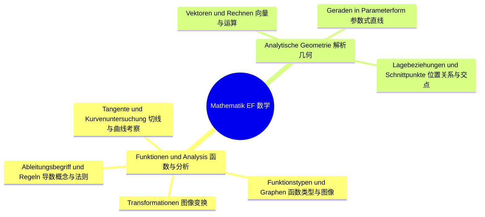
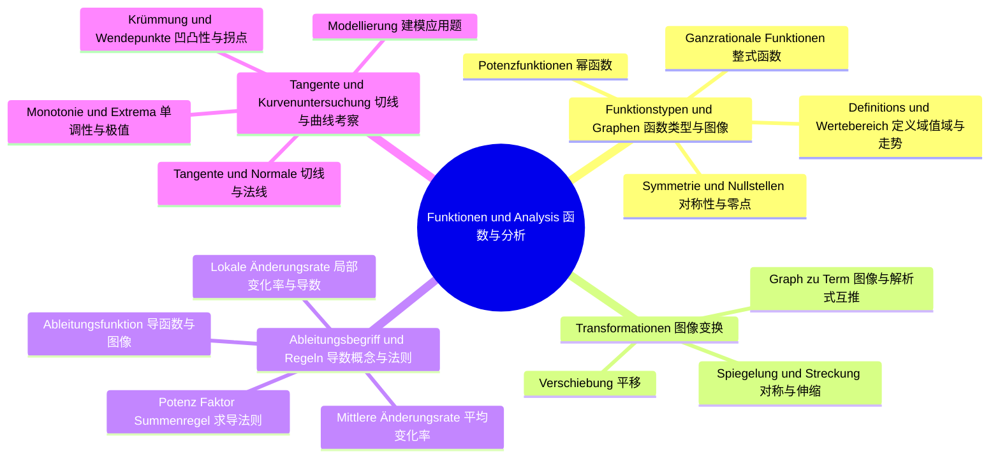
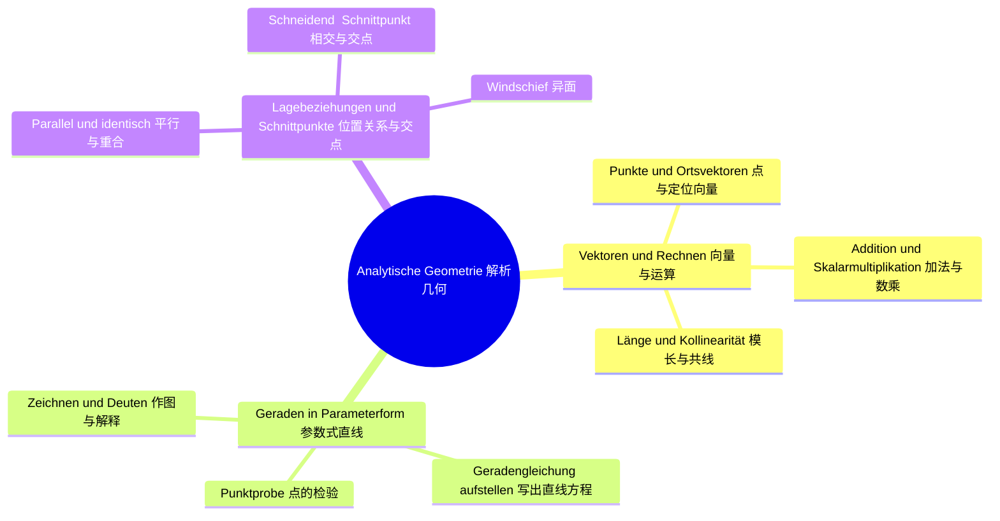

# Lernbaum Mathematik EF（数学 EF 学习树）

> 中文导读：EF 数学 = 函数与微积分入门 + 空间向量入门；期末有全州统考 ZKE，官方公式表可用，解题过程的表达分很关键。
> KLP 依据：NRW KLP Mathematik 2023。Klausur-Fokus：ZKE（Teil A ohne Hilfsmittel / Teil B mit Hilfsmitteln）+ Darstellungsleistung。

## 1. 总览（L0→L1→L2）

## 2. 分 IF 展开（L1→L2→L3）

### IF 1：Funktionen und Analysis

### IF 2：Analytische Geometrie

## 3. 节点明细（中文在上，德语在下）

### IF 1 Funktionen und Analysis（函数与分析）

#### L2 Funktionstypen und Graphen（函数类型与图像）

- **Potenzfunktionen（幂函数）**
  - 中文一句话：掌握整数指数幂函数的基本形状、定义域与单调性，是后面整式函数的基础。
  - `Operatoren: [darstellen, beschreiben, bestimmen]`
  - `Klausur-Anbindung: Teil A Grundlagenaufgabe；由解析式判断图像特征（AFB I–II）。`
  - `Leitfrage DE / ZH: Welche Form hat der Graph von f mit ganzzahligem Exponenten? / 整数指数的幂函数图像长什么样？`

- **Ganzrationale Funktionen（整式函数）**
  - 中文一句话：由最高次项决定整体走势，由各项共同决定细节，是 EF 分析的核心对象。
  - `Operatoren: [darstellen, beschreiben, begründen]`
  - `Klausur-Anbindung: Teil A/B 标准对象；Globalverlauf aus Leitkoeffizient und Grad ablesen。`
  - `Leitfrage DE / ZH: Wie bestimmt der Grad den Globalverlauf? / 次数如何决定函数两端的走势？`

- **Definitions- und Wertebereich, Verlauf（定义域、值域与走势）**
  - 中文一句话：先说清函数"在哪里有定义、能取到哪些值"，再描述图像从左到右的走势。
  - `Operatoren: [angeben, beschreiben, bestimmen]`
  - `Klausur-Anbindung: Teil A 必考小问；Definitions-/Wertebereich angeben, Verlauf beschreiben。`
  - `Leitfrage DE / ZH: Wo ist die Funktion definiert und wohin läuft der Graph? / 函数在哪里有定义、图像往哪里走？`

- **Symmetrie und Nullstellen（对称性与零点）**
  - 中文一句话：用奇偶次项判断对称，用因式分解或已知定理求零点，为画图和极值铺路。
  - `Operatoren: [bestimmen, berechnen, begründen]`
  - `Klausur-Anbindung: Teil A 常规计算；Nullstellen berechnen, Symmetrie nachweisen。`
  - `Leitfrage DE / ZH: Wie weist man Symmetrie und Nullstellen nach? / 如何证明对称性并求出零点？`

#### L2 Transformationen（图像变换）

- **Verschiebung（平移）**
  - 中文一句话：括号里加减管左右、括号外加减管上下，方向容易反，要专门练。
  - `Operatoren: [darstellen, beschreiben, bestimmen]`
  - `Klausur-Anbindung: Teil A 图↔式互推；Verschiebung am Term ablesen oder einzeichnen。`
  - `Leitfrage DE / ZH: Wie verschiebt ein Parameter den Graphen? / 参数如何让图像平移？`

- **Spiegelung und Streckung（对称与伸缩）**
  - 中文一句话：负号管翻转、系数管拉伸压缩，搞清是沿 x 轴还是 y 轴作用。
  - `Operatoren: [darstellen, beschreiben, begründen]`
  - `Klausur-Anbindung: Teil A/B 作图题；Transformation beschreiben und skizzieren。`
  - `Leitfrage DE / ZH: Was bewirkt ein Faktor oder Minus vor Funktion oder Variable? / 函数前或变量前的系数与负号起什么作用？`

- **Graph zu Term und zurück（图像与解析式互推）**
  - 中文一句话：看到平移翻转能写出解析式，看到解析式能想象出图像，这是建模的第一步。
  - `Operatoren: [darstellen, bestimmen, begründen]`
  - `Klausur-Anbindung: Teil B Modellierung；aus Skizze Term aufstellen und umgekehrt。`
  - `Leitfrage DE / ZH: Wie kommt man vom Bild zum Term und zurück? / 如何在图像和解析式之间来回转换？`

#### L2 Ableitungsbegriff und Regeln（导数概念与法则）

- **Mittlere Änderungsrate（平均变化率）**
  - 中文一句话：区间两端函数值之差除以区间长度，几何意义是割线斜率。
  - `Operatoren: [berechnen, beschreiben, deuten]`
  - `Klausur-Anbindung: Teil A/B 应用题入口；Differenzenquotient berechnen und als Steigung deuten。`
  - `Leitfrage DE / ZH: Was misst der Differenzenquotient? / 差商度量的是什么？`

- **Lokale Änderungsrate und Ableitung（局部变化率与导数）**
  - 中文一句话：区间收缩到一点就得到瞬时变化率，几何意义是切线斜率，核心是极限思想。
  - `Operatoren: [erklären, beschreiben, begründen]`
  - `Klausur-Anbindung: Teil A 理解题；Übergang Sekante→Tangente erklären（AFB II）。`
  - `Leitfrage DE / ZH: Wie wird aus der Sekante eine Tangente? / 割线如何变成切线？`

- **Potenz-, Faktor-, Summenregel（幂法则、系数法则、求和法则）**
  - 中文一句话：EF 只用这三条求导法则，练到看到多项式能直接写出导函数。
  - `Operatoren: [berechnen, bestimmen, angeben]`
  - `Klausur-Anbindung: Teil A 纯计算；Ableitung mit den drei Regeln bilden。`
  - `Leitfrage DE / ZH: Wie leitet man Potenzen und Summen ab? / 幂和加和如何求导？`

- **Ableitungsfunktion und Graph（导函数与图像）**
  - 中文一句话：原函数增减对应导函数正负，原函数极值对应导函数零点，两图要能互读。
  - `Operatoren: [darstellen, beschreiben, begründen]`
  - `Klausur-Anbindung: Teil A 读图题；Graph von f und f' einander zuordnen。`
  - `Leitfrage DE / ZH: Was verrät der Graph von f' über f? / 导函数图像告诉我们原函数的什么信息？`

#### L2 Tangente und Kurvenuntersuchung（切线与曲线考察）

- **Tangente und Normale（切线与法线）**
  - 中文一句话：切点处导数值就是斜率，用点斜式写方程，法线斜率是负倒数。
  - `Operatoren: [bestimmen, berechnen, begründen]`
  - `Klausur-Anbindung: Teil A/B 高频大题；Tangentengleichung aufstellen。`
  - `Leitfrage DE / ZH: Wie stellt man Tangente und Normale auf? / 如何求切线和法线方程？`

- **Monotonie und Extrema（单调性与极值）**
  - 中文一句话：导数变号的地方就是极值点，用符号表或二阶判断区分极大极小。
  - `Operatoren: [bestimmen, begründen, berechnen]`
  - `Klausur-Anbindung: Teil B 核心步骤；Hoch-/Tiefpunkte mit Vorzeichenwechsel nachweisen。`
  - `Leitfrage DE / ZH: Wann liegt ein Hoch- oder Tiefpunkt vor? / 什么时候是极大值或极小值？`

- **Krümmung und Wendepunkte（凹凸性与拐点）**
  - 中文一句话：二阶导数管凹凸，二阶变号的地方是拐点，是 EF 曲线考察的最高点。
  - `Operatoren: [bestimmen, begründen, berechnen]`
  - `Klausur-Anbindung: Teil B 压轴步骤；Wendepunkt mit f''-Vorzeichenwechsel nachweisen。`
  - `Leitfrage DE / ZH: Was zeigt die zweite Ableitung? / 二阶导数说明什么？`

- **Modellierung（建模应用题）**
  - 中文一句话：把现实问题翻译成函数，在定义域内求最值，最后把数学答案翻回现实语言。
  - `Operatoren: [modellieren, bestimmen, bewerten]`
  - `Klausur-Anbindung: Teil B 应用题；Realsituation→Funktion→Extremwert→Rückdeutung。`
  - `Leitfrage DE / ZH: Wie wird aus der Aufgabe eine Zielfunktion? / 应用题如何变成目标函数？`

### IF 2 Analytische Geometrie（解析几何）

#### L2 Vektoren und Rechnen（向量与运算）

- **Punkte und Ortsvektoren（点与定位向量）**
  - 中文一句话：点是位置，向量是位移，定位向量是把点"翻译"成从原点出发的箭头。
  - `Operatoren: [darstellen, bestimmen, beschreiben]`
  - `Klausur-Anbindung: Teil A 基础；Koordinaten ablesen, Ortsvektor angeben。`
  - `Leitfrage DE / ZH: Was unterscheidet Punkt und Vektor? / 点和向量有什么区别？`

- **Addition und Skalarmultiplikation（加法与数乘）**
  - 中文一句话：向量加法首尾相接，数乘改变长度和方向，坐标层面都是分量运算。
  - `Operatoren: [berechnen, darstellen, bestimmen]`
  - `Klausur-Anbindung: Teil A 计算；Vektoren komponentenweise addieren und vervielfachen。`
  - `Leitfrage DE / ZH: Wie rechnet man mit Vektoren in Koordinaten? / 坐标下如何做向量运算？`

- **Länge und Kollinearität（模长与共线）**
  - 中文一句话：模长用勾股定理推广到三维，共线就是一个向量是另一个的数乘倍。
  - `Operatoren: [berechnen, begründen, bestimmen]`
  - `Klausur-Anbindung: Teil A/B 小问；Betrag berechnen, Kollinearität nachweisen。`
  - `Leitfrage DE / ZH: Wann sind zwei Vektoren kollinear? / 两个向量何时共线？`

#### L2 Geraden in Parameterform（参数式直线）

- **Geradengleichung aufstellen（写出直线方程）**
  - 中文一句话：一个定点加一个方向向量就是一条直线，两点式本质是先算方向向量。
  - `Operatoren: [bestimmen, darstellen, begründen]`
  - `Klausur-Anbindung: Teil A/B 必考；Gerade durch zwei Punkte in Parameterform angeben。`
  - `Leitfrage DE / ZH: Was braucht man für eine Geradengleichung? / 写直线方程需要什么？`

- **Punktprobe（点的检验）**
  - 中文一句话：把点代入参数方程，看三行方程能否给出同一个参数值。
  - `Operatoren: [untersuchen, begründen, berechnen]`
  - `Klausur-Anbindung: Teil A 常规题；prüfen, ob ein Punkt auf der Geraden liegt。`
  - `Leitfrage DE / ZH: Wie prüft man, ob ein Punkt auf der Geraden liegt? / 如何检验点是否在直线上？`

- **Zeichnen und Deuten（作图与解释）**
  - 中文一句话：能在坐标系中画出直线并读出方向，知道参数变化时点如何沿直线运动。
  - `Operatoren: [darstellen, beschreiben, deuten]`
  - `Klausur-Anbindung: Teil A/B 图示题；Gerade skizzieren, Parameter deuten（AFB I–II）。`
  - `Leitfrage DE / ZH: Was bedeutet der Parameter anschaulich? / 参数的直观意义是什么？`

#### L2 Lagebeziehungen und Schnittpunkte（位置关系与交点）

- **Parallel und identisch（平行与重合）**
  - 中文一句话：方向向量共线则平行，再做一次点检验就能区分平行还是重合。
  - `Operatoren: [untersuchen, begründen, bestimmen]`
  - `Klausur-Anbindung: Teil A/B 分类题；parallel vs. identisch unterscheiden。`
  - `Leitfrage DE / ZH: Wie unterscheidet man parallel und identisch? / 如何区分平行与重合？`

- **Schneidend und Schnittpunkt（相交与交点）**
  - 中文一句话：联立两条直线的参数方程，解出两个参数且一致时得到交点。
  - `Operatoren: [berechnen, bestimmen, begründen]`
  - `Klausur-Anbindung: Teil B 计算核心；Schnittpunkt durch Gleichsetzen bestimmen。`
  - `Leitfrage DE / ZH: Wie berechnet man den Schnittpunkt? / 如何计算交点？`

- **Windschief（异面）**
  - 中文一句话：既不平行又无交点的两条空间直线就是异面的，这是平面几何里没有的新情况。
  - `Operatoren: [untersuchen, begründen, beschreiben]`
  - `Klausur-Anbindung: Teil B 证明题；windschief durch Ausschluss nachweisen。`
  - `Leitfrage DE / ZH: Wann heißen zwei Geraden windschief? / 两条直线何时叫异面？`
