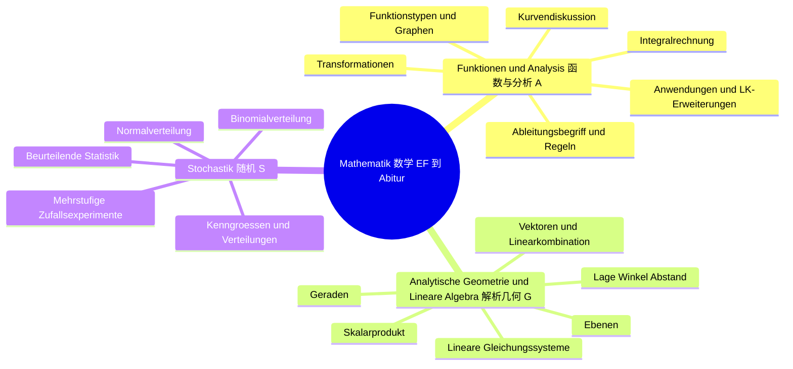
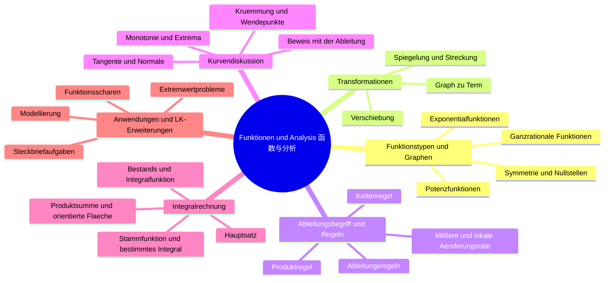
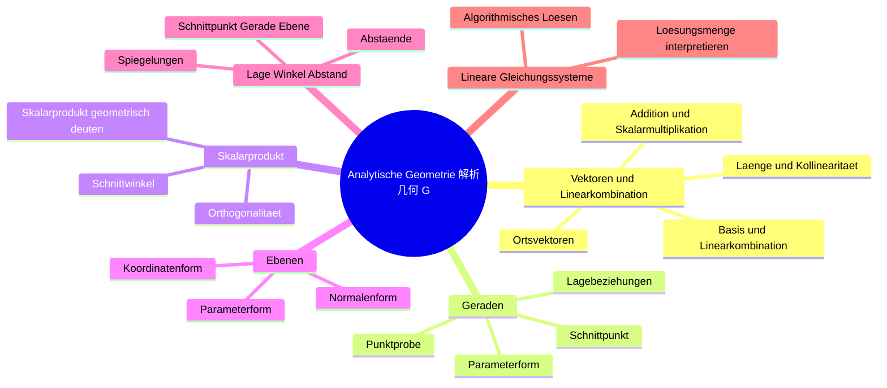
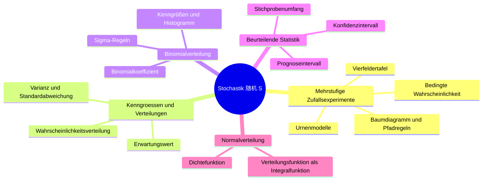

# Lernbaum Mathematik（数学学习树 · EF→Abitur）

> 中文一句话：EF 只打 A（函数与分析）与 G（解析几何与向量）两根地基；Q1 三领域全开并在 GK/LK 上分叉；Q2 收口于论证、跨领域交叉与综合——终点是**必须覆盖 A/G/S 三 IF** 的 Abitur。
> KLP-Basis：[`Curriculum/Deutschland/Mathe-Oberstufe.md`](../Curriculum/Deutschland/Mathe-Oberstufe.md)（NRW KLP Heft `4720`，版本 `2022/23`，PDF `gost_klp_m_2023_06_07.pdf`）[已验证]
> Klausur-Fokus：EF **ZKE 100 min**（Teil A 免工具 ≤25 min → Teil B WTR/CAS-MMS ≥75 min）→ Abitur **两个 Prüfungsteil**（1. hilfsmittelfrei GK 100 / LK 110 min；2. WTR 或 CAS/MMS GK 155 / LK 190 min；合计 GK 255 / LK 300 min，含 Auswahlzeit）[已验证]
> 能力轴：数学是**五**个 Kompetenzbereich —— `Operieren` / `Modellieren` / `Problemlösen` / `Argumentieren` / `Kommunizieren`；`Reflektieren` 是 `Problemlösen` 的第三子维度（**非第六维**）[已验证]
> ⚠️ Operatoren 分层提示：数学属 NRW 的 **B 组科**——官方明写「所有 Operatoren 原则上可涉三个 AFB」，**不按动词分配 AFB**，层级由任务情境决定 [已验证]

---

## 0. Methoden-Profil（方法论画像 —— 本设计第二核心）

**① Abitur 能力权重**（AFB 分布）

| AFB | 层级 | 本课权重（GK / LK） | 说明 |
|---|---|---|---|
| **I** | Reproduktion | ~20% / ~15% | 定义复述、公式直用、图像指认；免工具段第一小问与 ZKE Teil A 前半 |
| **II** | Reorganisation und Transfer | ~55% / ~50% | **法定重心**：Kurvendiskussion、Modellieren、选工具、Steckbrief、条件概率 |
| **III** | Reflexion und Problemlösung | ~25% / ~35% | 证明（EF 求导法则 / LK Hauptsatz）、模型边界评判、参数族论证、统计结论评价 |

> 权重数字为本项目按题型结构推算 → [据推断]；「**所有 AFB 必现、AFB II 为重心**」为 KLP 明文 → [已验证]。
> GK→LK 的差别不是"多学了什么"，而是**同一内容上被要求的认知层数**：GK 主要停在 AFB II，LK 的 AFB III 占比更高 [据推断]。

**② 黄金学习法**（证据全部来自 `00_META/Lernmethoden-Evidenz.md`，不自创）

| 方法 | 证据来源 | 本课应用方式 |
|---|---|---|
| 检索练习（Practice Testing） | Dunlosky 2013「hoch」· Karpicke & Blunt 2011 d≈1.0 | 合书默写 Kurvendiskussion 五步链、积分六概念链；"看懂了"不算会 |
| 间隔重复（Distributed Practice） | Dunlosky「hoch」· FSRS retention 0.9 + 3 次重学 | 公式卡与术语卡（G/S 领域无笔记，**先建卡再补笔记**） |
| 测试格式对齐（TAP） | Adesope 2017：一致 g≈0.63 > 不一致 g≈0.53 | 平时练习就按 **Prüfungsteil 1 免工具**条件计时，题干用官方 Operator 动词 |
| 交错练习（Interleaving） | Rohrer & Taylor 2007 d≈1.34；Rohrer et al. 2020 d≈0.83 | A/G/S 三领域混排（Abitur 卷必须全三 IF），不做同类题十连刷 |
| 对比辨别（Discriminative Contrast） | Foster 2019：混淆率 46% → 10% | parallel/identisch/windschief；lokal vs global Extrema；Dichtefunktion vs Verteilungsfunktion；EW vs σ |
| 正确例题 + 带扶手自解释 | Barbieri 2023 g≈0.48；空泛自解释 β≈−0.24（有害） | 新题型首学 = 1 道正确例题 + 两问（"这步用哪条规则？""上一步结论是什么？"） |
| 反馈三层（KR → 延迟 → 过程） | Brummer 2024 g≈0.41，其中 KR g≈0.64 | 先判对错 → 整套做完再展开 → 错因归类（辨别错 / 知识错 / 表达错）记 Fehlerlog |
| 先行组织者（Advance Organizer） | Ausubel（设计总纲 §2.2） | 每个 L2 开头先看"这一块在考卷哪一段、值几分" |
| 认知负荷管理（CLT） | Sweller（设计总纲 §2.2） | 长链条题（建模 + 求导 + 论证）先拆 Teilschritte 再落笔 |

**③ 三大典型失分点**

1. **只写结果、不呈示过程** —— `berechnen` / `bestimmen·ermitteln` / `begründen·nachweisen·zeigen` / `untersuchen` 四类动词**都要求呈示 Weg**，只给答案不给分 [已验证]。
2. **免工具段失守** —— EF ZKE Teil A（≤25 min）与 Abitur 1. Prüfungsteil（GK 100 / LK 110 min）全程无工具；因式分解降次、整有理函数求导与求原函数、≤3 未知数 LGS 必须手算。中国高考无强制免工具题，**这部分中国材料帮不上** [已验证]。
3. **局部 vs 全局与端点漏比 + 现实情境不回译** —— `lokale und globale Extrema` 混淆、闭区间忘比端点；Modellieren 四段闭环断在末段（缺 Interpretieren/Validieren）；AFB III 论证环节直接空着 [已验证/据推断]。

**④ 本课笔记结构模板**

> 每篇数学笔记固定八段：
> ① 一句话中文定义 · ② 术语三元组 `DE / CN / EN`（G/S 领域术语卡优先）· ③ **标准解题程序**（编号步骤 + 每步标注"这一步用的 KLP 工具"）· ④ 一道**正确例题**（分步标注规则，供首学）· ⑤ **免工具路径 vs 工具路径**两条解法（对应两个 Prüfungsteil）· ⑥ 3 道 Operator 题干练习（含 `begründen`/`untersuchen` 至少 1 道）· ⑦ Fehlerquelle 三行（辨别错 / 知识错 / 表达错）· ⑧ 上下游节点链接（本树节点 id）。
> 配图遵守「一图一概念」（Mayer CTML），装饰图不进库。

---

## 1. 总览 Gesamtübersicht（L0→L1→L2）

```mermaid
mindmap
  root((Mathematik 数学 EF 到 Abitur))
    Funktionen und Analysis 函数与分析 A
      Funktionstypen und Graphen
      Transformationen
      Ableitungsbegriff und Regeln
      Kurvendiskussion
      Integralrechnung
      Anwendungen und LK-Erweiterungen
    Analytische Geometrie und Lineare Algebra 解析几何 G
      Vektoren und Linearkombination
      Geraden
      Skalarprodukt
      Ebenen
      Lage Winkel Abstand
      Lineare Gleichungssysteme
    Stochastik 随机 S
      Mehrstufige Zufallsexperimente
      Kenngroessen und Verteilungen
      Binomialverteilung
      Beurteilende Statistik
      Normalverteilung
```

> L1 与 `Mathe-Oberstufe.md` 的 Inhaltsfeld **逐一对齐**：**A** Funktionen und Analysis / **G** Analytische Geometrie und Lineare Algebra / **S** Stochastik [已验证]。
> ⚠️ **EF 只有 A + G，S 在 EF 完全缺席** [已验证]。

---

## 2. 分 IF 展开（L1→L2→L3 + 应试四行）

### L1-A: Funktionen und Analysis（函数与分析）

```mermaid
mindmap
  root((Funktionen und Analysis 函数与分析))
    Funktionstypen und Graphen
      Potenzfunktionen
      Ganzrationale Funktionen
      Symmetrie und Nullstellen
      Exponentialfunktionen
    Transformationen
      Verschiebung
      Spiegelung und Streckung
      Graph zu Term
    Ableitungsbegriff und Regeln
      Mittlere und lokale Aenderungsrate
      Ableitungsregeln
      Produktregel
      Kettenregel
    Kurvendiskussion
      Tangente und Normale
      Monotonie und Extrema
      Kruemmung und Wendepunkte
      Beweis mit der Ableitung
    Integralrechnung
      Produktsumme und orientierte Flaeche
      Bestands und Integralfunktion
      Stammfunktion und bestimmtes Integral
      Hauptsatz
    Anwendungen und LK-Erweiterungen
      Modellierung
      Extremwertprobleme
      Steckbriefaufgaben
      Funktionsscharen
```

#### L2 A1 — Funktionstypen und Graphen（函数类型与图像）`[EF→Q1]`

- **Potenzfunktionen（幂函数）** `[EF]` · `MA-A1-01`
  - 中文一句话：整数指数幂函数的形状、定义域与单调性；LK 再扩到有理指数幂。
  - Klausur-Anbindung：ZKE Teil A / Abitur 1. Prüfungsteil 免工具第一小问；由解析式判图像特征与 Grenzverhalten（AFB I–II）。
  - Operatoren：angeben, beschreiben, skizzieren
  - Lernweg ZH：先行组织者（先看"指数奇偶 → 形状族"一页总表）+ 检索练习（合书默画四类形状并标定义域）。
  - Fehlerquelle：负指数幂漏掉 `x=0` 不在定义域；把 `x³` 与 `x²` 的两端走势记反。
  - 📓 笔记：⚠️ 缺口（公式见 [`Formel-Spickzettel`](../../03_Mathe/Formel-Spickzettel.md)）

- **Ganzrationale Funktionen（整式函数）** `[EF→Q2]` · `MA-A1-02`
  - 中文一句话：最高次项决定两端走势，其余项决定细节，是 EF 分析的核心对象。
  - Klausur-Anbindung：两个 Prüfungsteil 都考；由 Grad 与 Leitkoeffizient 读 Globalverlauf（AFB I–II）。
  - Operatoren：beschreiben, begründen, grafisch darstellen
  - Lernweg ZH：对比辨别（同 Grad 不同系数 / 同系数不同 Grad 两两对照）+ 合书默画。
  - Fehlerquelle：只凭最高次项下结论，忽略中间项造成的额外极值点。
  - 📓 笔记：[`Ganzrationale-Funktionen-Kurvendiskussion`](../../03_Mathe/Ganzrationale-Funktionen-Kurvendiskussion.md) ✅

- **Definitions-/Wertebereich, Verlauf, Verhalten für x→±∞** `[EF]` · `MA-A1-03`
  - 中文一句话：先说清"在哪里有定义、能取哪些值"，再描述从左到右的走势与两端极限行为。
  - Klausur-Anbindung：免工具必考小问；`angeben` + `beschreiben`（AFB I），也是建模题的第一步。
  - Operatoren：angeben, beschreiben, begründen
  - Lernweg ZH：检索练习（每题先默"定义域 → 值域 → 走势"三步）+ 交错（与向量题混排防套路化）。
  - Fehlerquelle：应用题忘记把现实约束（长度 > 0、时间 ≥ 0）并入定义域，导致后续极值全错。
  - 📓 笔记：⚠️ 缺口

- **Symmetrie und Nullstellen（对称性与零点）** `[EF]` · `MA-A1-04`
  - 中文一句话：用奇偶次项判对称，用因式分解求零点，为作图与极值铺路。
  - Klausur-Anbindung：免工具常客——因式分解 → 零点 → 符号判定（AFB I–II）；EF 明确要求无工具解"可提公因式降次"的方程。
  - Operatoren：bestimmen, berechnen, nachweisen
  - Lernweg ZH：正确例题精读 + 带扶手自解释（"这一步用了哪条规则？"）；数轴标根练到不用想。
  - Fehlerquelle：因式分解不彻底；把"关于 y 轴对称"说成"关于原点对称"（术语错亦扣分）。
  - 🇨🇳 CN-Methode：函数—方程—不等式三位一体（零点 ⇄ 根 ⇄ 解集端点）· DE-Anschluss: `Nullstellen` + `Verlauf` + 无工具因式分解 + `Lösungsmenge` 表述 · 合规性: ✅
  - 备注：中国把三种提问**显式并列**为同一件事的三种说法；德国工具全备但未并列。做成一张卡即可直接提免工具段速度，且不含任何新知识。
  - 📓 笔记：⚠️ 缺口（建议《Nullstellen — Gleichung — Ungleichung》放 Aufgabenart I 训练册首单元）

- **Exponentialfunktionen（指数函数）** `[Q1]` · `MA-A1-05`
  - 中文一句话：`a^x` 的运算性质与单调性；`e^x` 因 `f'=f` 而特殊，是生长/衰减建模的唯一载体。
  - Klausur-Anbindung：2. Prüfungsteil 建模主干（Wachstum/Zerfall），常要求说明 `a^x` 性质并**解释 `e^x` 的特殊性**（AFB II）。
  - Operatoren：beschreiben, erläutern, berechnen
  - Lernweg ZH：先行组织者（先建"增长率 ⇄ 底数"对照表）+ TAP 对齐（直接用 Abitur 情境题格式练）。
  - Fehlerquelle：把 `e^x` 与 `x^n` 的求导规则混用；连续模型与离散分期模型混用。
  - 📓 笔记：⚠️ 缺口（Q1-A 最大单点缺口之一）

#### L2 A2 — Transformationen（图像变换）`[EF]`

- **Verschiebung（平移）** `[EF]` · `MA-A2-01`
  - 中文一句话：括号内加减管左右、括号外加减管上下，方向极易反。
  - Klausur-Anbindung：ZKE Teil A 图↔式互推小问（AFB I–II）。
  - Operatoren：angeben, beschreiben, skizzieren
  - Lernweg ZH：对比辨别（`(x-2)²` vs `(x+2)²` 成对练）+ 检索练习（给图写式、给式画图双向默）。
  - Fehlerquelle：左右方向写反（`-2` 记成向左）。
  - 📓 笔记：⚠️ 缺口

- **Spiegelung und Streckung（对称与伸缩）** `[EF]` · `MA-A2-02`
  - 中文一句话：负号管翻转、系数管拉伸压缩，须分清作用在 x 轴还是 y 轴方向。
  - Klausur-Anbindung：作图与解释题；`Transformation beschreiben und skizzieren`（AFB I–II）。
  - Operatoren：beschreiben, skizzieren, begründen
  - Lernweg ZH：对比辨别（`-f(x)` / `f(-x)` / `2f(x)` / `f(2x)` 四格对照表先辨后做）。
  - Fehlerquelle：把 `f(2x)` 当成横向拉伸（实为压缩）。
  - 📓 笔记：⚠️ 缺口

- **Graph zu Term und zurück（图像与解析式互推）** `[EF→Q1]` · `MA-A2-03`
  - 中文一句话：看到平移翻转能写出解析式，看到解析式能想象出图像——建模的第一步。
  - Klausur-Anbindung：2. Prüfungsteil Modellierung 的入口；由 Skizze 定 Term 或反向（AFB II）。
  - Operatoren：bestimmen, begründen, grafisch darstellen
  - Lernweg ZH：正确例题精读 + 检索练习（同一图用两种参数化写出并互验）。
  - Fehlerquelle：只写形状不写定义域；参数含义不问"单位是什么"。
  - 📓 笔记：⚠️ 缺口

- **Parameterwirkung bei Sinusfunktionen（正弦函数的参数作用）** `[EF]` · `MA-A2-04`
  - 中文一句话：EF 只要求解释参数对正弦曲线的影响（周期/振幅/相位），不求导。
  - Klausur-Anbindung：免工具图像解释题；LK 阶段升级为 `a·sin(b(x+c))+d` 的无工具求导（AFB I → LK AFB II）。
  - Operatoren：beschreiben, erläutern, angeben
  - Lernweg ZH：先行组织者（先给"四参数各管什么"一张表），再用 CAS 做参数动态观察。
  - Fehlerquelle：把 `b` 当成周期本身（周期是 `2π/b`）。
  - 📓 笔记：⚠️ 缺口（LK 前置建议《Trigonometrische Umformungen》）

#### L2 A3 — Ableitungsbegriff und -regeln（导数概念与法则）`[EF→Q1]`

- **Mittlere Änderungsrate（平均变化率）** `[EF]` · `MA-A3-01`
  - 中文一句话：区间两端函数值之差除以区间长度，几何意义是割线斜率。
  - Klausur-Anbindung：应用题入口；`Differenzenquotient berechnen und deuten`（AFB I–II）。
  - Operatoren：berechnen, deuten, beschreiben
  - Lernweg ZH：与物理运动学对练（跨科联结，见已有笔记）+ 检索练习默公式。
  - Fehlerquelle：单位不写（"每秒米"丢掉 → Darstellungsleistung 扣分）。
  - 📓 笔记：[`Analysis-Physik-Kinetik-Vernetzung`](../../03_Mathe/Analysis-Physik-Kinetik-Vernetzung.md) ✅

- **Lokale Änderungsrate und Grenzwertbegriff（局部变化率与极限）** `[EF]` · `MA-A3-02`
  - 中文一句话：区间收缩到一点得瞬时变化率；EF 要求以 **propädeutischer Grenzwertbegriff** 定性说明"平均 → 局部"的过渡并使用 `lim` 记号。
  - Klausur-Anbindung：概念解释题；`Übergang Sekante → Tangente erklären`（AFB II），是德国特有问法。
  - Operatoren：erläutern, beschreiben, begründen
  - Lernweg ZH：自我解释（带扶手：割线如何变切线）+ 口语复述训练（口试也考）。
  - Fehlerquelle：把"趋近"写成"等于"；`lim` 记号漏写。
  - 📓 笔记：⚠️ 缺口（概念解释需德语句式模板）

- **Potenz-, Summen-, Faktorregel（三条求导法则）** `[EF]` · `MA-A3-03`
  - 中文一句话：EF 只用这三条；练到看到多项式直接写出导函数。
  - Klausur-Anbindung：免工具纯计算（AFB I）；⚠️ EF **法定要求证明其中一条**（Summen- 或 Faktorregel）。
  - Operatoren：berechnen, bestimmen, nachweisen
  - Lernweg ZH：检索练习（限时 60 秒求导）+ 交错（与向量运算混排）。
  - Fehlerquelle：常数项求导不为 0；系数与指数相乘后忘记指数减一。
  - 📓 笔记：⚠️ 缺口（**缺"证明一条求导法则"的证明训练**）

- **Produktregel（乘积法则）** `[Q1]` · `MA-A3-04`
  - 中文一句话：`(uv)' = u'v + uv'`，Q1 一上来就要用，是 EF→Q1 的第一个断层。
  - Klausur-Anbindung：2. Prüfungsteil 常规步骤；常与 `e^x` 复合出现（AFB II）。
  - Operatoren：berechnen, bestimmen, zeigen
  - Lernweg ZH：正确例题精读 → 间隔重复（与幂/和/因子法则做成混排卡）。
  - Fehlerquelle：漏项（只写 `u'v`）；与 Kettenregel 混用。
  - 📓 笔记：⚠️ 缺口

- **Kettenregel（链式法则）** `[Q1]` · `MA-A3-05`
  - 中文一句话：**GK 仅限 `e^x ∘ 线性函数`；LK 一般化**，是 GK/LK 的关键分界线。
  - Klausur-Anbindung：GK 只在指数型复合处出现；LK 与 Produktregel 并列为必用工具（AFB II → III）。
  - Operatoren：berechnen, bestimmen, begründen
  - Lernweg ZH：对比辨别（"这是乘积还是复合？"先选再做，错则记"辨别错"）。
  - Fehlerquelle：GK 学生按 LK 的一般链式做（超范围，浪费时间）；内层导数漏乘。
  - 📓 笔记：⚠️ 缺口

- **Ableitungsfunktion und graphisches Ableiten（导函数与图形求导）** `[EF]` · `MA-A3-06`
  - 中文一句话：原函数增减 ⇄ 导函数正负；原函数极值 ⇄ 导函数零点；两图互读。
  - Klausur-Anbindung：读图题；`Graph von f und f' einander zuordnen`（AFB I–II），德国特有问法。
  - Operatoren：beschreiben, entscheiden, begründen
  - Lernweg ZH：对比辨别（三图选一 + 说明理由）+ 检索练习（遮住一张图默另一张）。
  - Fehlerquelle：把"导函数为零"直接说成"极值点"（还要符号变化）。
  - 📓 笔记：⚠️ 缺口

#### L2 A4 — Kurvendiskussion（曲线考察）`[EF→Q2]`

- **Tangente und Normale（切线与法线）** `[EF]` · `MA-A4-01`
  - 中文一句话：切点处导数值即斜率，点斜式写方程，法线斜率取负倒数。
  - Klausur-Anbindung：高频大题；`Tangentengleichung aufstellen`（AFB II），常接"切线过某点求切点"。
  - Operatoren：bestimmen, berechnen, begründen
  - Lernweg ZH：正确例题精读（三种变体：已知切点 / 切线过外点 / 切线平行已知直线）+ 检索练习。
  - Fehlerquelle：法线斜率忘取负倒数；点斜式代入时把切点坐标代错行。
  - 📓 笔记：[`Ganzrationale-Funktionen-Kurvendiskussion`](../../03_Mathe/Ganzrationale-Funktionen-Kurvendiskussion.md) ✅

- **Monotonie（单调性）** `[EF]` · `MA-A4-02`
  - 中文一句话：由 `f'` 的符号定单调区间，用符号表（Vorzeichentabelle）呈示。
  - Klausur-Anbindung：Kurvendiskussion 第二步；`Monotonie intervals bestimmen und begründen`（AFB II）。
  - Operatoren：bestimmen, begründen, untersuchen
  - Lernweg ZH：检索练习（默画符号表模板）+ 反馈三层（先判对错再看标准符号表）。
  - Fehlerquelle：符号表不画、只给结论 → 违反"必须呈示过程"；端点是否并入区间不说明。
  - 📓 笔记：[`Ganzrationale-Funktionen-Kurvendiskussion`](../../03_Mathe/Ganzrationale-Funktionen-Kurvendiskussion.md) ✅

- **Extrema: lokal und global（极值与最值）** `[EF]` · `MA-A4-03`
  - 中文一句话：导数变号处为极值点，用符号变化或二阶导判别极大/极小；闭区间最值必须比端点。
  - Klausur-Anbindung：Teil B 核心步骤；`Hoch-/Tiefpunkte nachweisen`（AFB II），末段常追加"证这是全局最优"（AFB III）。
  - Operatoren：bestimmen, berechnen, nachweisen
  - Lernweg ZH：对比辨别（lokal vs global / 开区间 vs 闭区间四格对照）+ 检索练习。
  - Fehlerquelle：**只比驻点忘比端点**；二阶导为 0 时误判（须回退到符号变化）。
  - 📓 笔记：[`Ganzrationale-Funktionen-Kurvendiskussion`](../../03_Mathe/Ganzrationale-Funktionen-Kurvendiskussion.md) ✅

- **Krümmung und Wendepunkte（曲率与拐点）** `[EF]` · `MA-A4-04`
  - 中文一句话：二阶导管凹凸，二阶导变号处为拐点，是 EF 曲线考察的最高点。
  - Klausur-Anbindung：压轴步骤；`Wendepunkt mit f''-Vorzeichenwechsel nachweisen`（AFB II–III）。
  - Operatoren：bestimmen, nachweisen, untersuchen
  - Lernweg ZH：正确例题精读 + 带扶手自解释（"为什么 `f''=0` 还不够？"）。
  - Fehlerquelle：把 `f''=0` 当成充分条件（必须符号变化）；拐点与极值点概念互串。
  - 📓 笔记：[`Ganzrationale-Funktionen-Kurvendiskussion`](../../03_Mathe/Ganzrationale-Funktionen-Kurvendiskussion.md) ✅

- **Beweis mit der Ableitung（用导数证明不等式）** `[Q1→Q2]` · `MA-A4-05`
  - 中文一句话：作辅助函数 `F = f − g`，把"证不等式"翻译成"证 `F` 的最小值 ≥ 0"。
  - Klausur-Anbindung：① `Extremwertprobleme` 末段"证明这是全局最大值"（AFB III）；② 免工具论证题（整有理函数类，GK 亦可）；③ 口试 `Begründen` 环节。
  - Operatoren：begründen, nachweisen, zeigen, untersuchen
  - Lernweg ZH：检索练习（默"移项构造 → 求导 → 定号 → 端点 → 结论"五步链）+ 12 题梯度（GK 整有理 → LK `ln`/三角）。
  - Fehlerquelle：构造完不说明定义域；只算驻点不比端点 → 结论不成立。
  - 🇨🇳 CN-Methode：用导数证明不等式（构造辅助函数）· DE-Anschluss: EF `Monotonie`/`Extrempunkte`/`globale Extrema`/`Krümmungsverhalten` + Q1 `Produktregel` + LK `Kettenregel`·`ln` · 合规性: ✅
  - 备注：**德国 KLP 没有这一整类题型**，但工具 100% 已在德国教过——这是把"求极值"重组为"证不等式"，纯方法层升级，是把偏弱的 AFB III 变成得分点的最短路径。载体须限定在 KLP 允许的函数类内（GK：整有理 + `e^x`；LK：可加三角与 `ln`）。
  - 📓 笔记：⚠️ 缺口 ★★★ 建议《Vom Extremwert zum Beweis》**第一优先产出**

- **Globalverlauf und Skizze（整体走势与草图）** `[EF]` · `MA-A4-06`
  - 中文一句话：把零点、极值、拐点、两端行为合成一张草图，是 Kommunizieren 的主要载体。
  - Klausur-Anbindung：常作为 Kurvendiskussion 的收尾小问；`skizzieren`（AFB I–II）。
  - Operatoren：skizzieren, zeichnen, beschreiben
  - Lernweg ZH：对比辨别（同一函数"只算不画" vs "先估后画"对照）+ CLT 分步。
  - Fehlerquelle：草图不标坐标/尺度；关键点数值不写 → 草图"未描述本质"。
  - 📓 笔记：⚠️ 缺口

#### L2 A5 — Integralrechnung（积分学）`[Q1→Q2]`

- **Produktsumme und orientierte Fläche（乘积和与有向面积）** `[Q1]` · `MA-A5-01`
  - 中文一句话：用有限个矩形条逼近面积，带符号的"有向面积"是积分概念的起点。
  - Klausur-Anbindung：概念解释子题；`erläutern, wie die Fläche approximiert wird`（AFB I–II）。
  - Operatoren：beschreiben, erläutern, berechnen
  - Lernweg ZH：先行组织者（先给"离散 → 极限 → 连续"一张箭头图）+ 图形化自我解释。
  - Fehlerquelle：上下和（Ober-/Untersumme）方向搞反；把"近似"写成"等于"。
  - 📓 笔记：⚠️ 缺口

- **Bestandsfunktion und Integralfunktion（存量函数与积分函数）** `[Q1]` · `MA-A5-02`
  - 中文一句话：由变化率**重构存量**——这是微分学的逆问题，也是 KLP 六概念链的核心环节。
  - Klausur-Anbindung：2. Prüfungsteil 概念题 + 应用题；`Bestandsfunktion deuten`（AFB II）。
  - Operatoren：deuten, interpretieren, beschreiben
  - Lernweg ZH：对比辨别（"给的是变化率还是存量？"先选再做）+ 检索练习。
  - Fehlerquelle：把积分函数的自变量上界与积分变量写成同一个字母。
  - 🇨🇳 CN-Methode：`aₙ = Sₙ − Sₙ₋₁`（存量 ⇄ 增量互化）· DE-Anschluss: `Bestandsfunktion` ⇄ `Integralfunktion` + `Hauptsatz`（德国已有的**连续版**同一思想）· 合规性: ⚠️
  - 备注：数列（Folge）作为**知识板块**在德国 KLP 不存在，禁止引入；但"部分和 ⇄ 通项"这一思想德国已用连续版教过，故只能作为**离散类比**与 `Bestandsfunktion` 成对呈现，且必须用德国既有术语包装。
  - 📓 笔记：⚠️ 缺口

- **Iterations- und Kumulationsprozesse（迭代与累积过程）** `[Q2]` · `MA-A5-03`
  - 中文一句话：把"后一项由前一项决定"的迭代关系与"逐期累加"的累积关系，建模为可算的过程（CN 数列技法的嫁接位）。
  - Klausur-Anbindung：2. Prüfungsteil 的 `Modellieren` 子题（复利/药物残留/分期偿还）；末段常接"模型边界评判"（AFB III）。**非笔试必考**。
  - Operatoren：beschreiben, berechnen, beurteilen
  - Lernweg ZH：正确例题精读（先算前几项 → 猜想闭式 → 论证）+ 口试 `Vermuten → Begründen` 演练。
  - Fehlerquelle：把迭代过程当独立知识板块学（德国不考）；忘记说明离散 vs 连续哪个更合适。
  - 🇨🇳 CN-Methode：递推构造（`aₙ₊₁ = p·aₙ + q` 化等比）+ 有限和四法（错位相减/裂项/分组/倒序）· DE-Anschluss: KLP 点名的跨领域概念 `Iteration` 与 `Kumulation` + EF 代数变形 + Q1 `Exponentialfunktionen` · 合规性: ⚠️
  - 备注：**载体属 CN-only，只能以"Iterationsprozess"的方法层出现，题目包装必须用德国术语**；且中国课标自身反对繁琐技巧训练，本项目只保留四种结构识别思路，不做技巧刷题。
  - 📓 笔记：⚠️ 缺口（建议《Iterationsprozesse》+《Kumulation 离散⇄连续》，明确标注非必考）

- **Stammfunktion und bestimmtes Integral（原函数与定积分）** `[Q1]` · `MA-A5-04`
  - 中文一句话：由原函数算定积分；EF/Q1 要求**无工具**求整有理函数的原函数。
  - Klausur-Anbindung：免工具段常客；`bestimmtes Integral berechnen`（AFB I–II），GK 只到定积分求面积。
  - Operatoren：berechnen, bestimmen, angeben
  - Lernweg ZH：检索练习（限时手算原函数）+ 交错（与求导题混排，强化互逆关系）。
  - Fehlerquelle：忘记 `+C`（定积分不需要，不定积分需要）；积分上下限代反。
  - 📓 笔记：⚠️ 缺口

- **Hauptsatz der Differential- und Integralrechnung（微积分基本定理）** `[Q1→Q2]` · `MA-A5-05`
  - 中文一句话：微分与积分互为逆运算；GK 只需几何直观说明，**LK 须用直观连续性概念证明**。
  - Klausur-Anbindung：2. Prüfungsteil 论证题（AFB II → LK AFB III）；是 LK 证明密度的标志。
  - Operatoren：begründen, nachweisen, erläutern
  - Lernweg ZH：正确例题精读（官方证明路径）+ 带扶手自解释（"这一步用了哪个连续性直觉？"）。
  - Fehlerquelle：只写"因为互为逆运算"一句话 → 未呈示论证过程。
  - 📓 笔记：⚠️ 缺口

- **Fläche, Rotationsvolumen, uneigentliche Integrale（面积/旋转体/反常积分）** `[Q2][LK]` · `MA-A5-06`
  - 中文一句话：定积分求面积；LK 追加绕 x 轴旋转体体积与反常积分（无限区间上的极限）。
  - Klausur-Anbindung：LK 的 2. Prüfungsteil 边缘位置（AFB II–III）。
  - Operatoren：berechnen, bestimmen, untersuchen
  - Lernweg ZH：先行组织者（三种"积分的几何用途"一张表）+ 工具路径练习（CAS 验证）。
  - Fehlerquelle：旋转体用错半径函数；反常积分忘记取极限。
  - 📓 笔记：⚠️ 缺口

#### L2 A6 — Anwendungen und LK-Erweiterungen（应用与 LK 扩展）`[Q1→Q2]`

- **Modellierung: 四段闭环（建模）** `[EF→Q2]` · `MA-A6-01`
  - 中文一句话：`Strukturieren → Mathematisieren → Interpretieren → Validieren`；须能指出模型边界并提出改进。
  - Klausur-Anbindung：法定要求 `innermathematisch : realitätsnah` **均衡配比**；现实情境题是 2. Prüfungsteil 的固定组成（AFB II → III）。
  - Operatoren：beschreiben, deuten, beurteilen
  - Lernweg ZH：先行组织者（四段清单先背）+ TAP 对齐（整题按 Abitur 格式、按 Prüfungsteil 时间练）。
  - Fehlerquelle：**断在末段**——算出数学答案就停，不回译成现实语言、不评模型边界（AFB III 直接丢分）。
  - 📓 笔记：[`Mathe-ZKE-2027-Training`](../../03_Mathe/Mathe-ZKE-2027-Training.md) ✅（EF 层）

- **Extremwertprobleme mit Nebenbedingung（条件优化问题）** `[Q1]` · `MA-A6-02`
  - 中文一句话：**经 Nebenbedingung 化为一元函数**再求最值，是现实优化题的标准形态。
  - Klausur-Anbindung：2. Prüfungsteil 高频大题（AFB II），末段常追加论证（AFB III）。
  - Operatoren：bestimmen, berechnen, beurteilen
  - Lernweg ZH：正确例题精读（先消元再求导的完整链）+ 检索练习默"设量 → 约束 → 消元 → 目标函数 → 定义域"。
  - Fehlerquelle：不写变量含义与单位；消元后忘记更新定义域。
  - 🇨🇳 CN-Methode：恒成立 / 存在性 → 最值转化（含参数分离）· DE-Anschluss: `Extremwertprobleme` + `Nebenbedingung` + `globale Extrema` 与端点比较 · 合规性: ✅
  - 备注：把"对所有 x 成立 ⇄ 最小值 ≥ 0""存在 x 使之成立 ⇄ 最大值 ≥ 0"显式题型化；纯题型层，工具全在德国侧，且"全局 vs 局部""端点是否取到"恰是德国已强调的区分点。
  - 📓 笔记：[`Ganzrationale-Funktionen-Kurvendiskussion`](../../03_Mathe/Ganzrationale-Funktionen-Kurvendiskussion.md) ✅（EF 层）；Q1 含参版 ⚠️ 缺口

- **Steckbriefaufgaben（由条件重构函数项）** `[Q1]` · `MA-A6-03`
  - 中文一句话：把几何/代数条件翻译成方程组，反求参数——德国做成独立方法体系的 Schwerpunkt。
  - Klausur-Anbindung：2. Prüfungsteil 常规大题（AFB II）；德国比中国制度化程度高。
  - Operatoren：bestimmen, berechnen, begründen
  - Lernweg ZH：检索练习（默"条件 → 方程 → 解组 → 回验"四步）+ 间隔重复（四类典型条件卡）。
  - Fehlerquelle：条件数与未知数数不匹配；解完不回验原条件。
  - 📓 笔记：[`Steckbriefaufgaben-und-Funktionsanpassung`](../../03_Mathe/Steckbriefaufgaben-und-Funktionsanpassung.md) ✅

- **Funktionsscharen（函数族）** `[Q2][LK]` · `MA-A6-04`
  - 中文一句话：须**解释参数含义并研究其对函数性质的影响**——LK 的标志性 Schwerpunkt（GK 无此条目）。
  - Klausur-Anbindung：LK 的 2. Prüfungsteil 高频；先 CAS 观察（AFB I/II）再独立分类论证（AFB III）；口试 `Vermuten → Begründen` 经典载体。
  - Operatoren：untersuchen, beschreiben, begründen
  - Lernweg ZH：先行组织者（参数—性质影响矩阵）+ 对比辨别（不同参数区间结论对照）。
  - Fehlerquelle：只描述图像变化，不给分类论证；GK 学生误做（超范围）。
  - 🇨🇳 CN-Methode：含参单调性讨论（按判别式与零点位置分类）· DE-Anschluss: LK `Funktionsscharen` + `Monotonie` + 无工具解二次方程 + CAS 参数动态（MMS 规定动作）· 合规性: ⚠️（**仅限 LK**）
  - 备注：GK 无 `Funktionsscharen`，故系统化的参数分类讨论只能用于 LK；GK 使用须限定在"参数已给具体数值"或"单调性不随参数改变"的情形。
  - 📓 笔记：⚠️ 缺口（《Funktionsscharen 与参数分类讨论（LK 专用）》）

- **Trigonometrische und Logarithmusfunktionen（三角与对数函数）** `[Q2][LK]` · `MA-A6-05`
  - 中文一句话：LK 把 `a·sin(b(x+c))+d` 与 `ln x` 作为独立函数类，**须无工具求导**，且以 `ln x` 作 `1/x` 的原函数。
  - Klausur-Anbindung：LK 免工具段求导 + 积分反用，双重考法；GK **完全无对数函数**（AFB II → III）。
  - Operatoren：berechnen, bestimmen, zeigen
  - Lernweg ZH：检索练习（无工具求导限时练）+ 间隔重复（公式卡，G 域>S 域更缺）。
  - Fehlerquelle：`ln x` 的定义域 `x>0` 漏写；`sin` 与 `cos` 的导数符号搞反。
  - 📓 笔记：⚠️ 缺口（GK 转 LK 者需《Logarithmus-Vorlauf》）

- **Umkehrfunktion（反函数）** `[Q2][LK]` · `MA-A6-06`
  - 中文一句话：GK 仅以 Wurzelfunktion 为例；**LK 须判定可逆性、求解析式、说明原函数与反函数图像关系**。
  - Klausur-Anbindung：LK 的 AFB II 典型提问（可逆性判定）+ 图像关系说明。
  - Operatoren：entscheiden, begründen, beschreiben
  - Lernweg ZH：对比辨别（可逆 vs 不可逆的四组典型函数）+ 检索练习（默"单调 ⇄ 可逆"判据）。
  - Fehlerquelle：把"单调"说成"存在反函数"的必要条件而非（在区间上）充分条件；图像关系说成关于 x 轴对称（应为 `y=x`）。
  - 📓 笔记：⚠️ 缺口

---

### L1-G: Analytische Geometrie und Lineare Algebra（解析几何与线性代数）

```mermaid
mindmap
  root((Analytische Geometrie 解析几何 G))
    Vektoren und Linearkombination
      Ortsvektoren
      Addition und Skalarmultiplikation
      Laenge und Kollinearitaet
      Basis und Linearkombination
    Geraden
      Parameterform
      Punktprobe
      Lagebeziehungen
      Schnittpunkt
    Skalarprodukt
      Skalarprodukt geometrisch deuten
      Orthogonalitaet
      Schnittwinkel
    Ebenen
      Parameterform
      Koordinatenform
      Normalenform
    Lage Winkel Abstand
      Schnittpunkt Gerade Ebene
      Abstaende
      Spiegelungen
    Lineare Gleichungssysteme
      Algorithmisches Loesen
      Loesungsmenge interpretieren
```

#### L2 G1 — Vektoren und lineare Verknüpfungen（向量与线性组合）`[EF]`

- **Punkte und Ortsvektoren（点与定位向量）** `[EF]` · `MA-G1-01`
  - 中文一句话：点是位置，向量是位移；定位向量把点翻译成从原点出发的箭头。
  - Klausur-Anbindung：ZKE Teil A 基础小问；`Koordinaten ablesen, Ortsvektor angeben`（AFB I）。
  - Operatoren：angeben, beschreiben, skizzieren
  - Lernweg ZH：对比辨别（点与向量的书写差异）+ 检索练习（三维坐标默画）。
  - Fehlerquelle：把点写成圆括号、向量写成方括号的约定记反。
  - 📓 笔记：⚠️ 缺口（EF-G 整体零覆盖）

- **Addition und Skalarmultiplikation（加法与数乘）** `[EF]` · `MA-G1-02`
  - 中文一句话：加法首尾相接，数乘改变长度与方向；坐标层面都是分量运算。
  - Klausur-Anbindung：免工具计算小问（AFB I），也是所有几何题的第一步。
  - Operatoren：berechnen, angeben, beschreiben
  - Lernweg ZH：检索练习（限时 30 秒一组）+ 交错（与求导题混排，防"今天只做几何"的错觉）。
  - Fehlerquelle：分量对错位（把 y 分量加到 z 分量）。
  - 📓 笔记：⚠️ 缺口

- **Länge und Kollinearität（模长与共线）** `[EF]` · `MA-G1-03`
  - 中文一句话：模长用 **Satz des Pythagoras** 推广到三维（EF 尚无 Skalarprodukt）；共线即一个向量是另一个的数乘倍。
  - Klausur-Anbindung：免工具小问；`Betrag berechnen, Kollinearität nachweisen`（AFB I–II）。
  - Operatoren：berechnen, nachweisen, untersuchen
  - Lernweg ZH：对比辨别（共线 vs 平行 vs 相等三概念对照）+ 检索练习。
  - Fehlerquelle：EF 阶段就套用 `√(a·a)` 的内积写法（EF 未教，须用 Pythagoras）；共线判定只写比例不写倍数关系。
  - 📓 笔记：⚠️ 缺口

- **Basis und Linearkombination（基底分解与线性组合）** `[EF→Q1]` · `MA-G1-04`
  - 中文一句话：取两个不共线向量作基底，任一向量可**唯一**表示为它们的线性组合；系数由方程组或几何条件读出。
  - Klausur-Anbindung：EF→Q1 衔接期直接化解 G 域断层；Q1 的 `Ebenen`-Parameterform、LK 的 Parallelogramm/Dreieck 参数形式、`LGS` 解集解释全部建立在"线性组合唯一性"上（AFB I–II）。
  - Operatoren：bestimmen, begründen, berechnen
  - Lernweg ZH：正确例题精读（待定系数 + 比较系数）+ 对比辨别（不同基底选法的运算量对照）。
  - Fehlerquelle：基底选了共线向量还继续算；把"唯一表示"当成"任意表示"。
  - 🇨🇳 CN-Methode：平面向量基本定理（基底分解）· DE-Anschluss: EF 已教 `Addition`、`Multiplikation mit einem Skalar`、`Kollinearität`；EF 的 `Parameterform der Gerade`（起点 + 方向向量）**本身就是一次线性组合** · 合规性: ✅
  - 备注：**只用到加法与数乘即可成立，无需 Skalarprodukt**，故在 EF 完全合规。它补的正是德国 KLP 没有显式条目、但 Q1 的 G 域几乎全建在其上的空档。⚠️ 但"正交分解 + 用坐标算夹角"须等 Q1 的 `Skalarprodukt`，标为 Q1 增量，不可在 EF 提前。
  - 📓 笔记：⚠️ 缺口 ★★★ 建议《Basis und Linearkombination》**第二优先产出**

- **Vektoren als Verschiebung und Geschwindigkeit（向量的位移/速度解释）** `[EF]` · `MA-G1-05`
  - 中文一句话：向量须能几何解释为**位移**、在情境中解释为**速度**——KLP 明文要求的解释能力。
  - Klausur-Anbindung：情境题中的 `deuten/interpretieren`（AFB II）；常见载体：运动轨迹、力的合成。
  - Operatoren：deuten, interpretieren, beschreiben
  - Lernweg ZH：跨科联结（与物理运动学对照，见已有笔记）+ 口语复述（口试 ≥2 IF 的天然桥）。
  - Fehlerquelle：把"速度向量"当成位置向量；不写单位。
  - 📓 笔记：[`Analysis-Physik-Kinetik-Vernetzung`](../../03_Mathe/Analysis-Physik-Kinetik-Vernetzung.md) ✅（A⇄物理侧）

#### L2 G2 — Geraden（直线）`[EF]`

- **Geradengleichung in Parameterform（参数式直线）** `[EF]` · `MA-G2-01`
  - 中文一句话：一个定点加一个方向向量就是一条直线；两点式本质是先算方向向量。
  - Klausur-Anbindung：免工具必考；`Gerade durch zwei Punkte in Parameterform angeben`（AFB I–II）。
  - Operatoren：angeben, bestimmen, beschreiben
  - Lernweg ZH：检索练习（三种给法：两点 / 一点+方向 / 一点+平行直线）+ 正确例题精读。
  - Fehlerquelle：方向向量写成两点之差时顺序反了（不影响直线但影响参数解释）；参数字母与点名冲突。
  - 📓 笔记：⚠️ 缺口

- **Punktprobe（点的检验）** `[EF]` · `MA-G2-02`
  - 中文一句话：把点代入参数方程，看三行方程能否给出同一个参数值。
  - Klausur-Anbindung：常规题；`prüfen, ob ein Punkt auf der Geraden liegt`（AFB I），也是区分 parallel/identisch 的关键动作。
  - Operatoren：untersuchen, begründen, berechnen
  - Lernweg ZH：检索练习（限时三行联立）+ 反馈三层（先判对错）。
  - Fehlerquelle：三行只算两行就下结论；解出不同 `t` 值仍判"在直线上"。
  - 📓 笔记：⚠️ 缺口

- **Zeichnen und Deuten（作图与解释）** `[EF]` · `MA-G2-03`
  - 中文一句话：能在坐标系中画出直线，并知道参数变化时点如何沿直线运动。
  - Klausur-Anbindung：图示题；`Gerade skizzieren, Parameter deuten`（AFB I–II）。
  - Operatoren：skizzieren, beschreiben, deuten
  - Lernweg ZH：CLT 分步（先定点 → 再方向 → 再参数刻度）+ 图形化自我解释。
  - Fehlerquelle：草图不标坐标；把参数 `t` 说成"时间"而不加限定（除非情境确实如此）。
  - 📓 笔记：⚠️ 缺口

- **Lagebeziehungen: identisch / parallel / schneidend / windschief（四种位置关系）** `[EF]` · `MA-G2-04`
  - 中文一句话：方向向量共线则平行或重合（再做点检验区分）；既不平行又无交点即**异面**——平面几何里没有的新情况。
  - Klausur-Anbindung：分类题；`Lagebeziehung untersuchen und begründen`（AFB II）；`windschief` 是 EF 必学分类项。
  - Operatoren：untersuchen, entscheiden, begründen
  - Lernweg ZH：对比辨别（四格对照表 + "先选再做"，错则记"辨别错"）+ 检索练习默判定流程。
  - Fehlerquelle：只判方向向量共线就写"平行"（漏掉重合）；把"无解"直接等同于"异面"（须先排除平行）。
  - 📓 笔记：⚠️ 缺口

- **Schnittpunkt zweier Geraden（两直线交点）** `[EF]` · `MA-G2-05`
  - 中文一句话：联立两条参数方程，解出一致的参数值即交点。
  - Klausur-Anbindung：免工具计算核心（AFB I–II）；须与线性方程组的解集互译（KLP 明文要求）。
  - Operatoren：berechnen, bestimmen, begründen
  - Lernweg ZH：正确例题精读 + 交错（与 LGS 题混排，强化"几何 ⇄ 代数"互译）。
  - Fehlerquelle：三行方程只解两行就回代；无解/无穷多解时不说明几何含义。
  - 📓 笔记：⚠️ 缺口

#### L2 G3 — Skalarprodukt（数量积）`[Q1]`

- **Skalarprodukt berechnen und geometrisch deuten（数量积与几何解释）** `[Q1]` · `MA-G3-01`
  - 中文一句话：`a·b` 的三重几何解释——正交性、模、向量夹角；它是空间**度量化（Metrisierung）**的起点。
  - Klausur-Anbindung：Q1-G 的第一块基石，后续 Ebenen/Winkel/Abstände 几乎全建在其上（AFB I–II）。
  - Operatoren：berechnen, beschreiben, begründen
  - Lernweg ZH：先行组织者（"有了内积才能谈角度与长度"这一句话先立住）+ 对比辨别（点积 vs 数乘）。
  - Fehlerquelle：坐标分量乘错行；把 `a·b=0` 只当算式不当正交条件用。
  - 📓 笔记：⚠️ 缺口 ★★★（Q1 断层的核心）

- **Orthogonalität（正交性）** `[Q1]` · `MA-G3-02`
  - 中文一句话：`a·b = 0` ⇄ 两向量垂直；是法向量、投影、距离公式的统一判据。
  - Klausur-Anbindung：垂直判定与法向量构造（AFB II），常作为 Abstand/Aufpunkt 题的中间步。
  - Operatoren：nachweisen, untersuchen, bestimmen
  - Lernweg ZH：检索练习（默"正交 ⇄ 点积为零 ⇄ 垂直"三连）+ 正确例题精读。
  - Fehlerquelle：把"正交"与"零向量"情形混淆；忘记零向量与任意向量正交。
  - 📓 笔记：⚠️ 缺口

- **Schnittwinkel（夹角）** `[Q1]` · `MA-G3-03`
  - 中文一句话：由 `cos φ = (a·b)/(|a||b|)` 求向量夹角，是线线/线面/面面三类交角的基础。
  - Klausur-Anbindung：三类交角（Gerade-Gerade / Gerade-Ebene / Ebene-Ebene）为 Q1-G 常规题（AFB II）。
  - Operatoren：berechnen, bestimmen, untersuchen
  - Lernweg ZH：对比辨别（三类交角各"取哪两个向量"对照表）+ 检索练习。
  - Fehlerquelle：线面角忘记取**补角**（用的是方向向量与法向量的夹角，须换算）。
  - 📓 笔记：⚠️ 缺口

- **Betrag und Projektion via Skalarprodukt（模与投影）** `[Q1]` · `MA-G3-04`
  - 中文一句话：`|a| = √(a·a)`；投影长度由点积除以模得到——EF 用 Pythagoras 求长度，此处升级为内积法。
  - Klausur-Anbindung：距离与投影的过渡步骤（AFB II），也是 `Abstände` 的前置。
  - Operatoren：berechnen, bestimmen, erläutern
  - Lernweg ZH：对比辨别（Pythagoras 法 vs 内积法并列呈现，说明"EF 为什么只能前者"）。
  - Fehlerquelle：投影长度忘取绝对值；把投影向量与投影长度混为一谈。
  - 📓 笔记：⚠️ 缺口

#### L2 G4 — Ebenen（平面）`[Q1→Q2]`

- **Ebenen in Parameterform（平面的参数形式）** `[Q1]` · `MA-G4-01`
  - 中文一句话：一个定点加两个**不共线**方向向量张成一个平面——正是基底分解在三维的直接应用。
  - Klausur-Anbindung：Q1-G 第二主干（AFB II）；常与"判断点是否在平面上"同题出现。
  - Operatoren：angeben, bestimmen, untersuchen
  - Lernweg ZH：正确例题精读（三点定平面）+ 与 `Basis und Linearkombination` 联动复习。
  - Fehlerquelle：两个方向向量取了共线的还继续；参数用 `s`、`t` 却在代入时混用。
  - 📓 笔记：⚠️ 缺口

- **Koordinatenform und Normalenvektor（坐标形式与法向量）** `[Q1]` · `MA-G4-02`
  - 中文一句话：`ax + by + cz = d`，系数向量即法向量；**GK 只到 Koordinatenform**。
  - Klausur-Anbindung：GK 的平面表示终点；线面角、点面距、平面位置关系都以法向量为工具（AFB II）。
  - Operatoren：angeben, bestimmen, berechnen
  - Lernweg ZH：对比辨别（Parameterform ⇄ Koordinatenform 互化对照表）+ 检索练习默互化步骤。
  - Fehlerquelle：两种形式互化时法向量与方向向量搞混；`d` 的符号写错。
  - 📓 笔记：⚠️ 缺口

- **Normalenform（法向式）** `[Q2][LK]` · `MA-G4-03`
  - 中文一句话：`(x − p)·n = 0`，德国把法向式列为与 Parameter-/Koordinatenform 并列的**第三种独立专名形式**。
  - Klausur-Anbindung：LK 专属；术语题与免工具题都考——**专名必须记住**（AFB I–II）。
  - Operatoren：angeben, beschreiben, begründen
  - Lernweg ZH：间隔重复（三种形式 + 各自适用题型做成术语卡）+ 对比辨别。
  - Fehlerquelle：与 Koordinatenform 混为一谈；把 `n` 写成单位法向量却未归一。
  - 📓 笔记：⚠️ 缺口

- **Punktprobe und Spurpunkte（点检验与坐标轴交点）** `[Q1]` · `MA-G4-04`
  - 中文一句话：把点代入平面方程检验；令两个坐标为 0 得与坐标轴的交点（Spurpunkte），用于空间定向与作图。
  - Klausur-Anbindung：作图与定向小问（AFB I–II）；常作为大题第一小问。
  - Operatoren：untersuchen, bestimmen, skizzieren
  - Lernweg ZH：CLT 分步（先 Spurpunkte 再连成 Spurdreieck）+ 草图训练。
  - Fehlerquelle：坐标轴与平面平行时仍强行令两坐标为 0（无解却写交点）。
  - 📓 笔记：⚠️ 缺口

- **Parallelogramm und Dreieck in Parameterform（平行四边形与三角形的参数表示）** `[Q2][LK]` · `MA-G4-05`
  - 中文一句话：把平面图形表示为"起点 + s·u + t·v"并附加参数范围约束——LK 独有条目。
  - Klausur-Anbindung：LK 的位置关系与面积题载体（AFB II–III）。
  - Operatoren：angeben, bestimmen, untersuchen
  - Lernweg ZH：正确例题精读（参数范围的几何含义）+ 与 `Basis und Linearkombination` 联动。
  - Fehlerquelle：忘记写参数范围（写成了整张平面）；面积用错叉乘/行列式（须用已教工具）。
  - 📓 笔记：⚠️ 缺口

#### L2 G5 — Lagebeziehungen, Schnittwinkel, Abstände（位置/夹角/距离）`[Q1→Q2]`

- **Schnittpunkt Gerade–Ebene（线面交点）** `[Q1]` · `MA-G5-01`
  - 中文一句话：把直线参数式代入平面方程解参数，即得交点；无解/无穷解对应平行/落在平面内。
  - Klausur-Anbindung：Q1-G 常规大题（AFB II），须说明解集与位置关系的对应。
  - Operatoren：berechnen, bestimmen, untersuchen
  - Lernweg ZH：正确例题精读 + 检索练习默"代入 → 解 → 判三类"流程。
  - Fehlerquelle：把"直线在平面内"误判为"平行"；解出参数后忘回代得坐标。
  - 📓 笔记：⚠️ 缺口

- **Lagebeziehungen systematisch（位置关系的系统研究）** `[Q2][LK]` · `MA-G5-02`
  - 中文一句话：LK 要求对**平面间、线面全部组合**作系统研究（GK 只处理线线 + 线面交点）。
  - Klausur-Anbindung：LK 的 AFB II–III 载体；常与参数讨论结合（"哪些参数值下两平面平行？"）。
  - Operatoren：untersuchen, entscheiden, begründen
  - Lernweg ZH：先行组织者（一张"对象 × 关系"全组合矩阵）+ 对比辨别。
  - Fehlerquelle：组合遗漏（只判了平行忘了重合）；不给分类依据。
  - 📓 笔记：⚠️ 缺口

- **Abstände: Punkt / Gerade / Ebene（距离全组合）** `[Q2][LK]` · `MA-G5-03`
  - 中文一句话：点线距、点面距、线面距、面面距的向量法统一处理——**LK 独有的独立 Schwerpunkt**，GK 未列入。
  - Klausur-Anbindung：LK 的区分点（AFB II–III）；与投影、法向量、交点联动出现。
  - Operatoren：berechnen, bestimmen, begründen
  - Lernweg ZH：先行组织者（距离 = 投影长度的统一视角）+ 检索练习默四类公式的**共同结构**（不背四个孤立公式）。
  - Fehlerquelle：公式背成孤立的四条，换情境就不会用；点面距忘记用 Aufpunkt。
  - 🇨🇳 CN-Methode：向量法统一立体几何（先直观猜想 → 后向量证明）· DE-Anschluss: EF `Lagebeziehung von Geraden` + Q1 `Skalarprodukt`/`Ebenen`/`Normalenvektor`/`Schnittwinkel`/`LGS` + LK `Abstände`/`Interpretation der Lösungsmenge` · 合规性: ⚠️
  - 备注：**只取"向量证法 + 先猜后证的节奏"**。中国的综合几何公理体系（基本事实、判定/性质定理链、三视图）属 CN-only 知识板块，明确不引入。价值在于给德国学生补上"先用直观猜结论、再用向量证"的两段节奏，而德国只有向量法一道。
  - 📓 笔记：⚠️ 缺口 ★★★ 建议《Vektor-Methode 总表》（三类对象 × 三类问题一张总表 + 判定清单）

- **Spiegelungen an Ebenen（关于平面的镜像）** `[Q1→Q2]` · `MA-G5-04`
  - 中文一句话：GK 只要求简单情形的"点关于平面镜像"，LK 一般化；须利用几何对象的对称性（GK 明文要求）。
  - Klausur-Anbindung：与 Abstand 联动出现（AFB II）。
  - Operatoren：bestimmen, berechnen, grafisch darstellen
  - Lernweg ZH：正确例题精读（Aufpunkt + 法向量 + 二倍距离）+ 对比辨别（镜像 vs 投影）。
  - Fehlerquelle：把镜像点算成垂足（少走一倍距离）；方向搞反。
  - 📓 笔记：⚠️ 缺口

#### L2 G6 — Lineare Gleichungssysteme（线性方程组）`[Q1→Q2]`

- **Algorithmisches Lösen, hilfsmittelfrei ≤3 Unbekannte（算法化求解）** `[Q1]` · `MA-G6-01`
  - 中文一句话：须**说明算法化解法**，并能**无数字工具**解"最多三个未知数、计算量小"的方程组。
  - Klausur-Anbindung：免工具段常客（AFB I–II）；与直线/平面位置关系的解集互译是 KLP 明文要求。
  - Operatoren：berechnen, beschreiben, bestimmen
  - Lernweg ZH：检索练习（限时手算高斯消元）+ 交错（与几何位置关系题混排）。
  - Fehlerquelle：只写解不写算法步骤（违反"须说明算法化解法"）；消元时行变换符号错。
  - 📓 笔记：⚠️ 缺口

- **Lösungsmenge und Lagebeziehung（解集与位置关系互译）** `[Q1]` · `MA-G6-02`
  - 中文一句话：唯一解 ⇄ 相交；无解 ⇄ 平行/异面；无穷多解 ⇄ 重合/落在平面内。
  - Klausur-Anbindung：分类论证题（AFB II）；是"代数解 ⇄ 几何结论"的双向翻译训练。
  - Operatoren：untersuchen, begründen, deuten
  - Lernweg ZH：对比辨别（三类解集 × 三类位置关系九宫格）+ 反馈三层。
  - Fehlerquelle：只说"无穷多解"不说明几何含义；把"无解"一律说成"异面"。
  - 📓 笔记：⚠️ 缺口

- **Interpretation der Lösungsmenge（解集的几何解释）** `[Q2][LK]` · `MA-G6-03`
  - 中文一句话：LK 须解释解集的几何含义（一点 / 一条直线 / 一张平面 / 空集），不止于求出解。
  - Klausur-Anbindung：LK 的 AFB III 载体；常作为末段追问。
  - Operatoren：deuten, interpretieren, begründen
  - Lernweg ZH：自我解释（带扶手："这个解集在空间中是什么形状？"）+ 口试演练。
  - Fehlerquelle：求出参数就停，不写"解集表示什么"。
  - 📓 笔记：⚠️ 缺口

---

### L1-S: Stochastik（随机与统计）

```mermaid
mindmap
  root((Stochastik 随机 S))
    Mehrstufige Zufallsexperimente
      Urnenmodelle
      Baumdiagramm und Pfadregeln
      Vierfeldertafel
      Bedingte Wahrscheinlichkeit
    Kenngroessen und Verteilungen
      Erwartungswert
      Varianz und Standardabweichung
      Wahrscheinlichkeitsverteilung
    Binomialverteilung
      Kenngrößen und Histogramm
      Binomialkoeffizient
      Sigma-Regeln
    Beurteilende Statistik
      Prognoseintervall
      Konfidenzintervall
      Stichprobenumfang
    Normalverteilung
      Dichtefunktion
      Verteilungsfunktion als Integralfunktion
```

> ⚠️ **S 在 EF 完全不存在**，是 Q 阶段才引入的第三个领域 [已验证]。KLP 第 2.4 章只给一份 Q-Phase 清单，**不区分 Q1/Q2**；本树 Q1/Q2 的切分是本项目教学排序建议 → [据推断]。

#### L2 S1 — Mehrstufige Zufallsexperimente（多阶段随机试验）`[Q1]`

- **Urnenmodelle mit/ohne Zurücklegen（瓮模型）** `[Q1]` · `MA-S1-01`
  - 中文一句话：有放回 → 各次独立；无放回 → 概率随前次结果改变。德国把它做成固定工具。
  - Klausur-Anbindung：S 域入门必考（AFB I–II）；常作为 2. Prüfungsteil 第一小问。
  - Operatoren：beschreiben, berechnen, angeben
  - Lernweg ZH：对比辨别（有/无放回成对练）+ 检索练习默判定口诀。
  - Fehlerquelle：无放回时仍按独立事件相乘。
  - 📓 笔记：⚠️ 缺口（Q1-S 整体零覆盖）

- **Baumdiagramm und Pfadregeln（树图与路径法则）** `[Q1]` · `MA-S1-02`
  - 中文一句话：多阶段试验画成树；路径概率相乘、互斥路径相加。
  - Klausur-Anbindung：S 域主力工具（AFB I–II）；德国的树图是**正向**的（由阶段推结果）。
  - Operatoren：darstellen, berechnen, beschreiben
  - Lernweg ZH：正确例题精读 + CLT 分步（先画树再算），树图务必画在卷面上（过程分）。
  - Fehlerquelle：树图不画、只写算式 → 过程分丢失；漏掉某条路径。
  - 📓 笔记：⚠️ 缺口

- **Vierfeldertafel（四格表）** `[Q1]` · `MA-S1-03`
  - 中文一句话：两步试验的表格表征；与树图可互译，适合"两步"、树图适合"多步"。
  - Klausur-Anbindung：与条件概率同题（AFB I–II）；德国把四格表做成固定工具。
  - Operatoren：darstellen, berechnen, ermitteln
  - Lernweg ZH：对比辨别（同一题分别用树图与四格表做，比较哪种更省事）。
  - Fehlerquelle：行列边际值算错；把"行条件"与"列条件"看反。
  - 📓 笔记：⚠️ 缺口

- **Bedingte Wahrscheinlichkeiten（条件概率）** `[Q1]` · `MA-S1-04`
  - 中文一句话：已知某条件成立后的概率；KLP 只列"条件概率问题"，工具为树图/四格表/公式。
  - Klausur-Anbindung：S 域 AFB II 高频情境（质量检验、故障溯源）；末段常接结果解释（AFB III）。
  - Operatoren：berechnen, bestimmen, deuten
  - Lernweg ZH：对比辨别（`P(A|B)` vs `P(B|A)` 成对练，这是最经典的辨别错）+ TAP 对齐。
  - Fehlerquelle：分子分母颠倒（`P(A|B)` 与 `P(B|A)` 混淆）——**本项目预判的头号错误**。
  - 📓 笔记：⚠️ 缺口

- **Totale Wahrscheinlichkeit und Rückwärts-Schluss（全概率与反向推断）** `[Q1]` · `MA-S1-05`
  - 中文一句话：已知结果反推它来自哪条路径：先用全概率（各路径乘积累加）得结果概率，再用比值把概率分配回各路径。
  - Klausur-Anbindung：S 域 AFB II 高频；末段常接"结果解释/模型评判"（AFB III）；数值设计为整除时免工具段也可用。
  - Operatoren：berechnen, deuten, beurteilen
  - Lernweg ZH：正确例题精读（先正向树图 → 再反向分配）+ 对比辨别（正算 vs 反推）。
  - Fehlerquelle：分母用了单条路径而非全概率；把"检测为阳性"直接等同于"患病"。
  - 🇨🇳 CN-Methode：全概率与"反向树图"（条件概率的系统化）· DE-Anschluss: GK 已教 `mehrstufige Zufallsexperimente`、`Baumdiagramm`、`Vierfeldertafel`、`bedingte Wahrscheinlichkeiten`、`Pfadregeln`；全概率**就是路径概率的求和** · 合规性: ✅
  - 备注：无需新概念，是 `Pfadregeln` 的直接推论；"换一种表征再算"正好落在 KLP 点名的 13 条启发式策略之一 `Darstellungswechsel` 上。
  - 📓 笔记：⚠️ 缺口（建议《Baumdiagramm ↔ Vierfeldertafel》+ 6 题原创情境，避开医学敏感表述）

#### L2 S2 — Kenngrößen und diskrete Verteilungen（特征量与离散分布）`[Q1]`

- **Erwartungswert（期望）** `[Q1]` · `MA-S2-01`
  - 中文一句话：随机变量按概率加权的平均值；是 S 域一切决策判断的基准量。
  - Klausur-Anbindung：常规得分点（AFB I–II）；常与"是否值得参与（公平性）"的判断同题。
  - Operatoren：berechnen, deuten, beurteilen
  - Lernweg ZH：检索练习（默公式与"期望 ≠ 最可能值"的反例）+ 间隔重复（术语卡）。
  - Fehlerquelle：把期望当成"最可能出现的值"；单位不写。
  - 📓 笔记：⚠️ 缺口

- **Varianz und Standardabweichung（方差与标准差）** `[Q1]` · `MA-S2-02`
  - 中文一句话：离散程度的度量；σ 回到原单位，是后续 σ-Regeln 与区间估计的基础。
  - Klausur-Anbindung：常规计算（AFB I–II）；LK 追加 σ-Regeln 与区间估计。
  - Operatoren：berechnen, beschreiben, deuten
  - Lernweg ZH：对比辨别（方差 vs 标准差：何时用哪个）+ 检索练习。
  - Fehlerquelle：忘记开方；把 Var 与 σ 混用为同一个量。
  - 📓 笔记：⚠️ 缺口

- **Wahrscheinlichkeitsverteilungen und Histogramme（概率分布与直方图）** `[Q1]` · `MA-S2-03`
  - 中文一句话：离散随机变量的分布列 + 直方图；须能读图并解释分布形状。
  - Klausur-Anbindung：读图与解释子题（AFB I–II）；GK 的二项分布亦要求 Histogramme。
  - Operatoren：darstellen, beschreiben, deuten
  - Lernweg ZH：对比辨别（离散直方图 vs 连续密度曲线，为 Q2 正态分布铺垫）+ 图形化自我解释。
  - Fehlerquelle：直方图面积与概率对应关系说不清；把纵坐标当概率密度。
  - 📓 笔记：⚠️ 缺口

#### L2 S3 — Binomialverteilung（二项分布）`[Q1→Q2]`

- **Binomialverteilung: Kenngrößen und Histogramme** `[Q1]` · `MA-S3-01`
  - 中文一句话：n 次独立伯努利试验的成功次数分布；**GK 的 S 域顶点**（GK 的 S 清单止步于此）。
  - Klausur-Anbindung：S 域主力大题（AFB II）；GK 与 LK 共享，是 GK 在 S 域能拿到的最高层级。
  - Operatoren：berechnen, bestimmen, darstellen
  - Lernweg ZH：先行组织者（先立"伯努利四条件"检查清单）+ 检索练习默检查清单。
  - Fehlerquelle：不检查试验是否独立/成功概率恒定就套用二项分布。
  - 📓 笔记：⚠️ 缺口 ★★★

- **Binomialkoeffizient（二项系数）** `[Q2][LK]` · `MA-S3-02`
  - 中文一句话：LK 追加组合意义与简单情形的无工具计算；GK 完全不涉及组合计数。
  - Klausur-Anbindung：LK 免工具小问（AFB I–II）。
  - Operatoren：berechnen, angeben, begründen
  - Lernweg ZH：检索练习（小规模手算）+ 对比辨别（排列 vs 组合）。
  - Fehlerquelle：把"有序"当"无序"；GK 学生误做（超范围）。
  - 📓 笔记：⚠️ 缺口（建议《Abzaehlen und Binomialkoeffizient（LK）》）

- **σ-Regeln（西格玛法则）** `[Q2][LK]` · `MA-S3-03`
  - 中文一句话：以 μ 与 σ 给出经验区间（约 68% / 95% / 99.7%），是 LK 判断统计的入口。
  - Klausur-Anbindung：LK 专有（AFB II）；与 Prognoseintervall 直接相接。
  - Operatoren：beschreiben, berechnen, beurteilen
  - Lernweg ZH：间隔重复（三个区间数字做成卡片）+ 对比辨别（经验法则 vs 精确区间）。
  - Fehlerquelle：把 σ-Regeln 的结论当精确定理用；区间端点取错。
  - 📓 笔记：⚠️ 缺口

#### L2 S4 — Beurteilende Statistik（判断统计）`[Q2][LK]`

- **Prognoseintervall（预测区间）** `[Q2][LK]` · `MA-S4-01`
  - 中文一句话：由已知样本比例外推"下一次/总体中"的区间；**GK 完全没有此板块**。
  - Klausur-Anbindung：LK 的 S 域主力（AFB II–III）；德国高中阶段最强项之一。
  - Operatoren：bestimmen, berechnen, beurteilen
  - Lernweg ZH：先行组织者（先分清"预测总体比例"vs"预测下一次结果"）+ 正确例题精读。
  - Fehlerquelle：与 Konfidenzintervall 混用（一个估总体、一个估单次）；置信水平与区间长度关系说反。
  - 📓 笔记：⚠️ 缺口 ★★★（LK 专属，中国材料无法替代）

- **Konfidenzintervall（置信区间）** `[Q2][LK]` · `MA-S4-02`
  - 中文一句话：以给定置信水平估计总体比例所在区间。
  - Klausur-Anbindung：LK 必考（AFB II–III）；末段常要求解释"置信"的真正含义（AFB III）。
  - Operatoren：bestimmen, deuten, beurteilen
  - Lernweg ZH：自我解释（带扶手："95% 置信到底指什么？"）+ 检索练习。
  - Fehlerquelle：把"95% 置信"解释成"总体比例有 95% 概率落在这个区间"（经典误读）。
  - 📓 笔记：⚠️ 缺口

- **Stichprobenumfang（样本量估算）** `[Q2][LK]` · `MA-S4-03`
  - 中文一句话：**由给定区间长度反推所需样本量**——中国高中阶段基本不训练，是德国 LK 的独有强项。
  - Klausur-Anbindung：LK 压轴子题（AFB III）；常与"调查设计是否合理"的评判同题。
  - Operatoren：bestimmen, berechnen, beurteilen
  - Lernweg ZH：正确例题精读 + 检索练习（默"区间长度 ⇄ n"的反解流程）。
  - Fehlerquelle：反解时代错公式方向；忘记说明"n 必须为整数并向上取整"。
  - 📓 笔记：⚠️ 缺口

#### L2 S5 — Normalverteilung（正态分布）`[Q2][LK]`

- **Dichtefunktion, μ und σ（密度函数与参数）** `[Q2][LK]` · `MA-S5-01`
  - 中文一句话：Gauß 钟形曲线；须解释参数 μ（位置）与 σ（展布）的作用，LK 要求显著高于中国的"了解级"。
  - Klausur-Anbindung：LK 必考（AFB II）；常要求由图像读参数意义。
  - Operatoren：beschreiben, deuten, skizzieren
  - Lernweg ZH：对比辨别（同 μ 异 σ / 同 σ 异 μ 四图对照）+ 图形化自我解释。
  - Fehlerquelle：把密度曲线的**纵坐标**当概率（某点的概率为 0，概率是面积）。
  - 📓 笔记：⚠️ 缺口

- **Verteilungsfunktion als Integralfunktion（分布函数即积分函数）** `[Q2][LK]` · `MA-S5-02`
  - 中文一句话：KLP 中 **S ⇄ A 唯一的显式交叉点**——须把分布函数解释为 A 域的 `Integralfunktion`。
  - Klausur-Anbindung：LK 的跨领域金矿（AFB II–III）；**口试要求涉及 ≥2 个 IF，本题是天然素材**。
  - Operatoren：deuten, interpretieren, begründen
  - Lernweg ZH：先行组织者（先复习 A 域的 `Integralfunktion`，再平移到 S 域）+ 口试演练（连贯报告 + 问答）。
  - Fehlerquelle：只说"面积就是概率"，不与 A 域的积分函数建立显式联系 → 拿不到 AFB III。
  - 📓 笔记：⚠️ 缺口 ★★★（跨领域笔记最佳素材）

- **Anwendungen und Standardisierung（应用与标准化）** `[Q2][LK]` · `MA-S5-03`
  - 中文一句话：经标准化用表/工具求区间概率，并回译到现实情境作评判。
  - Klausur-Anbindung：2. Prüfungsteil 常规（AFB II）；末段常接模型适切性评判（AFB III）。
  - Operatoren：berechnen, beurteilen, deuten
  - Lernweg ZH：TAP 对齐（按 Abitur 工具条件练）+ 反馈三层。
  - Fehlerquelle：标准化后忘记换回原单位；不评判"正态假设是否合理"。
  - 📓 笔记：⚠️ 缺口

---

## 3. Abitur-Übergang（EF→Q1→Q2 衔接台阶）

> 显式标出学段之间的**隐形台阶**：EF 学完但 Q1 默认你会的、或 Q1 突然加深的、或 Q2 才收口的。全部内容条目 [已验证]；Q1/Q2 的归属切分为本项目教学排序建议 → [据推断]。

| # | 台阶 | 从 | 到 | 缺口 | 对策 |
|---|---|---|---|---|---|
| 1 | **Stochastik 从零开始** | EF（**完全无 S**） | Q1 | EF 不设 S，Q1 直接以"多阶段试验 + 条件概率"起步 → **领域断层（非难度断层）** | Q1 开学前用《Stochastik Q1 入门》补 4 张工具卡（树图/四格表/条件概率/二项分布），先建术语（S 域术语卡缺口最大） |
| 2 | **G 域最大隐形台阶：Skalarprodukt** | EF（**无 Skalarprodukt、无 Ebenen**，长度只能用 Pythagoras） | Q1 | Q1 的 G 域**几乎全部建立**在 Skalarprodukt 与 Ebenen 之上；从"向量 = 位移"跳到"向量 = 可度量的内积空间" | EF 末用《Basis und Linearkombination》先补"线性组合唯一性"（只用加减数乘，EF 合规），再在 Q1 起点立"内积 = 度量化"的先行组织者 |
| 3 | **A 域最大隐形台阶：复合求导** | EF（仅幂/和/因子规则 + 整有理函数） | Q1 | Q1 一上来就要 `Produktregel`；LK 还要**一般** `Kettenregel` | EF 末做"乘积 vs 复合"的辨别训练（先选再做，错记"辨别错"）；Q1 首月专练 Produktregel 三种变体 |
| 4 | **工具轴的拉长**（免工具时间暴涨） | EF ZKE Teil A **≤25 min** 免工具 | Abitur 1. Prüfungsteil **GK 100 / LK 110 min** 免工具 | 免工具耐力与手算速度要求完全不同量级；且 **Formelsammlung 自 Abitur 2027 起 verpflichtend** | 从 EF 起就按"免工具 25 → 60 → 100 min"爬坡计时；公式表只认 ländergemeinsame 版（或等价摘录） |
| 5 | **A 的积分链必须先于 S 的连续分布** | Q1 A（积分概念链） | Q2 S（LK） | LK 的 `Verteilungsfunktion` **依赖** A 域的 `Integralfunktion`（KLP 中 S⇄A 唯一显式交叉点） | 教学顺序硬约束：A 的 `Integralfunktion` 必须先讲完，再进 S 的正态分布；做成跨领域一张卡 |
| 6 | **GK 的 S 在 Q2 无新增内容** | Q1 S（GK 止于二项分布） | Q2 GK | ⚠️ GK 的 S 清单**止于二项分布**，GK 学生 Q2 **无新增 S 知识点**，只有综合运用 | GK 的 Q2 S 侧只做"二项分布 + 条件概率"的综合题与模型评判训练，不要按 LK 清单复习 |
| 7 | **LK 的增量收口**（A 与 G 双线） | Q1（GK/LK 共享主干） | Q2 LK | A：`Funktionsscharen` / 三角与 `ln` 求导 / 可逆性判定 / `uneigentliche Integrale` / 旋转体体积；G：`Normalenform` / **`Abstände` 全组合** / 平面间位置关系 / `Interpretation der Lösungsmenge` / 一般化镜像 | Q2 开学先做一张"LK 增量清单"，逐项标注"GK 无此条目"，避免用 GK 标准自我设限 |
| 8 | **能力侧三层递进** | EF：会算、会用表征（Kurvendiskussion 为标准程序） | Q1：会建模、会选工具 → Q2：会论证、会评价（AFB III） | 学生惯于停在 AFB II；`begründen/nachweisen` 类题目大面积空白 | 每个 L2 配 1 道 AFB III 追问题（"证明这是全局最优"/"评价模型边界"），用 CN 技法卡 4（导数证不等式）补最短路径 |
| 9 | **口试的结构性要求** | 笔试（须覆盖**全部三 IF**） | 口试（20–30 min，须涉及 **≥2 个 IF**，不得预先约定） | 无任何跨领域口语素材；口试禁止"孤立小问题堆砌" | 以 `Verteilungsfunktion = Integralfunktion`（S⇄A）与"最短距离的最值解释"（G⇄A）作为两个固定跨领域素材卡 |

---

## 4. 笔记缺口清单（施工图）

> ✅ **本施工图已于 2026-09-25 完成**（S8 十科笔记生产）：全部目标笔记已产出，逐条链接见 [`../S8-Noten-Index.md`](../S8-Noten-Index.md)。下表「⚠️ 缺口」为立项时的状态，保留作历史记录。

> 依据 `00_META/INDEX.md` 的 Mathe 小节与 `03_Mathe/` 实际文件清单核对。**现有 13 篇笔记的 IF 归类**：A 域 4 篇（Kurvendiskussion / Steckbrief / Kinetik-Vernetzung / ZKE-Training）· 跨领域与工具 6 篇（CN-Formelhandbuch / CN-Tricks / CN-Training / Formel-Spickzettel / Fehlerlog / Abitur-Aufgabentraining）· 元信息 3 篇（Lehrplan / Ressourcen / README）。
> **结论：现有笔记几乎全部集中于 IF-A 且集中于 EF 层；G 与 S 两个领域、以及 Q1/Q2 深化层是最大缺口。**

| # | 目标笔记文件 | 对应节点 | 学段 · IF | 状态 |
|---|---|---|---|---|
| 1 | `Ganzrationale-Funktionen-Kurvendiskussion.md` | A1-02 / A4-01–04 | EF/Q1 · A | ✅ 已有 |
| 2 | `Steckbriefaufgaben-und-Funktionsanpassung.md` | A6-03 | Q1 · A | ✅ 已有 |
| 3 | `Analysis-Physik-Kinetik-Vernetzung.md` | A3-01 / G1-05 | EF · A⇄物理 | ✅ 已有 |
| 4 | `Mathe-ZKE-2027-Training.md` | 工具轴 / Prüfungsteil 结构 | EF · 跨 | ✅ 已有 |
| 5 | `Klausur-Training/Mathe-Abitur-Aufgabentraining.md` | 三 IF 综合 | Q1/Q2 · 跨 | ✅ 已有 |
| 6 | `Klausur-Training/Fehlerlog.md` | 全部 Fehlerquelle 行 | 全学段 · 跨 | ✅ 已有（须按本树节点 id 回填） |
| 7 | `CN-Mathe-Formelhandbuch.md` · `CN-Mathe-Tricks.md` · `Klausur-Training/CN-Mathe-Training.md` | 🇨🇳 CN-Methode 各行 | 跨 | ✅ 已有（需按 IF 重新切片） |
| 8 | `Formel-Spickzettel.md` | 公式与术语 | 跨 | ✅ 已有 |
| 9 | `Lehrplan.md` · `Ressourcen.md` · `README.md` | 元信息 | — | ✅ 已有（非 L3 落地） |
| 10 | `Vokabeln-Anki/Mathe-EF-Basis.csv` | 术语卡 | EF | ✅ 已有（**须补 Q1/Q2 的 DE-CN-EN，尤其 G 与 S**） |
| 11 | 《Vom Extremwert zum Beweis — 用导数证明不等式》 | A4-05 | Q1/Q2 · A | ⚠️ 缺口 ★★★ **第一优先** |
| 12 | 《Basis und Linearkombination — 向量基本定理入门》 | G1-04 | EF→Q1 · G | ⚠️ 缺口 ★★★ **第二优先** |
| 13 | 《Vektor-Methode: 空间位置关系与距离总表》 | G5-03 | Q1/Q2 · G | ⚠️ 缺口 ★★★ |
| 14 | 《Skalarprodukt und Ebenen》 | G3 / G4 | Q1 · G | ⚠️ 缺口 ★★★ |
| 15 | 《Stochastik Q1 — 从树图到二项分布》 | S1 / S2 / S3 | Q1 · S | ⚠️ 缺口 ★★★ |
| 16 | 《Vektor-Grundlagen EF》（点/向量/加减数乘/模长/共线） | G1-01–03 | EF · G | ⚠️ 缺口 |
| 17 | 《Geraden: Parameterform, Punktprobe, vier Lagebeziehungen》 | G2 | EF · G | ⚠️ 缺口 |
| 18 | 《Integralrechnung — 六概念链 und Hauptsatz》 | A5 | Q1 · A | ⚠️ 缺口 |
| 19 | 《Exponentialfunktionen — 生长与衰减建模》 | A1-05 | Q1 · A | ⚠️ 缺口 |
| 20 | 《Produkt- und Kettenregel（GK/LK 分层）》 | A3-04 / A3-05 | Q1 · A | ⚠️ 缺口 |
| 21 | 《Transformationen — 平移/对称/伸缩与图式互推》 | A2 | EF · A | ⚠️ 缺口 |
| 22 | 《Nachweis einer Ableitungsregel》（EF 法定证明训练） | A3-03 | EF · A | ⚠️ 缺口 |
| 23 | 《Nullstellen — Gleichung — Ungleichung》 | A1-04 | EF · A | ⚠️ 缺口（免工具册首单元） |
| 24 | 《Baumdiagramm ↔ Vierfeldertafel — 全概率与反向推断》 | S1-05 | Q1 · S | ⚠️ 缺口 |
| 25 | 《Lineare Gleichungssysteme — 算法化解法与解集几何》 | G6 | Q1/Q2 · G | ⚠️ 缺口 |
| 26 | 《Funktionsscharen 与参数分类讨论（LK）》 | A6-04 | Q2 · A | ⚠️ 缺口 |
| 27 | 《Trigonometrische und Logarithmusfunktionen（LK）》 | A6-05 | Q2 · A | ⚠️ 缺口 |
| 28 | 《Umkehrfunktion（LK）》 | A6-06 | Q2 · A | ⚠️ 缺口 |
| 29 | 《Uneigentliche Integrale / Rotationsvolumen（LK）》 | A5-06 | Q2 · A | ⚠️ 缺口 |
| 30 | 《Beurteilende Statistik — Prognose-/Konfidenzintervall、样本量》 | S4 | Q2 · S | ⚠️ 缺口 |
| 31 | 《Normalverteilung + Verteilungsfunktion = Integralfunktion》 | S5 | Q2 · S⇄A | ⚠️ 缺口（口试素材） |
| 32 | 《Iterationsprozesse》+《Kumulation: 离散⇄连续》 | A5-03 | Q2 · A | ⚠️ 缺口（**明确标注非必考**） |
| 33 | 《Mathe-Q1-Q2-Terminologie》术语词表 DE-CN-EN | 全树 | Q1/Q2 · 跨 | ⚠️ 缺口 |

**缺口合计：23 项**（第 11–33 行全部为 ⚠️ 缺口；其中 ★★★ 优先 5 项）。
**建议产出顺序**：① 《Basis und Linearkombination》（承接 EF→Q1 的 G 断层）→ ② 《Integralrechnung 六概念链》（Q1-A 主干）→ ③ 《Skalarprodukt und Ebenen》→ ④ 《Stochastik Q1》→ ⑤ 《Vom Extremwert zum Beweis》（AFB III 补强）。

---

## 变更记录

- 2026-09-24：创建（EF 版）。基于 NRW KLP Mathematik（Heft 4720）与 `Mathe-Oberstufe.md` 结构化提取，两 IF（A / G）、共 22 个 L3 节点。
- 2026-09-24：**升级为 Abi-Baum（EF→Abitur 版，本版）**。变更如下：
  - ➕ frontmatter 新增 `stufe` / `abi_fokus` / `klp_quelle` 三字段；`operatoren` 填入数学 12 组官方动词。
  - ➕ **新增 §0 Methoden-Profil**：AFB I/II/III 权重表（GK/LK 分列，权重为 [据推断]、重心规则为 [已验证]）、9 条黄金学习法（全部引自 `Lernmethoden-Evidenz.md` 并标证据源）、三大典型失分点（过程缺失 / 免工具段 / 局部vs全局+不回译）、本课笔记八段结构模板。
  - ➕ **L1 由 2 个扩为 3 个**：补入 **IF-S Stochastik**（EF 无 S，Q 阶段全开）；A/G/S 与 `Mathe-Oberstufe.md` 的 Inhaltsfeld **逐一对齐**。
  - ➕ **L3 由 22 个扩为 76 个**，每个节点补齐「应试四行」：`中文一句话` / `Klausur-Anbindung`（题型·任务·AFB 层级）/ `Operatoren`（官方动词）/ `Lernweg ZH`（绑定已论证的学习方法）/ `Fehlerquelle` / `📓 笔记`（已有链接或 ⚠️ 缺口），并带学段标记 `[EF]`/`[Q1]`/`[Q2]`/`[LK]` 与稳定节点 id（`MA-<L2>-<序号>`）。
  - ➕ **新增 🇨🇳 CN-Methode 层 9 处**（技法全部取自 `Mapping/Mathe-DE-CN-Mapping.md` §4，每条标 DE-Anschluss 与合规性）：用导数证明不等式（A4-05，✅）/ 恒成立→最值（A6-02，✅）/ 三位一体（A1-04，✅）/ 基底分解（G1-04，✅）/ 向量法统一立体几何（G5-03，⚠️）/ 全概率反向树图（S1-05，✅）/ **`aₙ=Sₙ−Sₙ₋₁` 与 Iteration/Kumulation 数列嫁接口**（A5-02 / A5-03，⚠️，明确标注"数列作为知识板块禁止引入，仅以德国既有术语包装的方法层出现"）/ 含参单调性讨论（A6-04，⚠️ 限 LK）。
  - ➕ **新增 §3 Abitur-Übergang**：9 级台阶表（含 EF 无 Skalarprodukt 的隐形台阶、LK 的 S 依赖 A 的积分链、GK 的 S 止于二项分布、工具轴 25→100 min 爬坡、口试 ≥2 IF）。
  - ➕ **新增 §4 笔记缺口清单**：现有 13 篇按 IF 归类 + **23 项缺口**（★★★ 优先 5 项），含指定产出《Vom Extremwert zum Beweis》《Basis und Linearkombination》《Vektor-Methode 总表》。
  - 🔧 保留原有 EF 内容（22 个节点的中文导读与 Klausur-Anbindung）并升级格式；明确 `Reflektieren` 为 `Problemlösen` 子维度（数学为**五**维 Kompetenzbereich）。

---

## Lernreise 索引（互动课程 · Lesson-v3）

> 本学科互动课程已全部入库（`Lernreise/`，9 步制：entdecken / ausprobieren / check / szenario + Fehlvorstellung）。下表供学习树挂载与复习排程使用。

| # | Thema (DE) | 课程文件 | Ziel | 状态 |
|---|---|---|---|---|
| 1 | Ableitungsregeln fuer Polynome | [Mathe-Ableitungsregeln-Polynome-L1.md](../../Lernreise/Mathe-Ableitungsregeln-Polynome-L1.md) | Klausur | ✅ 已建 |
| 2 | CN-Formeln dreisprachig diktieren und rechnen | [Mathe-CN-Formeln-L1.md](../../Lernreise/Mathe-CN-Formeln-L1.md) | Klausur | ✅ 已建 |
| 3 | CN-Training: vier Aufgaben unter Zeitdruck | [Mathe-CN-Training-L1.md](../../Lernreise/Mathe-CN-Training-L1.md) | Klausur | ✅ 已建 |
| 4 | CN-Tricks: sechs Schnellverfahren | [Mathe-CN-Tricks-L1.md](../../Lernreise/Mathe-CN-Tricks-L1.md) | Klausur | ✅ 已建 |
| 5 | Monotonie und Extrempunkte kompakt | [Mathe-Kurvendiskussion-Kompakt-L1.md](../../Lernreise/Mathe-Kurvendiskussion-Kompakt-L1.md) | Klausur | ✅ 已建 |
| 6 | Von der Sekante zur Tangente | [Mathe-Sekante-zu-Tangente-L1.md](../../Lernreise/Mathe-Sekante-zu-Tangente-L1.md) | Klausur | ✅ 已建 |
| 7 | Steckbriefaufgaben: Bedingungen in Gleichungen | [Mathe-Steckbriefaufgaben-Verfahren-L1.md](../../Lernreise/Mathe-Steckbriefaufgaben-Verfahren-L1.md) | Klausur | ✅ 已建 |
| 8 | ZKE 2027: Teil A und Teil B im Zeitmodus | [Mathe-ZKE-2027-L1.md](../../Lernreise/Mathe-ZKE-2027-L1.md) | Klausur | ✅ 已建 |
