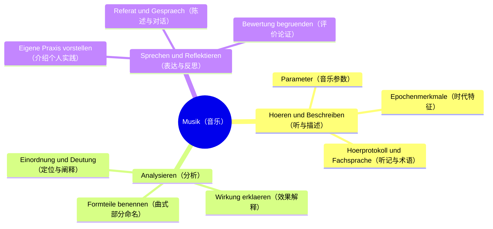
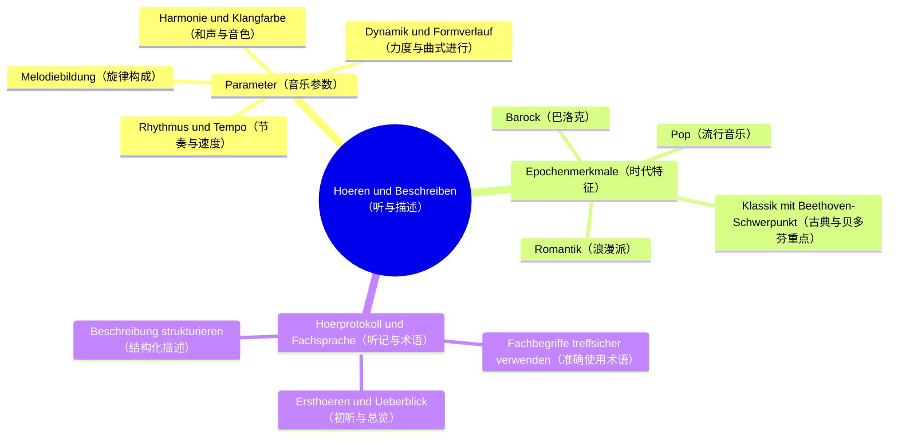
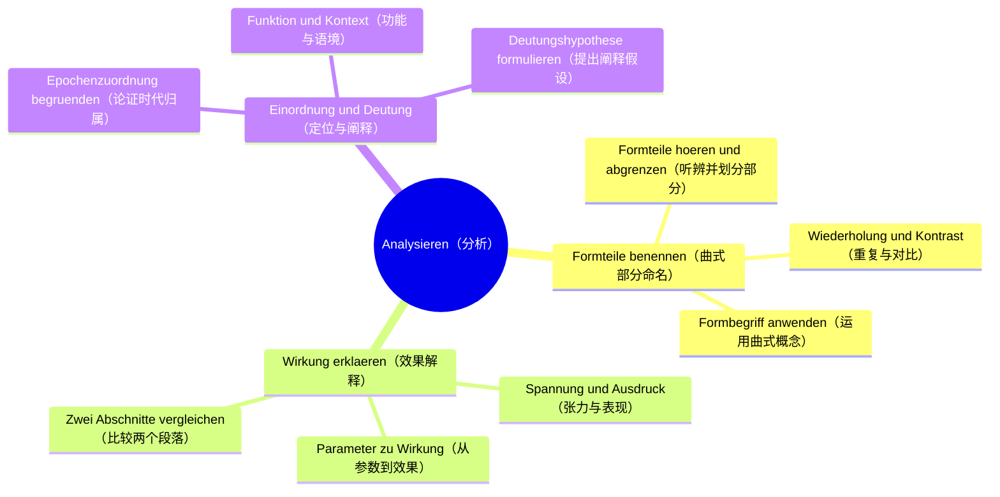
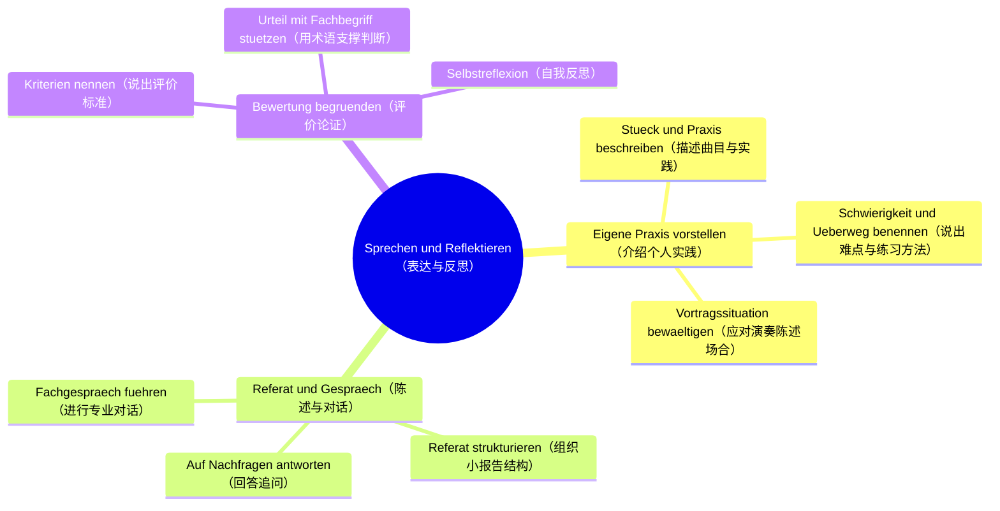

# Lernbaum Musik（音乐学习树 · EF 口试）

> 中文：本树自顶向下推导（L0 学科 → L1 内容领域 → L2 重点 → L3 细分主题），只做设计，不挂 vault 笔记链接，不写代码。
> Deutsch: Dieser Lernbaum leitet top-down ab (L0 Fach → L1 Inhaltsfeld → L2 Schwerpunkt → L3 Feinthema). Reine Designphase: keine Vault-Links, kein Code.

## L0 学科根（Fachwurzel）

- 中文一句话：口试看三件事——听得出参数、说得出分析、讲得出自己的音乐判断；术语要准，结构先行。
- Deutsch (KLP-Bezug + Prüfungs-Fokus): NRW KLP GOSt Musik, EF mündlich. Prüfungs-Fokus: Hörbeispiel beschreiben, mit Fachbegriffen analysieren, im Vortrag und Gespräch reflektiert urteilen.
- L1 与 `09_Musik-mündl/Lehrplan.md` §1 一一对应（无自创、无合并）：Hören & Beschreiben / Analysieren / Sprechen & Reflektieren.
- 口试流程（Prüfungs-Ablauf）：Hörbeispiel → Beschreibung → Analysefrage → Vortrag / Gespräch.
- 口头表达板块（Sprech-Baustein）：`Ich höre … (Parameter). Das wirkt … weil … (Fachbegriff).`

## ⏳ 待确认（markiert, regulär weiter entfaltet）

- ⏳ 待确认：Halbjahr-Thema（Epoche / Werk）——目前可能是 Beethoven / Klassik，未经证实，需向老师确认；下文 Klassik-Zweig按常规展开，不停摆。
- ⏳ 待确认：Hörbeispiele-Liste（具体听力例曲清单）。
- ⏳ 待确认：Prüfungstermin und Dauer（口试时间与时长）。

## 1. 总览 mindmap（L0 → L1 → L2）

## 2. 分 L1 mindmap（展开到 L3）

### L1-1 Hören & Beschreiben

### L1-2 Analysieren

### L1-3 Sprechen & Reflektieren

## 3. 节点明细（L3：中文 + Operatoren + Prüfungs-Anbindung + Leitfrage）

## L1-1 Hören & Beschreiben（听与描述）

### L2-1 Parameter des Klangs（音乐参数）

- **L3 Rhythmus und Tempo（节奏与速度）**
  - 中文一句话：先听出拍号、节奏型和速度变化，用德语说准。
  - Operatoren: [beschreiben, benennen]
  - Prüfungs-Anbindung: 口试第 1 环节 Hörbeispiel → Beschreibung；板块句 `Ich höre … (Rhythmus/Tempo).`
  - Leitfrage DE / ZH: `Welchen Rhythmus und welches Tempo höre ich? / 我听到了什么样的节奏和速度？`
- **L3 Melodiebildung（旋律构成）**
  - 中文一句话：抓住旋律走向、音程跳动和主题重复，能唱哼出轮廓并描述。
  - Operatoren: [beschreiben, darstellen]
  - Prüfungs-Anbindung: 口试第 1 环节 Beschreibung；主题辨认是后继分析的基础。
  - Leitfrage DE / ZH: `Wie verläuft die Melodie und was kehrt wieder? / 旋律如何进行、什么在重复？`
- **L3 Harmonie und Klangfarbe（和声与音色）**
  - 中文一句话：分辨大/小调色彩、和声疏密与乐器（人声）音色。
  - Operatoren: [beschreiben, unterscheiden]
  - Prüfungs-Anbindung: 口试第 1–2 环节过渡处；音色与和声常是时代判断线索。
  - Leitfrage DE / ZH: `Welche Harmonik und welche Klangfarbe prägen das Beispiel? / 是什么样的和声与音色主导了这段音乐？`
- **L3 Dynamik und Formverlauf（力度与曲式进行）**
  - 中文一句话：听出力度层次与全曲段落布局，为曲式命名做准备。
  - Operatoren: [beschreiben, gliedern]
  - Prüfungs-Anbindung: 口试 Beschreibung 收尾句，常引出 Analysefrage（Formteile）。
  - Leitfrage DE / ZH: `Wie sind Dynamik und Ablauf gegliedert? / 力度与段落是如何布局的？`

### L2-2 Epochenmerkmale unterscheiden（区分时代特征）

- **L3 Barockmerkmale（巴洛克特征）**
  - 中文一句话：用通奏低音、复调织体、对比鲜明的段落感识别巴洛克。
  - Operatoren: [beschreiben, zuordnen]
  - Prüfungs-Anbindung: Analysefrage 环节的时代定位备选项之一。
  - Leitfrage DE / ZH: `Woran erkenne ich Barock im Hörbeispiel? / 我从哪些特征听出巴洛克？`
- **L3 Klassik mit Beethoven-Schwerpunkt（古典风格与贝多芬重点）**
  - 中文一句话：按常规古典分支展开（清晰曲式、主调织体、动机发展），贝多芬只作重点假设。
  - Operatoren: [beschreiben, analysieren, einordnen]
  - Prüfungs-Anbindung: ⏳ Halbjahr-Thema 若确认为 Beethoven / Klassik，则为高频分析对象；常规流程 Hörbeispiel → Epoche → Form.
  - Leitfrage DE / ZH: `Was klingt klassisch und was deutet auf Beethoven? / 哪里听出古典风格、哪里指向贝多芬？`
- **L3 Romantikmerkmale（浪漫派特征）**
  - 中文一句话：用表情化旋律、半音和声、自由速度与大编制音响识别浪漫派。
  - Operatoren: [beschreiben, vergleichen]
  - Prüfungs-Anbindung: 常以"与古典对比"的方式出现在 Analysefrage 中。
  - Leitfrage DE / ZH: `Wodurch wirkt das Beispiel romantisch? / 这段音乐为什么听起来很浪漫派？`
- **L3 Popmerkmale（流行音乐特征）**
  - 中文一句话：用歌曲结构、 groove、制作音色与人声处理识别流行音乐。
  - Operatoren: [beschreiben, vergleichen]
  - Prüfungs-Anbindung: 作为对比 pole（古典 vs. Pop）进入 Gespräch 环节。
  - Leitfrage DE / ZH: `Was unterscheidet Pop klanglich von Klassik? / 流行音乐在声音上与古典有何不同？`

### L2-3 Hörprotokoll und Fachsprache（听记与专业表达）

- **L3 Ersthören und Überblick（初听与总览）**
  - 中文一句话：第一遍只抓整体印象与段落数，不纠结细节。
  - Operatoren: [beschreiben, zusammenfassen]
  - Prüfungs-Anbindung: 口试开场 1–2 分钟总述，决定整体结构分。
  - Leitfrage DE / ZH: `Was ist mein erster Gesamteindruck? / 我的第一整体印象是什么？`
- **L3 Fachbegriffe treffsicher verwenden（准确使用术语）**
  - 中文一句话：参数名称德语发音准确，不用日常词代替术语。
  - Operatoren: [benennen, definieren]
  - Prüfungs-Anbindung: 贯穿全场；术语错误在口试中直接扣分。
  - Leitfrage DE / ZH: `Nutze ich den Fachbegriff statt der Alltagssprache? / 我用的是术语而不是日常词吗？`
- **L3 Beschreibung strukturieren（结构化描述）**
  - 中文一句话：按"总览—分参数—小结"的固定顺序说，不跳跃。
  - Operatoren: [darstellen, gliedern]
  - Prüfungs-Anbindung: Beschreibung 环节的结构分；模板 `Ich höre … Das wirkt … weil …`.
  - Leitfrage DE / ZH: `Folgt meine Beschreibung einer klaren Reihenfolge? / 我的描述有清晰顺序吗？`

## L1-2 Analysieren（分析）

### L2-1 Formteile benennen（曲式部分命名）

- **L3 Formteile hören und abgrenzen（听辨并划分段落）**
  - 中文一句话：按重复、对比、终止式切分段落并命名。
  - Operatoren: [analysieren, gliedern]
  - Prüfungs-Anbindung: 典型 Analysefrage（"Gliedern Sie das Beispiel"）。
  - Leitfrage DE / ZH: `Wo beginnt ein neuer Formteil und woran höre ich das? / 新段落从哪里开始、我怎么听出来的？`
- **L3 Wiederholung und Kontrast（重复与对比）**
  - 中文一句话：指出哪里是重复、哪里是对比，这是曲式论证的核心证据。
  - Operatoren: [analysieren, vergleichen]
  - Prüfungs-Anbindung: Analysefrage 的追问层（"Belegen Sie am Beispiel"）。
  - Leitfrage DE / ZH: `Was kehrt wieder und was setzt Kontrast? / 什么在重复、什么形成对比？`
- **L3 Formbegriff anwenden（运用曲式概念）**
  - 中文一句话：把听到的段落装进合适的曲式概念，不硬套。
  - Operatoren: [einordnen, begründen]
  - Prüfungs-Anbindung: 分析结论句，常决定该大题是否拿满。
  - Leitfrage DE / ZH: `Welcher Formbegriff passt und warum? / 哪个曲式概念合适、为什么？`

### L2-2 Wirkung erklären（解释效果）

- **L3 Parameter zu Wirkung（从参数到效果）**
  - 中文一句话：每个效果判断都绑定一个参数证据，句式固定为 Das wirkt … weil …。
  - Operatoren: [erklären, begründen]
  - Prüfungs-Anbindung: Analysefrage 核心句型；板块句后半段。
  - Leitfrage DE / ZH: `Welche Wirkung hat der Parameter und warum? / 这个参数产生了什么效果、为什么？`
- **L3 Spannung und Ausdruck（张力与表现）**
  - 中文一句话：描述张力起伏与表情变化，不只说"好听/强烈"。
  - Operatoren: [beschreiben, deuten]
  - Prüfungs-Anbindung: Gespräch 环节的深化追问（"Beschreiben Sie die Ausdruckskurve"）。
  - Leitfrage DE / ZH: `Wie baut sich Spannung auf und ab? / 张力如何起伏？`
- **L3 Zwei Abschnitte vergleichen（比较两个段落）**
  - 中文一句话：用同一组参数对比两段，差异即论点。
  - Operatoren: [vergleichen, analysieren]
  - Prüfungs-Anbindung: 常见对比型 Analysefrage（A-Teil vs. B-Teil）。
  - Leitfrage DE / ZH: `Worin unterscheiden sich die Abschnitte klanglich? / 两个段落在声音上有何不同？`

### L2-3 Einordnung und Deutung（定位与阐释）

- **L3 Epochenzuordnung begründen（论证时代归属）**
  - 中文一句话：给出时代判断 plus 至少两个声音证据。
  - Operatoren: [zuordnen, begründen]
  - Prüfungs-Anbindung: 分析收尾的定位题（"Ordnen Sie stilistisch ein"）。
  - Leitfrage DE / ZH: `Für welche Epoche sprechen die Merkmale? / 这些特征指向哪个时代？`
- **L3 Funktion und Kontext（功能与语境）**
  - 中文一句话：说出音乐的可能场合与功能，不编造作曲家生平细节。
  - Operatoren: [einordnen, erläutern]
  - Prüfungs-Anbindung: Gespräch 环节的语境追问。
  - Leitfrage DE / ZH: `In welchem Kontext könnte diese Musik stehen? / 这段音乐可能处于什么语境？`
- **L3 Deutungshypothese formulieren（提出阐释假设）**
  - 中文一句话：用"可能表达…"句式提出可验证的理解，不说绝对话。
  - Operatoren: [deuten, beurteilen]
  - Prüfungs-Anbindung: Vortrag / Gespräch 的开放收尾，展示反思能力。
  - Leitfrage DE / ZH: `Welche Deutung lässt das Gehörte zu? / 听到的内容允许哪种理解？`

## L1-3 Sprechen & Reflektieren（表达与反思）

### L2-1 Eigene Praxis vorstellen（介绍个人实践）

- **L3 Stück und Praxis beschreiben（描述曲目与实践）**
  - 中文一句话：说清自己演奏/演唱的曲目要点与声部角色。
  - Operatoren: [darstellen, beschreiben]
  - Prüfungs-Anbindung: Vortrag 开场（eigene Praxis），建立可信度。
  - Leitfrage DE / ZH: `Was spiele/singe ich und was ist daran typisch? / 我演奏/演唱什么、其典型之处是什么？`
- **L3 Schwierigkeit und Übeweg benennen（说出难点与练习方法）**
  - 中文一句话：点名一处具体难点与自己的解决步骤。
  - Operatoren: [erläutern, reflektieren]
  - Prüfungs-Anbindung: Vortrag 中段，考查自我观察与方法意识。
  - Leitfrage DE / ZH: `Wo lag die Schwierigkeit und wie habe ich geübt? / 难点在哪里、我如何练习？`
- **L3 Vortragssituation bewältigen（应对陈述场合）**
  - 中文一句话：控制时长与语速，术语清晰，留出问答时间。
  - Operatoren: [präsentieren, darstellen]
  - Prüfungs-Anbindung: Vortrag 的形式分（Zeit + Struktur + Sprache）。
  - Leitfrage DE / ZH: `Bleibe ich in der Zeit und bleibe ich verständlich? / 我守时且表达清楚吗？`

### L2-2 Referat und Gespräch（小报告与对话）

- **L3 Referat strukturieren（组织小报告结构）**
  - 中文一句话：按"主题—分析—判断"三段组织小报告。
  - Operatoren: [darstellen, gliedern]
  - Prüfungs-Anbindung: Vortrag / Referat 环节的结构分。
  - Leitfrage DE / ZH: `Hat mein Referat These, Beleg und Fazit? / 我的报告有论点、论据和结论吗？`
- **L3 Auf Nachfragen antworten（回答追问）**
  - 中文一句话：先复述问题再回答，不确定就说清边界。
  - Operatoren: [erläutern, begründen]
  - Prüfungs-Anbindung: Gespräch 环节（Nachfragen der Prüfung）。
  - Leitfrage DE / ZH: `Beantworte ich die Nachfrage präzise? / 我精确回答了追问吗？`
- **L3 Fachgespräch führen（进行专业对话）**
  - 中文一句话：在对话中主动使用术语回扣听例，保持话题不跑偏。
  - Operatoren: [erörtern, begründen]
  - Prüfungs-Anbindung: Gespräch 整体印象分（Fachlichkeit + Kohärenz）。
  - Leitfrage DE / ZH: `Bleibe ich fachlich und beim Beispiel? / 我始终专业且紧扣例曲吗？`

### L2-3 Bewertung begründen（评价论证）

- **L3 Kriterien nennen（说出评价标准）**
  - 中文一句话：先亮标准（音准、节奏、表现、曲式理解），再下判断。
  - Operatoren: [benennen, definieren]
  - Prüfungs-Anbindung: Urteils-Aufgabe（"Bewerten Sie…"）的开头。
  - Leitfrage DE / ZH: `Nach welchen Kriterien urteile ich? / 我按什么标准评价？`
- **L3 Urteil mit Fachbegriff stützen（用术语支撑判断）**
  - 中文一句话：每个"好/不好"后面跟一个术语证据。
  - Operatoren: [beurteilen, begründen]
  - Prüfungs-Anbindung: Urteils-Aufgabe 的论证核心；板块句 `Das wirkt … weil …`。
  - Leitfrage DE / ZH: `Womit belege ich mein Urteil fachlich? / 我用什么专业证据支撑判断？`
- **L3 Selbstreflexion（自我反思）**
  - 中文一句话：说出自己本次口试哪里强、哪里下次改进。
  - Operatoren: [reflektieren, bewerten]
  - Prüfungs-Anbindung: Gespräch 收尾常问（"Schätzen Sie sich selbst ein"）。
  - Leitfrage DE / ZH: `Was war stark und was verbessere ich? / 哪里强、下次改哪里？`
