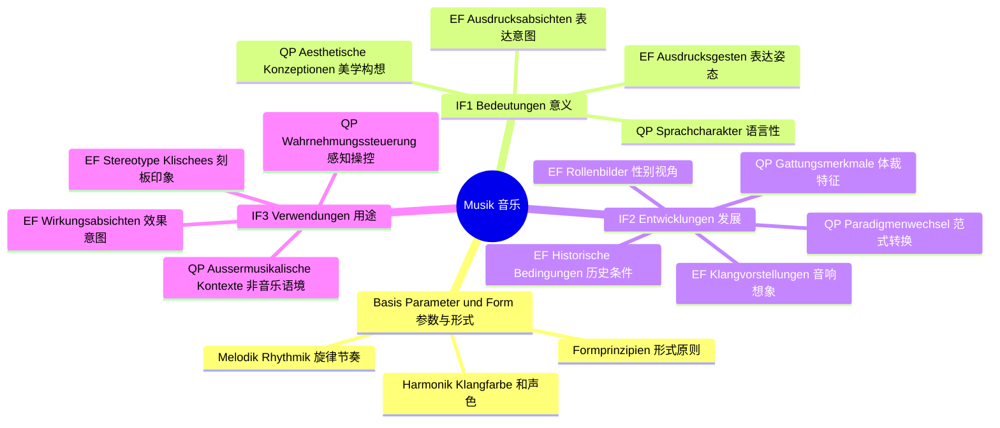
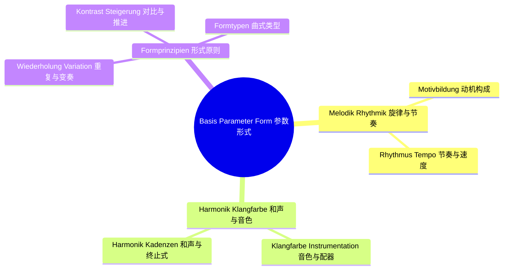
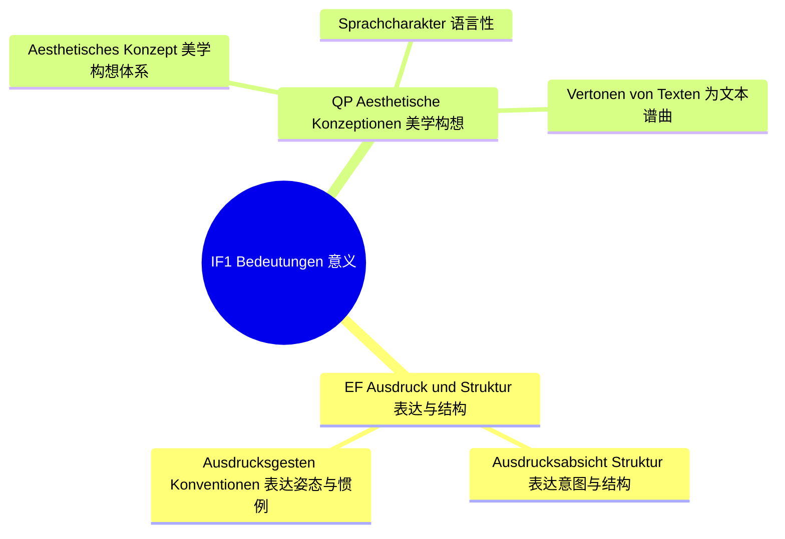
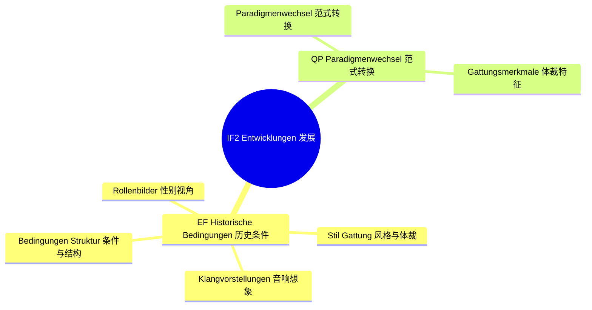
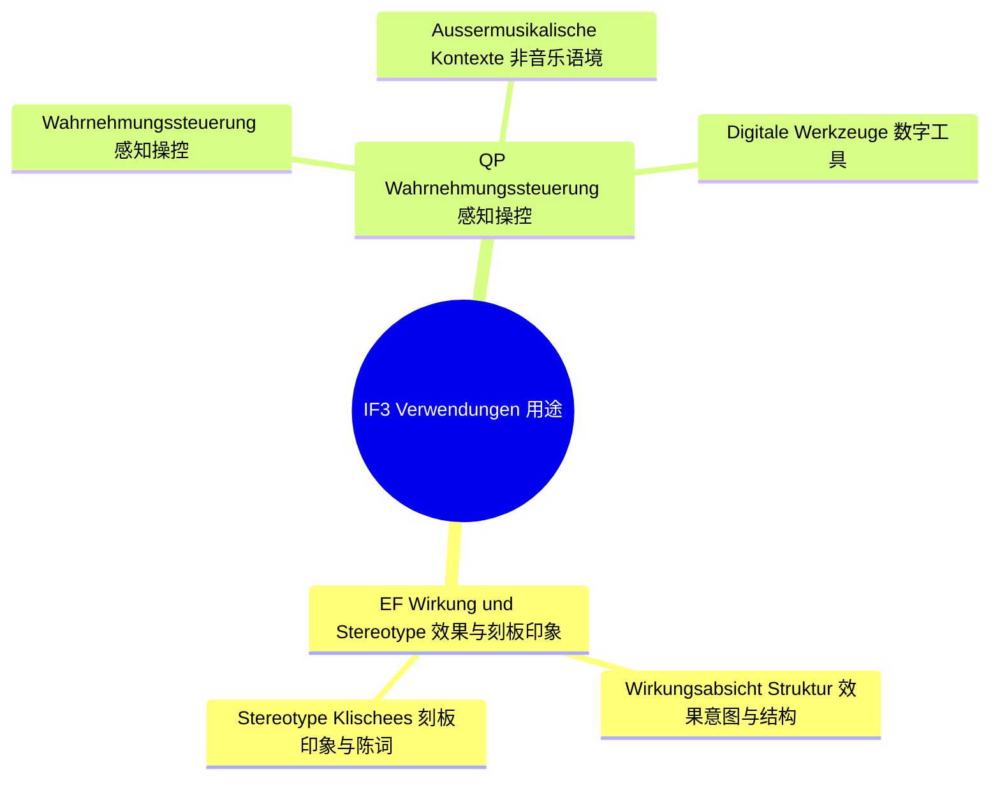

# Lernbaum Musik（音乐学习树 · EF→Abitur）

> 中文一句话：音乐考的不是「知道多少作品」，而是**听得出参数 → 说得出分析 → 讲得出自己的音乐判断**；三个 IF（意义 / 发展 / 用途）是三种**观察音乐的角度**，EF 与 QP 共用，差别只在深度与自主度。
> KLP-Basis: NRW KLP Musik 2013（Heft 4702，`klp_gost_musik.pdf`）· Klausur-Fokus: 笔试 Aufgabenart **I（分析与诠释）/ II（学科视角讨论）/ III（创作+书面说明）**；口试 Teil 1 以笔试 Aufgabenart 为取向；Abitur GK 240 min / LK 300 min（选 Gestaltungsaufgabe +60）。
> ⚠️ **结构特殊性**：Musik 的 3 个 IF 是**视角型**（意义 / 发展 / 用途），**不是知识区块型**，且 **EF 与 QP 完全共用同一套 IF 名称**。因此本树**不设「学段—IF 归属表」**，改用「**IF 恒定的 EF→QP 升级逻辑**」。[已验证]
> ⚠️ **本项目为口试（mündlich）方向**，且 **Halbjahr-Thema 未确定** → 相关处标 `⏳ 待确认：` 但继续按 KLP 常规展开。

---

## 0. Methoden-Profil（方法论画像 —— 本设计第二核心）

### ① Abitur 能力权重（AFB 分布）

| AFB | 层级 | 本课权重 | 说明 |
|---|---|---|---|
| I | Reproduktion | ≈20% | 指认参数、描述听感、复述结构（`benennen`, `beschreiben`, `wiedergeben`） |
| II | Reorganisation und Transfer | ≈45% | **主战场**：结构分析、归类、阐释（`analysieren`, `erlaeutern`, `herausarbeiten`, `einordnen`） |
| III | Reflexion und Problemlösung | ≈35% | 评判、论证、比较（`begruenden`, `bewerten`, `eroertern`, `interpretieren`, `Stellung nehmen`, `vergleichen`） |

> ⚠️ **本课 `vergleichen` 是 AFB III**（其他科多为 II）——因为比较必须建立在对两部作品**各自考察结果**之上。[已验证]
> ⚠️ 口试题目**须覆盖全部三个 AFB**，且**不得只限于单一 Kurshalbjahr 的课堂内容**（KLP §4 明文）。[已验证]

### ② 黄金学习法（证据来自 `00_META/Lernmethoden-Evidenz.md`）

| 方法 | 证据来源 | 本课应用方式 |
|---|---|---|
| 多模态学习（CTML） | Mayer CTML · Cromley 2025（g≈0.37） | **听觉 + 乐谱 + 语言**三通道并用；一图只讲一个音乐概念（如只讲奏鸣曲式的呈示部） |
| 检索练习（合书默听） | Dunlosky 2013「hoch」· Karpicke & Blunt 2011 | 听完一段后**合上笔记口述参数与结构**，再开笔记对照 |
| 交错练习 + 对比辨别 | Rohrer & Taylor 2007（d≈1.34）· Foster 2019 | **跨时代对比**（巴洛克 vs 古典 vs 浪漫）比单曲精听更能建立风格辨识力 |
| 先行组织者 | Ausubel | 新作品前先给「该时代的音响想象/体裁特征」框架，再听 |
| 精细提问 | Dunlosky 2013「mittel」 | 每段音乐问三连：「听到什么参数？它造成什么效果？依据哪个术语？」 |
| 反馈分层 | Brummer 2024 · Kandemir | 口述完整分析后统一对照 Erwartungshorizont |

### ③ 三大典型失分点

1. **术语与听感脱节** —— 只说「很好听/很激烈」而不落到参数（Rhythmik / Harmonik / Klangfarbe / Dynamik）。口试评分上位标准明确含「专业语言与方法的把握」。
2. **分析结果不做诠释** —— Aufgabenart I 要求「分析结果是诠释与评判的基础」，只描述结构不导向诠释 = 只做了半个任务。
3. **`vergleichen` 未建立各自考察结果** —— 本课比较是 AFB III，必须先分别分析两部作品再比较，不能并列罗列印象。

### ④ 本课笔记结构模板（口试导向，六段）

```
1. Hörprotokoll（听记：参数与第一印象，只写听到什么）
2. Strukturanalyse（结构分析：Formteile + 参数逐项，Hör- und Notentextanalyse 双轨）
3. Fachbegriffe（术语标注，德语原文）
4. Deutung / Interpretation（诠释：结构 → 效果 → 意义）
5. Einordnung（归类：时代 / 体裁 / 范式）
6. Eigenes Urteil + Kriterium（自己的判断 + 明示所用标准）
```

### ⑤ 共享基础层（**跨 IF 的分析语言，不是第 4 个 IF**）

> ⚠️ KLP 明确写明「**wahrnehmbare, beschreibbare und gestaltbare Strukturen von Musik**」是三个 IF 的 **integraler Bestandteil**，其底层是**参数秩序系统 + 形式原则**。**这是三个 IF 共同的分析语言，不归属单一 IF**。[已验证]

| 参数秩序系统 | 中文 | 形式原则 |
|---|---|---|
| `Melodik` | 旋律 | `Wiederholung`（重复） |
| `Rhythmik` | 节奏 | `Variation`（变奏） |
| `Harmonik` | 和声 | `Kontrast`（对比） |
| `Dynamik` | 力度 | `Steigerung`（推进） |
| `Klangfarbe` | 音色 | `Formtypen`（曲式类型） |

> 📌 **这是本树最重要的「复用底座」**：现有 2 篇笔记（Beethoven-Motiv、Lernreise Höranalyse）已服务此层，可继续作为跨 IF 公共底座。

---

## 1. 总览 Gesamtübersicht（L0→L1→L2）


```mermaid
mindmap
  root((Musik 音乐))
    Basis Parameter und Form 参数与形式
      Melodik Rhythmik 旋律节奏
      Harmonik Klangfarbe 和声色
      Formprinzipien 形式原则
    IF1 Bedeutungen 意义
      EF Ausdrucksabsichten 表达意图
      EF Ausdrucksgesten 表达姿态
      QP Aesthetische Konzeptionen 美学构想
      QP Sprachcharakter 语言性
    IF2 Entwicklungen 发展
      EF Historische Bedingungen 历史条件
      EF Klangvorstellungen 音响想象
      EF Rollenbilder 性别视角
      QP Paradigmenwechsel 范式转换
      QP Gattungsmerkmale 体裁特征
    IF3 Verwendungen 用途
      EF Wirkungsabsichten 效果意图
      EF Stereotype Klischees 刻板印象
      QP Wahrnehmungssteuerung 感知操控
      QP Aussermusikalische Kontexte 非音乐语境
```

---

## 2. 分 IF 展开（L1→L2→L3 + 应试四行）

### L0 共享基础层：Parameter und Form（参数与形式）

> 跨 IF 底座。所有三个 IF 的分析都从这里出发。


```mermaid
mindmap
  root((Basis Parameter Form 参数形式))
    Melodik Rhythmik 旋律与节奏
      Motivbildung 动机构成
      Rhythmus Tempo 节奏与速度
    Harmonik Klangfarbe 和声与音色
      Klangfarbe Instrumentation 音色与配器
      Harmonik Kadenzen 和声与终止式
    Formprinzipien 形式原则
      Wiederholung Variation 重复与变奏
      Kontrast Steigerung 对比与推进
      Formtypen 曲式类型
```

- **Motivbildung（动机构成）** `[EF]`
  - 中文一句话：动机是最小的音乐「思想单元」，靠三要素（音程/节奏/轮廓）识别与追踪。
  - Klausur-Anbindung：笔试 I 分析基础；口试 Teil 1 听辨开场；`Motiv benennen und seine Verarbeitung beschreiben`（AFB I→II）。
  - Operatoren：`benennen`, `beschreiben`, `herausarbeiten`
  - Lernweg ZH：把动机三要素做成检查表，听完即填（检索练习）。
  - Fehlerquelle：只说「这个动机出现了」而不说它被如何加工（Verarbeitung）。
  - 📓 笔记：✅ [`Beethoven-Motiv-Hoeren.md`](../../../09_Musik-mündl/Texte-Analyse/Beethoven-Motiv-Hoeren.md)
- **Rhythmus und Tempo（节奏与速度）** `[EF]`
  - 中文一句话：节奏型与速度共同决定音乐的推进感与性格。
  - Klausur-Anbindung：参数描述题；`Rhythmus und Tempo beschreiben`（AFB I）。
  - Operatoren：`beschreiben`, `benennen`, `erlaeutern`
  - Lernweg ZH：用「点—线—面」比喻区分节奏型（点）与节拍脉动（面）。
  - Fehlerquelle：把 Tempo（速度）与 Rhythmus（节奏型）混同。
  - 📓 笔记：🟡 [`Musik-Hoeranalyse-L1.md`](../../../Lernreise/Musik-Hoeranalyse-L1.md)
- **Harmonik und Kadenzen（和声与终止式）** `[EF]`
  - 中文一句话：和声进行与终止式标记乐句边界，是听辨结构与调性的钥匙。
  - Klausur-Anbindung：结构分析题；`Kadenzen identifizieren und Funktion erlaeutern`（AFB II）。
  - Operatoren：`benennen`, `analysieren`, `erlaeutern`
  - Lernweg ZH：先练「听终止式判句读」，再连到曲式划分。
  - Fehlerquelle：不会用终止式判句读，导致曲式划分错误。
  - 📓 笔记：🟡 [`Musik-Halbjahr-IF1-IF2.md`](../../../09_Musik-mündl/Texte-Analyse/Musik-Halbjahr-IF1-IF2.md)
- **Klangfarbe und Instrumentation（音色与配器）** `[EF]`
  - 中文一句话：音色是最直接的效果手段，配器变化常标记结构转折。
  - Klausur-Anbindung：参数 + 效果题；`Klangfarbe beschreiben und Wirkung erlaeutern`（AFB II）。
  - Operatoren：`beschreiben`, `erlaeutern`, `herausarbeiten`
  - Lernweg ZH：做「音色 → 联想效果」对照表，注意这是惯例而非绝对。
  - Fehlerquelle：把音色的效果说成「客观事实」而非「惯例联想」。
  - 📓 笔记：⚠️ 缺口
- **Formprinzipien: Wiederholung, Variation, Kontrast, Steigerung（形式原则）** `[EF]`
  - 中文一句话：重复、变奏、对比、推进——四种手法解释了几乎所有曲式。
  - Klausur-Anbindung：曲式分析题；`Formprinzipien nachweisen`（AFB II）。
  - Operatoren：`analysieren`, `herausarbeiten`, `erlaeutern`
  - Lernweg ZH：先掌握四种原则，再看具体曲式（如奏鸣曲式）如何组合它们。
  - Fehlerquelle：只会背曲式名称，不会指出其中用了哪些原则。
  - 📓 笔记：✅ [`Musik-Halbjahr-IF1-IF2.md`](../../../09_Musik-mündl/Texte-Analyse/Musik-Halbjahr-IF1-IF2.md)
- **Formtypen（曲式类型）** `[EF]`
  - 中文一句话：奏鸣曲式、回旋曲式、变奏曲式等是历史形成的结构范式。
  - Klausur-Anbindung：核心分析题；`Formverlauf analysieren und Formtyp bestimmen`（AFB II）。
  - Operatoren：`analysieren`, `benennen`, `begruenden`
  - Lernweg ZH：**奏鸣曲式**（呈示—展开—再现）作为最高频锚点，做「听辨 + 画图」双练。
  - Fehlerquelle：把奏鸣曲式（Sonatenhauptsatzform）与奏鸣曲（Sonate）混同。
  - 📓 笔记：✅ [`Musik-Halbjahr-IF1-IF2.md`](../../../09_Musik-mündl/Texte-Analyse/Musik-Halbjahr-IF1-IF2.md)

---

### L1: IF1 Bedeutungen von Musik（音乐的意义）

> 核心视角：把音乐理解为**符号/语言系统**（semantisch + semiotisch）；主观听感 ⇄ 客观结构之间往返校验。
> **EF → QP 升级**：`Ausdrucksabsichten / Ausdrucksgesten` → `Ästhetische Konzeptionen / Sprachcharakter`


```mermaid
mindmap
  root((IF1 Bedeutungen 意义))
    EF Ausdruck und Struktur 表达与结构
      Ausdrucksabsicht Struktur 表达意图与结构
      Ausdrucksgesten Konventionen 表达姿态与惯例
    QP Aesthetische Konzeptionen 美学构想
      Aesthetisches Konzept 美学构想体系
      Sprachcharakter 语言性
      Vertonen von Texten 为文本谱曲
```

#### L2 EF: Ausdrucksabsichten und musikalische Strukturen（表达意图与音乐结构）

- **Zusammenhänge zwischen Ausdrucksabsichten und Strukturen（表达意图与结构的关联）** `[EF]`
  - 中文一句话：作曲家用哪些结构手段（和声/力度/音色）制造某种表达意图？这是 IF1 的核心问题。
  - Klausur-Anbindung：笔试 I 核心题；口试 Teil 1；`Zusammenhang von Ausdruck und Struktur erlaeutern`（AFB II）。
  - Operatoren：`analysieren`, `erlaeutern`, `herausarbeiten`, `interpretieren`
  - Lernweg ZH：做「结构手段 → 表达效果」双向对照表，用具体乐段验证。
  - Fehlerquelle：把「表达效果」说成音乐固有属性，忽略它是**惯例性联想**。
  - 📓 笔记：🟡 [`Musik-Halbjahr-IF1-IF2.md`](../../../09_Musik-mündl/Texte-Analyse/Musik-Halbjahr-IF1-IF2.md)（部分）
- **Ausdrucksgesten vor dem Hintergrund musikalischer Konventionen（惯例背景下的表达姿态）** `[EF]`
  - 中文一句话：某个「叹息动机」「号角音型」之所以有意味，是因为它站在一套音乐惯例之上。
  - Klausur-Anbindung：分析 + 归类题；`Ausdrucksgeste identifizieren und Konvention benennen`（AFB II）。
  - Operatoren：`benennen`, `einordnen`, `erlaeutern`
  - Lernweg ZH：建立「惯例词库」（巴洛克修辞格、Cantus firmus 传统等），听完即归类。
  - Fehlerquelle：⚠️ **现有笔记缺此惯例知识系统** —— 只凭直觉说「悲伤」而不指认惯例。
  - 📓 笔记：⚠️ 缺口（🔴 IF1 惯例知识系统缺失）

#### L2 QP: Ästhetische Konzeptionen und Sprachcharakter（美学构想与语言性）

- **Ästhetische Konzeptionen von Musik（音乐的美学构想）** `[QP]`
  - 中文一句话：作品背后有一整套关于「音乐应当是什么」的构想，比单个表达意图更系统。
  - Klausur-Anbindung：笔试 I / II；`Ästhetische Konzeption eines Werkes herausarbeiten`（AFB II→III）。
  - Operatoren：`herausarbeiten`, `erlaeutern`, `interpretieren`, `beurteilen`
  - Lernweg ZH：把「表达意图」（EF 层）升级为「美学构想」（QP 层）——先列出该作品的美学主张，再找结构证据。
  - Fehlerquelle：⚠️ **QP 层缺位**（现有笔记全为 EF 层）。
  - 📓 笔记：⚠️ 缺口（🟡 IF1 QP 层缺位）
- **Sprachcharakter von Musik（音乐的语言性）** `[QP]`
  - 中文一句话：音乐是否像语言一样「说话」？符号学与语义学视角下的音乐意义问题。
  - Klausur-Anbindung：讨论题（Aufgabenart II）；`Sprachcharakter eroertern`（AFB III）。
  - Operatoren：`analysieren`, `eroertern`, `beurteilen`, `interpretieren`
  - Lernweg ZH：连到「音乐能表达什么、不能表达什么」这个经典争论。
  - Fehlerquelle：把「音乐像语言」当成既定事实而不加论证。
  - 📓 笔记：⚠️ 缺口
- **Vertonen von Texten（为文本谱曲）** `[QP]` · **PRODUKTION 专属**
  - 中文一句话：把文本变成音乐，是 QP 独有的创作能力条目。
  - Klausur-Anbindung：笔试 III（Gestaltung + 书面说明）；口试 Teil 1 可能采用；`Vertonung entwerfen und begruenden`（AFB II→III）。
  - Operatoren：`entwerfen`, `entwickeln`, `komponieren`, `begruenden`
  - Lernweg ZH：先做「文本情绪 → 音乐参数」映射，再动手写片段（可图解记谱）。
  - Fehlerquelle：只创作不说明（Aufgabenart III 要求**论证**作曲决策）。
  - 📓 笔记：⚠️ 缺口（QP 专属）

---

### L1: IF2 Entwicklungen von Musik（音乐的发展）

> 核心视角：从**历史视角**看音乐，嵌入文化/社会-政治发展；关注风格特征、体裁、音响想象、作曲技法。
> **EF → QP 升级**：`historisch-gesellschaftliche Bedingungen` → `Paradigmenwechsel`


```mermaid
mindmap
  root((IF2 Entwicklungen 发展))
    EF Historische Bedingungen 历史条件
      Bedingungen Struktur 条件与结构
      Klangvorstellungen 音响想象
      Stil Gattung 风格与体裁
      Rollenbilder 性别视角
    QP Paradigmenwechsel 范式转换
      Paradigmenwechsel 范式转换
      Gattungsmerkmale 体裁特征
```

#### L2 EF: Historisch-gesellschaftliche Bedingungen（历史-社会条件）

- **Zusammenhänge zwischen Bedingungen und Strukturen（条件与结构的关联）** `[EF]`
  - 中文一句话：音乐结构不是凭空出现，它回应着时代的社会与政治条件。
  - Klausur-Anbindung：笔试 I / II；`Historische Bedingungen mit Strukturen verknüpfen`（AFB II）。
  - Operatoren：`analysieren`, `einordnen`, `erlaeutern`
  - Lernweg ZH：用「时代问题 → 音乐回应」的因果链做笔记，而非并列罗列。
  - Fehlerquelle：把时代背景当「装饰性介绍」而非结构分析的依据。
  - 📓 笔记：🟡 [`Musik-Halbjahr-IF1-IF2.md`](../../../09_Musik-mündl/Texte-Analyse/Musik-Halbjahr-IF1-IF2.md)
- **Klangvorstellungen im Zusammenhang mit Stil- und Gattungsmerkmalen（音响想象与风格体裁特征）** `[EF]`
  - 中文一句话：每个时代有自己「想象中应该是什么声音」的偏好，这塑造了风格与体裁。
  - Klausur-Anbindung：对比题；`Klangvorstellungen verschiedener Epochen vergleichen`（AFB II→III）。
  - Operatoren：`vergleichen`, `einordnen`, `erlaeutern`
  - Lernweg ZH：⚠️ **须建立跨时代对比锚点**（巴洛克 vs 古典 vs 浪漫 vs 20 世纪），单一贝多芬锚点不够。
  - Fehlerquelle：⚠️ **EF 层「对比锚点」不足**（现有笔记以贝多芬第五为单一锚点）。
  - 📓 笔记：⚠️ 缺口（🟡 缺巴洛克/浪漫/20 世纪对比锚点）
- **Rollenbilder von Frauen und Männern（性别视角）** `[EF]` · **EF 特有**
  - 中文一句话：音乐也传递社会角色图景——EF 的 REFLEXION 明确要求考虑这一维度。
  - Klausur-Anbindung：评价题；`Rollenbilder in der Musik reflektieren`（AFB III）。
  - Operatoren：`analysieren`, `beurteilen`, `Stellung nehmen`
  - Lernweg ZH：连到「音乐如何塑造/反映性别角色」的社会史视角。
  - Fehlerquelle：⚠️ **EF 特有条款，QP 未见同款表述** —— 易被忽略。
  - 📓 笔记：⚠️ 缺口

#### L2 QP: Paradigmenwechsel und Gattungsmerkmale（范式转换与体裁特征）

- **Paradigmenwechsel im Umgang mit Musik（音乐处理方式的范式转换）** `[QP]`
  - 中文一句话：音乐史上发生过几次根本性的「做法转换」，而不只是风格渐变。
  - Klausur-Anbindung：核心讨论题；`Einen Paradigmenwechsel analysieren und begruenden`（AFB II→III）。
  - Operatoren：`analysieren`, `begruenden`, `eroertern`, `beurteilen`
  - Lernweg ZH：**方法论训练**——如何论证「这是一次范式转换」而非「一次风格演变」？需要给出判据。
  - Fehlerquelle：⚠️ **QP 核心概念，现完全空白** —— 只会描述风格变化，不会论证范式转换。
  - 📓 笔记：⚠️ 缺口（🔴 IF2 最高优先）
- **Gattungsspezifische Merkmale im historisch-gesellschaftlichen Kontext（历史社会语境中的体裁特征）** `[QP]`
  - 中文一句话：体裁（交响曲/歌剧/艺术歌曲…）的特征与其社会功能历史地绑定。
  - Klausur-Anbindung：分析 + 归类题；`Gattungsmerkmale im Kontext erlaeutern`（AFB II）。
  - Operatoren：`erlaeutern`, `einordnen`, `analysieren`
  - Lernweg ZH：做「体裁 × 特征 × 社会功能」三栏表。
  - Fehlerquelle：只记体裁特征不联系社会语境。
  - 📓 笔记：⚠️ 缺口

---

### L1: IF3 Verwendungen von Musik（音乐的用途）

> 核心视角：从**功能视角**看音乐在各种使用语境中的作用（电影、广告、仪式、政治等）。
> **EF → QP 升级**：`Wirkungsabsichten / Stereotype und Klischees` → `Wahrnehmungssteuerung / außermusikalische Kontexte`
> 🔴 **本 IF 完全空白** —— 而口试题目不得只限单一学期内容，故 3 个 IF 均可能被考。


```mermaid
mindmap
  root((IF3 Verwendungen 用途))
    EF Wirkung und Stereotype 效果与刻板印象
      Wirkungsabsicht Struktur 效果意图与结构
      Stereotype Klischees 刻板印象与陈词
    QP Wahrnehmungssteuerung 感知操控
      Wahrnehmungssteuerung 感知操控
      Aussermusikalische Kontexte 非音乐语境
      Digitale Werkzeuge 数字工具
```

#### L2 EF: Wirkungsabsichten und Stereotype（效果意图与刻板印象）

- **Zusammenhänge zwischen Wirkungsabsichten und Strukturen（效果意图与结构的关联）** `[EF]`
  - 中文一句话：广告、电影、仪式用音乐是为了「造成某种效果」，手段仍是音乐结构。
  - Klausur-Anbindung：笔试 I / II；口试 Teil 1；`Wirkungsabsicht identifizieren und Struktur zuordnen`（AFB II）。
  - Operatoren：`analysieren`, `erlaeutern`, `herausarbeiten`
  - Lernweg ZH：选一段电影配乐，做「想要什么效果 → 用了什么手段」逆向分析。
  - Fehlerquelle：⚠️ **整个 IF3 无笔记** —— 直接考试风险。
  - 📓 笔记：⚠️ 缺口（🔴 IF3 完全空白，最高优先）
- **Stereotype und Klischees in der Musikwahrnehmung（音乐感知中的刻板印象与陈词）** `[EF]`
  - 中文一句话：某些音乐套路（如「恐怖片音效」）之所以有效，是因为听众共享一套刻板印象。
  - Klausur-Anbindung：分析 + 评价题；`Stereotype benennen und ihre Wirkung beurteilen`（AFB II→III）。
  - Operatoren：`benennen`, `analysieren`, `beurteilen`
  - Lernweg ZH：建立「套路 → 引发的联想」清单（电影配乐 / 广告音乐 / 政治宣传 / 仪式音乐）。
  - Fehlerquelle：只识别套路不讨论它为何有效（依赖听众共享惯例）。
  - 📓 笔记：⚠️ 缺口

#### L2 QP: Wahrnehmungssteuerung und Kontexte（感知操控与语境）

- **Wahrnehmungssteuerung durch Musik（通过音乐进行的感知操控）** `[QP]`
  - 中文一句话：音乐可以引导观众「怎么感受」一个画面——这是配乐的核心机制。
  - Klausur-Anbindung：笔试 I / II；`Wahrnehmungssteuerung analysieren und beurteilen`（AFB II→III）。
  - Operatoren：`analysieren`, `erlaeutern`, `beurteilen`, `interpretieren`
  - Lernweg ZH：对比「同一画面 + 不同配乐」的效果差异（这是最有效的演示法）。
  - Fehlerquelle：⚠️ QP 层完全空白。
  - 📓 笔记：⚠️ 缺口
- **Musik in außermusikalischen Kontexten（非音乐语境中的音乐）** `[QP]`
  - 中文一句话：Programmmusik、媒体音乐、政治仪式音乐——音乐在「非音乐任务」中的角色。
  - Klausur-Anbindung：讨论题（Aufgabenart II）；`Musik in Kontexten eroertern`（AFB III）。
  - Operatoren：`analysieren`, `eroertern`, `einordnen`, `beurteilen`
  - Lernweg ZH：做「语境 → 功能 → 音乐手段」三栏表。
  - Fehlerquelle：把「非音乐语境」理解成「音乐不重要」。
  - 📓 笔记：⚠️ 缺口
- **Digitale Werkzeuge und Medien（数字工具与媒介）** `[QP]` · **PRODUKTION 专属**
  - 中文一句话：QP 要求能用数字工具制作，并用图解式与传统记谱呈现音响形态。
  - Klausur-Anbindung：笔试 III；`Gestaltung mit digitalen Werkzeugen und Notation`（AFB II→III）。
  - Operatoren：`entwerfen`, `komponieren`, `begruenden`, `erlaeutern`
  - Lernweg ZH：熟悉图解记谱法（这是口试/笔试 III 的呈现要求）。
  - Fehlerquelle：只创作不按要求记谱/说明。
  - 📓 笔记：⚠️ 缺口（QP 专属）

---

## 3. Abitur-Übergang（EF→QP 衔接台阶）

> ⚠️ Musik 的 IF **恒定不变**（EF 与 QP 共用同一套 3 个 IF）。因此本节的台阶不是「换 IF」，而是「**同一 IF 内的层级升级**」。

| # | 台阶 | 从（EF） | 到（QP） | 缺口 | 对策 |
|---|---|---|---|---|---|
| 1 | **IF1：表达意图 → 美学构想** | `Ausdrucksabsichten / Ausdrucksgesten` | `Ästhetische Konzeptionen / Sprachcharakter` | 从「单个表达」升级为「系统构想」 | 先列美学主张，再找结构证据 |
| 2 | **IF2：历史条件 → 范式转换** 🎯 | `historisch-gesellschaftliche Bedingungen` | `Paradigmenwechsel` | 从「描述背景」升级为「论证根本转变」 | 训练「范式转换的判据」（这是最高价值缺口） |
| 3 | **IF3：效果意图 → 感知操控** | `Wirkungsabsichten / Stereotype` | `Wahrnehmungssteuerung / außermusikalische Kontexte` | 从「识别套路」升级为「分析操控机制」 | 用「同画面+不同配乐」对比法 |
| 4 | **动词强度整体上移** | `beschreiben` | `beschreiben und vergleichen differenziert` | 同一任务要求更细、更自主 | 练习「differenziert」= 分层描述 |
| 5 | **评判标准自主化** 🎯 | 用给定标准 | **基于自主选择的标准**评判 | QP 要求 `auf der Grundlage selbstständig ausgewählter Kriterien` | 建立个人「标准词库」并练习明示 |
| 6 | **PRODUKTION 要求出现** | 无专门创作条目 | `Vertonen von Texten` + 数字工具 | EF 不要求创作，QP 要求 | 提前熟悉 Gestaltungskonzept 流程 |

### 口试专项台阶（**本项目重点**）

| 项 | 规定 | 应试含义 |
|---|---|---|
| Teil 1 | **独立、连贯的演讲**（zusammenhängender Vortrag） | 必须练「不用提问就能讲 5–8 分钟」 |
| Teil 2 | **Prüfungsgespräch** 涉及更大关联 | 准备「跨 IF / 跨学科」的接话能力 |
| 题目范围 | **不得只限单一 Kurshalbjahr** | ⚠️ **3 个 IF 均可能被考** → IF3 空白是直接风险 |
| 题目取向 | Teil 1 **以笔试 Aufgabenart I/II/III 为取向** | 按笔试三题型准备即可覆盖口试 |
| 时长 | 20–30 分钟 | 需练时间控制 |
| 选择权 | **考生无选择权** | 不能押题，必须全面覆盖 |

---

## 4. 笔记缺口清单（施工图）

> 依据 `00_META/INDEX.md` 与 `09_Musik-mündl/` 实际文件核对。
> ⚠️ **现状**：现有笔记仅 **3 篇**（含 1 篇互动课程），全部集中于 **IF1 + IF2 的 EF 层**；**IF3 完全空白；QP 层为零**。

| # | L3 节点 | 目标笔记文件 | 状态 |
|---|---|---|---|
| **共享基础层（跨 IF 底座）** | | | |
| 1 | Klangfarbe und Instrumentation | `09_Musik-mündl/Texte-Analyse/Klangfarbe-und-Instrumentation.md` | ⚠️ 缺口 |
| — | Motiv 三要素与加工 | [`Beethoven-Motiv-Hoeren.md`](../../../09_Musik-mündl/Texte-Analyse/Beethoven-Motiv-Hoeren.md) | ✅ 已有 |
| — | 奏鸣曲式与参数 | [`Musik-Halbjahr-IF1-IF2.md`](../../../09_Musik-mündl/Texte-Analyse/Musik-Halbjahr-IF1-IF2.md) | ✅ 已有 |
| — | 听辨训练（互动课程） | [`Musik-Hoeranalyse-L1.md`](../../../Lernreise/Musik-Hoeranalyse-L1.md) | ✅ 已有 |
| **IF1 Bedeutungen** | | | |
| 2 | Ausdrucksgesten / musikalische Konventionen | `09_Musik-mündl/Texte-Analyse/Ausdrucksgesten-und-Konventionen.md` | ⚠️ 缺口（🔴 惯例知识系统缺失） |
| 3 | [QP] Ästhetische Konzeptionen | `09_Musik-mündl/Texte-Analyse/Aesthetische-Konzeptionen.md` | ⚠️ 缺口（🟡 QP 层缺位） |
| 4 | [QP] Sprachcharakter von Musik | `09_Musik-mündl/Texte-Analyse/Sprachcharakter-von-Musik.md` | ⚠️ 缺口 |
| **IF2 Entwicklungen** | | | |
| 5 | Klangvorstellungen / 跨时代对比锚点 | `09_Musik-mündl/Texte-Analyse/Klangvorstellungen-Epochenvergleich.md` | ⚠️ 缺口（🟡 对比锚点不足） |
| 6 | Rollenbilder von Frauen und Männern | `09_Musik-mündl/Texte-Analyse/Rollenbilder-in-der-Musik.md` | ⚠️ 缺口（EF 特有条款） |
| 7 | [QP] Paradigmenwechsel | `09_Musik-mündl/Texte-Analyse/Paradigmenwechsel.md` | ⚠️ 缺口（🔴 QP 核心概念，最高优先） |
| 8 | [QP] Gattungsspezifische Merkmale | `09_Musik-mündl/Texte-Analyse/Gattungsmerkmale-im-Kontext.md` | ⚠️ 缺口 |
| **IF3 Verwendungen（完全空白）** | | | |
| 9 | Wirkungsabsichten / Stereotype | `09_Musik-mündl/Texte-Analyse/Wirkungsabsichten-und-Stereotype.md` | ⚠️ 缺口（🔴 IF3 最高优先） |
| 10 | Film- und Werbemusik（电影与广告音乐） | `09_Musik-mündl/Texte-Analyse/Film-und-Werbemusik.md` | ⚠️ 缺口（🔴 口试直接风险） |
| 11 | [QP] Wahrnehmungssteuerung | `09_Musik-mündl/Texte-Analyse/Wahrnehmungssteuerung.md` | ⚠️ 缺口 |
| 12 | [QP] Musik in außermusikalischen Kontexten | `09_Musik-mündl/Texte-Analyse/Musik-in-Kontexten.md` | ⚠️ 缺口 |
| **口试专项** | | | |
| 13 | 口试 Teil 1 演讲训练（Aufgabenart I/II/III 三型） | `09_Musik-mündl/Klausur-Training/Muendliche-Pruefung-Training.md` | ⚠️ 缺口（🔴 口试方向必补） |
| 14 | [QP] Gestaltung / Vertonung 创作流程 | `09_Musik-mündl/Klausur-Training/Gestaltung-und-Vertonung.md` | ⚠️ 缺口（QP 专属） |

### 建议补笔记顺序（按口试可考性，非 KLP 复杂度）

1. 🔴 **IF3 全套**（Wirkungsabsichten / Stereotype / Film- und Werbemusik）—— 口试题目不得只限单一学期内容，IF3 空白 = **直接考试风险**
2. 🔴 **IF2 的 `Paradigmenwechsel`** —— QP 核心概念，现完全空白
3. 🔴 **口试 Teil 1 演讲训练**（按 Aufgabenart I/II/III 三型各练一套）
4. 🟡 **IF1 的 QP 层**（Ästhetische Konzeptionen / Sprachcharakter）
5. 🟡 **EF 跨时代对比锚点**（巴洛克 / 浪漫 / 20 世纪，补足贝多芬单锚点）
6. 🟢 **基础层**已扎实（2 篇可继续作为跨 IF 公共底座复用）

### ⏳ 待确认（未确认前，上述优先级需重新校准）

- ⏳ **Halbjahr-Thema（学期主题）**：目前「可能是 Beethoven / Klassik」但**未经证实**，需向老师确认
- ⏳ **Hörbeispiele-Liste**（具体听力例曲清单）
- ⏳ **Prüfungstermin und Dauer**（口试时间与时长）
- ⏳ **Kurs 类型**（GK 还是 LK）与 Fachliche Vorgaben 年份

---

## 变更记录

- 2026-09-24：创建（S7 Abi-Baum 重构）。由 EF 版（287 行）升级为 EF→Abitur 版。基于 `Musik-Oberstufe.md`（Heft 4702 官方 KLP）、`Operatoren-NRW-Alle-Faecher.md`（Musik 17 动词）、`Klausur-Formate`、`Lernmethoden-Evidenz.md`。
- **结构适配说明**：Musik 的 3 个 IF 是**视角型**（意义/发展/用途）且 **EF 与 QP 共用**，模板的「学段—IF 归属表」不适用 → 改用「**IF 恒定的 EF→QP 升级逻辑**」，并把 KLP 的「共享基础层」（参数与形式原则）**显式拆出**，避免误当第 4 个 IF。
- 核心转变：学段 EF→EF+Q1+Q2；新增 Methoden-Profil（含共享基础层表）；每个 L3 补应试四行；新增口试专项台阶表；§4 缺口清单 14 项。
- ⚠️ 本学科**无中德对照**（按项目设计，CN-Methode 仅适用理科）。
- ⚠️ 保持诚实的未获取项：口试中 Aufgabenart III 的实操形态；Musik 官方 Operatoren 表版本年份；Abitur Fachliche Vorgaben 作品清单。
