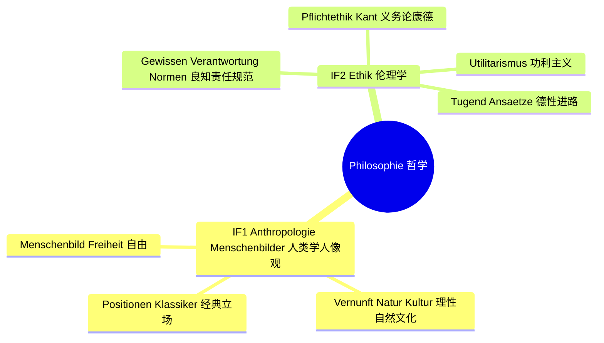
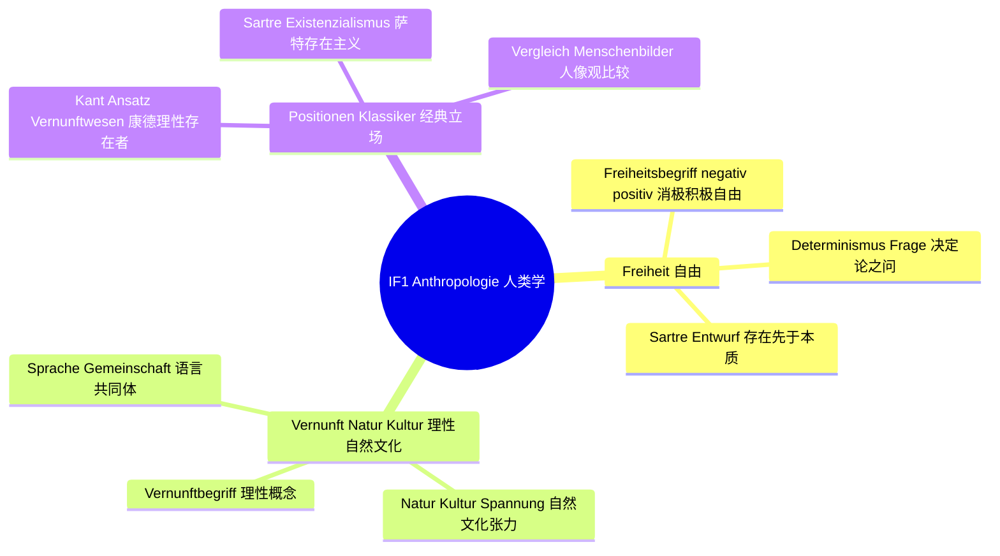
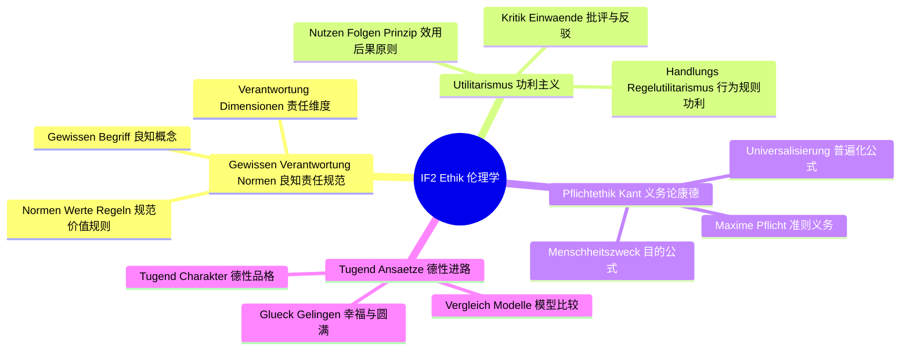

# Lernbaum Philosophie（哲学学习树 · EF）

> 中文一句话：EF哲学考"人是什么、该怎么做"，题型是"文本细读→重构论证→评价"。
> KLP-Basis: NRW Kernlehrplan GeWi EF — IF 1 Anthropologie/Menschenbilder, IF 2 Ethik. Klausur-Fokus: Textanalyse mit Argumentrekonstruktion plus kriteriengeleitete Erörterung.

## 0. 总览 Gesamtübersicht（L0→L1→L2）

## 1. IF 1 分图 Detailkarte

## 2. IF 2 分图 Detailkarte

## 3. 节点明细 Knotendetails

### IF 1 Anthropologie / Menschenbilder（人类学/人像观）

中文在上：本领域回答"人是什么"，抓住自由、理性、自然/文化的三条线，用经典立场做对比。
Deutsch unten: Dieses Feld fragt "Was ist der Mensch?" entlang Freiheit, Vernunft und Natur/Kultur, mit schulisch vereinfachten Klassikerpositionen als Vergleich.

#### L2-A1 Menschenbild & Freiheit（人像观与自由）

- **Freiheitsbegriff negativ/positiv（消极/积极自由之分）**
  - 中文一句话：先分清"不受阻碍"和"能自我决定"两种自由，考试才能判断文本在谈哪一种。
  - Operatoren: [darstellen, rekonstruieren]
  - Klausur-Anbindung: Textanalyse Einstieg — These identifizieren, Freiheitsverständnis des Textes in eigenen Worten wiedergeben.
  - Leitfrage DE / ZH: Welcher Freiheitsbegriff liegt der Textthese zugrunde? / 文本主张背后是哪一种自由概念？
- **Determinismus-Frage（决定论之问：人是否真自由）**
  - 中文一句话：理解"一切被决定"与"人能选择"的张力，学会把双方各写成一个前提。
  - Operatoren: [darstellen, erörtern]
  - Klausur-Anbindung: Erörterung Pro/Contra — beide Seiten mit Kriterium Freiheit abwägen, dann eigenes Urteil.
  - Leitfrage DE / ZH: Ist der Mensch frei oder determiniert? / 人是自由的还是被决定的？
- **Sartre Entwurf: Existenz geht voran（萨特：存在先于本质，人被判自由）**
  - 中文一句话：记住萨特简化版——人没有现成剧本，选择本身就是自由，逃避选择也是选择。
  - Operatoren: [darstellen, rekonstruieren]
  - Klausur-Anbindung: Argumentrekonstruktion Prämisse→Konklusion — Sartres These plus ein Alltagsbeispiel rekonstruieren.
  - Leitfrage DE / ZH: Was folgt daraus, dass Existenz der Essenz vorausgeht? / "存在先于本质"会推出什么结论？

#### L2-A2 Vernunft, Natur & Kultur（理性、自然与文化）

- **Vernunftbegriff（理性概念：思考与自我立法能力）**
  - 中文一句话：理性是"能想理由、能给自己定规则"的能力，是康德进路的核心词。
  - Operatoren: [darstellen, rekonstruieren]
  - Klausur-Anbindung: Textanalyse — Vernunftbegriff des Textes herausarbeiten und mit Beispiel belegen.
  - Leitfrage DE / ZH: Was macht Vernunft zum Merkmal des Menschen? / 理性凭什么成为人的标志？
- **Natur/Kultur-Spannung（自然与文化的张力）**
  - 中文一句话：人既是自然存在又有文化塑造，凡是"天生还是习得"的争论都落在这里。
  - Operatoren: [darstellen, erörtern]
  - Klausur-Anbindung: Erörterung mit Kriterium — Natur-Argument vs. Kultur-Argument abwägen, begründetes Urteil formulieren.
  - Leitfrage DE / ZH: Bestimmt Natur oder Kultur den Menschen stärker? / 决定人的更多是自然还是文化？
- **Sprache & Gemeinschaft（语言与共同体）**
  - 中文一句话：语言让人能交流反思，共同体让人成为"谁"，这是连接人类学的桥梁概念。
  - Operatoren: [darstellen, beurteilen]
  - Klausur-Anbindung: Textanalyse Schluss — Textbeispiel auf Sprache/Gemeinschaft beziehen, kurze Bewertung mit Kriterium Menschenwürde.
  - Leitfrage DE / ZH: Wird der Mensch erst in Gemeinschaft zum Menschen? / 人是否只有在共同体中才成其为人？

#### L2-A3 Positionen im Vergleich（经典立场与比较）

- **Kant-Ansatz: Vernunftwesen（康德进路简化版：人是理性存在者）**
  - 中文一句话：康德简化记一条——人因理性而有尊严，能自我立法，不只服从本能。
  - Operatoren: [darstellen, rekonstruieren]
  - Klausur-Anbindung: Argumentrekonstruktion — Kants Prämisse (Vernunft) → Konklusion (Würde/Selbstgesetzgebung) plus Beispiel.
  - Leitfrage DE / ZH: Warum begründet Vernunft Würde? / 理性为什么能推出尊严？
- **Sartre Existenzialismus（萨特存在主义简化版）**
  - 中文一句话：萨特简化记一条——自由不可推卸，责任随选择而来，"借口"不成立。
  - Operatoren: [darstellen, erörtern]
  - Klausur-Anbindung: Erörterung — Sartre-Position pro/contra prüfen, mit Kriterium Freiheit beurteilen.
  - Leitfrage DE / ZH: Macht radikale Freiheit den Menschen überfordert? / 彻底的自由会不会压垮人？
- **Vergleich der Menschenbilder（人像观比较表）**
  - 中文一句话：用"自由观+理性观+结论"三行做比较表，是本IF收束和串题的工具。
  - Operatoren: [darstellen, beurteilen]
  - Klausur-Anbindung: Erörterung/Urteil — Positionen mit gemeinsamem Kriterium vergleichen, eigene Stellung nehmen.
  - Leitfrage DE / ZH: Welches Menschenbild überzeugt unter dem Kriterium Menschenwürde? / 以人的尊严为标准，哪种人像观更有说服力？

### IF 2 Ethik（伦理学）

中文在上：本领域回答"该怎么做"，主线是功利主义看后果、义务论看准则，两边都要会重构会批评。
Deutsch unten: Dieses Feld fragt "Was soll ich tun?" entlang Folgen (Utilitarismus) vs. Pflicht/Maxime (Kant), jeweils mit Rekonstruktion und Kritik.

#### L2-E1 Gewissen, Verantwortung & Normen（良知、责任与规范）

- **Gewissen-Begriff（良知概念）**
  - 中文一句话：良知是内在的道德声音，考试用来解释"为什么人会感到该/不该"。
  - Operatoren: [darstellen, rekonstruieren]
  - Klausur-Anbindung: Textanalyse — Gewissensverständnis des Textes rekonstruieren und mit Beispiel illustrieren.
  - Leitfrage DE / ZH: Ist das Gewissen angeboren oder gelernt? / 良知是天生的还是学来的？
- **Verantwortung-Dimensionen（责任维度：对谁、为什么、后果谁担）**
  - 中文一句话：责任拆三问——向谁负责、依据什么、后果归谁，这是评价段的抓手。
  - Operatoren: [darstellen, beurteilen]
  - Klausur-Anbindung: Erörterung/Urteil — Verantwortung als Kriterium nennen, eigenes Urteil daran prüfen.
  - Leitfrage DE / ZH: Wofür und vor wem sind wir verantwortlich? / 我们对什么、向谁负责？
- **Normen, Werte & Regeln（规范、价值与规则之分）**
  - 中文一句话：价值是"觉得重要"，规范是"应当如此"，规则是"具体做法"，三层别混。
  - Operatoren: [darstellen, rekonstruieren]
  - Klausur-Anbindung: Textanalyse Einstieg — Norm/Wert/Regel im Text sauber zuordnen.
  - Leitfrage DE / ZH: Wann wird ein Wert zur verbindlichen Norm? / 价值何时变成有约束力的规范？

#### L2-E2 Utilitarismus（功利主义：看后果）

- **Nutzen-/Folgenprinzip（效用与后果原则）**
  - 中文一句话：核心只记一句——对错看后果，看是否为尽可能多的人带来尽可能大的好处。
  - Operatoren: [darstellen, rekonstruieren]
  - Klausur-Anbindung: Argumentrekonstruktion Prämisse (Folgenkalkül) → Konklusion (Handlung geboten/verboten) plus Beispiel.
  - Leitfrage DE / ZH: Darf eine gute Folge ein problematisches Mittel rechtfertigen? / 好的后果能让有问题的手段正当吗？
- **Handlungs- vs. Regelutilitarismus（行为与规则功利之分）**
  - 中文一句话：一个看"这次后果"，一个看"这类规则长期后果"，分清才能写出Pro/Contra。
  - Operatoren: [darstellen, erörtern]
  - Klausur-Anbindung: Erörterung Pro/Contra — beide Varianten gegeneinander abwägen, Kriterium Gerechtigkeit nennen.
  - Leitfrage DE / ZH: Reicht der Einzelfall oder braucht es eine allgemeine Regel? / 只看个案够吗，还是需要一般规则？
- **Kritik & Einwände（对功利主义的批评）**
  - 中文一句话：常考两刀——少数人被牺牲怎么办、后果算得清吗，背熟才能写评价段。
  - Operatoren: [erörtern, beurteilen]
  - Klausur-Anbindung: Urteilsteil — Einwände mit Kriterium Menschenwürde/Gerechtigkeit prüfen, Stellung nehmen.
  - Leitfrage DE / ZH: Schützt der Utilitarismus Minderheiten ausreichend? / 功利主义能保护少数人吗？

#### L2-E3 Pflichtethik / Kant（义务论/康德：看准则）

- **Maxime & Pflicht（准则与义务）**
  - 中文一句话：准则是"我做事的个人原则"，义务是不看好处也该守的 bound，自己先能举一例准则。
  - Operatoren: [darstellen, rekonstruieren]
  - Klausur-Anbindung: Textanalyse — Maxime der Textfigur formulieren, Pflichtanspruch rekonstruieren.
  - Leitfrage DE / ZH: Was unterscheidet eine Maxime von einer Gewohnheit? / 准则和习惯有什么区别？
- **Universalisierungsformel（普遍化公式：能成为普遍法则吗）**
  - 中文一句话：检验只问一句——如果人人都按我的准则做，世界还成立吗，不成立就不行。
  - Operatoren: [rekonstruieren, beurteilen]
  - Klausur-Anbindung: Argumentrekonstruktion plus Prüfung — Maxime aufstellen, Universalisierungstest durchführen, Ergebnis beurteilen.
  - Leitfrage DE / ZH: Besteht meine Maxime den Universalisierungstest? / 我的准则能通过普遍化检验吗？
- **Menschheitszweckformel（目的公式：人不只是手段）**
  - 中文一句话：人永远同时是目的，不能只把人当工具用，这是尊严线的考试表达。
  - Operatoren: [darstellen, Stellung nehmen]
  - Klausur-Anbindung: Erörterung/Urteil — Fall mit Menschheitszweckformel prüfen, eigene Stellung mit Kriterium Menschenwürde.
  - Leitfrage DE / ZH: Wo wird ein Mensch bloß als Mittel benutzt? / 哪里有人只被当成了手段？

#### L2-E4 Tugend-Ansätze & Modellvergleich（德性进路与模型比较）

- **Tugend & Charakter（德性与品格）**
  - 中文一句话：德性问的不是"这次做对了吗"，而是"什么样的人会稳定地做好"，记住这个视角差。
  - Operatoren: [darstellen, erörtern]
  - Klausur-Anbindung: Erörterung — Tugendperspektive als drittes Pro/Contra-Argument einführen.
  - Leitfrage DE / ZH: Zählt die Tat oder der Charakter? / 算数的是行为还是品格？
- **Glück & Gelingen（幸福与圆满人生）**
  - 中文一句话：德性把"好生活"当目标，考试可用来补功利只算后果、义务只看准则的窄处。
  - Operatoren: [darstellen, beurteilen]
  - Klausur-Anbindung: Urteilsteil — Gelingen als zusätzliches Kriterium nennen, kurz abwägen.
  - Leitfrage DE / ZH: Gehört Glück zur Moral dazu? / 幸福属于道德的一部分吗？
- **Vergleich Utilitarismus vs. Kant（两大模型比较与选用）**
  - 中文一句话：收束表记"看后果还是看准则、怎么检验、怕什么批评"，考前只背这一张。
  - Operatoren: [erörtern, beurteilen]
  - Klausur-Anbindung: Erörterung Schluss — beide Modelle mit gleichem Kriterium (Freiheit/Gerechtigkeit/Menschenwürde) vergleichen, begründetes Urteil.
  - Leitfrage DE / ZH: Folgen oder Pflicht — was überzeugt im Fall? / 后果还是义务——在这个案例中谁更有说服力？
