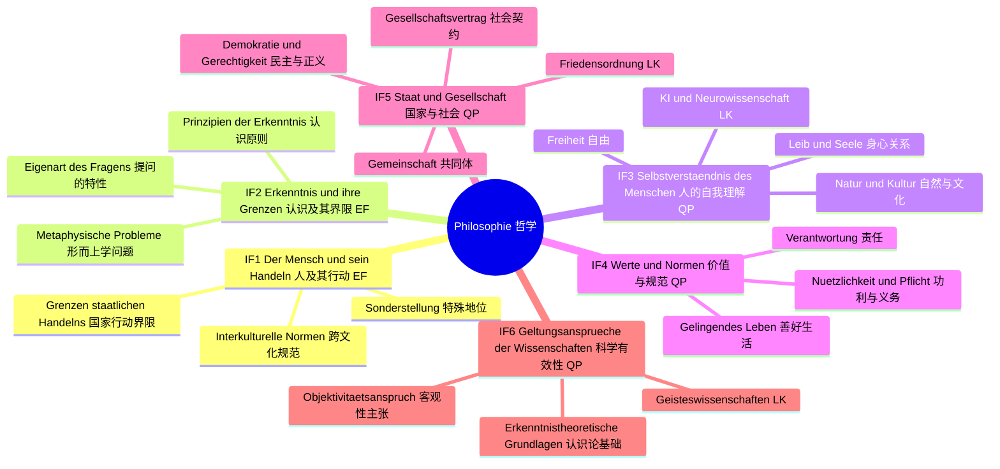
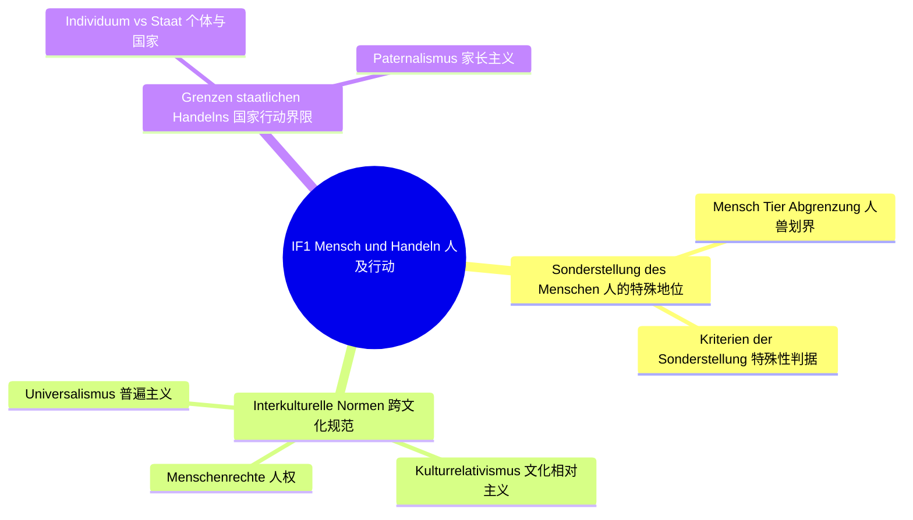
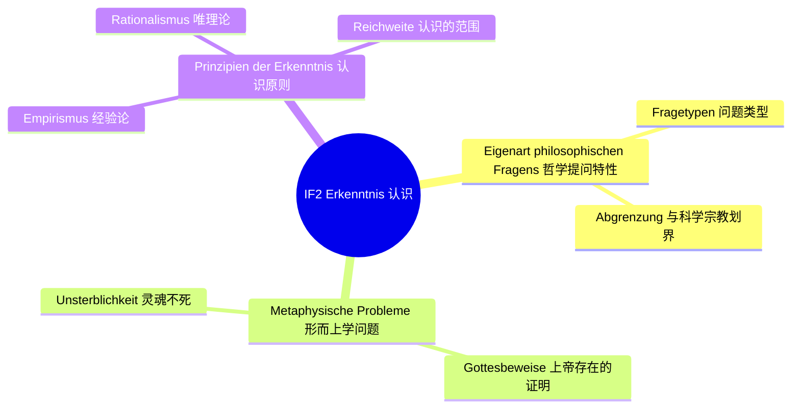
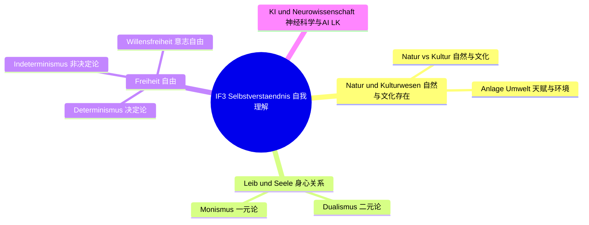
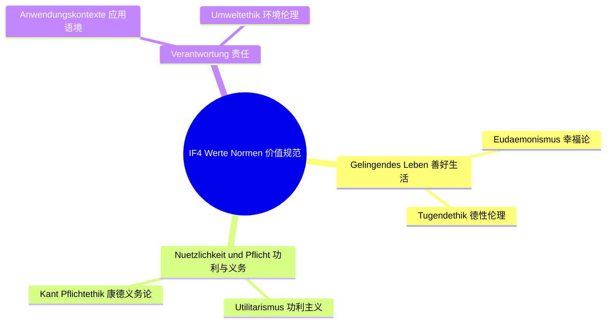
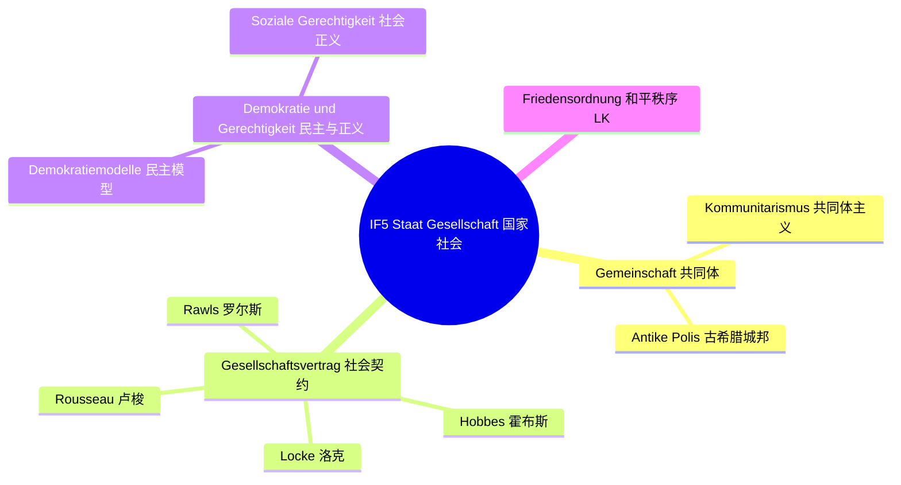
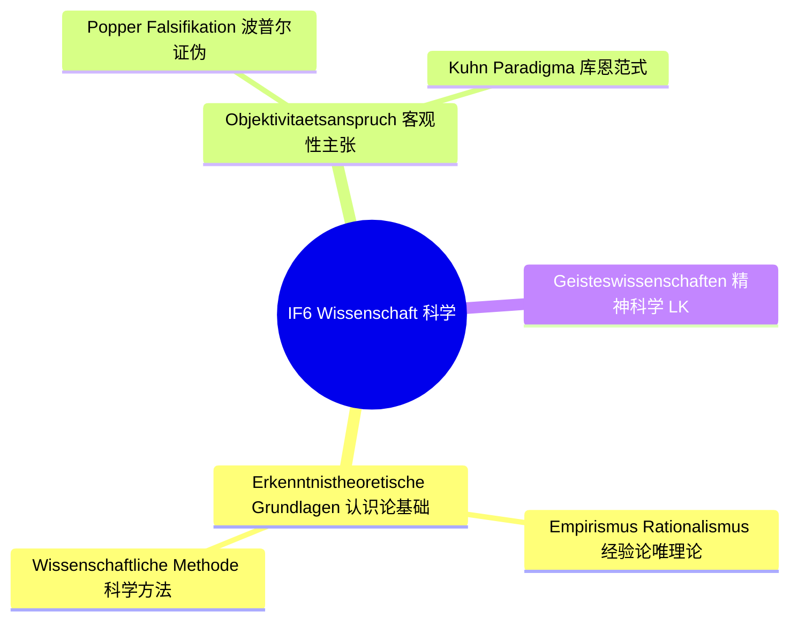

# Lernbaum Philosophie（哲学学习树 · EF→Abitur）

> 中文一句话：EF 哲学回答「人是什么、能认识什么」（实践哲学 + 理论哲学入门），QP 系统展开人类学 / 伦理学 / 政治哲学 / 科学哲学；题型是「文本细读 → 重构论证 → 比较 → 评判」与「问题 Erörterung」两条主线。
> KLP-Basis: NRW KLP Philosophie 2013（Heft 4716，`klp_gost_philosophie.pdf`）· Klausur-Fokus: Aufgabenart I / II（II 含 A 文本 / B 论断 / C 案例三变体）；Abitur GK 240 min / LK 300 min。
> ⚠️ **学段说明**：KLP 原文**只有 EF 与 Qualifikationsphase 两级**，无 Q1/Q2 标记；QP 的 4 个 IF 为 GK 与 LK 共有（LK 各多一条内容）。本树用 `[Q1]`/`[Q2]` 是为对接项目体系。[已验证]
> ⚠️ **本学科无中德对照**：按项目设计，中德对照（CN-Methode）仅适用于理科四科（Mathe/Physik/Chemie/Bio）。文科六科以德国 NRW 为唯一基准。

---

## 0. Methoden-Profil（方法论画像 —— 本设计第二核心）

### ① Abitur 能力权重（AFB 分布）

| AFB | 层级 | 本课权重 | 说明 |
|---|---|---|---|
| I | Reproduktion | ≈20% | 复述立场、描述文本主张（`beschreiben`, `darstellen`, `wiedergeben`, `zusammenfassen`） |
| II | Reorganisation und Transfer | ≈50% | **主战场**：重构论证、分析、比较、归类（`rekonstruieren`, `analysieren`, `vergleichen`, `einordnen`） |
| III | Reflexion und Problemlösung | ≈30% | 评判与表态（`eroertern`, `beurteilen`, `bewerten`, `Stellung nehmen`） |

> ⚠️ **KLP 原文明确**：「所有 Abitur 任务须覆盖全部三个 AFB，但 **AFB II 构成重点**」。[已验证]
> ⚠️ **`rekonstruieren` 是本学科标志性动词**（6 个 IF 的 Sachkompetenz 条目几乎每个都有 2–3 条以它开头），但**其精确 AFB 归属未获取到**（官方哲学 Operatorenübersicht 未抓到）——**待补**。[未获取到]

### ② 黄金学习法（证据来自 `00_META/Lernmethoden-Evidenz.md`）

| 方法 | 证据来源 | 本课应用方式 |
|---|---|---|
| 对比辨别（Discriminative Contrast） | Rohrer & Taylor 2007 · Foster 2019 双通道 | 哲学最核心的方法：Utilitarismus vs Kant、Dualismus vs Monismus、Determinismus vs Indeterminismus 全部做「对照表」而非单独背 |
| 检索练习（合书重构） | Dunlosky 2013「hoch」· Karpicke & Blunt 2011（d≈1.0） | 读完一个立场后**合书重构论证链**（Prämisse → Konklusion），再开书对照 |
| 例题精读 + 带扶手自解释 | Barbieri 2023（g≈0.48）· Wittwer & Renkl 2010 | 新题型（如 Aufgabenart II C 案例分析）先精读 1 篇正确解法，再问「这一步用了哪个 Operator」 |
| 精细提问（Elaborative Interrogation） | Dunlosky 2013「mittel」 | 每个立场问三连：「它的前提是什么？为什么有人反对？它的后果是什么？」 |
| 一图一概念 | Mayer CTML · Cromley 2025 | 论证结构图一次只画一个立场的推理链，不做「全家福」 |
| 反馈分层（KR → 延迟展开 → 过程归因） | Brummer 2024 · Kandemir | 整套 Erörterung 写完再统一对答案；错因归类「论证结构错 / 术语错 / 立场不清」 |

### ③ 三大典型失分点

1. **`rekonstruieren` 做成「复述」** —— 重构要求呈现**论证结构**（前提 → 结论 → 隐含假设），不是把文本换个说法抄一遍。这是 AFB I 与 II 的分界线。
2. **评判时不给标准** —— `beurteilen` 必须**kriteriengeleitet**（依标准），常用标准：Menschenwürde / Gerechtigkeit / Freiheit / Konsistenz。只给立场不给标准是 AFB III 最常见的失分。
3. **`beurteilen` 与 `bewerten` 混用** —— `beurteilen` = Sachurteil（专业标准内的事实判断），`bewerten` = Werturteil（须考量价值与规范）。两者不能互换。

### ④ 本课笔记结构模板（七段）

```
1. Problemstellung（该文本/立场要回答的哲学问题是什么）
2. Rekonstruktion（论证结构：Prämisse 1…n → Konklusion，标出隐含假设）
3. Begriffe（核心术语澄清，标德语原文）
4. Einordnung（归入哪个传统/立场，与哪些立场对立）
5. Kritik（已有批评：前提可疑？后果不可接受？内部矛盾？）
6. Vergleich（按统一标准与其他立场对照）
7. Eigenes Urteil（自己的判断 + 明示所用标准）
```

---

## 1. 总览 Gesamtübersicht（L0→L1→L2）


```mermaid
mindmap
  root((Philosophie 哲学))
    IF1 Der Mensch und sein Handeln 人及其行动 EF
      Sonderstellung 特殊地位
      Interkulturelle Normen 跨文化规范
      Grenzen staatlichen Handelns 国家行动界限
    IF2 Erkenntnis und ihre Grenzen 认识及其界限 EF
      Eigenart des Fragens 提问的特性
      Metaphysische Probleme 形而上学问题
      Prinzipien der Erkenntnis 认识原则
    IF3 Selbstverstaendnis des Menschen 人的自我理解 QP
      Natur und Kultur 自然与文化
      Leib und Seele 身心关系
      Freiheit 自由
      KI und Neurowissenschaft LK
    IF4 Werte und Normen 价值与规范 QP
      Gelingendes Leben 善好生活
      Nuetzlichkeit und Pflicht 功利与义务
      Verantwortung 责任
    IF5 Staat und Gesellschaft 国家与社会 QP
      Gemeinschaft 共同体
      Gesellschaftsvertrag 社会契约
      Demokratie und Gerechtigkeit 民主与正义
      Friedensordnung LK
    IF6 Geltungsansprueche der Wissenschaften 科学有效性 QP
      Erkenntnistheoretische Grundlagen 认识论基础
      Objektivitaetsanspruch 客观性主张
      Geisteswissenschaften LK
```

---

## 2. 分 IF 展开（L1→L2→L3 + 应试四行）

### L1: IF1 Der Mensch und sein Handeln（人及其行动）· **EF**

> **实践哲学入门**（Einführung in Grundfragen der praktischen Philosophie）。这是 QP 的 IF4/IF5 的地基。


```mermaid
mindmap
  root((IF1 Mensch und Handeln 人及行动))
    Sonderstellung des Menschen 人的特殊地位
      Mensch Tier Abgrenzung 人兽划界
      Kriterien der Sonderstellung 特殊性判据
    Interkulturelle Normen 跨文化规范
      Kulturrelativismus 文化相对主义
      Universalismus 普遍主义
      Menschenrechte 人权
    Grenzen staatlichen Handelns 国家行动界限
      Individuum vs Staat 个体与国家
      Paternalismus 家长主义
```

#### L2 Die Sonderstellung des Menschen（人的特殊地位）

- **Mensch-Tier-Abgrenzung（人兽划界）** `[EF]`
  - 中文一句话：人凭什么在生物界中「特殊」——理性、语言、自我意识、道德能力，各派判据不同。
  - Klausur-Anbindung：Aufgabenart II B（基于论断讨论）；`Kriterien der Sonderstellung eroertern`（AFB II→III）。
  - Operatoren：`rekonstruieren`, `vergleichen`, `eroertern`, `beurteilen`
  - Lernweg ZH：做「判据 → 支持者 → 反驳」三列表（对比辨别），再问「哪个判据最经得起推敲」。
  - Fehlerquelle：只罗列判据不做评判（漏 AFB III）；把「生物学差异」与「哲学意义的特殊性」混为一谈。
  - 📓 笔记：🟡 [`Menschenbild-Ueberblick.md`](../../../07_Philosophie/Texte-Analyse/Menschenbild-Ueberblick.md)（部分覆盖）
- **Kriterien der Sonderstellung（特殊性判据的检验）** `[EF]`
  - 中文一句话：每个判据都要接受「反例检验」——动物有没有语言？机器有没有理性？
  - Klausur-Anbindung：评价题；`Kriterien pruefen und eigene Position entwickeln`（AFB III）。
  - Operatoren：`ueberpruefen`, `beurteilen`, `entwickeln`
  - Lernweg ZH：用「反例法」逐个检验判据，这是哲学最有效的自我训练。
  - Fehlerquelle：不检验就断言（哲学答题要求「论证性」，即 `begruenden`）。
  - 📓 笔记：⚠️ 缺口

#### L2 Werte und Normen im interkulturellen Kontext（跨文化语境中的价值与规范）

> 🔴 **EF 层重大缺口之一**（现有 8 篇笔记全部落 QP 题材，此块为零）。

- **Kulturrelativismus vs Universalismus（文化相对主义 vs 普遍主义）** `[EF]`
  - 中文一句话：道德标准是各文化自己的事，还是存在跨文化的普遍标准？这是当代最重要的伦理争论。
  - Klausur-Anbindung：Aufgabenart II（问题讨论）；`Kulturrelativismus und Universalismus abwaegen`（AFB II→III）。
  - Operatoren：`rekonstruieren`, `vergleichen`, `eroertern`, `Stellung nehmen`
  - Lernweg ZH：做「双方最强论证」对照表，再用统一标准（Menschenwürde）评判。
  - Fehlerquelle：把文化相对主义简化成「什么都行」（其实它有强弱版本）。
  - 📓 笔记：⚠️ 缺口（★★★ EF 优先）
- **Menschenrechte als universaler Anspruch（人权作为普遍诉求）** `[EF]`
  - 中文一句话：人权宣言主张跨文化有效，但它的普遍性本身需要哲学辩护。
  - Klausur-Anbindung：评价题；`Universalitaet der Menschenrechte begruenden und pruefen`（AFB III）。
  - Operatoren：`begruenden`, `ueberpruefen`, `beurteilen`
  - Lernweg ZH：连到「文化相对主义的反驳」，做立场对抗演练。
  - Fehlerquelle：只背宣言条文，不做哲学论证。
  - 📓 笔记：⚠️ 缺口

#### L2 Umfang und Grenzen staatlichen Handelns（国家行动的范围与界限）

> 🔴 **EF 层重大缺口之二**。此 IF 是 QP 的 IF5（政治哲学）的地基。

- **Individuum vs Staat（个体与国家的优先性）** `[EF]`
  - 中文一句话：国家能为了集体利益限制个体自由到什么程度？自由主义的红线在哪？
  - Klausur-Anbindung：Aufgabenart II C（案例讨论）；`Grenzen staatlichen Handelns am Fall beurteilen`（AFB II→III）。
  - Operatoren：`analysieren`, `eroertern`, `beurteilen`, `Stellung nehmen`
  - Lernweg ZH：用具体政策案例（如口罩令、限速）驱动抽象讨论。
  - Fehlerquelle：只谈「自由很重要」而不给界限标准（如 Mill 的伤害原则）。
  - 📓 笔记：⚠️ 缺口（★★★ EF 优先）
- **Paternalismus（家长主义）** `[EF]`
  - 中文一句话：国家为了「你好」而限制你的选择，这正当吗？
  - Klausur-Anbindung：评价题；`Paternalistische Eingriffe beurteilen`（AFB III）。
  - Operatoren：`analysieren`, `beurteilen`, `bewerten`
  - Lernweg ZH：做「软/硬家长主义」区分表，再讨论边界。
  - Fehlerquelle：不知道家长主义有软硬之分。
  - 📓 笔记：⚠️ 缺口

---

### L1: IF2 Erkenntnis und ihre Grenzen（认识及其界限）· **EF**

> **理论哲学入门**（Einführung in Grundfragen der theoretischen Philosophie）。🔴 **EF 两个 IF 中笔记覆盖更薄的一个**。


```mermaid
mindmap
  root((IF2 Erkenntnis 认识))
    Eigenart philosophischen Fragens 哲学提问特性
      Fragetypen 问题类型
      Abgrenzung 与科学宗教划界
    Metaphysische Probleme 形而上学问题
      Gottesbeweise 上帝存在的证明
      Unsterblichkeit 灵魂不死
    Prinzipien der Erkenntnis 认识原则
      Empirismus 经验论
      Rationalismus 唯理论
      Reichweite 认识的范围
```

#### L2 Eigenart philosophischen Fragens und Denkens（哲学提问与思考的特性）

- **Typen philosophischer Fragen（哲学问题的类型）** `[EF]`
  - 中文一句话：哲学问的不是「是什么」而是「为什么可以这样问」——概念澄清、前提追问、意义探询。
  - Klausur-Anbindung：Aufgabenart I 入门；`Eigenart philosophischer Fragen erlaeutern`（AFB I→II）。
  - Operatoren：`beschreiben`, `erlaeutern`, `rekonstruieren`
  - Lernweg ZH：用 5 类问题（本体论/认识论/伦理学/美学/逻辑）做归类练习。
  - Fehlerquelle：把哲学问题与科学问题混同（前者不可经验裁决）。
  - 📓 笔记：✅ [`Philosophische-Fragen-Typen.md`](../../../07_Philosophie/Texte-Analyse/Philosophische-Fragen-Typen.md)（含 5 Fragetypen + Operatoren-Mapping）
- **Abgrenzung zu Wissenschaft und Religion（与科学、宗教的划界）** `[EF]`
  - 中文一句话：哲学与科学、宗教都在追问终极问题，但方法不同——这是哲学的自我定位。
  - Klausur-Anbindung：比较题；`Philosophie von Wissenschaft und Religion abgrenzen`（AFB II）。
  - Operatoren：`vergleichen`, `einordnen`, `erlaeutern`
  - Lernweg ZH：做「三者的方法/对象/可验证性」对照表。
  - Fehlerquelle：只说「哲学更根本」而说不出方法差异。
  - 📓 笔记：⚠️ 缺口

#### L2 Metaphysische Probleme als Herausforderung（形而上学问题作为挑战）

> 🔴 **EF 层最大缺口**（IF2 中此块完全为零）。

- **Gottesbeweise und ihre Kritik（上帝存在的证明及其批评）** `[EF]`
  - 中文一句话：本体论、宇宙论、目的论证明各有一套推理，也各有一个致命反驳。
  - Klausur-Anbindung：Aufgabenart I（文本解读）；`Gottesbeweis rekonstruieren und kritisieren`（AFB II→III）。
  - Operatoren：`rekonstruieren`, `analysieren`, `beurteilen`
  - Lernweg ZH：每个证明做成「推理链 + 经典反驳」配对卡（对比辨别）。
  - Fehlerquelle：会背证明但不会重构推理链；不知道康德对本体论证明的反驳。
  - 📓 笔记：⚠️ 缺口（★★★ EF 优先）
- **Unsterblichkeit der Seele（灵魂不死）** `[EF]`
  - 中文一句话：灵魂能不能脱离身体存在？这个问题检验「理性认识」的边界。
  - Klausur-Anbindung：问题讨论题；`Metaphysische Fragen als Grenze der Vernunft eroertern`（AFB II→III）。
  - Operatoren：`analysieren`, `eroertern`, `beurteilen`
  - Lernweg ZH：连到康德「理性越界」的诊断，理解为什么形而上学是「挑战」。
  - Fehlerquelle：把它当宗教问题而非认识论问题。
  - 📓 笔记：⚠️ 缺口

#### L2 Prinzipien und Reichweite menschlicher Erkenntnis（认识的原则与范围）

- **Empirismus vs Rationalismus（经验论 vs 唯理论）** `[EF]`
  - 中文一句话：知识来自感官经验还是理性推演？这是近代认识论的根本分裂。
  - Klausur-Anbindung：核心对照题；`Empirismus und Rationalismus vergleichen`（AFB II）。
  - Operatoren：`rekonstruieren`, `vergleichen`, `beurteilen`
  - Lernweg ZH：做四栏对照表（知识来源 / 代表 / 优势 / 弱点）。
  - Fehlerquelle：把「经验论」误解为「反对理性」（实为主张知识源于经验）。
  - 📓 笔记：⚠️ 缺口（★★★ EF 优先；注意与 IF6 同名但深度不同）
- **Reichweite menschlicher Erkenntnis（人类认识的范围）** `[EF]`
  - 中文一句话：感官与理性各能把握现实的哪一部分？边界在哪里？
  - Klausur-Anbindung：评价题；`Grenzen der Erkenntnis beurteilen`（AFB III）。
  - Operatoren：`analysieren`, `beurteilen`, `Stellung nehmen`
  - Lernweg ZH：用「怀疑论」作为压力测试：如果感官会骗人，还剩什么可靠？
  - Fehlerquelle：只做概念辨析不触及「界限」这一核心问题。
  - 📓 笔记：⚠️ 缺口

---

### L1: IF3 Das Selbstverständnis des Menschen（人的自我理解）· **QP**


```mermaid
mindmap
  root((IF3 Selbstverstaendnis 自我理解))
    Natur und Kulturwesen 自然与文化存在
      Natur vs Kultur 自然与文化
      Anlage Umwelt 天赋与环境
    Leib und Seele 身心关系
      Dualismus 二元论
      Monismus 一元论
    Freiheit 自由
      Determinismus 决定论
      Indeterminismus 非决定论
      Willensfreiheit 意志自由
    KI und Neurowissenschaft 神经科学与AI LK
```

#### L2 Der Mensch als Natur- und Kulturwesen（自然存在与文化存在）

- **Natur vs Kultur（自然与文化的张力）** `[QP]`
  - 中文一句话：人一半是自然产物，一半是文化塑造——「天生还是习得」的争论落在这里。
  - Klausur-Anbindung：Aufgabenart II（问题讨论）；`Natur- und Kulturanteil abwaegen`（AFB II→III）。
  - Operatoren：`analysieren`, `eroertern`, `beurteilen`
  - Lernweg ZH：做「自然论证 vs 文化论证」对照表，用统一标准评判。
  - Fehlerquelle：陷入非此即彼（哲学答案通常是「两者交互」）。
  - 📓 笔记：✅ [`Menschenbild-Ueberblick.md`](../../../07_Philosophie/Texte-Analyse/Menschenbild-Ueberblick.md)
- **Anlage und Umwelt（天赋与环境）** `[QP]`
  - 中文一句话：行为有多少由基因决定、多少由环境塑造？这直接影响「自由」问题。
  - Klausur-Anbindung：分析题；`Anlage-Umwelt-Debatte philosophisch beurteilen`（AFB II→III）。
  - Operatoren：`analysieren`, `beurteilen`
  - Lernweg ZH：连到 IF3 的自由问题，形成「决定论」的前置理解。
  - Fehlerquelle：把「有基因影响」直接等同于「被决定」。
  - 📓 笔记：⚠️ 缺口

#### L2 Das Verhältnis von Leib und Seele（身心关系）

- **Dualismus（二元论）** `[QP]`
  - 中文一句话：身体与心灵是两种不同的实体，还是同一个东西的两种描述？
  - Klausur-Anbindung：核心对照题；`Leib-Seele-Verhaeltnis analysieren`（AFB II）。
  - Operatoren：`rekonstruieren`, `vergleichen`, `beurteilen`
  - Lernweg ZH：做「二元论 vs 一元论」四栏对照表（对比辨别）。
  - Fehlerquelle：不知道还有「属性二元论」这种中间立场。
  - 📓 笔记：⚠️ 缺口（🟡 QP 深度缺口）
- **Monismus（一元论）** `[QP]`
  - 中文一句话：只承认一种实体（物质或精神），试图消解心身对立。
  - Klausur-Anbindung：比较 + 评判题；`Monistische Positionen bewerten`（AFB II→III）。
  - Operatoren：`vergleichen`, `beurteilen`, `bewerten`
  - Lernweg ZH：连到神经科学证据（LK 条目），理解当代争论。
  - Fehlerquelle：把「唯物论」与「物理主义」混同。
  - 📓 笔记：⚠️ 缺口

#### L2 Der Mensch als freies und selbstbestimmtes Wesen（自由与自我规定）

- **Determinismus vs Indeterminismus（决定论 vs 非决定论）** `[QP]`
  - 中文一句话：如果一切都被因果决定，人还能自由吗？这是哲学最硬的难题之一。
  - Klausur-Anbindung：核心论证题；`Determinismus und Freiheit eroertern`（AFB II→III）。
  - Operatoren：`rekonstruieren`, `analysieren`, `eroertern`
  - Lernweg ZH：把「决定论 → 无自由 → 无责任」写成推理链，再找断点（这是哲学的标准打法）。
  - Fehlerquelle：把「决定论」与「宿命论」混同（前者是因果必然，后者是命运预定）。
  - 📓 笔记：⚠️ 缺口（🟡 QP 深度缺口）
- **Willensfreiheit（意志自由）** `[QP]`
  - 中文一句话：自由是否等于「能够另作选择」？相容论给出第三条路。
  - Klausur-Anbindung：评价题；`Willensfreiheit und Verantwortung beurteilen`（AFB III）。
  - Operatoren：`analysieren`, `beurteilen`, `Stellung nehmen`
  - Lernweg ZH：做「自由意志论 / 硬决定论 / 相容论」三栏对照表。
  - Fehlerquelle：不知道相容论（决定论与自由可兼容）。
  - 📓 笔记：⚠️ 缺口
- **[LK] Menschenbild der Neurowissenschaften und der KI（神经科学与AI的人之图景）** `[LK]`
  - 中文一句话：脑科学能否解释一切心智现象？AI 是否挑战了「人的独特性」？
  - Klausur-Anbindung：评价题；`Naturwissenschaftliche Menschenbilder beurteilen`（AFB III）。
  - Operatoren：`analysieren`, `beurteilen`, `bewerten`, `eroertern`
  - Lernweg ZH：做「还原论 vs 非还原论」对照表（Oberstufe 文档已点明这对张力）。
  - Fehlerquelle：⚠️ **GK 不考此条**（LK 专属）。
  - 📓 笔记：⚠️ 缺口（LK 专属，全库为零）

---

### L1: IF4 Werte und Normen des Handelns（行动的价值与规范）· **QP**

> 🎯 **本 IF 是项目笔记密度最高的领域**（3 篇直落于此）。


```mermaid
mindmap
  root((IF4 Werte Normen 价值规范))
    Gelingendes Leben 善好生活
      Eudaemonismus 幸福论
      Tugendethik 德性伦理
    Nuetzlichkeit und Pflicht 功利与义务
      Utilitarismus 功利主义
      Kant Pflichtethik 康德义务论
    Verantwortung 责任
      Anwendungskontexte 应用语境
      Umweltethik 环境伦理
```

#### L2 Grundsätze eines gelingenden Lebens（善好生活的原则）

- **Eudämonismus（幸福论传统）** `[QP]`
  - 中文一句话：伦理不只问「该做什么」，还问「怎样活得好」——这是古希腊伦理学的起点。
  - Klausur-Anbindung：Aufgabenart I（文本解读）；`Eudaemonistische Ansaetze rekonstruieren`（AFB II）。
  - Operatoren：`rekonstruieren`, `einordnen`, `vergleichen`
  - Lernweg ZH：把 Aristoteles 的 eudaimonia 与 Utilitarismus 的「幸福」做对比辨别（同名不同义）。
  - Fehlerquelle：⚠️ **LK 明确要求把不同答案「归入 eudämonistisches Denken 传统」**——GK 不要求此归入，但 LK 必考。
  - 📓 笔记：⚠️ 缺口（🟡 IF4 深度缺口，LK 重点）
- **Tugendethik（德性伦理）** `[QP]`
  - 中文一句话：不问「这次做对了吗」，而问「什么样的人会稳定地做好」。
  - Klausur-Anbindung：评价题；`Tugendperspektive als drittes Argument einfuehren`（AFB III）。
  - Operatoren：`rekonstruieren`, `eroertern`, `beurteilen`
  - Lernweg ZH：把德性论作为「第三视角」补进功利 vs 义务的二元对立。
  - Fehlerquelle：不知道德性论关注的是「行为者」而非「行为」。
  - 📓 笔记：⚠️ 缺口

#### L2 Nützlichkeit und Pflicht als ethische Prinzipien（功利与义务）

- **Utilitarismus（功利主义）** `[QP]`
  - 中文一句话：对错看后果——是否为尽可能多的人带来尽可能大的好处。
  - Klausur-Anbindung：Aufgabenart I / II；`Utilitaristisches Kalkuel rekonstruieren und kritisieren`（AFB II→III）。
  - Operatoren：`rekonstruieren`, `analysieren`, `beurteilen`
  - Lernweg ZH：核心是「Hedonistisches Kalkül」的算法化训练 + 两个经典批评（少数人牺牲、后果难算）。
  - Fehlerquelle：混淆 Handlungs- 与 Regelutilitarismus。
  - 📓 笔记：✅ [`Utilitarismus-vs-Kant.md`](../../../07_Philosophie/Texte-Analyse/Utilitarismus-vs-Kant.md) · [`Ethische-Dilemmata-Sammlung.md`](../../../07_Philosophie/Texte-Analyse/Ethische-Dilemmata-Sammlung.md)
- **Kant: Pflichtethik und Kategorischer Imperativ（康德义务论与定言命令）** `[QP]`
  - 中文一句话：对错看准则能否普遍化，人永远同时是目的而非仅手段。
  - Klausur-Anbindung：Aufgabenart I / II；`Maxime aufstellen und Universalisierungstest durchfuehren`（AFB II）。
  - Operatoren：`rekonstruieren`, `anwenden`, `beurteilen`
  - Lernweg ZH：**四步检验法**——① 提取准则 ② 普遍化公式检验 ③ 目的公式检验 ④ 结论。
  - Fehlerquelle：把「准则」（Maxime）与「习惯」混同；只做普遍化不做目的公式。
  - 📓 笔记：✅ [`Kant-Kategorischer-Imperativ-und-Maximenpruefung.md`](../../../07_Philosophie/Kant-Kategorischer-Imperativ-und-Maximenpruefung.md)
- **[LK] Unterschiedliche Grundlagen moralischer Orientierungen（道德定向的不同基础）** `[LK]`
  - 中文一句话：道德判断的根据可以是后果、义务、德性、情感——LK 要求系统比较这些基础。
  - Klausur-Anbindung：比较题；`Grundlagen moralischer Orientierung vergleichen`（AFB II）。
  - Operatoren：`vergleichen`, `einordnen`, `beurteilen`
  - Lernweg ZH：做「四种基础 × 代表 × 判据」总表（这是 LK 的整合考点）。
  - Fehlerquelle：⚠️ **GK 不考此条**（LK 专属）。
  - 📓 笔记：⚠️ 缺口（LK 专属）

#### L2 Verantwortung in ethischen Anwendungskontexten（应用语境中的责任）

- **Verantwortung（责任）** `[QP]`
  - 中文一句话：责任拆三问——向谁负责、依据什么、后果归谁。
  - Klausur-Anbindung：评价题；`Verantwortung als Kriterium anwenden`（AFB III）。
  - Operatoren：`analysieren`, `beurteilen`, `Stellung nehmen`
  - Lernweg ZH：把「责任」作为评价段的标准词，先定义再应用。
  - Fehlerquelle：把责任当口号用而不定义。
  - 📓 笔记：⚠️ 缺口
- **Umweltethik und Anwendungsfragen（环境伦理与应用问题）** `[QP]`
  - 中文一句话：把伦理原则用到具体领域（环境、医疗、技术）时，冲突才真正显现。
  - Klausur-Anbindung：Aufgabenart II C（案例讨论）；`Ethische Prinzipien auf Anwendungsfaelle anwenden`（AFB II→III）。
  - Operatoren：`anwenden`, `analysieren`, `beurteilen`, `eroertern`
  - Lernweg ZH：用 Dilemma 案例做「原则 → 冲突 → 裁决」三步推演。
  - Fehlerquelle：只套原则不看案例特殊性。
  - 📓 笔记：🟡 [`Ethische-Dilemmata-Sammlung.md`](../../../07_Philosophie/Texte-Analyse/Ethische-Dilemmata-Sammlung.md)（案例库已备，缺系统化）

---

### L1: IF5 Zusammenleben in Staat und Gesellschaft（国家与社会中的共同生活）· **QP**


```mermaid
mindmap
  root((IF5 Staat Gesellschaft 国家社会))
    Gemeinschaft 共同体
      Antike Polis 古希腊城邦
      Kommunitarismus 共同体主义
    Gesellschaftsvertrag 社会契约
      Hobbes 霍布斯
      Locke 洛克
      Rousseau 卢梭
      Rawls 罗尔斯
    Demokratie und Gerechtigkeit 民主与正义
      Demokratiemodelle 民主模型
      Soziale Gerechtigkeit 社会正义
    Friedensordnung 和平秩序 LK
```

#### L2 Gemeinschaft als Prinzip staatsphilosophischer Legitimation（共同体作为正当化原则）

- **Antike Polis und Gemeinschaft（古希腊城邦与共同体）** `[QP]`
  - 中文一句话：古典政治哲学把「共同体」当作国家正当性的来源——人天生是政治动物。
  - Klausur-Anbindung：Aufgabenart I；`Gemeinschaft als Legitimationsprinzip rekonstruieren`（AFB II）。
  - Operatoren：`rekonstruieren`, `einordnen`, `vergleichen`
  - Lernweg ZH：与「社会契约论」做对照（共同体优先 vs 个体优先）。
  - Fehlerquelle：把亚里士多德的 polis 与现代民族国家混同。
  - 📓 笔记：⚠️ 缺口
- **Kommunitarismus（共同体主义）** `[QP]`
  - 中文一句话：个体不是原子，而是被共同体塑造的——这是对自由主义的有力批评。
  - Klausur-Anbindung：评价题；`Kommunitaristische Kritik am Liberalismus beurteilen`（AFB III）。
  - Operatoren：`analysieren`, `beurteilen`, `eroertern`
  - Lernweg ZH：做「自由主义 vs 共同体主义」对照表，用统一标准评判。
  - Fehlerquelle：把共同体主义当成「集体主义」（哲学立场与政治体制不同）。
  - 📓 笔记：⚠️ 缺口

#### L2 Individualinteresse und Gesellschaftsvertrag（个体利益与社会契约）

- **Kontraktualismus: Hobbes, Locke, Rousseau（社会契约论三家）** `[QP]`
  - 中文一句话：国家正当性来自「契约」——但缔约者是谁、让渡多少权力，三家答案完全不同。
  - Klausur-Anbindung：核心对照题；`Vertragstheorien vergleichen`（AFB II）。
  - Operatoren：`rekonstruieren`, `vergleichen`, `einordnen`, `beurteilen`
  - Lernweg ZH：做「自然状态 / 让渡程度 / 反抗权」三栏对照表（这是最高频考点）。
  - Fehlerquelle：只背人名不记差异（德国答题要求逐条比较）。
  - 📓 笔记：🟡 [`Philo-Abitur-Kernstellen.md`](../../../07_Philosophie/Texte-Analyse/Philo-Abitur-Kernstellen.md)（Rousseau 部分）—— 缺 Hobbes/Locke 系统对照
- **Rawls: Gerechtigkeit als Fairness（罗尔斯：作为公平的正义）** `[QP]`
  - 中文一句话：在「无知之幕」后选择正义原则，会选差异原则——不平等只有在有利于最弱者时才正当。
  - Klausur-Anbindung：评价题；`Rawls' Differenzprinzip anwenden und beurteilen`（AFB II→III）。
  - Operatoren：`rekonstruieren`, `anwenden`, `beurteilen`
  - Lernweg ZH：用「无知之幕」做思想实验，连到 `08_SoWi/` 的社会不平等（跨科联动）。
  - Fehlerquelle：把差异原则误解为「平均主义」（它允许不平等，但有条件）。
  - 📓 笔记：✅ [`Gerechtigkeit-Wirtschaftsethik-Vernetzung.md`](../../../07_Philosophie/Gerechtigkeit-Wirtschaftsethik-Vernetzung.md)

#### L2 Konzepte von Demokratie und sozialer Gerechtigkeit（民主与社会正义构想）

- **Demokratiemodelle（民主模型）** `[QP]`
  - 中文一句话：民主不只是投票——审议民主、自由民主、共和民主各有不同的正当性基础。
  - Klausur-Anbindung：比较题；`Demokratiemodelle vergleichen und beurteilen`（AFB II→III）。
  - Operatoren：`vergleichen`, `analysieren`, `beurteilen`
  - Lernweg ZH：做「模型 × 核心原则 × 优点 × 弱点」表。
  - Fehlerquelle：把民主只理解为「多数决」。
  - 📓 笔记：⚠️ 缺口
- **Soziale Gerechtigkeit（社会正义）** `[QP]`
  - 中文一句话：分配正义的核心争论——按需要、按贡献，还是按平等？
  - Klausur-Anbindung：评价题；`Gerechtigkeitskonzepte beurteilen`（AFB III）。
  - Operatoren：`analysieren`, `beurteilen`, `Stellung nehmen`
  - Lernweg ZH：做「三种分配原则」对照表，连到 SoWi 的实际政策案例。
  - Fehlerquelle：只谈抽象原则不联系制度设计。
  - 📓 笔记：🟡 [`Gerechtigkeit-Wirtschaftsethik-Vernetzung.md`](../../../07_Philosophie/Gerechtigkeit-Wirtschaftsethik-Vernetzung.md)
- **[LK] Bedingungen einer dauerhaften Friedensordnung（持久和平秩序的条件）** `[LK]`
  - 中文一句话：康德《永久和平论》——共和制 + 国家联盟 + 世界公民权，是全球化时代和平秩序的哲学方案。
  - Klausur-Anbindung：评价题；`Kants Friedensschrift auf aktuelle Konflikte beziehen`（AFB III）。
  - Operatoren：`rekonstruieren`, `anwenden`, `beurteilen`
  - Lernweg ZH：把三条条款做成「条件 → 当代对应 → 可行性」表。
  - Fehlerquelle：⚠️ **GK 不考此条**（LK 专属，且与 HK4「参与当下政治讨论」强关联）。
  - 📓 笔记：⚠️ 缺口（LK 专属）

---

### L1: IF6 Geltungsansprüche der Wissenschaften（科学的有效性主张）· **QP**

> ⚠️ **4 个 QP IF 中唯一笔记完全为零的一个**，占 Abitur 题材约 1/4。


```mermaid
mindmap
  root((IF6 Wissenschaft 科学))
    Erkenntnistheoretische Grundlagen 认识论基础
      Empirismus Rationalismus 经验论唯理论
      Wissenschaftliche Methode 科学方法
    Objektivitaetsanspruch 客观性主张
      Popper Falsifikation 波普尔证伪
      Kuhn Paradigma 库恩范式
    Geisteswissenschaften 精神科学 LK
```

#### L2 Erkenntnistheoretische Grundlagen der Wissenschaften（科学的认识论基础）

- **Empirismus und Rationalismus in der Wissenschaft（科学中的经验论与唯理论）** `[QP]`
  - 中文一句话：科学知识的基础是观察还是理论？这决定了科学的自我理解。
  - Klausur-Anbindung：Aufgabenart I / II；`Erkenntnistheoretische Grundlagen analysieren`（AFB II）。
  - Operatoren：`rekonstruieren`, `analysieren`, `vergleichen`
  - Lernweg ZH：⚠️ **注意与 EF 的 IF2 同名但深度不同**——EF 是入门，QP 要求结合科学实例。
  - Fehlerquelle：把 EF 的入门内容直接搬来当 QP 答案（深度不足）。
  - 📓 笔记：⚠️ 缺口（🟡 IF6 完全空白）
- **Wissenschaftliche Methode（科学方法）** `[QP]`
  - 中文一句话：假说-演绎法、归纳、溯因——科学推理的形式各有适用范围。
  - Klausur-Anbindung：分析题；`Wissenschaftliche Methoden erlaeutern`（AFB II）。
  - Operatoren：`beschreiben`, `erlaeutern`, `analysieren`
  - Lernweg ZH：连到 Bio/Physik 的实验方法论（跨科联动）。
  - Fehlerquelle：把「科学方法」当成唯一一套固定流程。
  - 📓 笔记：⚠️ 缺口

#### L2 Der Anspruch der Naturwissenschaften auf Objektivität（自然科学的客观性主张）

- **Popper: Falsifikation（波普尔：证伪主义）** `[QP]`
  - 中文一句话：科学不是「可证实的」，而是「可证伪的」——这是划界标准。
  - Klausur-Anbindung：核心论证题；`Popper's Falsifikationskriterium rekonstruieren und beurteilen`（AFB II→III）。
  - Operatoren：`rekonstruieren`, `analysieren`, `beurteilen`
  - Lernweg ZH：用「所有天鹅都是白的」做证伪示例，理解为什么归纳不能证实。
  - Fehlerquelle：把「证伪」与「证明错误」混同。
  - 📓 笔记：⚠️ 缺口（★★★ IF6 优先）
- **Kuhn: Paradigma und Wissenschaftsrevolution（库恩：范式与科学革命）** `[QP]`
  - 中文一句话：科学不是线性积累，而是范式更替——常规科学 → 危机 → 革命。
  - Klausur-Anbindung：比较 + 评价题；`Popper und Kuhn vergleichen`（AFB II→III）。
  - Operatoren：`vergleichen`, `analysieren`, `beurteilen`
  - Lernweg ZH：做「Popper vs Kuhn」对照表（划界标准 / 科学发展图景 / 客观性）。
  - Fehlerquelle：不知道库恩的「不可通约性」概念。
  - 📓 笔记：⚠️ 缺口
- **[LK] Erkenntnis in den Geisteswissenschaften（精神科学中的认识）** `[LK]`
  - 中文一句话：人文科学用「理解」（Verstehen）而非「解释」（Erklären）——这是与自然科学的根本区别。
  - Klausur-Anbindung：比较题；`Verstehen und Erklaeren abgrenzen`（AFB II→III）。
  - Operatoren：`vergleichen`, `erlaeutern`, `beurteilen`
  - Lernweg ZH：连到 Deutsch 的文本解释（跨科联动），做「解释 vs 理解」对照。
  - Fehlerquelle：⚠️ **GK 不考此条**（LK 专属，Dilthey/Gadamer 诠释学）。
  - 📓 笔记：⚠️ 缺口（LK 专属）

---

## 3. Abitur-Übergang（EF→QP 衔接台阶）

> ⚠️ KLP 只有 EF / QP 两级，下表用 Q1/Q2 是项目体系标记。

| # | 台阶 | 从 | 到 | 缺口 | 对策 |
|---|---|---|---|---|---|
| 1 | **IF 完全换血** 🎯 | EF（IF1 实践 + IF2 理论） | QP（IF3–IF6） | EF 与 QP 的 IF **完全不重叠**，EF 笔记结构上无法迁移 | 认识到 EF 是「方法论训练」而非「知识储备」，两条线各有价值 |
| 2 | **从「入门」到「系统展开」** | EF：实践/理论哲学**入门** | QP：四个问题域**系统化** | EF 的 IF1→QP 的 IF4/IF5；EF 的 IF2→QP 的 IF6（同名但深度不同） | 在 EF 就埋下「概念工具箱」（自由/规范/认识），QP 时直接调用 |
| 3 | **从「单篇」到「比较」** 🎯 | EF：理解单篇文本 | QP：**必做立场比较** | Aufgabenart I 明确要求「与课上已知的另一立场比较」 | EF 起就养成「每个立场都配一个对照立场」的习惯 |
| 4 | **从「理解」到「评判」** | EF：多为 AFB I–II | QP：AFB III 占比升高 | 评判必须 `kriteriengeleitet`（依标准） | 建立「标准词库」：Menschenwürde / Gerechtigkeit / Freiheit / Konsistenz |
| 5 | **LK 专属增量** | GK：4 IF 基础 | LK：每 IF 多 1 条 | KI/神经科学、道德定向基础、持久和平、精神科学认识 | 备考 LK 者须速补这 4 条（现全库为零） |

### EF → QP 知识接口对照

| EF 的 IF | 主要对接的 QP IF | 接口内容 | 衔接难度 |
|---|---|---|---|
| IF1 Der Mensch und sein Handeln | IF4 Werte und Normen · IF5 Staat und Gesellschaft | 跨文化规范 → 道德定向基础；国家行动界限 → 政治哲学正当化 | 🟢 低（实践哲学主线） |
| IF2 Erkenntnis und ihre Grenzen | IF6 Geltungsansprüche der Wissenschaften | Empirismus/Rationalismus → 科学认识论（**同名但深度不同**） | 🟡 中（须防「入门内容当 QP 答案」） |

---

## 4. 笔记缺口清单（施工图）

> ✅ **本施工图已于 2026-09-25 完成**（S8 十科笔记生产）：全部目标笔记已产出，逐条链接见 [`../S8-Noten-Index.md`](../S8-Noten-Index.md)。下表「⚠️ 缺口」为立项时的状态，保留作历史记录。

> 依据 `00_META/INDEX.md` 与 `07_Philosophie/` 实际文件核对。
> ⚠️ **核心矛盾**：**用户当前在读 EF，但现有 8 篇笔记全部落在 QP（IF3–IF5）题材上，EF 的两个 IF（IF1/IF2）实质为零。**

| # | L3 节点 | 目标笔记文件 | 状态 |
|---|---|---|---|
| **EF · IF1（重大缺口）** | | | |
| 1 | Mensch-Tier-Abgrenzung | [`Sonderstellung-des-Menschen.md`](../../../07_Philosophie/Sonderstellung-des-Menschen.md) | ✅ 已有 |
| 2 | Kulturrelativismus vs Universalismus | `07_Philosophie/Kulturrelativismus-vs-Universalismus.md` | ⚠️ 缺口（★★★ EF 优先） |
| 3 | Umfang und Grenzen staatlichen Handelns | `07_Philosophie/Grenzen-staatlichen-Handelns.md` | ⚠️ 缺口（★★★ EF 优先，QP 地基） |
| 4 | Paternalismus | `07_Philosophie/Paternalismus.md` | ⚠️ 缺口 |
| **EF · IF2（最大缺口）** | | | |
| 5 | Metaphysische Probleme / Gottesbeweise | `07_Philosophie/Metaphysische-Probleme-und-Gottesbeweise.md` | ⚠️ 缺口（★★★ EF 优先） |
| 6 | Empirismus vs Rationalismus (EF) | `07_Philosophie/Empirismus-vs-Rationalismus-EF.md` | ⚠️ 缺口（★★★ EF 优先） |
| 7 | Prinzipien und Reichweite der Erkenntnis | `07_Philosophie/Reichweite-menschlicher-Erkenntnis.md` | ⚠️ 缺口 |
| 8 | Abgrenzung Philosophie/Wissenschaft/Religion | `07_Philosophie/Philosophie-Wissenschaft-Religion.md` | ⚠️ 缺口 |
| — | Philosophische Fragetypen | [`Philosophische-Fragen-Typen.md`](../../../07_Philosophie/Texte-Analyse/Philosophische-Fragen-Typen.md) | ✅ 已有 |
| **QP · IF3（部分覆盖）** | | | |
| 9 | Leib-Seele: Dualismus vs Monismus | `07_Philosophie/Leib-Seele-Dualismus-vs-Monismus.md` | ⚠️ 缺口（🟡 深度缺口） |
| 10 | Determinismus vs Indeterminismus | `07_Philosophie/Determinismus-und-Willensfreiheit.md` | ⚠️ 缺口（🟡 深度缺口） |
| 11 | [LK] Neurowissenschaften und KI | `07_Philosophie/LK-Neurowissenschaften-und-KI.md` | ⚠️ 缺口（LK 专属） |
| — | Menschenbild | [`Menschenbild-Ueberblick.md`](../../../07_Philosophie/Texte-Analyse/Menschenbild-Ueberblick.md) | ✅ 已有 |
| **QP · IF4（密度最高）** | | | |
| 12 | Eudämonismus / Tugendethik | `07_Philosophie/Eudaemonismus-und-Tugendethik.md` | ⚠️ 缺口（🟡 LK 明确要求归入此传统） |
| 13 | Verantwortung in Anwendungskontexten | `07_Philosophie/Verantwortung-und-Anwendungsethik.md` | ⚠️ 缺口 |
| 14 | [LK] Grundlagen moralischer Orientierungen | `07_Philosophie/LK-Grundlagen-moralischer-Orientierung.md` | ⚠️ 缺口（LK 专属） |
| — | Utilitarismus vs Kant | [`Utilitarismus-vs-Kant.md`](../../../07_Philosophie/Texte-Analyse/Utilitarismus-vs-Kant.md) | ✅ 已有 |
| — | Ethische Dilemmata | [`Ethische-Dilemmata-Sammlung.md`](../../../07_Philosophie/Texte-Analyse/Ethische-Dilemmata-Sammlung.md) | ✅ 已有 |
| — | Kant Kategorischer Imperativ | [`Kant-Kategorischer-Imperativ-und-Maximenpruefung.md`](../../../07_Philosophie/Kant-Kategorischer-Imperativ-und-Maximenpruefung.md) | ✅ 已有 |
| **QP · IF5（部分覆盖）** | | | |
| 15 | Kontraktualismus 四家系统对照 | `07_Philosophie/Kontraktualismus-Hobbes-Locke-Rousseau-Rawls.md` | ⚠️ 缺口（🟡 最高频考点） |
| 16 | Gemeinschaft / Kommunitarismus | `07_Philosophie/Gemeinschaft-und-Kommunitarismus.md` | ⚠️ 缺口 |
| 17 | Demokratiemodelle | `07_Philosophie/Demokratiemodelle.md` | ⚠️ 缺口 |
| 18 | [LK] Friedensordnung | `07_Philosophie/LK-Friedensordnung-Kant.md` | ⚠️ 缺口（LK 专属） |
| — | Gerechtigkeit / Rawls | [`Gerechtigkeit-Wirtschaftsethik-Vernetzung.md`](../../../07_Philosophie/Gerechtigkeit-Wirtschaftsethik-Vernetzung.md) | ✅ 已有 |
| — | Kernstellen（Aristoteles/Kant/Rousseau/Sartre） | [`Philo-Abitur-Kernstellen.md`](../../../07_Philosophie/Texte-Analyse/Philo-Abitur-Kernstellen.md) | ✅ 已有 |
| **QP · IF6（完全空白）** | | | |
| 19 | Popper Falsifikation | `07_Philosophie/Popper-Falsifikation.md` | ⚠️ 缺口（★★★ IF6 优先） |
| 20 | Kuhn Paradigma | `07_Philosophie/Kuhn-Paradigma.md` | ⚠️ 缺口 |
| 21 | Erkenntnistheoretische Grundlagen (QP) | `07_Philosophie/Wissenschaftliche-Erkenntnistheorie.md` | ⚠️ 缺口 |
| 22 | [LK] Geisteswissenschaften / Hermeneutik | `07_Philosophie/LK-Geisteswissenschaften-Hermeneutik.md` | ⚠️ 缺口（LK 专属） |
| **跨 IF / 方法层** | | | |
| — | 文本分析训练（II B / II C） | [`Philo-Textanalyse-Training.md`](../../../07_Philosophie/Klausur-Training/Philo-Textanalyse-Training.md) | ✅ 已有（命名与官方 Aufgabenart 变体已对齐） |
| — | 互动课程 | [`Lernreise/Philo-Utilitarismus-Kant-L2.md`](../../../Lernreise/Philo-Utilitarismus-Kant-L2.md) | ✅ 已有 |

### 建议补笔记顺序

1. **EF 层（用户当前在读，最高优先）**：IF2 的 `Metaphysische Probleme` + `Empirismus vs Rationalismus` → IF1 的 `Kulturrelativismus vs Universalismus` + `Grenzen staatlichen Handelns`
2. **QP 层最大空白**：IF6 全套（Popper / Kuhn / 认识论基础）
3. **QP 层深度缺口**：IF3 的 `Leib-Seele` + `Determinismus`；IF5 的 `Kontraktualismus 四家`
4. **LK 专属四条**（备考 LK 者）：KI/神经科学、道德定向基础、持久和平、精神科学认识

### ⚠️ 命名质量提示（沿用现有好习惯）

- `Philo-Textanalyse-Training` 用「**II B / II C**」标注，与官方 Aufgabenart II 变体编号**完全一致**
- `Philo-Abitur-Kernstellen` 用「**EF-Anschluss**」标注，说明已有 EF↔QP 衔接意识
- → 撰写新笔记时**沿用此命名习惯**

---

## 变更记录

- 2026-09-24：创建（S7 Abi-Baum 重构）。由 EF 版（209 行）升级为 EF→Abitur 版。基于 `Philosophie-Oberstufe.md`（Heft 4716 官方 KLP）、`Operatoren-NRW-Alle-Faecher.md`（Philosophie 19 动词）、`Klausur-Formate`、`Lernmethoden-Evidenz.md`。
- **修正上游错误**：上游调研摘要的 IF 标题（`Erkenntnis und Wahrheit` / `Das Gute und Gerechte` / `Staat und Gesellschaft`）在 KLP 原文中**不存在**；实际为 6 个 IF（EF 2 + QP 4）。[已验证]
- 核心转变：学段 EF→EF+Q1+Q2；新增 Methoden-Profil；每个 L3 补应试四行；新增 §3 台阶与 §4 缺口清单（22 项）。
- ⚠️ 本学科**无中德对照**（按项目设计，CN-Methode 仅适用理科）。
- ⚠️ 保持诚实的未获取项：`rekonstruieren` 的精确 AFB 归属；SK/MK/UK 完整编号范围。
