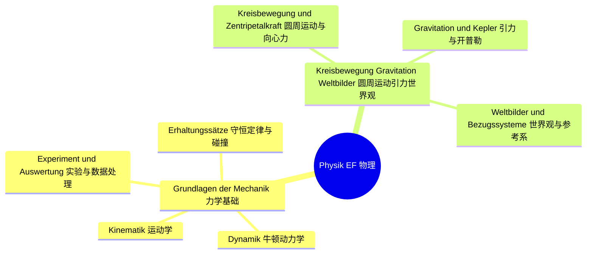
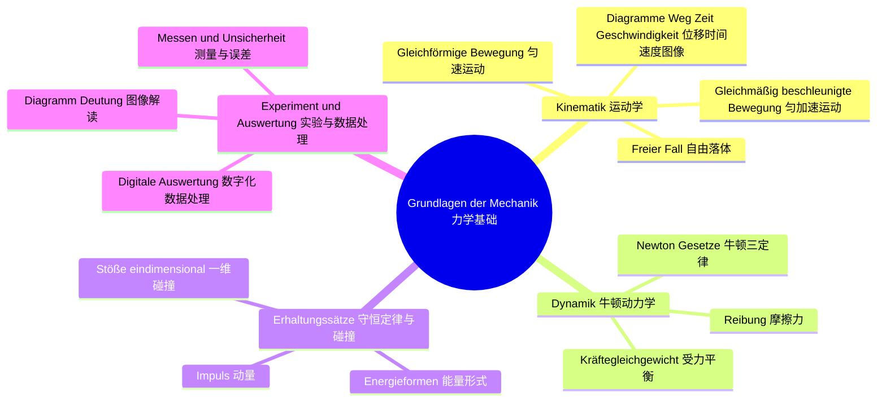
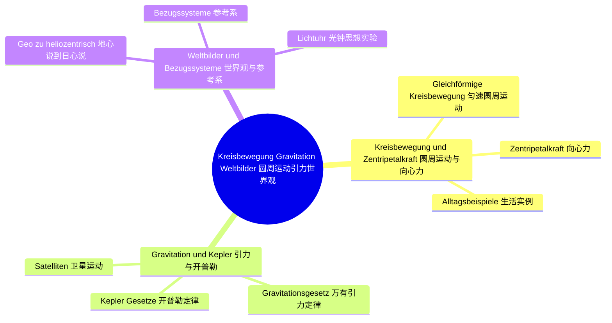

# Lernbaum Physik EF（物理 EF 学习树）

> 中文导读：EF 物理 = 经典力学 + 圆周运动/引力/世界观；永远走"现象→实验→公式→评价"四步，实验分析与图像解读是必考。
> KLP 依据：NRW KLP Physik 2022。Klausur-Fokus：Experiment-Auswertung + Diagramm-Deutung Pflicht；Lösungsweg gegeben/gesucht→Ansatz→Rechnung→Bewertung。

## 1. 总览（L0→L1→L2）

## 2. 分 IF 展开（L1→L2→L3）

### IF 1：Grundlagen der Mechanik

### IF 2：Kreisbewegung, Gravitation, Weltbilder

## 3. 节点明细（中文在上，德语在下）

### IF 1 Grundlagen der Mechanik（力学基础）

#### L2 Kinematik（运动学）

- **Gleichförmige Bewegung（匀速运动）**
  - 中文一句话：速度不变的运动，位移正比于时间，是后面一切运动分析的起点。
  - `Operatoren: [beschreiben, berechnen, darstellen]`
  - `Klausur-Anbindung: 基础计算+图像题；s-t-/v-t-Diagramm lesen und Weg berechnen（AFB I）。`
  - `Leitfrage DE / ZH: Woran erkennt man eine gleichförmige Bewegung im Diagramm? / 如何从图像认出匀速运动？`

- **Gleichmäßig beschleunigte Bewegung（匀加速运动）**
  - 中文一句话：加速度不变的运动，速度线性增、位移二次增，公式只在初条件清楚时才好用。
  - `Operatoren: [beschreiben, berechnen, begründen]`
  - `Klausur-Anbindung: 标准计算题；gegeben/gesucht→Formelwahl→Rechnung mit Einheiten。`
  - `Leitfrage DE / ZH: Wie hängen Weg, Zeit und Beschleunigung zusammen? / 位移、时间和加速度有什么关系？`

- **Freier Fall（自由落体）**
  - 中文一句话：忽略空气阻力后竖直方向的匀加速运动，是匀加速公式最干净的应用。
  - `Operatoren: [beschreiben, berechnen, auswerten]`
  - `Klausur-Anbindung: 实验+计算综合；Fallzeit messen, g bestimmen, Abweichung bewerten。`
  - `Leitfrage DE / ZH: Warum fällt alles im Vakuum gleich schnell? / 为什么真空中所有东西下落一样快？`

- **Diagramme: Weg, Zeit, Geschwindigkeit（位移—时间—速度图像）**
  - 中文一句话：斜率读速度、面积读位移，三种图像能互推，这是考试必考的"翻译"能力。
  - `Operatoren: [auswerten, deuten, darstellen]`
  - `Klausur-Anbindung: Diagramm-Deutung Pflicht；Steigung/Fläche deuten, Graphen umzeichnen。`
  - `Leitfrage DE / ZH: Was bedeuten Steigung und Fläche im Diagramm? / 图像中的斜率和面积代表什么？`

#### L2 Dynamik（牛顿动力学）

- **Newton'sche Gesetze（牛顿三定律）**
  - 中文一句话：惯性定律说状态保持、F=ma 说如何改变、作用反作用说力总是成对出现。
  - `Operatoren: [nennen, beschreiben, erklären]`
  - `Klausur-Anbindung: 概念解释题；Alltagsphänomen einem Newton-Gesetz zuordnen（AFB I–II）。`
  - `Leitfrage DE / ZH: Welches Newton-Gesetz erklärt das Phänomen? / 这个现象用牛顿哪条定律解释？`

- **Kräftegleichgewicht（受力平衡）**
  - 中文一句话：合力为零则静止或匀速，先画受力图再列平衡方程，顺序不能反。
  - `Operatoren: [darstellen, begründen, berechnen]`
  - `Klausur-Anbindung: 受力分析题；Kräfteplan zeichnen, Gleichgewicht begründen。`
  - `Leitfrage DE / ZH: Wie zeigt man Kräftegleichgewicht? / 如何证明受力平衡？`

- **Reibung（摩擦力）**
  - 中文一句话：摩擦力与接触面和正压力有关，静摩滑动摩要分清，它是实验误差的常客。
  - `Operatoren: [beschreiben, erklären, bewerten]`
  - `Klausur-Anbindung: 实验评价题；Reibung als Fehlerquelle benennen und bewerten。`
  - `Leitfrage DE / ZH: Wie beeinflusst Reibung Messung und Bewegung? / 摩擦如何影响测量和运动？`

#### L2 Erhaltungssätze（守恒定律与碰撞）

- **Energieformen: Lage, Bewegung, Spannung（能量形式：势能、动能、弹性势能）**
  - 中文一句话：能量只转化不消失，先认清每一步是哪种能量在互相转化。
  - `Operatoren: [nennen, beschreiben, berechnen]`
  - `Klausur-Anbindung: 能量计算题；Energieumwandlung beschreiben, Größen berechnen。`
  - `Leitfrage DE / ZH: Welche Energieformen wandeln sich um? / 哪些能量形式在互相转化？`

- **Impuls（动量）**
  - 中文一句话：质量乘速度的矢量，没有外冲量时系统总动量守恒，是分析碰撞的钥匙。
  - `Operatoren: [beschreiben, erklären, berechnen]`
  - `Klausur-Anbindung: 守恒应用题；Impulserhaltung als Ansatz wählen und begründen。`
  - `Leitfrage DE / ZH: Wann bleibt der Impuls erhalten? / 动量何时守恒？`

- **Stoßvorgänge eindimensional（一维碰撞）**
  - 中文一句话：一维碰撞分弹性非弹性，用动量守恒加能量条件联立求解碰后速度。
  - `Operatoren: [auswerten, berechnen, bewerten]`
  - `Klausur-Anbindung: 综合大题；Stoß auswerten, elastisch vs. unelastisch unterscheiden。`
  - `Leitfrage DE / ZH: Elastisch oder unelastisch — woran erkennt man es? / 如何区分弹性与非弹性碰撞？`

#### L2 Experiment und Auswertung（实验与数据处理）

- **Messen und Unsicherheit（测量与误差）**
  - 中文一句话：每个测量值都有不确定度，多次测量取平均，误差要诚实写出。
  - `Operatoren: [beschreiben, auswerten, bewerten]`
  - `Klausur-Anbindung: 实验题开头；Messunsicherheit angeben, Fehlerquellen nennen。`
  - `Leitfrage DE / ZH: Woher kommt die Messunsicherheit? / 测量不确定度从哪里来？`

- **Digitale Messdatenauswertung（数字化数据处理）**
  - 中文一句话：用传感器和软件采集运动数据，拟合曲线求参数，比手工描点更准更快。
  - `Operatoren: [auswerten, darstellen, beschreiben]`
  - `Klausur-Anbindung: Experiment-Auswertung Pflicht；Messdaten fitten, Parameter bestimmen。`
  - `Leitfrage DE / ZH: Wie gewinnt man aus Messdaten eine physikalische Größe? / 如何从测量数据得到物理量？`

- **Diagramm-Deutung（图像解读）**
  - 中文一句话：看到曲线先说趋势再说物理意义，最后回扣假设，这是物理表达的基本功。
  - `Operatoren: [auswerten, deuten, bewerten]`
  - `Klausur-Anbindung: 必考环节；Diagramm beschreiben→deuten→Hypothese bewerten。`
  - `Leitfrage DE / ZH: Was sagt das Diagramm über die Hypothese? / 图像对假设说了什么？`

### IF 2 Kreisbewegung, Gravitation, Weltbilder（圆周运动、引力、世界观）

#### L2 Kreisbewegung und Zentripetalkraft（圆周运动与向心力）

- **Gleichförmige Kreisbewegung（匀速圆周运动）**
  - 中文一句话：速率不变但方向时刻变，有周期频率角速度一套新描述量。
  - `Operatoren: [beschreiben, berechnen, darstellen]`
  - `Klausur-Anbindung: 基础计算；Umlaufdauer, Frequenz, Bahngeschwindigkeit berechnen。`
  - `Leitfrage DE / ZH: Was bleibt bei der Kreisbewegung konstant und was nicht? / 圆周运动中什么不变、什么在变？`

- **Zentripetalkraft（向心力）**
  - 中文一句话：向心力不是新的力，而是合力指向圆心的分量，离心力只是惯性错觉。
  - `Operatoren: [erklären, begründen, berechnen]`
  - `Klausur-Anbindung: 高频解释+计算；Zentripetalkraft herleiten und anwenden（AFB II）。`
  - `Leitfrage DE / ZH: Woher kommt die Zentripetalkraft? / 向心力从哪里来？`

- **Alltagsbeispiele（生活实例）**
  - 中文一句话：转弯汽车、旋转木马、洗衣机，认出每种情景里谁在提供向心力。
  - `Operatoren: [erklären, bewerten, beschreiben]`
  - `Klausur-Anbindung: 情境评价题；Alltagsbeispiel mit Zentripetalkraft erklären, Sicherheit bewerten。`
  - `Leitfrage DE / ZH: Wer liefert hier die Zentripetalkraft? / 这个情景里谁提供向心力？`

#### L2 Gravitation und Kepler（引力与开普勒）

- **Newton'sches Gravitationsgesetz（万有引力定律）**
  - 中文一句话：引力与质量成正比、与距离平方成反比，地面重力只是它的特例。
  - `Operatoren: [beschreiben, berechnen, begründen]`
  - `Klausur-Anbindung: 计算题；Gravitationskraft berechnen, Bezug zu g herstellen。`
  - `Leitfrage DE / ZH: Wie hängt die Schwerkraft vom Abstand ab? / 重力如何随距离变化？`

- **Kepler'sche Gesetze（开普勒定律）**
  - 中文一句话：轨道是椭圆、面积速度不变、周期平方正比于半长轴立方，描述行星如何运动。
  - `Operatoren: [nennen, beschreiben, auswerten]`
  - `Klausur-Anbindung: 数据分析题；Kepler-Gesetze an Planetendaten prüfen。`
  - `Leitfrage DE / ZH: Was sagen die Kepler-Gesetze über Planetenbahnen? / 开普勒定律说了行星轨道的什么？`

- **Satelliten（卫星运动）**
  - 中文一句话：卫星是引力恰好提供向心力的圆周运动，由此算出轨道速度和高度。
  - `Operatoren: [erklären, berechnen, bewerten]`
  - `Klausur-Anbindung: 综合应用题；geostationär vs. niedrig, Bahnhöhe berechnen。`
  - `Leitfrage DE / ZH: Warum fällt ein Satellit nicht herunter? / 卫星为什么不掉下来？`

#### L2 Weltbilder und Bezugssysteme（世界观与参考系）

- **Wandel geo→heliozentrisch（地心说到日心说的转变）**
  - 中文一句话：从地心到日心不只是换中心，更是从"眼见为实"到"模型解释"的科学革命。
  - `Operatoren: [beschreiben, erklären, bewerten]`
  - `Klausur-Anbindung: 评价题；Modellwechsel begründen, Evidenz bewerten（AFB II–III）。`
  - `Leitfrage DE / ZH: Warum setzte sich das heliozentrische Modell durch? / 日心说为什么胜出？`

- **Bezugssysteme（参考系）**
  - 中文一句话：运动描述依赖观察者，选对参考系能让难题变简单。
  - `Operatoren: [beschreiben, erklären, begründen]`
  - `Klausur-Anbindung: 理解题；Bewegung aus zwei Bezugssystemen beschreiben。`
  - `Leitfrage DE / ZH: Wie ändert das Bezugssystem die Beschreibung? / 参考系如何改变运动描述？`

- **Lichtuhr-Gedankenexperiment（光钟思想实验）**
  - 中文一句话：运动的光钟走得慢，由此引出光速不变，是相对论的 EF 级预告。
  - `Operatoren: [beschreiben, erklären, deuten]`
  - `Klausur-Anbindung: 思想实验解读；Lichtuhr beschreiben, Invarianz von c deuten。`
  - `Leitfrage DE / ZH: Was zeigt die Lichtuhr über Lichtgeschwindigkeit? / 光钟说明了光速的什么？`
