# Lernbaum Physik（物理学习树 · EF→Abitur）

> 中文一句话：EF 只打「一维力学 + 圆周运动/引力/世界图景」两根地基；**Q 阶段 GK 与 LK 走两条不同的课程架构**（不是「LK = GK + 加料」）；终点是**一套 4 题选 3 题**、**AFB II 为重心**、**禁止纯论述型任务**的 Abitur。
> KLP-Basis：[`Curriculum/Deutschland/Physik-Oberstufe.md`](../Curriculum/Deutschland/Physik-Oberstufe.md)（NRW KLP Physik，Heft `4721`，版本 `2022/23`，PDF `gost_klp_ph_2022_06_07.pdf`，自 2022-08-01 从 EF 逐级生效）[已验证]
> Klausur-Fokus：EF 平时 Klausur **1–2 次 × 90 min**（实验/实践可 +45 min）；Q 阶段依 GK/LK 区间（实验可 +60 min）→ Abitur **GK 255 min / LK 300 min**（含 Auswahlzeit，含 fachpraktische Anteile 时可延长且须在题目中载明）[已验证]
> Abitur 题型：**Aufgabenart I `Materialgebundene Aufgabe`**（可含演示实验）/ **Aufgabenart II `Fachpraktische Aufgabe`**；**一套 4 题，学生选 3 题做**，教师不预选 [已验证]
> ⚠️ **物理独有的硬约束**：`Eine ausschließlich aufsatzartig zu bearbeitende Aufgabenstellung … ist nicht zulässig.` —— **纯论述型（无材料、无实验关联）任务不允许**，任何答案必须挂靠材料或实验 [已验证]
> 四维骨架：物理是 **4 个 Kompetenzbereich**（Sach / Erkenntnisgewinnung / Kommunikation / Bewertung）× **Inhaltsfelder**，外加 **KMK 规定的 4 个 `Basiskonzepte`** 作为跨 IF 第四条轴 [已验证]
> ⚠️ Operatoren：物理属 NRW 的 **B 组科**——官方明写「所有 Operatoren 原则上可涉三个 AFB」，**不按动词分配 AFB**，层级由任务情境与材料决定 [已验证]

---

## 0. Methoden-Profil（方法论画像 —— 本设计第二核心）

**① Abitur 能力权重**（AFB 分布）

| AFB | 层级 | 本课权重（GK / LK） | 说明 |
|---|---|---|---|
| **I** | Reproduktion | ~20% / ~15% | 定义复述（`angeben/nennen`）、公式直用、场线图指认、谱线/衰变数据读取；材料题第一小问 |
| **II** | Reorganisation und Transfer | ~55% / ~50% | **法定重心**：把 EF 力学工具**转移到电学/量子/核语境**（平抛→电场偏转、圆周→Lorentzkraft）、实验数据 Auswertung、Induktionsgesetz 应用 |
| **III** | Reflexion und Problemlösung | ~25% / ~35% | `bewerten`（含价值/规范/利益）、实验方案 `planen`、模型局限说明、DGL 推导与假设检验、核能与废物处置的多源论证 |

> 权重数字为本项目按题型结构推算 → [据推断]；「**所有 AFB 必现、AFB II 构成重心**」为 KLP 明文 → [已验证]。
> GK→LK 的差别不是「多学了什么」，而是**两套不同 IF 架构 + 同一内容上被要求的认知层数**：LK 的 `planen`（自行设计实验）与 `herleiten`（DGL/Bragg/衰变律推导）密度显著更高 [已验证]。

**② 黄金学习法**（证据全部来自 `00_META/Lernmethoden-Evidenz.md`，不自创）

| 方法 | 证据来源 | 本课应用方式 |
|---|---|---|
| 检索练习（Practice Testing） | Dunlosky 2013「hoch」· Karpicke & Blunt 2011 d≈1.0 | 合书默写「平抛四式 / 圆周七量互推 / 守恒律选择三判据」；"看懂了"不算会 |
| 间隔重复（Distributed Practice） | Dunlosky「hoch」· FSRS retention 0.9 + 3 次重学 | 术语卡与公式卡（**EF-2 与 Q 阶段 8 个 IF 全部零笔记，先建卡再写笔记**） |
| 自我解释（Self-Explanation，带扶手） | Wittwer & Renkl 2010；空泛自解释 β≈−0.24（**有害**） | 物理最吃这一条：每道例题只问两句「这一步用哪条定律？」「为什么这一步合法？」——**不问"你怎么想的"** |
| 交错练习（Interleaving） | Rohrer & Taylor 2007 d≈1.34；Rohrer et al. 2020 d≈0.83 | **力学 / 电学 / 量子 / 核混排**（Abitur 一套 4 题选 3，本就跨 IF），绝不做同类题十连刷 |
| 对比辨别（Discriminative Contrast） | Foster 2019：混淆率 46% → 10% | `Feldstärke E` vs `Spannung U` vs `Energie W`；`elastisch` vs `unelastisch`；`beurteilen`（Sachurteil）vs `bewerten`（Werturteil）；`Interferenz` vs `Beugung` |
| 正确例题 + 带扶手自解释 | Barbieri 2023 g≈0.48 | 新题型首学 = 1 道正确例题（分步标规则）+ 两问自解释；LK 的 DGL 推导题必须先看一遍标准推导 |
| 测试格式对齐（TAP） | Adesope 2017：一致 g≈0.63 > 不一致 g≈0.53 | 平时练习就按 **255/300 min 的 4 选 3** 结构计时，题干一律用官方 25 动词 |
| 反馈三层（KR → 延迟 → 过程） | Brummer 2024 g≈0.41，其中 KR g≈0.64 | 先判对错 → 整套做完再展开 → 错因归类（**辨别错 / 知识错 / 表达错**） |
| 先行组织者（Advance Organizer） | Ausubel（设计总纲 §2.2） | 每个 L2 开头先看「这一块在 Abitur 哪一道题、属于 GK 还是 LK 路线」 |
| 认知负荷管理（CLT） | Sweller（设计总纲 §2.2） | 长链条题（建模 + 矢量分解 + 求值 + Bewertung）先拆 Teilschritte 再落笔 |
| 一图一概念（CTML） | Mayer · Cromley 2025 g≈0.37 | 场线图/能级图/衰变曲线一图只讲一个概念，装饰图不进库 |

**③ 三大典型失分点**

1. **`bewerten` 写成了学科内评判 —— 直接丢 AFB III**。KLP 明文：`rein innerfachliche Bewertungen`（模型适用性、实验结果优劣、专业论证正确性）**归其他三个能力领域，不归 Bewertung**。写「这个模型在什么条件下适用」不得分；必须落到**价值 / 规范 / 利益**（经济、生态、社会、政治、伦理），并 `lokal und global` 权衡 [已验证]。
2. **矢量性与过程缺失**：`Impuls` / `Feldstärke` / `Lorentzkraft` / `Induktionsspannung` 只写大小不写方向与符号；`berechnen` 的官方定义是「**从某个 Ansatz 出发呈示计算过程**」，只给数值不给分；单位漏写 → `Darstellungsleistung` 扣分 [已验证/据推断]。
3. **卡在两条最高价值台阶上**：EF 停在「场 = 场线图」「最深工具 = 由图表求 v/a」，而 LK-1 一上来就要 `Coulomb'sches Gesetz` + `elektrisches Potential`、LK-2 要求**自行推导** DGL。**EF 对这两条完全无前置** [已验证]。

> 附加判分边界（成本最低、收益最直接，建议做成一张卡）：**实验的规划/构思归 `Erkenntnisgewinnung`，按指导做实验归 `Sachkompetenz`**；**数学与公式表述不归 `Kommunikation`**（写推导不算"沟通能力"）[已验证]。

**④ 本课笔记结构模板**

> 每篇物理笔记固定八段：
> ① 一句话中文定义 · ② 术语三元组 `DE / CN / EN`（Q 阶段术语卡缺口最大）· ③ **Basiskonzept 落点**（四轴中命中哪一条，这是德国作答的"官方得分语言"）· ④ **标准解题程序**（编号步骤 + 每步标注"这一步用的 KLP 工具"）· ⑤ 一道**正确例题**（分步标规则，供首学 + 带扶手自解释）· ⑥ 3 道 **Operator 题干练习**（含 `begründen` 至少 1 道；若为 Bewertung 节点须含 `bewerten`）· ⑦ Fehlerquelle 三行（辨别错 / 知识错 / 表达错）· ⑧ **材料或实验挂靠说明**（物理禁止纯论述题 → 每篇须写明"这个知识点在材料题/实验题里以什么形态出现"）+ 上下游节点链接（本树节点 id）。
> 配图遵守「一图一概念」（Mayer CTML）；场线图与能级图手绘复述优先于抄图。

---

## 1. 总览 Gesamtübersicht（L0→L1→L2）

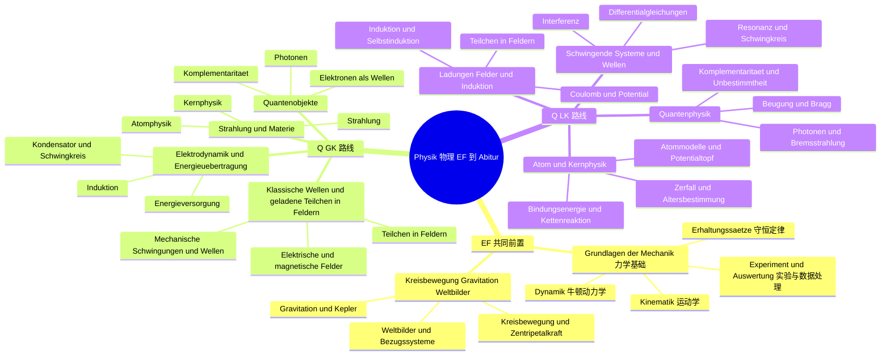
```mermaid
mindmap
  root((Physik 物理 EF 到 Abitur))
    EF 共同前置
      Grundlagen der Mechanik 力学基础
        Kinematik 运动学
        Dynamik 牛顿动力学
        Erhaltungssaetze 守恒定律
        Experiment und Auswertung 实验与数据处理
      Kreisbewegung Gravitation Weltbilder
        Kreisbewegung und Zentripetalkraft
        Gravitation und Kepler
        Weltbilder und Bezugssysteme
    Q GK 路线
      Klassische Wellen und geladene Teilchen in Feldern
        Mechanische Schwingungen und Wellen
        Elektrische und magnetische Felder
        Teilchen in Feldern
      Quantenobjekte
        Photonen
        Elektronen als Wellen
        Komplementaritaet
      Elektrodynamik und Energieuebertragung
        Induktion
        Energieversorgung
        Kondensator und Schwingkreis
      Strahlung und Materie
        Strahlung
        Atomphysik
        Kernphysik
    Q LK 路线
      Ladungen Felder und Induktion
        Coulomb und Potential
        Teilchen in Feldern
        Induktion und Selbstinduktion
      Schwingende Systeme und Wellen
        Differentialgleichungen
        Resonanz und Schwingkreis
        Interferenz
      Quantenphysik
        Photonen und Bremsstrahlung
        Beugung und Bragg
        Komplementaritaet und Unbestimmtheit
      Atom und Kernphysik
        Atommodelle und Potentialtopf
        Zerfall und Altersbestimmung
        Bindungsenergie und Kettenreaktion
```

> ⚠️ **本树最重要的结构事实**：**GK 的 4 个 IF 与 LK 的 4 个 IF 不是同一套**——覆盖面重叠但**标题与切分方式完全不同**。EF 的 2 个 IF 才是两种 Kursart 的**共同前置**。**禁止按 GK 的 IF 名去规划 LK 笔记** [已验证]。
> 📌 **第四条轴 `Basiskonzepte`（KMK Bildungsstandards 规定，共 4 个）** [已验证]：`Erhaltung und Gleichgewicht`（守恒与平衡）· `Superposition und Komponenten`（叠加与分量）· `Mathematisieren und Vorhersagen`（数学化与预测）· `Zufall und Determiniertheit`（随机与确定性）。
> 🎯 **`Erhaltung und Gleichgewicht` 是全科最长的一条链**：EF 力学 → GK/LK 电动力学 → 量子（GK-2 的 E+G 落点）→ 核物理（质量亏损 → 守恒原理的广义化）。**做跨领域笔记首选这条轴**。
> ⚠️ 各 IF 的 Basiskonzept 分布**不均**：GK `Elektrodynamik…` 与 LK `Ladungen…`/`Schwingende…`/`Quantenphysik` **无 Z+D 条目**；GK `Elektrodynamik…` 与 LK `Quantenphysik` **无 E+G 条目** [已验证]。

> **Fehlerquelle 行的来源说明**：凡可由 KLP 明文推出的标 [已验证]；本项目按中国学生常见错误预判的标 [据推断]。

---

## 2. 分 IF 展开（L1→L2→L3 + 应试四行）

### L1-EF-1：Grundlagen der Mechanik（力学基础）`[EF]`

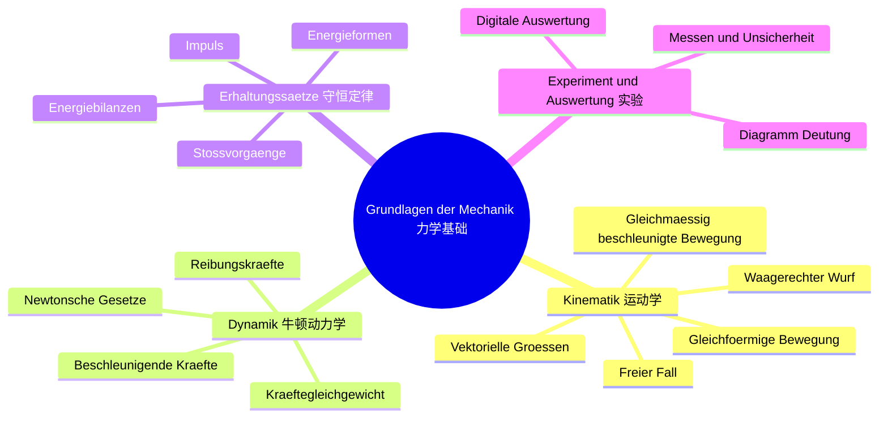
```mermaid
mindmap
  root((Grundlagen der Mechanik 力学基础))
    Kinematik 运动学
      Gleichfoermige Bewegung
      Gleichmaessig beschleunigte Bewegung
      Freier Fall
      Waagerechter Wurf
      Vektorielle Groessen
    Dynamik 牛顿动力学
      Newtonsche Gesetze
      Kraeftegleichgewicht
      Beschleunigende Kraefte
      Reibungskraefte
    Erhaltungssaetze 守恒定律
      Energieformen
      Energiebilanzen
      Impuls
      Stossvorgaenge
    Experiment und Auswertung 实验
      Messen und Unsicherheit
      Digitale Auswertung
      Diagramm Deutung
```

> Basiskonzept 落点 [已验证]：E+G（动量与机械能是首批可严格记账的守恒量）· S+K（v/a/F/p 为矢量，分量分解）· M+V（表格/图/定律三形式）· Z+D（真实测量值的统计不确定度）。

#### L2 EF-1a — Kinematik（运动学）`[EF]`

- **Gleichförmige Bewegung（匀速运动）** `[EF]` · `PH-EF1-01`
  - 中文一句话：速度不变的运动，位移正比于时间，是后面一切运动分析的起点。
  - Klausur-Anbindung：材料题第一小问；s-t / v-t 图互读与 Weg 计算（AFB I）。
  - Operatoren：angeben, beschreiben, berechnen
  - Lernweg ZH：检索练习（合书默画 s-t 与 v-t 两图并互推）+ 对比辨别（匀速 vs 匀加速两图并列）。
  - Fehlerquelle：把 s-t 图的斜率当成速度变化；平均速度与瞬时速度混用 [据推断]。
  - 📓 笔记：[`Gleichfoermige-Bewegung-Training`](../../04_Physik/Gleichfoermige-Bewegung-Training.md) ✅

- **Gleichmäßig beschleunigte Bewegung（匀加速运动）** `[EF]` · `PH-EF1-02`
  - 中文一句话：加速度不变的运动，速度线性增、位移二次增，公式只在初条件清楚时才好用。
  - Klausur-Anbindung：标准计算题；gegeben/gesucht → Formelwahl → Rechnung mit Einheiten（AFB I–II）。
  - Operatoren：berechnen, begründen, darstellen
  - Lernweg ZH：正确例题精读（三式选一式 + 说明为什么选它）+ 检索练习默公式链。
  - Fehlerquelle：不看初速度直接套 `s = ½at²`；单位不写 → Darstellungsleistung 扣分 [据推断]。
  - 📓 笔记：[`Gleichmaessig-beschleunigte-Bewegung-Freier-Fall`](../../04_Physik/Gleichmaessig-beschleunigte-Bewegung-Freier-Fall.md) ✅

- **Freier Fall（自由落体）** `[EF]` · `PH-EF1-03`
  - 中文一句话：忽略空气阻力后竖直方向的匀加速运动，是匀加速公式最干净的应用。
  - Klausur-Anbindung：实验 + 计算综合；Fallzeit messen → g bestimmen → Abweichung bewerten（AFB I–II，末段可上 AFB III）。
  - Operatoren：auswerten, berechnen, bewerten
  - Lernweg ZH：TAP 对齐（按实验题格式写完整 Auswertung）+ 反馈三层（先判对错再看标准答案）。
  - Fehlerquelle：把 `g` 的正负号随坐标系改变而写错；把「忽略空气阻力」当成无误差来源而不作 Bewertung [据推断]。
  - 📓 笔记：[`Gleichmaessig-beschleunigte-Bewegung-Freier-Fall`](../../04_Physik/Gleichmaessig-beschleunigte-Bewegung-Freier-Fall.md) ✅

- **Waagerechter Wurf（平抛）** `[EF]` · `PH-EF1-04`
  - 中文一句话：水平匀速 + 竖直匀加速的**二维运动**，是 EF 唯一的二维载体，也是进入 Q 阶段电场的唯一踏板。
  - Klausur-Anbindung：EF 综合计算题（AFB II）；**KLP 明示要求**用分量分解与矢量加法处理 [已验证]。同时是台阶③的唯一前置。
  - Operatoren：berechnen, beschreiben, herleiten
  - Lernweg ZH：先行组织者（先立「水平/竖直两栏对照表」）+ 正确例题精读。
  - Fehlerquelle：两方向的时间不共用；落地条件写成 `y=0` 却忘记先求 t [据推断]。
  - 🇨🇳 CN-Methode：平抛 → 电场中偏转的**同构翻译** · DE-Anschluss: `waagerechter Wurf`（EF-1 已教）· `Komponentenzerlegung`（EF-1 已教）· `Newton'sche Gesetze`（EF-1）· Q 阶段只需补 `F = qE` → `a = qE/m`（GK-1 有 `E = F/Q` 定义式，LK-1 有 `Coulomb'sches Gesetz`）· 合规性: ✅
  - 备注：**性价比最高的前置补强**。EF 已教完分解方法，只需补「力 → 加速度」一步；`g → qE/m` 一旦替换，平抛的全部现成结论（抛物线、偏转角、侧移）可直用。这个技法本身就是 AFB II 的定义（`Übertragen auf vergleichbare neue Zusammenhänge`）。
  - 📓 笔记：[`Gleichmaessig-beschleunigte-Bewegung-Freier-Fall`](../../04_Physik/Gleichmaessig-beschleunigte-Bewegung-Freier-Fall.md) ✅（含平抛轨迹）；专项同构翻译卡 ⚠️ 缺口

- **Vektorielle Größen und Komponentenzerlegung（矢量与分量分解）** `[EF]` · `PH-EF1-05`
  - 中文一句话：v / a / F / p 都是矢量，复杂运动靠分解成两个独立方向处理。
  - Klausur-Anbindung：贯穿 EF-1 与 EF-2 的**必用工具**；KLP 明示 `Komponentenzerlegung bzw. Vektoraddition` [已验证]，也是 Basiskonzept `Superposition und Komponenten` 的第一个落点。
  - Operatoren：darstellen, berechnen, begründen
  - Lernweg ZH：对比辨别（矢量 vs 标量清单）+ 检索练习（任意斜面/绳索受力图限时分解）。
  - Fehlerquelle：只写大小不写方向；分解时把角度取成与斜面的夹角而非与水平的夹角 [据推断]。
  - 📓 笔记：⚠️ **缺口**（Curriculum §8 已点名：缺「矢量作为独立概念」的一般方法训练）

#### L2 EF-1b — Dynamik（牛顿动力学）`[EF]`

- **Newton'sche Gesetze（牛顿三定律）** `[EF]` · `PH-EF1-06`
  - 中文一句话：惯性定律说状态保持、`F = ma` 说如何改变、作用反作用说力总是成对出现。
  - Klausur-Anbindung：概念解释题；把日常现象归入某条定律并 `erklären`（AFB I–II）。
  - Operatoren：nennen, beschreiben, erklären
  - Lernweg ZH：自我解释（带扶手：「这个现象里受力物体是谁、施力物体是谁？」）+ 间隔重复（三定律卡）。
  - Fehlerquelle：把「作用力与反作用力」说成一对平衡力（作用在不同物体上，不能抵消）——**经典辨别错** [据推断]。
  - 📓 笔记：[`Newtonsche-Gesetze-und-Krafte`](../../04_Physik/Newtonsche-Gesetze-und-Krafte.md) ✅

- **Kräftegleichgewicht（受力平衡）** `[EF]` · `PH-EF1-07`
  - 中文一句话：合力为零则静止或匀速；先画受力图、再列平衡方程，顺序不能反。
  - Klausur-Anbindung：受力分析题；Kräfteplan zeichnen → Gleichgewicht begründen（AFB I–II）。
  - Operatoren：darstellen, begründen, berechnen
  - Lernweg ZH：正确例题精读（三步：受力图 → 分解 → 方程）+ 检索练习（遮图重画）。
  - Fehlerquelle：凭空多画一个力（如"运动方向的力"）；漏掉支持力或绳索张力 [据推断]。
  - 📓 笔记：[`Newtonsche-Gesetze-und-Krafte`](../../04_Physik/Newtonsche-Gesetze-und-Krafte.md) ✅

- **Beschleunigende Kräfte（加速力与连接体/斜面系统）** `[EF]` · `PH-EF1-08`
  - 中文一句话：合力不为零则产生加速度；多物体系统要先判「能不能当成一个整体」。
  - Klausur-Anbindung：EF-1 的 AFB II 主力题型（斜面—滑块、叠放体、绳索连接体），也是「把真实装置抽象为受力系统」的建模步骤。
  - Operatoren：berechnen, erklären, beurteilen
  - Lernweg ZH：正确例题精读 + 对比辨别（同题分别用整体法与隔离法做，比较步数）。
  - Fehlerquelle：对加速度不同的系统仍用整体法；隔离后漏掉内力的反作用 [据推断]。
  - 🇨🇳 CN-Methode：整体法 / 隔离法的**显式判据**（以「系统内加速度是否相同」为二值分流准则）· DE-Anschluss: `Newton'sche Gesetze` + `Kräftegleichgewicht` + `beschleunigende Kräfte` + `Komponentenzerlegung`（**全部 EF-1 已教**）· 合规性: ✅
  - 备注：判据本身是纯逻辑（加速度同/不同），用到的方程全是 EF 已教的牛顿第二定律；德国有 `Kraft` 概念但**不训练这个判据**，中国把它做成成套程序。**当题目要求论证所选方法的适用性时（AFB III），正对 `E3 beurteilen`**。
  - 📓 笔记：[`Newtonsche-Gesetze-und-Krafte`](../../04_Physik/Newtonsche-Gesetze-und-Krafte.md) ✅；决策树卡 ⚠️ 缺口

- **Reibungskräfte（摩擦力）** `[EF]` · `PH-EF1-09`
  - 中文一句话：摩擦与接触面和正压力有关；**KLP 明文只要求 qualitativ** 说明其对真实运动的影响 [已验证]。
  - Klausur-Anbindung：实验评价题；把 Reibung 作为 Fehlerquelle benennen und bewerten（AFB II）。
  - Operatoren：beschreiben, erklären, bewerten
  - Lernweg ZH：检索练习（"实验误差来源"三条口默）+ 交错（与能量题混排）。
  - Fehlerquelle：⚠️ **引入定量摩擦定律与动摩擦因数计算** —— 超出 KLP 要求，浪费时间且不得分 [已验证]。
  - 📓 笔记：[`Newtonsche-Gesetze-und-Krafte`](../../04_Physik/Newtonsche-Gesetze-und-Krafte.md) ✅（定性层）

#### L2 EF-1c — Erhaltungssätze（守恒定律）`[EF]`

- **Energieformen: Lage-, Bewegungs-, Spannenergie（能量形式）** `[EF]` · `PH-EF1-10`
  - 中文一句话：能量只转化不消失；先认清每一步是哪种能量在互相转化。
  - Klausur-Anbindung：能量计算题；Energieumwandlung beschreiben + Größen berechnen（AFB I–II）。
  - Operatoren：nennen, beschreiben, berechnen
  - Lernweg ZH：先行组织者（三种势能一张对照表）+ 检索练习默公式与单位。
  - Fehlerquelle：把 `Spannenergie`（弹性势能）写成 `½kx` 漏平方；零势能面不说明 [据推断]。
  - 📓 笔记：[`Newtonsche-Gesetze-und-Krafte`](../../04_Physik/Newtonsche-Gesetze-und-Krafte.md) ✅（含机械能守恒）

- **Energiebilanzen und die zwei Perspektiven（能量账与「受力⇄能量」双视角）** `[EF]` · `PH-EF1-11`
  - 中文一句话：同一过程既能从受力角度算、也能从能量角度算；**KLP 明示要求两个角度都会用** [已验证]。
  - Klausur-Anbindung：EF-1 的**方法论核心**；常以"两种方法求解并比较"的形式出现（AFB II–III）。
  - Operatoren：berechnen, vergleichen, begründen
  - Lernweg ZH：对比辨别（同一题两条路径并列写完，比较哪条更短）+ 自我解释（"为什么这里能量法更省事？"）。
  - Fehlerquelle：能量账漏掉摩擦生热这一项；把「动能定理」当成独立于牛顿定律的新知识（KLP 未点名）[据推断]。
  - 📓 笔记：⚠️ **缺口**（Curriculum §8 点名：缺「双视角切换」的专门训练）

- **Impuls（动量）** `[EF]` · `PH-EF1-12`
  - 中文一句话：质量乘速度的**矢量**，无外冲量时系统总动量守恒，是分析碰撞的钥匙。
  - Klausur-Anbindung：**EF 唯一的 `Erhaltung und Gleichgewicht` 定量落点** [已验证]；也是 GK-2/LK-3「用能量与动量守恒分析光与物质相互作用」的前置。
  - Operatoren：beschreiben, erklären, berechnen
  - Lernweg ZH：检索练习（默「先定正方向 → 再列守恒式」）+ 对比辨别（动量 vs 动能：何时要方向）。
  - Fehlerquelle：矢量式忘了先定正方向，导致两个解只写一个；单位用 `kg·m/s` 却写成 `N·s` 而不说明等价 [据推断]。
  - 🇨🇳 CN-Methode：守恒律选择策略（**第一判据是矢量性**）· DE-Anschluss: `Impuls`（EF-1 已教）+ `Energie`/`Energiebilanzen`（EF-1 已教）+ 「从受力与从能量两个角度分析」（**EF-1 明文要求的双视角**）+ `vektorielle Größen`（EF-1）· 合规性: ✅
  - 备注：两条定理德国都有，缺的是**选择流程**——要方向/分量用动量（矢量式、先定正方向），只问大小用动能（标量式）；涉时间用动量定理，涉位移用动能定理；变力做功优先能量，变力冲量优先动量。零新增知识。
  - 📓 笔记：⚠️ **缺口 🔴**（现有笔记**零覆盖**，最高补缺优先级）

- **Stoßvorgänge eindimensional（一维碰撞）** `[EF]` · `PH-EF1-13`
  - 中文一句话：一维碰撞分弹性与非弹性，用动量守恒加能量条件联立求解碰后速度。
  - Klausur-Anbindung：综合大题；Stoß auswerten + elastisch/unelastisch unterscheiden（AFB II，联立解可到 AFB III）。
  - Operatoren：auswerten, berechnen, bewerten
  - Lernweg ZH：正确例题精读（两条守恒式联立）+ 交错（与能量账题混排，强迫先选定理再动笔）。
  - Fehlerquelle：弹性碰撞误用动能守恒于非弹性；完全非弹性碰撞后"共速"这一条件忘记用 [据推断]。
  - 📓 笔记：⚠️ **缺口 🔴**（建议产出《Impuls + 一维碰撞》，EF 内即可闭环）

#### L2 EF-1d — Experiment und Auswertung（实验与数据处理）`[EF]`

- **Messen und Messunsicherheit（测量与不确定度）** `[EF]` · `PH-EF1-14`
  - 中文一句话：每个测量值都有不确定度，多次测量取平均，误差要诚实写出。
  - Klausur-Anbindung：实验题**开头必写**；Messunsicherheit angeben + Fehlerquellen nennen（AFB I–II）。是 Basiskonzept `Zufall und Determiniertheit` 的 EF 落点 [已验证]。
  - Operatoren：angeben, auswerten, bewerten
  - Lernweg ZH：检索练习（默"误差来源三条 + 改进措施"）+ 反馈三层。
  - Fehlerquelle：把「系统误差」与「随机误差」混为一谈；只写"测量不准"不写具体来源 [据推断]。
  - 📓 笔记：[`Physik-IQB-EF-Training`](../../04_Physik/Physik-IQB-EF-Training.md) ✅（图表/测量已铺）

- **Digitale Messdatenauswertung（数字化数据处理）** `[EF]` · `PH-EF1-15`
  - 中文一句话：用传感器与软件采集运动数据、拟合曲线求参数；**这是 EF 数学工具的天花板** [已验证]。
  - Klausur-Anbindung：`Experiment-Auswertung` 必考环节；Messdaten fitten → Parameter bestimmen（AFB II）。
  - Operatoren：auswerten, darstellen, ermitteln
  - Lernweg ZH：TAP 对齐（按 EF Klausur 的实验题格式练）+ 带扶手自解释（"拟合出的斜率对应哪个物理量？"）。
  - Fehlerquelle：拟合后不回问"斜率的物理意义与单位"——**拿到数字就停** [据推断]。
  - 📓 笔记：[`Physik-IQB-EF-Training`](../../04_Physik/Physik-IQB-EF-Training.md) ✅

- **Diagramm-Deutung（图像解读）** `[EF]` · `PH-EF1-16`
  - 中文一句话：看到曲线先说趋势、再说物理意义、最后回扣假设——物理表达的基本功。
  - Klausur-Anbindung：必考环节（`Darstellungsaufgaben` 明文含"表、图、Diagramm 的解读"与表征形式转换）；beschreiben → deuten → Hypothese bewerten（AFB I→III）。
  - Operatoren：auswerten, deuten, interpretieren
  - Lernweg ZH：检索练习（三句话模板：趋势 / 物理意义 / 结论）+ 对比辨别（同一数据用表格 vs 图像呈现）。
  - Fehlerquelle：只描述形状不说物理量；末段不回扣假设 → AFB III 空白 [据推断]。
  - 🇨🇳 CN-Methode：图像三件套 —— **面积 / 斜率 / 截距的物理量翻译** · DE-Anschluss: `Messwerttabelle / Diagramm / Gesetz` 三表征形式（**EF-1 明文要求**）+ 由测量数据求 v/a（EF-1 天花板）+ `Q-U` 面积 = 储能（GK-3 明文）· 合规性: ✅
  - 备注：拿到任何 y-x 图固定问三句——斜率是什么量？面积是什么量？截距是什么量？由定义式与量纲反推。**德国的官方抓手比中国还显式**，本技法只是归纳成可复用清单。⚠️ 收录范围限于 KLP 内出现的图像，**不收录 `U-I` 求 `E`/`r`**（属 CN-only，见 LK/GK 的 CN-Methode 9 反例）。
  - 📓 笔记：[`Physik-IQB-EF-Training`](../../04_Physik/Physik-IQB-EF-Training.md) ✅；三问清单卡 ⚠️ 缺口

---

### L1-EF-2：Kreisbewegung, Gravitation und physikalische Weltbilder（圆周运动、引力与物理世界图景）`[EF]`

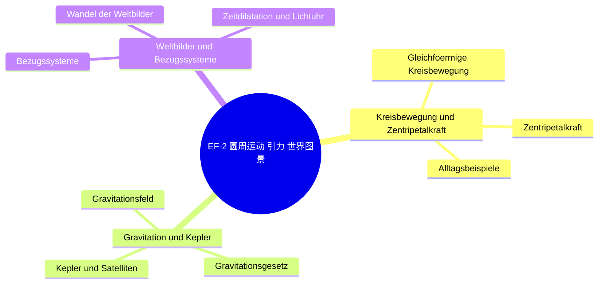
```mermaid
mindmap
  root((EF-2 圆周运动 引力 世界图景))
    Kreisbewegung und Zentripetalkraft
      Gleichfoermige Kreisbewegung
      Zentripetalkraft
      Alltagsbeispiele
    Gravitation und Kepler
      Gravitationsgesetz
      Gravitationsfeld
      Kepler und Satelliten
    Weltbilder und Bezugssysteme
      Bezugssysteme
      Wandel der Weltbilder
      Zeitdilatation und Lichtuhr
```

> Basiskonzept 落点 [已验证]：M+V（由引力定律算卫星与行星轨道数据、由开普勒定律求天文量）· Z+D（行星运动的规律性是「自然律决定论」的范例）。⚠️ **EF-2 无 E+G 条目、无 S+K 条目**。

#### L2 EF-2a — Kreisbewegung und Zentripetalkraft（圆周运动与向心力）`[EF]`

- **Gleichförmige Kreisbewegung: sieben Größen（匀速圆周运动七量）** `[EF]` · `PH-EF2-01`
  - 中文一句话：速率不变但方向时刻变；`r / φ / T / f / v / ω / a_z` **七量全上且要求相互关系** [已验证]。
  - Klausur-Anbindung：基础计算高频；由任意两量推其余五量（AFB I–II）。**是 Q 阶段 `Fadenstrahlrohr` 与 `Zyklotron` 的圆周运动基础**。
  - Operatoren：angeben, berechnen, herleiten
  - Lernweg ZH：先行组织者（一张"七量互推关系图"）+ 检索练习（限时默推）。
  - Fehlerquelle：`ω` 与 `f` 混用（`ω = 2πf` 漏 2π）；把 `v` 当常量就说"加速度为零" [据推断]。
  - 📓 笔记：⚠️ **缺口 🔴**（EF-2 整体零覆盖）

- **Zentripetalbeschleunigung und Zentripetalkraft（向心加速度与向心力）** `[EF]` · `PH-EF2-02`
  - 中文一句话：向心力不是新的力，而是合力指向圆心的分量；离心力只是惯性错觉。
  - Klausur-Anbindung：高频解释 + 计算；**KLP 要求定量**写出 `F_z` 对运动描述量的依赖（AFB II）。
  - Operatoren：erklären, begründen, berechnen
  - Lernweg ZH：自我解释（带扶手："这个情景里谁在提供向心力？"）+ 对比辨别（向心 vs 离心）。
  - Fehlerquelle：在受力图上凭空画一个"离心力"；把 `F_z = mv²/r` 的 r 取成直径 [据推断]。
  - 📓 笔记：⚠️ **缺口 🔴**

- **Alltagsbeispiele der Kreisbewegung（圆周运动的生活实例）** `[EF]` · `PH-EF2-03`
  - 中文一句话：转弯汽车、旋转木马、洗衣机脱水——认出每种情景里谁在提供向心力。
  - Klausur-Anbindung：情境评价题；Alltagsbeispiel erklären + Sicherheit bewerten（AFB II→III，Bewertung 须落到价值/规范）。
  - Operatoren：erklären, bewerten, beurteilen
  - Lernweg ZH：交错（与碰撞/能量题混排）+ 检索练习（默"向心力提供者"五例清单）。
  - Fehlerquelle：Bewertung 只谈技术层面（"摩擦力够不够"）而不谈安全/规范 → 按 §3.1 规则 4 不得分 [已验证]。
  - 📓 笔记：⚠️ **缺口**

#### L2 EF-2b — Gravitation und Kepler（引力与开普勒）`[EF]`

- **Schwerkraft und Newton'sches Gravitationsgesetz（重力与万有引力定律）** `[EF]` · `PH-EF2-04`
  - 中文一句话：引力与质量成正比、与距离平方成反比，地面重力只是它的特例。
  - Klausur-Anbindung：计算题；Gravitationskraft berechnen + Bezug zu `g` herstellen（AFB II）。
  - Operatoren：berechnen, begründen, vergleichen
  - Lernweg ZH：对比辨别（`G` 与 `g` 两个符号的层级差异）+ 检索练习默公式。
  - Fehlerquelle：把 `r` 取成高度而非到地心的距离；`G` 与 `g` 书写混淆 [据推断]。
  - 📓 笔记：⚠️ **缺口 🔴**

- **Gravitationsfeld（引力场）** `[EF]` · `PH-EF2-05`
  - 中文一句话：**KLP 把引力放在 `Feldkonzept` 框架下讲**，而非"两个质点互相吸引"——这是 **EF 唯一的「场」**，也是 LK-1 `elektrisches Potential` 的概念前身 [已验证]。
  - Klausur-Anbindung：概念解释 + 场线图题（AFB I–II）；**跨学段的枢纽节点**。
  - Operatoren：beschreiben, erklären, darstellen
  - Lernweg ZH：先行组织者（先立"场 = 每一点都有一个值"这一句话）+ 图形化自我解释。
  - Fehlerquelle：仍用"超距作用"语言描述引力；场线图疏密与场强大小的关系说反 [据推断]。
  - 📓 笔记：⚠️ **缺口 🔴**（跨 EF→LK 的枢纽，建议与 LK-1 电势合并成一张卡）

- **Kepler'sche Gesetze und Satellitenbahnen（开普勒定律与卫星轨道）** `[EF]` · `PH-EF2-06`
  - 中文一句话：轨道是椭圆、面积速度不变、周期平方正比于半长轴立方；卫星是引力恰好提供向心力的圆周运动。
  - Klausur-Anbindung：数据分析题（用行星数据检验 Kepler）+ 综合应用题（geostationär vs 低轨，Bahnhöhe berechnen）（AFB II）。
  - Operatoren：auswerten, berechnen, vergleichen
  - Lernweg ZH：正确例题精读（卫星轨道两式联立）+ 交错（与圆周运动题混排）。
  - Fehlerquelle：把"卫星不掉下来"解释成"没有引力"（实为引力全部用作向心力）——**经典概念错** [据推断]。
  - 📓 笔记：⚠️ **缺口 🔴**

#### L2 EF-2c — Weltbilder und Bezugssysteme（世界图景与参考系）`[EF]`

- **Bezugssysteme（参考系）** `[EF]` · `PH-EF2-07`
  - 中文一句话：运动描述依赖观察者，选对参考系能让难题变简单——相对论与运动描述的共同地基。
  - Klausur-Anbindung：理解题；同一运动从两个 Bezugssystem 分别 beschreiben（AFB I–II）。
  - Operatoren：beschreiben, erklären, begründen
  - Lernweg ZH：对比辨别（同一情境两个参考系并列写）+ 口语复述（口试也考）。
  - Fehlerquelle：换参考系后忘记同时换速度叠加方式 [据推断]。
  - 📓 笔记：⚠️ **缺口**

- **Wandel geo- → heliozentrisches Weltbild（地心说到日心说的转变）** `[EF]` · `PH-EF2-08`
  - 中文一句话：不只是换中心，更是从"眼见为实"到"模型解释"的科学革命。
  - Klausur-Anbindung：**跨学科写作型任务**；KLP 要求「天文观测结果 → 世界图景变迁」的论证链（`K1, K3, K10` = 检索/引述/标注出处）+ 评价其对自然科学从宗教中解放的意义（AFB II–III）。
  - Operatoren：darstellen, bewerten, begründen
  - Lernweg ZH：先行组织者（先给"观测事实 → 模型修正"时间轴）+ 检索练习（默论证链四步）。
  - Fehlerquelle：**不标注出处**（`K10` 明文要求）；把科学史写成故事而无论证链 [已验证]。
  - 📓 笔记：⚠️ **缺口**（中国必修2.3 偏定性、无"标注出处"训练 → 失分盲区）

- **Zeitdilatation und Lichtuhr（时间膨胀与光钟）** `[EF]` · `PH-EF2-09`
  - 中文一句话：运动的光钟走得慢，引出光速不变；**EF 唯一的非经典物理**，要求 **qualitativ und quantitativ** [已验证]。
  - Klausur-Anbindung：思想实验解读 + 定量计算（AFB II）；其他相对论现象**只在 Q 阶段示例性涉及**。
  - Operatoren：beschreiben, deuten, berechnen
  - Lernweg ZH：正确例题精读（光钟几何 + 勾股定理一步得出）+ 带扶手自解释（"为什么两个观察者 disagree 却不矛盾？"）。
  - Fehlerquelle：把时间膨胀说成"钟坏了"；定量题忘记用 `γ` 或把分子分母放反 [据推断]。
  - 📓 笔记：⚠️ **缺口 🔴**

---

### L1-GK-1：Klassische Wellen und geladene Teilchen in Feldern（经典波与场中的带电粒子）`[Q1][GK]`

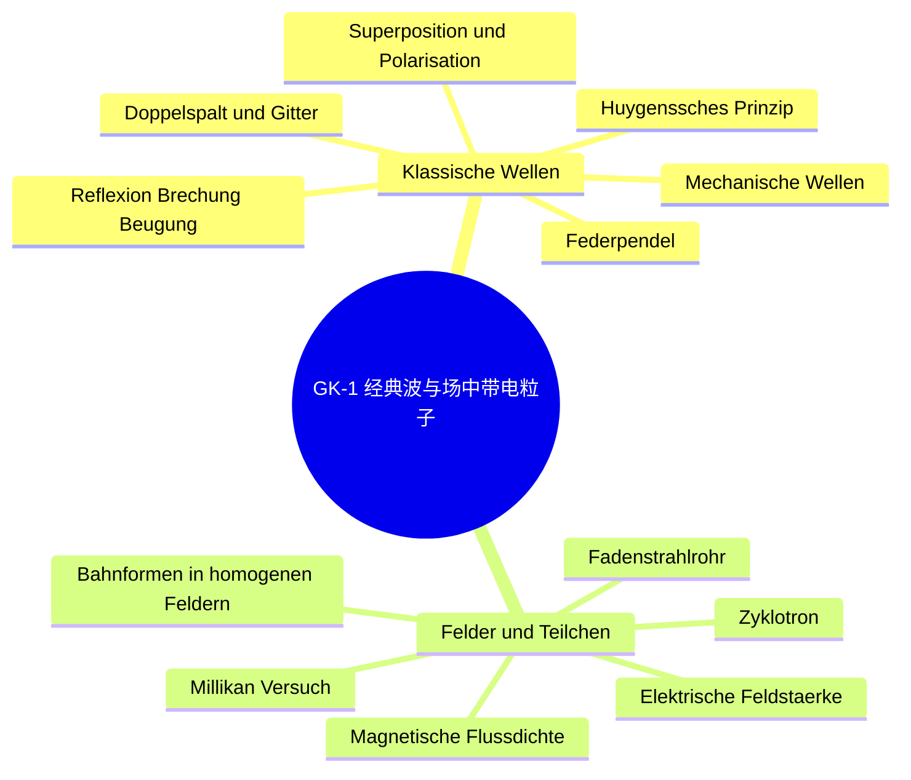
```mermaid
mindmap
  root((GK-1 经典波与场中带电粒子))
    Klassische Wellen
      Federpendel
      Mechanische Wellen
      Huygenssches Prinzip
      Reflexion Brechung Beugung
      Superposition und Polarisation
      Doppelspalt und Gitter
    Felder und Teilchen
      Elektrische Feldstaerke
      Magnetische Flussdichte
      Bahnformen in homogenen Feldern
      Fadenstrahlrohr
      Millikan Versuch
      Zyklotron
```

> Basiskonzept 落点 [已验证]：E+G（能量守恒解释机械振动的周期性状态变化）· S+K（叠加原理描述机械波的可叠加性）· M+V（由 Fadenstrahlrohr 可精确预测带电粒子轨迹）。**无 Z+D 条目**。
> ⚠️ **GK-1 只到 `Federpendel`**；`Fadenpendel`、DGL、`Resonanz`、`Schwingkreis`、`Michelson` **全部不在 GK** [已验证]。

#### L2 GK-1a — Klassische Wellen（经典波）`[Q1][GK]`

- **Federpendel und harmonische Schwingung（弹簧振子与谐振）** `[Q1][GK]` · `PH-GK1-01`
  - 中文一句话：回复力正比于位移的系统作简谐振动；GK 只到弹簧振子，**无单摆、无 DGL** [已验证]。
  - Klausur-Anbindung：GK 高频题；描述振动、算本征量、说明能量转换（AFB I–II）。**`Spannenergie`（EF-1 埋的伏笔）在此才有落点**。
  - Operatoren：beschreiben, berechnen, erklären
  - Lernweg ZH：先行组织者（先立"A/ω/T/φ 四量各管什么"）+ 对比辨别（弹簧振子 vs 一般振动）。
  - Fehlerquelle：把振幅当位移；ω 与 f 混用；**按 LK 标准去做 DGL 推导**（超范围，浪费时间）[据推断]。
  - 📓 笔记：⚠️ **缺口 🔴**

- **Mechanische Wellen und Kenngrößen（机械波与描述量）** `[Q1][GK]` · `PH-GK1-02`
  - 中文一句话：振动在空间中的传播；`v = λf`，横波与纵波要分清。
  - Klausur-Anbindung：常规计算 + 解释（AFB I–II）。
  - Operatoren：angeben, berechnen, beschreiben
  - Lernweg ZH：间隔重复（术语卡）+ 对比辨别（横波 vs 纵波 vs 物质是否随波迁移）。
  - Fehlerquelle：认为"波传播时介质质点随波一起走" [据推断]。
  - 📓 笔记：⚠️ **缺口**

- **Huygens'sches Prinzip und Wellenwanne（惠更斯原理与水波槽）** `[Q1][GK]` · `PH-GK1-03`
  - 中文一句话：每一点都是新的波源；GK 只做**水波槽定性**处理，**不要求定量波前作图** [已验证]。
  - Klausur-Anbindung：定性解释题（AFB I–II）。
  - Operatoren：erläutern, beschreiben, skizzieren
  - Lernweg ZH：图形化自我解释 + 一图一概念（波前图只画一个现象）。
  - Fehlerquelle：⚠️ 把中国的定量波前作图当成 Abitur 要求来练（超范围）[据推断]。
  - 📓 笔记：⚠️ **缺口**

- **Reflexion, Brechung, Beugung（反射、折射、衍射）** `[Q1][GK]` · `PH-GK1-04`
  - 中文一句话：波遇到界面与障碍的三种典型行为，衍射在缝宽接近波长时显著。
  - Klausur-Anbindung：现象指认与解释（AFB I–II），常与干涉同题。
  - Operatoren：beschreiben, vergleichen, begründen
  - Lernweg ZH：对比辨别（三种现象四格对照表 + "先选再做"，错则记"辨别错"）。
  - Fehlerquelle：把衍射与干涉互串；认为折射一定伴随波长改变（频率不变）[据推断]。
  - 📓 笔记：⚠️ **缺口**

- **Superposition und Polarisation（叠加与偏振）** `[Q1][GK]` · `PH-GK1-05`
  - 中文一句话：两列波相遇时位移相加；偏振证明光是横波。是 Basiskonzept `Superposition und Komponenten` 的主落点。
  - Klausur-Anbindung：解释题与作图题；**KLP 要求用 Superpositionsprinzip 自行构造场线图**（探究型任务，AFB II）。
  - Operatoren：darstellen, erklären, untersuchen
  - Lernweg ZH：正确例题精读（相长/相消的相位判据）+ 检索练习（默"光程差 = kλ / (k+½)λ"）。
  - Fehlerquelle：把"相消干涉"说成"波消失了"（能量重新分布）[据推断]。
  - 📓 笔记：⚠️ **缺口**

- **Doppelspalt und Gitter: Wellennatur und Wellenlänge（双缝与光栅）** `[Q1][GK]` · `PH-GK1-06`
  - 中文一句话：**GK 唯一的光学定量点** —— 由双缝/光栅花样证明光的波动性并求 λ（含单色与多色光）[已验证]。
  - Klausur-Anbindung：**GK 必考级**；花样读出 → 求 λ → 说明波动性（AFB II）。
  - Operatoren：auswerten, berechnen, bewerten
  - Lernweg ZH：正确例题精读 + TAP 对齐（按 GK Abitur 的材料题格式练）。
  - Fehlerquelle：把缝间距与缝宽搞混；多色光下忘记不同 λ 对应不同条纹间距 [据推断]。
  - 📓 笔记：⚠️ **缺口 🔴**（中国笔记几乎可直用，性价比高）

#### L2 GK-1b — Felder und geladene Teilchen（场与带电粒子）`[Q1][GK]`

- **Elektrische Feldstärke und Feldlinienbilder（电场强度与场线图）** `[Q1][GK]` · `PH-GK1-07`
  - 中文一句话：`E = F/Q` 是定义式；匀强场/径向场/偶极场三种场线图要会画会用。
  - Klausur-Anbindung：GK 高频；**⚠️ EF 完全无静电 → 中国学生有巨大先发优势**（中国必修3 已完成）[据推断]。
  - Operatoren：angeben, darstellen, berechnen
  - Lernweg ZH：对比辨别（三种场线图对照）+ 检索练习（默"由力之比定义新物理量"这一方法）。
  - Fehlerquelle：把 `E` 当力；场线图方向画反（由正到负）[据推断]。
  - 📓 笔记：⚠️ **缺口**

- **Magnetische Flussdichte und magnetische Felder（磁通密度与磁场）** `[Q1][GK]` · `PH-GK1-08`
  - 中文一句话：`B` 由运动电荷受力定义；磁场线是闭合曲线（无磁单极）。
  - Klausur-Anbindung：定义式应用 + 场线图指认（AFB I–II）。
  - Operatoren：angeben, beschreiben, skizzieren
  - Lernweg ZH：对比辨别（`E` 场线有头有尾 vs `B` 场线闭合）+ 间隔重复（术语卡）。
  - Fehlerquelle：把 `B` 与 `Φ`（磁通量）混为一谈 [据推断]。
  - 📓 笔记：⚠️ **缺口**

- **Bahnformen geladener Teilchen in homogenen Feldern（匀强场中的带电粒子轨迹）** `[Q1][GK]` · `PH-GK1-09`
  - 中文一句话：纵场加速、横场偏转（抛物线）、磁场中偏转（圆周）——本质是 EF 运动学的电学翻译。
  - Klausur-Anbindung：GK-1 核心；轨迹判型 + 定量求偏转量（AFB II）。
  - Operatoren：beschreiben, berechnen, herleiten
  - Lernweg ZH：先行组织者（先立"三种场 → 三种轨迹"一张表）+ 正确例题精读。
  - Fehlerquelle：把磁场中的圆周半径公式与电场中的抛物线混用；洛伦兹力方向判定用左手/右手规则搞混 [据推断]。
  - 🇨🇳 CN-Methode：**平抛 → 电场中偏转的同构翻译**（此处为 GK 落点）· DE-Anschluss: `waagerechter Wurf`（EF-1）+ `Komponentenzerlegung`（EF-1）+ `elektrische Feldstärke` 定义式 `E = F/Q`（GK-1）· 合规性: ✅
  - 备注：`g → a = qE/m` 一步替换后，平抛的全部结论（沿场匀加速、垂直场匀速、`tanθ = v⊥/v∥`、`y = ½at²`）可直用。**这是本项目性价比最高的前置补强**。
  - 📓 笔记：⚠️ **缺口 🔴**（建议与 LK-1 的 `Längs-/Querfelder` 共用同一张翻译表）

- **Fadenstrahlrohr（电子束管）** `[Q1][GK]` · `PH-GK1-10`
  - 中文一句话：辉光发射 → 电场加速 → 磁场偏转；**GK 核心实验，须由测量值求电子质量** [已验证]。
  - Klausur-Anbindung：`Fachpraktische`/材料题的明星载体；实验数据 auswerten → `m_e` bestimmen（AFB II–III）。
  - Operatoren：auswerten, berechnen, begründen
  - Lernweg ZH：正确例题精读（两步联立：`½mv² = eU` 与 `r = mv/(eB)`）+ 带扶手自解释。
  - Fehlerquelle：把加速电压 `U` 与偏转场的 `U` 混用；单位换算（eV ↔ J）出错 [据推断]。
  - 🇨🇳 CN-Methode：带电粒子偏转的**几何化轨迹链**（定圆心 → 找半径 → 算圆心角 → `t = (θ/2π)·T`；临界三圆：旋转圆/放缩圆/平移圆）· DE-Anschluss: `Lorentzkraft`（GK-1/LK-1 已教，含方向判定）+ `Zentripetalkraft` 与 `gleichförmige Kreisbewegung`（**EF-2 已教且要求定量**）+ `Komponentenzerlegung`（EF-1）+ 圆周七量（EF-2）· 合规性: ✅
  - 备注：**本项目第一价值点**。德国只做定性/半定量轨迹描述，中国把「定圆心—找半径—算圆心角—算时间」做成四步工序，且 `T = 2πm/(qB)` 与速度无关这一关键性质被显式利用。**不需要任何新知识**，只是把"说是圆"升级为"算出圆心与半径"。
  - 📓 笔记：⚠️ **缺口 🔴** ★★★ 建议产出《Lorentzkraft 轨迹几何法》

- **Millikan-Versuch（密立根实验）** `[Q1][GK]` · `PH-GK1-11`
  - 中文一句话：**GK 只要求「简化版本的统计评价」→ 推断最小电荷的存在**，不做完整定量分析 [已验证]。
  - Klausur-Anbindung：统计评价题（AFB II）；考的是"怎么从数据推出结论"，不是"算得多准"。
  - Operatoren：auswerten, begründen, ableiten
  - Lernweg ZH：正确例题精读（数据分组 → 找最大公约趋势 → 结论）+ 自我解释。
  - Fehlerquelle：⚠️ **按 LK 的"说明思路与结果"去答**（GK 只需统计推断层级）；或反过来把 GK 当成完整实验复述 [已验证]。
  - 📓 笔记：⚠️ **缺口**

- **Zyklotron（回旋加速器）** `[Q1][GK]` · `PH-GK1-12`
  - 中文一句话：磁场中回旋 + 间隙处加速；**GK 只要求借助模拟理解功能**（定性层）[已验证]。
  - Klausur-Anbindung：定性解释题（AFB I–II）；常与 Fadenstrahlrohr 成对出现。
  - Operatoren：beschreiben, erklären, bewerten
  - Lernweg ZH：图形化自我解释（先看模拟再口述原理）+ 对比辨别（GK 定性 vs LK 的相对论质量修正）。
  - Fehlerquelle：认为加速会改变回旋周期（**T 与速度无关，这正是它能工作的前提**）[据推断]。
  - 📓 笔记：⚠️ **缺口**

---

### L1-GK-2：Quantenobjekte（量子客体）`[Q1→Q2][GK]`

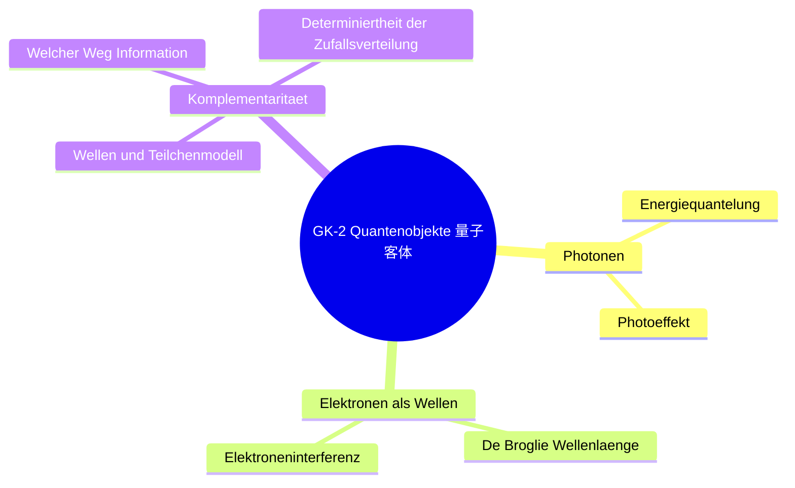
```mermaid
mindmap
  root((GK-2 Quantenobjekte 量子客体))
    Photonen
      Energiequantelung
      Photoeffekt
    Elektronen als Wellen
      De Broglie Wellenlaenge
      Elektroneninterferenz
    Komplementaritaet
      Wellen und Teilchenmodell
      Welcher Weg Information
      Determiniertheit der Zufallsverteilung
```

> Basiskonzept 落点 [已验证]：E+G · S+K（双缝相长/相消 = 量子态叠加）· M+V · **Z+D（随机分布的决定性是量子物理陈述的特征）** ← GK 唯一深入"量子随机性"的地方。
> ⚠️ GK **无** `Bragg-Reflexion`、无 `Bremsstrahlung`、无 `Wellenfunktion`、无 `Heisenberg` —— 全部是 LK 增量。

#### L2 GK-2a — Photonen（光子）`[Q1][GK]`

- **Energiequantelung des Lichts（光的能量量子化）** `[Q1][GK]` · `PH-GK2-01`
  - 中文一句话：光的能量是一份一份的，`E = hf`；这是经典波动图像无法解释的起点。
  - Klausur-Anbindung：概念论证题（AFB II）；常要求说明"与经典视角的差别"。
  - Operatoren：erklären, vergleichen, berechnen
  - Lernweg ZH：对比辨别（经典连续 vs 量子离散）+ 先行组织者（先立"一份 = 一个光子"）。
  - Fehlerquelle：把"量子化"说成"光变成了粒子小球" [据推断]。
  - 📓 笔记：⚠️ **缺口**

- **Photoeffekt（光电效应）** `[Q1][GK]` · `PH-GK2-02`
  - 中文一句话：存在截止频率、光电子动能只与频率有关——只能用光量子假设解释。
  - Klausur-Anbindung：**GK 必考**；由实验现象 → 光量子假设 → 解释经典理论的失败（AFB II）。
  - Operatoren：beschreiben, erklären, auswerten
  - Lernweg ZH：正确例题精读（`hf = W + E_kin`）+ 带扶手自解释（"为什么增大光强不改变最大动能？"）。
  - Fehlerquelle：把"光强"与"频率"的作用说反；忘记逸出功 `W` [据推断]。
  - 📓 笔记：⚠️ **缺口 🔴**

- **De-Broglie-Wellenlänge（德布罗意波长）** `[Q1][GK]` · `PH-GK2-03`
  - 中文一句话：实物粒子也有波动性，`λ = h/p`；**须定量解释电子双缝的衍射花样** [已验证]。
  - Klausur-Anbindung：GK 必考；由加速电压 → `p` → `λ` → 花样间距（AFB II）。
  - Operatoren：berechnen, herleiten, auswerten
  - Lernweg ZH：正确例题精读 + 交错（与光电效应题混排，强化"光 ↔ 物质"对称）。
  - Fehlerquelle：用动能直接代 `½mv²` 却不先由 `eU` 求 `v`；`h` 的数量级写错 [据推断]。
  - 📓 笔记：⚠️ **缺口 🔴**

- **Elektroneninterferenz am Doppelspalt（电子双缝干涉）** `[Q1][GK]` · `PH-GK2-04`
  - 中文一句话：单个电子也形成干涉花样——波动性不是"很多电子挤在一起"造成的。
  - Klausur-Anbindung：现象解释题（AFB II–III），常接 Delayed-Choice 的简版追问。
  - Operatoren：beschreiben, deuten, interpretieren
  - Lernweg ZH：自我解释（带扶手："一个电子和谁干涉？"）+ 对比辨别（经典粒子 vs 量子客体）。
  - Fehlerquelle：说成"电子之间互相干涉"（实为自身概率幅）[据推断]。
  - 📓 笔记：⚠️ **缺口**

#### L2 GK-2b — Komplementarität（互补性）`[Q2][GK]`

- **Wellen- und Teilchenmodell / Kopenhagener Deutung（波粒模型与哥本哈根解释）** `[Q2][GK]` · `PH-GK2-05`
  - 中文一句话：两种互补描述被"量子客体"这一概念**消解（Aufhebung）**；用概率陈述联结波与粒子的侧面。
  - Klausur-Anbindung：概念论证 + 认识论评价（AFB II–III）；口试经典素材。
  - Operatoren：erklären, diskutieren, bewerten
  - Lernweg ZH：口语复述（口试须连贯报告 + 问答）+ 对比辨别（互补 vs 矛盾）。
  - Fehlerquelle：把互补性说成"有时候是波有时候是粒子"的随意切换（取决于实验安排）[据推断]。
  - 📓 笔记：⚠️ **缺口**

- **Welcher-Weg-Information und Determiniertheit der Zufallsverteilung（路径信息与随机分布的决定性）** `[Q2][GK]` · `PH-GK2-06`
  - 中文一句话：一旦能知道"走了哪条路"，干涉花样就消失；单个事件随机、大量事件的分布却是确定的。
  - Klausur-Anbindung：**GK 唯一深入"量子随机性"的地方**，也是 Basiskonzept `Zufall und Determiniertheit` 的核心考点（AFB II–III）。⚠️ **GK 没有 Delayed-Choice**，只有这条更简版。
  - Operatoren：deuten, erklären, bewerten
  - Lernweg ZH：对比辨别（单事件随机 vs 分布确定——这是最经典的一组辨别）+ 正确例题精读。
  - Fehlerquelle：把"随机"说成"无规律"；把分布的确定性误述为单个事件可预测 [据推断]。
  - 📓 笔记：⚠️ **缺口**（中国无对等的内容侧统摄概念 → 必须单独建立）

---

### L1-GK-3：Elektrodynamik und Energieübertragung（电动力学与能量传输）`[Q1→Q2][GK]`

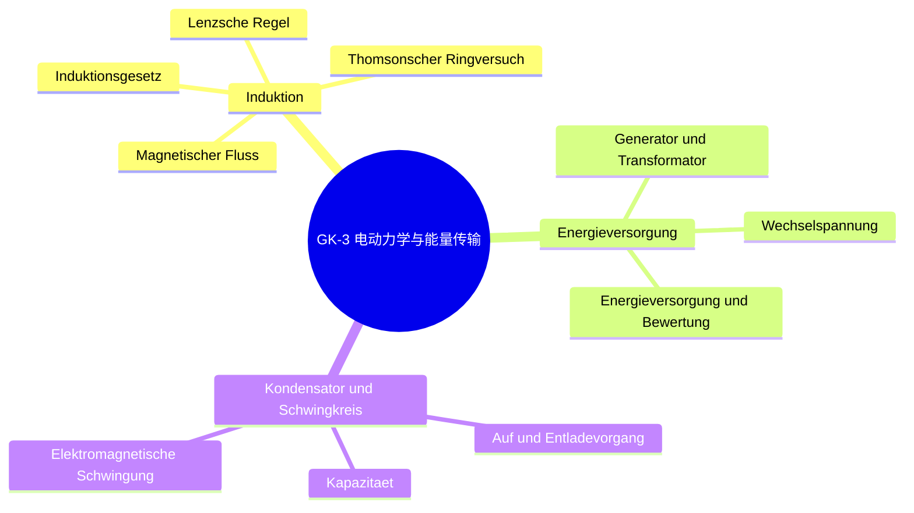
```mermaid
mindmap
  root((GK-3 电动力学与能量传输))
    Induktion
      Magnetischer Fluss
      Induktionsgesetz
      Lenzsche Regel
      Thomsonscher Ringversuch
    Energieversorgung
      Generator und Transformator
      Wechselspannung
      Energieversorgung und Bewertung
    Kondensator und Schwingkreis
      Kapazitaet
      Auf und Entladevorgang
      Elektromagnetische Schwingung
```

> Basiskonzept 落点 [已验证]：E+G（能量守恒是无阻尼电磁振荡定性解释的基础）· S+K（分量分解解释旋转线圈的感应）· M+V（感应定律可定量预测电压信号）。⚠️ **无 Z+D 条目**。
> 🎯 本 IF 是 **GK 的 `Bewertungskompetenz` 主战场**（能量供给/储存/回收 = 社会议题驱动）。

#### L2 GK-3a — Induktion（电磁感应）`[Q1][GK]`

- **Magnetischer Fluss（磁通量）** `[Q1][GK]` · `PH-GK3-01`
  - 中文一句话：`Φ = B·A`（垂直时），是感应定律的输入量；须注意角度与有效面积。
  - Klausur-Anbindung：计算与解释（AFB I–II），是所有感应题的第一步。
  - Operatoren：angeben, berechnen, beschreiben
  - Lernweg ZH：检索练习（默"三种改变 Φ 的方式"：B 变 / A 变 / 角度变）。
  - Fehlerquelle：斜置线圈忘记乘 `cos`；把 `Φ` 与 `B` 当成同一个量 [据推断]。
  - 📓 笔记：⚠️ **缺口**

- **Induktionsgesetz（感应定律）** `[Q1][GK]` · `PH-GK3-02`
  - 中文一句话：感应电压正比于磁通的**变化率**；**GK 也要求「平均变化率」与「微分」两种写法** [已验证]。
  - Klausur-Anbindung：**GK 必考**；由 Φ(t) 求 U_ind 并解释信号形状（AFB II）。
  - Operatoren：herleiten, berechnen, darstellen
  - Lernweg ZH：正确例题精读（两种写法并列）+ 对比辨别（ΔΦ/Δt vs dΦ/dt：何时用哪个）。
  - Fehlerquelle：⚠️ **只写平均变化率形式** —— 微分形式在 GK 也要求，是中国学生的薄弱环节（中国高中不给微分写法）[据推断]。
  - 🇨🇳 CN-Methode：微元法与极限思想（`Elementarisieren`：以恒代变 → 求和取极限）· DE-Anschluss: **「极限方法」是中国课标明示条目，德国 EF 未明示** ← 本条方向与其他技法相反 · 德国侧接收口：`Induktionsgesetz` 的微分形式（GK-3）+ `Q-U` 面积 = 储能（GK-3）+ Basiskonzept `Mathematisieren und Vorhersagen` · 合规性: ✅
  - 备注：只取"先微元、再求和"的**两步思维框架**，不是任何具体公式。⚠️ **不得据此引入定积分运算**（德国 EF/Q 无此要求，属超纲）。
  - 📓 笔记：⚠️ **缺口 🔴**

- **Lenz'sche Regel und Leiterschaukel（楞次定律与导体摆）** `[Q1][GK]` · `PH-GK3-03`
  - 中文一句话：感应电流的方向总是阻碍引起它的变化；本质是能量守恒的体现。
  - Klausur-Anbindung：方向判定 + 解释（AFB II）；LK 升级为"相互作用 + 能量"**双论证**。
  - Operatoren：begründen, erklären, untersuchen
  - Lernweg ZH：自我解释（带扶手："如果不阻碍会怎样？→ 违反能量守恒"）+ 对比辨别。
  - Fehlerquelle：把"阻碍变化"说成"阻止变化"（是延缓不是取消）[据推断]。
  - 📓 笔记：⚠️ **缺口**（中国的"从能量观点解释"恰好命中 LK 双论证的一半）

- **Thomson'scher Ringversuch（跳环实验）** `[Q1][GK]` · `PH-GK3-04`
  - 中文一句话：交变磁场使金属环感应出电流并被排斥跳起——**GK 独有实验点** [已验证]。
  - Klausur-Anbindung：实验现象解释题（AFB II）；中国课标未点名，须单独记。
  - Operatoren：beschreiben, erklären, bewerten
  - Lernweg ZH：间隔重复（独有实验卡片）+ 图形化自我解释。
  - Fehlerquelle：把跳起原因说成"磁斥力"而不接回感应电流与楞次定律（因果链不完整）[据推断]。
  - 📓 笔记：⚠️ **缺口**（属工具/实验层，非知识层）

#### L2 GK-3b — Energieversorgung（能量供给与传输）`[Q2][GK]`

- **Generator und Transformator（发电机与变压器）** `[Q2][GK]` · `PH-GK3-05`
  - 中文一句话：发电机把机械转动变成电压，变压器靠匝数比改变电压——**GK-3 独立内容重点，LK-1 反而没有这些独立条目** [已验证]。
  - Klausur-Anbindung：**GK 的 Bewertung 主战场**（含 `Freileitungen` 特高压模型实验）；原理计算 + 技术评价（AFB II–III）。
  - Operatoren：erklären, berechnen, bewerten
  - Lernweg ZH：先行组织者（先立"为什么远距离要高压"一句）+ 检索练习（默能量流链条）。
  - Fehlerquelle：**只算匝数比不写评价**（丢 AFB III）；或评价只谈技术不讲经济/生态/社会 [已验证]。
  - 🇨🇳 CN-Methode（⚠️ **反例示范**）：等效电源与动态电路分析（串并联化简 / 程序法 / 串反并同 / `U-I` 斜率 = `-r` / 功率三值）· DE-Anschluss: **德国 KLP 全文无「电路分析」Inhaltsfeld**；电路只在 GK-3 的充放电视角与 LK-1 的 RC-DGL 视角被触及；`Ohmsches Gesetz` 属工具性常识而非内容重点 · **无合法接口** · 合规性: ⚠️ **不合规**
  - 备注：**这张卡的作用是提供反例**——说明为什么"看起来很像物理"的中国内容也不能搬。它违反铁律 1：这是**知识板块**不是**方法**。**不是所有中国技法都该引入**：中国最大且最系统的超出量（恒定电流/电路分析、热学、传感器/激光/光纤）对 Abitur **零价值**，只可在 `04_Physik/CN-Physik-Brueecke.md` 标注为"桥接素材，非考纲内容"，并可借用 `U-I` 图练 CN-Methode 5 的"斜率/截距翻译"。**禁止占用复习时间**。
  - 📓 笔记：⛔ **不做笔记**（仅桥接标注）；原理与评价层 ⚠️ 缺口

- **Wechselspannung（交流电压）** `[Q2][GK]` · `PH-GK3-06`
  - 中文一句话：正弦交流由旋转线圈产生，**须由感应定律解释其产生**；GK 只到定性—半定量 [已验证]。
  - Klausur-Anbindung：解释题（AFB II）；常与 Generator/Transformator 同题。
  - Operatoren：beschreiben, herleiten, darstellen
  - Lernweg ZH：正确例题精读（由 Φ(t) 导出 U(t) 的正弦形）+ 对比辨别（峰值 vs 有效值）。
  - Fehlerquelle：⚠️ 把中国的"有效值/相位/功率完整计算"当主攻（超出项）；只作保险 [据推断]。
  - 📓 笔记：⚠️ **缺口**

- **Energiebereitstellung, -speicherung, -rückgewinnung（能量供给/储存/回收）** `[Q2][GK]` · `PH-GK3-07`
  - 中文一句话：KLP 明文的三项社会议题（如"电车制动能量回收"）——**Bewertungskompetenz 的核心落点** [已验证]。
  - Klausur-Anbindung：压轴评价题（AFB III）；须多视角、须互相权衡、须 `lokal und global`。
  - Operatoren：bewerten, diskutieren, beurteilen
  - Lernweg ZH：先行组织者（价值/规范/事实三栏清单）+ 检索练习（默"五视角"：经济/生态/社会/政治/伦理）。
  - Fehlerquelle：只谈技术效率 → 按规则 4 属 `rein innerfachliche Bewertung`，**不得分** [已验证]。
  - 📓 笔记：⚠️ **缺口 🔴**（中国只有原理计算 → 必须专门补"评价类写法"）

#### L2 GK-3c — Kondensator und Schwingkreis（电容与振荡回路）`[Q2][GK]`

- **Kapazität und Plattenkondensator（电容与平板电容器）** `[Q2][GK]` · `PH-GK3-08`
  - 中文一句话：`C = Q/U`；**GK 要求算出依赖几何量与 `Dielektrizitätszahl`（介电常数）的结果** [已验证]。
  - Klausur-Anbindung：GK 高频；公式应用 + 介质影响说明（AFB II）。⚠️ 跨 IF 依赖：`Plattenkondensator` 在 GK-1 只用来建立 `U` 与 `E` 的关系。
  - Operatoren：berechnen, herleiten, erklären
  - Lernweg ZH：检索练习默公式 + 对比辨别（`C` 与 `Q`、`U` 的因果关系：C 不由 Q/U 决定）。
  - Fehlerquelle：说成"电容与所带电量成正比"（C 是元件属性）[据推断]。
  - 📓 笔记：⚠️ **缺口 🔴**（中国只到"了解充放电现象" → 明确缺口）

- **Auf- und Entladevorgang: Modellierung von I(t)（RC 充放电建模）** `[Q2][GK]` · `PH-GK3-09`
  - 中文一句话：充放电电流随时间指数衰减，与 `R` 和 `C` 有关；**GK 要求数学建模 I(t)，但未点名 DGL** [已验证]。
  - Klausur-Anbindung：GK 高频；读图 → 建模 → 求时间常数（AFB II）。
  - Operatoren：darstellen, auswerten, berechnen
  - Lernweg ZH：正确例题精读 + 图形化自我解释（三条曲线 `q/U/I` 并列画）。
  - Fehlerquelle：三条曲线的形状对应关系搞混；把时间常数当成"完全充满所需时间" [据推断]。
  - 🇨🇳 CN-Methode：图像三件套（**面积 / 斜率 / 截距**）——此处命中 **`Q-U` 图中图线与横轴所围 = 电容储能**（GK-3 明文要求）· DE-Anschluss: `Kapazität`（GK-3）+ 三表征形式（EF-1）+ 由数据求参数（EF-1 天花板工具）· 合规性: ✅
  - 备注：德国**明文要求**这个面积解读，等效于积分思想但**不建积分概念**——正是 CN-Methode 5 的合法落点，也是 CN-Methode 7（微元法）在 GK 的接收口。
  - 📓 笔记：⚠️ **缺口 🔴**

- **Elektromagnetische Schwingung（电磁振荡，定性）** `[Q2][GK]` · `PH-GK3-10`
  - 中文一句话：电容与线圈之间的能量来回交换；**GK 只要求定性说明物理过程** [已验证]（LK-2 才有独立内容重点与 `Thomson'sche Gleichung`）。
  - Klausur-Anbindung：定性解释题（AFB II）；常与能量守恒挂钩（Basiskonzept E+G）。
  - Operatoren：beschreiben, erklären, vergleichen
  - Lernweg ZH：图形化自我解释（电场能 ⇄ 磁场能的钟摆类比）+ 对比辨别（GK 定性 vs LK 定量）。
  - Fehlerquelle：⚠️ 按 LK 的 `Thomson'sche Gleichung` 去答（GK 无此要求）；或把能量说成"消失了" [据推断]。
  - 📓 笔记：⚠️ **缺口**

---

### L1-GK-4：Strahlung und Materie（辐射与物质）`[Q2][GK]`

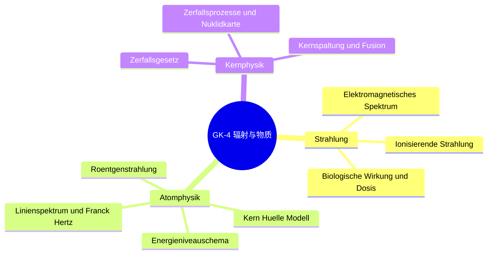
```mermaid
mindmap
  root((GK-4 辐射与物质))
    Strahlung
      Elektromagnetisches Spektrum
      Ionisierende Strahlung
      Biologische Wirkung und Dosis
    Atomphysik
      Linienspektrum und Franck Hertz
      Energieniveauschema
      Kern Huelle Modell
      Roentgenstrahlung
    Kernphysik
      Zerfallsprozesse und Nuklidkarte
      Zerfallsgesetz
      Kernspaltung und Fusion
```

> Basiskonzept 落点 [已验证]：E+G（考虑质量亏损 → 广义化的能量守恒）· M+V（定量原子模型可算能级）· Z+D（单核衰变随机 vs 大量核按衰变律确定）。⚠️ **无 S+K 条目**。

#### L2 GK-4a — Strahlung（辐射）`[Q2][GK]`

- **Spektrum der elektromagnetischen Strahlung（电磁频谱）** `[Q2][GK]` · `PH-GK4-01`
  - 中文一句话：从无线电到 γ 射线的连续谱；不同波段的产生机制与穿透能力不同。
  - Klausur-Anbindung：归类与指认题（`ordnen` 的典型场景，AFB I–II）。
  - Operatoren：ordnen, angeben, beschreiben
  - Lernweg ZH：间隔重复（频段卡片）+ 对比辨别（波长越长 vs 能量越高）。
  - Fehlerquelle：把"频率高"与"波长长"配错；可见光范围记错 [据推断]。
  - 📓 笔记：⚠️ **缺口**

- **Ionisierende Strahlung und Geiger-Müller-Zählrohr（电离辐射与计数管）** `[Q2][GK]` · `PH-GK4-02`
  - 中文一句话：α/β/γ 与高能电磁辐射的突出特征是**电离能力**；GM 计数管是标准探测工具。
  - Klausur-Anbindung：辐射种类区分（磁/电偏转 + 穿透 + 电离能力）+ 探测原理（AFB I–II）。
  - Operatoren：vergleichen, beschreiben, untersuchen
  - Lernweg ZH：对比辨别（三种辐射三性质对照表：先选再做）。
  - Fehlerquelle：把"穿透力强"与"电离能力强"当成正相关（实际相反）[据推断]。
  - 📓 笔记：⚠️ **缺口**

- **Biologische Wirkung und effektive Dosis（生物效应与有效剂量）** `[Q2][GK]` · `PH-GK4-03`
  - 中文一句话：**`effektive Dosis` 要求量化，并据此评价防护措施** [已验证]——物理 + 评价的交叉任务。
  - Klausur-Anbindung：GK 的 Bewertung 交叉点；算剂量 → 评价防护方案（AFB II–III）。
  - Operatoren：berechnen, bewerten, begründen
  - Lernweg ZH：正确例题精读 + 检索练习（默"剂量 → 风险 → 措施"三段）。
  - Fehlerquelle：⚠️ 把"论证某防护措施更专业"算作 Bewerten（属 `rein innerfachlich`，不得分）[已验证]。
  - 📓 笔记：⚠️ **缺口 🔴**

#### L2 GK-4b — Atomphysik（原子物理）`[Q2][GK]`

- **Linienspektrum und Franck-Hertz-Versuch（线状谱与夫兰克-赫兹实验）** `[Q2][GK]` · `PH-GK4-04`
  - 中文一句话：气态发光体只发离散谱线，Franck-Hertz 的台阶状电流**支持壳层中离散能态**的模型。
  - Klausur-Anbindung：**GK 核心实验**；由实验数据论证离散能级（AFB II–III）。中国课标无此点名实验 → **须单独补**。
  - Operatoren：auswerten, begründen, interpretieren
  - Lernweg ZH：正确例题精读（读台阶间距 → 对应能级差）+ 带扶手自解释（"为什么电流会掉下来？"）。
  - Fehlerquelle：把谱线说成"连续谱中的亮线"；忘记说明"离散 → 能级量子化"这一步推论 [据推断]。
  - 📓 笔记：⚠️ **缺口 🔴**（GK 必考 + 中国无对等实验）

- **Energieniveauschema und Kern-Hülle-Modell（能级图与核-壳模型）** `[Q2][GK]` · `PH-GK4-05`
  - 中文一句话：原子的能级用图表示，壳层解释化学行为；**H 原子轨道须解释为电子探测概率的可视化** [已验证]（GK 已含概率解释）。
  - Klausur-Anbindung：能级跃迁计算 + 轨道解释（AFB II）。
  - Operatoren：darstellen, berechnen, deuten
  - Lernweg ZH：图形化自我解释（一图一概念：能级图只讲跃迁）+ 对比辨别（轨道 vs 定态轨道）。
  - Fehlerquelle：把轨道说成"电子运动的确定路径"（是概率可视化）[已验证]。
  - 📓 笔记：⚠️ **缺口**

- **Röntgenstrahlung: Brems- vs. charakteristische Strahlung（X 射线：轫致与特征辐射）** `[Q2][GK]` · `PH-GK4-06`
  - 中文一句话：轫致辐射为连续谱、特征辐射为离散峰；**GK 也要求区分这两种机制** [已验证]。
  - Klausur-Anbindung：谱图指认与机理解释（AFB II）；与 LK-3 的 `Bremsstrahlung` 短波极限相接。
  - Operatoren：vergleichen, erklären, auswerten
  - Lernweg ZH：对比辨别（连续谱 vs 离散峰成因对照）+ 间隔重复（术语卡）。
  - Fehlerquelle：把特征辐射说成"由减速产生"；两者成因互串 [据推断]。
  - 📓 笔记：⚠️ **缺口**

#### L2 GK-4c — Kernphysik（核物理）`[Q2][GK]`

- **Zerfallsprozesse und Nuklidkarte（衰变过程与核素图）** `[Q2][GK]` · `PH-GK4-07`
  - 中文一句话：α/β 衰变改变核组成；**`Nuklidkarte` 是 KLP 明确要求使用的工具** [已验证]。
  - Klausur-Anbindung：核反应方程配平 + 用核素图查衰变链（AFB I–II）。⚠️ 工具不同（中国用配平，德国用核素图）→ **须专门练**。
  - Operatoren：angeben, ordnen, untersuchen
  - Lernweg ZH：检索练习（默"质量数守恒 + 电荷数守恒"两条）+ 工具训练（核素图定位）。
  - Fehlerquelle：β⁻ 衰变忘记中微子；在核素图上走错方向 [据推断]。
  - 📓 笔记：⚠️ **缺口**

- **Zerfallsgesetz und Halbwertszeit（衰变定律与半衰期）** `[Q2][GK]` · `PH-GK4-08`
  - 中文一句话：衰变是指数衰减；**GK 只要求应用（含半衰期项），不要求由 `Aktivität` 推导** [已验证]。
  - Klausur-Anbindung：计算题 + 统计意义说明（AFB II）；Basiskonzept `Zufall und Determiniertheit` 的核物理落点。
  - Operatoren：berechnen, auswerten, beschreiben
  - Lernweg ZH：正确例题精读（三种给法：λ / T½ / 图）+ 对比辨别（单核随机 vs 群体确定）。
  - Fehlerquelle：⚠️ 按 LK 标准去做推导（GK 无此要求）；把"半衰期后剩一半"推广到"两个半衰期后全没了" [据推断]。
  - 📓 笔记：⚠️ **缺口**

- **Kernspaltung, -fusion, Massendefekt（裂变、聚变与质量亏损）** `[Q2][GK]` · `PH-GK4-09`
  - 中文一句话：`E = Δm c²`；核能以质量亏损形式释放——**守恒原理被广义化** [已验证]。
  - Klausur-Anbindung：GK 必考；能量计算 + 定性比较裂变/聚变（AFB II–III）。
  - Operatoren：berechnen, erklären, bewerten
  - Lernweg ZH：正确例题精读（质量差 → 能量）+ 先行组织者（先立"质量也是能量的一种形式"）。
  - Fehlerquelle：`Δm` 单位停留在 u 而不换算到 kg；把"质量亏损"说成"质量消失了" [据推断]。
  - 📓 笔记：⚠️ **缺口**

---

### L1-LK-1：Ladungen, Felder und Induktion（电荷、场与感应）`[Q1→Q2][LK]`

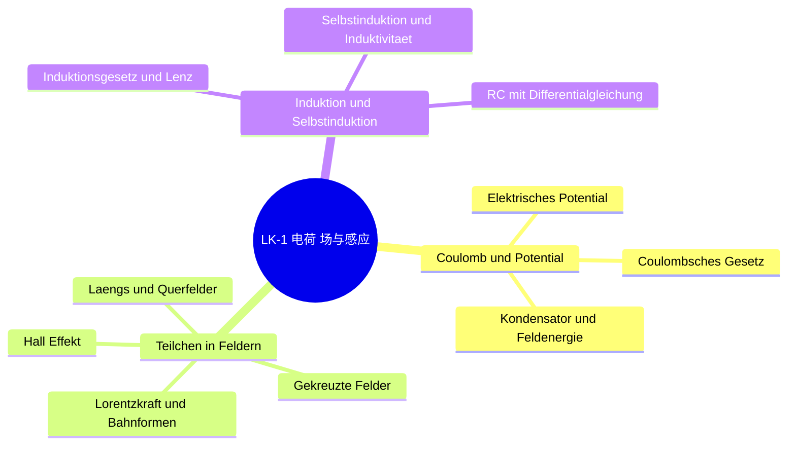
```mermaid
mindmap
  root((LK-1 电荷 场与感应))
    Coulomb und Potential
      Coulombsches Gesetz
      Elektrisches Potential
      Kondensator und Feldenergie
    Teilchen in Feldern
      Laengs und Querfelder
      Lorentzkraft und Bahnformen
      Gekreuzte Felder
      Hall Effekt
    Induktion und Selbstinduktion
      Induktionsgesetz und Lenz
      Selbstinduktion und Induktivitaet
      RC mit Differentialgleichung
```

> Basiskonzept 落点 [已验证]：E+G（正交场中电/磁作用相互补偿 = 力平衡范例）· S+K（两个径向场叠加成偶极场）· M+V（电容充放电可被数学精确描述）。**无 Z+D 条目**。
> ⚠️ **LK-1 没有 `Transformator` / `Generator` / `Wechselspannung` 的独立条目**（GK-3 有）——**"LK 包含 GK 全部"是错误的** [已验证]。

#### L2 LK-1a — Coulomb und Potential（库仑定律与电势）`[Q1][LK]`

- **Coulomb'sches Gesetz（库仑定律）** `[Q1][LK]` · `PH-LK1-01`
  - 中文一句话：点电荷间作用力与电荷量之积成正比、与距离平方成反比；**须计算力的量值与方向，并作场强叠加** [已验证]。
  - Klausur-Anbindung：**台阶②之一，LK 必考**；点电荷力 + 多电荷叠加（AFB II）。⚠️ **EF 完全无静电，LK 一上来就要求**。
  - Operatoren：berechnen, herleiten, begründen
  - Lernweg ZH：正确例题精读（先画受力方向图再算）+ 对比辨别（`F` 是矢量叠加 vs `E` 是矢量叠加 vs `φ` 是标量叠加）。
  - Fehlerquelle：矢量叠加只算大小不合成方向；`r²` 忘记平方；⚠️ **GK 学生误做**（GK 只有 `E = F/Q` 定义式）[据推断]。
  - 🇨🇳 CN-Methode：极端值 / 特殊值检验法 + 量纲自检（`Grenzfallprobe`）· DE-Anschluss: `vektorielle Größen` 与公式应用（EF-1）+ Basiskonzept `Mathematisieren und Vorhersagen`（官方要求"预测"，自检正是预测的验证）· 合规性: ✅
  - 备注：**零新增知识的元认知检查**：解完把某参数推向 `0` 或 `∞` 看是否退化为常识（如 `r = mv/(qB)` 中 `B→∞` 时 `r→0`），再查单位。**不占分但防丢分**，对十条评分准则中的 `Sicherheit im Umgang mit Fachsprache und -methoden` 有正面作用。中国学生最易在**方向与符号**上失分，本卡专治此处。
  - 📓 笔记：⚠️ **缺口 🔴🔴** ★★★ 建议产出《场的数学化前置包》（Coulomb + Potential，中国必修3.1 可直接前移）

- **Elektrisches Potential und Potentialdifferenz（电势与电势差）** `[Q1][LK]` · `PH-LK1-02`
  - 中文一句话：电势是每单位电荷的能量（标量）；**须区分 `Feldstärke` / `Spannung` / `Energie` 三个量**，用势与势差统一处理平板电容器（定量）与径向场（定性）[已验证]。
  - Klausur-Anbindung：**台阶②之二，LK 必考**；概念辨析 + 定量（AFB II–III）。
  - Operatoren：vergleichen, erklären, berechnen
  - Lernweg ZH：对比辨别（`E` / `U` / `W` 三量对照表：矢量/标量、定义式、单位）+ 带扶手自解释。
  - Fehlerquelle：⚠️ **概念辨析题是中国学生的头号失分点** —— 中国只给公式 `U = Ed`，德国要求论证三者的区别 [据推断]。
  - 📓 笔记：⚠️ **缺口 🔴🔴**

- **Kondensator, Kapazität und Feldenergie（电容器、电容与场储能）** `[Q1][LK]` · `PH-LK1-03`
  - 中文一句话：电容描述储能能力；**LK 须给出匀强电/磁场中储存的能量与电学量及元件特征量的关系** [已验证]。
  - Klausur-Anbindung：LK 计算 + 能量论证（AFB II–III）；与 RC-DGL 节点直接相接。
  - Operatoren：herleiten, berechnen, begründen
  - Lernweg ZH：正确例题精读 + 对比辨别（`½CU²` vs `Q²/2C`：已知量不同选不同式）。
  - Fehlerquelle：⚠️ 把"检验电介质改变电容的假设"写成复述（LK 要求**假说检验**，属 `Erkenntnisgewinnung`）[已验证]。
  - 📓 笔记：⚠️ **缺口**

#### L2 LK-1b — Teilchen in Feldern（场中的粒子）`[Q1→Q2][LK]`

- **Teilchen in Längs- und Querfeldern（纵向场与横向场中的粒子）** `[Q1][LK]` · `PH-LK1-04`
  - 中文一句话：纵场使粒子加速、横场使粒子偏转成抛物线——**与 EF 的平抛完全同构**。
  - Klausur-Anbindung：LK-1 核心（AFB II）；是台阶③在 LK 侧的落点。
  - Operatoren：berechnen, herleiten, darstellen
  - Lernweg ZH：先行组织者（先复习 EF 平抛四式，再做 `g → qE/m` 替换）+ 正确例题精读。
  - Fehlerquelle：把电子电荷符号带错导致偏转方向画反 [据推断]。
  - 🇨🇳 CN-Methode：平抛 → 电场中偏转的**同构翻译**（LK 落点）· DE-Anschluss: `waagerechter Wurf`（EF-1）+ `Komponentenzerlegung`（EF-1）+ **`Coulomb'sches Gesetz`**（LK-1，用于求 `F = qE`）+ `Newton'sche Gesetze`（EF-1）· 合规性: ✅
  - 备注：**EF 已教完分解方法，只需补「力 → 加速度」一步**。这张双向翻译表同时服务 GK-1（`Bahnformen`）与 LK-1（`Längs-/Querfelder`），是最划算的一张卡。
  - 📓 笔记：⚠️ **缺口 🔴**

- **Lorentzkraft und Bahnformen（洛伦兹力与轨迹）** `[Q1][LK]` · `PH-LK1-05`
  - 中文一句话：`F = qvB`（垂直时）永远垂直于速度 → 不做功 → 匀强磁场中作圆周运动。
  - Klausur-Anbindung：LK 必考；轨迹判型 + 半径/周期计算（AFB II）。
  - Operatoren：berechnen, herleiten, skizzieren
  - Lernweg ZH：正确例题精读 + 自我解释（带扶手："为什么洛伦兹力不改变速率？"）。
  - Fehlerquelle：把 `F = qvB` 用于速度与磁场不平行的情形而不取分量 [据推断]。
  - 🇨🇳 CN-Methode：带电粒子偏转的**几何化轨迹链** · DE-Anschluss: `Lorentzkraft`（LK-1）+ `Zentripetalkraft` 与圆周七量（**EF-2 已教且定量**）+ `Komponentenzerlegung`（EF-1）· 合规性: ✅
  - 备注：四步工序（定圆心 / 找半径 / 算圆心角 / `t = (θ/2π)T`）+ 临界三圆（旋转圆 / 放缩圆 / 平移圆）。把"粒子能否射出、打到何处"转化为"圆与边界是否相交"的**纯几何判定**，临界题可上 AFB III。
  - 📓 笔记：⚠️ **缺口 🔴** ★★★ 与 GK-1 `Fadenstrahlrohr` 共用《Lorentzkraft 轨迹几何法》

- **Gekreuzte Felder（正交交叉场 / 速度选择器）** `[Q2][LK]` · `PH-LK1-06`
  - 中文一句话：电场力与磁场力方向相反，速度恰当时相互抵消 → 直线通过；**LK 独立内容重点，GK 完全没有** [已验证]。
  - Klausur-Anbindung：LK 必考；平衡条件推导 + 应用（AFB II–III）。Basiskonzept E+G 的漂亮落点（力平衡范例）。
  - Operatoren：herleiten, berechnen, begründen
  - Lernweg ZH：正确例题精读（`qE = qvB` → `v = E/B`）+ 对比辨别（平衡 vs 偏转两类情形）。
  - Fehlerquelle：两个力方向的判定各错一次却"负负得正"蒙对结果 → 过程分丢失 [据推断]。
  - 🇨🇳 CN-Methode：几何化轨迹链 + **复合场分类讨论**（先判"是否平衡 → 是否直线 → 是圆周还是摆线"）· DE-Anschluss: `gekreuzte Felder`（LK-1）+ `Lorentzkraft`（LK-1）+ `Komponentenzerlegung`（EF-1）+ 圆周七量（EF-2）· 合规性: ✅
  - 备注：德国只有条目、更依赖建模；中国有完整的复合场分类体系。此处只取**分类顺序**（先判平衡），不引入超纲模型。
  - 📓 笔记：⚠️ **缺口 🔴**

- **Hall-Effekt und Helmholtzspule（霍尔效应与亥姆霍兹线圈）** `[Q2][LK]` · `PH-LK1-07`
  - 中文一句话：**LK 须用霍尔效应研究磁通密度**，并**自行设计实验**测定长直载流线圈的 `B` 对其影响量的依赖 [已验证]。
  - Klausur-Anbindung：**`Erkenntnisgewinnungskompetenz` 的主战场**；`planen` 类设计题（AFB III）。
  - Operatoren：planen, begründen, auswerten
  - Lernweg ZH：正确例题精读（实验设计四段：变量控制 → 测量 → 数据处理 → 预期）+ 检索练习（默"实验设计模板"）。
  - Fehlerquelle：⚠️ **写成"按指导做实验"的步骤罗列** —— 那归 `Sachkompetenz`，不是设计；中国学生**不缺"做过什么"，缺"如何论证设计"** [已验证]。
  - 📓 笔记：⚠️ **缺口 🔴**（补 `Erkenntnisgewinnung` 写法，性价比极高）

#### L2 LK-1c — Induktion und Selbstinduktion（感应与自感）`[Q2][LK]`

- **Induktionsgesetz und Lenz'sche Regel（感应定律与楞次定律，双论证）** `[Q2][LK]` · `PH-LK1-08`
  - 中文一句话：**LK 的 `Lenz'sche Regel` 是独立内容重点，须同时用「相互作用概念」与「能量概念」论证** [已验证]。
  - Klausur-Anbindung：LK 必考；双论证是得分点（AFB II–III）。
  - Operatoren：begründen, herleiten, erklären
  - Lernweg ZH：正确例题精读（同一结论写两遍：一遍力学、一遍能量）+ 对比辨别。
  - Fehlerquelle：**只写一种论证** → 少拿一层分；把"相互作用"与"能量"写成同一件事 [据推断]。
  - 📓 笔记：⚠️ **缺口 🔴**（中国的"从能量观点解释"命中一半）

- **Selbstinduktion und Induktivität（自感与电感）** `[Q2][LK]` · `PH-LK1-09`
  - 中文一句话：线圈自身电流变化产生反向电动势；**须解释合闸延迟与分闸电压冲击** [已验证]——LK 独有，GK 完全没有。
  - Klausur-Anbindung：LK 必考；现象解释 + 技术应用（AFB II–III）。
  - Operatoren：erklären, berechnen, bewerten
  - Lernweg ZH：图形化自我解释（I(t) 曲线 + 开关两个瞬间）+ 对比辨别（自感 vs 互感）。
  - Fehlerquelle：把"分闸电压冲击"说成"电流突然变大"（是感应出高电压）[据推断]。
  - 📓 笔记：⚠️ **缺口 🔴**（中国只作了解 → 明确缺口）

- **RC-Auf- und Entladung mit Differentialgleichung（用微分方程描述 RC 充放电）** `[Q2][LK]` · `PH-LK1-10`
  - 中文一句话：**LK 须用 DGL 及其给定解描述 `q` / `U` / `I` 的关系（含 `C` 与 `R` 参数）** [已验证]。
  - Klausur-Anbindung：**台阶①之一，LK 最高价值的中国缺口**；由 DGL → 解 → 时间常数（AFB II–III）。
  - Operatoren：aufstellen, herleiten, berechnen
  - Lernweg ZH：正确例题精读（**先看一遍完整推导**再自己做）+ 带扶手自解释（"这一步为什么可以把变量当常量？"）。
  - Fehlerquelle：把 DGL 的解当作新公式死背而不理解来源；⚠️ **EF 全文不出现 `Differentialgleichung` 一词** → 无任何前置 [已验证]。
  - 🇨🇳 CN-Methode：微元法与极限思想（`Elementarisieren`：先微元 → 再求和取极限）· DE-Anschluss: **LK-1 明文要求「用 DGL 及其给定解描述 RC 充放电」**（DGL 的本质就是微元关系的极限形式）+ Basiskonzept `Mathematisieren und Vorhersagen`（本技法的官方名分）+ `Gesetz` 表征形式（EF-1）· 合规性: ✅
  - 备注：**化解台阶①的入口**。"以恒代变、再求和"是**思维方式**不是知识块，且 `Mathematisieren und Vorhersagen` 这个 Basiskonzept 就是它的官方名分。⚠️ 但**不得据此引入定积分运算**（德国 EF/Q 无此要求，属超纲）。**与 `03_Mathe` 的 Analysis 联动**。
  - 📓 笔记：⚠️ **缺口 🔴🔴** ★★★ 建议产出《LK-DGL 前置包》（小角线性化 + 微元法）

---

### L1-LK-2：Schwingende Systeme und Wellen（振动系统与波）`[Q1→Q2][LK]`

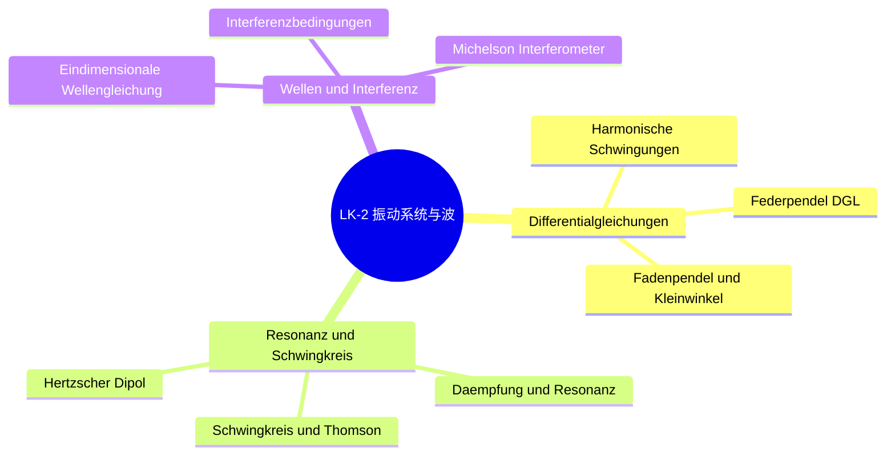
```mermaid
mindmap
  root((LK-2 振动系统与波))
    Differentialgleichungen
      Harmonische Schwingungen
      Federpendel DGL
      Fadenpendel und Kleinwinkel
    Resonanz und Schwingkreis
      Daempfung und Resonanz
      Schwingkreis und Thomson
      Hertzscher Dipol
    Wellen und Interferenz
      Eindimensionale Wellengleichung
      Interferenzbedingungen
      Michelson Interferometer
```

> Basiskonzept 落点 [已验证]：E+G（能量守恒解释机械与电磁振动；**物理中的振动系统总围绕一平衡态振荡**）· S+K（光的干涉 = 电磁波叠加）· M+V（**用 DGL 及其解可精确预测振动的时间进程**）。**无 Z+D 条目**。
> 🎯 **用微分方程对机械与电磁振动过程作数学建模是本 IF 的标志性特征** [已验证]。
> ⚠️ 本 IF 的 IF 名与 GK 完全不同（GK 的对应内容散在 `Klassische Wellen…` 与 `Elektrodynamik…` 两个 IF 里）→ **禁止按 GK 的 IF 名规划 LK 笔记**。

#### L2 LK-2a — Differentialgleichungen der Schwingung（振动的微分方程）`[Q1→Q2][LK]`

- **Harmonische Schwingungen und Kenngrößen（谐振与本征量）** `[Q1][LK]` · `PH-LK2-01`
  - 中文一句话：回复力正比于位移 → 简谐振动；`A / ω / T / φ` 四量描述。
  - Klausur-Anbindung：LK-2 起点；本征量互推（AFB I–II）。
  - Operatoren：angeben, berechnen, beschreiben
  - Lernweg ZH：先行组织者（四量关系图）+ 检索练习（限时互推）。
  - Fehlerquelle：`ω` 与 `f` 混用；**EF 的 `ω`（圆周运动）在 LK 是描述相位的必备量** [已验证，台阶④]。
  - 📓 笔记：⚠️ **缺口**

- **DGL des Federpendels（弹簧振子的微分方程推导）** `[Q1][LK]` · `PH-LK2-02`
  - 中文一句话：**由线性力律 `F = -kx` 与牛顿第二定律自行推导 DGL**，并由 DGL 与其解求周期 `T` [已验证]。
  - Klausur-Anbindung：**台阶①之二，LK 高频**；推导题（AFB II–III）。中国**只给结果公式，不要求推导** → 中国学生的连锁缺口。
  - Operatoren：herleiten, aufstellen, begründen
  - Lernweg ZH：正确例题精读（完整推导一遍）+ 带扶手自解释（"这一步用的是牛顿第二定律还是胡克定律？"）。
  - Fehlerquelle：把 `ω² = k/m` 记成 `ω = k/m`；推导中忘记写"由解的形式读出 ω"这一步 [据推断]。
  - 📓 笔记：⚠️ **缺口 🔴🔴**（并入《LK-DGL 前置包》）

- **Fadenpendel und Kleinwinkelnäherung（单摆与小角近似）** `[Q2][LK]` · `PH-LK2-03`
  - 中文一句话：`F = -mg·sinφ` 是非线性的；**须在小角近似下线性化为 `F ≈ -mgφ`，再推导其 DGL** [已验证]。**`Fadenpendel` 是 LK 独立内容重点，GK 完全没有**。
  - Klausur-Anbindung：**台阶①的核心**；推导 + 由解求 `T`（AFB II–III）；常追问"模型的局限"。
  - Operatoren：herleiten, begründen, bewerten
  - Lernweg ZH：正确例题精读（先线性化 → 再识别为谐振子）+ 带扶手自解释（"为什么要先做近似？不做会怎样？"）。
  - Fehlerquelle：忘记说明近似条件；把"角度增大时周期实际偏大"这一误差方向说反 [据推断]。
  - 🇨🇳 CN-Methode：**线性化近似（小角近似）** —— 先判能否线性化 → 化为 `F = -kx` → 识别为谐振子 → 直接读 `ω` 与 `T` · DE-Anschluss: **LK-2 明文要求「在小角近似下由线性力律推导单摆的 DGL」**（近似本身是德国 KLP 的**规定动作**，不是中国带来的）+ `Spannenergie`（EF-1）+ `Federpendel`（GK-1）+ `harmonische Schwingungen`（GK-1/LK-2）· 合规性: ✅
  - 备注：中国侧提供的只是「**先线性化、再识别为谐振子**」这一**思维顺序**（中国用得极熟），德国学生常卡在不知道该先做近似。**化解台阶①的入口**，与 `03_Mathe` 的 Analysis 联动。
  - 📓 笔记：⚠️ **缺口 🔴🔴** ★★★ 建议产出《LK-DGL 前置包》（小角线性化 + 微元法，可与 Mathe 联动）

#### L2 LK-2b — Resonanz und Schwingkreis（共振与振荡回路）`[Q2][LK]`

- **Dämpfung, erzwungene Schwingung, Resonanz（阻尼、受迫振动与共振）** `[Q2][LK]` · `PH-LK2-04`
  - 中文一句话：须定性说明**无阻尼 / 阻尼 / 受迫**三种情形；**`Resonanz` 是 LK 独立内容重点，须实验研究并评价避免共振灾难的措施** [已验证]。
  - Klausur-Anbindung：LK 实验题 + Bewertung（AFB II–III）。GK 完全无此条目。
  - Operatoren：planen, untersuchen, bewerten
  - Lernweg ZH：正确例题精读（共振曲线读图）+ 先行组织者（三种情形对照表）。
  - Fehlerquelle：**只谈"共振条件"不写防灾措施**（德国加了 Bewertung 层）[据推断]。
  - 📓 笔记：⚠️ **缺口 🔴**

- **Schwingkreis und Thomson'sche Gleichung（振荡回路与汤姆孙公式）** `[Q2][LK]` · `PH-LK2-05`
  - 中文一句话：LC 回路的电磁振荡与弹簧振子同构，**由 DGL 与其解求 `T` 与 `Thomson'sche Gleichung`** [已验证]。
  - Klausur-Anbindung：LK 必考；由类比 → DGL → 周期（AFB II–III）。
  - Operatoren：herleiten, vergleichen, berechnen
  - Lernweg ZH：对比辨别（机械 ⇄ 电磁的类比表，见下一节点）+ 正确例题精读。
  - Fehlerquelle：把 `T = 2π√(LC)` 的 L 与 C 位置写反 [据推断]。
  - 📓 笔记：⚠️ **缺口 🔴**

- **Analogie: mechanische ⇄ elektromagnetische Schwingung（机械与电磁振动的类比）** `[Q2][LK]` · `PH-LK2-06`
  - 中文一句话：**须从能量与本征量两方面比较机械与电磁振荡** [已验证]——**德国 LK 的招牌题型**，Basiskonzept `Erhaltung und Gleichgewicht` 的漂亮落点。
  - Klausur-Anbindung：LK 高频大题（AFB II–III）；口试的天然跨领域素材。
  - Operatoren：vergleichen, begründen, darstellen
  - Lernweg ZH：对比辨别（一张"量 ↔ 量"对照表：m↔L、k↔1/C、x↔q、v↔I）+ 口语复述。
  - Fehlerquelle：只类比公式不类比能量转换机制 → 拿不到 AFB III [据推断]。
  - 📓 笔记：⚠️ **缺口 🔴**（中国无此训练）

- **Hertz'scher Dipol（赫兹偶极子）** `[Q2][LK]` · `PH-LK2-07`
  - 中文一句话：**须把赫兹偶极子描述为（开放的）振荡电路**，并定性说明 B/E 场变化产生涡旋场与电磁波的传播 [已验证]。
  - Klausur-Anbindung：LK 解释题（AFB II）；常与电磁波发射同题。
  - Operatoren：erklären, beschreiben, vergleichen
  - Lernweg ZH：图形化自我解释（闭合 LC → 逐渐张开 → 开放偶极）+ 一图一概念。
  - Fehlerquelle：把偶极子当成独立于振荡电路的新装置（它是"开放化的振荡电路"）[据推断]。
  - 📓 笔记：⚠️ **缺口**

#### L2 LK-2c — Wellen und Interferenz（波与干涉）`[Q2][LK]`

- **Eindimensionale Wellengleichung（一维波方程）** `[Q2][LK]` · `PH-LK2-08`
  - 中文一句话：**须数学描述一维谐振波的空间与时间演化** [已验证]；中国无波方程 → 明确缺口。
  - Klausur-Anbindung：LK 建模题（AFB II–III）。
  - Operatoren：aufstellen, darstellen, deuten
  - Lernweg ZH：正确例题精读（固定 `x` 看时间、固定 `t` 看空间）+ 对比辨别。
  - Fehlerquelle：把"空间演化"与"时间演化"写成同一个函数形式 [据推断]。
  - 📓 笔记：⚠️ **缺口**

- **Interferenzbedingungen an Spalt, Doppelspalt, Gitter（单缝/双缝/光栅的干涉条件）** `[Q2][LK]` · `PH-LK2-09`
  - 中文一句话：**LK 须为三种装置分别给出相长/相消干涉条件，并作实验定量验证（单色与多色光）** [已验证]；GK 只需"由花样证明波动性并求 λ"。
  - Klausur-Anbindung：LK 高频实验题（AFB II–III）。
  - Operatoren：herleiten, berechnen, auswerten
  - Lernweg ZH：对比辨别（三种装置的条件对照表）+ 正确例题精读。
  - Fehlerquelle：把单缝衍射极小条件与双缝极大条件混用 [据推断]。
  - 📓 笔记：⚠️ **缺口 🔴**

- **Michelson-Interferometer（迈克耳孙干涉仪）** `[Q2][LK]` · `PH-LK2-10`
  - 中文一句话：**LK 独立内容重点，须说明其结构与工作方式** [已验证]；GK 完全没有。
  - Klausur-Anbindung：LK 装置说明题（AFB II）；术语与光路必须记准。
  - Operatoren：beschreiben, erklären, skizzieren
  - Lernweg ZH：图形化自我解释（一图一概念：分束 → 两臂 → 合束）+ 间隔重复（术语卡）。
  - Fehlerquelle：把补偿板的作用说成"分光"（是补偿光程）[据推断]。
  - 📓 笔记：⚠️ **缺口 🔴**

- **Deduktion vs. Induktion（演绎法与归纳法）** `[Q2][LK]` · `PH-LK2-11`
  - 中文一句话：**须区分演绎法与归纳法作为认识获取的基本方法**（以振动为例）[已验证]——LK 独有的**方法论知识点**。
  - Klausur-Anbindung：LK 的方法论追问（AFB III）；常接在 DGL 推导题之后。
  - Operatoren：vergleichen, begründen, diskutieren
  - Lernweg ZH：对比辨别（"由 DGL 推出 T"= 演绎；"由实验数据归纳周期律"= 归纳）+ 口语复述。
  - Fehlerquelle：两种方法名说反；只举例子不给区分标准 [据推断]。
  - 📓 笔记：⚠️ **缺口**

---

### L1-LK-3：Quantenphysik（量子物理）`[Q1→Q2][LK]`

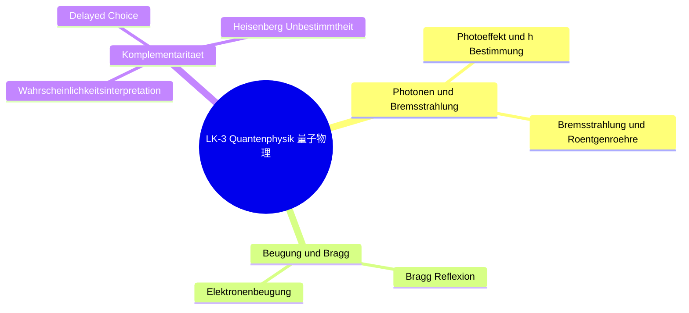
```mermaid
mindmap
  root((LK-3 Quantenphysik 量子物理))
    Photonen und Bremsstrahlung
      Photoeffekt und h Bestimmung
      Bremsstrahlung und Roentgenroehre
    Beugung und Bragg
      Bragg Reflexion
      Elektronenbeugung
    Komplementaritaet
      Wahrscheinlichkeitsinterpretation
      Delayed Choice
      Heisenberg Unbestimmtheit
```

> Basiskonzept 落点 [已验证]：S+K · M+V（**波函数平方作为量子客体存在概率的数学表达，是量子物理数学化的范例**）· Z+D。⚠️ **无 E+G 条目**（与 GK `Quantenobjekte` 不同，GK 有 E+G）。
> 🎯 **本 IF 是中德差距最大的一块**：德国 LK 把当代量子概念做成常规考点，中国止于"波粒二象性"的了解层（不确定原理在**选修3，不在高考范围**）。

#### L2 LK-3a — Photonen und Bremsstrahlung（光子与轫致辐射）`[Q1][LK]`

- **Photoeffekt: Bestimmung von h（光电效应与由实验数据定 h）** `[Q1][LK]` · `PH-LK3-01`
  - 中文一句话：**LK 须由光电效应实验数据确定 `h`** [已验证]；不只是套方程，而是从数据回归出常数。
  - Klausur-Anbindung：LK 高频；数据 auswerten → 作图 → 由斜率求 `h`（AFB II–III）。
  - Operatoren：auswerten, ermitteln, begründen
  - Lernweg ZH：正确例题精读（`U_g` 对 `f` 作图，斜率 = `h/e`）+ 带扶手自解释。
  - Fehlerquelle：把截距与斜率的物理意义说反；单位换算错 [据推断]。
  - 📓 笔记：⚠️ **缺口 🔴🔴**（中国高中不做"由实验定 h"）

- **Bremsstrahlung und Röntgenröhre（轫致辐射与 X 射线管）** `[Q1][LK]` · `PH-LK3-02`
  - 中文一句话：**须解释轫致辐射谱短波极限的出现**（全部动能转为单个光子），并描述 X 射线管的**结构与工作方式** [已验证]。
  - Klausur-Anbindung：**典型 AFB II 推导题**（`eU = hc/λ_min`）；装置说明题。
  - Operatoren：herleiten, erklären, beschreiben
  - Lernweg ZH：正确例题精读（一步能量守恒推出 λ_min）+ 图形化自我解释（谱图：连续谱 + 特征峰）。
  - Fehlerquelle：把短波极限说成"最小能量"（是**最大**光子能量 / **最小**波长）[据推断]。
  - 📓 笔记：⚠️ **缺口 🔴**

#### L2 LK-3b — Beugung und Bragg（衍射与布拉格反射）`[Q2][LK]`

- **Bragg-Reflexion: Herleitung der Reflexionsbedingung（布拉格反射条件的推导）** `[Q2][LK]` · `PH-LK3-03`
  - 中文一句话：**LK 独立内容重点，须推导 `Bragg'sche Reflexionsbedingung`** [已验证]（`2d·sinθ = nλ`）；中国高中完全不做。
  - Klausur-Anbindung：LK 高频推导题（AFB II–III）；由晶体衍射花样求晶格间距。
  - Operatoren：herleiten, berechnen, begründen
  - Lernweg ZH：正确例题精读（几何光程差一步得出）+ 检索练习（默推导三步）。
  - Fehlerquelle：把 `θ` 取成与晶面法线的夹角（应是与晶面的夹角/掠射角，取决于约定）→ **须写明自己用的约定** [据推断]。
  - 📓 笔记：⚠️ **缺口 🔴🔴**（LK 高频 + 中国明确缺口）

- **Elektronenbeugung（电子衍射）** `[Q2][LK]` · `PH-LK3-04`
  - 中文一句话：**须解释电子衍射管的实验观察** [已验证]；由圆环半径反推 `λ` 并与 De-Broglie 值对照。
  - Klausur-Anbindung：LK 实验解释题（AFB II–III）。
  - Operatoren：auswerten, deuten, berechnen
  - Lernweg ZH：正确例题精读 + 对比辨别（电子衍射 vs X 射线衍射：用哪个公式）。
  - Fehlerquelle：把电子衍射的圆环与光的干涉条纹机制混为一谈 [据推断]。
  - 📓 笔记：⚠️ **缺口 🔴**

#### L2 LK-3c — Komplementarität（互补性与不确定性）`[Q2][LK]`

- **Wahrscheinlichkeitsinterpretation der Wellenfunktion（波函数的概率解释）** `[Q2][LK]` · `PH-LK3-05`
  - 中文一句话：**须把波函数的平方定性解释为电子的探测概率密度** [已验证]；GK 完全没有。
  - Klausur-Anbindung：LK 概念题（AFB II–III）；Basiskonzept M+V 的范例。
  - Operatoren：deuten, interpretieren, erklären
  - Lernweg ZH：图形化自我解释（|ψ|² 曲线只讲一个概念）+ 对比辨别（概率密度 vs 概率）。
  - Fehlerquelle：说成"电子被抹散在空间中"（是**探测概率**的空间分布）[据推断]。
  - 📓 笔记：⚠️ **缺口 🔴🔴**

- **Delayed-Choice-Experiment und Komplementarität（延迟选择实验与互补性）** `[Q2][LK]` · `PH-LK3-06`
  - 中文一句话：**LK 独立内容重点，须用 `Komplementarität` 概念解释干涉花样的出现与消失**（含 `Koinzidenzmethode`）[已验证]；GK 只有 `Welcher-Weg` 的简版。
  - Klausur-Anbindung：LK 高分值概念论证题（AFB III）；口试经典素材。
  - Operatoren：erklären, diskutieren, bewerten
  - Lernweg ZH：正确例题精读（两种实验安排并列写）+ 口语复述（连贯报告 + 问答）。
  - Fehlerquelle：把"延迟选择"说成"粒子知道被观测后改变过去" [据推断]。
  - 📓 笔记：⚠️ **缺口 🔴🔴**

- **Heisenberg'sche Unbestimmtheitsrelation（海森伯不确定关系）** `[Q2][LK]` · `PH-LK3-07`
  - 中文一句话：**独立内容重点，且限定用「不可能性表述」（Unmöglichkeits-Formulierung）版本** [已验证] —— 即 Δx·Δp ≥ ħ/2 的定性形式。
  - Klausur-Anbindung：LK 概念题（AFB II–III）。⚠️ 中国选修3 才涉及且**不在高考范围** → 中国学生的最大缺口之一。
  - Operatoren：erklären, deuten, begründen
  - Lernweg ZH：间隔重复（"不可能性表述"的德语句式做成卡）+ 对比辨别（不确定关系 vs 测量误差）。
  - Fehlerquelle：说成"仪器不够精确导致的误差"（是**原理性**限制）；写成定量计算（KLP 只要定性形式）[据推断]。
  - 📓 笔记：⚠️ **缺口 🔴🔴**

---

### L1-LK-4：Atom- und Kernphysik（原子与核物理）`[Q2][LK]`

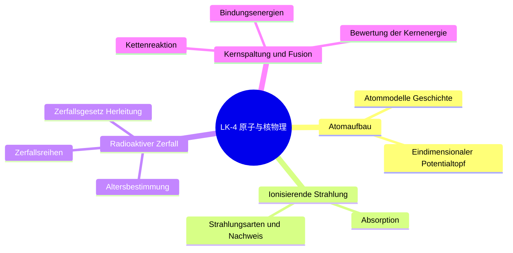
```mermaid
mindmap
  root((LK-4 原子与核物理))
    Atomaufbau
      Atommodelle Geschichte
      Eindimensionaler Potentialtopf
    Ionisierende Strahlung
      Strahlungsarten und Nachweis
      Absorption
    Radioaktiver Zerfall
      Zerfallsreihen
      Zerfallsgesetz Herleitung
      Altersbestimmung
    Kernspaltung und Fusion
      Bindungsenergien
      Kettenreaktion
      Bewertung der Kernenergie
```

> Basiskonzept 落点 [已验证]：E+G（质量亏损 → 推广能量守恒原理）· M+V（定量原子模型可算能级）· Z+D（单核衰变随机 vs 大量核按衰变律确定）。⚠️ **无 S+K 条目**。
> ⚠️ 本 IF 与 GK 的 `Strahlung und Materie` 是**重新切分**关系（GK 把辐射+原子+核合为一个 IF，LK 拆成 `Atom- und Kernphysik` 独立 IF 且大幅加深）→ **禁止按 GK 的 IF 名规划 LK 笔记**。

#### L2 LK-4a — Atomaufbau（原子结构）`[Q2][LK]`

- **Atommodelle von Dalton bis Rutherford（原子模型史）** `[Q2][LK]` · `PH-LK4-01`
  - 中文一句话：**须复述原子模型历史发展到首个核-壳模型的重要贡献**（LK 点名 Dalton/Thomson/Rutherford；GK 未点名具体人名）[已验证]。
  - Klausur-Anbindung：LK 历史论证题（AFB II–III）；须说明"每个模型被什么实验推翻"。
  - Operatoren：darstellen, begründen, bewerten
  - Lernweg ZH：先行组织者（"模型 → 关键实验 → 被推翻的原因"三段式时间轴）+ 检索练习。
  - Fehlerquelle：把模型史写成年代罗列而无论证链；不标注出处（`K10`）[据推断]。
  - 📓 笔记：⚠️ **缺口**

- **Eindimensionaler Potentialtopf und Pauli-Prinzip（一维势箱与泡利原理）** `[Q2][LK]` · `PH-LK4-02`
  - 中文一句话：**须说明模型及其局限，并由一维势箱经 `Pauli-Prinzip` 推广到多电子体系** [已验证]——**中国完全没有的模型**。
  - Klausur-Anbindung：LK 模型题（AFB II–III）；常追问"模型的局限"（正对 LK-2 的方法论要求）。
  - Operatoren：erklären, bewerten, vergleichen
  - Lernweg ZH：图形化自我解释（势箱能级图一图一概念）+ 带扶手自解释（"为什么势箱能给出离散能级？"）。
  - Fehlerquelle：把势箱当作真实原子描述（是模型，须说明局限）[据推断]。
  - 📓 笔记：⚠️ **缺口 🔴**（LK-4 最深的中国缺口之一）

#### L2 LK-4b — Ionisierende Strahlung（电离辐射）`[Q2][LK]`

- **Strahlungsarten und Nachweismöglichkeiten（辐射种类与探测方式）** `[Q2][LK]` · `PH-LK4-03`
  - 中文一句话：**须在 `Geiger-Müller-Zählrohr` 与能量灵敏探测器之间为目标实验作出选择** [已验证]——典型的 `Erkenntnisgewinnung` 设计题。
  - Klausur-Anbindung：LK 设计题（AFB III）；**须说明理由，不是复述**。
  - Operatoren：planen, begründen, vergleichen
  - Lernweg ZH：对比辨别（两种探测器：计数 vs 能谱，各自的适用目标）+ 检索练习（默"选择 → 理由"两段式）。
  - Fehlerquelle：只描述两种仪器而不作选择；或选了不给理由 [据推断]。
  - 📓 笔记：⚠️ **缺口 🔴**

- **Eigenschaften und Absorption ionisierender Strahlung（电离辐射的性质与吸收）** `[Q2][LK]` · `PH-LK4-04`
  - 中文一句话：**须用其性质（磁/电偏转、穿透、电离能力）解释**现象——LK 要求比 GK 更完整的因果链 [已验证]。
  - Klausur-Anbindung：LK 解释题（AFB II）；常与防护措施的评价同题。
  - Operatoren：erklären, untersuchen, bewerten
  - Lernweg ZH：对比辨别（三性质对照表）+ 因果链写作训练（"因为…所以…因此…"）。
  - Fehlerquelle：因果链只写两环就下结论 [据推断]。
  - 📓 笔记：⚠️ **缺口**

#### L2 LK-4c — Radioaktiver Zerfall（放射性衰变）`[Q2][LK]`

- **Zerfallsreihen und künstliche Kernumwandlungen（放射系与人工核转变）** `[Q2][LK]` · `PH-LK4-05`
  - 中文一句话：**须描述天然放射系与人工核转变过程（裂变/聚变/中子俘获），含 `Nuklidkarte`** [已验证]；GK 无 `Zerfallsreihen`。
  - Klausur-Anbindung：LK 读图与配平题（AFB II）；核素图是必用工具。
  - Operatoren：darstellen, ordnen, untersuchen
  - Lernweg ZH：工具训练（核素图上走完整条衰变链）+ 检索练习。
  - Fehlerquelle：α 与 β 衰变在核素图上的移动方向搞混 [据推断]。
  - 📓 笔记：⚠️ **缺口 🔴**

- **Herleitung des Zerfallsgesetzes aus der Aktivität（由活度推导衰变定律）** `[Q2][LK]` · `PH-LK4-06`
  - 中文一句话：**LK 须由 `Aktivität` 的定义推导衰变定律（含半衰期项）**；GK 只要求**应用** [已验证]——**"应用 vs 推导"是本条的核心差异**。
  - Klausur-Anbindung：LK 推导题（AFB II–III）；中国学生只练过应用 → 明确缺口。
  - Operatoren：herleiten, aufstellen, begründen
  - Lernweg ZH：正确例题精读（先看一遍完整推导）+ 带扶手自解释（"为什么变化率正比于当前核数？"）。
  - Fehlerquelle：把"衰变常数 λ"与"半衰期"的关系式写反（`T½ = ln2/λ`）[据推断]。
  - 🇨🇳 CN-Methode：微元法与极限思想（`Elementarisieren`：在 `dt` 内把 `N` 当常量 → `dN = -λN dt` → 求和/取极限得指数律）· DE-Anschluss: **LK-4 明文要求「由 `Aktivität` 的定义推导衰变定律」**（微分关系是本技法的天然落点）+ Basiskonzept `Mathematisieren und Vorhersagen` + EF 的 `Gesetz` 表征形式 · 合规性: ✅
  - 备注：只取"先微元、再求和"的框架，**不引入定积分运算**。德国要求"推导"而中国只要求"应用"——本卡恰好补上这一步思维。
  - 📓 笔记：⚠️ **缺口 🔴**

- **Altersbestimmung mit der C-14-Methode（碳-14 定年）** `[Q2][LK]` · `PH-LK4-07`
  - 中文一句话：**独立内容重点，须用衰变律求材料年代** [已验证]；GK 完全没有。
  - Klausur-Anbindung：LK 应用计算题（AFB II）；常追问方法的适用边界（AFB III）。
  - Operatoren：berechnen, begründen, bewerten
  - Lernweg ZH：正确例题精读 + 检索练习（默"测活度 → 求 N/N₀ → 反解 t"）。
  - Fehlerquelle：忘记说明"假设初始 C-14 含量与大气平衡"这一前提 → 模型边界未说明 [据推断]。
  - 📓 笔记：⚠️ **缺口**

#### L2 LK-4d — Kernspaltung und -fusion（裂变与聚变）`[Q2][LK]`

- **Bindungsenergien und Massendefekt（结合能与质量亏损，定量）** `[Q2][LK]` · `PH-LK4-08`
  - 中文一句话：**须在定量考虑结合能的前提下，用强相互作用描述裂变与聚变** [已验证]；GK 只要求 `E = Δm c²` 的定性理解。
  - Klausur-Anbindung：LK 必考定量题（AFB II–III）；结合能曲线是关键图。
  - Operatoren：berechnen, erklären, vergleichen
  - Lernweg ZH：图形化自我解释（结合能/核子曲线：一图一概念）+ 正确例题精读。
  - Fehlerquelle：把"比结合能最大处"说成"最不稳定"（是**最稳定**，铁峰）[据推断]。
  - 📓 笔记：⚠️ **缺口 🔴**

- **Kettenreaktion（链式反应）** `[Q2][LK]` · `PH-LK4-09`
  - 中文一句话：**独立内容重点，须说明链式反应作为裂变释能的核心特征** [已验证]；GK 完全没有。
  - Klausur-Anbindung：LK 解释题（AFB II）；常与临界质量、控制棒同题。
  - Operatoren：beschreiben, erklären, bewerten
  - Lernweg ZH：图形化自我解释（一代代中子数示意）+ 对比辨别（可控 vs 不可控）。
  - Fehlerquelle：把"临界"说成"停止"（是**自持**，既不衰减也不发散）[据推断]。
  - 📓 笔记：⚠️ **缺口**

- **Bewertung: Kernenergie und Endlagerung（核能与废物最终处置的评价）** `[Q2][LK]` · `PH-LK4-10`
  - 中文一句话：**LK 的 Bewertung 压轴区**：核裂变/聚变对全球能源供应的利弊 + **讨论放射性废物最终处置（多源资料）** [已验证]。
  - Klausur-Anbindung：压轴评价题（AFB III）；须多视角、须互相权衡、须 `lokal und global`。
  - Operatoren：bewerten, diskutieren, begründen
  - Lernweg ZH：先行组织者（价值/规范/事实三栏 + 五视角清单）+ TAP 对齐（按 300 min 的时间预算写完整评价）。
  - Fehlerquelle：⚠️ **只谈模型适用性或技术层面不得分**（规则 4）；不给出处（多源资料须 `K10` 标注）[已验证]。中国的 STSE 素养是优势，但须改掉"只谈技术"的习惯。
  - 📓 笔记：⚠️ **缺口 🔴**

---

## 3. Abitur-Übergang（EF→Q1→Q2 衔接台阶）

> 定义：**EF 教完了，但 Q 阶段默认你已会，或 Q 突然大幅加深**的地方。第 1–9 条全部 [已验证]（KLP 原文对照结论）；第 10–13 条中考试形式部分 [已验证]、教学排序建议 [据推断]。

| # | 台阶 | 从 | 到 | 缺口 | 对策 |
|---|---|---|---|---|---|
| **1** | 🔴🔴 **DGL 语言** | EF **全文不出现 `Differentialgleichung` 一词**；最深工具是「由测量数据求 v/a」 | **LK-1** 用 DGL + 给定解描述 RC 充放电；**LK-2** 由线性力律**自行推导**弹簧振子与小角单摆的 DGL，并由解求 `T` 与 `Thomson'sche Gleichung` | **EF 完全无前置** | ★ **《LK-DGL 前置包》**（小角线性化 CN-Methode 6 + 微元法 CN-Methode 7），**与 `03_Mathe` 的 Analysis 联动**；先精读一遍标准推导再自己做 |
| **2** | 🔴🔴 **场的数学化**（Coulomb / Potential） | EF 只有 `Gravitationsfeld`（场线图视角）；**无 `Coulomb'sches Gesetz`、无电势** | **LK-1 独立内容重点**：点电荷力计算 + 场强叠加 + 电势/电势差。须从「场 = 场线图」跃迁到「场 = 可用 1/r² 与标量势计算的量」 | **EF 完全无前置** | ★ **《场的数学化前置包》** —— 用中国必修3.1（库仑 + 电势）**直接前移**（这是中国学生的**优势**，反向补）；重点练 `E`/`U`/`W` 三量辨析 |
| **3** | 🟠 **二维运动的电学化** | EF 有 `waagerechter Wurf`，**无斜抛、无一般曲线运动** | GK-1/LK-1 直接进入带电粒子在匀强场中的轨道（抛物/圆周/螺旋）+ LK 的 `gekreuzte Felder` | 本质是**同一套运动学换到电学语境** | ★ **《平抛 → 电场偏转同构翻译表》** —— `g → qE/m` 一步替换，**性价比最高的前置补强**（EF 已教分解，只需补"力 → 加速度"） |
| **4** | 🟠 **`Winkelgeschwindigkeit` 的复用** | EF 有 ω（圆周运动本征量） | **LK-2 直接用它描述振动与波的相位**（DGL 解里 `ω = 2π/T`）；**GK-1 的波描述量里反而不强调 ω** | EF 的 ω **在 LK 是必备、在 GK 是可选** | GK 学生不必强练；LK 学生在 Q1 开学即把 ω 从"转得快慢"改述为"相位变化率" |
| **5** | 🟡 **能量守恒的广义化** | EF 的守恒是**机械能 + 动量**（力学封闭系统） | GK-4 / LK-4 出现 `Massendefekt` + `E = Δm c²`，KLP 明文说这是「**erweitert und verallgemeinert**」 | 守恒原理被推广到含质量-能量转换的系统 | 用 `Erhaltung und Gleichgewicht` 这条 Basiskonzept 串起来讲（**全科最长的一条链**），一张跨 IF 卡 |
| **6** | 🟡 **`Spannenergie` 的落点** | EF 列出 `Spannenergie` 但**EF 无振动** → 该量在 EF 没有应用落点 | **GK-1 / LK-2 的 `Federpendel`** 是它的唯一归宿 | 属「埋伏笔」而非「断层」 | EF 教 `Spannenergie` 时**明说一句**"这个量在 Q 阶段的弹簧振子才会用到"，避免学生判定其为无用知识 |
| **7** | 🟡 **`Millikan` 的层级跳跃** | — | GK 只要求「简化版本的**统计**评价」；LK 要求「**简单版本**说明基本**思路与结果**」 | 两级都不是完整实验，但 LK 要求讲清原理 | ⚠️ **按自己选的 Kursart 答题**：GK 写统计推断、LK 写思路与结果，答错层级都不理想 |
| **8** | 🟠 **能力动词等级的隐形跃升** | EF 全用 `beschreiben` / `untersuchen` / `nachvollziehen` | Q 全面换成 `erklären` / `beurteilen` / `reflektieren`；`E11` 增加 5 条科学判据（`Reproduzierbarkeit`/`Falsifizierbarkeit`/`Intersubjektivität`/`logische Konsistenz`/`Vorläufigkeit`） | **非知识点型台阶，最易被忽略** | ★ **《EF→Q 动词升级对照卡》** + 5 条科学判据知识卡；每次答题前先读动词再动笔 |
| **9** | 🟡 **「Bewerten 必须超出学科内部」的判分规则** | EF 的 B 条目较宽松 | Q 阶段明文把 `rein innerfachliche Bewertungen` 划归其他三维 → **写 Bewertungsaufgabe 时"只谈模型适用范围"不得分** | 与直觉相反 | ★ **《判分边界规则卡》**（四条规则）—— 成本最低、判分收益最高 |
| **10** | 🔴 **GK 与 LK 是两套 IF，不是「LK = GK + 加料」** | EF 2 个 IF 为共同前置 | Q 阶段 GK 4 个 IF 与 LK 4 个 IF **标题与切分方式完全不同**；GK 的「发电机/变压器/交流电」与 LK 的「自感/DGL/交叉场」**互不覆盖** | 选课不同则缺的知识块完全不同 | ★ **《GK ⇄ LK 分轨对照卡》**：逐块标注"GK 有 LK 无 / LK 有 GK 无 / 共有"，**禁止按 GK 的 IF 名规划 LK 笔记** |
| **11** | 🔴 **`Basiskonzepte` 四轴的建立（DE-only）** | EF 无显式要求（虽四个全覆盖） | Q 阶段 Basiskonzept 是德国作答的**「官方得分语言」**，直接命中评分准则 `Herstellen geeigneter Zusammenhänge` | 中国无对等的内容侧统摄概念 | ★ **《Basiskonzepte 四轴追踪卡》**，以 `Erhaltung und Gleichgewicht`（EF 力学 → 电动力学 → 量子 → 核物理）为主线 |
| **12** | 🔴 **从「按指导做实验」到「自行设计实验」** | EF/GK 以「按指导做」为主（归 `Sachkompetenz`） | LK 大量要求**自行设计实验**（长直线圈 B、短寿命半衰期、Resonanz、Dielektrikum 假设检验、探测器选择），归 `Erkenntnisgewinnung` | 中国有 21 个必做实验但**不训练"论证设计"** | ★ 补 `Erkenntnisgewinnung` 写法：变量控制 → 测量方案 → 数据处理 → 预期结果 → 误差来源 |
| **13** | 🟠 **考试形式台阶：90 min → 255/300 min，4 选 3** | EF 平时 Klausur **1–2 次 × 90 min**（实验可 +45） | Abitur **GK 255 / LK 300 min**（含 Auswahlzeit、不得中断），**一套 4 题选 3 题**，**禁止纯论述型任务** | 耐力、选题策略、材料挂靠三者同时加压 | 从 EF 起按「90 → 135 → 180 → 255/300」爬坡计时；**每题先扫 4 道再选题**；训练"任何答案都挂靠材料或实验"的写作习惯 |

> 🎯 **优先级结论**：**#1（DGL）与 #2（场的数学化）是最高的两条台阶，都集中在 LK 路线，且都无 EF 前置** → 最值得单独做过渡笔记。**#3（二维运动电学化）性价比最高**（学生完全有能力提前掌握）。**#9 + #11 + #12 属"判分规则型知识"，成本最低、收益最直接**。

---

## 4. 笔记缺口清单（施工图）

> ✅ **本施工图已于 2026-09-25 完成**（S8 十科笔记生产）：全部目标笔记已产出，逐条链接见 [`../S8-Noten-Index.md`](../S8-Noten-Index.md)。下表「⚠️ 缺口」为立项时的状态，保留作历史记录。

> 依据 `00_META/INDEX.md` 的 Physik 小节与 `04_Physik/` 实际文件清单核对。**现有 8 篇笔记全部落在 EF-1 的 Kinematik/Dynamik 上**；`Erhaltungssätze` 只覆盖能量侧、`Impuls` 完全缺失；**EF-2 与全部 Q 阶段（GK 与 LK 共 8 个 IF）为零覆盖** —— 这是本项目**最大的学科缺口** [已验证]。

### 4.1 现有笔记按 IF 归类

| Inhaltsfeld | 已有笔记 | 状态 |
|---|---|---|
| **EF-1** Kinematik | [`Gleichfoermige-Bewegung-Training`](../../04_Physik/Gleichfoermige-Bewegung-Training.md) · [`Gleichmaessig-beschleunigte-Bewegung-Freier-Fall`](../../04_Physik/Gleichmaessig-beschleunigte-Bewegung-Freier-Fall.md)（含平抛轨迹） | ✅ 约 75% |
| **EF-1** Dynamik / Energie | [`Newtonsche-Gesetze-und-Krafte`](../../04_Physik/Newtonsche-Gesetze-und-Krafte.md) | ✅（缺矢量一般方法、缺双视角训练） |
| **EF-1** Erhaltungssätze | 同上（仅能量侧） | 🔴 **`Impuls` + `Stoßvorgänge` 零覆盖** |
| **EF-1** 实验/图表 | [`Physik-IQB-EF-Training`](../../04_Physik/Physik-IQB-EF-Training.md) | ✅ |
| **EF-2** 圆周/引力/世界图景 | — | 🔴 **完全空白** |
| **GK-1 / GK-2 / GK-3 / GK-4** | — | 🔴 **完全空白（4 个 IF）** |
| **LK-1 / LK-2 / LK-3 / LK-4** | — | 🔴 **完全空白（4 个 IF，且与 GK 路线不同）** |
| 能力侧 / Operatoren | [`Klausur-Training/Physik-Operatoren-Check`](../../04_Physik/Klausur-Training/Physik-Operatoren-Check.md) | ✅（动词已铺，缺 AFB 情境映射） |
| 🇨🇳 CN 桥 | [`CN-Physik-Formelhandbuch`](../../04_Physik/CN-Physik-Formelhandbuch.md) · [`CN-Physik-Tricks`](../../04_Physik/CN-Physik-Tricks.md) · [`Klausur-Training/CN-Physik-Training`](../../04_Physik/Klausur-Training/CN-Physik-Training.md) | ✅ 已有（**须按 IF 重新切片**；中国「恒定电流」属纯 CN-only，须显式标注"桥接素材，非考纲内容"） |
| 跨 IF / Abitur 形式 | `Klausur-Training/Physik-Abitur-Aufgabentraining.md`（本树外已存在） | ✅ 已有 |

### 4.2 缺口清单（**共 22 项**）

| # | 目标笔记文件 | 对应节点 | 学段 · IF | 状态 |
|---|---|---|---|---|
| 1 | 《**LK-DGL 前置包**》（小角线性化 + 微元法，可与 `03_Mathe` 联动） | LK1-10 / LK2-02 / LK2-03 | Q2 · LK-1⇄LK-2 | ⚠️ 缺口 ★★★ **第一优先**（化解台阶①） |
| 2 | 《**场的数学化前置包**》（Coulomb + Potential + 场强叠加） | LK1-01 / LK1-02 | Q1 · LK-1 | ⚠️ 缺口 ★★★ **第二优先**（化解台阶②，中国可前移） |
| 3 | 《**Lorentzkraft 轨迹几何法**》（定圆心-找半径-算圆心角-算时间 + 临界三圆） | GK1-10 / LK1-05 / LK1-06 | Q1 · GK-1 / LK-1 | ⚠️ 缺口 ★★★ **第三优先** |
| 4 | 《**Impuls + 一维碰撞**》 | EF1-12 / EF1-13 | EF · EF-1 | ⚠️ 缺口 ★★★（EF 内即可闭环，现有零覆盖） |
| 5 | 《**EF-2 圆周运动与引力**》（七量 + Zentripetalkraft + Gravitationsfeld + Kepler + 卫星） | EF2-01–EF2-06 | EF · EF-2 | ⚠️ 缺口 ★★★（整个 IF 零覆盖） |
| 6 | 《**判分边界规则卡**》（四条能力归属规则 + EF→Q 动词升级 + 5 条科学判据） | 全树 · 能力侧 | 全学段 · 跨 | ⚠️ 缺口 ★★★（成本最低、判分最直接） |
| 7 | 《**Basiskonzepte 四轴追踪卡**》（以 `Erhaltung und Gleichgewicht` 为主线） | 全树 · 跨 IF | 全学段 · 跨 | ⚠️ 缺口 ★★★（德国作答的官方得分语言） |
| 8 | 《**GK ⇄ LK 分轨对照卡**》（谁有谁无逐块标注） | 全部 Q 阶段 | Q1/Q2 · 跨 | ⚠️ 缺口 ★★★ |
| 9 | 《**平抛 → 电场偏转同构翻译表**》 | EF1-04 / GK1-09 / LK1-04 | EF→Q1 · 跨 | ⚠️ 缺口 ★★（性价比最高） |
| 10 | 《**Erkenntnisgewinnung 实验设计写法**》（变量控制 → 数据处理 → 预期 → 误差） | LK1-07 / LK4-03 / LK2-04 | Q2 · LK | ⚠️ 缺口 ★★ |
| 11 | 《**EF-2 世界图景与 Zeitdilatation**》（含"标注出处"写作训练） | EF2-07–EF2-09 | EF · EF-2 | ⚠️ 缺口 ★★ |
| 12 | 《**GK-1 振动与波**》（Federpendel → 波 → Huygens → 干涉/衍射 → 双缝求 λ） | GK1-01–GK1-06 | Q1 · GK-1 | ⚠️ 缺口 ★★ |
| 13 | 《**GK-2 Quantenobjekte**》（光电效应 + De-Broglie + 电子双缝 + Welcher-Weg + Z+D） | GK2-01–GK2-06 | Q1/Q2 · GK-2 | ⚠️ 缺口 ★★ |
| 14 | 《**GK-3 电磁感应与能量传输**》（含 Induktionsgesetz 微分形式 + Generator/Transformator + Bewertung） | GK3-01–GK3-10 | Q1/Q2 · GK-3 | ⚠️ 缺口 ★★ |
| 15 | 《**GK-4 Strahlung und Materie**》（Franck-Hertz + 能级图 + 衰变律应用 + Nuklidkarte） | GK4-01–GK4-09 | Q2 · GK-4 | ⚠️ 缺口 ★★ |
| 16 | 《**LK-1 感应与自感**》（Induktionsgesetz + Lenz 双论证 + Selbstinduktion） | LK1-08 / LK1-09 | Q2 · LK-1 | ⚠️ 缺口 ★★ |
| 17 | 《**LK-2 Schwingkreis 与机械⇄电磁类比**》 | LK2-05 / LK2-06 / LK2-07 | Q2 · LK-2 | ⚠️ 缺口 ★★（德国招牌题型） |
| 18 | 《**LK-3 当代量子**》（Bremsstrahlung + Bragg 推导 + 波函数平方 + Delayed-Choice + Heisenberg） | LK3-02–LK3-07 | Q2 · LK-3 | ⚠️ 缺口 ★★（中德差距最大的一块） |
| 19 | 《**LK-4 原子与核物理**》（原子模型史 + 势箱/Pauli + 由 Aktivität 推导衰变律 + C-14 + 结合能 + Kettenreaktion） | LK4-01–LK4-10 | Q2 · LK-4 | ⚠️ 缺口 ★★ |
| 20 | 《**Vektorielle Größen 一般方法**》（分量分解与矢量加法的通用套路） | EF1-05 | EF · EF-1 | ⚠️ 缺口 |
| 21 | 《**受力 ⇄ 能量 双视角训练**》 | EF1-11 | EF · EF-1 | ⚠️ 缺口 |
| 22 | 《**CN-Physik-Brücke（含 CN-Methode 9 反例标注）**》 + Q1/Q2 术语卡 | 🇨🇳 各行 / 全树 | 跨 | ⚠️ 缺口（现有 CN 三篇须按 IF 重新切片） |

> **缺口合计：22 项**（★★★ 优先 8 项 · ★★ 11 项 · 一般 3 项）。
> **建议产出顺序**：①《LK-DGL 前置包》→ ②《场的数学化前置包》→ ③《Lorentzkraft 轨迹几何法》→ ④《Impuls + 一维碰撞》（EF 内闭环，最快见效）→ ⑤《判分边界规则卡》+《Basiskonzepte 四轴追踪卡》（成本最低）→ ⑥《EF-2 圆周运动与引力》→ ⑦ 按 GK / LK 路线逐 IF 推进。

---

## 变更记录

- 2026-09-24：创建（EF 版）。基于 NRW KLP Physik（Heft `4721`）与 `Physik-Oberstufe.md` 结构化提取，2 个 EF 的 Inhaltsfeld、共 24 个 L3 节点。
- 2026-09-24：**升级为 Abi-Baum（EF→Abitur 版，本版）**。变更如下：
  - ➕ frontmatter 新增 `stufe` / `abi_fokus` / `klp_quelle` 三字段；`operatoren` 填入物理**官方 25 个动词**（`ph_operatoren_ab_abitur2025_0.pdf`，gültig ab Abitur 2025）。`abi_fokus` 显式体现 **GK 与 LK 是两套不同的 Inhaltsfeld**。
  - ➕ **新增 §0 Methoden-Profil**：AFB I/II/III 权重表（GK/LK 分列，权重为 [据推断]、「AFB II 为重心」为 [已验证]）、11 条黄金学习法（全部引自 `Lernmethoden-Evidenz.md` 并标证据源，突出**自我解释 / 交错练习 / 对比辨别**）、三大典型失分点（**Bewerten 写成学科内评判** / 矢量性与过程缺失 / 卡在 DGL 与场的数学化两条台阶）、本课笔记八段结构模板（含**材料或实验挂靠说明**——因物理禁止纯论述题）。
  - ➕ **L1 由 2 个扩为 10 个**：EF 2 个（共同前置）+ **GK 4 个** + **LK 4 个**，并在总览里按 **EF / GK 路线 / LK 路线**三条分支呈现，明文标注「**GK 与 LK 不是同一套 IF，禁止按 GK 的 IF 名规划 LK 笔记**」。各 IF 增补 **Basiskonzept 落点**（第四条轴）。
  - ➕ **L3 由 24 个扩为 100 个**（EF1 16 / EF2 9 / GK1 12 / GK2 6 / GK3 10 / GK4 9 / LK1 10 / LK2 11 / LK3 7 / LK4 10），每个节点补齐「应试四行」：`中文一句话` / `Klausur-Anbindung`（题型·任务·AFB 层级）/ `Operatoren`（官方 25 动词）/ `Lernweg ZH`（绑定已论证的学习方法）/ `Fehlerquelle` / `📓 笔记`，并带学段标记 `[EF]`/`[Q1]`/`[Q2]`/`[GK]`/`[LK]` 与稳定节点 id（`PH-<IF>-<序号>`）。
  - ➕ **新增 🇨🇳 CN-Methode 层 15 处**（技法全部取自 `Mapping/Physik-DE-CN-Mapping.md` §3，每条标 DE-Anschluss 与合规性）：几何化轨迹链（GK1-10 ✅ / LK1-05 ✅ / LK1-06 ✅）· 整体法隔离法判据（EF1-08 ✅）· 守恒律选择策略·矢量性为第一判据（EF1-12 ✅）· 平抛→电场同构翻译（EF1-04 ✅ / GK1-09 ✅ / LK1-04 ✅）· 小角线性化（LK2-03 ✅）· 微元法（GK3-02 ✅ / LK1-10 ✅ / LK4-06 ✅）· 图像三件套（EF1-16 ✅ / GK3-09 ✅）· 极端值与量纲自检（LK1-01 ✅）· **CN-Methode 9 等效电源与动态电路分析（GK3-05 ⚠️ 反例）** —— 明确写出「**不是所有中国技法都该引入**」：该条违反铁律 1（是知识板块不是方法），德国 KLP 全文无「电路分析」IF，**不做笔记、仅标为桥接素材**。
  - ➕ **新增 §3 Abitur-Übergang**：13 级台阶表（DGL 语言① / 场的数学化② / 二维运动电学化③ / ω 复用④ / 守恒广义化⑤ / Spannenergie⑥ / Millikan 层级⑦ / **动词等级上移⑧** / Bewerten 边界规则⑨ / GK⇄LK 两套 IF⑩ / Basiskonzepte⑪ / 自行设计实验⑫ / 90→255/300 min 与 4 选 3⑬）。
  - ➕ **新增 §4 笔记缺口清单**：现有 8 篇按 IF 归类 + **22 项缺口**（★★★ 8 项），含指定产出《**Lorentzkraft 轨迹几何法**》《**Impuls + 一维碰撞**》《**LK-DGL 前置包**》（小角线性化 + 微元法，可与 Mathe 联动）。
  - 🔧 保留原有 EF 内容（24 个节点的中文导读与 Klausur-Anbindung）并升级格式；补入 EF-1 的 `waagerechter Wurf`（KLP 明示条目，旧版遗漏）与 `vektorielle Größen`；保留 `Feldkonzept` 讲引力、EF 唯一的场、EF 唯一的非经典物理（`Zeitdilatation`/`Lichtuhr`）等已验证结论。
