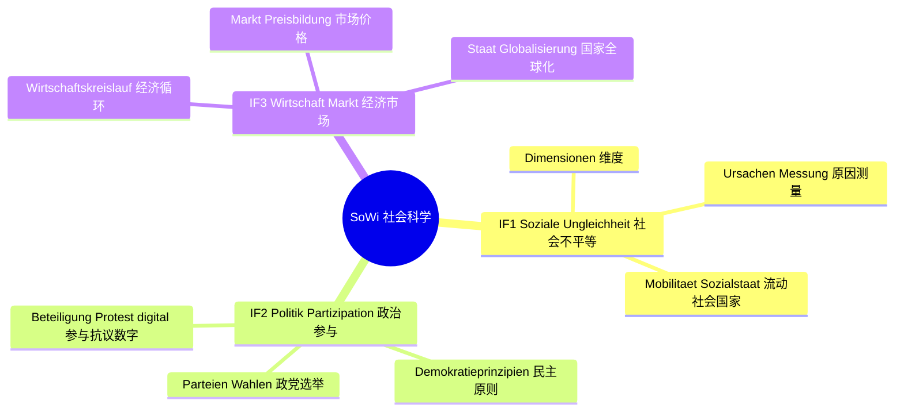
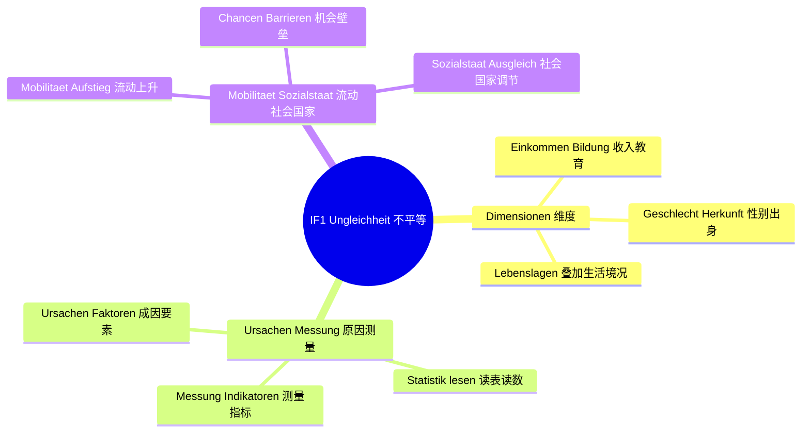
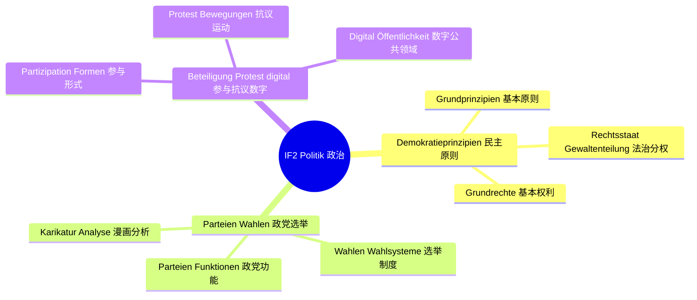
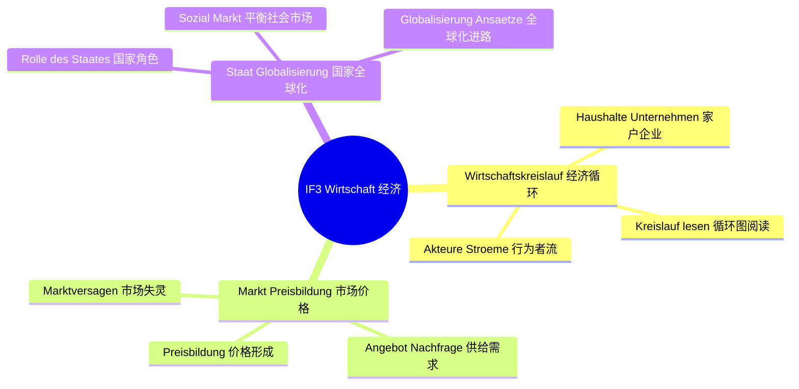

# Lernbaum SoWi（社会科学学习树 · EF）

> 中文一句话：EF考"不平等从哪来、政治怎么参与、经济怎么转"，题型全是"材料→描述→分析→评价"。
> KLP-Basis: NRW Kernlehrplan GeWi EF — IF 1 Soziale Ungleichheit, IF 2 Politische Strukturen & Partizipation, IF 3 Wirtschaft & Markt. Klausur-Fokus: Sachtext + Karikatur/Tabelle/Statistik, Dreischritt darstellen→analysieren→beurteilen (30/40/30), Einleitung in 3 Sätzen.

## 0. 总览 Gesamtübersicht（L0→L1→L2）

## 1. IF 1 分图 Detailkarte

## 2. IF 2 分图 Detailkarte

## 3. IF 3 分图 Detailkarte

## 4. 节点明细 Knotendetails

### IF 1 Soziale Ungleichheit（社会不平等）

中文在上：本领域抓"维度→原因→测量→流动→调节"一条链，所有材料题都按这条链设问。
Deutsch unten: Dieses Feld folgt der Kette Dimensionen → Ursachen → Messung → Mobilität → Ausgleich; alle Materialaufgaben lassen sich daran aufhängen.

#### L2-U1 Dimensionen（不平等维度）

- **Einkommen & Bildung（收入与教育）**
  - 中文一句话：最常考的两个维度，收入看分层、教育看机会，读表先认清单位和年份。
  - Operatoren: [darstellen, analysieren]
  - Klausur-Anbindung: Aufgabenteil darstellen (30%) — Sachtext/Tabelle zum Thema in 3-Satz-Einleitung plus Kernbefunde wiedergeben.
  - Leitfrage DE / ZH: Wie hängen Einkommen und Bildung zusammen? / 收入和教育之间有什么关系？
- **Geschlecht & Herkunft（性别与出身/迁移背景）**
  - 中文一句话：记住这是"结构性"维度，个人努力解释不了全部，分析段要落到结构原因。
  - Operatoren: [darstellen, analysieren]
  - Klausur-Anbindung: Aufgabenteil analysieren (40%) — Ursachen/Folgen/Akteure mit Fachbegriffen (z. B. strukturelle Benachteiligung) erklären.
  - Leitfrage DE / ZH: Wo wirkt Herkunft stärker als Leistung? / 出身在哪里比成绩更有影响？
- **Lebenslagen-Überlagerung（生活境况叠加：多维度交叉）**
  - 中文一句话：真实不平等是多维度叠加的，答题要写出"谁+在哪方面+和谁比"三要素。
  - Operatoren: [darstellen, beurteilen]
  - Klausur-Anbindung: Urteilsteil beurteilen (30%) — Kriterien (Gerechtigkeit/Chancengleichheit) nennen, eigenes Urteil begründen.
  - Leitfrage DE / ZH: Wer ist mehrfach benachteiligt und warum? / 谁面临多重不利，为什么？

#### L2-U2 Ursachen & Messung（原因与测量）

- **Ursachen & Faktoren（成因要素：家庭、教育、劳动力市场）**
  - 中文一句话：原因分三筐——家庭资源、教育路径、劳动力市场，分析段每筐写一句就不空。
  - Operatoren: [analysieren, darstellen]
  - Klausur-Anbindung: analysieren-Teil — Ursachen mit Fachbegriffen den Materialbefunden zuordnen.
  - Leitfrage DE / ZH: Welche Ursachen erklärt das Material, welche nicht? / 材料解释了哪些成因，还有哪些没解释？
- **Messung & Indikatoren（测量与指标）**
  - 中文一句话：会认常用指标和它的局限，凡是"数据能说明什么、不能说明什么"都要答两面。
  - Operatoren: [darstellen, analysieren]
  - Klausur-Anbindung: Materialarbeit Statistik/Tabelle — Achsen, Einheiten, Zeitraum benennen, Trendaussage formulieren.
  - Leitfrage DE / ZH: Was misst der Indikator — und was verschweigt er? / 这个指标测了什么，又掩盖了什么？
- **Statistik lesen（读表读数：描述不评价）**
  - 中文一句话：描述段只写"看到了什么"，最高值、最低值、变化三句式，不提前下判断。
  - Operatoren: [darstellen]
  - Klausur-Anbindung: darstellen-Teil — Tabelle/Statistik sachlich beschreiben, ohne zu werten.
  - Leitfrage DE / ZH: Was zeigt die Statistik genau? / 统计图到底显示了什么？

#### L2-U3 Mobilität & Sozialstaat（流动与社会国家）

- **Soziale Mobilität & Aufstieg（社会流动与上升）**
  - 中文一句话：流动问的是"能不能换层"，上升故事一个不够，要问整体概率和条件。
  - Operatoren: [analysieren, beurteilen]
  - Klausur-Anbindung: analysieren→beurteilen — Mobilitätschancen aus Material deuten, dann mit Kriterium Chancengleichheit bewerten.
  - Leitfrage DE / ZH: Wie offen ist der Aufstieg wirklich? / 上升通道到底有多开放？
- **Chancen & Barrieren（机会与壁垒）**
  - 中文一句话：机会和壁垒成对写——每写一个机会就配一个壁垒，分析立刻变立体。
  - Operatoren: [analysieren, erörtern]
  - Klausur-Anbindung: analysieren-Teil — fördernde vs. hemmende Faktoren gegenüberstellen.
  - Leitfrage DE / ZH: Welche Barrieren bremsen gleiche Chancen? / 哪些壁垒拖住了平等机会？
- **Sozialstaat & Ausgleich（社会国家与调节）**
  - 中文一句话：社会国家是"调节器"，评价段写它做了什么、够不够、代价是什么。
  - Operatoren: [darstellen, beurteilen]
  - Klausur-Anbindung: beurteilen-Teil — sozialstaatliche Maßnahmen am Kriterium Gerechtigkeit prüfen, eigenes Urteil.
  - Leitfrage DE / ZH: Gleicht der Sozialstaat fair aus? / 社会国家的调节算公平吗？

### IF 2 Politische Strukturen & Partizipation（政治结构与参与）

中文在上：本领域抓"原则→制度→参与"三层，漫画和统计表是高频材料，描述和分析要分开写。
Deutsch unten: Dieses Feld baut auf Prinzipien → Institutionen (Parteien/Wahlen) → Partizipation; Karikatur und Statistik sind Leitmaterialien, beschreiben und deuten strikt trennen.

#### L2-P1 Demokratieprinzipien（民主原则）

- **Grundprinzipien（基本原则：人民主权、多数、少数保护）**
  - 中文一句话：民主三件套——多数决定、少数受保护、权力有任期，判断材料先套这三条。
  - Operatoren: [darstellen, analysieren]
  - Klausur-Anbindung: darstellen-Teil — demokratische Prinzipien im Sachtext identifizieren und wiedergeben.
  - Leitfrage DE / ZH: Wo zeigt das Material Demokratie, wo nicht? / 材料哪里体现民主，哪里没有？
- **Rechtsstaat & Gewaltenteilung（法治与分权）**
  - 中文一句话：凡是"谁监督谁、权力是否越界"的题都归这里，答题点名机构和职能。
  - Operatoren: [darstellen, analysieren]
  - Klausur-Anbindung: analysieren-Teil — Akteure und Kompetenzen zuordnen, Kontrolle erklären.
  - Leitfrage DE / ZH: Wer kontrolliert wen mit welchen Mitteln? / 谁用什么手段监督谁？
- **Grundrechte（基本权利）**
  - 中文一句话：基本权利是参与的底线，遇到抗议、言论、集会材料先想权利再谈界限。
  - Operatoren: [darstellen, beurteilen]
  - Klausur-Anbindung: beurteilen-Teil — Grundrechte als Kriterium nennen, Eingriff vs. Schutz abwägen.
  - Leitfrage DE / ZH: Wo endet mein Recht, wo beginnt das der anderen? / 我的权利在哪里结束，他人的从哪里开始？

#### L2-P2 Parteien & Wahlen（政党与选举）

- **Parteien & Funktionen（政党与功能）**
  - 中文一句话：政党功能记"聚合、表达、参政、执政"四词，材料里找对应句即可得分。
  - Operatoren: [darstellen, analysieren]
  - Klausur-Anbindung: darstellen/analysieren — Parteifunktionen am Sachtext belegen und einordnen.
  - Leitfrage DE / ZH: Welche Parteifunktion zeigt das Material? / 材料体现了政党的哪项功能？
- **Wahlen & Wahlsysteme（选举与选举制度，学校简化版）**
  - 中文一句话：选举是授权和问责，制度差异只记"怎么把票变成席位、有什么后果"。
  - Operatoren: [darstellen, analysieren]
  - Klausur-Anbindung: analysieren-Teil mit Statistik — Wahl-/Umfragewerte beschreiben und Folgen für Mehrheiten deuten.
  - Leitfrage DE / ZH: Was folgt aus dem Wahlergebnis für Regieren? / 选举结果对组阁执政意味着什么？
- **Karikatur-Analyse（漫画分析：描述→解读→挂钩）**
  - 中文一句话：漫画三步——先写看见了什么，再写讽刺指向，最后挂一个政治概念。
  - Operatoren: [darstellen, analysieren]
  - Klausur-Anbindung: Materialarbeit Karikatur — Bildelemente sachlich beschreiben, dann Deutung mit Fachbegriff.
  - Leitfrage DE / ZH: Was kritisiert die Karikatur mit welchen Mitteln? / 漫画用什么手法批评了什么？

#### L2-P3 Beteiligung, Protest & digital（参与、抗议与数字公共领域）

- **Partizipationsformen（参与形式：投票到请愿到社团）**
  - 中文一句话：参与按"制度内/制度外、个人/集体"分类，分类写出来分析分就稳了。
  - Operatoren: [darstellen, analysieren]
  - Klausur-Anbindung: analysieren-Teil — Beteiligungsformen aus Material sortieren und Akteure benennen.
  - Leitfrage DE / ZH: Wer beteiligt sich wie — und wer nicht? / 谁以什么方式参与，谁没有？
- **Protest & Bewegungen（抗议与运动）**
  - 中文一句话：抗议要答"诉求、手段、合法边界"三问，缺一问就少一层。
  - Operatoren: [analysieren, beurteilen]
  - Klausur-Anbindung: analysieren→beurteilen — Protestanliegen und Mittel deuten, dann Legitimität mit Kriterien prüfen.
  - Leitfrage DE / ZH: Wann ist Protest legitim? / 抗议何时是正当的？
- **Digital & Öffentlichkeit（数字参与与公共领域）**
  - 中文一句话：数字记住两面——降低门槛但带来碎片和情绪化，评价段正好用这对矛盾。
  - Operatoren: [analysieren, beurteilen]
  - Klausur-Anbindung: beurteilen-Teil — digitale Beteiligung an Kriterien (Teilhabe/Deliberation) messen, eigenes Urteil.
  - Leitfrage DE / ZH: Stärkt das Netz die Demokratie oder spaltet es sie? / 网络是增强民主还是分裂民主？

### IF 3 Wirtschaft & Markt（经济与市场）

中文在上：本领域抓"循环→价格→国家→全球"四步，循环图和价格表要会读，评价落到效率与公平。
Deutsch unten: Dieses Feld folgt Kreislauf → Preisbildung → Staat → Globalisierung; Kreislauf- und Preisgrafiken sicher lesen, Urteil an Effizienz und Gerechtigkeit binden.

#### L2-W1 Wirtschaftskreislauf（经济循环）

- **Akteure & Ströme（行为者与流：钱、物、劳务）**
  - 中文一句话：先标出谁和谁换了什么，箭头方向写对，描述段就不会丢分。
  - Operatoren: [darstellen, analysieren]
  - Klausur-Anbindung: darstellen-Teil — Akteure und Ströme des Schaubilds sachlich wiedergeben.
  - Leitfrage DE / ZH: Wer tauscht was mit wem? / 谁和谁交换了什么？
- **Haushalte & Unternehmen（家户与企业）**
  - 中文一句话：家户给要素、企业给产品，凡是"谁提供、谁消费"都回这两类。
  - Operatoren: [darstellen, analysieren]
  - Klausur-Anbindung: analysieren-Teil — Rollen im Kreislauf zuordnen, einfache Störung (z. B. Konsumrückgang) fortdenken.
  - Leitfrage DE / ZH: Was passiert bei einer Störung im Kreislauf? / 循环中一环出问题会发生什么？
- **Kreislauf lesen（循环图阅读：不加评价的复述）**
  - 中文一句话：循环图只复述流向和关系，评价留到后两步，这是时间分配30/40/30的第一步。
  - Operatoren: [darstellen]
  - Klausur-Anbindung: darstellen-Teil (30%) — Schaubild in 3-Satz-Einleitung einbetten, Kernströme nennen.
  - Leitfrage DE / ZH: Welche Ströme trägt das Modell? / 这个模型呈现了哪些流？

#### L2-W2 Markt & Preisbildung（市场与价格形成）

- **Angebot & Nachfrage（供给与需求）**
  - 中文一句话：两条线的方向背熟——价高卖得多买得少，价低反过来，读图就靠它。
  - Operatoren: [darstellen, analysieren]
  - Klausur-Anbindung: Materialarbeit Grafik — Kurven beschreiben, Mengen-/Preisänderung ablesen.
  - Leitfrage DE / ZH: Wie reagieren Menge und Preis aufeinander? / 量和价格如何相互反应？
- **Preisbildung（价格形成：交点与变动）**
  - 中文一句话：价格在交点处，移动一条线就讲一个故事，分析段只讲线动了哪条、为什么。
  - Operatoren: [analysieren, darstellen]
  - Klausur-Anbindung: analysieren-Teil (40%) — Preisänderung auf Angebots-/Nachfrageverschiebung zurückführen.
  - Leitfrage DE / ZH: Warum steigt oder fällt der Preis hier? / 这里的价格为什么涨或跌？
- **Marktversagen（市场失灵：外部性与公共品，简化版）**
  - 中文一句话：市场不是万能的，污染不管、公共品没人供时失灵，这是引出国家角色的桥。
  - Operatoren: [analysieren, beurteilen]
  - Klausur-Anbindung: analysieren→beurteilen — Versagensfall benennen, dann staatliches Eingreifen am Kriterium Effizienz/Fairness prüfen.
  - Leitfrage DE / ZH: Wo versagt der Markt im Material? / 材料中的市场在哪里失灵？

#### L2-W3 Staat & Globalisierung（国家角色与全球化）

- **Rolle des Staates（国家角色：规则、调节、保障）**
  - 中文一句话：国家三活——定规则、当裁判、兜底线，凡建议"国家该管"都要配一条依据。
  - Operatoren: [darstellen, beurteilen]
  - Klausur-Anbindung: beurteilen-Teil (30%) — Staatseingriff mit Kriterien prüfen, eigenes Urteil mit Abwägung.
  - Leitfrage DE / ZH: Soll der Staat hier eingreifen? / 国家在这里该不该出手？
- **Sozial & Markt im Ausgleich（社会与市场的平衡）**
  - 中文一句话：效率和公平都要，评价段写清"得到什么、付出什么"，才算完整的判断。
  - Operatoren: [analysieren, beurteilen]
  - Klausur-Anbindung: beurteilen-Teil — Effizienz vs. Gerechtigkeit abwägen, begründetes Urteil formulieren.
  - Leitfrage DE / ZH: Wie viel Markt verträgt die Fairness? / 公平能承受多少市场？
- **Globalisierung-Ansätze（全球化进路：联系、机会、风险）**
  - 中文一句话：全球化记"连得紧、机会多、风险传得快"，材料给哪面就先描述哪面。
  - Operatoren: [darstellen, beurteilen]
  - Klausur-Anbindung: darstellen→beurteilen — Globalisierungsbezug des Materials wiedergeben, Chancen/Risiken mit Kriterien bewerten.
  - Leitfrage DE / ZH: Wer gewinnt, wer verliert durch Verflechtung? / 相互依存让谁受益、让谁受损？
