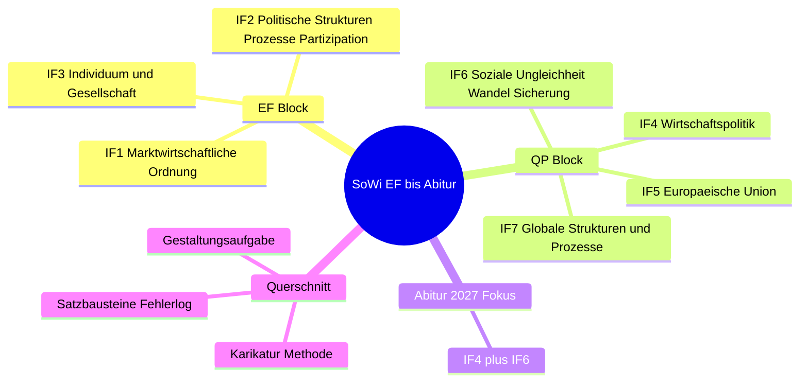
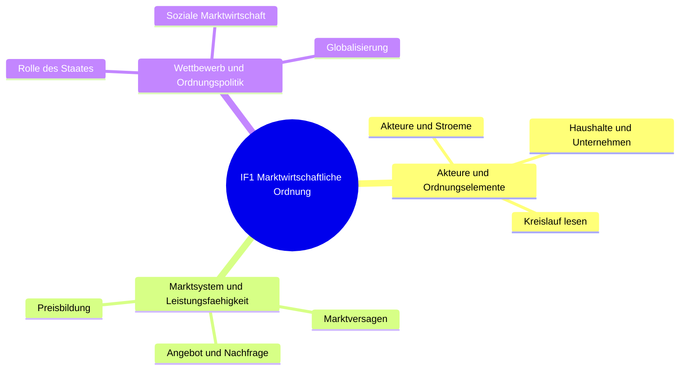
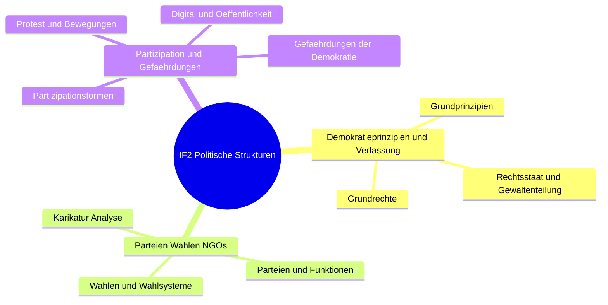
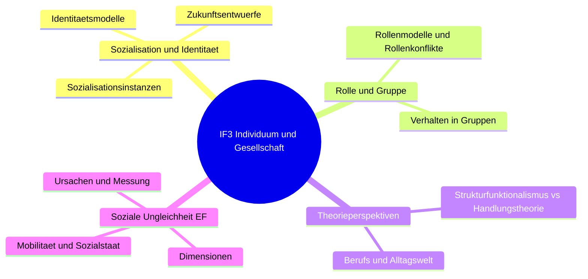
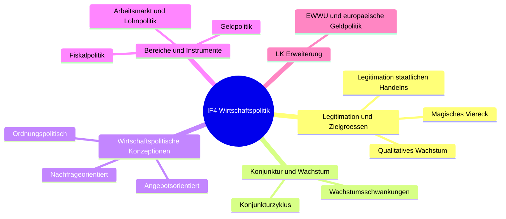
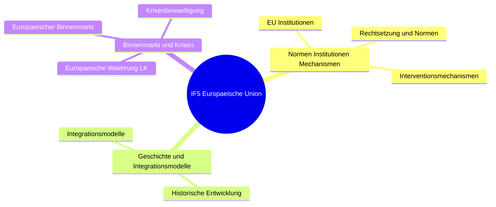
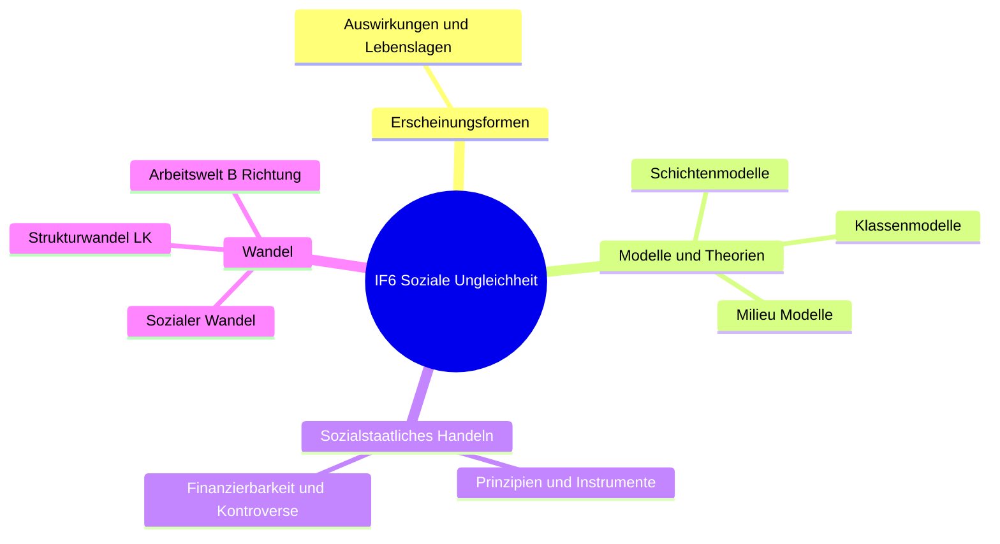
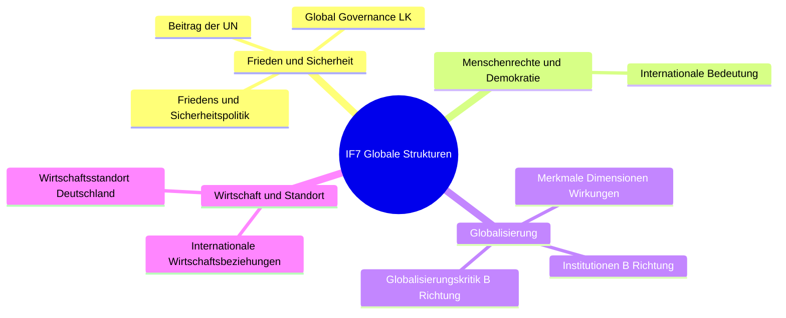

# Lernbaum SoWi（社会科学学习树 · EF→Abitur）

> 中文一句话：EF 打三个微观/中观抓手（市场怎么转、政治怎么参与、人怎么被社会塑造），Q1+Q2 整整套换成四个宏观抓手（经济政策 / 欧盟 / 社会不平等 / 全球结构），终点是 Abitur 2027 聚焦 IF4+IF6 的 3 题选 1。
> KLP-Basis: NRW KLP SoWi 2013（Heft 4717）· Abschnitt A 纯 SoWi 为主线，Abschnitt B（SoWi/Wirtschaft）差异单列 · **7 个 IF：EF 用 IF1–3，Qualifikationsphase 用 IF4–7，两级完全不重叠** [已验证]
> Klausur-Fokus: EF 1–2 次 × 90 min（gesellschaftswissenschaftliches Fach 类别）[已验证]；Abitur **3 题选 1**，LK **300 min** / GK **240 min**（含 Auswahlzeit）[已验证]；题型含分析型 Aufgabe 与 **Gestaltungsaufgabe** [据推断]；评分 EPA 0–15。
> Operatoren-Quelle: `../Curriculum/Deutschland/Operatoren-NRW-Alle-Faecher.md` §2（SoWi **29 个官方动词**，SoWi 与 SoWi/Wirtschaft 共用同一份表）[已验证]
> Formate-Quelle: `../Curriculum/Klausur-Formate/Klausur-und-Abitur-Formate.md` §3.7 [已验证]

> ⚠️ **证据标记约定**：`[已验证]` = KLP/官方 PDF 原文可查；`[据推断]` = 由考纲结构推导；`[未获取到]` = 官方源未提取。
> ⚠️ **Abitur 2027 聚焦 IF4+IF6 本项目未从官方 `sozialwissenschaften_2027_gg.pdf` 正文验证** → 全文件一律标 `[据推断]`。
> ⚠️ **KLP 只有 EF 与 Qualifikationsphase 两级，无 Q1/Q2 标记** [已验证]。本文件的 `[Q1]`/`[Q2]` 是项目按 NRW 惯例（Q1 常 IF4+IF5、Q2 常 IF6+IF7）的**资源排布标签**，`[据推断]`，非 KLP 原文。

---

## 0. Methoden-Profil（方法论画像 —— 本设计第二核心）

### ① Abitur 能力权重（AFB 分布）

| AFB | 层级 | SoWi 权重 | 说明 |
|---|---|---|---|
| **I** | Reproduktion | **≈20%** | 只落在 `benennen / nennen / beschreiben / darstellen`（四者在 SoWi 官方表均为 **I–II**）[已验证] |
| **II** | Reorganisation und Transfer | **≈40%** | `analysieren`（überw. II）、`auswerten`、`erklären`、`ermitteln`、`erschließen`、`herausarbeiten`、`einordnen`（überw. II）[已验证]。**Abitur 官方要求 AFB II 为重点** [已验证] |
| **III** | Reflexion und Problemlösung | **≈40%** | SoWi 29 动词中 **12 个为纯 III**：`begründen / beurteilen / bewerten / diskutieren / entwerfen / entwickeln / erörtern / gestalten / problematisieren / prüfen / sich auseinandersetzen / Stellung nehmen` [已验证] |

> 权重比 [据推断]（由 Operatoren AFB 归属分布 + Abitur「三 AFB 全覆盖、II 为重点」通则推得）。
> 💡 **SoWi 是十科里 AFB III 密度最高的科目之一**——41% 的官方动词是纯 III。这意味着：**只背概念 + 只会描述，在 SoWi 里最多拿一半分**。

### ② 黄金学习法（证据来自 `../Lernmethoden-Evidenz.md`）

| 方法 | 证据来源 | SoWi 应用方式 |
|---|---|---|
| **检索练习 Retrieval Practice** | Karpicke & Blunt 2011（d≈1.0，胜概念图） | 合书默写「模型对照表 / Operatoren 定义」，不重读笔记 [已验证] |
| **间隔重复 Spaced Repetition** | Rohrer 2007/2015/2020；FSRS retention 0.9 | 术语卡 + 模型卡走到期制；按 Klausur 倒排三轮，不平均用力 [已验证] |
| **TAP 同型练习（Transfer-Appropriate Processing）** | Adesope 2017 / Rowland 2014（一致 g≈0.63 > 不一致 0.53） | **平时 check 题必须长成 Klausur 的样子**：同题型、同 Operator 题干（用 `../08_SoWi/Klausur-Training/Satzbausteine.md` 的句式）[已验证] |
| **交错 + 辨别 Interleaving / Discriminative Contrast** | Rohrer & Taylor 2007（d≈1.34）；Foster 2019 | 同一次混排「概念辨析 + Karikatur + Stellungnahme」；每题先问「这题用哪个模型/哪个 IF？」选错记 Fehlerlog 标「辨别错」[已验证] |
| **正确例题 + 带扶手自解释** | Barbieri 2023（g≈0.48）；Wittwer & Renkl 2010 | 新题型首学 = 1 篇正确范例精读 + 两问自解释（哪条规则？为什么这步合法？）；**开放式「讲一遍」不算首学** [已验证] |
| **反馈三层走** | Brummer 2024（数字反馈 g≈0.41，KR 最强 g≈0.64）；Kandemir（时机无差异 g≈0.03） | 先判对错 → 整套做完再统一展开 → 错因归类（辨别错 / 知识错 / 表达错）[已验证] |

> ⚠️ 禁止「多读几遍笔记」当复习（Dunlosky 2013：rereading/highlighting 为 **niedrig** 证据等级）[已验证]。

### ③ 三大典型失分点

1. **Operatoren 做错 = 整题跑题**。最致命的两组：`beurteilen`（Sachurteil 事实判断）vs `bewerten`/`Stellung nehmen`（Werturteil，**额外**需反思价值尺度）；`erklären`（归因到规则/规律性）vs `erläutern`（补信息加例子使其易懂）。[已验证，Operatoren 表 §3.2]
2. **描述段提前评价 + 日常语代替 Fachsprache**。EF 三步 darstellen/analysieren/beurteilen（约 30/40/30）[据推断] 中，darstellen 段混入 Wertung，直接压掉后面两段的区分度；同时 §2.3 九项评分标准里 `Fachsprache` 与 `Vielfalt der Gesichtspunkte` 双双失分。[已验证]
3. **QP 层缺「理论坐标」就直接 beurteilen/erörtern**。KLP 从 EF 到 QP 要求**每个 IF 都做模型与理论对照**（经济政策构想对照、不平等模型对照、一体化模型对照）；没有对照表的评价段 = AFB III 直接失分。[据推断，SoWi-Oberstufe.md §5.5 台阶 3]

> 附加硬约束：Q 阶段语言错误**最多扣 2 Notenpunkte**（EF 降一个等级）——中文母语者的德语写作是计分项，不是「内容对了就行」。[已验证，Klausur-Formate §2.4]

### ④ 本课笔记结构模板

```markdown
# <主题名> `[EF | Q1 | Q2]` · IF<n>
## 1. Begriffskarte（术语卡）
- 定义（德语 Fachbegriff + 中文一句话）／易混邻居（Discriminative Contrast 用）
## 2. Modell-Tabelle（模型对照表）      ← QP 层必写，EF 层选写
| 模型 | 核心变量 | 解释力 | 盲区 | 典型 Abitur 落点 |
## 3. Material-Dreischritt（材料三件套）
- darstellen 句式 / analysieren 句式 / beurteilen+erörtern 句式
## 4. Operatoren-Zuordnung
- 本题最可能出现的 2–3 个动词 + AFB 层级
## 5. Fehlerquelle（对接入 08_SoWi/Klausur-Training/Fehlerlog.md）
- 辨别错 / 知识错 / 表达错 各一条
## 6. 📓 交叉链接
- 上游：SoWi-Oberstufe.md §2 IF<n>；下游：Klausur-Training/Satzbausteine.md
```

> 配图规则：一图只讲一个概念（Mayer CTML / Cromley 2025 g≈0.37），装饰图不进库 [已验证]。

---

## 1. 总览 Gesamtübersicht（L0→L1→L2）


```mermaid
mindmap
  root((SoWi EF bis Abitur))
    EF Block
      IF1 Marktwirtschaftliche Ordnung
      IF2 Politische Strukturen Prozesse Partizipation
      IF3 Individuum und Gesellschaft
    QP Block
      IF4 Wirtschaftspolitik
      IF5 Europaeische Union
      IF6 Soziale Ungleichheit Wandel Sicherung
      IF7 Globale Strukturen und Prozesse
    Abitur 2027 Fokus
      IF4 plus IF6
    Querschnitt
      Karikatur Methode
      Gestaltungsaufgabe
      Satzbausteine Fehlerlog
```

### 1.1 学段 — IF 归属（**L1 与 KLP 逐一对齐**）

| 学段 | IF | Inhaltsfeld（KLP 原文） | 中文 | 笔记状态 |
|---|---|---|---|---|
| EF | **IF1** | Marktwirtschaftliche Ordnung | 市场经济秩序 | 有（Konsum / Soziale Marktwirtschaft / Krise） |
| EF | **IF2** | Politische Strukturen, Prozesse und Partizipationsmöglichkeiten | 政治结构、过程与参与可能 | **覆盖最完整** |
| EF | **IF3** | Individuum und Gesellschaft | 个体与社会 | 基本覆盖（含 EF 层 Soziale Ungleichheit） |
| Q1+Q2 | **IF4** | Wirtschaftspolitik | 经济政策 | ⚠️ **无正式笔记** · 🎯 Abitur 聚焦 |
| Q1+Q2 | **IF5** | Europäische Union | 欧盟 | ⚠️ **完全空白** |
| Q1+Q2 | **IF6** | Strukturen sozialer Ungleichheit, sozialer Wandel und soziale Sicherung | 社会不平等结构、社会变迁与社会保障 | ⚠️ 仅 EF 层 · 🎯 Abitur 聚焦 |
| Q1+Q2 | **IF7** | Globale Strukturen und Prozesse | 全球结构与进程 | ⚠️ **完全空白** |

[已验证] 7 个 IF 为 Abschnitt A / B 共用；EF 与 QP 的 IF **完全不重叠、不共享** [已验证]。

### 1.2 双 Abschnitt（A/B）与 GK/LK 两条轴

| 轴 | 取值 | 差异所在 |
|---|---|---|
| **Abschnitt** | A = Sozialwissenschaften（纯 SoWi）· B = Sozialwissenschaften/Wirtschaft | 共用 7 IF 与 4 Kompetenzbereiche，差异只在各 IF 下 Schwerpunkte 的取舍与深度 [已验证] |
| **Kursart** | GK / LK | LK 增量集中在 **IF4/IF5 的欧洲维度**与 **IF7 的 Global Governance**；IF6 的 LK 增量高度依赖分支 [已验证] |

> 本项目**以 Abschnitt A 为主线**（用户修纯 SoWi），B 方向差异在各 IF 内单列标注。

---

## 2. 分 IF 展开（L1→L2→L3 + 应试四行）

### L1-1: IF1 Marktwirtschaftliche Ordnung（市场经济秩序）`[EF]`


```mermaid
mindmap
  root((IF1 Marktwirtschaftliche Ordnung))
    Akteure und Ordnungselemente
      Akteure und Stroeme
      Haushalte und Unternehmen
      Kreislauf lesen
    Marktsystem und Leistungsfaehigkeit
      Angebot und Nachfrage
      Preisbildung
      Marktversagen
    Wettbewerb und Ordnungspolitik
      Rolle des Staates
      Soziale Marktwirtschaft
      Globalisierung
```

#### L2-M1 Akteure & Ordnungselemente（行为者与秩序要素）

- **Akteure & Ströme（行为者与流：钱 / 物 / 劳务）** `[EF]`
  - 中文一句话：先标出谁和谁换了什么，箭头方向写对，描述段就不会丢分。
  - Klausur-Anbindung：EF Klausur 90 min 的 darstellen 段（约 30%）——Schaubild 的 Akteure 与 Ströme 用术语复述；Abitur 不单独考（IF1 不属 QP）[已验证]。
  - Operatoren：`darstellen`（I–II）· `beschreiben`（I–II）
  - Lernweg ZH：画一遍空白循环图并合书默画（**检索练习** Karpicke & Blunt 2011，d≈1.0）；箭头方向做成 5 张 FSRS 小卡。
  - Fehlerquelle：把「Güterstrom」与「Geldstrom」方向写反；或把 Staat 漏画成第四方。
  - 📓 笔记：[Konsum-Wirtschaften](../../08_SoWi/Texte-Analyse/Konsum-Wirtschaften.md)（Kap.8）· ⚠️ 无「循环图专练」卡
- **Haushalte & Unternehmen（家户与企业：要素 / 产品两市场）**
  - 中文一句话：家户给要素、企业给产品，凡是「谁提供、谁消费」都回这两类。
  - Klausur-Anbindung：analysieren 段（约 40%）——给一个扰动（如 Konsumrückgang）要求沿循环推后果，属 AFB II [据推断]。
  - Operatoren：`analysieren`（überw. II）· `erklären`（II）
  - Lernweg ZH：**带扶手自解释**——精读 1 道正确例题，回答两问「这步用哪条规则？上一步结论是什么？」（Barbieri 2023 / Wittwer & Renkl 2010）。
  - Fehlerquelle：把「 Haushalte 也是 Nachfrager」忘了，只写企业侧，导致推演单向。
  - 📓 笔记：[Konsum-Wirtschaften](../../08_SoWi/Texte-Analyse/Konsum-Wirtschaften.md) · [Marktwirtschaft-Krise](../../08_SoWi/Texte-Analyse/Marktwirtschaft-Krise.md)（Kap.11）
- **Kreislauf lesen（循环图阅读：只复述不加评价）**
  - 中文一句话：循环图只复述流向和关系，评价留到后两步，这是 30/40/30 的第一步。
  - Klausur-Anbindung：darstellen 段——3-Satz-Einleitung（Materialart / Autor / Kernaussage）+ Kernströme，AFB I [据推断]。
  - Operatoren：`darstellen`（I–II）· `benennen`（I–II）
  - Lernweg ZH：**TAP 同型练习**——用 Satzbausteine 的 Einleitung 句式，掐表 5 分钟写 3 句，写完对照（Adesope 2017，同型 g≈0.63）。
  - Fehlerquelle：Einleitung 里提前下 Wertung（„dies ist ungerecht…"），把 AFB I 写成 AFB III。
  - 📓 笔记：[Satzbausteine](../../08_SoWi/Klausur-Training/Satzbausteine.md)

#### L2-M2 Marktsystem & Leistungsfähigkeit（市场体系及其绩效）

- **Angebot & Nachfrage（供给与需求）** `[EF]`
  - 中文一句话：两条线的方向背熟——价高卖得多买得少，价低反过来，读图就靠它。
  - Klausur-Anbindung：Materialarbeit Grafik——Kurven 描述 + 量价变化读取，AFB I–II [据推断]。
  - Operatoren：`beschreiben`（I–II）· `darstellen`（I–II）· `auswerten`（II）
  - Lernweg ZH：**交错+辨别**——把「线移动（Verschiebung）」与「点沿线移动」混排 6 题，先判类型再做（Rohrer & Taylor 2007，d≈1.34）。
  - Fehlerquelle：把 Angebots-/Nachfrageverschiebung 说反，整段结论反向。
  - 📓 笔记：[Soziale-Marktwirtschaft](../../08_SoWi/Texte-Analyse/Soziale-Marktwirtschaft.md)（Kap.9）· ⚠️ 无曲线图专练
- **Preisbildung（价格形成：交点与变动）**
  - 中文一句话：价格在交点处，移动一条线就讲一个故事，分析段只讲线动了哪条、为什么。
  - Klausur-Anbindung：analysieren 段（约 40%）——Preisänderung 归因到曲线移动，AFB II [据推断]。
  - Operatoren：`analysieren`（überw. II）· `erklären`（II）· `herausarbeiten`（II）
  - Lernweg ZH：正确例题精读 1 篇 → 自解释两问 → 再合书默写一遍因果链（**检索 + 例题**组合）。
  - Fehlerquelle：只写「价格涨了」不写「哪条线动了、因为什么」，缺因果即缺 AFB II 的 Begründung。
  - 📓 笔记：[Soziale-Marktwirtschaft](../../08_SoWi/Texte-Analyse/Soziale-Marktwirtschaft.md)
- **Marktversagen（市场失灵：外部性 / 公共品 / 信息不对称）**
  - 中文一句话：市场不是万能的，污染没人管、公共品没人供时失灵，这是引出国家角色的桥。
  - Klausur-Anbindung：analysieren→beurteilen 过渡段——失灵类型指认 + 国家干预的 Effizienz/Fairness 检验，AFB II→III [据推断]。
  - Operatoren：`analysieren`（überw. II）· `beurteilen`（III）· `problematisieren`（III）
  - Lernweg ZH：**辨别训练**——三种失灵类型的判别卡（谁受益谁受损 / 是否排他 / 是否竞争），混排自测。
  - Fehlerquelle：把「外部性」与「公共品」混为一谈；或跳过失灵类型直接喊「国家该管」。
  - 📓 笔记：[Soziale-Marktwirtschaft](../../08_SoWi/Texte-Analyse/Soziale-Marktwirtschaft.md) · ⚠️ 无失灵类型对照卡

#### L2-M3 Wettbewerbs- & Ordnungspolitik（竞争政策与秩序政策）

- **Rolle des Staates（国家角色：定规则 / 当裁判 / 兜底线）** `[EF]`
  - 中文一句话：国家三活——定规则、当裁判、兜底线，凡建议「国家该管」都要配一条依据。
  - Klausur-Anbindung：beurteilen 段（约 30%）——Staatseingriff 按 Kriterium 检验并给出 eigenes Urteil，AFB III [据推断]。
  - Operatoren：`beurteilen`（III）· `begründen`（III）· `Stellung nehmen`（III）
  - Lernweg ZH：**KR 先行反馈**——先判「有没有给 Kriterium」，再展开讲解（Brummer 2024，KR g≈0.64）。
  - Fehlerquelle：只说「该管/不该管」，不给 Kriterium（Effizienz / Gerechtigkeit / Freiheit）→ 无标准即非 beurteilen。
  - 📓 笔记：[Soziale-Marktwirtschaft](../../08_SoWi/Texte-Analyse/Soziale-Marktwirtschaft.md)
- **Soziale Marktwirtschaft im Ausgleich（社会市场经济的平衡）**
  - 中文一句话：效率和公平都要，评价段写清「得到什么、付出什么」，才算完整的判断。
  - Klausur-Anbindung：beurteilen 段——Effizienz vs. Gerechtigkeit 权衡；**此节点是通往 QP IF4 的唯一概念桥**（Ordnungspolitik → wirtschaftspolitische Konzeptionen）[据推断]。
  - Operatoren：`erörtern`（III）· `abwägen`→`beurteilen`（III）· `vergleichen`（II–III）
  - Lernweg ZH：**对比辨别**——把「Soziale Marktwirtschaft / Freie Marktwirtschaft / Zentralverwaltungswirtschaft」做成三列对照表合书默写。
  - Fehlerquelle：把「sozial」当成福利施舍，写不出 ordnungspolitisch 的「Rahmenordnung」含义。
  - 📓 笔记：[Soziale-Marktwirtschaft](../../08_SoWi/Texte-Analyse/Soziale-Marktwirtschaft.md)（Kap.9）
- **Globalisierung-Ansätze（全球化进路：联系 / 机会 / 风险）**
  - 中文一句话：全球化记「连得紧、机会多、风险传得快」，材料给哪面就先描述哪面。
  - Klausur-Anbindung：darstellen→beurteilen——EF 只做引子；**真正考查在 QP IF7**（本节点 EF 层仅现象级）[据推断]。
  - Operatoren：`darstellen`（I–II）· `bewerten`（III）
  - Lernweg ZH：先做 darstellen 专练（只描述不评价），隔天再做 bewerten，两段分开计时。
  - Fehlerquelle：EF 阶段就把全球化当主战场深挖——IF1 的全球化在 QP **不再出现**，投入产出比低。
  - 📓 笔记：[Konsum-Wirtschaften](../../08_SoWi/Texte-Analyse/Konsum-Wirtschaften.md) · ⚠️ QP 版见 IF7

> **Abschnitt B 差异** [已验证]：B 方向 EF 额外有 `Der Betrieb als wirtschaftliches und soziales System`（企业作为经济社会系统），A 方向无。→ `../../08_SoWi/Texte-Analyse/Betrieb-Mitbestimmung.md`（Kap.10）在 **A 方向 EF 无对应条目**，归档时注意此分支差异。

---

### L1-2: IF2 Politische Strukturen, Prozesse und Partizipationsmöglichkeiten（政治结构与参与）`[EF]`


```mermaid
mindmap
  root((IF2 Politische Strukturen))
    Demokratieprinzipien und Verfassung
      Grundprinzipien
      Rechtsstaat und Gewaltenteilung
      Grundrechte
    Parteien Wahlen NGOs
      Parteien und Funktionen
      Wahlen und Wahlsysteme
      Karikatur Analyse
    Partizipation und Gefaehrdungen
      Partizipationsformen
      Protest und Bewegungen
      Digital und Oeffentlichkeit
      Gefaehrdungen der Demokratie
```

#### L2-P1 Demokratieprinzipien & Verfassungsgrundlagen

- **Grundprinzipien（基本原则：人民主权 / 多数 / 少数保护）** `[EF]`
  - 中文一句话：民主三件套——多数决定、少数受保护、权力有任期，判断材料先套这三条。
  - Klausur-Anbindung：darstellen 段——Sachtext 中识别并复述民主原则，AFB I–II；Abitur 不考（IF2 不属 QP）[已验证]。
  - Operatoren：`darstellen`（I–II）· `benennen`（I–II）· `einordnen`（überw. II）
  - Lernweg ZH：**先行组织者**——先背 5 个 Prinzipien 的一行定义，再进材料（Ausubel）；随后合书默写。
  - Fehlerquelle：把「Mehrheitsprinzip」与「Minderheitenschutz」写成对立而非配套。
  - 📓 笔记：[Grundgesetz-Verfassungsprinzipien](../../08_SoWi/Texte-Analyse/Grundgesetz-Verfassungsprinzipien.md)（Kap.3）
- **Rechtsstaat & Gewaltenteilung（法治与分权）**
  - 中文一句话：凡是「谁监督谁、权力是否越界」的题都归这里，答题点名机构和职能。
  - Klausur-Anbindung：analysieren 段——Akteure 与 Kompetenzen 配对，Kontrolle 机制说明，AFB II [据推断]。
  - Operatoren：`analysieren`（überw. II）· `erläutern`（II–III）· `zuordnen`→`einordnen`（überw. II）
  - Lernweg ZH：**配对卡 + 检索练习**——Verfassungsorgan × Kontrollfunktion 两两配对，合书默写矩阵。
  - Fehlerquelle：把「Gewaltenteilung」写成三权互不往来（实为 Verschränkung / checks and balances）。
  - 📓 笔记：[Verfassungsorgane](../../08_SoWi/Texte-Analyse/Verfassungsorgane.md)（Kap.4）
- **Grundrechte（基本权利）**
  - 中文一句话：基本权利是参与的底线，遇到抗议、言论、集会材料先想权利再谈界限。
  - Klausur-Anbindung：beurteilen 段——Grundrechte 作 Kriterium，Eingriff vs. Schutz 权衡，AFB III [据推断]。
  - Operatoren：`beurteilen`（III）· `prüfen` / `überprüfen`（III / II–III）· `begründen`（III）
  - Lernweg ZH：**TAP**——用真实 Abitur 风格的「Versammlungsfreiheit vs. Sicherheit」题干练 3 段式。
  - Fehlerquelle：只引 Art. 不写「Schranken」（限制）——基本权利题必答两面。
  - 📓 笔记：[Grundgesetz-Verfassungsprinzipien](../../08_SoWi/Texte-Analyse/Grundgesetz-Verfassungsprinzipien.md)

#### L2-P2 Parteien, Wahlen & NGOs

- **Parteien & Funktionen（政党与功能：聚合 / 表达 / 参政 / 执政）** `[EF]`
  - 中文一句话：政党功能记「聚合、表达、参政、执政」四词，材料里找对应句即可得分。
  - Klausur-Anbindung：darstellen/analysieren——Sachtext 中功能取证并归类，AFB I–II [据推断]。
  - Operatoren：`darstellen`（I–II）· `herausarbeiten`（II）· `charakterisieren`（II–III）
  - Lernweg ZH：**辨别训练**——四功能混排 8 句材料摘录，先判功能再写依据；错标「辨别错」。
  - Fehlerquelle：把「Willensbildung」写成自上而下（实为 von unten nach oben）。
  - 📓 笔记：[Parteien-Willensbildung](../../08_SoWi/Texte-Analyse/Parteien-Willensbildung.md)（Kap.5）
- **Wahlen & Wahlsysteme（选举与选举制度）**
  - 中文一句话：选举是授权和问责，制度差异只记「怎么把票变成席位、有什么后果」。
  - Klausur-Anbindung：analysieren 段 + Statistik——Wahl-/Umfragewerte 描述 + Mehrheitsbildung 后果推演，AFB II [据推断]。
  - Operatoren：`auswerten`（II）· `analysieren`（überw. II）· `vergleichen`（II–III）
  - Lernweg ZH：**数据统计专练**——先只描述（Achsen/Einheiten/Zeitraum），再推后果；两段分开打分。
  - Fehlerquelle：把「Prozent der Stimmen」当「Prozent der Sitze」；或忽略 5%-Hürde 的后果。
  - 📓 笔记：[Parteien-Willensbildung](../../08_SoWi/Texte-Analyse/Parteien-Willensbildung.md) · [Partizipation](../../08_SoWi/Texte-Analyse/Partizipation.md)（Kap.6）
- **Karikatur-Analyse（漫画分析：描述→解读→挂钩）**
  - 中文一句话：漫画三步——先写看见了什么，再写讽刺指向，最后挂一个政治概念。
  - Klausur-Anbindung：**跨 IF 通用方法**（EF 高频材料）；Abitur 转向 IF4–IF7 宏观题材（见 §3 台阶 4）[据推断]。
  - Operatoren：`beschreiben`（I–II）· `analysieren`（überw. II）· `interpretieren`（II–III）· `darstellen`（I–II）
  - Lernweg ZH：**正确例题 + 带扶手自解释**——先精读 2 篇 Fallbeispiele，再按三步模板仿写；每篇必挂 1 个 Fachbegriff。
  - Fehlerquelle：只描述不挂钩（停在 AFB I）；或把「讽刺手法」写成「作者认为」。
  - 📓 笔记：[Karikatur-Anleitung](../../08_SoWi/Texte-Analyse/Karikatur-Anleitung.md) · [Karikatur-Fallbeispiele](../../08_SoWi/Texte-Analyse/Karikatur-Fallbeispiele.md) · ⚠️ **QP 宏观题材素材缺口**

#### L2-P3 Partizipation, Protest & Gefährdungen

- **Partizipationsformen（参与形式：投票 / 请愿 / 社团）** `[EF]`
  - 中文一句话：参与按「制度内 / 制度外、个人 / 集体」分类，分类写出来分析分就稳了。
  - Klausur-Anbindung：analysieren 段——材料中 Beteiligungsformen 分类 + Akteure 点名，AFB II [据推断]。
  - Operatoren：`analysieren`（überw. II）· `einordnen`（überw. II）· `vergleichen`（II–III）
  - Lernweg ZH：**交错**——把 Partizipation 题与 Karikatur 题混排，防止「题型惯性」。
  - Fehlerquelle：只罗列形式不分类；或漏写「谁没有参与」（Teilhabe-Ungleichheit）。
  - 📓 笔记：[Partizipation](../../08_SoWi/Texte-Analyse/Partizipation.md)（Kap.6）
- **Protest & Bewegungen（抗议与运动：诉求 / 手段 / 合法边界）**
  - 中文一句话：抗议要答「诉求、手段、合法边界」三问，缺一问就少一层。
  - Klausur-Anbindung：analysieren→beurteilen——Legitimität 按 Kriterien 检验，AFB II→III [据推断]。
  - Operatoren：`analysieren`（überw. II）· `beurteilen`（III）· `diskutieren`（III）
  - Lernweg ZH：**KR 先行**——自检「三问是否齐全」再展开（Brummer 2024）。
  - Fehlerquelle：把「legal」与「legitim」当同义词——这是政治类 beurteilen 的经典失分点。
  - 📓 笔记：[Partizipation](../../08_SoWi/Texte-Analyse/Partizipation.md)
- **Digital & Öffentlichkeit（数字参与与公共领域）**
  - 中文一句话：数字记住两面——降低门槛但带来碎片和情绪化，评价段正好用这对矛盾。
  - Klausur-Anbindung：beurteilen 段——按 Teilhabe / Deliberation 标准衡量，AFB III [据推断]。
  - Operatoren：`bewerten`（III）· `erörtern`（III）· `problematisieren`（III）
  - Lernweg ZH：**对比辨别 + 检索**——「Partizipation 机会 vs. Deliberation 质量」两列卡，合书默写。
  - Fehlerquelle：只写一面（增强或分裂），缺 Vielfalt der Gesichtspunkte → §2.3 评分标准直接掉档。
  - 📓 笔记：[Partizipation](../../08_SoWi/Texte-Analyse/Partizipation.md)
- **Gefährdungen der Demokratie（民主的威胁）**
  - 中文一句话：民主的威胁分「外部极端 / 内部信任流失」两类，材料凡问「民主是否危险」都落这里。
  - Klausur-Anbindung：analysieren→beurteilen——Wehrhaftigkeit 措施（Art. 21 GG 等）按 Verhältnismäßigkeit 检验，AFB II→III [据推断]。
  - Operatoren：`analysieren`（überw. II）· `prüfen`（III）· `Stellung nehmen`（III）
  - Lernweg ZH：**正确例题精读** + 术语卡（streitbare Demokratie / Parteienverbot / Ewigkeitsklausel）走 FSRS。
  - Fehlerquelle：把「wehrhafte Demokratie」写成限制民主的措施，而写不出其自我保护逻辑。
  - 📓 笔记：[Wehrhafte-Demokratie](../../08_SoWi/Texte-Analyse/Wehrhafte-Demokratie.md)（Kap.7）
- **Demokratietheoretische Grundkonzepte（民主理论基础概念）**
  - 中文一句话：民主不只是选举——自由式 / 共和式 / 程序式（Dahl）三种坐标，决定你用什么标准评价参与。
  - Klausur-Anbindung：EF 为 darstellen/analysieren 的加分项；**A 方向 EF 有此条目，B 方向 EF 无** [已验证]。
  - Operatoren：`darstellen`（I–II）· `vergleichen`（II–III）· `einordnen`（überw. II）
  - Lernweg ZH：**模型对照表**——三模型 ×「民主是什么 / 参与角色 / 评价标准」三行，合书默写。
  - Fehlerquelle：评价参与时混用标准（用自由的「少干预」标准去批共和式的「积极参与」）。
  - 📓 笔记：⚠️ **缺口**（现散落各篇，无独立体系笔记）

---

### L1-3: IF3 Individuum und Gesellschaft（个体与社会）`[EF]`


```mermaid
mindmap
  root((IF3 Individuum und Gesellschaft))
    Sozialisation und Identitaet
      Sozialisationsinstanzen
      Identitaetsmodelle
      Zukunftsentwuerfe
    Rolle und Gruppe
      Rollenmodelle und Rollenkonflikte
      Verhalten in Gruppen
    Theorieperspektiven
      Strukturfunktionalismus vs Handlungstheorie
      Berufs und Alltagswelt
    Soziale Ungleichheit EF
      Dimensionen
      Ursachen und Messung
      Mobilitaet und Sozialstaat
```

#### L2-I1 Sozialisation & Identität

- **Sozialisationsinstanzen（社会化机构：家庭 / 学校 / 同伴 / 媒体）** `[EF]`
  - 中文一句话：人在四个机构里被塑造，答题先点机构再点机制（谁用什么方式传了什么）。
  - Klausur-Anbindung：darstellen/analysieren 段——材料中机构识别 + 机制归因，AFB I–II [据推断]。
  - Operatoren：`darstellen`（I–II）· `erklären`（II）· `einordnen`（überw. II）
  - Lernweg ZH：**检索练习**——四机构 × 机制矩阵合书默写（Karpicke & Blunt 2011）。
  - Fehlerquelle：只点机构名不写机制，等于只答了 AFB I 的一半。
  - 📓 笔记：[Sozialisation-Rolle](../../08_SoWi/Texte-Analyse/Sozialisation-Rolle.md)（Kap.2）
- **Identitätsmodelle（身份认同模型）**
  - 中文一句话：身份不是固定标签，而是「我是谁」在多角色中的临时平衡。
  - Klausur-Anbindung：analysieren 段——材料中身份冲突解读，AFB II；常与 Jugend/Medien 材料同时出现 [据推断]。
  - Operatoren：`analysieren`（überw. II）· `interpretieren`（II–III）· `charakterisieren`（II–III）
  - Lernweg ZH：**带扶手自解释**——精读 1 篇范例，回答「这个模型解释了什么、解释不了什么」。
  - Fehlerquelle：把 Identität 与 Rolle 混用（Rolle 是外部期待，Identität 是自我认同）。
  - 📓 笔记：[Identitaet-Jugend](../../08_SoWi/Texte-Analyse/Identitaet-Jugend.md)（Kap.1）
- **Individuelle Zukunftsentwürfe & Wertgebundenheit（个体的未来构想及其价值依附）**
  - 中文一句话：每个人对未来的设想都绑着价值和规范，分析段要说出「这个设想背后是什么价值」。
  - Klausur-Anbindung：analysieren→beurteilen——材料 Lebensentwurf 的价值前提提炼，AFB II→III [据推断]。
  - Operatoren：`herausarbeiten`（II）· `erläutern`（II–III）· `beurteilen`（III）
  - Lernweg ZH：**一图一概念**——每个 Wert（Leistung / Sicherheit / Selbstverwirklichung）配一张卡，不堆装饰图。
  - Fehlerquelle：把价值前提当事实陈述写，导致「描述」冒充「分析」。
  - 📓 笔记：[Identitaet-Jugend](../../08_SoWi/Texte-Analyse/Identitaet-Jugend.md)

#### L2-I2 Rolle & Gruppe

- **Rollenmodelle, Rollenhandeln & Rollenkonflikte（角色模型与角色冲突）** `[EF]`
  - 中文一句话：角色是社会给的剧本，冲突来自多个剧本同时开演，答题要写「谁期待什么、冲突在哪」。
  - Klausur-Anbindung：analysieren 段——Rollenkonflikt 类型（Intra-/Interrollenkonflikt）指认，AFB II [据推断]。
  - Operatoren：`analysieren`（überw. II）· `erklären`（II）· `vergleichen`（II–III）
  - Lernweg ZH：**辨别训练**——Intra- vs. Interrollenkonflikt 混排判别卡（Rohrer，辨错率 46%→10%）。
  - Fehlerquelle：两类冲突名写反；或只写「有压力」不写冲突结构。
  - 📓 笔记：[Sozialisation-Rolle](../../08_SoWi/Texte-Analyse/Sozialisation-Rolle.md)（Kap.2）
- **Verhalten von Individuen in Gruppen（个体在群体中的行为）**
  - 中文一句话：群体改变个体行为——从众、服从、去个体化，材料凡问「为什么他会这么做」都落这里。
  - Klausur-Anbindung：analysieren 段——群体机制（Konformität / Gehorsam）归因，AFB II [据推断]。
  - Operatoren：`analysieren`（überw. II）· `erklären`（II）· `untersuchen`→`ermitteln`（II）
  - Lernweg ZH：**正确例题 + 自解释**——经典实验（Asch / Milgram）精读后再做材料迁移题。
  - Fehlerquelle：把群体压力写成「个人性格问题」，丢掉结构解释。
  - 📓 笔记：⚠️ **缺口**（无独立笔记）

#### L2-I3 Theorieperspektiven

- **Strukturfunktionalismus vs. Handlungstheorie（结构功能主义 ↔ 行动理论）** `[EF]`
  - 中文一句话：社会学两大坐标——一个说「结构决定人」，一个说「人建构结构」，所有社会现象题都能挂这对。
  - Klausur-Anbindung：beurteilen/erörtern 段的**理论坐标**（AFB III）；**此节点是通往 QP IF6 模型对照的唯一桥** [据推断]。
  - Operatoren：`vergleichen`（II–III）· `erörtern`（III）· `problematisieren`（III）
  - Lernweg ZH：**模型对照表**——两列 ×「人 / 社会 / 变化从哪来 / 盲区」四行，合书默写。
  - Fehlerquelle：评价社会现象时不用理论坐标，直接发表意见 → AFB III 无支撑。
  - 📓 笔记：⚠️ **缺口**（无理论对照专篇）
- **Soziologische Perspektiven auf Berufs- und Alltagswelt（职业与日常世界的社会学视角）**
  - 中文一句话：把社会学视角用到职业选择和日常生活，答题落到「结构条件如何限制/开启选择」。
  - Klausur-Anbindung：analysieren→bewerten——Berufswahl 材料的结构条件分析，AFB II→III [据推断]。
  - Operatoren：`analysieren`（überw. II）· `bewerten`（III）· `Stellung nehmen`（III）
  - Lernweg ZH：**TAP**——用职业选择类 Sachtext 练完整三段式（含时间分配）。
  - Fehlerquelle：写成人生建议（「你应该…」），而非社会学分析。
  - 📓 笔记：[Sozialisation-Rolle](../../08_SoWi/Texte-Analyse/Sozialisation-Rolle.md) · ⚠️ B 方向另有 `Berufliche Sozialisation` 条目（A 无）[已验证]

#### L2-I4 Soziale Ungleichheit（EF 层）

> ⚠️ 归属说明 [据推断]：KLP 的 IF3 条目中未单列「soziale Ungleichheit」，本项目据 EF 高频考点与现有笔记将其归入 IF3（个体与社会）的 EF 层；**QP 层的正式对象在 IF6**（见 L1-6），二者是现象层 vs. 理论层的关系。

- **Dimensionen der Ungleichheit（不平等维度：收入 / 教育 / 性别 / 出身 / 叠加）** `[EF]`
  - 中文一句话：最常考的两个维度是收入和教育（读表先认单位和年份）；性别与出身是**结构性**维度，个人努力解释不了全部。
  - Klausur-Anbindung：darstellen 段（30%）+ analysieren 段（40%）——维度指认并落到结构原因，AFB I–II [据推断]。
  - Operatoren：`darstellen`（I–II）· `analysieren`（überw. II）· `benennen`（I–II）
  - Lernweg ZH：**检索练习**——五维度 ×「指标 / 典型数据 / 结构原因」卡片，合书默写。
  - Fehlerquelle：把结构性歧视写成个人选择（「她自己不努力」）→ 丢 Fachbegriff `strukturelle Benachteiligung`。
  - 📓 笔记：[Soziale-Ungleichheit](../../08_SoWi/Texte-Analyse/Soziale-Ungleichheit.md)
- **Ursachen & Messung（成因三筐 + 指标局限）**
  - 中文一句话：成因分三筐——家庭资源、教育路径、劳动力市场，分析段每筐写一句就不空；指标要答「能说明什么、不能说明什么」两面。
  - Klausur-Anbindung：analysieren 段——成因与材料发现配对 + 指标局限（Gini / Armutsrisikoquote），AFB II [据推断]。
  - Operatoren：`analysieren`（überw. II）· `auswerten`（II）· `problematisieren`（III）
  - Lernweg ZH：**统计专练**——先描述（最高/最低/变化三句式），再评指标局限；两段分开计时。
  - Fehlerquelle：描述段提前评价；或把「相对贫困」与「绝对贫困」混用。
  - 📓 笔记：[Soziale-Ungleichheit](../../08_SoWi/Texte-Analyse/Soziale-Ungleichheit.md)
- **Mobilität, Chancen & Sozialstaat（流动 / 机会壁垒 / 社会国家调节）**
  - 中文一句话：流动问「能不能换层」（要整体概率，别只讲一个上升故事）；机会和壁垒成对写；社会国家是调节器，评价写「做了什么、够不够、代价」。
  - Klausur-Anbindung：analysieren→beurteilen——Mobilitätschancen 解读后按 Chancengleichheit 评价，AFB II→III [据推断]。
  - Operatoren：`analysieren`（überw. II）· `beurteilen`（III）· `erörtern`（III）
  - Lernweg ZH：**对比辨别**——「fördernde vs. hemmende Faktoren」两列对写，强制成对。
  - Fehlerquelle：只写机会不写壁垒；或只写「国家该多花钱」不写财政代价（→ QP IF6 的 Sozialstaat 争议）。
  - 📓 笔记：[Soziale-Ungleichheit](../../08_SoWi/Texte-Analyse/Soziale-Ungleichheit.md) · ⚠️ QP 深化版见 L1-6

---

### L1-4: IF4 Wirtschaftspolitik（经济政策）`[Q1|Q2]` 🎯 **Abitur 2027 聚焦**


```mermaid
mindmap
  root((IF4 Wirtschaftspolitik))
    Legitimation und Zielgroessen
      Legitimation staatlichen Handelns
      Magisches Viereck
      Qualitatives Wachstum
    Konjunktur und Wachstum
      Konjunkturzyklus
      Wachstumsschwankungen
    Wirtschaftspolitische Konzeptionen
      Angebotsorientiert
      Nachfrageorientiert
      Ordnungspolitisch
    Bereiche und Instrumente
      Fiskalpolitik
      Geldpolitik
      Arbeitsmarkt und Lohnpolitik
    LK Erweiterung
      EWWU und europaeische Geldpolitik
```

#### L2-W1 Legitimation & Zielgrößen

- **Legitimation staatlichen Handelns（国家经济行为的正当性）** `[Q1]`
  - 中文一句话：国家凭什么干预经济——市场失灵 + 稳定责任 + 分配正义三条理由链，以及「干预本身也会失灵」的反理由。
  - Klausur-Anbindung：Abitur 3 题选 1 中的 erörtern/Stellung nehmen 子题（AFB III）；常作为整卷 Einstieg 的问题化设问 [据推断]。
  - Operatoren：`erörtern`（III）· `problematisieren`（III）· `begründen`（III）· `prüfen`（III）
  - Lernweg ZH：**模型对照表 + 检索**——「Marktversagen / Staatsversagen」两列 ×「理由 / 反例 / 触发条件」合书默写。
  - Fehlerquelle：只写「市场失灵所以要管」，写不出 Staatsversagen 的反面 → erörtern 无对立面即不成论述。
  - 📓 笔记：⚠️ **缺口（优先级最高）**
- **Magisches Viereck（目标量：增长 / 就业 / 物价稳定 / 外贸平衡）** `[Q1]`
  - 中文一句话：四大目标量互相打架（目标冲突 trade-off），任何经济政策题的第一步都是「这题动了哪个角、牺牲了哪个角」。
  - Klausur-Anbindung：analysieren / vergleichen 子题（AFB II）+ **与 Konzeptionen 组合成 AFB III 主战场** [据推断，SoWi-Oberstufe §6.5]。
  - Operatoren：`darstellen`（I–II）· `analysieren`（überw. II）· `vergleichen`（II–III）· `erörtern`（III）
  - Lernweg ZH：**先行组织者 + 检索**——先背四角定义与六组两两冲突，再做「给一个政策，判它牺牲了谁」混排题。
  - Fehlerquelle：把四角记成并列清单而讲不出冲突（如 Preisstabilität ↔ Beschäftigung 的 Phillips-Kurve 直觉）。
  - 📓 笔记：⚠️ **缺口（优先级最高）**
- **Qualitatives Wachstum & nachhaltige Entwicklung（质量型增长与可持续发展）** `[Q1|Q2]`
  - 中文一句话：不只问增长多少，还问增长是什么——资源、排放、代际公平进入目标函数。
  - Klausur-Anbindung：bewerten / entwickeln 子题（AFB III）；**LK-B 方向另有 `Ökonomie und Ökologie` 专属条目** [已验证]。
  - Operatoren：`bewerten`（III）· `entwickeln`（III）· `diskutieren`（III）
  - Lernweg ZH：**正确例题 + 自解释**——精读 1 篇「 Wachstum vs. Nachhaltigkeit」范例，标出每步用了哪个 Kriterium。
  - Fehlerquelle：把可持续写成环保口号，不落到目标量与工具层面的取舍。
  - 📓 笔记：⚠️ **缺口**（LK-B 增量为 `Ökonomie und Ökologie`）

#### L2-W2 Konjunktur & Wachstumsschwankungen

- **Konjunkturzyklus（景气周期：扩张 / 高峰 / 衰退 / 谷底）** `[Q1]`
  - 中文一句话：经济有周期，四阶段各有典型指标（增长率、失业率、通胀、产能利用率），读图先判阶段。
  - Klausur-Anbindung：Materialarbeit（Konjunkturgrafik / Indikatoren-Tabelle）——Phase 判定 + 政策含义推导，AFB II [据推断]。
  - Operatoren：`beschreiben`（I–II）· `auswerten`（II）· `einordnen`（überw. II）· `erklären`（II）
  - Lernweg ZH：**统计专练 + 辨别**——阶段判别卡（5 组指标组合），先判阶段再写政策建议。
  - Fehlerquelle：只看 GDP 一条线就判阶段；或把「Wachstum 放缓」说成「Rezession」。
  - 📓 笔记：⚠️ **缺口**
- **Wachstumsschwankungen & Konjunkturdiagnose（增长波动与景气诊断）** `[Q1|Q2]`
  - 中文一句话：波动来自需求冲击或供给冲击，诊断错了后面整串政策建议全错。
  - Klausur-Anbindung：analysieren→entwickeln——诊断后给出政策组合（AFB II→III）[据推断]。
  - Operatoren：`analysieren`（überw. II）· `ermitteln`（II）· `entwickeln`（III）· `begründen`（III）
  - Lernweg ZH：**TAP**——用真实 Konjunkturdaten 题干练「诊断→工具→目标量」三段，格式与 Abitur 一致。
  - Fehlerquelle：需求冲击用了供给侧工具（或反之）——这是 IF4 最典型的「辨别错」。
  - 📓 笔记：⚠️ **缺口**

#### L2-W3 Wirtschaftspolitische Konzeptionen（**AFB III 主战场**）

- **Angebotsorientierte Politik（供给侧导向）** `[Q1|Q2]`
  - 中文一句话：改善供给条件让市场自己转——减税、去管制、劳动力市场灵活化，优先目标是增长与物价稳定。
  - Klausur-Anbindung：vergleichen / erörtern 子题（AFB II–III）；与另两构想**必成对照表** [据推断]。
  - Operatoren：`vergleichen`（II–III）· `charakterisieren`（II–III）· `erörtern`（III）· `widerlegen`（II–III）
  - Lernweg ZH：**对比辨别（核心）**——三构想 ×「人像 / 失灵归因 / 首选工具 / 目标量优先序 / 典型批评」五行表，合书默写；混排自测防串。
  - Fehlerquelle：只背政策清单不背「人像与归因」，导致对照表变成口号表。
  - 📓 笔记：⚠️ **缺口（AFB III 主战场，最高优先级）**
- **Nachfrageorientierte / keynesianische Politik（需求侧与凯恩斯主义）** `[Q1|Q2]`
  - 中文一句话：需求不足时由国家补上——扩张性财政与货币，优先目标是就业与增长，代价是债务与通胀。
  - Klausur-Anbindung：vergleichen / beurteilen / Stellung nehmen（AFB III）[据推断]。
  - Operatoren：`vergleichen`（II–III）· `beurteilen`（III）· `Stellung nehmen`（III）· `problematisieren`（III）
  - Lernweg ZH：**模型对照 + 检索**——「Multiplikator / 挤出效应 / 时滞」三张卡，合书默画因果链。
  - Fehlerquelle：把「 deficit spending」写成无代价；或不提 Crowding-out 与时滞这两条标准反例。
  - 📓 笔记：⚠️ **缺口（最高优先级）**
- **Ordnungspolitische Konzeption（秩序政策构想：Ordo / Soziale Marktwirtschaft）** `[Q1|Q2]`
  - 中文一句话：国家不直接操盘，只搭好规则框架（Wettbewerbsordnung）——这是德国路线的自我理解，也是 EF IF1 与 QP IF4 的**唯一概念桥**。
  - Klausur-Anbindung：vergleichen / erörtern——与盎格鲁-撒克逊路线对照，AFB II–III [据推断]。
  - Operatoren：`vergleichen`（II–III）· `einordnen`（überw. II）· `erörtern`（III）· `widerlegen`（II–III）
  - Lernweg ZH：**先行组织者**——先读 EF 的 [Soziale-Marktwirtschaft](../../08_SoWi/Texte-Analyse/Soziale-Marktwirtschaft.md) 搭桥，再进 QP 构想对照（Ausubel）。
  - Fehlerquelle：把秩序政策写成「国家少管」，漏掉「国家设规则并保证竞争」的主动性。
  - 📓 笔记：⚠️ **缺口**（EF 层可复用 Kap.9）

#### L2-W4 Bereiche & Instrumente der Wirtschaftspolitik

- **Fiskalpolitik（财政政策：税收与支出）** `[Q1|Q2]`
  - 中文一句话：国家的钱袋子——自动稳定器 +  discretionäre 措施，考评点在「时滞与债务可持续性」。
  - Klausur-Anbindung：analysieren / entwickeln / beurteilen 子题（AFB II–III）[据推断]。
  - Operatoren：`analysieren`（überw. II）· `entwickeln`（III）· `beurteilen`（III）· `überprüfen`（II–III）
  - Lernweg ZH：**正确例题 + 自解释**——精读 1 篇 Konjunkturprogramm 范例，标出「识别时滞 / 判挤出 / 评债务」三步。
  - Fehlerquelle：把自动稳定器与 discretionäre Maßnahme 混为一谈。
  - 📓 笔记：⚠️ **缺口**
- **Geldpolitik（货币政策：利率 / 货币供给）** `[Q1|Q2]`
  - 中文一句话：央行管钱的价格与数量，传导链条（Leitzins → 投资 → 就业 → 物价）要能默画。
  - Klausur-Anbindung：erklären / analysieren 子题（AFB II）；**LK 增加 EWWU 与欧洲货币政策维度** [已验证]。
  - Operatoren：`erklären`（II）· `analysieren`（überw. II）· `darstellen`（I–II）· `vergleichen`（II–III）
  - Lernweg ZH：**检索练习**——合书默画传导链（4 环节箭头），错一处重画。
  - Fehlerquelle：传导链断在「Leitzins → Investition」，跳过信贷渠道与预期渠道。
  - 📓 笔记：⚠️ **缺口**
- **Arbeitsmarkt- & Lohnpolitik（劳动市场与工资政策）** `[Q1|Q2]`
  - 中文一句话：工资怎么定、失业怎么治——这块是 **IF4 × IF6 的天然接口**（失业既是目标量又是不平等成因）。
  - Klausur-Anbindung：Abitur 综合题常见交叉点（AFB III）；`Lohnpolitische Konzeptionen` 为 **LK-B 专属条目** [已验证]。
  - Operatoren：`analysieren`（überw. II）· `erörtern`（III）· `entwickeln`（III）· `bewerten`（III）
  - Lernweg ZH：**交错 + 辨别**——把「Mindestlohn / Lohnzurückhaltung / Qualifizierung」混排，先判工具类型再评目标量后果。
  - Fehlerquelle：只评「公平」不评「就业与物价」，漏掉目标量 trade-off。
  - 📓 笔记：⚠️ **缺口**（LK-B 增量 `Lohnpolitische Konzeptionen`）

#### L2-W5 LK-Erweiterung（LK 增量）

- **EWWU & europäische Geldpolitik（欧洲经济货币联盟与欧洲货币政策）** `[LK]` `[Q1|Q2]`
  - 中文一句话：货币主权上交欧洲央行—— convergence criteria、EZB  mandate、以及「统一货币政策 vs. 分裂财政政策」的结构性张力。
  - Klausur-Anbindung：**LK Abitur** 3 题选 1 的欧洲维度（AFB II–III）；GK 无此条目 [已验证]。
  - Operatoren：`analysieren`（überw. II）· `vergleichen`（II–III）· `problematisieren`（III）· `Stellung nehmen`（III）
  - Lernweg ZH：**模型对照**——「EZB 目标 vs. 成员国财政现实」两列 × 张力点，合书默写。
  - Fehlerquelle：把 EZB 写成「欧洲的联邦政府」，忽略其 mandate 限于物价稳定。
  - 📓 笔记：⚠️ **缺口（LK 专项）**
- **Ökonomie und Ökologie（经济与生态）** `[LK]` `[B 方向]` `[Q1|Q2]`
  - 中文一句话：把环境成本内部化——碳价 / 监管 / 补贴三条路径，考评点在效率与分配的双检验。
  - Klausur-Anbindung：LK-B 专属条目；entwickeln / bewerten 子题（AFB III）[已验证条目存在，题型 [据推断]]。
  - Operatoren：`entwickeln`（III）· `bewerten`（III）· `vergleichen`（II–III）
  - Lernweg ZH：**正确例题 + TAP**——精读 1 篇 Instrumentenbewertung 范例后仿写。
  - Fehlerquelle：只讲环保效果不讲分配后果（谁承担成本）→ 丢 IF6 视角。
  - 📓 笔记：⚠️ **缺口（LK-B 专项）**

---

### L1-5: IF5 Europäische Union（欧盟）`[Q1|Q2]`


```mermaid
mindmap
  root((IF5 Europaeische Union))
    Normen Institutionen Mechanismen
      EU Institutionen
      Rechtsetzung und Normen
      Interventionsmechanismen
    Geschichte und Integrationsmodelle
      Historische Entwicklung
      Integrationsmodelle
    Binnenmarkt und Krisen
      Europaeischer Binnenmarkt
      Krisenbewaeltigung
      Europaeische Waehrung LK
```

#### L2-E1 EU-Normen, Institutionen & Mechanismen

- **EU-Institutionen & Kompetenzverteilung（机构与职权划分）** `[Q1]`
  - 中文一句话：Commission / Parliament / Council / EZB / EuGH 各有其职，答题先点机构再点职权依据。
  - Klausur-Anbindung：darstellen / analysieren 子题（AFB I–II）——机构识别与职权归属 [据推断]。
  - Operatoren：`darstellen`（I–II）· `benennen`（I–II）· `einordnen`（überw. II）· `analysieren`（überw. II）
  - Lernweg ZH：**配对卡 + 检索**——机构 × 职能 × 典型案例三列矩阵，合书默写。
  - Fehlerquelle：把 Kommission 与 Rat 的立法角色写反（Initiativrecht vs. Gesetzgeber）。
  - 📓 笔记：⚠️ **缺口（完全空白）**
- **EU-Normen & Rechtsetzung（欧盟规范与立法程序）** `[Q1]`
  - 中文一句话：欧盟法优先于成员国法——Verordnung / Richtlinie / Beschluss 的区别是得分点。
  - Klausur-Anbindung：analysieren / prüfen 子题（AFB II–III）[据推断]。
  - Operatoren：`analysieren`（überw. II）· `prüfen`（III）· `erläutern`（II–III）· `vergleichen`（II–III）
  - Lernweg ZH：**辨别训练**——三类 Rechtsakt 混排判别（约束力 / 转化义务 / 适用对象）。
  - Fehlerquelle：把 Richtlinie 说成「直接适用」（那是 Verordnung）。
  - 📓 笔记：⚠️ **缺口**
- **Interventions- und Regulationsmechanismen（干预与规制机制）** `[Q1|Q2]`
  - 中文一句话：欧盟怎么「管」——从 Binnenmarkt 规则到 Beihilfekontrolle，机制层才是分析题的落点。
  - Klausur-Anbindung：analysieren→beurteilen（AFB II→III）[据推断]。
  - Operatoren：`analysieren`（überw. II）· `beurteilen`（III）· `problematisieren`（III）
  - Lernweg ZH：**正确例题**——精读 1 篇 Beihilfe-/Regulierungsfall 后自解释两问。
  - Fehlerquelle：把「规制」写成「干预市场结果」，而欧盟多数机制是「规制竞争条件」。
  - 📓 笔记：⚠️ **缺口**

#### L2-E2 Geschichte & Integrationsmodelle

- **Historische Entwicklung der EU（欧盟历史发展：从煤钢到政治联盟）** `[Q1]`
  - 中文一句话：一体化是危机驱动的步进——每一步（Montanunion → EWG → Binnenmarkt → Maastricht → Lissabon）都对应一次功能扩张。
  - Klausur-Anbindung：darstellen / einordnen 子题（AFB I–II），常作综合题的时间轴底 [据推断]。
  - Operatoren：`darstellen`（I–II）· `einordnen`（überw. II）· `erläutern`（II–III）· `vergleichen`（II–III）
  - Lernweg ZH：**先行组织者 + 检索**——先默画时间轴（6 个节点），再补每步的「新增职能」。
  - Fehlerquelle：只背年份不背「每步新增了什么职能」→ 无法用于分析题。
  - 📓 笔记：⚠️ **缺口（完全空白）**
- **Europäische Integrationsmodelle（一体化模型对照）** `[Q1|Q2]`
  - 中文一句话：三种坐标——Intergouvernementalismus（国家主导）/ Supranationalismus（超国家）/ Föderalismus（联邦），评价任何 EU 争议前先选坐标。
  - Klausur-Anbindung：vergleichen / erörtern（AFB II–III）；**QP 台阶 3「理论工具显性化」的典型落点** [据推断]。
  - Operatoren：`vergleichen`（II–III）· `erörtern`（III）· `problematisieren`（III）· `Stellung nehmen`（III）
  - Lernweg ZH：**模型对照表（核心）**——三模型 ×「一体化动力 / 主权归属 / 民主合法性 / 适用现象」四行，合书默写。
  - Fehlerquelle：评价 EU 争议时不给坐标，直接表态 → AFB III 无理论支撑。
  - 📓 笔记：⚠️ **缺口**

#### L2-E3 Binnenmarkt & Krisenbewältigung

- **Europäischer Binnenmarkt（欧洲内部市场：四大自由）** `[Q1]`
  - 中文一句话：人员、商品、服务、资本自由流动——分析落点是「自由带来效率，也带来规制竞争与社会 dumping」。
  - Klausur-Anbindung：analysieren / bewerten 子题（AFB II–III）[据推断]。
  - Operatoren：`analysieren`（überw. II）· `bewerten`（III）· `erläutern`（II–III）· `diskutieren`（III）
  - Lernweg ZH：**检索 + TAP**——四自由卡片 + 一道「自由 vs. 社会标准」完整三段式。
  - Fehlerquelle：把四自由写成四条并列好处，讲不出张力（效率 ↔ 社会标准）。
  - 📓 笔记：⚠️ **缺口（完全空白）**
- **Strategien & Maßnahmen europäischer Krisenbewältigung（欧洲危机应对）** `[Q1|Q2]`
  - 中文一句话：从金融危机、主权债务、难民到疫情——每次危机都是一体化的一次跃迁或一次撕裂。
  - Klausur-Anbindung：Abitur 综合题高频（AFB II–III），常与 Integrationsmodelle 组合出 [据推断]。
  - Operatoren：`analysieren`（überw. II）· `vergleichen`（II–III）· `bewerten`（III）· `entwickeln`（III）
  - Lernweg ZH：**案例卡 + 交错**——4 个危机案例 ×「措施 / 一体化效应 / 争议」卡，混排抽取。
  - Fehlerquelle：只描述措施不评一体化后果；或把「团结」与「责任」两原则只写一面。
  - 📓 笔记：⚠️ **缺口**
- **Europäische Währung & Integration（欧洲货币与一体化）** `[LK]` `[Q1|Q2]`
  - 中文一句话：货币一体化是最高级的一体化——收益（交易成本、价格透明）与代价（失去汇率调节）成对。
  - Klausur-Anbindung：LK 专项（AFB II–III）；与 IF4 的 EWWU 节点**必须交叉复习** [已验证条目，题型 [据推断]]。
  - Operatoren：`analysieren`（überw. II）· `vergleichen`（II–III）· `problematisieren`（III）· `widerlegen`（II–III）
  - Lernweg ZH：**对比辨别**——「有汇率 vs. 无汇率」两列的调节机制对照，合书默写。
  - Fehlerquelle：只讲加入欧元区的好处，忽略不对称冲击下无汇率工具的代价。
  - 📓 笔记：⚠️ **缺口（LK 专项）**

---

### L1-6: IF6 Strukturen sozialer Ungleichheit, sozialer Wandel und soziale Sicherung `[Q1|Q2]` 🎯 **Abitur 2027 聚焦**


```mermaid
mindmap
  root((IF6 Soziale Ungleichheit))
    Erscheinungsformen
      Auswirkungen und Lebenslagen
    Modelle und Theorien
      Klassenmodelle
      Schichtenmodelle
      Milieu Modelle
    Sozialstaatliches Handeln
      Prinzipien und Instrumente
      Finanzierbarkeit und Kontroverse
    Wandel
      Sozialer Wandel
      Strukturwandel LK
      Arbeitswelt B Richtung
```

#### L2-U1 Erscheinungsformen & Auswirkungen

- **Erscheinungsformen & Auswirkungen（表现形式与影响：QP 版）** `[Q1|Q2]`
  - 中文一句话：QP 层不再只列维度，而要问「这种不平等产生了什么后果」——健康、教育、政治参与、代际传递。
  - Klausur-Anbindung：analysieren / auswerten 子题（AFB II），常为综合题的「现象入口」[据推断]。
  - Operatoren：`analysieren`（überw. II）· `auswerten`（II）· `darstellen`（I–II）· `herausarbeiten`（II）
  - Lernweg ZH：**先行组织者**——复用 EF 的 [Soziale-Ungleichheit](../../08_SoWi/Texte-Analyse/Soziale-Ungleichheit.md) 作现象底，再**只补后果链**（一条链一张卡）。
  - Fehlerquelle：把 EF 层的现象描述原样搬到 QP（尺度不够）→ 停在 AFB I–II。
  - 📓 笔记：⚠️ **QP 深化缺口**（EF 版已有，须升尺度）

#### L2-U2 Modelle & Theorien gesellschaftlicher Ungleichheit（**理论主战场**）

- **Klassenmodelle（阶级模型：Marx / Weber）** `[Q1|Q2]`
  - 中文一句话：阶级看的是**生产关系与财产**——Marx 看剥削（二元），Weber 加进市场机会与声望（多元）。
  - Klausur-Anbindung：vergleichen / erörtern（AFB II–III）；**IF6 三条共有条目中唯一带理论纵深者** [据推断，SoWi-Oberstufe §6.5]。
  - Operatoren：`vergleichen`（II–III）· `charakterisieren`（II–III）· `erörtern`（III）· `widerlegen`（II–III）
  - Lernweg ZH：**模型对照表（核心）**——三模型 ×「分层依据 / 层数 / 冲突来源 / 解释力 / 盲区」五行，合书默写 + 混排辨别。
  - Fehlerquelle：把 Marx 与 Weber 都写成「有钱没钱」，抹掉生产关系与市场机会的区别。
  - 📓 笔记：⚠️ **缺口（Abitur 聚焦，最高优先级）**
- **Schichtenmodelle（阶层模型：连续梯度）** `[Q1|Q2]`
  - 中文一句话：阶层是连续刻度（收入 / 教育 / 声望加权），适合解释渐进流动，不适合解释结构性断裂。
  - Klausur-Anbindung：vergleichen / prüfen（AFB II–III）[据推断]。
  - Operatoren：`vergleichen`（II–III）· `prüfen`（III）· `einordnen`（überw. II）· `problematisieren`（III）
  - Lernweg ZH：**对比辨别**——「Klasse（断裂）vs. Schicht（连续）」对照卡，先判模型再做材料题。
  - Fehlerquelle：用阶层模型去解释「结构性断裂」现象（模型误配）。
  - 📓 笔记：⚠️ **缺口**
- **Milieu-Modelle（ milieu 模型：生活方式与价值观聚类）** `[Q1|Q2]`
  - 中文一句话：milieu 不看高低而看「活法」——价值与生活方式聚类，解释消费、政治取向、文化品味。
  - Klausur-Anbindung：vergleichen / beurteilen（AFB II–III）；常与政治参与、消费材料结合 [据推断]。
  - Operatoren：`vergleichen`（II–III）· `beurteilen`（III）· `interpretieren`（II–III）· `problematisieren`（III）
  - Lernweg ZH：**模型对照表** + **TAP**——三模型对照后，用一道 milieu 类 Sachtext 做完整三段式。
  - Fehlerquelle：把 milieu 说成「阶层」的别名（前者横向聚类，后者纵向分层）。
  - 📓 笔记：⚠️ **缺口**

#### L2-U3 Sozialstaatliches Handeln

- **Prinzipien & Instrumente des Sozialstaats（社会国家的原则与工具）** `[Q1|Q2]`
  - 中文一句话：Sozialstaatsgebot（Art. 20 GG）+ 三大原则（Solidarität / Subsidiarität / Eigenverantwortung）+ 四支柱（保险 / 救济 / 福利 / 促进）。
  - Klausur-Anbindung：darstellen / analysieren（AFB I–II），进 erörtern 的必备底料 [据推断]。
  - Operatoren：`darstellen`（I–II）· `erläutern`（II–III）· `analysieren`（überw. II）· `einordnen`（überw. II）
  - Lernweg ZH：**检索练习**——原则 × 工具 × 实例三列矩阵，合书默写；用 EF 的 [Soziale-Ungleichheit](../../08_SoWi/Texte-Analyse/Soziale-Ungleichheit.md) 作底。
  - Fehlerquelle：把「Versorgung / Fürsorge / Versicherung」三类混用（缴费与否是关键判别）。
  - 📓 笔记：⚠️ **缺口**
- **Finanzierbarkeit & Legitimationskontroverse（财政可持续性与正当性争议）** `[Q1|Q2]`
  - 中文一句话：社会国家真正的战场是「钱从哪来、还能撑多久、代际是否公平」——**IF6 与 IF4 的连体点**。
  - Klausur-Anbindung：erörtern / Stellung nehmen / bewerten（AFB III）；**Abitur 综合题最可能的 IF4×IF6 交叉出题口** [据推断，SoWi-Oberstufe §6.5]。
  - Operatoren：`erörtern`（III）· `Stellung nehmen`（III）· `bewerten`（III）· `problematisieren`（III）· `entwickeln`（III）
  - Lernweg ZH：**正确例题 + 自解释**——精读 1 篇 Renten-/Gesundheitsreform 范例，标出「成本 / 代际 / 效率 / 公平」四条论证轴。
  - Fehlerquelle：只讲「应该多保障」不讲财政约束 → 缺 Gegenseite，erörtern 不成立。
  - 📓 笔记：⚠️ **缺口（最高优先级）**

#### L2-U4 Wandel（分支差异显著）

- **Sozialer Wandel（社会变迁）** `[GK]` `[A 方向]` `[Q1|Q2]`
  - 中文一句话：社会怎么变——个体化、去传统化、分层结构松动，考评点在「旧模型还解不解释得了新现象」。
  - Klausur-Anbindung：analysieren / vergleichen（AFB II–III）；GK-A 方向条目 [已验证]。
  - Operatoren：`analysieren`（überw. II）· `vergleichen`（II–III）· `erörtern`（III）
  - Lernweg ZH：**模型 × 现象配对**——每个变迁现象配「用哪个模型解释、哪里解释不了」。
  - Fehlerquelle：描述变迁却不反问模型的适用边界（→ 台阶 3 失分）。
  - 📓 笔记：⚠️ **缺口**
- **Wandel gesellschaftlicher und wirtschaftlicher Strukturen（社会与经济结构变迁）** `[LK]` `[A 方向]` `[Q1|Q2]`
  - 中文一句话：LK 版把社会变迁与经济结构转型绑在一起（ Tertiarisierung / Digitalisierung / 就业形态变化）。
  - Klausur-Anbindung：LK 专项（AFB II–III），常与 IF4 的 Arbeitsmarktpolitik 交叉 [据推断]。
  - Operatoren：`analysieren`（überw. II）· `vergleichen`（II–III）· `entwickeln`（III）· `bewerten`（III）
  - Lernweg ZH：**对比辨别**——「结构变迁 vs. 单纯社会变迁」两列，先判尺度再答。
  - Fehlerquelle：只写社会侧不写经济侧，LK 要求的双维度缺失。
  - 📓 笔记：⚠️ **缺口（LK 专项）**
- **Tendenzen des Wandels in der Arbeitswelt（劳动世界变迁趋势）** `[GK]` `[B 方向]` `[Q1|Q2]`
  - 中文一句话：B 方向把变迁落到劳动世界—— Flexibilisierung / Prekarisierung / 平台工作。
  - Klausur-Anbindung：analysieren / bewerten（AFB II–III）；GK-B 方向条目 [已验证]。
  - Operatoren：`analysieren`（überw. II）· `bewerten`（III）· `problematisieren`（III）
  - Lernweg ZH：**案例卡**——每种趋势 ×「受益 / 受损 / 社保缺口」三行。
  - Fehlerquelle：把 Prekarisierung 写成「失业」，漏掉「有工作但不稳定」的核心。
  - 📓 笔记：⚠️ **缺口（B 方向专项）**

---

### L1-7: IF7 Globale Strukturen und Prozesse（全球结构与进程）`[Q1|Q2]`


```mermaid
mindmap
  root((IF7 Globale Strukturen))
    Frieden und Sicherheit
      Friedens und Sicherheitspolitik
      Beitrag der UN
      Global Governance LK
    Menschenrechte und Demokratie
      Internationale Bedeutung
    Globalisierung
      Merkmale Dimensionen Wirkungen
      Institutionen B Richtung
      Globalisierungskritik B Richtung
    Wirtschaft und Standort
      Internationale Wirtschaftsbeziehungen
      Wirtschaftsstandort Deutschland
```

#### L2-G1 Friedens- & Sicherheitspolitik

- **Internationale Friedens- und Sicherheitspolitik（国际和平与安全政策）** `[Q1|Q2]`
  - 中文一句话：从集体安全到预防性干预——考评点是「干预的正当性条件与手段层级」。
  - Klausur-Anbindung：erörtern / Stellung nehmen（AFB III）[据推断]。
  - Operatoren：`erörtern`（III）· `Stellung nehmen`（III）· `prüfen`（III）· `problematisieren`（III）
  - Lernweg ZH：**正确例题 + 自解释**——精读 1 篇 UN-Mandat 争议范例，标出「正当性 / 手段 / 后果」三问。
  - Fehlerquelle：把「和平」当默认目标而不写手段层级的争议（外交 → 制裁 → 军事）。
  - 📓 笔记：⚠️ **缺口（完全空白）**
- **Beitrag der UN zur Konfliktbewältigung（联合国对冲突化解与和平安全的贡献）** `[GK|LK]` `[A 方向]`
  - 中文一句话：UN 能做什么是结构与授权决定的——蓝盔、制裁、调解，改革争议在安理会结构与否决权。
  - Klausur-Anbindung：analysieren / beurteilen（AFB II–III）；**GK-A 与 LK-A 有此条目，B 方向无** [已验证]。
  - Operatoren：`analysieren`（überw. II）· `beurteilen`（III）· `entwickeln`（III）· `widerlegen`（II–III）
  - Lernweg ZH：**检索 + 辨别**——UN 机构 × 职能 × 局限矩阵，合书默写。
  - Fehlerquelle：把 UN 的理想功能写成现实能力（授权与资源是硬约束）。
  - 📓 笔记：⚠️ **缺口**
- **Global Governance（全球治理）** `[LK]` `[Q1|Q2]`
  - 中文一句话：没有世界政府，只有多层多主体的治理网络——国家 / IO / NGO / 企业，考评点是合法性赤字。
  - Klausur-Anbindung：LK 专项；erörtern / problematisieren（AFB III）[已验证条目，题型 [据推断]]。
  - Operatoren：`erörtern`（III）· `problematisieren`（III）· `entwickeln`（III）· `bewerten`（III）
  - Lernweg ZH：**模型对照**——Governance vs. Government 两列 ×「主体 / 约束力 / 合法性来源 / 缺陷」。
  - Fehlerquelle：把 Global Governance 写成「世界政府」→ 概念性错误。
  - 📓 笔记：⚠️ **缺口（LK 专项）**

#### L2-G2 Menschenrechte & Demokratie

- **Internationale Bedeutung von Menschenrechten und Demokratie（人权与民主的国际意义）** `[Q1|Q2]`
  - 中文一句话：人权是普遍的还是文化的、民主能不能输出——两个争议框住这块所有题。
  - Klausur-Anbindung：erörtern / Stellung nehmen / vergleichen（AFB II–III）[据推断]。
  - Operatoren：`erörtern`（III）· `Stellung nehmen`（III）· `vergleichen`（II–III）· `problematisieren`（III）
  - Lernweg ZH：**两争议框架卡**——「普遍主义 vs. 文化相对主义」「民主推广 vs. 主权不干涉」各一张，合书默写。
  - Fehlerquelle：只站一边且不给对方理由 → erörtern 退化为 Meinung。
  - 📓 笔记：⚠️ **缺口（完全空白）**

#### L2-G3 Globalisierung

- **Merkmale, Dimensionen und Auswirkungen der Globalisierung（全球化特征、维度与影响）** `[Q1|Q2]`
  - 中文一句话：全球化不是一件事，是经济 / 技术 / 政治 / 文化四个维度各自加速且互相放大。
  - Klausur-Anbindung：darstellen / analysieren（AFB I–II）→ 入 bewerten（AFB III）[据推断]。
  - Operatoren：`darstellen`（I–II）· `analysieren`（überw. II）· `auswerten`（II）· `bewerten`（III）
  - Lernweg ZH：**先行组织者 + 检索**——四维度 ×「驱动力 / 赢家 / 输家」矩阵，合书默写。
  - Fehlerquelle：只谈经济维度（贸易），漏掉技术与制度维度 → Vielfalt 不足。
  - 📓 笔记：⚠️ **缺口（完全空白）**
- **Globalisierungskritik（全球化批判）** `[B 方向]` `[Q1|Q2]`
  - 中文一句话：批判不是反全球化，而是问「谁定的规则、谁承担代价」——legitimacy 与分配两条主线。
  - Klausur-Anbindung：erörtern / widerlegen（AFB II–III）；B 方向专属条目 [已验证]。
  - Operatoren：`erörtern`（III）· `widerlegen`（II–III）· `problematisieren`（III）· `diskutieren`（III）
  - Lernweg ZH：**对比辨别**——「批判论点 vs. 反论点」成对卡片（Rohrer 辨别训练）。
  - Fehlerquelle：把批判写成情绪化反全球化，讲不出具体机制（如 race to the bottom）。
  - 📓 笔记：⚠️ **缺口（B 方向专项）**
- **Institutionen zur Gestaltung der ökonomischen Dimension（塑造全球化经济维度的机构）** `[B 方向]` `[Q1|Q2]`
  - 中文一句话：WTO / IMF / World Bank / G20 各管一段，考评点是 mandate 重叠与治理缺口。
  - Klausur-Anbindung：analysieren / vergleichen（AFB II–III）；B 方向专属条目 [已验证]。
  - Operatoren：`analysieren`（überw. II）· `vergleichen`（II–III）· `beurteilen`（III）· `entwickeln`（III）
  - Lernweg ZH：**配对矩阵**——机构 × mandate × 手段 × 争议的表格卡，合书默写。
  - Fehlerquelle：把 IMF 与 World Bank 职能互换（短期稳定 vs. 长期发展）。
  - 📓 笔记：⚠️ **缺口（B 方向专项）**

#### L2-G4 Wirtschaftsbeziehungen & Standort

- **Internationale Wirtschaftsbeziehungen（国际经济关系：自由贸易 vs. 保护主义）** `[Q1|Q2]`
  - 中文一句话：贸易理论说互利，政治现实说有赢家输家——考评点永远是「效率收益 vs. 分配代价」。
  - Klausur-Anbindung：analysieren / erörtern（AFB II–III），常与 IF7 全球化 + IF4 工具组合 [据推断]。
  - Operatoren：`analysieren`（überw. II）· `erörtern`（III）· `vergleichen`（II–III）· `bewerten`（III）
  - Lernweg ZH：**正确例题 + TAP**——精读 1 篇 Zoll-/Freihandel 范例后，用 Abitur 风格题干仿写。
  - Fehlerquelle：只讲比较优势不讲调整成本（地区 / 行业失业）。
  - 📓 笔记：⚠️ **缺口（完全空白）**
- **Wirtschaftsstandort Deutschland（德国经济区位）** `[Q1|Q2]`
  - 中文一句话：德国为什么还能卖——产业集群、技能结构、制度质量；弱点在能源成本、数字化、人口结构。
  - Klausur-Anbindung：analysieren / entwickeln（AFB II–III）[据推断]。
  - Operatoren：`analysieren`（überw. II）· `auswerten`（II）· `entwickeln`（III）· `beurteilen`（III）
  - Lernweg ZH：**SWOT 卡 + 检索**——强/弱项各 4 条，合书默写并各配一个数据点。
  - Fehlerquelle：只列优势不列结构性弱点，或列弱点不给政策建议（→ entwickeln 落空）。
  - 📓 笔记：⚠️ **缺口（完全空白）**

---

## 3. Abitur-Übergang（EF→QP 台阶）

> 显式标出学段之间的**隐形台阶**。来源：`../Curriculum/Deutschland/SoWi-Oberstufe.md` §5.5 [据推断，KLP 未以递进表明说]。

| # | 台阶 | EF 侧 | QP 侧 | 缺口 | 对策 |
|---|---|---|---|---|---|
| **①** | **IF 完全换血，零重叠** | IF1–3（微观/中观：市场、政治参与、社会化） | IF4–7（全宏观：经济政策、欧盟、不平等结构、全球） | 不是「加深」而是**换一整套分析对象**；EF 三个抓手在 QP 不再出现 | **QP 四个抓手从零新建**，不做「EF 笔记纵向加厚」。现有 14 篇 EF 笔记**结构上无法迁移到 QP** |
| **②** | **分析尺度：单主体 → 系统** | 单个行为者、单一场域（消费者、政党、家庭） | 系统级目标冲突（Zielgrößen trade-off）、多层治理（国家/欧盟/全球） | 判断对象从「评价一个行为」升级为「评价一套政策体制」 | 练「给一个政策 → 判目标量取舍 → 判层级（谁有权做）」三步模板；beurteilen 的对象要写成体制而非个人 |
| **③** | **理论工具显性化** | 理论散见（结构功能主义、民主理论） | 每个 IF 都要**模型对照**：构想对照 / 不平等模型对照 / 一体化模型对照 | 缺对照表 = AFB III 直接失分 | 每个 IF 产出**一张模型对照表**（Klassen/Schichten/Milieu；angebots-/nachfrage-/ordnungspolitisch；Intergouvern./Supranat./Föderal.），走 FSRS 合书默写 |
| **④** | **Karikatur / Gestaltungsaufgabe 转宏观题材** | 现有训练基于 EF 题材（政党、参与、消费） | Abitur 含 **Gestaltungsaufgabe**（设计任务），题材落在 IF4–IF7 | 方法层已备，但**素材是 EF 的**，宏观题材用不上 | 复用 [Karikatur-Anleitung](../../08_SoWi/Texte-Analyse/Karikatur-Anleitung.md) 与 [SW-Gestaltungsaufgabe-Training](../../08_SoWi/Klausur-Training/SW-Gestaltungsaufgabe-Training.md) 的**方法**，把素材换成 EWWU / Rentenreform / Klimapolitik / Globalisierung 四组宏观题材 |

> ⚠️ **最大的隐性台阶是 ①**：EF 与 QP 的 IF 完全不共享，任何「把 EF 笔记加厚」的思路都补不上 QP。

### 3.1 GK / LK × A / B 双轴差异表

| 维度 | IF4 | IF5 | IF6 | IF7 |
|---|---|---|---|---|
| **GK（A 方向）** | 6 条共有条目 | 5 条共有条目 | Sozialer Wandel + 3 条共有 | + UN 贡献 |
| **LK（A 方向）** | + EWWU 与欧洲货币政策 | + 欧洲货币与一体化 | 社会与经济结构变迁 + 3 条共有 | + UN + **Global Governance** |
| **GK（B 方向）** | 6 条共有（LK-B 合并为 Konjunktur und Wachstum） | + 欧盟经济财政与结构政策 | 劳动世界变迁趋势 + 3 条共有 | + 全球化经济维度机构 + 全球化批判（**无 UN**） |
| **LK（B 方向）** | + EWWU + **Ökonomie und Ökologie** | 同上 | 结构变迁 + **工资政策构想** | 同上 + Global Governance（**无 UN**） |

[已验证] 据 SoWi-Oberstufe.md §2 各 IF 分支差异清单归并。LK 相对 GK 的增量集中在 **IF4/IF5 的欧洲维度**与 **IF7 的 Global Governance**；IF6 的 LK 增量高度依赖分支 [据推断]。

### 3.2 时间/形式台阶

| 项 | EF | Abitur |
|---|---|---|
| 时长 | 1–2 次 × **90 min**（gesellschaftswissenschaftliches Fach）[已验证] | **LK 300 min / GK 240 min**（含 Auswahlzeit，不得中断）[已验证] |
| 题量 | 单题（校内定） | **3 题选 1**，三题分别以该科各分支学科为重点 [已验证] |
| 评分 | Notenstufen（**不换算 Punkte**）[已验证] | EPA 0–15；语言错误**最多扣 2 Notenpunkte** [已验证] |
| 时长缺口 | — | 平时 Klausur 具体题型 [未获取到]；Gestaltungsaufgabe 题型细节 [未获取到] |

---

## 4. 笔记缺口清单（施工图）

> ✅ **本施工图已于 2026-09-25 完成**（S8 十科笔记生产）：全部目标笔记已产出，逐条链接见 [`../S8-Noten-Index.md`](../S8-Noten-Index.md)。下表「⚠️ 缺口」为立项时的状态，保留作历史记录。

> 现状：**现有 SoWi 笔记全部属 EF 层，QP 层正式笔记 = 0 篇**（INDEX 记为 14 篇）[已验证]。
> 按 Abitur 2027 聚焦度排序：**① IF4 → ② IF6 → ③ IF5 → ④ IF7**。

### 4.1 QP 层缺口（**22 篇，全部 ⚠️ 缺口**）

| # | 目标笔记文件（建议名） | 归属 | 优先级 |
|---|---|---|---|
| 1 | `Wirtschaftspolitik-Legitimation-Zielgroessen.md`（含 Magisches Viereck） | IF4 | **P0** |
| 2 | `Wirtschaftspolitische-Konzeptionen.md`（angebots-/nachfrage-/ordnungspolitisch 对照表） | IF4 | **P0（AFB III 主战场）** |
| 3 | `Konjunktur-und-Wachstum.md` | IF4 | P1 |
| 4 | `Wirtschaftspolitik-Instrumente.md`（Fiskal-/Geld-/Arbeitsmarktpolitik） | IF4 | P1 |
| 5 | `Qualitatives-Wachstum-Nachhaltigkeit.md` | IF4 | P2 |
| 6 | `EWWU-Europaeische-Geldpolitik.md` `[LK]` | IF4/IF5 | P2 |
| 7 | `EU-Institutionen-Mechanismen.md` | IF5 | P1 |
| 8 | `EU-Integration-Geschichte-Modelle.md` | IF5 | P1 |
| 9 | `EU-Binnenmarkt.md` | IF5 | P2 |
| 10 | `EU-Krisenbewaeltigung.md` | IF5 | P2 |
| 11 | `Europaeische-Waehrung-Integration.md` `[LK]` | IF5 | P3 |
| 12 | `Ungleichheitsmodelle-Theorien.md`（Klassen / Schichten / Milieu 对照） | IF6 | **P0（Abitur 聚焦）** |
| 13 | `Sozialstaat-Kontroverse.md`（原则 / 工具 / 财政可持续性） | IF6 | **P0** |
| 14 | `Sozialer-Wandel-Strukturwandel.md`（GK-A / LK-A / B 分支三版） | IF6 | P1 |
| 15 | `Friedens-Sicherheitspolitik-UN.md` | IF7 | P2 |
| 16 | `Globalisierung-Dimensionen.md` | IF7 | P2 |
| 17 | `Globalisierungskritik-Institutionen.md` `[B 方向]` | IF7 | P3 |
| 18 | `Internationale-Wirtschaftsbeziehungen.md` | IF7 | P2 |
| 19 | `Wirtschaftsstandort-Deutschland.md` | IF7 | P3 |
| 20 | `Global-Governance.md` `[LK]` | IF7 | P3 |
| 21 | `IF4xIF6-Synthese.md`（社会国家财政 / 失业 / 分配政策 / 经济生态四个交叉点） | 跨 IF | **P0（应对综合题）** |
| 22 | `QP-Materialien-Karikatur-Gestaltung.md`（宏观题材素材库 + QP 教材地图） | 跨 IF | P1 |

### 4.2 EF 层补充缺口（3 篇）

| # | 目标笔记文件 | 归属 | 现状 |
|---|---|---|---|
| 23 | `Demokratietheoretische-Grundkonzepte.md` | IF2 | ⚠️ 现散落各篇，无独立体系笔记 |
| 24 | `Verhalten-in-Gruppen.md` | IF3 | ⚠️ 缺口 |
| 25 | `Strukturfunktionalismus-Handlungstheorie.md`（理论对照专篇） | IF3 | ⚠️ 缺口 |

### 4.3 已有资产（EF 层，可复用为「底」不可迁移到 QP）

| 资产 | 作用 |
|---|---|
| [Soziale-Ungleichheit](../../08_SoWi/Texte-Analyse/Soziale-Ungleichheit.md) | IF3 现象层底 → IF6 理论层的先行组织者 |
| [Soziale-Marktwirtschaft](../../08_SoWi/Texte-Analyse/Soziale-Marktwirtschaft.md) | EF IF1 → QP IF4 秩序政策的唯一概念桥 |
| [Grundgesetz-Verfassungsprinzipien](../../08_SoWi/Texte-Analyse/Grundgesetz-Verfassungsprinzipien.md) · [Verfassungsorgane](../../08_SoWi/Texte-Analyse/Verfassungsorgane.md) · [Parteien-Willensbildung](../../08_SoWi/Texte-Analyse/Parteien-Willensbildung.md) · [Partizipation](../../08_SoWi/Texte-Analyse/Partizipation.md) · [Wehrhafte-Demokratie](../../08_SoWi/Texte-Analyse/Wehrhafte-Demokratie.md) | IF2 覆盖最完整，仅缺民主理论独立笔记 |
| [Identitaet-Jugend](../../08_SoWi/Texte-Analyse/Identitaet-Jugend.md) · [Sozialisation-Rolle](../../08_SoWi/Texte-Analyse/Sozialisation-Rolle.md) | IF3 基本覆盖 |
| [Konsum-Wirtschaften](../../08_SoWi/Texte-Analyse/Konsum-Wirtschaften.md) · [Marktwirtschaft-Krise](../../08_SoWi/Texte-Analyse/Marktwirtschaft-Krise.md) | IF1；`Betrieb-Mitbestimmung` 属 **B 方向 IF1 变体**，A 方向无对应条目 [已验证] |
| [Karikatur-Anleitung](../../08_SoWi/Texte-Analyse/Karikatur-Anleitung.md) · [Karikatur-Fallbeispiele](../../08_SoWi/Texte-Analyse/Karikatur-Fallbeispiele.md) | 跨 IF 方法层（素材须换宏观题材） |
| [Satzbausteine](../../08_SoWi/Klausur-Training/Satzbausteine.md) · [Fehlerlog](../../08_SoWi/Klausur-Training/Fehlerlog.md) · [SW-Gestaltungsaufgabe-Training](../../08_SoWi/Klausur-Training/SW-Gestaltungsaufgabe-Training.md) | 跨 IF 训练层 |
| [Sowi-Abitur-Fokussierungen](../../08_SoWi/Texte-Analyse/Sowi-Abitur-Fokussierungen.md) | IF4+IF6 聚焦提示（**非正课笔记**） |
| [Sowi-NRW-EF-Buch-Navigator](../../08_SoWi/Texte-Analyse/Sowi-NRW-EF-Buch-Navigator.md) | 仅 EF 教材地图 |

---

## 变更记录

- 2026-09-24：创建（EF 版，IF1 不平等 / IF2 政治 / IF3 经济 三分支，无 QP 层）。
- 2026-09-24（S7 Abi-Baum 升级）：对齐 `../Curriculum/Deutschland/SoWi-Oberstufe.md` 的 **7 个官方 IF**，L1 编号按 KLP 重排（原 IF1 不平等→现 IF3 分支；原 IF3 经济→现 IF1）；新增 frontmatter 三字段 `stufe` / `abi_fokus` / `klp_quelle`；新增 **§0 Methoden-Profil**（AFB 权重 / 黄金学习法 / 三大失分点 / 笔记模板）；全部 L3 补「应试四行」（Klausur-Anbindung / Operatoren 取自 SoWi 官方 29 动词 / Lernweg ZH / Fehlerquelle / 📓 笔记）；新增 **IF4–IF7 全部 QP 节点**；新增 **§3 Abitur-Übergang**（EF→QP 四台阶 + GK/LK×A/B 双轴表 + 形式台阶）；新增 **§4 笔记缺口清单**（QP 22 + EF 3）。原有 EF 内容全部保留并增量增强。

---

## Lernreise 索引（互动课程 · Lesson-v3）

> 本学科互动课程已全部入库（`Lernreise/`，9 步制：entdecken / ausprobieren / check / szenario + Fehlvorstellung）。下表供学习树挂载与复习排程使用。

| # | Thema (DE) | 课程文件 | Ziel | 状态 |
|---|---|---|---|---|
| 1 | Betrieb und Mitbestimmung | [SoWi-Betrieb-Mitbestimmung-L1.md](../../Lernreise/SoWi-Betrieb-Mitbestimmung-L1.md) | Klausur | ✅ 已建 |
| 2 | Grundgesetz und Verfassungsprinzipien | [SoWi-Grundgesetz-L1.md](../../Lernreise/SoWi-Grundgesetz-L1.md) | Klausur | ✅ 已建 |
| 3 | Identität und Jugend | [SoWi-Identitaet-Jugend-L1.md](../../Lernreise/SoWi-Identitaet-Jugend-L1.md) | Klausur | ✅ 已建 |
| 4 | Karikaturanalyse in drei Schritten | [SoWi-Karikatur-L1.md](../../Lernreise/SoWi-Karikatur-L1.md) | Klausur | ✅ 已建 |
| 5 | Konsum und Wirtschaften | [SoWi-Konsum-Wirtschaften-L1.md](../../Lernreise/SoWi-Konsum-Wirtschaften-L1.md) | Klausur | ✅ 已建 |
| 6 | Parteien und Willensbildung | [SoWi-Parteien-Willensbildung-L1.md](../../Lernreise/SoWi-Parteien-Willensbildung-L1.md) | Klausur | ✅ 已建 |
| 7 | Partizipation | [SoWi-Partizipation-L1.md](../../Lernreise/SoWi-Partizipation-L1.md) | Klausur | ✅ 已建 |
| 8 | Soziale Ungleichheit im Ueberblick | [SoWi-Soziale-Ungleichheit-L1.md](../../Lernreise/SoWi-Soziale-Ungleichheit-L1.md) | Klausur | ✅ 已建 |
| 9 | Sozialisation und Rolle | [SoWi-Sozialisation-Rolle-L1.md](../../Lernreise/SoWi-Sozialisation-Rolle-L1.md) | Klausur | ✅ 已建 |
| 10 | Verfassungsorgane | [SoWi-Verfassungsorgane-L1.md](../../Lernreise/SoWi-Verfassungsorgane-L1.md) | Klausur | ✅ 已建 |
| 11 | Wehrhafte Demokratie und Extremismus | [SoWi-Wehrhafte-Demokratie-L1.md](../../Lernreise/SoWi-Wehrhafte-Demokratie-L1.md) | Klausur | ✅ 已建 |
| 12 | Abitur-Fokus IF4 und IF6 | [Sowi-Abitur-Fokus-L1.md](../../Lernreise/Sowi-Abitur-Fokus-L1.md) | Klausur | ✅ 已建 |
| 13 | Gesetzgebungsverfahren und Demokratie | [Sowi-Gesetzgebung-Demokratie-L1.md](../../Lernreise/Sowi-Gesetzgebung-Demokratie-L1.md) | Klausur | ✅ 已建 |
| 14 | Gestaltungsaufgabe: Redebeitrag und Handlungsempfehlung | [Sowi-Gestaltung-L1.md](../../Lernreise/Sowi-Gestaltung-L1.md) | Klausur | ✅ 已建 |
| 15 | Preismechanismus und Marktformen | [Sowi-Preismechanismus-Markt-L1.md](../../Lernreise/Sowi-Preismechanismus-Markt-L1.md) | Klausur | ✅ 已建 |
| 16 | Lorenzkurve und Gini-Koeffizient | [Sowi-Soziale-Ungleichheit-Gini-L1.md](../../Lernreise/Sowi-Soziale-Ungleichheit-Gini-L1.md) | Klausur | ✅ 已建 |
| 17 | Soziale Marktwirtschaft | [Sowi-Soziale-Marktwirtschaft-L1.md](../../Lernreise/Sowi-Soziale-Marktwirtschaft-L1.md) | Klausur | ✅ 已建 |
