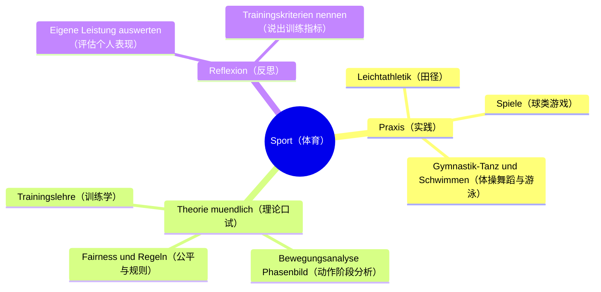
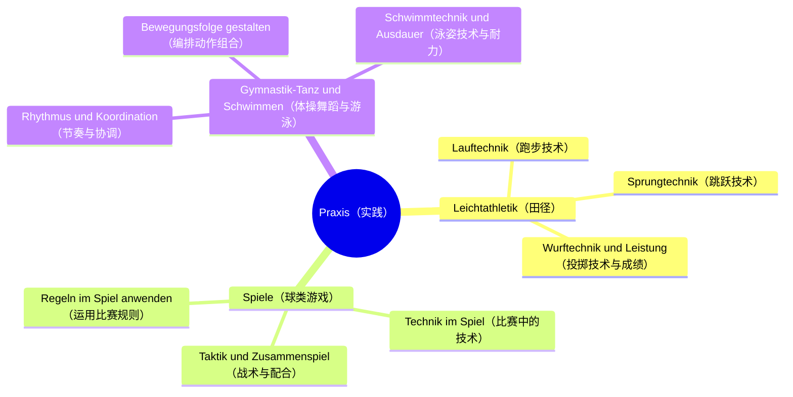
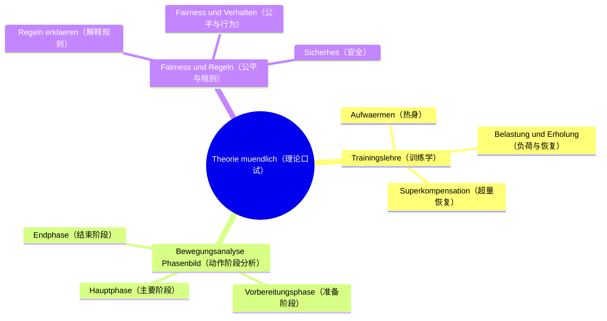
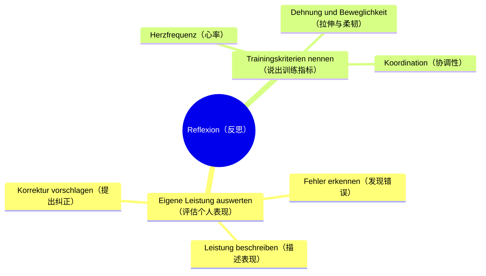

# Lernbaum Sport（体育学习树 · EF 口试）

> 中文：本树自顶向下推导（L0 学科 → L1 内容领域 → L2 重点 → L3 细分主题），只做设计，不挂 vault 笔记链接，不写代码。
> Deutsch: Dieser Lernbaum leitet top-down ab (L0 Fach → L1 Inhaltsfeld → L2 Schwerpunkt → L3 Feinthema). Reine Designphase: keine Vault-Links, kein Code.

## L0 学科根（Fachwurzel）

- 中文一句话：口试=能做更要能讲——把动作按阶段说清、把错误与纠正说准、把训练原理说明白。
- Deutsch (KLP-Bezug + Prüfungs-Fokus): NRW KLP GOSt Sport, EF mündlich. Prüfungs-Fokus: Bewegung in Phasen erklären, Fehler und Korrektur nennen, Trainingsprinzipien und eigene Leistung reflektieren.
- L1 与 `10_Sport-mündl/Lehrplan.md` §1 一一对应（无自创、无合并）：Praxis / Theorie mündlich / Reflexion.
- 口试表达板块（Sprech-Baustein）：`Die Bewegung gliedert sich in … Entscheidend ist …, weil … (biomechanisch/physiologisch).`

## ⏳ 待确认（markiert, regulär weiter entfaltet）

- ⏳ 待确认：Kurs-Schwerpunkte（本学期主攻的运动项目）。
- ⏳ 待确认：Theorie-Thema（口试理论主题）。
- ⏳ 待确认：Prüfungstermin und Form（口试时间与形式：Praxis + Gespräch？）。

## 1. 总览 mindmap（L0 → L1 → L2）

## 2. 分 L1 mindmap（展开到 L3）

### L1-1 Praxis

### L1-2 Theorie mündlich

### L1-3 Reflexion

## 3. 节点明细（L3：中文 + Operatoren + Prüfungs-Anbindung + Leitfrage）

## L1-1 Praxis（实践）

### L2-1 Leichtathletik（田径）

- **L3 Lauftechnik（跑步技术）**
  - 中文一句话：说清步频、步幅、摆臂与呼吸配合，并能示范要点。
  - Operatoren: [beschreiben, demonstrieren]
  - Prüfungs-Anbindung: Praxis-Nachweis + 口头解释（Technik erklären）；板块句 `Die Bewegung gliedert sich in …`.
  - Leitfrage DE / ZH: `Was macht eine ökonomische Lauftechnik aus? / 经济的跑步技术要点是什么？`
- **L3 Sprungtechnik（跳跃技术）**
  - 中文一句话：按准备—起跳—腾空—落地四步说清跳跃动作。
  - Operatoren: [beschreiben, gliedern]
  - Prüfungs-Anbindung: Phasenbild 解释 + Praxis 展示；典型错误与纠正必问。
  - Leitfrage DE / ZH: `Wie gliedert sich der Sprung in Phasen? / 跳跃动作分哪几个阶段？`
- **L3 Wurftechnik und Leistung（投掷技术与成绩）**
  - 中文一句话：讲清持球、引体、出手角度与随挥，成绩与技术挂钩。
  - Operatoren: [beschreiben, auswerten]
  - Prüfungs-Anbindung: Leistungsnachweis（成绩）+ 口头归因（Technik → Weite）。
  - Leitfrage DE / ZH: `Entscheidend ist beim Wurf …, weil …? / 投掷的关键是什么、为什么？`

### L2-2 Spiele（球类游戏）

- **L3 Technik im Spiel（比赛中的技术）**
  - 中文一句话：说出本课程球类的 2–3 项核心技术及其要点。
  - Operatoren: [beschreiben, demonstrieren]
  - Prüfungs-Anbindung: Praxis-Demo + Kurz-Erklärung（课程项目 ⏳ 待确认后填充具体球种）。
  - Leitfrage DE / ZH: `Was sind die technischen Schlüsselpunkte? / 技术关键点是什么？`
- **L3 Taktik und Zusammenspiel（战术与配合）**
  - 中文一句话：讲清跑位、传接与空间利用，不只说个人技术。
  - Operatoren: [erläutern, darstellen]
  - Prüfungs-Anbindung: Gespräch 追问（"Erklären Sie eine Spielszene"）。
  - Leitfrage DE / ZH: `Wie schafft Zusammenspiel Raumvorteil? / 配合如何创造空间优势？`
- **L3 Regeln im Spiel anwenden（运用比赛规则）**
  - 中文一句话：说出关键规则并能在场上情境中运用。
  - Operatoren: [erklären, anwenden]
  - Prüfungs-Anbindung: 口试规则题（Regel → Spielszene → Entscheidung）。
  - Leitfrage DE / ZH: `Welche Regel gilt in dieser Szene und warum? / 这个场景适用哪条规则、为什么？`

### L2-3 Gymnastik-Tanz / Schwimmen kursabhängig（体操舞蹈 / 游泳，依课程而定）

- **L3 Rhythmus und Koordination（节奏与协调）**
  - 中文一句话：把动作卡在节奏上，说明上下肢协调要点。
  - Operatoren: [beschreiben, demonstrieren]
  - Prüfungs-Anbindung: Praxis-Präsentation（组合/舞蹈片段）+ 要点解说。
  - Leitfrage DE / ZH: `Wie bleibt die Bewegung im Rhythmus? / 动作如何合上节奏？`
- **L3 Bewegungsfolge gestalten（编排动作组合）**
  - 中文一句话：按开头—发展—结尾编排小组合，说明编排理由。
  - Operatoren: [gestalten, begründen]
  - Prüfungs-Anbindung: Gestaltungs-Aufgabe（若课程含 Gymnastik-Tanz）+ Begründung.
  - Leitfrage DE / ZH: `Warum habe ich die Folge so aufgebaut? / 我为什么这样编排组合？`
- **L3 Schwimmtechnik und Ausdauer（泳姿技术与耐力）**
  - 中文一句话：说清一种泳姿的划水、打腿与呼吸节奏及耐力分配。
  - Operatoren: [beschreiben, erläutern]
  - Prüfungs-Anbindung: Praxis-Nachweis（若课程含 Schwimmen ⏳ 待确认）+ Technik-Erklärung.
  - Leitfrage DE / ZH: `Worauf achte ich bei Technik und Einteilung? / 技术与体力分配注意什么？`

## L1-2 Theorie mündlich（理论口试）

### L2-1 Trainingslehre（训练学）

- **L3 Aufwärmen（热身）**
  - 中文一句话：说清热身的目的、内容顺序与强度，避免"跑两圈就行"。
  - Operatoren: [erklären, begründen]
  - Prüfungs-Anbindung: 标准理论开口题（"Erklären Sie das Aufwärmen"）。
  - Leitfrage DE / ZH: `Warum und wie wärme ich mich auf? / 为什么热身、怎样热身？`
- **L3 Belastung und Erholung（负荷与恢复）**
  - 中文一句话：讲清负荷三要素与恢复手段，强度—休息要匹配。
  - Operatoren: [erklären, darstellen]
  - Prüfungs-Anbindung: Gespräch 深化题（Belastung → Erholung → Beispiel）。
  - Leitfrage DE / ZH: `Wie hängen Belastung und Erholung zusammen? / 负荷与恢复是什么关系？`
- **L3 Superkompensation（超量恢复）**
  - 中文一句话：用超量恢复曲线解释"练—休—提高"的时机选择。
  - Operatoren: [erklären, darstellen]
  - Prüfungs-Anbindung: 理论高分题（Modell erklären + Beispiel geben）；若 Theorie-Thema ⏳ 待确认命中此处则为重点。
  - Leitfrage DE / ZH: `Wann setzt der nächste Reiz optimal ein? / 下一次刺激何时加最合适？`

### L2-2 Bewegungsanalyse Phasenbild（动作阶段分析）

- **L3 Vorbereitungsphase（准备阶段）**
  - 中文一句话：说清准备姿势与预拉长为发力创造条件。
  - Operatoren: [beschreiben, erklären]
  - Prüfungs-Anbindung: Phasenbild 三问之首；板块句开头 `Die Bewegung gliedert sich in …`.
  - Leitfrage DE / ZH: `Was bereitet die Hauptphase optimal vor? / 什么为主要阶段做好了准备？`
- **L3 Hauptphase（主要阶段）**
  - 中文一句话：点名发力顺序与关键瞬间，这是决定动作质量的一段。
  - Operatoren: [analysieren, erklären]
  - Prüfungs-Anbindung: 分析核心（"Entscheidend ist …, weil … (biomechanisch)"）。
  - Leitfrage DE / ZH: `Was ist biomechanisch entscheidend? / 从生物力学看决定性的是什么？`
- **L3 Endphase（结束阶段）**
  - 中文一句话：讲清缓冲、平衡与随挥，避免受伤并稳定落地。
  - Operatoren: [beschreiben, begründen]
  - Prüfungs-Anbindung: Phasenbild 收尾 + 安全追问（Abfangen / Gleichgewicht）。
  - Leitfrage DE / ZH: `Wie sichere ich die Bewegung am Ende? / 结尾如何保证安全稳定？`

### L2-3 Fairness und Regeln（公平与规则）

- **L3 Regeln erklären（解释规则）**
  - 中文一句话：用自己的话说出核心规则，不背条文。
  - Operatoren: [erklären, darstellen]
  - Prüfungs-Anbindung: 规则解释题（Regel → Sinn → Beispiel）。
  - Leitfrage DE / ZH: `Was regelt die Regel und wozu? / 这条规则管什么、为了什么？`
- **L3 Fairness und Verhalten（公平与行为）**
  - 中文一句话：举出场上公平/不公平行为并评价，联系尊重与责任。
  - Operatoren: [beurteilen, reflektieren]
  - Prüfungs-Anbindung: 价值判断题（"Beurteilen Sie das Verhalten"）。
  - Leitfrage DE / ZH: `Was ist fair und woran mache ich das fest? / 什么是公平、依据是什么？`
- **L3 Sicherheit（安全）**
  - 中文一句话：说清场地、器材与帮助保护的安全要点。
  - Operatoren: [benennen, begründen]
  - Prüfungs-Anbindung: 安全追问（常与 Praxis 结合问）。
  - Leitfrage DE / ZH: `Wie minimiere ich das Verletzungsrisiko? / 如何把受伤风险降到最低？`

## L1-3 Reflexion（反思）

### L2-1 Eigene Leistung auswerten（评估个人表现）

- **L3 Leistung beschreiben（描述表现）**
  - 中文一句话：用数据与技术要点客观描述自己的表现，不只说感觉。
  - Operatoren: [beschreiben, darstellen]
  - Prüfungs-Anbindung: Reflexion 开场（"Werten Sie Ihre Leistung aus"）。
  - Leitfrage DE / ZH: `Was habe ich konkret geleistet? / 我具体做出了什么表现？`
- **L3 Fehler erkennen（发现错误）**
  - 中文一句话：定位一个主要错误并说明它出现在哪个阶段。
  - Operatoren: [analysieren, benennen]
  - Prüfungs-Anbindung: Fehleranalyse（Fehler + Phase + Ursache）。
  - Leitfrage DE / ZH: `Wo liegt der Hauptfehler und in welcher Phase? / 主要错误在哪里、在哪个阶段？`
- **L3 Korrektur vorschlagen（提出纠正）**
  - 中文一句话：给出一个可练的纠正练习并说明为什么有效。
  - Operatoren: [erläutern, begründen]
  - Prüfungs-Anbindung: 纠正题（Fehler → Korrektur → Begründung, physiologisch/biomechanisch）。
  - Leitfrage DE / ZH: `Mit welcher Übung korrigiere ich und warum? / 用什么练习纠正、为什么有效？`

### L2-2 Trainingskriterien nennen（说出训练指标）

- **L3 Herzfrequenz（心率）**
  - 中文一句话：说清心率作为强度指标的用法，不编具体医学数值。
  - Operatoren: [erklären, anwenden]
  - Prüfungs-Anbindung: 强度控制追问（Belastung steuern über Herzfrequenz）。
  - Leitfrage DE / ZH: `Was sagt die Herzfrequenz über die Belastung? / 心率说明了什么负荷情况？`
- **L3 Dehnung und Beweglichkeit（拉伸与柔韧）**
  - 中文一句话：讲清拉伸时机、方法与柔韧对技术的影响。
  - Operatoren: [erklären, begründen]
  - Prüfungs-Anbindung: 训练计划小题（"Wann und wie dehnen?"）。
  - Leitfrage DE / ZH: `Wann dehne ich wie und wozu? / 何时怎样拉伸、为了什么？`
- **L3 Koordination（协调性）**
  - 中文一句话：说清协调是"多部位合拍"，举一个本课程项目的例子。
  - Operatoren: [erklären, veranschaulichen]
  - Prüfungs-Anbindung: 综合题（Technik + Koordination + Beispiel）。
  - Leitfrage DE / ZH: `Wo zeigt sich Koordination in meiner Sportart? / 在我的项目中协调体现在哪里？`
