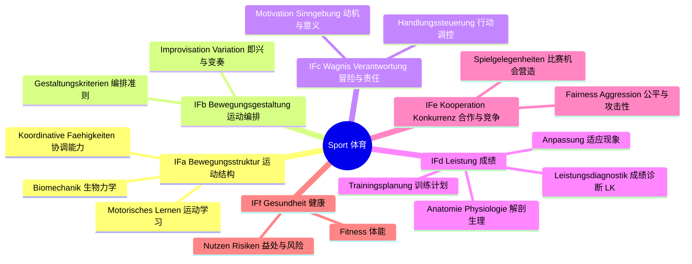
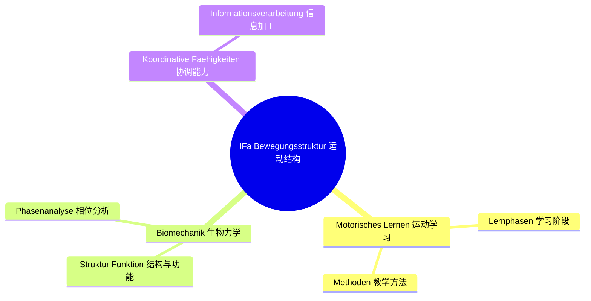
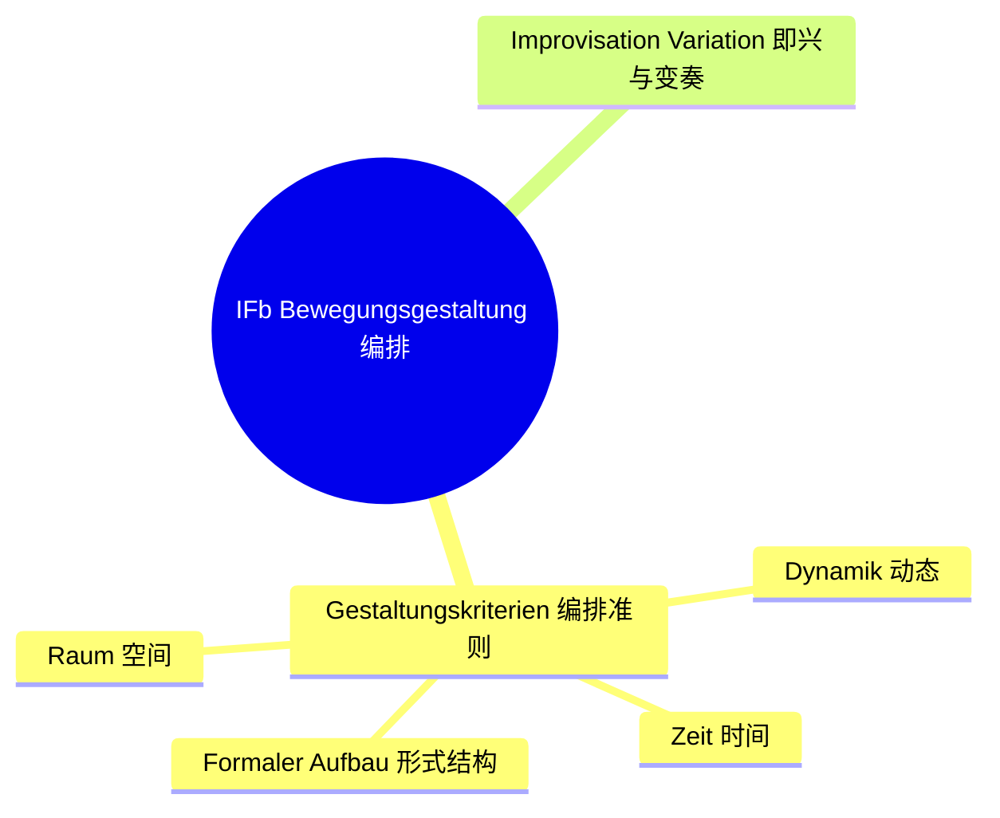
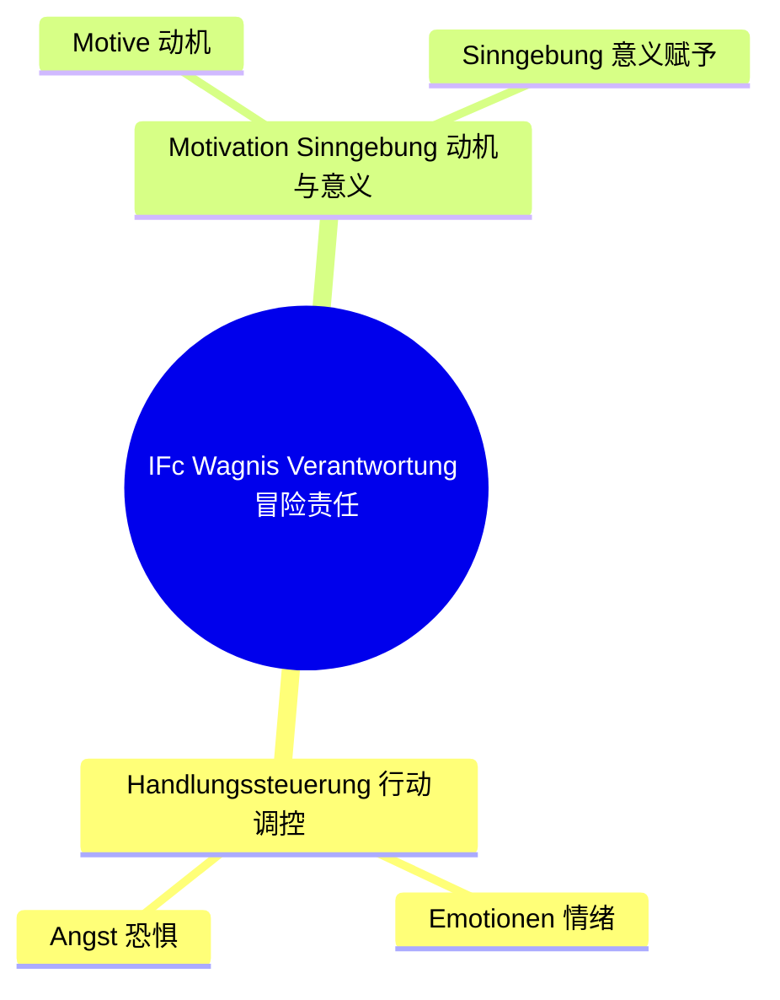
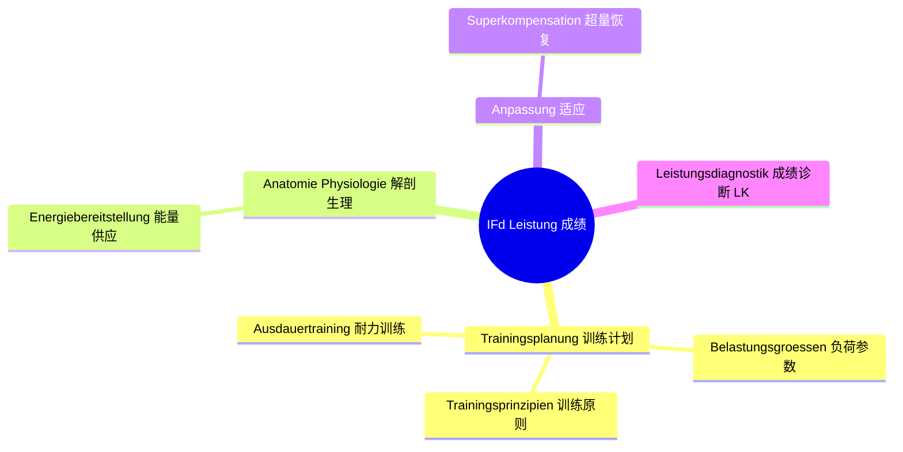
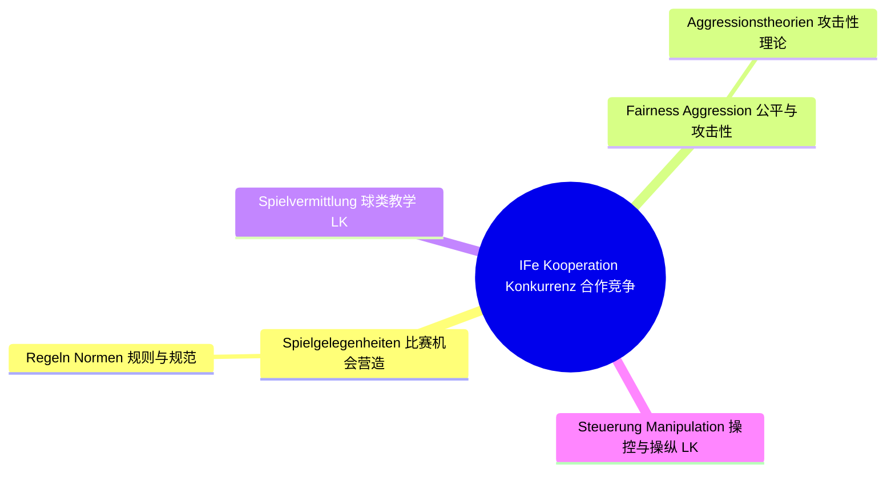
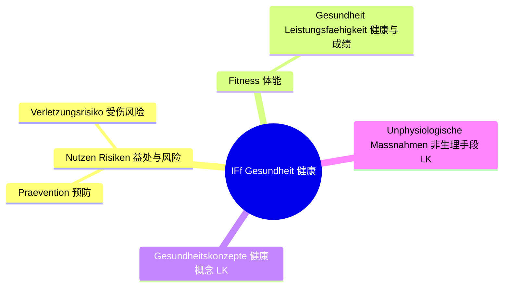

# Lernbaum Sport（体育学习树 · EF→Abitur）

> 中文一句话：体育口试考的是「能做更要能讲」——把动作按阶段说清（Bewegungsanalyse）、把错误与纠正说准、把训练原理说明白（Trainingslehre），并能反思自己的实践。
> KLP-Basis: NRW KLP Sport 2013（Heft 4734，`klp_gost_sport.pdf`）· Klausur-Fokus: **Darstellungs- / Analyse- / Erörterungsaufgabe** + **sportmotorische Testverfahren / Demonstration / Präsentation**；Abitur **LK 300 min 笔试（含选题时间）/ GK 无笔试**，GK 走 fachpraktische Prüfung（理论:实践 = 1:1）。
> ⚠️ **三层正交结构（本学科最难理解处）**：KLP 不写「学铅球」，而写「在**某 BF/SB**（8 个运动项目类）中，就**某 IF**（6 个理论内容领域）的某重点，展现**某 Kompetenzbereich**（4 个能力域）的能力」。**6 个 IF 跨 BF/SB 通用**。[已验证]
> ⚠️ **本项目为口试方向**，课程项目（可换短跑/铅球）**仍是假设** → 相关处标 `⏳ 待确认：`。

---

## 0. Methoden-Profil（方法论画像 —— 本设计第二核心）

### ① Abitur 能力权重（AFB 分布）

| AFB | 层级 | 本课权重 | 说明 |
|---|---|---|---|
| I | Reproduktion | ≈20% | 复述事实、运用并描述练过的方法（`angeben`, `beschreiben`, `darstellen`） |
| II | Reorganisation und Transfer | ≈45% | **主战场**：分析结构、建立关联、独立迁移（`analysieren`, `erklaeren`, `in Beziehung setzen`, `auswerten`） |
| III | Reflexion und Problemlösung | ≈35% | 权衡、评判、表态、设计（`eroertern`, `beurteilen`, `bewerten`, `entwerfen`, `Stellung nehmen`） |

> ⚠️ KLP §4 明确：Abitur 的**书面与口头部分都须覆盖全部三个 AFB，AFB II 为重点**。[已验证]

### ② 黄金学习法（证据来自 `00_META/Lernmethoden-Evidenz.md`）

| 方法 | 证据来源 | 本课应用方式 |
|---|---|---|
| 自我解释（带扶手） | Barbieri 2023（g≈0.48）· Wittwer & Renkl 2010 | 看一段动作后问「这一步用了哪条 biomechanisch 原理？为什么这个相位这样设计？」 |
| 视频/镜像反馈 | Mayer CTML · Brummer 2024（KR 最强 g≈0.64） | **实践—理论挂钩的关键**：录像回看 + 立即对照相位模型，先判对错再讲解 |
| 交错练习 + 对比辨别 | Rohrer & Taylor 2007（d≈1.34）· Foster 2019 | 混练「动作分析 + 训练学 + 健康」三题型，避免只刷一类 |
| 检索练习（合书默述） | Dunlosky 2013「hoch」· Karpicke & Blunt 2011 | 看完相位图后**合书口述四个相位**，再对照（这正是口试 Teil 1 的形式） |
| 先行组织者 | Ausubel | 每个 IF 开头先给「这个理论解决什么实践问题」的框架 |
| 一图一概念 | Mayer CTML · Cromley 2025 | 相位图一次只画一个动作，不做「全家福」 |

### ③ 三大典型失分点

1. **只说「怎么做」不说「为什么」** —— 体育理论答题要求 `theoriegeleitet`（理论引导），必须落到 biomechanisch / physiologisch 原理。
2. **混淆「相位划分」的约定** —— 三相（Vorbereitung/Hauptphase/Endphase）与四相（如 Weitsprung 的 Anlauf/Absprung/Flug/Landung）适用不同动作，混用即失分。
3. **`beurteilen` 与 `bewerten` 不分** —— `beurteilen` 依专业标准（如训练学原理），`bewerten` 依价值与规范（如公平、健康伦理）。

### ④ 本课笔记结构模板（六段）

```
1. Bewegungsbeschreibung（动作描述，按相位，只写观察到的）
2. Phasenmodell（相位模型：哪几个相位、各相位目标）
3. Biomechanisch/physiologische Begründung（生物力学/生理学依据）
4. Fehlerbild und Korrektur（典型错误 + 纠正手段，含 Beobachtungsschwerpunkte）
5. Trainingsbezug（训练学关联：用什么方法练、练什么负荷参数）
6. Reflexion（自我评估 + 依标准的判断）
```

### ⑤ 三层正交结构速查（**本学科的核心机制**）

| 层 | 德语 | 数量 | 作用 |
|---|---|---|---|
| 过程层 | Kompetenzbereiche | **4** | 能力维度 |
| 对象层 1 | Inhaltsfelder (a–f) | **6** | 跨项目的理论内容领域 |
| 对象层 2 | Bewegungsfelder und Sportbereiche (BF/SB) | **8** | 具体运动项目类（实践载体） |

**4 个 Kompetenzbereiche（⚠️ 第 4 个不是 psycho-physische Handlungskompetenz）** [已验证]：

| # | 能力领域 | 中文 | 说明 |
|---|---|---|---|
| 1 | `Bewegungs- und Wahrnehmungskompetenz` | 运动与感知能力 | **中心与起点**（Sport 独有的「实践为根」结构） |
| 2 | `Sachkompetenz` | 事实能力 | Oberstufe 相比 Sek I **新增**；系统掌握运动理论并能解释与评判 |
| 3 | `Methodenkompetenz` | 方法能力 | 含**运动分析方法**、指标与准则对应 |
| 4 | `Urteilskompetenz` | 判断能力 | **依准则（kriteriengeleitet）**的独立判断 |

**8 个 BF/SB 清单** [已验证]：BF/SB1 感知身体（**仅 GK**）· BF/SB3 田径 · BF/SB4 游泳 · BF/SB5 器械体操 · BF/SB6 体操/舞蹈 · BF/SB7 球类游戏 · BF/SB8 轮滑/划船/冬季 · BF/SB9 格斗
> ⚠️ BF/SB2 在 Oberstufe 被排除（整合进 BF/SB7）。

### ⑥ Q 阶段「6 选 2」规则（**决定备考范围**）

- **「2 个 BF/SB」≠「2 个 IF」** —— 两层正交。[已验证]
- **GK 的「6 选 2」** = **2 个 IF 全教 + 4 个 IF 只教第一重点**（KLP 粗体标示那条），**不是「只教 2 个」**。[已验证]
- **LK 无「6 选 2」** —— 6 个 IF 全部重点通吃。[已验证]
- ⏳ **待确认**：本校选定的 2 个 Akzentuierungs-IF 是哪两个？（这是决定备考范围的第一优先信息）

---

## 1. 总览 Gesamtübersicht（L0→L1→L2）


```mermaid
mindmap
  root((Sport 体育))
    IFa Bewegungsstruktur 运动结构
      Motorisches Lernen 运动学习
      Biomechanik 生物力学
      Koordinative Faehigkeiten 协调能力
    IFb Bewegungsgestaltung 运动编排
      Gestaltungskriterien 编排准则
      Improvisation Variation 即兴与变奏
    IFc Wagnis Verantwortung 冒险与责任
      Handlungssteuerung 行动调控
      Motivation Sinngebung 动机与意义
    IFd Leistung 成绩
      Trainingsplanung 训练计划
      Anatomie Physiologie 解剖生理
      Anpassung 适应现象
      Leistungsdiagnostik 成绩诊断 LK
    IFe Kooperation Konkurrenz 合作与竞争
      Spielgelegenheiten 比赛机会营造
      Fairness Aggression 公平与攻击性
    IFf Gesundheit 健康
      Nutzen Risiken 益处与风险
      Fitness 体能
```

---

## 2. 分 IF 展开（L1→L2→L3 + 应试四行）

### L1: IF a — Bewegungsstruktur und Bewegungslernen（运动结构与运动学习）

> 对应教育视角 A：`Wahrnehmungsfähigkeit verbessern, Bewegungserfahrungen erweitern`。
> **第一重点**（EF 与 GK/LK 共通）：`Prinzipien und Konzepte des motorischen Lernens`。


```mermaid
mindmap
  root((IFa Bewegungsstruktur 运动结构))
    Motorisches Lernen 运动学习
      Lernphasen 学习阶段
      Methoden 教学方法
    Biomechanik 生物力学
      Struktur Funktion 结构与功能
      Phasenanalyse 相位分析
    Koordinative Faehigkeiten 协调能力
      Informationsverarbeitung 信息加工
```

#### L2 Prinzipien und Konzepte des motorischen Lernens（运动学习的原则与概念）· **第一重点**

- **Lernphasen-Modell（学习阶段模型）** `[EF]`
  - 中文一句话：技能学习分「粗糙协调 → 精细协调 → 稳定可变」三阶段，各阶段错误类型不同。
  - Klausur-Anbindung：笔试 Darstellungs-/Analyseaufgabe；口试 Teil 1；`Lernphasen beschreiben und Fehler zuordnen`（AFB I→II）。
  - Operatoren：`beschreiben`, `erklaeren`, `einordnen`
  - Lernweg ZH：把三阶段做成「特征 → 典型错误 → 教学对策」三栏表。
  - Fehlerquelle：把阶段模型当固定时间表（实际因人而异）。
  - 📓 笔记：⚠️ 缺口（🟡 IF a 第一重点，必考）
- **Methoden: analytisch-synthetisch vs. Ganzheitsmethode（分解-合成法 vs 整体法）** `[EF]`
  - 中文一句话：教一个动作是拆开教还是整体教？取决于动作复杂度与学习者水平。
  - Klausur-Anbindung：论述题（Erörterungsaufgabe）；`Methoden vergleichen und begruenden`（AFB II→III）。
  - Operatoren：`vergleichen`, `begruenden`, `beurteilen`
  - Lernweg ZH：做「方法 × 适用条件 × 优缺点」对照表，用具体动作举例。
  - Fehlerquelle：断言「整体法更好」而不看适用条件。
  - 📓 笔记：⚠️ 缺口

#### L2 Struktur, Funktion und biomechanische Grundlagen（结构与功能、生物力学）

- **Phasenanalyse（相位分析）** `[EF]`
  - 中文一句话：把动作切成若干相位，逐相说明目标与力学要求——这是 Bewegungsanalyse 的核心工具。
  - Klausur-Anbindung：**Analyseaufgabe（Bewegungsanalyse 属此）**；口试 Teil 1；`Bewegung in Phasen gliedern und erklaeren`（AFB II）。
  - Operatoren：`analysieren`, `erklaeren`, `skizzieren`, `in Beziehung setzen`
  - Lernweg ZH：⚠️ **须分清三相（Vorbereitung/Hauptphase/Endphase）与四相（如 Weitsprung）两种约定**，用 Beobachtungsbogen 逐相记录。
  - Fehlerquelle：⚠️ **混用不同分相约定**（现有笔记缺两套约定的对照说明）。
  - 📓 笔记：✅ [`Sport-Bewegungsanalyse.md`](../../../10_Sport-mündl/Texte-Analyse/Sport-Bewegungsanalyse.md)（Weitsprung 四相/纠错/考官问）
- **Biomechanische Grundlagen（生物力学基础）** `[EF]`
  - 中文一句话：杠杆、力矩、抛物线轨迹——动作的力学解释框架。
  - Klausur-Anbindung：分析题；`Bewegung biomechanisch begruenden`（AFB II）。
  - Operatoren：`erklaeren`, `begruenden`, `analysieren`
  - Lernweg ZH：每个动作至少能说出 2 条力学依据（如起跳角的抛物线与水平/垂直速度分解）。
  - Fehlerquelle：只说「角度合适」而不做速度分解。
  - 📓 笔记：✅ [`Sport-Bewegungsanalyse.md`](../../../10_Sport-mündl/Texte-Analyse/Sport-Bewegungsanalyse.md)

#### L2 Informationsaufnahme und koordinative Fähigkeiten（信息加工与协调能力）· **GK/LK 增量**

- **Informationsaufnahme und -verarbeitung（运动中的信息接收与加工）** `[Q1]`
  - 中文一句话：感官输入 → 中枢加工 → 动作输出，协调能力的神经基础。
  - Klausur-Anbindung：解释题；`Informationsverarbeitung bei Bewegungen erklaeren`（AFB II）。
  - Operatoren：`erklaeren`, `analysieren`, `erlaeutern`
  - Lernweg ZH：做「感知 → 决策 → 执行」三阶段流程图。
  - Fehlerquelle：把「反应速度」与「动作速度」混同。
  - 📓 笔记：⚠️ 缺口
- **Koordinative Fähigkeiten（协调能力及其对成绩的影响）** `[Q1]`
  - 中文一句话：平衡、节奏、空间定向、反应等协调能力直接影响运动成绩。
  - Klausur-Anbindung：分析 + 应用题；`Einfluss koordinativer Faehigkeiten beurteilen`（AFB II）。
  - Operatoren：`analysieren`, `beurteilen`, `erlaeutern`
  - Lernweg ZH：做「协调能力 → 对应测试 → 训练手段」三栏表。
  - Fehlerquelle：只罗列能力名称不联系具体运动。
  - 📓 笔记：⚠️ 缺口

---

### L1: IF b — Bewegungsgestaltung（运动编排）

> 对应教育视角 B：`Sich körperlich ausdrücken, Bewegungen gestalten`。
> **第一重点**：`Gestaltungskriterien`（编排准则）。


```mermaid
mindmap
  root((IFb Bewegungsgestaltung 编排))
    Gestaltungskriterien 编排准则
      Raum 空间
      Zeit 时间
      Dynamik 动态
      Formaler Aufbau 形式结构
    Improvisation Variation 即兴与变奏
```

#### L2 Gestaltungskriterien（编排准则）· **第一重点**

- **Vier Gestaltungskriterien: Raum, Zeit, Dynamik, formaler Aufbau（四大编排准则）** `[EF]`
  - 中文一句话：编排一个动作组合，从空间、时间、动态、形式结构四个维度入手。
  - Klausur-Anbindung：Darstellungs-/Analyseaufgabe；口试 Teil 1；`Gestaltung nach Kriterien analysieren`（AFB II）。
  - Operatoren：`analysieren`, `erlaeutern`, `entwerfen`
  - Lernweg ZH：做「四准则 × Indikatoren」表（这是 LK 明确要求的 `Ausführungs- und Gestaltungskriterien` 结构）。
  - Fehlerquelle：⚠️ **IF b 完全空白** —— 只会说「动作好看」而不落到四准则。
  - 📓 笔记：⚠️ 缺口（🟡 IF b 完全空白）
- **Indikatoren der Gestaltung（编排的可观察指标）** `[EF]`
  - 中文一句话：每个准则都要有可观察的指标，否则无法评判。
  - Klausur-Anbindung：评价题；`Gestaltung mit Indikatoren beurteilen`（AFB II→III）。
  - Operatoren：`beurteilen`, `analysieren`, `bewerten`
  - Lernweg ZH：为每个准则配 2–3 个可观察指标（如「空间」→ 队形变化、方向变化）。
  - Fehlerquelle：评判时不给指标（AFB III 要求 `kriteriengeleitet`）。
  - 📓 笔记：⚠️ 缺口

#### L2 Improvisation und Variation（即兴与变奏）· **GK/LK 增量**

- **Improvisation und Variation von Bewegung（动作的即兴与变奏）** `[Q1]`
  - 中文一句话：在给定框架内即兴变化，是编排能力的实践形态。
  - Klausur-Anbindung：演示/展示题（Demonstration / Präsentation）；`Bewegung improvisieren und variieren`（AFB II）。
  - Operatoren：`entwerfen`, `entwickeln`, `darstellen`
  - Lernweg ZH：先固定一个动素，再逐次只改一个准则（空间/时间/动态）——这是变奏训练的标准法。
  - Fehlerquelle：即兴时四个准则一起变，导致无法归因。
  - 📓 笔记：⚠️ 缺口

---

### L1: IF c — Wagnis und Verantwortung（冒险与责任）

> 对应教育视角 C：`Etwas wagen und verantworten`。
> **第一重点**：`Handlungssteuerung unter verschiedenen psychischen Einflüssen`。


```mermaid
mindmap
  root((IFc Wagnis Verantwortung 冒险责任))
    Handlungssteuerung 行动调控
      Emotionen 情绪
      Angst 恐惧
    Motivation Sinngebung 动机与意义
      Motive 动机
      Sinngebung 意义赋予
```

#### L2 Handlungssteuerung unter psychischen Einflüssen（心理影响下的行动调控）· **第一重点**

- **Emotionen und Handlungssteuerung（情绪与行动调控）** `[EF]`
  - 中文一句话：喜悦、挫折、恐惧如何影响运动中的决策与表现。
  - Klausur-Anbindung：Analyse-/Erörterungsaufgabe；口试 Teil 1；`Handlungssteuerung unter Emotionen erklaeren`（AFB II）。
  - Operatoren：`beschreiben`, `erklaeren`, `beurteilen`
  - Lernweg ZH：用具体情境（比赛紧张、高空项目）做「情绪 → 生理反应 → 行动后果」链。
  - Fehlerquelle：⚠️ **IF c 完全空白**；⚠️ LK 要求 `theoriegeleitet erläutern`（理论引导），GK 只需 `beschreiben`。
  - 📓 笔记：⚠️ 缺口（🟡 IF c 完全空白）
- **Angst und Risikowahrnehmung（恐惧与风险感知）** `[EF]`
  - 中文一句话：风险评估是「冒险」能力的前提——不冒险与盲目冒险都不对。
  - Klausur-Anbindung：评价题；`Risikowahrnehmung beurteilen`（AFB III）。
  - Operatoren：`analysieren`, `beurteilen`, `bewerten`
  - Lernweg ZH：做「客观风险 vs 主观感知」对照表。
  - Fehlerquelle：把「冒险」等同于「不计后果」。
  - 📓 笔记：⚠️ 缺口

#### L2 Motive, Motivation und Sinngebungen（动机与意义赋予）· **GK/LK 增量**

- **Motive und Motivation sportlichen Handelns（运动行动的动机与激励）** `[Q1]`
  - 中文一句话：为什么有人坚持运动、有人放弃？动机理论给出解释。
  - Klausur-Anbindung：解释 + 应用题；`Motivation erklaeren und foerdern`（AFB II）。
  - Operatoren：`erklaeren`, `erlaeutern`, `beurteilen`
  - Lernweg ZH：做「内在 vs 外在动机」对照表，连到实际训练情境。
  - Fehlerquelle：只谈「意志力」而不谈动机结构。
  - 📓 笔记：⚠️ 缺口

---

### L1: IF d — Leistung（成绩）

> 对应教育视角 D：`Das Leisten erfahren, verstehen und einschätzen`。
> ⚠️ **本项目最相关的 IF**（Trainingslehre 全在此）。
> **第一重点**：`Trainingsplanung und -organisation`。


```mermaid
mindmap
  root((IFd Leistung 成绩))
    Trainingsplanung 训练计划
      Belastungsgroessen 负荷参数
      Trainingsprinzipien 训练原则
      Ausdauertraining 耐力训练
    Anatomie Physiologie 解剖生理
      Energiebereitstellung 能量供应
    Anpassung 适应
      Superkompensation 超量恢复
    Leistungsdiagnostik 成绩诊断 LK
```

#### L2 Trainingsplanung und -organisation（训练计划与组织）· **第一重点**

- **Belastungsgrößen: Intensität, Umfang, Dichte, Dauer（负荷参数四要素）** `[EF]`
  - 中文一句话：训练的四个可调旋钮——强度、量、密度、时长，调节它们决定训练效果。
  - Klausur-Anbindung：**Erörterungsaufgabe（Trainingslehre 论述属此）**；口试 Teil 1；`Belastungsgroessen erklaeren und anwenden`（AFB II）。
  - Operatoren：`erklaeren`, `anwenden`, `analysieren`, `beurteilen`
  - Lernweg ZH：做「四参数 × 作用 × 调节示例」表；LK 须能**自行制定训练计划**（`Trainingspläne erstellen`）。
  - Fehlerquelle：⚠️ **IF d 是最大缺口** —— 四参数是最高频考点却零覆盖。
  - 📓 笔记：⚠️ 缺口（🔴 **最大缺口，最高优先**）
- **Trainingsprinzipien（训练原则）** `[EF]`
  - 中文一句话：超负荷、渐进、个体化、周期化等原则是训练设计的宪法。
  - Klausur-Anbindung：论述题；`Trainingsprinzipien anwenden und begruenden`（AFB II→III）。
  - Operatoren：`erklaeren`, `begruenden`, `anwenden`
  - Lernweg ZH：每个原则配一个「违反它会怎样」的反例（对比辨别）。
  - Fehlerquelle：只背原则名称不会应用。
  - 📓 笔记：⚠️ 缺口（🔴 高优先）
- **Ausdauertraining: Methoden und Formen（耐力训练方法与形式）** `[EF]`
  - 中文一句话：持续法、间歇法、重复法各有适用目标，选错方法白练。
  - Klausur-Anbindung：分析 + 评价题；`Ausdauertrainingsmethoden vergleichen`（AFB II）。
  - Operatoren：`vergleichen`, `erklaeren`, `beurteilen`
  - Lernweg ZH：做「方法 × 强度 × 时长 × 效果」四栏表。
  - Fehlerquelle：不知道间歇法的关键变量是间歇时长与强度。
  - 📓 笔记：⚠️ 缺口（🔴 高优先）

#### L2 Anatomische und physiologische Grundlagen（解剖与生理基础）· **GK/LK 增量**

- **Energiebereitstellung（能量供应系统）** `[Q1]`
  - 中文一句话：磷酸原、乳酸、有氧三大供能系统，决定不同强度能维持多久。
  - Klausur-Anbindung：解释题；`Energiebereitstellung erklaeren`（AFB II）。
  - Operatoren：`erklaeren`, `erlaeutern`, `analysieren`
  - Lernweg ZH：做「三系统 × 持续时间 × 强度 × 例子」表（这是训练学的生理基础）。
  - Fehlerquelle：把供能系统当「先后顺序」而非「同时参与、比例不同」。
  - 📓 笔记：⚠️ 缺口
- **Muskulatur und Bewegung（肌肉与运动）** `[Q1]`
  - 中文一句话：肌肉收缩类型（等长/等张/等速）与运动表现的关系。
  - Klausur-Anbindung：分析题；`Muskelarbeit analysieren`（AFB II）。
  - Operatoren：`erklaeren`, `analysieren`, `erlaeutern`
  - Lernweg ZH：做「收缩类型 × 特征 × 训练应用」表。
  - Fehlerquelle：把「肌肉酸痛」与「超量恢复」混同。
  - 📓 笔记：⚠️ 缺口

#### L2 Entwicklung der Leistungsfähigkeit / Anpassung（成绩发展与适应）· **GK/LK 增量**

- **Superkompensation（超量恢复）** `[Q1]`
  - 中文一句话：训练后先下降再恢复并超过原有水平——这是训练有效的生理机制。
  - Klausur-Anbindung：核心解释题；`Superkompensation erklaeren`（AFB II）。
  - Operatoren：`erklaeren`, `analysieren`, `beurteilen`
  - Lernweg ZH：画「负荷 → 疲劳 → 恢复 → 超量恢复」曲线图（一图一概念）。
  - Fehlerquelle：不知道训练间隔必须落在超量恢复期才能提高。
  - 📓 笔记：⚠️ 缺口（🔴 高优先）
- **Anpassungserscheinungen（适应现象）** `[Q1]`
  - 中文一句话：长期训练引起的心肺、肌肉、神经系统的结构性适应。
  - Klausur-Anbindung：分析题；`Anpassungserscheinungen erklaeren`（AFB II）。
  - Operatoren：`erklaeren`, `erlaeutern`, `analysieren`
  - Lernweg ZH：做「系统 × 适应表现 × 训练刺激」三栏表。
  - Fehlerquelle：只谈肌肉不谈心肺与神经适应。
  - 📓 笔记：⚠️ 缺口

#### L2 Verfahren zur Leistungsdiagnostik（成绩诊断方法）· **LK 独有**

- **Verfahren zur Leistungsdiagnostik（成绩诊断方法）** `[LK]`
  - 中文一句话：用可定量的测试法测量运动能力，为训练计划提供依据。
  - Klausur-Anbindung：sportmotorische Testverfahren 题型；`Testverfahren auswerten und beurteilen`（AFB II→III）。
  - Operatoren：`auswerten`, `beurteilen`, `erlaeutern`
  - Lernweg ZH：做「测试法 × 测什么 × 如何解读」表。
  - Fehlerquelle：⚠️ **GK 不考此条**（LK 独有第 4 条）。
  - 📓 笔记：⚠️ 缺口（LK 专属）

---

### L1: IF e — Kooperation und Konkurrenz（合作与竞争）

> 对应教育视角 E：`Kooperieren, wettkämpfen und sich verständigen`。
> **第一重点**：`Gestaltung von Spiel- und Sportgelegenheiten`。


```mermaid
mindmap
  root((IFe Kooperation Konkurrenz 合作竞争))
    Spielgelegenheiten 比赛机会营造
      Regeln Normen 规则与规范
    Fairness Aggression 公平与攻击性
      Aggressionstheorien 攻击性理论
    Spielvermittlung 球类教学 LK
    Steuerung Manipulation 操控与操纵 LK
```

#### L2 Gestaltung von Spiel- und Sportgelegenheiten（比赛与运动机会的营造）· **第一重点**

- **Regeln und Normen im Sport（运动中的规则与规范）** `[EF]`
  - 中文一句话：规则不只是限制，它也创造比赛的可能性——改规则即改玩法。
  - Klausur-Anbindung：Darstellungs-/Analyseaufgabe；口试 Teil 1；`Regeln analysieren und veraendern`（AFB II）。
  - Operatoren：`analysieren`, `entwickeln`, `beurteilen`
  - Lernweg ZH：做「规则改动 → 战术变化 → 参与度变化」推演。
  - Fehlerquelle：⚠️ **IF e 完全空白**。
  - 📓 笔记：⚠️ 缺口（🟡 IF e 完全空白）
- **Organisation von Spielgelegenheiten（比赛机会的组织）** `[EF]`
  - 中文一句话：如何设计让不同水平都能参与的比赛形式（如小场地、人数调整）。
  - Klausur-Anbindung：设计 + 评价题；`Spielformen entwerfen und beurteilen`（AFB III）。
  - Operatoren：`entwerfen`, `entwickeln`, `beurteilen`
  - Lernweg ZH：用「目标 → 形式设计 → 参与度评估」三步。
  - Fehlerquelle：只谈竞技性忽略参与度。
  - 📓 笔记：⚠️ 缺口

#### L2 Fairness und Aggression（公平与攻击性）· **GK/LK 增量**

- **Fairness und Aggression im Sport（运动中的公平与攻击性）** `[Q1]`
  - 中文一句话：攻击性有其功能与边界，公平是竞技的前提而非装饰。
  - Klausur-Anbindung：Erörterungsaufgabe；`Fairness und Aggression eroertern`（AFB III）。
  - Operatoren：`eroertern`, `beurteilen`, `bewerten`, `Stellung nehmen`
  - Lernweg ZH：做「建设性攻击 vs 破坏性攻击」对照表 + 公平的哲学依据。
  - Fehlerquelle：把「攻击性」一律当负面（竞技中它有功能）。
  - 📓 笔记：⚠️ 缺口
- **Fairplay und Regelverstöße（公平竞赛与违规）** `[Q1]`
  - 中文一句话：什么时候违规是「聪明的战术」，什么时候是不道德的？
  - Klausur-Anbindung：评价题；`Regelverstoesse beurteilen`（AFB III）。
  - Operatoren：`beurteilen`, `bewerten`, `problematisieren`
  - Lernweg ZH：用具体案例（如故意犯规）做「规则 → 伦理 → 判断」三步。
  - Fehlerquelle：只做规则判断不做伦理判断。
  - 📓 笔记：⚠️ 缺口

#### L2 LK-Vertiefung: Spielvermittlung und Manipulation · **LK 独有**

- **Spielvermittlungsmodelle（球类教学模型）** `[LK]`
  - 中文一句话：先教战术还是先教技术？教学模型给出不同答案（如 TGfU 类概念）。
  - Klausur-Anbindung：比较 + 应用题；`Spielvermittlungsmodelle vergleichen`（AFB II→III）。
  - Operatoren：`vergleichen`, `erlaeutern`, `beurteilen`
  - Lernweg ZH：做「技术优先 vs 战术优先」对照表，配教学情境。
  - Fehlerquelle：⚠️ **GK 不考此条**（LK 独有）。
  - 📓 笔记：⚠️ 缺口（LK 专属）
- **Formen der Steuerung und Manipulation im Sport（运动中的操控与操纵）** `[LK]`
  - 中文一句话：兴奋剂、赞助、观众利益等外部力量如何影响竞技。
  - Klausur-Anbindung：评价题；`Steuerung und Manipulation beurteilen`（AFB III）。
  - Operatoren：`analysieren`, `beurteilen`, `bewerten`, `problematisieren`
  - Lernweg ZH：做「操控形式 × 利益方 × 后果」矩阵表。
  - Fehlerquelle：⚠️ **GK 不考此条**（LK 独有）。
  - 📓 笔记：⚠️ 缺口（LK 专属）

---

### L1: IF f — Gesundheit（健康）

> 对应教育视角 F：`Gesundheit fördern, Gesundheitsbewusstsein entwickeln`。
> **第一重点**：`Gesundheitlicher Nutzen und Risiken des Sporttreibens`。


```mermaid
mindmap
  root((IFf Gesundheit 健康))
    Nutzen Risiken 益处与风险
      Praevention 预防
      Verletzungsrisiko 受伤风险
    Fitness 体能
      Gesundheit Leistungsfaehigkeit 健康与成绩
    Gesundheitskonzepte 健康概念 LK
    Unphysiologische Massnahmen 非生理手段 LK
```

#### L2 Gesundheitlicher Nutzen und Risiken（健康的益处与风险）· **第一重点**

- **Nutzen des Sporttreibens（运动的健康益处）** `[EF]`
  - 中文一句话：规律运动改善心肺、代谢、心理状态——这是预防医学的核心结论。
  - Klausur-Anbindung：Darstellungs-/Erörterungsaufgabe；口试 Teil 1；`Gesundheitlichen Nutzen erklaeren`（AFB II）。
  - Operatoren：`erklaeren`, `erlaeutern`, `begruenden`
  - Lernweg ZH：做「系统 → 益处 → 生理机制」三栏表。
  - Fehlerquelle：⚠️ **IF f 完全空白**；只说「运动有益健康」不给机制。
  - 📓 笔记：⚠️ 缺口（🟡 IF f 完全空白）
- **Risiken und Prävention（风险与预防）** `[EF]`
  - 中文一句话：运动也有受伤与过劳风险，热身、负荷控制、恢复是防护三件套。
  - Klausur-Anbindung：分析 + 评价题；`Risiken beurteilen und Praevention ableiten`（AFB II→III）。
  - Operatoren：`analysieren`, `beurteilen`, `entwickeln`
  - Lernweg ZH：做「风险源 → 预防措施 → 原理」表。
  - Fehlerquelle：把热身只说成「防止拉伤」而不说生理机制（升温/激活）。
  - 📓 笔记：⚠️ 缺口

#### L2 Fitness als Basis（体能作为基础）· **GK/LK 增量**

- **Fitness als Basis für Gesundheit und Leistungsfähigkeit（体能作为健康与成绩的基础）** `[Q1]`
  - 中文一句话：体能是健康与运动成绩的共同底座，五要素各有训练手段。
  - Klausur-Anbindung：分析题；`Fitnesskomponenten erklaeren und zuordnen`（AFB II）。
  - Operatoren：`erklaeren`, `einordnen`, `analysieren`
  - Lernweg ZH：做「体能五要素 × 测试 × 训练」表。
  - Fehlerquelle：把「体能」等同于「耐力」。
  - 📓 笔记：⚠️ 缺口

#### L2 LK-Vertiefung: Gesundheitskonzepte und Doping · **LK 独有**

- **Gesundheitskonzepte（健康概念）** `[LK]`
  - 中文一句话：健康不只是「没病」——WHO 的全面健康观与运动行动的关系。
  - Klausur-Anbindung：讨论题；`Gesundheitskonzepte eroertern`（AFB III）。
  - Operatoren：`eroertern`, `beurteilen`, `bewerten`
  - Lernweg ZH：做「消极健康观 vs 积极健康观」对照表。
  - Fehlerquelle：⚠️ **GK 不考此条**（LK 独有）。
  - 📓 笔记：⚠️ 缺口（LK 专属）
- **Unphysiologische Maßnahmen zur Leistungssteigerung（非生理性成绩提升手段 / Doping）** `[LK]`
  - 中文一句话：兴奋剂等非生理手段的作用与风险，是竞技伦理的核心议题。
  - Klausur-Anbindung：评价题；`Doping beurteilen und bewerten`（AFB III）。
  - Operatoren：`analysieren`, `beurteilen`, `bewerten`, `Stellung nehmen`, `problematisieren`
  - Lernweg ZH：做「手段 × 作用机制 × 健康风险 × 伦理问题」四栏表。
  - Fehlerquelle：⚠️ **GK 不考此条**（LK 独有，但口试可能涉及健康伦理）。
  - 📓 笔记：⚠️ 缺口（LK 专属）

---

## 3. Abitur-Übergang（EF→Q1→Q2 衔接台阶）

> ⚠️ Sport 的 6 个 IF 在 EF/GK/LK **全程恒定**（不换 IF），差异在**每个 IF 下的重点数量与深度**。

| # | 台阶 | 从（EF） | 到（Q） | 缺口 | 对策 |
|---|---|---|---|---|---|
| 1 | **重点数扩张** | 每个 IF **仅 1 条**（第一重点） | GK：2–4 条 / LK：全满 | EF 只学骨架 | 按「EF 骨架 → GK 血肉 → LK 全套」三层规划 |
| 2 | **「6 选 2」机制** 🎯 | EF 无此机制 | GK：**2 个 IF 全教 + 4 个只教第一重点** | 4 个 IF 的第一重点**仍是考点** | ⏳ **先确认本校选哪 2 个**（决定备考重心） |
| 3 | **理论化程度提升** | GK：`beschreiben`/`erlaeutern` | LK：`theoriegeleitet erläutern` | 从「描述」升级为「理论引导」 | 每个现象都要能说出理论依据 |
| 4 | **自主制定能力** | EF：无 | LK：须**自行制定训练计划**（`Trainingspläne erstellen`） | 从「懂原理」到「会设计」 | 练习用四参数设计一个训练周计划 |
| 5 | **LK 专属 5 条** | 无 | 成绩诊断 / 球类教学模型 / 操控形式 / 健康概念 / Doping | 备考 LK 者须速补 | 见 §4 缺口清单标 `[LK]` 项 |

### GK / LK 差异总表

| IF | EF 重点数 | GK 重点数 | LK 重点数 | LK 独有条目 |
|---|---|---|---|---|
| a Bewegungsstruktur | 1 | 4 | 4 | — |
| b Bewegungsgestaltung | 1 | 2 | 2 | —（仅理论化程度提升） |
| c Wagnis und Verantwortung | 1 | 2 | 2 | —（仅理论化程度提升） |
| d Leistung | 1 | 3 | 4 | `Verfahren zur Leistungsdiagnostik` |
| e Kooperation und Konkurrenz | 1 | 2 | 4 | `Spielvermittlungsmodelle` · `Formen der Steuerung und Manipulation` |
| f Gesundheit | 1 | 2 | 4 | `Gesundheitskonzepte` · `unphysiologische Maßnahmen` |

> **规律**：健康与竞技伦理（f）与球类教学法（e）是 LK 的扩充重点。[据推断]

### 考试轨道（**Sport 独有：实践 + 理论双轨**）

| Sport 作为 | 构成 | 说明 |
|---|---|---|
| **第 2 Abiturfach** | 笔试 + 实践（**3 部分**，含独立耐力部分） | 跨 ≥2 个 BF/SB |
| **第 4 Abiturfach** | 口试 + 实践（**2 部分**，耐力或竞技性二选一） | 跨 2 个 Profil bildend 的 BF/SB |
| **普通口试方向** | 依校方安排 | ← **本项目用户可能走此路线** |

**平时考核（GK 特有）** [已验证]：除 Facharbeit 替代一次 Klausur 外，**其余学期可再以 fachpraktische Prüfung 替代一次**，该考试**理论:实践 = 1:1**。

---

## 4. 笔记缺口清单（施工图）

> ✅ **本施工图已于 2026-09-25 完成**（S8 十科笔记生产）：全部目标笔记已产出，逐条链接见 [`../S8-Noten-Index.md`](../S8-Noten-Index.md)。下表「⚠️ 缺口」为立项时的状态，保留作历史记录。

> 依据 `00_META/INDEX.md` 与 `10_Sport-mündl/` 实际文件核对。
> ⚠️ **现状**：现有 2 篇笔记（+1 课程总览）**均归 IF a**；**IF b/c/d/e/f 全空白**。

| # | L3 节点 | 目标笔记文件 | 状态 |
|---|---|---|---|
| **IF a（已起步但不完整）** | | | |
| 1 | Lernphasen-Modell | `10_Sport-mündl/Texte-Analyse/Motorisches-Lernen-Lernphasen.md` | ⚠️ 缺口（🟡 第一重点，必考） |
| 2 | Lernmethoden（分析-合成 vs 整体） | `10_Sport-mündl/Texte-Analyse/Lernmethoden-Vergleich.md` | ⚠️ 缺口 |
| 3 | Informationsaufnahme und -verarbeitung | `10_Sport-mündl/Texte-Analyse/Informationsverarbeitung-im-Sport.md` | ⚠️ 缺口 |
| 4 | Koordinative Fähigkeiten | `10_Sport-mündl/Texte-Analyse/Koordinative-Faehigkeiten.md` | ⚠️ 缺口 |
| — | Bewegungsanalyse（Weitsprung 四相） | [`Sport-Bewegungsanalyse.md`](../../../10_Sport-mündl/Texte-Analyse/Sport-Bewegungsanalyse.md) | ✅ 已有 |
| — | 运动解释（互动课程） | [`Sport-Bewegung-Erklaeren-L1.md`](../../../Lernreise/Sport-Bewegung-Erklaeren-L1.md) | ✅ 已有 |
| **IF b Bewegungsgestaltung（完全空白）** | | | |
| 5 | Vier Gestaltungskriterien + Indikatoren | `10_Sport-mündl/Texte-Analyse/Gestaltungskriterien-und-Indikatoren.md` | ⚠️ 缺口（🟡 IF b 完全空白） |
| 6 | Improvisation und Variation | `10_Sport-mündl/Texte-Analyse/Improvisation-und-Variation.md` | ⚠️ 缺口 |
| **IF c Wagnis und Verantwortung（完全空白）** | | | |
| 7 | Handlungssteuerung unter Emotionen | `10_Sport-mündl/Texte-Analyse/Handlungssteuerung-unter-Emotionen.md` | ⚠️ 缺口（🟡 IF c 完全空白） |
| 8 | Motive, Motivation und Sinngebungen | `10_Sport-mündl/Texte-Analyse/Motivation-im-Sport.md` | ⚠️ 缺口 |
| **IF d Leistung（🔴 最大缺口，最高优先）** | | | |
| 9 | Belastungsgrößen（四参数） | `10_Sport-mündl/Texte-Analyse/Belastungsgroessen.md` | ⚠️ 缺口（🔴 最高优先） |
| 10 | Trainingsprinzipien | `10_Sport-mündl/Texte-Analyse/Trainingsprinzipien.md` | ⚠️ 缺口（🔴 高优先） |
| 11 | Ausdauertraining: Methoden | `10_Sport-mündl/Texte-Analyse/Ausdauertraining-Methoden.md` | ⚠️ 缺口（🔴 高优先） |
| 12 | Superkompensation / Anpassung | `10_Sport-mündl/Texte-Analyse/Superkompensation-und-Anpassung.md` | ⚠️ 缺口（🔴 高优先） |
| 13 | Energiebereitstellung | `10_Sport-mündl/Texte-Analyse/Energiebereitstellung.md` | ⚠️ 缺口 |
| 14 | Muskulatur und Bewegung | `10_Sport-mündl/Texte-Analyse/Muskulatur-und-Bewegung.md` | ⚠️ 缺口 |
| 15 | [LK] Leistungsdiagnostik | `10_Sport-mündl/Texte-Analyse/LK-Leistungsdiagnostik.md` | ⚠️ 缺口（LK 专属） |
| **IF e Kooperation und Konkurrenz（完全空白）** | | | |
| 16 | Regeln und Spielgelegenheiten | `10_Sport-mündl/Texte-Analyse/Regeln-und-Spielgelegenheiten.md` | ⚠️ 缺口（🟡 IF e 完全空白） |
| 17 | Fairness und Aggression | `10_Sport-mündl/Texte-Analyse/Fairness-und-Aggression.md` | ⚠️ 缺口 |
| 18 | [LK] Spielvermittlungsmodelle | `10_Sport-mündl/Texte-Analyse/LK-Spielvermittlungsmodelle.md` | ⚠️ 缺口（LK 专属） |
| 19 | [LK] Steuerung und Manipulation | `10_Sport-mündl/Texte-Analyse/LK-Steuerung-und-Manipulation.md` | ⚠️ 缺口（LK 专属） |
| **IF f Gesundheit（完全空白）** | | | |
| 20 | Nutzen und Risiken des Sporttreibens | `10_Sport-mündl/Texte-Analyse/Gesundheit-Nutzen-und-Risiken.md` | ⚠️ 缺口（🟡 IF f 完全空白） |
| 21 | Fitness als Basis | `10_Sport-mündl/Texte-Analyse/Fitness-als-Basis.md` | ⚠️ 缺口 |
| 22 | [LK] Gesundheitskonzepte | `10_Sport-mündl/Texte-Analyse/LK-Gesundheitskonzepte.md` | ⚠️ 缺口（LK 专属） |
| 23 | [LK] Doping / unphysiologische Maßnahmen | `10_Sport-mündl/Texte-Analyse/LK-Doping-und-unphysiologische-Massnahmen.md` | ⚠️ 缺口（LK 专属） |
| **跨 IF / 方法层** | | | |
| 24 | 分相约定对照 + Beobachtungsbogen | `10_Sport-mündl/Texte-Analyse/Phasenmodelle-und-Beobachtungsbogen.md` | ⚠️ 缺口（现有笔记缺两套分相约定对照） |
| 25 | 口试话术库（分 IF 专用术语） | `10_Sport-mündl/Klausur-Training/Muendliche-Pruefung-Training.md` | ⚠️ 缺口（🔴 口试方向必补） |
| 26 | 训练计划设计实操（LK） | `10_Sport-mündl/Klausur-Training/Trainingsplan-Erstellen.md` | ⚠️ 缺口（LK 专属） |

### 建议补笔记顺序

1. 🔴 **IF d（Leistung）全套** —— Trainingslehre 是理论核心考点、条目最多，且现有笔记零覆盖。首批补：**Belastungsgrößen → Trainingsprinzipien → Ausdauertraining → Superkompensation**
2. 🔴 **口试话术库**（分 IF 专用术语 + Operator↔AFB 对应）
3. 🟡 **IF a 补全**（Lernphasen 是第一重点，必考）
4. 🟡 **IF b/c/e/f** —— ⏳ **须先确认本校 GK 选中的 2 个 Akzentuierungs-IF**，再定补写顺序（若恰好选中其中某 2 个，则缺口即考点）
5. 🟢 **实践素材（BF/SB）** —— 现有仅 Weitsprung，须确认本校实际 Profil bildend 的 BF/SB

### ⏳ 待确认（阻断性，优先级最高）

1. 本校 Sport 课程 Profil bildend 的是哪 **2 个 BF/SB**？
2. GK 阶段选作 **Akzentuierung 的 2 个 IF** 是哪两个？
3. Abitur 轨道：Sport 作为**第 4 Fach（口试+实践）**，还是普通 mündliche Prüfung？
4. 实践考试的具体项目与耐力测试形式（跑步距离/时长？）
5. 「可换短跑/铅球」是否指 BF/SB3 内的 inhaltliche Kerne 替换？**当前为假设，未经确认。**

---

## 变更记录

- 2026-09-24：创建（S7 Abi-Baum 重构）。由 EF 版（251 行）升级为 EF→Abitur 版。基于 `Sport-Oberstufe.md`（Heft 4734 官方 KLP）、`Operatoren-NRW-Alle-Faecher.md`（Sport 25 动词）、`Klausur-Formate`、`Lernmethoden-Evidenz.md`。
- **修正上游错误**：上游简报列的第 4 个 Kompetenzbereich「psycho-physische Handlungskompetenz」**在 KLP 中不成立**（全文零命中）；实际 4 个为 Bewegungs- und Wahrnehmungskompetenz / Sachkompetenz / Methodenkompetenz / Urteilskompetenz。[已验证]
- 核心转变：学段 EF→EF+Q1+Q2；新增 Methoden-Profil（含三层正交结构速查 + 6 选 2 规则）；每个 L3 补应试四行（覆盖笔试/口试/实践三轨道）；新增 §3 台阶（含考试轨道表）与 §4 缺口清单（26 项）。
- ⚠️ 本学科**无中德对照**（按项目设计，CN-Methode 仅适用理科）。
- ⚠️ 保持诚实的未获取项：平时 Klausur 时长；官方 Sport Operatoren AFB 表；本校 2 个 BF/SB；本校 2 个 Akzentuierungs-IF。

---

## Lernreise 索引（互动课程 · Lesson-v3）

> 本学科互动课程已全部入库（`Lernreise/`，9 步制：entdecken / ausprobieren / check / szenario + Fehlvorstellung）。下表供学习树挂载与复习排程使用。

| # | Thema (DE) | 课程文件 | Ziel | 状态 |
|---|---|---|---|---|
| 1 | Superkompensation und die Prinzipien des Ausdauertrainings | [Sport-Ausdauertraining-Prinzipien-L1.md](../../Lernreise/Sport-Ausdauertraining-Prinzipien-L1.md) | Klausur | ✅ 已建 |
| 2 | Bewegung erklären | [Sport-Bewegung-Erklaeren-L1.md](../../Lernreise/Sport-Bewegung-Erklaeren-L1.md) | Klausur | ✅ 已建 |
| 3 | Die Phasenstruktur der Bewegung und der Beobachtungsbogen | [Sport-Phasenstruktur-Meinel-L1.md](../../Lernreise/Sport-Phasenstruktur-Meinel-L1.md) | Klausur | ✅ 已建 |
| 4 | Biomechanische Optimierung des Weitsprungs: Absprung und Flug | [Sport-Weitsprung-L1.md](../../Lernreise/Sport-Weitsprung-L1.md) | Klausur | ✅ 已建 |
