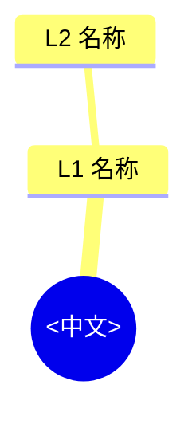

<!--
字段填写说明：
- fach: 必填，取值 Deutsch|Englisch|Mathe|Physik|Chemie|Bio|Philosophie|SoWi|Musik|Sport
- tags: 第二个元素填学科名
- stufe: 本树覆盖学段
- abi_fokus: 一句话说明该科 Abitur 的考查重心
- klp_quelle: 相对链接，如 "Curriculum/Deutschland/SoWi-Oberstufe.md"
-->

# Lernbaum <Fach>（<中文科名>学习树 · EF→Abitur）

> 中文一句话：<该科从 EF 到 Abitur 的主线>
> KLP-Basis: <来源> · Klausur-Fokus: <题型/结构>

## 0. Methoden-Profil（方法论画像 —— 本设计第二核心）

**① Abitur 能力权重**（AFB 分布）
| AFB | 层级 | 本课权重 | 说明 |
|---|---|---|---|
| I | Reproduktion | | |
| II | Reorganisation und Transfer | | |
| III | Reflexion und Problemlösung | | |

**② 黄金学习法**（证据来自 `00_META/Lernmethoden-Evidenz.md`）
| 方法 | 证据来源 | 本课应用方式 |
|---|---|---|
| | | |

**③ 三大典型失分点**
1. 
2. 
3. 

**④ 本课笔记结构模板**
> <描述该科笔记应该长什么样>

## 1. 总览 Gesamtübersicht（L0→L1→L2）

## 2. 分 IF 展开（L1→L2→L3 + 应试四行）

### L1: <IF 官方名称>

#### L2 <名称>

- **<L3 主题名>** `[EF]`
  - 中文一句话：
  - Klausur-Anbindung：
  - Operatoren：
  - Lernweg ZH：
  - Fehlerquelle：
  - 📓 笔记：

<!-- 理科额外加：
  - 🇨🇳 CN-Methode：<技法> · DE-Anschluss: <德国已有工具> · 合规性: ✅
  - 备注：
-->

## 3. Abitur-Übergang（EF→Q1→Q2 衔接台阶）

> 显式标出学段之间的**隐形台阶**（EFA 学完但 Q1 默认你会的、或 Q1 突然加深的）。

| 台阶 | 从 | 到 | 缺口 | 对策 |
|---|---|---|---|---|
| | EF | Q1 | | |

## 4. 笔记缺口清单（施工图）

| L3 节点 | 目标笔记文件 | 状态 |
|---|---|---|
| | | ⚠️ 缺口 / ✅ 已有 |

---

## 变更记录

- YYYY-MM-DD：创建（S7 Abi-Baum 重构）
