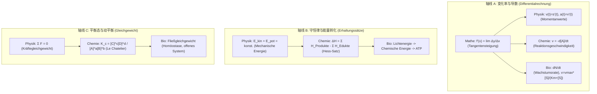

# MINT-Vernetzung-Konzeptkarte (理科大一统图谱)

> **先行组织者核心 (Ausubel 1968)**：数理化生不是四门孤立的科目，而是共用一套公理化自然语言的整体系统。
> - **数学**是抽象描述变化的公理工具（微积分、函数分析）；
> - **物理**将数学投影到时空与能量守恒（运动学、动力学、热力学）；
> - **化学**将物理法则投影到原子分子与化学键能跃迁（化学反应动力学、平衡移动）；
> - **生物**将化学生理投影到细胞机器与复杂开放生态系统（酶动力学、能量代谢、种群稳态）。

---

## 1. 三大统一切入轴线 (Die 3 fundamentalen MINT-Achsen)

---

## 2. 轴线 A：变化率与导数矩阵对照 (Aenderungsrate & Ableitung)

| 学科 | 状态函数 $y = f(x)$ | 平均变化率 (Differenzenquotient) | 瞬时变化率 (Differentialquotient / 1. Ableitung) | Klausur 考法与陷阱 |
|---|---|---|---|---|
| **Mathe** | $y = f(x)$ 任意连续可导曲线 | $\frac{\Delta y}{\Delta x} = \frac{f(x_2)-f(x_1)}{x_2-x_1}$ (Sekantensteigung) | $f'(x_0) = \lim_{h \to 0} \frac{f(x_0+h)-f(x_0)}{h}$ (Tangentensteigung) | 必须写出极限符号 $\lim$；区分割线与切线 |
| **Physik** | $s(t)$ (Ort-Zeit-Verlauf) | $\bar{v} = \frac{\Delta s}{\Delta t}$ (Durchschnittsgeschwindigkeit) | $v(t) = s'(t) = \frac{ds}{dt}$, $a(t) = v'(t) = s''(t)$ | 瞬时速度非标量，有方向；单位换算 $[m/s]$ |
| **Chemie** | $c(t)$ (Konzentration Edukt/Produkt) | $\bar{v} = -\frac{\Delta [A]}{\Delta t}$ (mittlere Reaktionsgeschwindigkeit) | $v(t) = -\frac{d[A]}{dt} = \frac{d[B]}{dt}$ (Momentangeschwindigkeit) | 反应物消耗带负号；反应物分子计量系数除数 |
| **Bio** | $N(t)$ (Populationsgroesse / Substratumsatz) | $\frac{\Delta N}{\Delta t}$ (Zuwachs im Intervall) | $\frac{dN}{dt} = rN(1-\frac{N}{K})$ (logistische Wachstumsrate); Enzymkinetik $v$ | 达到承载量 $K$ 时 $\frac{dN}{dt} = 0$；拐点 $\frac{K}{2}$ 增速最大 |

### 典型联考情境 (MINT-Klausuranker)
- **Mathe $\leftrightarrow$ Physik**: 给定无人机高度函数 $h(t) = -5t^2 + 20t + 2$，求触地速度与最高点。
  - 数学操作：求 $h'(t) = 0$ 解得最高点时间 $t=2s$；求 $h(t)=0$ 得到落地时刻 $t_e$，再代入 $h'(t_e)$。
  - 物理意义：最高点瞬时速度 $v=0$；落地速度为导数值 $h'(t_e)$（大小为 $|v|$，负号表方向向下）。

---

## 3. 轴线 B：守恒律与能量状态变化 (Erhaltungssätze & Energie)

- **物理守恒**：孤立系统中能量既不能被创造，也不能被消灭，只能在不同形式之间转化（$E_{\text{kin}} + E_{\text{pot}} + E_{\text{therm}} = \text{konst.}$）。
- **化学转化**：反应物旧键断裂（吸热 $E_{\text{Bindung}} > 0$）与生成物新键形成（放热 $E_{\text{neu}} < 0$）决定了净反应焓 $\Delta H$。根据盖斯定律（Satz von Hess），反应焓仅取决于始态与终态，与反应途径无关。
- **生物生命维持**：活细胞属于**热力学开放系统**。生命体必须持续吸收高品位能量（光能或有机物化学能）并排出低品位热能与熵，借由 ATP/ADP 循环维持内部高度有序（负熵流）。

---

## 4. 轴线 C：静态平衡 vs 动态平衡 vs 开放流平衡 (Gleichgewichtskonzepte)

> **Rohrer 穿插辨别训练重点**：许多学生混淆了力学平衡、化学平衡与生物稳态。

1. **物理力学平衡 (Statisches / Dynamisches Kräftegleichgewicht)**：
   - 条件：合外力 $\sum \vec{F} = 0$，质心加速度 $a=0$（静止或匀速直线运动）。
2. **化学动态平衡 (Chemisches Gleichgewicht)**：
   - 条件：正逆反应速率相等 $v_{\text{hin}} = v_{\text{rueck}}$，宏观各组分浓度不变，微观反应持续进行。
   - 扰动：勒夏特列原理（Prinzip von Le Chatelier）——增加温度向吸热方向移动；增加压力向分子数减少方向移动。
3. **生物动态稳态 / 流平衡 (Biologisches Fließgleichgewicht / Steady State)**：
   - 绝非封闭静态平衡！系统物质与能量持续流入与流出，各内环境指标（如体温 $37^\circ C$、pH 7.4、血糖浓度）在负反馈（negative Rückkopplung）调节下维持狭窄生理稳态。

---

## 5. 跨学科双链导航与关联 (Vernetzung)

- [[03_Mathe/Analysis-Physik-Kinetik-Vernetzung|Analysis-Physik-Kinetik-Vernetzung]] — 微积分与质点运动学联合突破
- [[05_Chemie/Kinetik-Gleichgewicht-Bio-Vernetzung|Kinetik-Gleichgewicht-Bio-Vernetzung]] — 反应动力学与酶促催化对比
- [[04_Physik/Gleichfoermige-Bewegung-Training|Gleichförmige Bewegung]] — 速度导数基础与实验数据拟合
- [[06_Bio/Zellbiologie-Grundlagen|Zellbiologie-Grundlagen]] — 细胞膜运输与跨膜能量代谢
