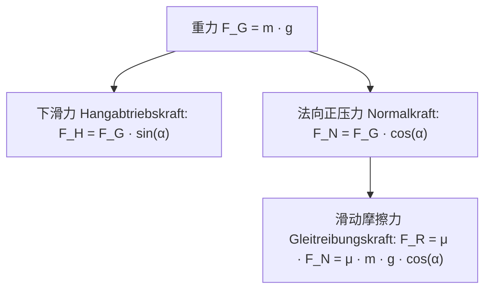

# Newtonsche Gesetze und Kräfte (牛顿运动定律与受力分析)

> **中文理解**：牛顿经典力学三定律是整个物理动力学（Dynamik）的公理化核心。
> 运动学（Kinematik）只描述物体“怎么动”（$s, v, a$），而动力学解释物体“为什么这样动”（力的作用是产生加速度的原因，而非维持速度的原因）：
> 1. **牛顿第一定律（惯性定律 / Trägheitsgesetz）**：物体在合外力为零时，保持静止或匀速直线运动状态；
> 2. **牛顿第二定律（动量定律 / Aktionsprinzip）**：合外力等于质量与加速度的乘积（$\vec{F}_{\text{res}} = m \cdot \vec{a}$）；
> 3. **牛顿第三定律（作用与反作用定律 / Reaktionsprinzip）**：两物体间相互作用力大小相等、方向相反、共线且作用在不同物体上（Actio = Reactio）；
> 4. **斜面与受力分解 (Geneigte Ebene & Kräftezerlegung)**：重力分解为沿斜面向下的下滑力与垂直斜面的支持力；
> 5. **机械能守恒 (Energieerhaltungssatz)**：在只有重力/弹力做功的保守力场中，动能与势能相互转化，总机械能保持恒定。

---

## 1. 核心物理公理与公式对照 (Die drei Newtonschen Axiome)

| 定律名称 | 德语学术名称 | 数学表达式 | 物理实质 (Physikalische Bedeutung) | 德语 Klausur 标准判据句 |
|---|---|---|---|---|
| **牛顿第一定律** | *1. Newtonsches Axiom (Trägheitsprinzip)* | $\sum \vec{F} = \vec{0} \implies \vec{v} = \text{konstant}$ | 保持静止或匀速直线运动，不需要外力维持 | *Ein Körper verharrt im Zustand der Ruhe oder der gleichförmigen geradlinigen Bewegung, solange keine resultierende äußere Kraft auf ihn wirkt.* |
| **牛顿第二定律** | *2. Newtonsches Axiom (Aktionsprinzip)* | $\vec{F}_{\text{res}} = m \cdot \vec{a} = m \cdot \frac{d\vec{v}}{dt}$ | 力是改变运动状态（产生加速度）的原因；加速度与合力同向 | *Die Beschleunigung eines Körpers ist direkt proportional zur resultierenden Kraft und umgekehrt proportional zu seiner Masse.* |
| **牛顿第三定律** | *3. Newtonsches Axiom (Reaktionsprinzip)* | $\vec{F}_{A \to B} = -\vec{F}_{B \to A}$ | 作用力与反作用力成对出现，同生同灭，作用在两个不同物体上 | *Kräfte treten immer paarweise auf: Übt ein Körper A eine Kraft auf einen Körper B aus, so wirkt eine gleich große, entgegengesetzt gerichtete Kraft von B auf A (Actio gleich Reactio).* |

---

## 2. 斜面受力分解与摩擦力模型 (Kräftezerlegung an der geneigten Ebene)

设物体质量为 $m$，斜面倾角为 $\alpha$，重力加速度为 $g$：

### 动力学方程与加速度推导 (Bewegungsgleichung):
- 沿斜面方向的合力：
  $$F_{\text{res}} = F_H - F_R = m \cdot g \cdot \sin(\alpha) - \mu \cdot m \cdot g \cdot \cos(\alpha)$$
- 根据牛顿第二定律求下滑加速度 $a$：
  $$a = \frac{F_{\text{res}}}{m} = g \cdot (\sin(\alpha) - \mu \cdot \cos(\alpha))$$

> **关键物理洞察**：物体的下滑加速度与物体自身的质量 $m$ **完全无关**！在无摩擦理想斜面上，加速度严格仅取决于倾角 $\alpha$：$a = g \cdot \sin(\alpha)$。

---

## 3. 北威州标准模考计算题 (Klausur-Musterfall)

### 任务情境 (Aufgabenstellung)
Ein Testfahrzeug der Masse $m = 1200\,\text{kg}$ fährt mit einer Anfangsgeschwindigkeit von $v_0 = 72\,\text{km/h}$ auf horizontaler Fahrbahn. Plötzlich leitet der Fahrer eine Vollbremsung ein. Die Bremskraft der Reifen auf dem Asphalt beträgt konstant $F_{\text{Brems}} = 6000\,\text{N}$.

#### 子任务 1 (Operator: berechnen)
> *Berechnen Sie die Bremsverzögerung $a$ sowie den Anhalteweg $s_{\text{Brems}}$ des Fahrzeugs.*

**推演步骤 (Lösungsschritte)**:
1. **单位转换 (Einheitenumrechnung)**:
   $$v_0 = 72\,\frac{\text{km}}{\text{h}} = \frac{72}{3{,}6}\,\frac{\text{m}}{\text{s}} = 20\,\frac{\text{m}}{\text{s}}$$

2. **根据牛顿第二定律求加速度 (Verzögerung)**:
   由于阻力与运动方向相反：
   $$F_{\text{res}} = -F_{\text{Brems}} = m \cdot a \implies a = \frac{-6000\,\text{N}}{1200\,\text{kg}} = -5\,\frac{\text{m}}{\text{s}^2}$$
   > *Klausur-Satz*: Die Bremsverzögerung des Fahrzeugs beträgt $a = 5\,\text{m/s}^2$ (in Gegenrichtung zur Bewegung).

3. **根据运动学规律求制动距离 (Bremsweg)**:
   末速度 $v(t) = 0$：
   $$v(t) = v_0 + a \cdot t = 0 \implies t_{\text{Brems}} = \frac{-v_0}{a} = \frac{-20}{-5} = 4\,\text{s}$$
   $$s_{\text{Brems}} = v_0 \cdot t + \frac{1}{2} a \cdot t^2 = 20 \cdot 4 + \frac{1}{2} \cdot (-5) \cdot (4)^2 = 80 - 40 = 40\,\text{m}$$
   *(亦可由无时间公式快速验算：$v^2 - v_0^2 = 2as \implies 0 - 20^2 = 2(-5)s \implies s = \frac{-400}{-10} = 40\,\text{m}$)*

4. **Klausur 答题规范句 (DE)**:
   > *Unter der konstanten Bremskraft von $6000\,\text{N}$ erfährt das Fahrzeug eine konstante Verzögerung von $5\,\text{m/s}^2$. Der resultierende Bremsweg bis zum vollständigen Stillstand beträgt genau $40\,\text{m}$.*

---

## 4. 机械能守恒与做功定理 (Arbeit und Energieerhaltung)

- **物理功 (Mechanische Arbeit)**: $W = \vec{F} \cdot \vec{s} = F \cdot s \cdot \cos(\varphi)$（单位：$\text{J} = \text{N}\cdot\text{m}$）；
- **动能 (Kinetische Energie)**: $E_{\text{kin}} = \frac{1}{2}mv^2$；
- **重力势能 (Potenzielle Energie)**: $E_{\text{pot}} = m \cdot g \cdot h$；
- **守恒定律陈述 (Erhaltungssatz)**:
  > *In einem abgeschlossenen System, in dem nur konservative Kräfte (wie die Gravitationskraft) wirken, ist die Summe aus kinetischer und potenzieller Energie zu jedem Zeitpunkt konstant: $E_{\text{kin}} + E_{\text{pot}} = \text{konstant}$.*
